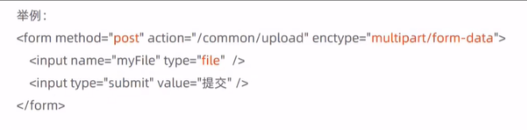
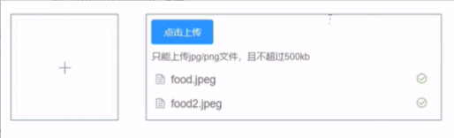
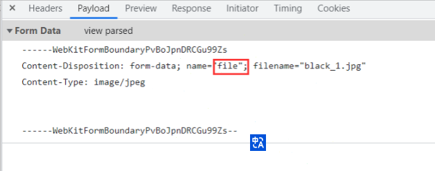
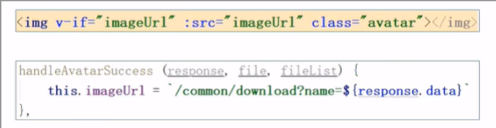
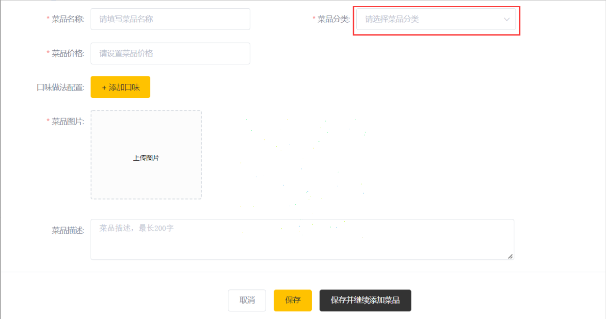
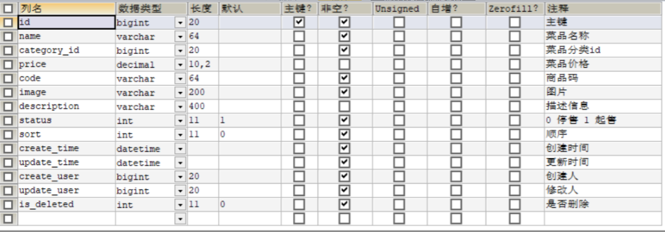
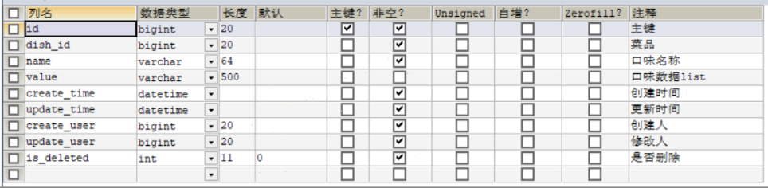
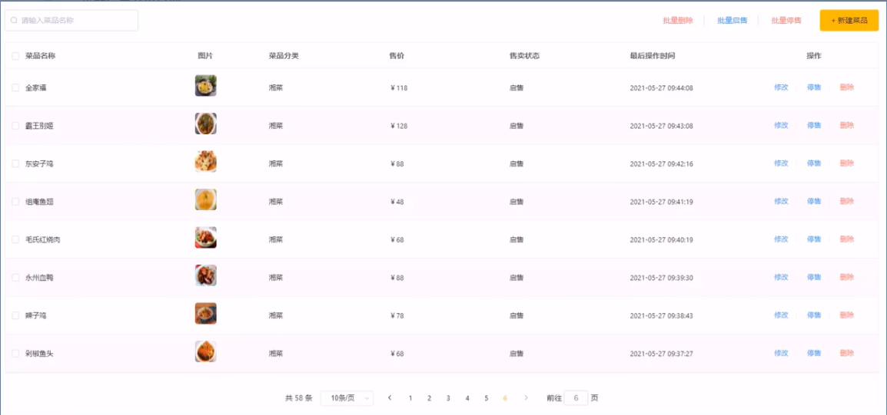
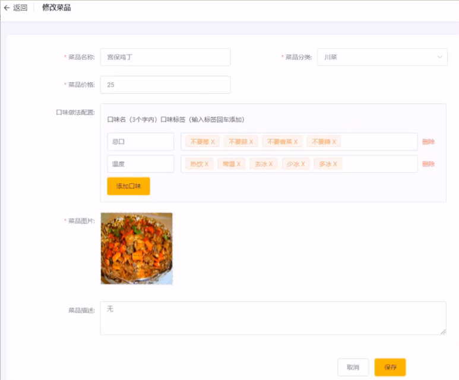
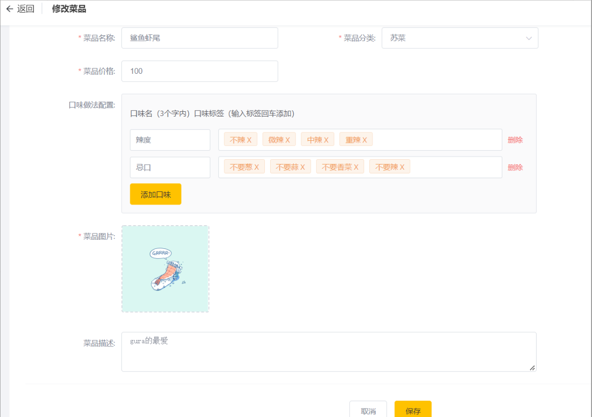

# Reggie 开发笔记 四

[[TOC]]

## 菜品管理业务开发

### 文件上传下载

#### 文件上传介绍

文件上传，也称为 upload，是指将本地图片、视频、音频等文件上传到服务器上，可以供其他用户浏览或下载的过程。文件上传在项目中应用非常广泛，我们经常发微博、发微信朋友圈都用到了文件上传功能。

文件上传时，对页面的 form 表单有如下要求:

- method="post" 　　　　　　　　　　　采用 post 方式提交数据
- enctype="multipart/form-data" 　　　　采用 multipart 格式上传文件
- type="file"　　　　　　　　　　　　 　使用 input 的 file 控件上传
  

目前一些前端组件库也提供了相应的上传组件，但是底层原理还是基于 form 表单的文件上传。例如 ElementUI 中提供的 upload 上传组件:


服务端要接收客户端页面上传的文件，通常都会使用 Apache 的两个组件:

- commons-fileupload
- commons-io

Spring 框架在 spring-web 包中对文件上传进行了封装，大大简化了服务端代码，我们只需要在 Controller 的方法中声明一个 MultipartFile 类型的参数即可接收上传的文件。

#### 文件下载介绍

文件下载，也称为 download，是指将文件从服务器传输到本地计算机的过程。
通过浏览器进行文件下载，通常有两种表现形式:

- 以附件形式下载，弹出保存对话框，将文件保存到指定磁盘目录
- 直接在浏览器中打开

通过浏览器进行文件下载，本质上就是服务端将文件以流的形式写回浏览器的过程。

#### 文件上传代码实现

文件上传，页面端可以使用 ElementuI 提供的上传组件。
可以直接使用资料中提供的上传页面，位置:资料/文件上传下载页面/upload.html

```html
<!DOCTYPE html>
<html lang="en">
    <head>
        <meta charset="UTF-8">
        <meta http-equiv="X-UA-Compatible" content="IE=edge">
        <meta name="viewport" content="width=device-width, initial-scale=1.0">
        <title>文件上传</title>
        <!-- 引入样式 -->
        <link rel="stylesheet" href="../../plugins/element-ui/index.css" />
        <link rel="stylesheet" href="../../styles/common.css" />
        <link rel="stylesheet" href="../../styles/page.css" />
        <link rel="shortcut icon" href="../../favicon.ico">
    </head>
    <body>
        <div class="addBrand-container" id="food-add-app">
            <div class="container">
                <el-upload class="avatar-uploader"
                           action="/common/upload"
                           :show-file-list="false"
                           :on-success="handleAvatarSuccess"
                           :before-upload="beforeUpload"
                           ref="upload">
                    </img>
                <i v-else class="el-icon-plus avatar-uploader-icon"></i>
                </el-upload>
        </div>
        </div>
    <!-- 开发环境版本，包含了有帮助的命令行警告 -->
    <script src="../../plugins/vue/vue.js"></script>
    <!-- 引入组件库 -->
    <script src="../../plugins/element-ui/index.js"></script>
    <!-- 引入axios -->
    <script src="../../plugins/axios/axios.min.js"></script>
    <script src="../../js/index.js"></script>
    <script>
        new Vue({
            el: '#food-add-app',
            data() {
                return {
                    imageUrl: ''
                }
            },
            methods: {
                handleAvatarSuccess (response, file, fileList) {
                    this.imageUrl = `/common/download?name=${response.data}`
                },
                beforeUpload (file) {
                    if(file){
                        const suffix = file.name.split('.')[1]
                        const size = file.size / 1024 / 1024 < 2
                        if(['png','jpeg','jpg'].indexOf(suffix) < 0){
                            this.$message.error('上传图片只支持 png、jpeg、jpg 格式！')
                            this.$refs.upload.clearFiles()
                            return false
                        }
                        if(!size){
                            this.$message.error('上传文件大小不能超过 2MB!')
                            return false
                        }
                        return file
                    }
                }
            }
        })
    </script>
    </body>
</html>
```

添加 CommonController,负责文件上传与下载

```java
@Slf4j
@RestController
@RequestMapping("/common")
public class CommonController {

    //文件上传
    @PostMapping("/upload")
    public R<String> upload(MultipartFile file){
        //file 是一个临时文件，需要转存到指定位置，否则请求完成后临时文件会删除
        log.info("file:{}",file.toString());
        return null;
    }
}
```

MultipartFile 定义的 file 变量必须与 name 保持一致


完整代码

```java
@Slf4j
@RestController
@RequestMapping("/common")
public class CommonController {
    @Value("${reggie.path}")
    private String basePath;

    //文件上传
    @PostMapping("/upload")
    public R<String> upload(MultipartFile file){
        //file 是一个临时文件，需要转存到指定位置，否则请求完成后临时文件会删除
        //log.info("file:{}",file.toString());

        //原始文件名
        String originalFilename = file.getOriginalFilename();
        String suffix = originalFilename.substring(originalFilename.lastIndexOf("."));
        //使用UUID随机生成文件名，防止因为文件名相同造成文件覆盖
        String fileName = UUID.randomUUID().toString()+suffix;

        //创建一个目录对象
        File dir = new File(basePath);
        //判断当前目录是否存在
        if(!dir.exists()){
            //目录不存在
            dir.mkdirs();
        }

        try {
            //将临时文件转存到指定位置
            file.transferTo(new File(basePath+fileName));
        } catch (IOException e) {
            e.printStackTrace();
        }
        return R.success(fileName);
    }
}
```

#### 文件下载代码实现

文件下载，页面端可以使用标签展示下载的图片



```java
//文件下载
@GetMapping("/download")
public void download(String name, HttpServletResponse response){
    try {
        //输入流，通过输入流读取文件内容
        FileInputStream fileInputStream=new FileInputStream(new File(basePath+name));
        //输出流，通过输出流将文件写回浏览器，在浏览器中展示图片
        ServletOutputStream outputStream = response.getOutputStream();

        int len=0;
        byte[] bytes = new byte[1024];
        while ((len=fileInputStream.read(bytes))!=-1){
            outputStream.write(bytes,0,len);
            outputStream.flush();
        }
        outputStream.close();
        fileInputStream.close();
    } catch (Exception e) {
        e.printStackTrace();
    }
}
```

### 新增菜品

#### 需求分析

后台系统中可以管理菜品信息，通过新增功能来添加一个新的菜品，在添加菜品时需要选择当前菜品所属的菜品分类,并且需要上传菜品图片，在移动端会按照菜品分类来展示对应的菜品信息。


#### 数据模型

新增菜品，其实就是将新增页面录入的菜品信息插入到 dish 表，如果添加了口味做法，还需要向 dish_flavor 表插入数据。所以在新增菜品时，涉及到两个表:

- dish(菜品表)
  
- dish_flavor(菜品口味表)
  

#### 代码开发-准备工作

在开发业务功能前，先将需要用到的类和接口基本结构创建好:

- 实体类 DishFlavor(直接从课程资料中导入即可，Dish 实体前面课程中已经导入过了)

```java
@Data
public class DishFlavor implements Serializable {

    private static final long serialVersionUID = 1L;

    private Long id;


    //菜品id
    private Long dishId;


    //口味名称
    private String name;


    //口味数据list
    private String value;


    @TableField(fill = FieldFill.INSERT)
    private LocalDateTime createTime;


    @TableField(fill = FieldFill.INSERT_UPDATE)
    private LocalDateTime updateTime;


    @TableField(fill = FieldFill.INSERT)
    private Long createUser;


    @TableField(fill = FieldFill.INSERT_UPDATE)
    private Long updateUser;


    //是否删除
    private Integer isDeleted;
}
```

- Mapper 接口 DishFlavorMapper

```java
@Mapper
public interface DishFlavorMapper extends BaseMapper<DishFlavor> {
}
```

- 业务层接口 DishFlavorService

```java
public interface DishFlavorService extends IService<DishFlavor> {
}
```

- 业务层实现类 DishFlavorServicelmpl

```java
@Service
public class DishFlavorServiceImpl extends ServiceImpl<DishFlavorMapper, DishFlavor>implements DishFlavorService {
}
```

- 控制层 DishController

```java
@RestController
@RequestMapping("/dish")
public class DishController {
    @Autowired
    private DishService dishService;
    @Autowired
    private DishFlavorService dishFlavorService;
}
```

#### 代码开发-梳理交互过程

在开发代码之前，需要梳理一下新增菜品时前端页面和服务端的交互过程:

1、页面(backend/page/food/add.html)发送 ajax 请求，请求服务端获取菜品分类数据并展示到下拉框中

2、页面发送请求进行图片上传，请求服务端将图片保存到服务器

3、页面发送请求进行图片下载，将上传的图片进行回显

4、点击保存按钮，发送 ajax 请求，将菜品相关数据以 json 形式提交到服务端

开发新增菜品功能，其实就是在服务端编写代码去处理前端页面发送的这 4 次请求即可。

**菜品分类下拉框**：在 CategoryController 添加

```java
//根据条件查询分类数据
@GetMapping("/list")
public R<List<Category>> list(Category category){
    //条件构造器
    LambdaQueryWrapper<Category> lambdaQueryWrapper=new LambdaQueryWrapper<>();
    //添加条件
    lambdaQueryWrapper.eq(category.getType()!=null,Category::getType,category.getType());
    //添加排序条件
    lambdaQueryWrapper.orderByAsc(Category::getSort).orderByAsc(Category::getUpdateTime);
    List<Category> list = categoryService.list(lambdaQueryWrapper);
    return R.success(list);
}
```

导入 DishDto（位置:资料/dto)，用于封装页面提交的数据

```java
@Data
public class DishDto extends Dish {

    private List<DishFlavor> flavors = new ArrayList<>();

    private String categoryName;

    private Integer copies;
}
```

**注意**：DTO，全称为 Data Transfer object，即数据传输对象，一般用于展示层与服务层之间的数据传输。

新增菜品同时插入菜品对应的口味数据,需要操作两张表：dish、dishflavor

在 DishService 接口中添加方法 saveWithFlavor,在 DishServiceImpl 实现

```java
@Service
public class DishServiceImpl extends ServiceImpl<DishMapper, Dish> implements DishService {
    @Autowired
    private DishFlavorService dishFlavorService;

    @Override
    @Transactional
    public void saveWithFlavor(DishDto dishDto) {
        //保存菜品基本信息到菜品表dish
        this.save(dishDto);

        Long dishid = dishDto.getId();
        //菜品口味
        List<DishFlavor> flavors = dishDto.getFlavors();
        flavors = flavors.stream().map((item) -> {
            item.setDishId(dishid);
            return item;
        }).collect(Collectors.toList());
        //dishFlavorService.saveBatch(dishDto.getFlavors());
        //保存菜品口味到菜品数据表dish_flavor
        dishFlavorService.saveBatch(flavors);
    }
}
```

由于以上代码涉及多表操作，**在启动类上开启事务支持**添加`@EnableTransactionManagement`注解，但是本人添加该注解会报错，项目启动会失败，并且 springboot 该注解应该是默认开启的，故没有添加

新增菜品

```java
@PostMapping
public R<String> save(@RequestBody DishDto dishDto){
    dishService.saveWithFlavor(dishDto);
    return R.success("新增菜品成功");
}
```

### 菜品信息分页查询

#### 需求分析

系统中的菜品数据很多的时候，如果在一个页面中全部展示出来会显得比较乱，不便于查看，所以一般的系统中都会以分页的方式来展示列表数据。


#### 代码开发-梳理交互过程

在开发代码之前，需要梳理一下菜品分页查询时前端页面和服务端的交互过程:

1、页面(backend/page/food/list.html)发送 ajax 请求，将分页查询参数(page、pageSize、name)提交到服务端，获取分页数据

2、页面发送请求，请求服务端进行图片下载，用于页面图片展示

开发菜品信息分页查询功能，其实就是在服务端编写代码去处理前端页面发送的这 2 次请求即可。

```java
@GetMapping("/page")
public R<Page> page(int page, int pageSize, String name) {
  //构造分页构造器
  Page<Dish> pageInfo = new Page<>(page, pageSize);

  Page<DishDto> dishDtoPage = new Page<>();

  //构造条件构造器
  LambdaQueryWrapper<Dish> queryWrapper = new LambdaQueryWrapper<>();

  //添加过滤条件
  queryWrapper.like(!StringUtils.isEmpty(name), Dish::getName, name);

  //添加排序条件
  queryWrapper.orderByDesc(Dish::getUpdateTime);

  //进行分页查询
  dishService.page(pageInfo, queryWrapper);

  //对象拷贝
  BeanUtils.copyProperties(pageInfo,dishDtoPage,"records");

  List<Dish> records = pageInfo.getRecords();
  List<DishDto> list=records.stream().map((item)->{
    DishDto dishDto=new DishDto();

    BeanUtils.copyProperties(item,dishDto);
    Long categoryId = item.getCategoryId();
    //根据id查分类对象
    Category category = categoryService.getById(categoryId);
    if(category!=null){
      String categoryName = category.getName();
      dishDto.setCategoryName(categoryName);
    }
    return dishDto;
  }).collect(Collectors.toList());

  dishDtoPage.setRecords(list);

  return R.success(dishDtoPage);
}
```

### 修改菜品

#### 需求分析

在菜品管理列表页面点击修改按钮，跳转到修改菜品页面，在修改页面回显菜品相关信息并进行修改，最后点击确定按钮完成修改操作


#### 代码开发-梳理交互过程

在开发代码之前，需要梳理一下修改菜品时前端页面（ add.html)和服务端的交互过程:

1、页面发送 ajax 请求，请求服务端获取分类数据，用于菜品分类下拉框中数据展示

2、页面发送 ajax 请求，请求服务端，根据 id 查询当前菜品信息，用于菜品信息回显

- DishController 处理 Get 请求

```java
//根据Id查询菜品信息与对应的口味信息
@GetMapping("/{id}")
public R<DishDto> getById(@PathVariable Long id){
    DishDto dishDto = dishService.getByIdWithFlavor(id);
    return R.success(dishDto);
}
```

- 在 DishServiceImpl 添加 getByIdWithFlavor 方法

```java
@Override
@Transactional
public DishDto getByIdWithFlavor(Long id) {
    //查询菜品基本信息
    Dish dish = this.getById(id);

    DishDto dishDto=new DishDto();
    BeanUtils.copyProperties(dish,dishDto);

    //查询菜品口味信息
    LambdaQueryWrapper<DishFlavor> queryWrapper=new LambdaQueryWrapper<>();
    queryWrapper.eq(DishFlavor::getDishId,dish.getId());
    List<DishFlavor> list = dishFlavorService.list(queryWrapper);

    dishDto.setFlavors(list);

    return dishDto;
}
```



3、页面发送请求，请求服务端进行图片下载，用于页图片回显

4、点击保存按钮，页面发送 ajax 请求，将修改后的菜品相关数据以 json 形式提交到服务端

- 在 DishController 添加 put 方法

```java
//修改菜品
@PutMapping
public R<String> update(@RequestBody DishDto dishDto){
    dishService.updateWithFlavor(dishDto);
    return R.success("修改菜品成功");
}
```

- 在 DishServiceImpl 添加 updateWithFlavor 方法

```java
@Override
public void updateWithFlavor(DishDto dishDto) {
    //更新dish表基本信息
    this.updateById(dishDto);

    //更新dish_flavor表信息delete操作
    LambdaQueryWrapper<DishFlavor> queryWrapper = new LambdaQueryWrapper<>();
    queryWrapper.eq(DishFlavor::getDishId, dishDto.getId());
    dishFlavorService.remove(queryWrapper);

    //更新dish_flavor表信息insert操作
    List<DishFlavor> flavors = dishDto.getFlavors();

    flavors = flavors.stream().map((item) -> {
        item.setDishId(dishDto.getId());
        return item;
    }).collect(Collectors.toList());

    dishFlavorService.saveBatch(flavors);
}
```

开发修改菜品功能，其实就是在服务端编写代码去处理前端页面发送的这 4 次请求即可。

### 停售/起售菜品，删除菜品

#### 需求分析

在商品买卖过程中，商品停售，起售可以更加方便的让用户知道店家还有什么类型的商品在卖。删除方法也更方便的管理菜品

#### 代码实现

在 DishController 添加 sale 方法与 delete 方法,通过数组保存 ids，批量起售停售、删除都能生效

```java
//停售起售菜品
@PostMapping("/status/{status}")
public R<String> sale(@PathVariable int status,
                      String[] ids){
    for(String id: ids){
        Dish dish = dishService.getById(id);
        dish.setStatus(status);
        dishService.updateById(dish);
    }
    return R.success("修改成功");
}
//删除菜品
@DeleteMapping
public R<String> delete(String[] ids){
    for (String id:ids) {
        dishService.removeById(id);
    }
    return R.success("删除成功");
}
```
