# Reggie 开发笔记 五

[[TOC]]

## 套餐管理业务开发

### 新增套餐

#### 需求分析

套餐就是菜品的集合。

后台系统中可以管理套餐信息，通过新增套餐功能来添加一个新的套餐，在添加套餐时需要选择当前套餐所属的套餐分类和包含的菜品，并且需要上传套餐对应的图片，在移动端会按照套餐分类来展示对应的套餐。

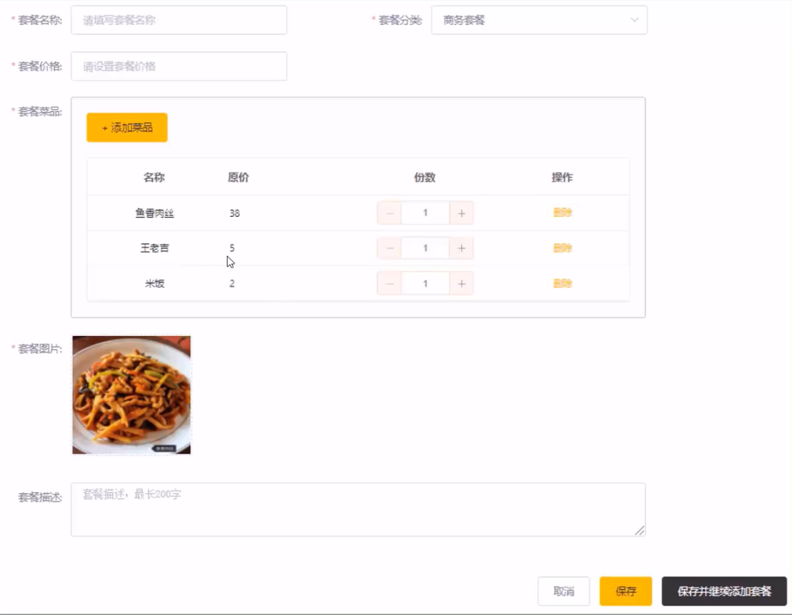
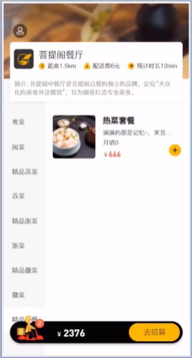

#### 数据模型

新增套餐，其实就是将新增页面录入的套餐信息插入到 setmeal 表，还需要向 setmeal_dish 表插入套餐和菜品关联数据。所以在新增套餐时，涉及到两个表:

- setmeal 　　　　　　　　　 套餐表
  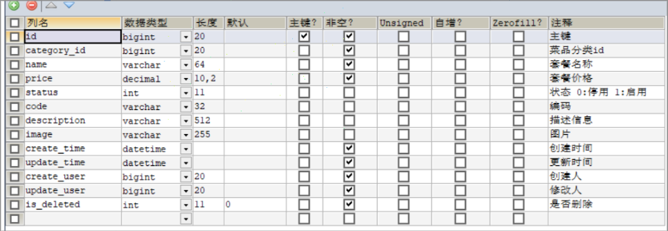
- setmeal_dish 　　　　　　　套餐菜品关系表
  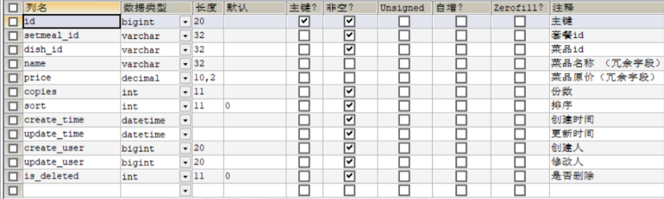

#### 代码开发-准备工作

在开发业务功能前，先将需要用到的类和接口基本结构创建好:

- **实体类 SetmealDish**(直接从课程资料中导入即可，Setmeal 实体前面+ 课程中已经导入过了)
- DTO **SetmealDto**(直接从课程资料中导入即可)
- Mapper 接口 SetmealDishMapper
- 业务层接口 SetmealDishService
- 业务层实现类 SetmealDishServicelmpl
- 控制层 SetmealController

#### 代码开发-梳理交互过程

在开发代码之前，需要梳理一下新增套餐时前端页面和服务端的交互过程:

1、页面(backend/ page/comboladd.html)发送 ajax 请求，请求服务端获取套餐分类数据并展示到下拉框中

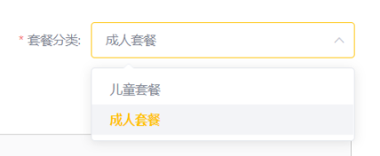

2、页面发送 ajax 请求，请求服务端获取菜品分类数据并展示到添加菜品窗口中

3、页面发送 ajax 请求，请求服务端，根据菜品分类查询对应的菜品数据并展示到添加菜品窗口中

在 DishController 添加 list 方法

```java
//根据条件查询对应菜品数据
@GetMapping("/list")
public R<List<Dish>> list(Dish dish){

    //构造查询条件
    LambdaQueryWrapper<Dish> lambdaQueryWrapper=new LambdaQueryWrapper<>();
    //添加条件，查询状态为1的（起售状态）
    lambdaQueryWrapper.eq(Dish::getStatus,1);
    lambdaQueryWrapper.eq(dish.getCategoryId()!=null,Dish::getCategoryId,dish.getCategoryId());
    //条件排序条件
    lambdaQueryWrapper.orderByAsc(Dish::getSort).orderByDesc(Dish::getUpdateTime);

    List<Dish> list=dishService.list(lambdaQueryWrapper);

    return R.success(list);
}
```

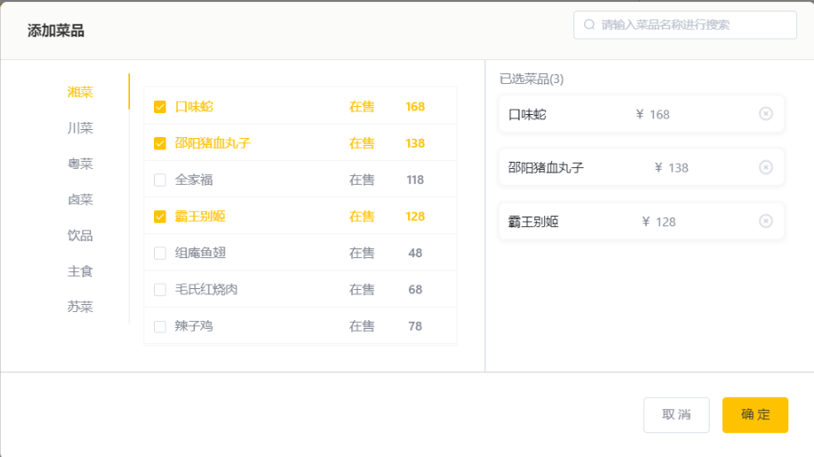

4、页面发送请求进行图片上传，请求服务端将图片保存到服务器

5、页面发送请求进行图片下载，将上传的图片进行回显

6、点击保存按钮，发送 ajax 请求，将套餐相关数据以 json 形式提交到服务端

在 SetmealServiceImpl 实现 saveWithDish 方法：新增套餐，同时要保持与菜品的关联关系

```java
@Service
public class SetmealServiceImpl extends ServiceImpl<SetmealMapper, Setmeal> implements SetmealService{

    @Autowired
    private SetmealDishService setmealDishService;

    //新增套餐，同时要保持与菜品的关联关系
    @Override
    @Transactional
    public void saveWithDish(SetmealDto setmealDto) {
        //保存套餐基本信息，操作setmeal，执行insert操作
        this.save(setmealDto);

        List<SetmealDish> setmealDishes = setmealDto.getSetmealDishes();

        setmealDishes.stream().map((item)->{
            item.setSetmealId(setmealDto.getId());
            return item;
        }).collect(Collectors.toList());

        //保存套餐和菜品的关联信息，操作setmeal_dish，执行insert操作
        setmealDishService.saveBatch(setmealDishes);

    }
}
```

在 SetmealController 添加 save 方法

```java
@RestController
@RequestMapping("/setmeal")
@Slf4j
public class SetmealController {
    @Autowired
    private SetmealService setmealService;

    @Autowired
    private SetmealDishService setmealDishService;

    @PostMapping
    public R<String> save(@RequestBody SetmealDto setmealDto){
        log.info("setmeal:{}",setmealDto);
        setmealService.saveWithDish(setmealDto);
        return R.success("新增套餐成功");
    }
}
```

开发新增套餐功能，其实就是在服务端编写代码去处理前端页面发送的这 6 次请求即可。

### 套餐分页查询

#### 需求分析

系统中的套餐数据很多的时候，如果在一个页面中全部展示出来会显得比较乱，不便于查看，所以一般的系统中都会以分页的方式来展示列表数据。

#### 代码开发-梳理交互过程

在开发代码之前，需要梳理一下套餐分页查询时前端页面和服务端的交互过程:

1、页面(backend/page/combo/list.html)发送 ajax 请求，将分页查询参数(page、pageSize、name)提交到服务端，获取分页数据

2、页面发送请求，请求服务端进行图片下载，用于页面图片展示

开发套餐信息分页查询功能，其实就是在服务端编写代码去处理前端页面发送的这 2 次请求即可。

```java
@GetMapping("/page")
public R<Page> page(int page,int pageSize,String name){
    //构造分页构造器
    Page<Setmeal> pageInfo=new Page<>(page,pageSize);

    Page<SetmealDto> pageDtoInfo=new Page<>();
    //构造条件构造器
    LambdaQueryWrapper<Setmeal> queryWrapper=new LambdaQueryWrapper<>();
    //根据name进行模糊查询
    queryWrapper.like(!StringUtils.isEmpty(name),Setmeal::getName,name);
    //添加排序条件，根据sort进行排序
    queryWrapper.orderByDesc(Setmeal::getUpdateTime);
    //进行分页查询
    setmealService.page(pageInfo,queryWrapper);

    //对象拷贝
    BeanUtils.copyProperties(pageInfo,pageDtoInfo,"records");

    List<Setmeal> records=pageInfo.getRecords();

    List<SetmealDto> list= records.stream().map((item)->{
        SetmealDto setmealDto=new SetmealDto();

        BeanUtils.copyProperties(item,setmealDto);
        Long categoryId = item.getCategoryId();
        //根据id查分类对象
        Category category = categoryService.getById(categoryId);
        if(category!=null){
            String categoryName = category.getName();
            setmealDto.setCategoryName(categoryName);
        }
        return setmealDto;
    }).collect(Collectors.toList());

    pageDtoInfo.setRecords(list);

    return R.success(pageDtoInfo);
}
```

### 删除、起售、停售套餐

#### 需求分析

在套餐管理列表页面点击删除按钮，可以删除对应的套餐信息。也可以通过复选框选择多个套餐，点击批量删除按钮一次删除多个套餐。注意，对于状态为售卖中的套餐不能删除，需要先停售，然后才能删除。

#### 代码实现

开发删除套餐功能，其实就是在服务端编写代码去处理前端页面发送的这 2 次请求即可。
观察删除单个套餐和批量删除套餐的请求信息可以发现，两种请求的地址和请求方式都是相同的，不同的则是传递的 id 个数，所以在服务端可以提供一个方法来统一处理。

```java
@DeleteMapping
public R<String> delete(String[] ids){
    int index=0;
    for(String id:ids) {
        Setmeal setmeal = setmealService.getById(id);
        if(setmeal.getStatus()!=1){
            setmealService.removeById(id);
        }else {
            index++;
        }
    }
    if (index>0&&index==ids.length){
        return R.error("选中的套餐均为启售状态，不能删除");
    }else {
        return R.success("删除成功");
    }
}

@PostMapping("/status/{status}")
public R<String> sale(@PathVariable int status,String[] ids){
    for (String id:ids){
        Setmeal setmeal = setmealService.getById(id);
        setmeal.setStatus(status);
        setmealService.updateById(setmeal);
    }
    return R.success("修改成功");
}
```

### 修改套餐

#### 需求分析

在套餐管理列表页面点击修改按钮，跳转到修改套餐页面，在修改页面回显套餐相关信息并进行修改，最后点击确定按钮完成修改操作

#### 代码开发-梳理交互过程

在开发代码之前，需要梳理一下修改套餐时前端页面（ add.html)和服务端的交互过程:

1、页面发送 ajax 请求，请求服务端获取分类数据，用于套餐分类下拉框中数据展示

2、页面发送 ajax 请求，请求服务端，根据 id 查询当前套餐信息，用于套餐信息回显

- SetmealController 处理 Get 请求

```java
//根据Id查询套餐信息
@GetMapping("/{id}")
public R<SetmealDto> getById(@PathVariable Long id){
    SetmealDto setmealDto=setmealService.getByIdWithDish(id);

    return R.success(setmealDto);
}
```

- SetmealServiceImpl 添加 getByIdWithDish 方法

```java
@Override
public SetmealDto getByIdWithDish(Long id) {
    //查询套餐基本信息
    Setmeal setmeal = this.getById(id);
    SetmealDto setmealDto = new SetmealDto();
    BeanUtils.copyProperties(setmeal, setmealDto);

    //查询套餐菜品信息
    LambdaQueryWrapper<SetmealDish> queryWrapper=new LambdaQueryWrapper<>();
    queryWrapper.eq(SetmealDish::getSetmealId,setmeal.getId());
    List<SetmealDish> list = setmealDishService.list(queryWrapper);

    setmealDto.setSetmealDishes(list);
    return setmealDto;
}
```

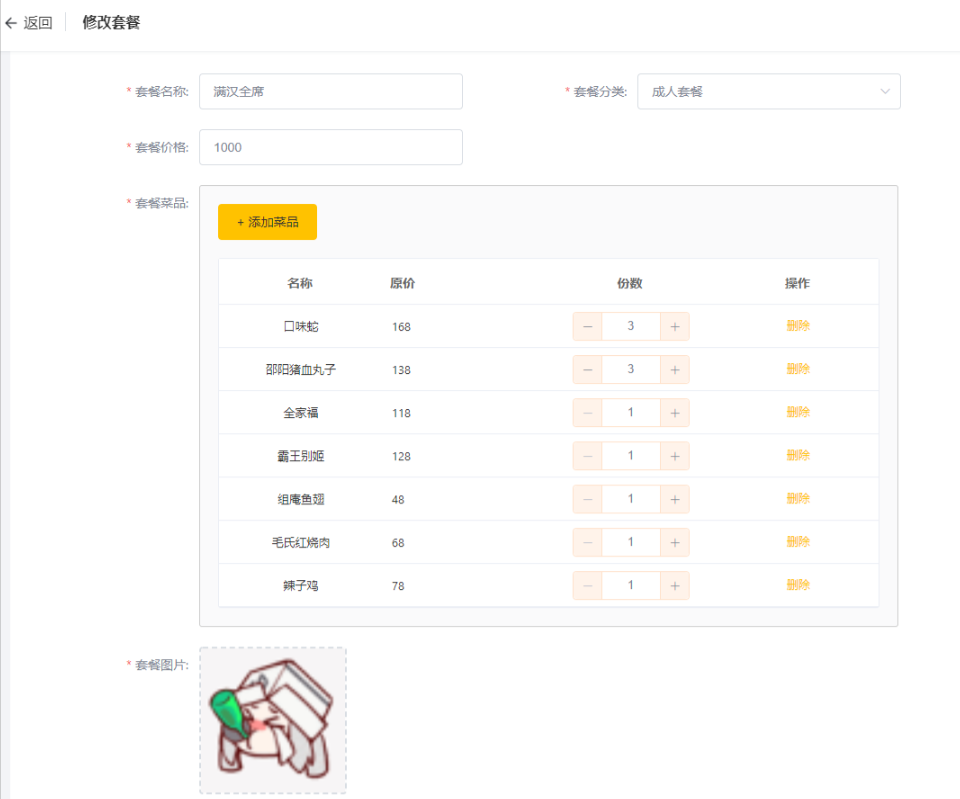

3、页面发送请求，请求服务端进行图片下载，用于页图片回显

4、点击保存按钮，页面发送 ajax 请求，将修改后的菜品相关数据以 json 形式提交到服务端

- 在 SetmealServiceImpl 添加 updateWithDish 方法

```java
@Override
public void updateWithDish(SetmealDto setmealDto) {
    //更新setmeal表基本信息
    this.updateById(setmealDto);

    //更新setmeal_dish表信息delete操作
    LambdaQueryWrapper<SetmealDish> queryWrapper = new LambdaQueryWrapper<>();
    queryWrapper.eq(SetmealDish::getSetmealId, setmealDto.getId());
    setmealDishService.remove(queryWrapper);

    //更新setmeal_dish表信息insert操作
    List<SetmealDish> SetmealDishes = setmealDto.getSetmealDishes();

    SetmealDishes = SetmealDishes.stream().map((item) -> {
        item.setSetmealId(setmealDto.getId());
        return item;
    }).collect(Collectors.toList());

    setmealDishService.saveBatch(SetmealDishes);
}
```

- 在 SetmealController 处理 put 请求

```java
//修改套餐
@PutMapping
public R<String> update(@RequestBody SetmealDto setmealDto){
    setmealService.updateWithDish(setmealDto);
    return R.success("修改成功");
}
```

**注意：**开发修改套餐功能，其实就是在服务端编写代码去处理前端页面发送的这 4 次请求即可。

## 手机验证码登录

### 短信发送

#### 短信服务介绍

目前市面上有很多第三方提供的短信服务，这些第三方短信服务会和各个运营商（移动、联通、电信)对接，我们只需要注册成为会员并且按照提供的开发文档进行调用就可以发送短信。需要说明的是，这些短信服务一般都是收费服务。

常用短信服务:

- 阿里云
- 华为云
- 腾讯云
- 京东
- 梦网
- 乐信

#### 阿里云短信服务-介绍

阿里云短信服务（Short Message Service)是广大企业客户快速触达手机用户所优选使用的通信能力。调用 API 或用群发助手，即可发送验证码、通知类和营销类短信;国内验证短信秒级触达，到达率最高可达 99%;国际/港澳台短信覆盖 200 多个国家和地区，安全稳定，广受出海企业选用。

应用场景:

- 验证码
- 短信通知
- 推广短信

#### 阿里云短信服务-注册账号

阿里云官网: <https://www.aliyun.com/>

点击官网首页注册按钮。

#### 阿里云短信服务-设置短信签名

注册成功后，点击登录按钮进行登录。登录后进入短信服务管理页面，选择国内消息菜单:

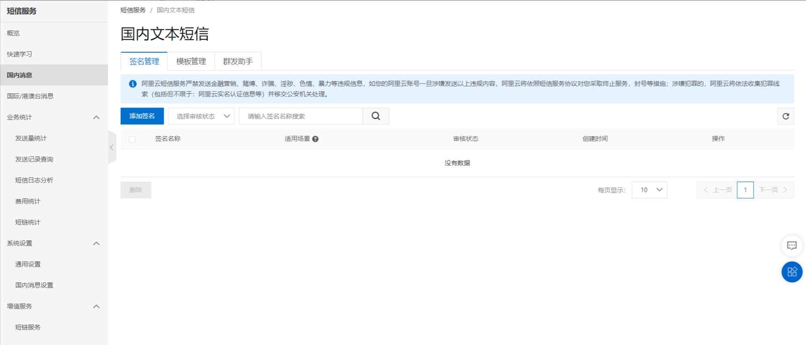

短信签名是短信发送者的署名，表示发送方的身份。

#### 阿里云短信服务-设置短信模板

切换到【模板管理】标签页:
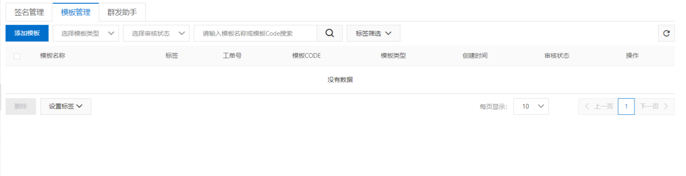

短信模板包含短信发送内容、场景、变量信息。

#### 阿里云短信服务-设置 AccessKey

光标移动到用户头像上，在弹出的窗口中点击【AccessKey 管理】∶
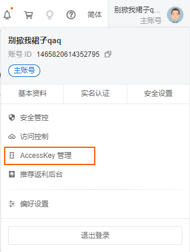

#### 代码开发

使用阿里云短信服务发送短信，可以参照官方提供的文档即可。
具体开发步骤:

1、导入 maven 坐标

```xml
<dependency>
  <groupId>com.aliyun</groupId>
  <artifactId>aliyun-java-sdk-core</artifactId>
  <version>4.5.16</version>
</dependency>
<dependency>
    <groupId>com.aliyun</groupId>
    <artifactId>aliyun-java-sdk-dysmsapi</artifactId>
    <version>1.1.0</version>
</dependency>
```

2、调用 API

```java
public class SMSUtils {

	/**
	 * 发送短信
	 * @param signName 签名
	 * @param templateCode 模板
	 * @param phoneNumbers 手机号
	 * @param param 参数
	 */
	public static void sendMessage(String signName, String templateCode,String phoneNumbers,String param){
		DefaultProfile profile = DefaultProfile.getProfile("cn-hangzhou", "", "");
		IAcsClient client = new DefaultAcsClient(profile);

		SendSmsRequest request = new SendSmsRequest();
		request.setSysRegionId("cn-hangzhou");
		request.setPhoneNumbers(phoneNumbers);
		request.setSignName(signName);
		request.setTemplateCode(templateCode);
		request.setTemplateParam("{\"code\":\""+param+"\"}");
		try {
			SendSmsResponse response = client.getAcsResponse(request);
			System.out.println("短信发送成功");
		}catch (ClientException e) {
			e.printStackTrace();
		}
	}
}
```

### 手机验证码登录

#### 需求分析

为了方便用户登录，移动端通常都会提供通过手机验证码登录的功能。

手机验证码登录的优点:

- 方便快捷，无需注册，直接登录
- 使用短信验证码作为登录凭证，无需记忆密码
- 安全

登录流程:
输入手机号>获取验证码>输入验证码>点击登录>登录成功

注意:通过手机验证码登录，手机号是区分不同用户的标识。

#### 数据模型

通过手机验证码登录时，涉及的表为 user 表，即用户表。结构如下:
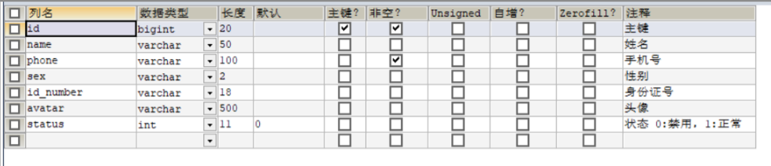

#### 代码开发

在开发代码之前，需要梳理一下登录时前端页面和服务端的交互过程:

1、在登录页面(front/page/login.html)输入手机号，点击【获取验证码】按钮，页面发送 ajax 请求，在服务端调用短信服务 API 给指定手机号发送验证码短信

2、在登录页面输入验证码，点击【登录】按钮，发送 ajax 请求，在服务端处理登录请求

开发手机验证码登录功能，其实就是在服务端编写代码去处理前端页面发送的这 2 次请求即可。

在开发业务功能前，先将需要用到的类和接口基本结构创建好:

- 实体类 User(直接从课程资料中导入即可)
- Mapper 接口 UserMapper
- 业务层接口 UserService
- 业务层实现类 UserServicelmpl
- 控制层 UserController
- 工具类 SMSutils、 ValidateCodeutils（直接从课程资料中导入即可)

前面我们已经完成了 LogincheckFilter 过滤器的开发，此过滤器用于检查用户的登录状态。我们在进行手机验证码登录时，发送的请求需要在此过滤器处理时直接放行。

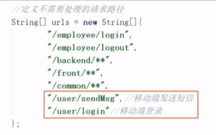

LoginCheckFilter 过滤器添加

```java
//        4-2、判断登录状态，如果已登录，则直接放行
if (request.getSession().getAttribute("user") != null) {
    log.info("用户已登录，用户id为：{}", request.getSession().getAttribute("user"));

    Long userId= (Long) request.getSession().getAttribute("user");

    BaseContext.setCurrentId(userId);

    filterChain.doFilter(request, response);
    return;
}
```

由于资料中代码不全 login.js 自行添加

```java
function sendMsgApi(data) {
    return $axios({
        'url':'/user/sendMsg',
        'method':'post',
        data
    })
}
```

login.html

```java
// this.form.code = (Math.random()*1000000).toFixed(0)
sendMsgApi({phone:this.form.phone})
```

UserController 处理 post 请求（发送验证码的请求）

```java
@PostMapping("/sendMsg")
public R<String> sendMsg(@RequestBody User user, HttpSession session){
    //获取手机号
    String phone=user.getPhone();
    if(!StringUtils.isEmpty(phone)) {
        //生成随机的4位验证码
        String code = ValidateCodeUtils.generateValidateCode(4).toString();
        log.info("code={}",code);
        //调用阿里云提供的短信服务API完成发送短信
        //SMSUtils.sendMessage("瑞吉外卖","",phone,code);

        //需要将生成的验证码保存到Session
        session.setAttribute(phone,code);
        return R.success("手机验证码短信发送成功");
    }
    return R.error("手机短信发送失败");
}
```

由于前端页面有部分代码缺失，建议拷贝资料中 day05 的 front 代码

在 UserController 编写 login 处理 post 请求

```java
@PostMapping("/login")
public R<User> login(@RequestBody Map map, HttpSession session) {
    log.info("map:{}", map.toString());
    //获取手机号
    String phone = map.get("phone").toString();
    //获取验证码
    String code = map.get("code").toString();
    //从Session中获取保存的验证码
    Object codeInSession = session.getAttribute(phone);
    //进行验证码比对（页面提交的验证码和Session中保存的验证码比对）
    if (codeInSession != null && codeInSession.equals(code)) {
        //如果能够比对成功，说明登录成功

        LambdaQueryWrapper<User> queryWrapper = new LambdaQueryWrapper<>();
        queryWrapper.eq(User::getPhone, phone);
        User user = userService.getOne(queryWrapper);
        if (user == null) {
            //判断当前手机号是否为新用户，如果是新用户则自动完成注册
            user = new User();
            user.setPhone(phone);
            user.setStatus(1);
            userService.save(user);
        }
        session.setAttribute("user",user.getId());
        return R.success(user);
    }
    return R.error("登陆失败");
}
```

#### 效果展示

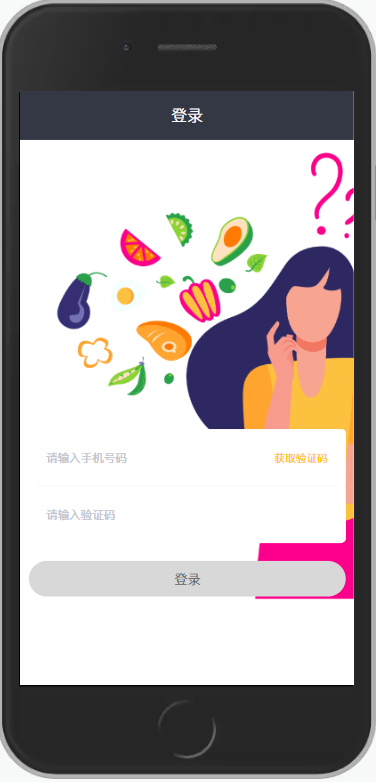

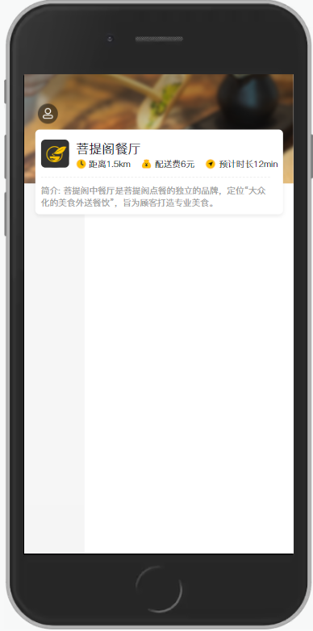
