# Reggie 开发笔记 六

[[TOC]]

## 导入用户地址簿相关功能代码

### 需求分析

地址簿，指的是移动端消费者用户的地址信息，用户登录成功后可以维护自己的地址信息。同一个用户可以有多个地址信息，但是只能有一个**默认地址**。

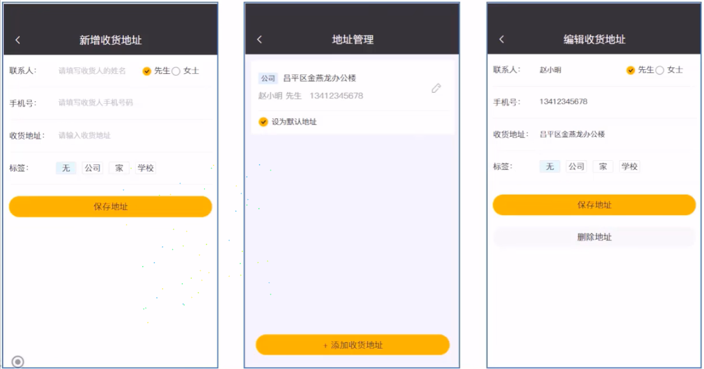

### 数据模型

用户的地址信息会存储在 address_book 表，即地址簿表中。具体表结构如下:

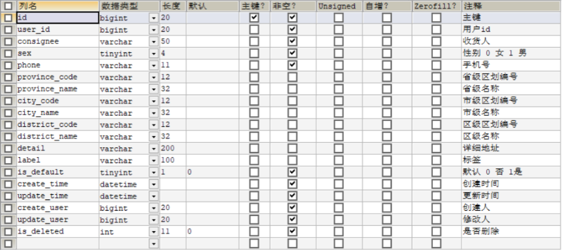

### 导入功能代码

功能代码清单:

- 实体类 AddressBook(直接从课程资料中导入即可)
- Mapper 接口 AddressBookMapper
- 业务层接口 AddressBookService
- 业务层实现类 AddressBookServicelmpl
- 控制层 AddressBookController(直接从课程资料中导入即可)

```java
@Slf4j
@RestController
@RequestMapping("/addressBook")
public class AddressBookController {

    @Autowired
    private AddressBookService addressBookService;

    /**
     * 新增
     */
    @PostMapping
    public R<AddressBook> save(@RequestBody AddressBook addressBook) {
        addressBook.setUserId(BaseContext.getCurrentId());
        log.info("addressBook:{}", addressBook);
        addressBookService.save(addressBook);
        return R.success(addressBook);
    }

    /**
     * 设置默认地址
     */
    @PutMapping("default")
    public R<AddressBook> setDefault(@RequestBody AddressBook addressBook) {
        log.info("addressBook:{}", addressBook);
        LambdaUpdateWrapper<AddressBook> wrapper = new LambdaUpdateWrapper<>();
        wrapper.eq(AddressBook::getUserId, BaseContext.getCurrentId());
        wrapper.set(AddressBook::getIsDefault, 0);
        //SQL:update address_book set is_default = 0 where user_id = ?
        addressBookService.update(wrapper);

        addressBook.setIsDefault(1);
        //SQL:update address_book set is_default = 1 where id = ?
        addressBookService.updateById(addressBook);
        return R.success(addressBook);
    }

    /**
     * 根据id查询地址
     */
    @GetMapping("/{id}")
    public R get(@PathVariable Long id) {
        AddressBook addressBook = addressBookService.getById(id);
        if (addressBook != null) {
            return R.success(addressBook);
        } else {
            return R.error("没有找到该对象");
        }
    }

    /**
     * 查询默认地址
     */
    @GetMapping("default")
    public R<AddressBook> getDefault() {
        LambdaQueryWrapper<AddressBook> queryWrapper = new LambdaQueryWrapper<>();
        queryWrapper.eq(AddressBook::getUserId, BaseContext.getCurrentId());
        queryWrapper.eq(AddressBook::getIsDefault, 1);

        //SQL:select * from address_book where user_id = ? and is_default = 1
        AddressBook addressBook = addressBookService.getOne(queryWrapper);

        if (null == addressBook) {
            return R.error("没有找到该对象");
        } else {
            return R.success(addressBook);
        }
    }

    /**
     * 查询指定用户的全部地址
     */
    @GetMapping("/list")
    public R<List<AddressBook>> list(AddressBook addressBook) {
        addressBook.setUserId(BaseContext.getCurrentId());
        log.info("addressBook:{}", addressBook);

        //条件构造器
        LambdaQueryWrapper<AddressBook> queryWrapper = new LambdaQueryWrapper<>();
        queryWrapper.eq(null != addressBook.getUserId(), AddressBook::getUserId, addressBook.getUserId());
        queryWrapper.orderByDesc(AddressBook::getUpdateTime);

        //SQL:select * from address_book where user_id = ? order by update_time desc
        return R.success(addressBookService.list(queryWrapper));
    }
}
```

### 功能测试

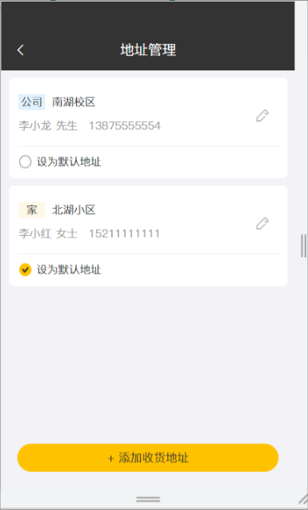

## 菜品展示

### 需求分析

用户登录成功后跳转到系统首页，在首页需要根据分类来展示菜品和套餐。如果菜品设置了口味信息需要展示 [选择规格] 按钮，否则显示 [+] 按钮。

### 代码开发

#### 代码开发-梳理交互过程

在开发代码之前，需要梳理一下前端页面和服务端的交互过程:

1、页面(front/index.html)发送 ajax 请求，获取分类数据（菜品分类和套餐分类)

2、页面发送 ajax 请求，获取第一个分类下的菜品或者套餐

开发菜品展示功能，其实就是在服务端编写代码去处理前端页面发送的这 2 次请求即可。

注意:首页加载完成后，还发送了一次 ajax 请求用于加载购物车数据，此处可以将这次请求的地址暂时修改一下，从静态 json 文件获取数据，等后续开发购物车功能时再修改回来，如下:

```javascript
//获取购物车内商品的集合
function cartListApi(data) {
  return $axios({
    // 'url': '/shoppingCart/list',
    url: '/front/cartData.json',
    method: 'get',
    params: { ...data }
  })
}
```

cartData.json:

```json
{ "code": 1, "msg": null, "data": [], "map": {} }
```

改造 DishController 中的 list 方法

```java
@GetMapping("/list")
public R<List<DishDto>> list(Dish dish) {

    //构造查询条件
    LambdaQueryWrapper<Dish> lambdaQueryWrapper = new LambdaQueryWrapper<>();
    //添加条件，查询状态为1的（起售状态）
    lambdaQueryWrapper.eq(Dish::getStatus, 1);
    lambdaQueryWrapper.eq(dish.getCategoryId() != null, Dish::getCategoryId, dish.getCategoryId());
    //条件排序条件
    lambdaQueryWrapper.orderByAsc(Dish::getSort).orderByDesc(Dish::getUpdateTime);

    List<Dish> list = dishService.list(lambdaQueryWrapper);

    List<DishDto> dishDtoList = list.stream().map((item) -> {
        DishDto dishDto = new DishDto();

        BeanUtils.copyProperties(item, dishDto);
        Long categoryId = item.getCategoryId();
        //根据id查分类对象
        Category category = categoryService.getById(categoryId);
        if (category != null) {
            String categoryName = category.getName();
            dishDto.setCategoryName(categoryName);
        }

        //当前菜品id
        Long dishId = item.getId();
        LambdaQueryWrapper<DishFlavor> queryWrapper = new LambdaQueryWrapper<>();
        queryWrapper.eq(DishFlavor::getDishId, dishId);
        //SQL: select* from dishflavor where dish_id=?;
        List<DishFlavor> dishFlavorlist = dishFlavorService.list(queryWrapper);
        dishDto.setFlavors(dishFlavorlist);
        return dishDto;
    }).collect(Collectors.toList());

    return R.success(dishDtoList);
}
```

在 SetmealController 里添加 list 方法显示套餐信息

```java
@GetMapping("/list")
public R<List<Setmeal>> list(Setmeal setmeal){
    LambdaQueryWrapper<Setmeal> queryWrapper=new LambdaQueryWrapper<>();
    queryWrapper.eq(setmeal.getCategoryId()!=null,Setmeal::getCategoryId,setmeal.getCategoryId());
    queryWrapper.eq(setmeal.getStatus()!=null,Setmeal::getStatus,setmeal.getStatus());
    queryWrapper.orderByDesc(Setmeal::getUpdateTime);

    List<Setmeal> list = setmealService.list(queryWrapper);
    return R.success(list);
}
```

### 功能测试

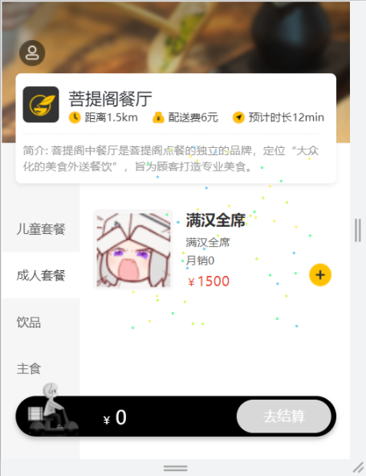

## 购物车

### 需求分析

移动端用户可以将菜品或者套餐添加到购物车。对于菜品来说，如果设置了口味信息，则需要选择规格后才能加入购物车;对于套餐来说，可以直接点击 **[+]** 将当前套餐加入购物车。在购物车中可以修改菜品和套餐的数量,也可以清空购物车。


### 数据模型

购物车对应的数据表为 shopping_cart 表，具体表结构如下:
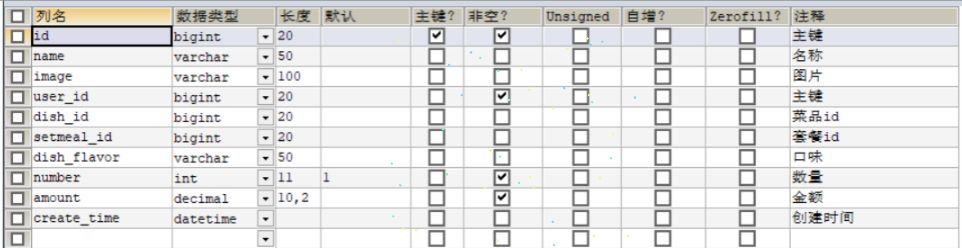

### 代码开发

#### 代码开发-梳理交互过程

在开发代码之前，需要梳理一下购物车操作时前端页面和服务端的交互过程:

1、点击 **[加入购物车]** 或者 **[+]** 按钮，页面发送 ajax 请求，请求服务端，将菜品或者套餐添加到购物车

2、点击购物车图标，页面发送 ajax 请求，请求服务端查询购物车中的菜品和套餐

3、点击清空购物车按钮，页面发送 ajax 请求，请求服务端来执行清空购物车操作

开发购物车功能，其实就是在服务端编写代码去处理前端页面发送的这 3 次请求即可。

#### 代码开发-准备工作

在开发业务功能前，先将需要用到的类和接口基本结构创建好:

- 实体类 ShoppingCart(直接从课程资料中导入即可)
- Mapper 接口 ShoppingCartMapper
- 业务层接口 ShoppingcartService
- 业务层实现类 ShoppingCartServicelmpl
- 控制层 ShoppingCartController

#### 代码开发-添加购物车

```java
@PostMapping("/add")
public R<ShoppingCart> add(@RequestBody ShoppingCart shoppingCart) {
    log.info("购物车数据：{}", shoppingCart);
    //设置用户id，指定当前是哪个用户的购物车数据
    Long currentId = BaseContext.getCurrentId();
    shoppingCart.setUserId(currentId);

    //查询当前菜品或者套餐是否已经在购物车当中
    Long dishId = shoppingCart.getDishId();

    LambdaQueryWrapper<ShoppingCart> queryWrapper = new LambdaQueryWrapper<>();
    queryWrapper.eq(ShoppingCart::getUserId, currentId);

    if (dishId != null) {
        //添加到购物车的为菜品
        queryWrapper.eq(ShoppingCart::getDishId, dishId);
    } else {
        //添加到购物车的为套餐
        queryWrapper.eq(ShoppingCart::getSetmealId, shoppingCart.getSetmealId());
    }
    //SQL:select *from shopping_cart where user_id=? and dish_id/setmeal_id =?
    ShoppingCart cartServiceone = shoppingcartService.getOne(queryWrapper);

    if(cartServiceone!=null) {
        //如果已经存在，则在原来的基础上加一
        Integer number = cartServiceone.getNumber();
        cartServiceone.setNumber(number+1);
        shoppingcartService.updateById(cartServiceone);
    }else {
        //如果不存在，则添加到购物车中，默认为一
        shoppingCart.setNumber(1);
         shoppingCart.setCreateTime(LocalDateTime.now());
        shoppingcartService.save(shoppingCart);
        cartServiceone=shoppingCart;
    }
    return R.success(cartServiceone);
}
```

#### 代码开发-查看购物车

把前端假数据改回来

```java
function cartListApi(data) {
    return $axios({
        'url': '/shoppingCart/list',
        // 'url':'/front/cartData.json',
        'method': 'get',
        params:{...data}
    })
}
```

查看购物车

```java
@GetMapping("/list")
public R<List<ShoppingCart>> list(){
    log.info("查看购物车");
    LambdaQueryWrapper<ShoppingCart> queryWrapper=new LambdaQueryWrapper<>();
    queryWrapper.eq(ShoppingCart::getUserId,BaseContext.getCurrentId());
    queryWrapper.orderByDesc(ShoppingCart::getCreateTime);
    List<ShoppingCart> list = shoppingcartService.list(queryWrapper);
    return R.success(list);
}
```

#### 代码开发-清空购物车

```java
@DeleteMapping("/clean")
public R<String> clean(){

    LambdaQueryWrapper<ShoppingCart> queryWrapper=new LambdaQueryWrapper<>();
    queryWrapper.eq(ShoppingCart::getUserId,BaseContext.getCurrentId());
    shoppingcartService.remove(queryWrapper);
    return R.success("清空购物车成功");
}
```

#### 代码开发-减少菜品

```java
@PostMapping("/sub")
public R<ShoppingCart> sub(@RequestBody ShoppingCart shoppingCart){
    Long setmealId = shoppingCart.getSetmealId();
    Long dishId = shoppingCart.getDishId();
    LambdaQueryWrapper<ShoppingCart> queryWrapper=new LambdaQueryWrapper<>();
    queryWrapper.eq(ShoppingCart::getUserId,BaseContext.getCurrentId());

    if (setmealId!=null){
        queryWrapper.eq(ShoppingCart::getSetmealId,setmealId);
    }else {
        queryWrapper.eq(ShoppingCart::getDishId,dishId);
    }
    ShoppingCart one = shoppingcartService.getOne(queryWrapper);
    Integer number = one.getNumber();
    if(number==1){
        shoppingcartService.remove(queryWrapper);
    }else {
        one.setNumber(number-1);
        shoppingcartService.updateById(one);
    }

    return R.success(one);
}
```

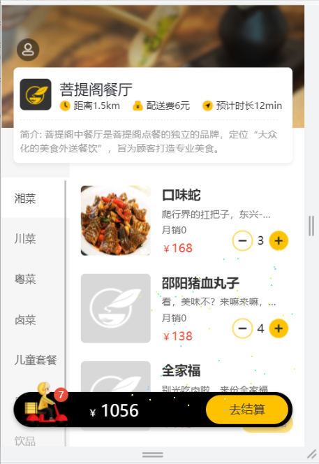

## 下单

### 需求分析

移动端用户将菜品或者套餐加入购物车后，可以点击购物车中的 **【去结算】** 按钮，页面跳转到订单确认页面，点击 **【去支付】** 按钮则完成下单操作。

### 数据模型

用户下单业务对应的数据表为 orders 表和 order_detail 表:

- orders:订单表
  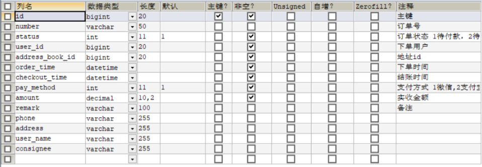
- order_detail:订单明细表
  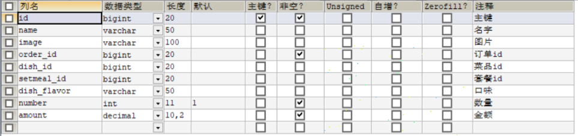

### 代码开发

#### 代码开发-梳理交互过程

在开发代码之前，需要梳理一下用户下单操作时前端页面和服务端的交互过程:

1、在购物车中点击 **【去结算】** 按钮，页面跳转到订单确认页面

2、在订单确认页面，发送 ajax 请求，请求服务端获取当前登录用户的默认地址

3、在订单确认页面，发送 ajax 请求，请求服务端获取当前登录用户的购物车数据

4、在订单确认页面点击 **【去支付】** 按钮，发送 ajax 请求，请求服务端完成下单操作

开发用户下单功能，其实就是在服务端编写代码去处理前端页面发送的请求即可。

#### 代码开发-准备工作

在开发业务功能前，先将需要用到的类和接口基本结构创建好:

- 实体类 Orders、OrderDetail（直接从课程资料中导入即可)
- Mapper 接口 OrderMapper、OrderDetailMapper
- 业务层接口 OrderService、OrderDetailService
- 业务层实现类 OrderServicelmpl、OrderDetailServicelmpl
- 控制层 OrderController、OrderDetailController

#### 代码开发

在 OrderService 添加 submit 方法用于用户下单

```java
@Service
public class OrderServiceImpl extends ServiceImpl<OrderMapper, Orders> implements OrderService {

    @Autowired
    private ShoppingcartService shoppingcartService;

    @Autowired
    private UserService userService;

    @Autowired
    private AddressBookService addressBookService;

    @Autowired
    private OrderDetailService orderDetailService;

    @Override
    @Transactional
    public void submit(Orders orders) {
        //获取当前用户id
        Long currentId = BaseContext.getCurrentId();
        //查询当前用户的购物车数据
        LambdaQueryWrapper<ShoppingCart> queryWrapper=new LambdaQueryWrapper<>();
        queryWrapper.eq(ShoppingCart::getUserId,currentId);
        List<ShoppingCart> list = shoppingcartService.list(queryWrapper);

        if (list==null||list.size()==0){
            throw new CustomException("购物车为空，不能下单");
        }
        //查询用户数据
        User user = userService.getById(currentId);
        //查询地址数据
        Long addressBookId = orders.getAddressBookId();
        AddressBook addressBook = addressBookService.getById(addressBookId);
        if(addressBook==null){
            throw new CustomException("地址有误，不能下单");
        }

        long orderId = IdWorker.getId();//订单号

        AtomicInteger amount=new AtomicInteger(0);

        List<OrderDetail> orderDetails=list.stream().map((item)->{
            OrderDetail orderDetail = new OrderDetail();
            orderDetail.setOrderId(orderId);
            orderDetail.setNumber(item.getNumber());
            orderDetail.setDishFlavor(item.getDishFlavor());
            orderDetail.setDishId(item.getDishId());
            orderDetail.setSetmealId(item.getSetmealId());
            orderDetail.setName(item.getName());
            orderDetail.setImage(item.getImage());
            orderDetail.setAmount(item.getAmount());
            amount.addAndGet(item.getAmount().multiply(new BigDecimal(item.getNumber())).intValue());
            return orderDetail;
        }).collect(Collectors.toList());


        //向订单表中插入一条数据
        orders.setNumber(String.valueOf(orderId));
        orders.setId(orderId);
        orders.setOrderTime(LocalDateTime.now());
        orders.setCheckoutTime(LocalDateTime.now());
        orders.setStatus(2);
        orders.setAmount(new BigDecimal(amount.get()));//计算总金额
        orders.setUserId(currentId);
        orders.setUserName(user.getName());
        orders.setConsignee(addressBook.getConsignee());
        orders.setPhone(addressBook.getPhone());
        orders.setAddress((addressBook.getProvinceName()==null?"":addressBook.getProvinceName())
                +(addressBook.getCityName()==null?"":addressBook.getCityName())
                +(addressBook.getDistrictName()==null?"":addressBook.getDistrictName())
                +(addressBook.getDetail()==null?"":addressBook.getDetail()));
        this.save(orders);

        //向订单明细表中插入多条数据
        orderDetailService.saveBatch(orderDetails);
        //清空购物车数据
        shoppingcartService.remove(queryWrapper);
    }
}
```

在 OrderController 的 submit 方法处理 post 请求实现上面的方法

```java
//用户下单
@PostMapping("/submit")
public R<String> submit(@RequestBody Orders orders){
    log.info("订单数据:{}",orders);
    orderService.submit(orders);
    return R.success("下单成功");
}
```

#### 功能测试

下单界面：
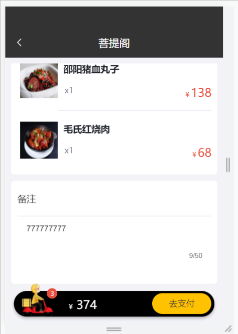

下单成功界面：
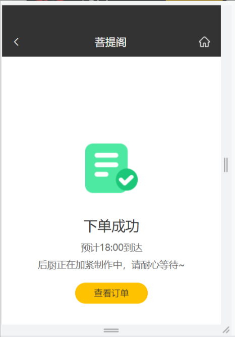

## 功能补充

补充教程视频中未实现的方法（纯菜鸡手打，若读者发现 bug 或者更好的方法，欢迎评论补充 TVT,虽然肯定没人看）

### 用户登出

在 UserController 添加 loginout 方法

```java
//用户登出
@PostMapping("/loginout")
public R<String> loginout(HttpServletRequest request){
    //清理Session中保存的当前用户登录的id
    request.getSession().removeAttribute("user");
    return R.success("退出成功");
}
```

### 订单管理

导入 OrderDto 需手动添加`private int sumNum;`（前端会计算数量）

在 OrderController 添加 userPage 方法

```java
//订单管理
@Transactional
@GetMapping("/userPage")
public R<Page> userPage(int page,int pageSize){
    //构造分页构造器
    Page<Orders> pageInfo = new Page<>(page, pageSize);

    Page<OrdersDto> ordersDtoPage = new Page<>();

    //构造条件构造器
    LambdaQueryWrapper<Orders> queryWrapper = new LambdaQueryWrapper<>();

    //添加排序条件
    queryWrapper.orderByDesc(Orders::getOrderTime);

    //进行分页查询
    orderService.page(pageInfo,queryWrapper);

    //对象拷贝
    BeanUtils.copyProperties(pageInfo,ordersDtoPage,"records");

    List<Orders> records=pageInfo.getRecords();

    List<OrdersDto> list = records.stream().map((item) -> {
        OrdersDto ordersDto = new OrdersDto();

        BeanUtils.copyProperties(item, ordersDto);
        Long Id = item.getId();
        //根据id查分类对象
        Orders orders = orderService.getById(Id);
        String number = orders.getNumber();
        LambdaQueryWrapper<OrderDetail> lambdaQueryWrapper=new LambdaQueryWrapper<>();
        lambdaQueryWrapper.eq(OrderDetail::getOrderId,number);
        List<OrderDetail> orderDetailList = orderDetailService.list(lambdaQueryWrapper);
        int num=0;

        for(OrderDetail l:orderDetailList){
            num+=l.getNumber().intValue();
        }

        ordersDto.setSumNum(num);
        return ordersDto;
    }).collect(Collectors.toList());

    ordersDtoPage.setRecords(list);

    return R.success(ordersDtoPage);
}
```

### 再来一单

用户可以通过该方法快速再下一单

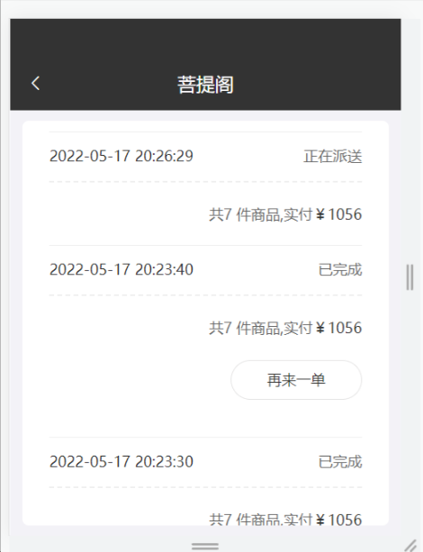

在 OrderController 中添加 again 方法处理 post 请求

```java
//再来一单
@Transactional
@PostMapping("/again")
public R<String> again(@RequestBody Orders order1){
    //取得orderId
    Long id = order1.getId();
    Orders orders = orderService.getById(id);
    //设置订单号码
    long orderId = IdWorker.getId();
    orders.setId(orderId);
    //设置订单号码
    String number = String.valueOf(IdWorker.getId());
    orders.setNumber(number);
    //设置下单时间
    orders.setOrderTime(LocalDateTime.now());
    orders.setCheckoutTime(LocalDateTime.now());
    orders.setStatus(2);
    //向订单表中插入一条数据
    orderService.save(orders);
    //修改订单明细表
    LambdaQueryWrapper<OrderDetail> queryWrapper=new LambdaQueryWrapper<>();
    queryWrapper.eq(OrderDetail::getOrderId,id);
    List<OrderDetail> list = orderDetailService.list(queryWrapper);
    list.stream().map((item)->{
        //订单明细表id
        long detailId = IdWorker.getId();
        //设置订单号码
        item.setOrderId(orderId);
        item.setId(detailId);
        return item;
    }).collect(Collectors.toList());

    //向订单明细表中插入多条数据
    orderDetailService.saveBatch(list);
    return R.success("再来一单");
}
```

### 管理端订单明细

在 OrderController 添加 page 方法处理 get 请求

```java
@GetMapping("/page")
public R<Page> page(int page, int pageSize, String number,String beginTime,String endTime){
    //构造分页构造器
    Page<Orders> pageInfo = new Page<>(page, pageSize);

    Page<OrdersDto> ordersDtoPage=new Page<>();
    //构造条件构造器
    LambdaQueryWrapper<Orders> queryWrapper = new LambdaQueryWrapper<>();
    //根据number进行模糊查询
    queryWrapper.like(!StringUtils.isEmpty(number),Orders::getNumber,number);
    //根据Datetime进行时间范围查询

//        log.info("开始时间：{}",beginTime);
//        log.info("结束时间：{}",endTime);
    if(beginTime!=null&&endTime!=null){
        queryWrapper.ge(Orders::getOrderTime,beginTime);
        queryWrapper.le(Orders::getOrderTime,endTime);
    }
    //添加排序条件
    queryWrapper.orderByDesc(Orders::getOrderTime);

    //进行分页查询
    orderService.page(pageInfo,queryWrapper);

    //对象拷贝
    BeanUtils.copyProperties(pageInfo,ordersDtoPage,"records");

    List<Orders> records=pageInfo.getRecords();

    List<OrdersDto> list=records.stream().map((item)->{
        OrdersDto ordersDto=new OrdersDto();

        BeanUtils.copyProperties(item,ordersDto);
        String name="用户"+item.getUserId();
        ordersDto.setUserName(name);
        return ordersDto;
    }).collect(Collectors.toList());

    ordersDtoPage.setRecords(list);
    return R.success(ordersDtoPage);
}
```

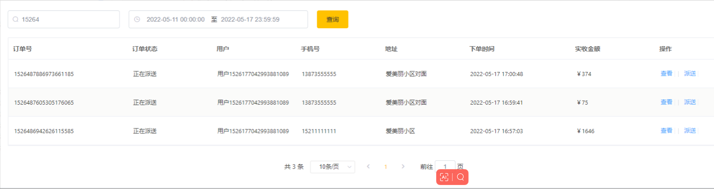

### 外卖订单派送

在 OrderController 处理 post 请求修改 status

```java
 @PutMapping
public R<String> send(@RequestBody Orders orders){
    Long id = orders.getId();
    Integer status = orders.getStatus();
    LambdaQueryWrapper<Orders> queryWrapper=new LambdaQueryWrapper<>();
    queryWrapper.eq(Orders::getId,id);
    Orders one = orderService.getOne(queryWrapper);
    one.setStatus(status);
    orderService.updateById(one);
    return R.success("派送成功");
}
```

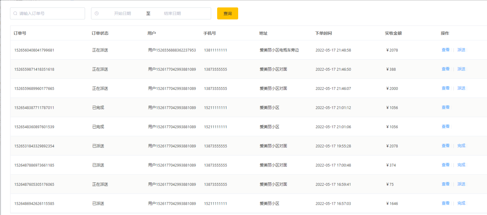
