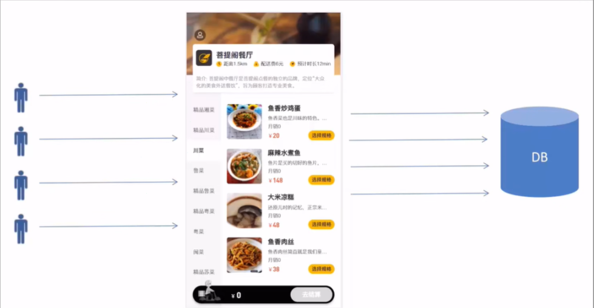
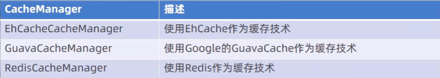
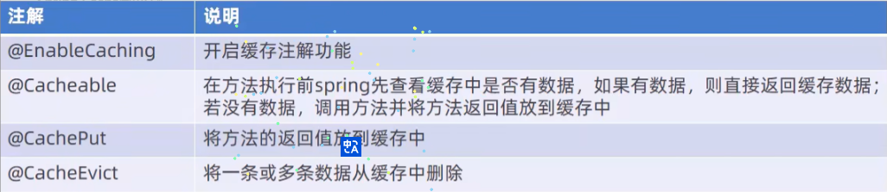

# Reggie 开发笔记【优化七】

[[TOC]]

## 缓存优化

**问题说明**



**用户数量多，系统访问量大频繁访问数据库，系统性能下降，用户体验差**

### 环境搭建

#### maven 坐标

在项目的 pom.xm1 文件中导入 spring data redis 的 maven 坐标:

```xml
<dependency>
<groupId>org.springframework.boot</groupId>
<artifactId>spring-boot-starter-data-redis</artifactId>
</dependency>
```

#### 配置文件

在项目的 application.yml 中加入 redis 相关配置:

```yaml
spring
    redis:
        host:172.17.2.94
        port: 6379
        password: root@123456
        database: 0
```

#### 配置类

在项目中加入配置类 RedisConfig:

```java
@Configuration
public class RedisConfig extends CachingConfigurerSupport {
    @Bean
    public RedisTemplate<Object,Object> redisTemplate(RedisConnectionFactory connectionFactory){
        RedisTemplate<Object,Object> redisTemplate = new RedisTemplate<>();
        //默认的Key序列化器为: JdkSerializationRedisSerializer
        redisTemplate.setKeySerializer(new StringRedisSerializer());
        redisTemplate.setConnectionFactory( connectionFactory) ;
        return redisTemplate;
    }
}
```

可以用 StringRedisTemplate 就不用配置类

### 缓存短信验证码

#### 实现思路

前面我们已经实现了移动端手机验证码登录，随机生成的验证码我们是保存在 HttpSession 中的。现在需要改造为将验证码缓存在 Redis 中，具体的实现思路如下:

1、在服务端 UserController 中注入 RedisTemplate 对象，用于操作 Redis

```java
@Autowired
private RedisTemplate redisTemplate;
```

2、在服务端 UserController 的 sendMsg 方法中，将随机生成的验证码缓存到 Redis 中，并设置有效期为 5 分钟

```java
redisTemplate.opsForValue().set(phone,code,5, TimeUnit.MINUTES);
```

3、在服务端 UserController 的 login 方法中，从 Redis 中获取缓存的验证码，如果登录成功则删除 Redis 中的验证码

```java
//从redis中获取保存的验证码
Object codeInSession =redisTemplate.opsForValue().get(phone);
//如果用户登录成功则删除Redis中缓存的验证码
redisTemplate.delete(phone);
```

### 缓存菜品数据

#### 实现思路

前面我们已经实现了移动端菜品查看功能，对应的服务端方法为 DishController 的 list 方法，此方法会根据前端提交的查询条件进行数据库查询操作。在高并发的情况下，频繁查询数据库会导致系统性能下降，服务端响应时间增长。现在需要对此方法进行缓存优化，提高系统的性能。

具体的实现思路如下:

1、改造 DishController 的 list 方法，先从 Redis 中获取菜品数据，如果有则直接返回，无需查询数据库;如果没有则查询数据库，并将查询到的菜品数据放入 Redis。

```java
List<DishDto> dishDtoList=null;
//动态构造Key
String key="dish_"+dish.getCategoryId()+"_"+dish.getStatus();
//先从redis中获取缓存数据
dishDtoList= (List<DishDto>) redisTemplate.opsForValue().get(key);
if(dishDtoList!=null){
    //如果存在，则直接返回，无需查询数据库
    return R.success(dishDtoList);
}
...
...
...
//如果不存在，则查询数据库，并且将查询到的菜品数据添加到缓存中
redisTemplate.opsForValue().set(key,dishDtoList,60, TimeUnit.MINUTES);
```

2、改造 DishController 的 save 和 update 方法，加入清理缓存的逻辑

```java
//清理所有菜品缓存数据
//Set keys = redisTemplate.keys("dish_*");
//redisTemplate.delete(keys);

//清理某个分类下面的菜品缓存数据
String key="dish_"+dishDto.getCategoryId()+"_"+dishDto.getStatus();
redisTemplate.delete(key);
```

**注意**：在使用缓存过程中，要注意保证数据库中的数据和缓存中的数据一致，如果数据库中的数据发生变化，需要及时清理缓存数据。

### Spring Cache

#### Spring Cache 介绍

Spring cache 是一个框架，实现了基于注解的缓存功能，只需要简单地加一个注解，就能实现缓存功能。

Spring Cache 提供了一层抽象，底层可以切换不同的 cache 实现。具体就是通过 CacheManager 接口来统一不同的缓存技术。

CacheManager 是 Spring 提供的各种缓存技术抽象接口。

针对不同的缓存技术需要实现不同的 CacheManager:


#### Spring Cache 常用注解



在 spring boot 项目中，使用缓存技术只需在项目中导入相关缓存技术的依赖包，并在启动类上使用@EnableCaching 开启缓存支持即可。

例如，使用 Redis 作为缓存技术，只需要导入 Spring data Redis 的 maven 坐标即可。

#### Spring Cache 使用方式

在 Spring Boot 项目中使用 Spring Cache 的操作步骤(使用 redis 缓存技术);

1、导入 maven 坐标

- spring-boot-starter-data-redis、spring-boot-starter-cache

2、配置 application.yml

```java
spring:
    cache:
        redis:
            time-to-live: 1800000#设置缓存有效期
```

3、在启动类上加入@EnableCaching 注解，开启缓存注解功能

4、在 Controller 的方法上加入@Cacheable、@CacheEvict 等注解，进行缓存操作

### 缓存套餐数据

#### 实现思路

前面我们已经实现了移动端套餐查看功能，对应的服务端方法为 SetmealController 的 list 方法，此方法会根据前端提交的查询条件进行数据库查询操作。在高并发的情况下，频繁查询数据库会导致系统性能下降，服务端响应时间增长。现在需要对此方法进行缓存优化，提高系统的性能。

具体的实现思路如下:

1、导入 Spring Cache 和 Redis 相关 maven 坐标

2、在 application.yml 中配置缓存数据的过期时间

3、在启动类上加入@EnableCaching 注解，开启缓存注解功能

4、在 SetmealController 的 list 方法上加入@Cacheable 注解

5、在 SetmealController 的 save 和 delete 方法上加入 CacheEvict 注解

#### 代码改造

在 pom.xml 文件中导入 maven 坐标:

```xml
<dependency>
    <groupId>org.springframework.boot</groupId>
    <artifactId>spring-boot-starter-cache</artifactId>
</dependency>
```

在 application.yml 中配置缓存数据过期时间:

```yaml
cache:
  redis:
    time-to-live: 1800000 #设置缓存数据过期时间
```

在启动类@EnableCaching 注解

在 list 方法上添加注解，实现在 redis 里添加缓存：

```java
@Cacheable(value = "setmealCache",key = "#setmeal.categoryId+'_'+#setmeal.status")
```

在 update，add，delete 方法上添加注解，清除缓存：

```java
@CacheEvict(value = "setmealCache",allEntries = true)
```

**注意**：要让 R 实现 Serializable 接口（序列化），注解才能生效
