# Reggie 开发笔记【优化八】

[[TOC]]

## 读写分离

**问题分析**
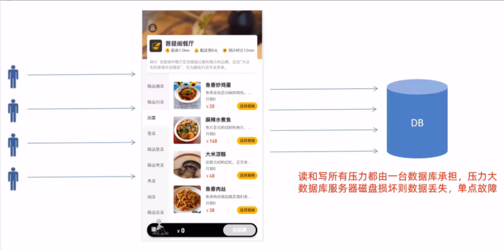
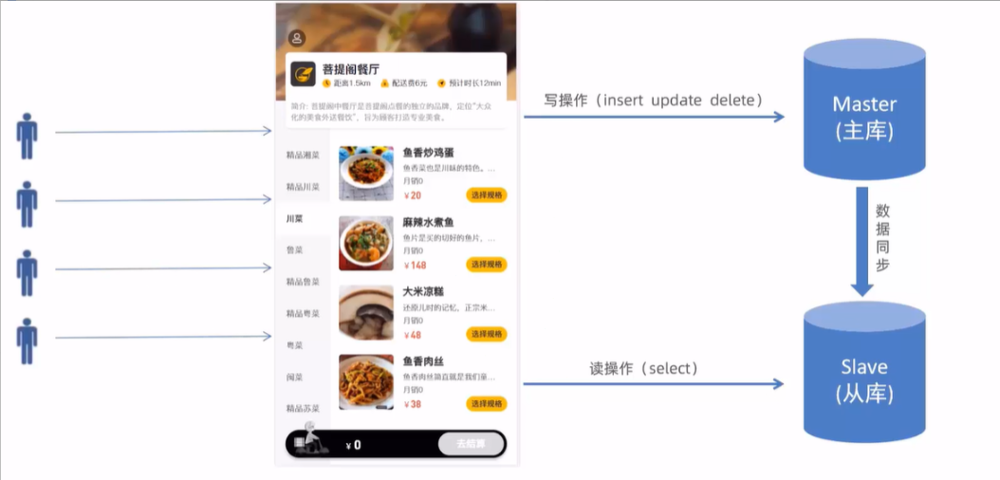

### Mysql 主从复制

#### 介绍

MysSQL 主从复制是一个异步的复制过程，底层是基于 Mysql 数据库自带的**二进制日志**功能。就是一台或多台 AysQL 数据库(slave，即**从库**）从另一台 MysQL 数据库(master，即**主库**）进行日志的复制然后再解析日志并应用到自身，最终实现**从库**的数据和**主库**的数据保持一致。MySQL 主从复制是 MysQL 数据库自带功能，无需借助第三方工具。

MysQL 复制过程分成三步:

- master 将改变记录到二进制日志（ binary log)
- slave 将 master 的 binary log 拷贝到它的中继日志（relay log）
- slave 重做中继日志中的事件，将改变应用到自己的数据库中

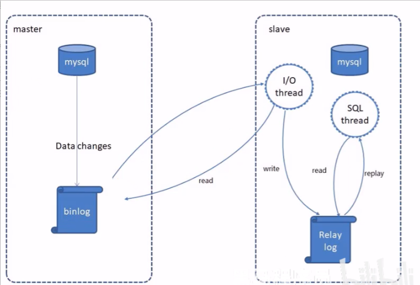

#### 配置-前置条件

提前准备好两台服务器，分别安装 Mysql 并启动服务成功

- 主库 Master 192.168.188.100
- 从库 slave 192.168.188.101

**注意**：克隆的虚拟机需要修改数据库的 uuid

#### 配置-主库 Master

第一步:修改 Mysq1 数据库的配置文件/etc/my.cnf

```shell
[mysqld]
log-bin=mysql-bin #[必须]启用二进制日志
server-id=100 #[必须]服务器唯一ID
```

第二步:重启 Mysql 服务
`systemctl restart mysqld`

第三步:登录 Mysql 数据库，执行下面 SQL

```shell
GRANT REPLICATION SLAVE ON *.* to 'xiaoming'@'%' identified by 'Root@123456';
```

注:上面 SQL 的作用是创建一个用户**xiaoming**，密码为**Root@123456**，并且给 xiaoming 用户授予**REPLICATION SLAVE**权限。常用于建立复制时所需要用到的用户权限，也就是 slave 必须被 master 授权具有该权限的用户，才能通过该用户复制。

第四步:登录 Mysql 数据库，执行下面 SQL，记录下结果中 File 和 Position 的值

```shell
show master status;
```

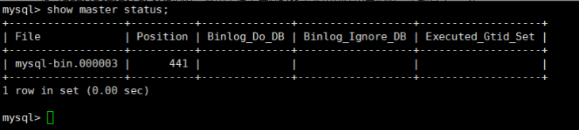

注:上面 SQL 的作用是查看 Master 的状态，执行完此 SQL 后不要再执行任何操作

#### 配置-从库 Slave

第一步:修改 Mysq1 数据库的配置文件/etc/my.cnf

```ini
[mysqld]
server-id=101 #[必须]服务器唯一ID
```

第二步:重启 Mysql 服务
`systemctl restart mysqld`

第三步:登录 Mysq1 数据库，执行下面 SQL

```sql
change master to
master_host='192.168.188.100',master_user='xiaoming',master_password='Root@123456',master_log_file='mysql-bin.000003',master_log_pos=441;

start slave;
```

第四步:登录 Mysql 数据库，执行下面 SQL，查看从数据库的状态`show slave status;`


### 读写分离案例

#### 背景

面对日益增加的系统访问量，数据库的吞吐量面临着巨大瓶颈。对于同一时刻有大量并发读操作和较少写操作类型的应用系统来说，将数据库拆分为**主库和从库**，主库负责处理事务性的增删改操作，从库负责处理查询操作，能够有效的避免由数据更新导致的行锁，使得整个系统的查询性能得到极大的改善。
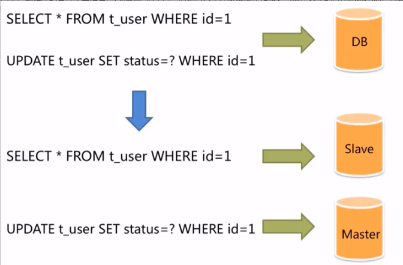

#### Sharding-JDBC 介绍

Sharding-JDBC 定位为轻量级 Java 框架，在 Java 的 JDBC 层提供的额外服务。它使用客户端直连数据库,以 jar 包形式提供服务，无需额外部署和依赖，可理解为增强版的 JDBC 驱动，完全兼容 JDBC 和各种 ORM 框架。

使用 Sharding-JDBC 可以在程序中轻松的实现数据库读写分离。

- 适用于任何基于 JDBC 的 ORM 框架，如: JPA, Hibernate,Mybatis, Spring JDBC Template 或直接使用 JDBC。
- 支持任何第三方的数据库连接池，如:DBCP，C3PO,BoneCP, Druid, HikariCP 等。
- 支持任意实现 JDBC 规范的数据库。目前支持 MySQL，Oracle,SQLServer，PostgreSQL 以及任何遵循 SQL92 标准的数据库。

```xml
<dependency>
    <groupId>org.apache.shardingsphere</groupId>
    <artifactId>sharding-jdbc-spring-boot-starter</artifactId>
    <version>4.0.0-RC1</version>
</dependency>
```

#### 入门案例

使用 Sharding-JDBC 实现读写分离步骤:

1、导入 maven 坐标

2、在配置文件中配置读写分离规则

```yaml
spring:
  shardingsphere:
    datasource:
      names: master,slave
      # 主数据源
      master:
        type: com.alibaba.druid.pool.DruidDataSource
        driver-class-name: com.mysql.cj.jdbc.Driver
        url: jdbc:mysql://192.168.188.100:3306/rw?characterEncoding=utf-8
        username: root
        password: 123456
      # 从数据源
      slave:
        type: com.alibaba.druid.pool.DruidDataSource
        driver-class-name: com.mysql.cj.jdbc.Driver
        url: jdbc:mysql://192.168.188.101:3306/rw?characterEncoding=utf-8
        username: root
        password: 123456
    masterslave:
      # 读写分离配置
      load-balance-algorithm-type: round_robin #轮询
      # 最终的数据源名称
      name: dataSource
      # 主库数据源名称
      master-data-source-name: master
      # 从库数据源名称列表，多个逗号分隔
      slave-data-source-names: slave
    props:
      sql:
        show: true #开启SQL显示，默认false
```

3、在配置文件中配置**允许 bean 定义覆盖**配置项

```yaml
spring:
  main:
    allow-bean-definition-overriding: true
```

### 项目实现读写分离

#### 环境准备(主从复制)

直接使用我们前面在虚拟机中搭建的主从复制的数据库环境即可。

在主库中创建瑞吉外卖项目的业务数据库 reggie 并导入相关表结构和数据。

#### 代码构造

在项目中加入 Sharding-JDBC 实现读写分离步骤:

1、导入 maven 坐标

2、在配置文件中配置读写分离规则

3、在配置文件中配置**允许 bean 定义覆盖**配置项

## Nginx

### Nginx 概述

Nginx 是一款轻量级的 web 服务器/反向代理服务器及电子邮件（IMAP/POP3）代理服务器。其特点是占有内存少，并发能力强，事实上 nginx 的并发能力在同类型的网页服务器中表现较好，中国大陆使用 nginx 的网站有:百度、京东、新浪、网易、腾讯、淘宝等。

Nginx 是由伊戈尔·赛索耶夫为俄罗斯访问量第二的 Rambler .ru 站点（俄文: Paw6nep)开发的，第一个公开版本 0.1.e 发布于 2004 年 10 月 4 日。

官网: <https://nginx.org/>

### Nginx 下载与安装

可以到 Nginx 官方网站下载 Nginx 的安装包，地址为: <https://nginx.org/en/download.html>

安装过程:
1、安装依赖包 yum -y install gcc pcre-devel zlib-devel openssl openssl-devel

2、下载 Nginx 安装包 wget <https://nginx.org/download/nginx-1.16.1.tar.gz>(需要先 yum install wget)

3、解压 tar -zxvf nginx-1.16.1.tar.gz

4、cd nginx-1.16.1

5、./configure --prefix=/usr/local/nginx

6、make && make install

### Nginx 目录结构

安装完 Nginx 后，我们先来熟悉一下 Nginx 的目录结构，如下图:
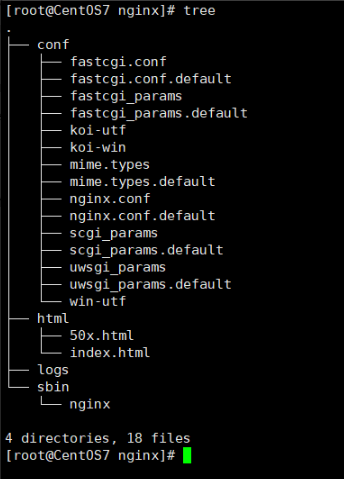

重点目录/文件:

- conf/nginx.conf nginx 配置文件
- html
  存放静态文件(html、css、Js 等)
- logs
  日志目录，存放日志文件
- sbin/nginx
  二进制文件，用于启动、停止 Nginx 服务

### Nginx 命令

#### 查看版本

在 sbin 目录下输入`./nginx -v`
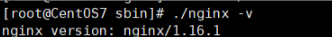

#### 检查配置文件正确性

在启动 Nginx 服务之前，可以先检查一下 conf/nginx.conf 文件配置的是否有错误，命令如下:

```sh
./nginx -t
```

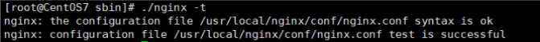

#### 启动和停止

在 sbin 目录下。

启动 Nginx 服务使用如下命令:`./nginx`

停止 Nginx 服务使用如下命令:`./nginx -s stop`

启动完成后可以查看 Nginx 进程:`ps -ef | grep nginx`

修改运行的进程数目：
`vim usr/local/nginx/conf/nginx.conf`

```conf
worker_processes  2;
```

#### 重新加载配置文件

可以通过修改 profile 文件配置环境变量，在`/`目录下可以直接使用 nginx 命令

vim etc/profile

```bash
PATH=/usr/local/nginx/sbin:$JAVA_HOME/bin:$PATH
```

使配置文件生效：`source /etc/profile`

重启 Nginx：`nginx -s reload`

停止 Nginx：`nginx -s stop`

启动 Nginx：`nginx`

### Nginx 配置文件结构

**整体结构介绍**

Nginx 配置文件(conf/nginx.conf)整体分为三部分:

- 全局块
  和 Nginx 运行相关的全局配置

- events 块
  和网络连接相关的配置

- http 块

  代理、缓存、日志记录、虚拟主机配置

  - http 全局块
  - Server 块
    - Server 全局块
    - location 块

**注意**:http 块中可以配置多个 Server 块，每个 Server 块中可以配置多个 location 块。

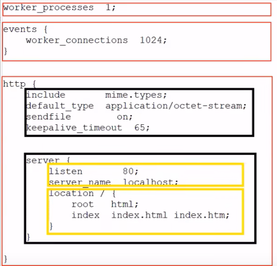

### Nginx 具体应用

#### 部署静态资源

Nginx 可以作为静态 web 服务器来部署静态资源。静态资源指在服务端真实存在并且能够直接展示的一些文件，比如常见的 html 页面、css 文件、js 文件、图片、视频等资源。

相对于 Tomcat，Nginx 处理静态资源的能力更加高效，所以在生产环境下，一般都会将静态资源部署到 Nginx 中。

将静态资源部署到 Nginx 非常简单，只需要将文件复制到 Nginx 安装目录下的 html 目录中即可。

```json
server {
  listen 80;                #监听端口
  server_name localhost;    #服务器名称
  location/{                #匹配客户端请求url
    root html;              #指定静态资源根目录
    index index.html;       #指定默认首页
}
```

#### 反向代理

- 正向代理

  是一个位于客户端和原始服务器(origin server)之间的服务器，为了从原始服务器取得内容，客户端向代理发送一个请求并指定目标(原始服务器)，然后代理向原始服务器转交请求并将获得的内容返回给客户端。

  正向代理的典型用途是为在防火墙内的局域网客户端提供访问 Internet 的途径。

  正向代理一般是**在客户端设置代理服务器**，通过代理服务器转发请求，最终访问到目标服务器。
  

- 反向代理

  反向代理服务器位于用户与目标服务器之间，但是对于用户而言，反向代理服务器就相当于目标服务器，即用户直接访问反向代理服务器就可以获得目标服务器的资源，反向代理服务器负责将请求转发给目标服务器。

  用户**不需要知道目标服务器的地址**，也无须在用户端作任何设定。
  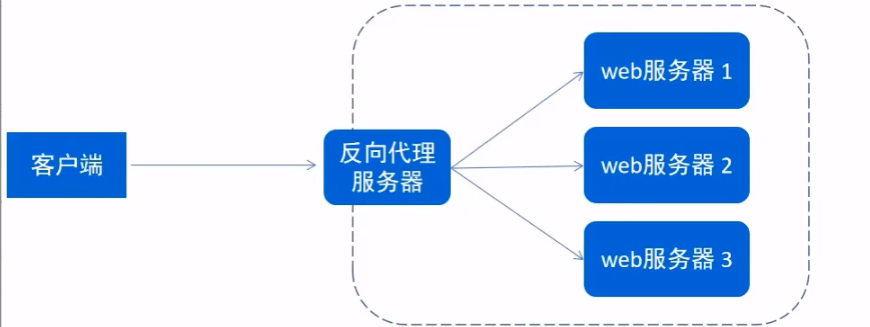

- 配置反向代理

```json
server {
  listen       82;
  server_name  localhost;

  location / {
          proxy_pass http://192.168.188.101:8080; #反向代理配置
  }
}
```

#### 负载均衡

早期的网站流量和业务功能都比较简单，单台服务器就可以满足基本需求，但是随着互联网的发展，业务流量越来越大并且业务逻辑也越来越复杂，单台服务器的性能及单点故障问题就凸显出来了，因此需要多台服务器组成应用集群，进行性能的水平扩展以及避免单点故障出现。

- 应用集群:将同一应用部署到多台机器上，组成应用集群，接收负载均衡器分发的请求，进行业务处理并返回响应数据
- 负载均衡器:将用户请求根据对应的负载均衡算法分发到应用集群中的一台服务器进行处理
  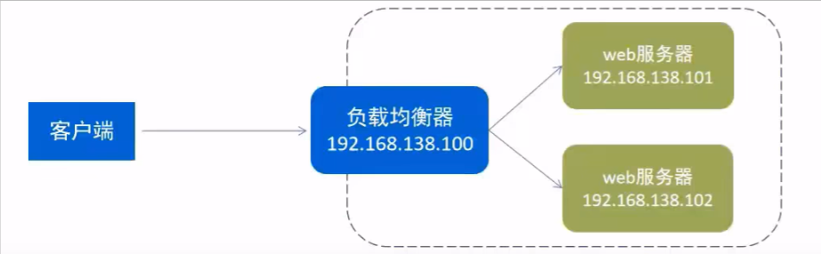

**配置负载均衡**:
修改 ngnix.conf

```css
upstream targetserver{    #upstream指令可以定义一组服务器
  server 192.168.188.101:8080;
  server 192.168.188.101:8081;
}

server {
  listen  8080;
  server_name     localhost;
  location / {
          proxy_pass http://targetserver;
  }
}
```

**负载均衡策略**
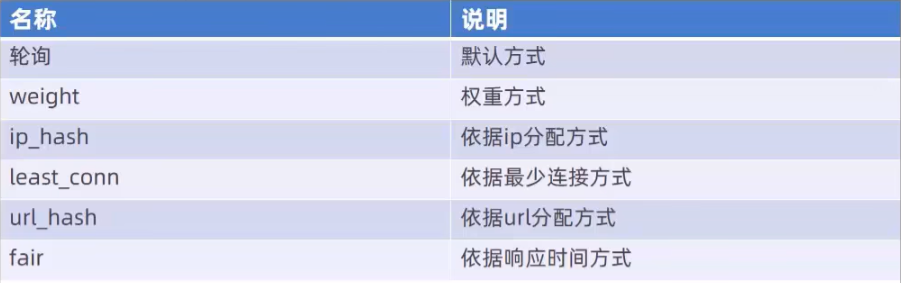

## 前后端分离开发

### 问题分析

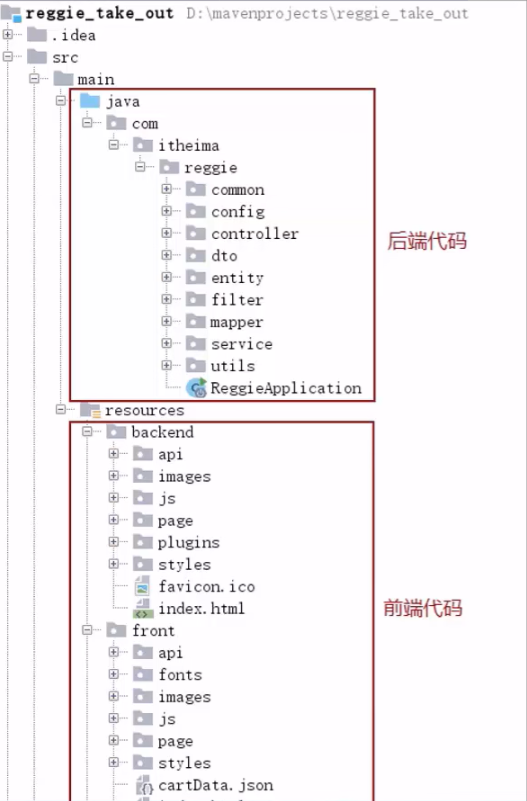

- 开发人员同时负责前端和后端代码开发，分工不明确
- 开发效率低
- 前后端代码混合在一个工程中，不便于管理
- 对开发人员要求高，人员招聘困难

### 前后端分离开发

#### 介绍

**前后端分离开发**，就是在项目开发过程中，对于前端代码的开发由专门的**前端开发人员**负责，后端代码则由**后端开发人员**负责，这样可以做到分工明确、各司其职，提高开发效率，前后端代码并行开发，可以加快项目开发进度。目前，前后端分离开发方式已经被越来越多的公司所采用，成为当前项目开发的主流开发方式。

前后端分离开发后，从工程结构上也会发生变化，即前后端代码不再混合在同一个 maven 工程中，而是分为**前端工程和后端工程**。
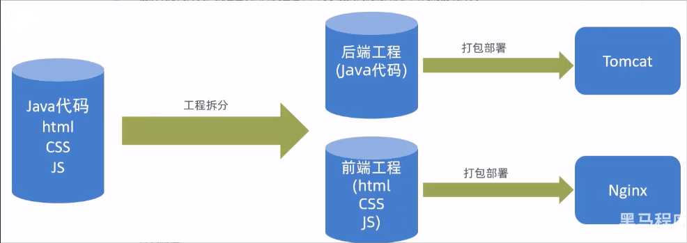

#### 开发流程

前后端分离开发后，面临一个问题，就是前端开发人员和后端开发人员如何进行配合来共同开发一个项目?可以按照如下流程进行:
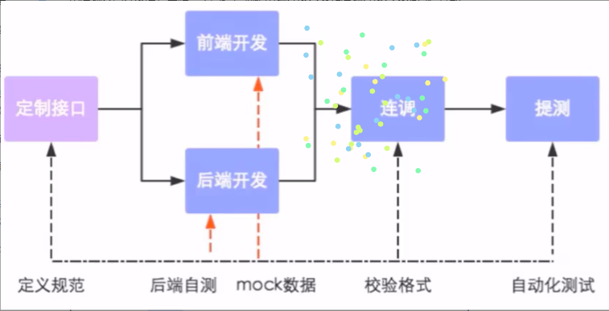
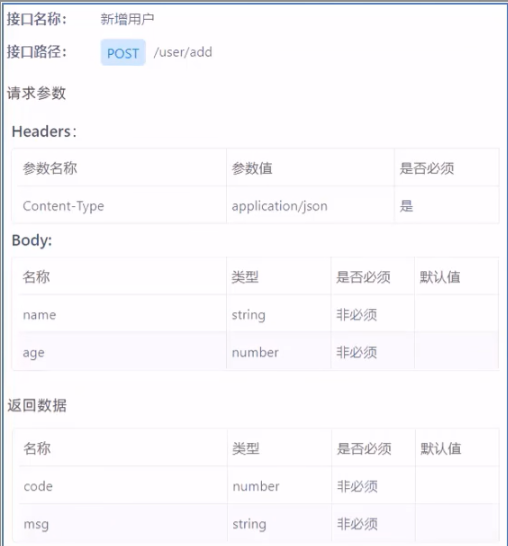

**接口(API 接口)** 就是一个 http 的请求地址，主要就是去定义:请求路径、请求方式、请求参数、响应数据等内容

#### 前端技术栈

开发工具

- Visual Studio Code
- hbuilder

技术框架

- nodejs
- VUE
- ElementUI
- mock
- webpack

### Yapi

#### 介绍

YApi 是高效、易用、功能强大的 api 管理平台，旨在为开发、产品、测试人员提供更优雅的接口管理服务。可以帮助开发者轻松创建、发布、维护 API，YApi 还为用户提供了优秀的交互体验，开发人员只需利用平台提供的接口数据写入工具以及简单的点击操作就可以实现接口的管理。

YApi 让接口开发更简单高效，让接口的管理更具可读性、可维护性，让团队协作更合理。

源码地址: <https://github.com/YMFE/yapi>

要使用 YApi，需要自己进行部署。

#### 使用

使用 YApi 可以执行下面操作

- 添加项目
- 添加分类
- 添加接口
- 编辑接口
- 查看接口

### Swagger

#### 介绍

使用 Swagger 你只需要按照它的规范去定义接口及接口相关的信息，再通过 Swagger 衍生出来的一系列项目和工具，就可以做到生成各种格式的接口文档，以及在线接口调试页面等等。

官网:<https://swagger.io/>

knife4j 是为 Java MVC 框架集成 Swagger 生成 Api 文档的增强解决方案。

#### 使用方式

操作步骤:

1、导入 knife4j 的 maven 坐标

```xml
<dependency>
    <groupId>com.github.xiaoymin</groupId>
    <artifactId>knife4j-spring-boot-starter</artifactId>
    <version>3.0.2</version>
</dependency>
```

2、导入 knife4j 相关配置类

WebMvcConfig

```java
@Slf4j
@Configuration
@EnableSwagger2
@EnableKnife4j
public class WebMvcConfig extends WebMvcConfigurationSupport {
  @Bean
  public Docket createRestApi() {
      //文档类型
      return new Docket(DocumentationType.SWAGGER_2)
              .apiInfo(apiInfo())
              .select()
              .apis(RequestHandlerSelectors.basePackage("com.ka.reggie.controller"))
              .paths(PathSelectors.any())
              .build();
  }
  private ApiInfo apiInfo() {
      return new ApiInfoBuilder()
              .title("瑞吉外卖")
              .version("1.0")
              .description("瑞吉外卖接口文档")
              .build();
  }
}
```

3、设置静态资源，否则接口文档页面无法访问(addResourceHandlers 方法)

```java
registry.addResourceHandler("doc.html").addResourceLocations("classpath:/META-INF/resources/");
registry.addResourceHandler("/webjars/**").addResourceLocations("classpath:/META-INF/resources/webjars/");
```

4、在 LoginCheckFilter 中设置不需要处理的请求路径

```java
String[] urls = new String[]{
        "/employee/login",
        "/employee/logout",
        "/backend/**",
        "/front/**",
        "/common/**",
        "/user/sendMsg",
        "/user/login",

        "/doc.html",
        "/webjars/**",
        "/swagger-resources",
        "/v2/api-docs"
};
```

#### 常用注解

| 注解               | 说明                                                      |
| ------------------ | --------------------------------------------------------- |
| @Api               | 用在请求的类上，例如 Controller，表示对类的说明           |
| @ApiModel          | 用在类上，通常是实体类，表示一个返回响应数据的信息        |
| @ApiModelProperty  | 用在属性上，描述响应类的属性                              |
| @ApiOperation      | 用在请求的方法上，说明方法的用途、作用                    |
| @ApilmplicitParams | 用在请求的方法上，表示一组参数说明                        |
| @ApilmplicitParam  | 用在@ApilmplicitParams 注解中，指定一个请求参数的各个方面 |

### 项目部署

#### 部署架构

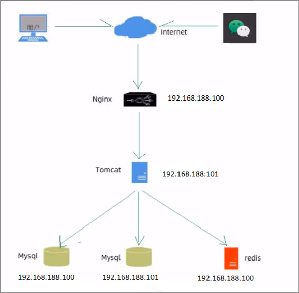

#### 部署环境说明

服务器:

- 192.168.138.100（服务器 A)

  Nginx:部署前端项目、配置反向代理

  Mysql:主从复制结构中的主库

  Redis:缓存中间件

- 192.168.138.101（服务器 B)

  jdk:运行 Java 项目

  git:版本控制工具

  maven:项目构建工具

  jar: Spring Boot 项目打成 jar 包基于内置 Tomcat 运行

  Mysql:主从复制结构中的从库

#### 部署前端项目

第一步:在服务器 A 中安装 Nginx，将课程资料中的 dist 目录上传到 Nginx 的 html 目录下

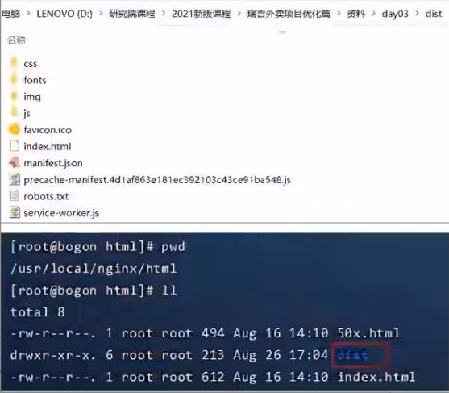

第二步:修改 Nginx 配置文件 nginx.conf

```json
server{
  listen 80;
  server_name localhost;

  location /{
    root html/dist;
    index index.html;
  }

  location ^~ /api/{
          rewrite ^/api/(.*)$ /$1 break;
          proxy_pass http://192.168.188.101:8080;
  }

  error_page 500 502 503 504 /50x.html;
  location = /50x.html{
      root html;
  }
}
```

#### 部署后端项目

第一步 ∶ 在服务器 B 中安装 jdk、git、maven、MySQL，使用 git clone 命令将 git 远程仓库的代码克隆下来
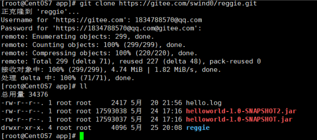

第二步:将资料中提供的 reggieStart.sh 文件上传到服务器 B，通过 chmod 命令设置执行权限
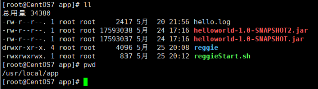

第三步:执行 reggieStart.sh 脚本文件，自动部署项目

**注意**： 本人用该脚本从 git 拉取的文件不完整，运行不了，建议用 idea 手动打包部署
