# **学成在线项目开发环境配置 v3.1**

[[TOC]]

## **1 开发工具版本**

开发工具列表：

|                    |                    |          |
| ------------------ | ------------------ | -------- |
| 开发工具           | 版本号             | 安装位置 |
| IntelliJ-IDEA      | 2021.x 以上版本    | 个人电脑 |
| JDK                | 1.8.x              | 个人电脑 |
| Maven              | 3.8.x 以上版本     | 个人电脑 |
| Git                | 2.37.x             | 个人电脑 |
| VMware-workstation | 16.x               | 个人电脑 |
| CentOS             | 7.x                | 虚拟机   |
| Docker             | 18.09.0            | 虚拟机   |
| Mysql              | 8.x                | docker   |
| nacos              | 1.4.1              | docker   |
| rabbitmq           | 3.8.34             | docker   |
| redis              | 6.2.7              | docker   |
| xxl-job-admin      | 2.3.1              | docker   |
| minio              | RELEASE.2022-09-07 | docker   |
| elasticsearch      | 7.12.1             | docker   |
| kibana             | 7.12.1             | docker   |
| gogs               | 0.13.0             | docker   |
| nginx              | 1.12.2             | docker   |

## **2 IDEA 环境配置**

安装指定版本的 IDEA，根据下边的步骤进行配置。

### **2.1 编码配置**

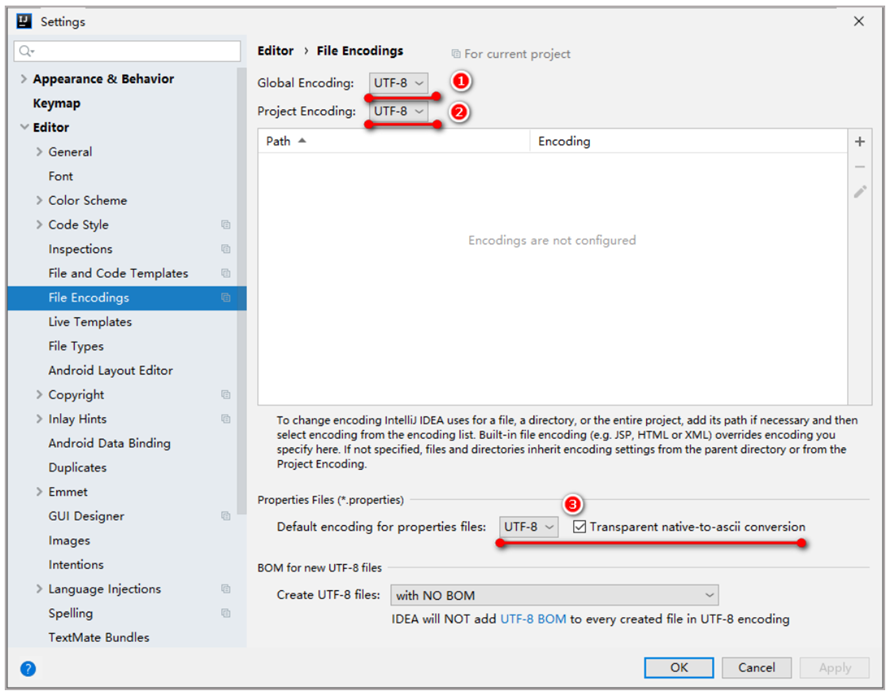

### **2.2 自动导包设置**

IDEA 可以自动优化导入包，**但是有多个同名的类调用不同的包，必须自己手动 Alt+Enter 设置**，  
下面可以通过设置来进行导包优化。

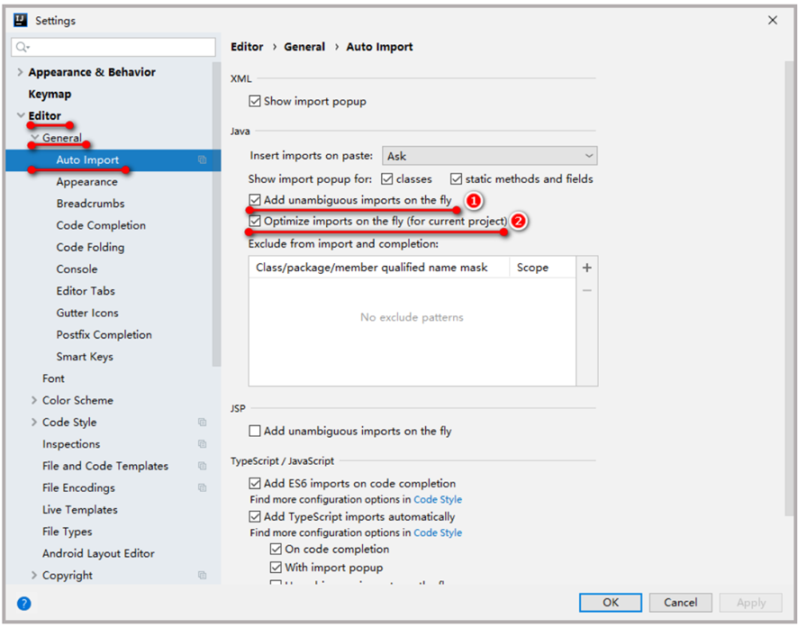

### **2.3 提示忽略大小写**

IDEA 代码提示默认是区分大小写的，设置为提示忽略大小写，编译我们后期的开发

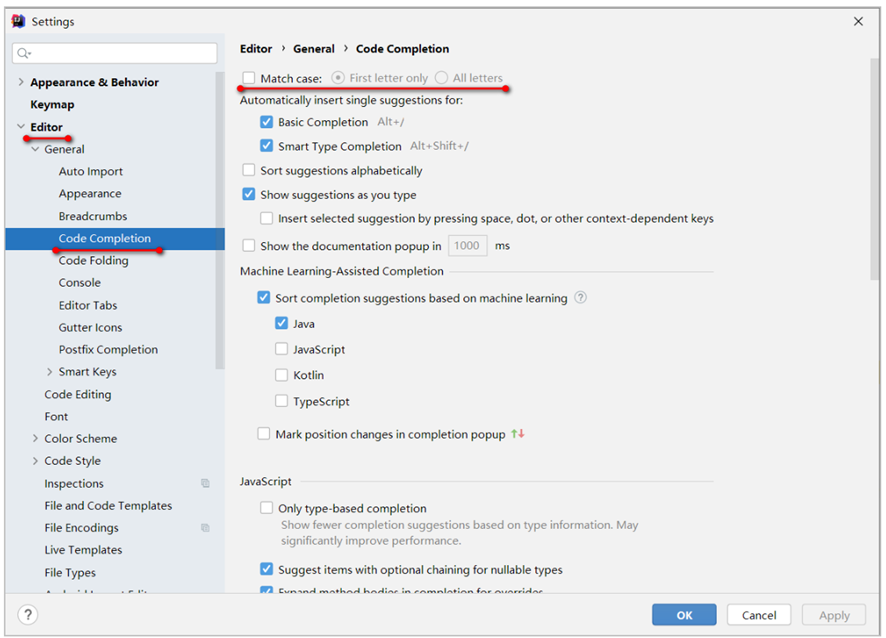

### **2.4 设置 Java 编译级别**

工程创建成功，点击 Project Structure:

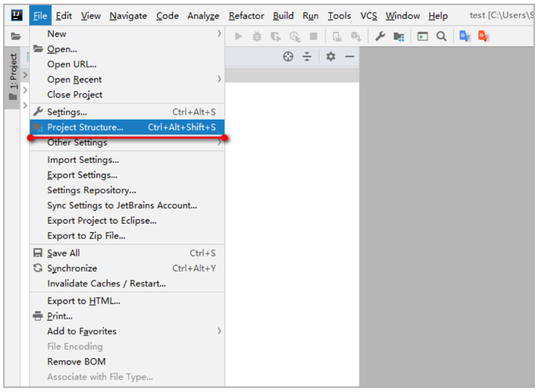

点击 Project，设置 SDK 为 1.8 及 Project language level，如下图：

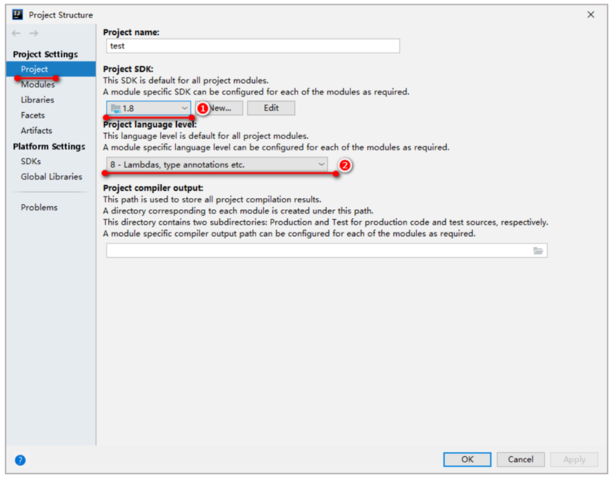

## **3 Maven 环境**

### **3.1 安装 Maven**

下载 maven3.8.6 版本，下载链接如下：

https://dlcdn.apache.org/maven/maven-3/3.8.6/binaries/apache-maven-3.8.6-bin.zip

解压 apache-maven-3.8.6-bin.zip 到没有中文的目录下。

### **3.2 配置仓库**

1、解压课程资料中的 maven 仓库下的 repository.zip 到本地硬盘

2、在 Maven 的 conf 目录中 setting.xml 文件中配置本地仓库的地址。

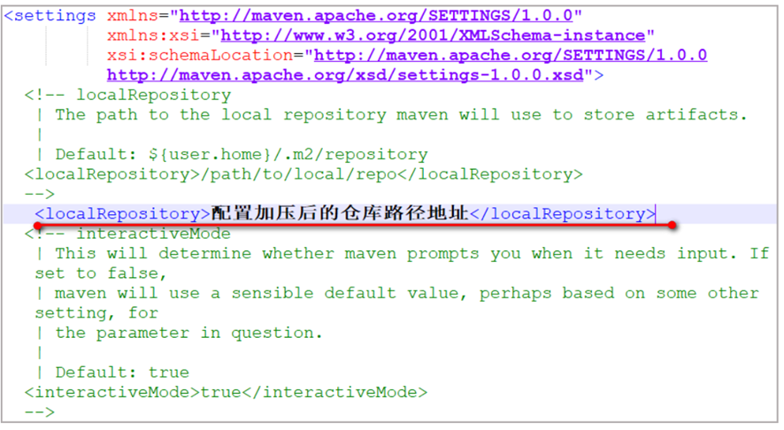

配置中央仓库位置：

在 setting.xml 文件中配置阿里云中央仓库地址。

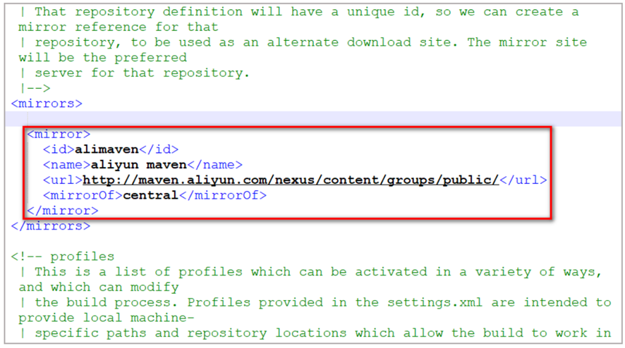

### **3.3 IDEA 中配置 maven**

在 IDEA 中配置 maven：进入 File --&gt; Settings --&gt; Build --&gt; Build Tools --&gt; Maven

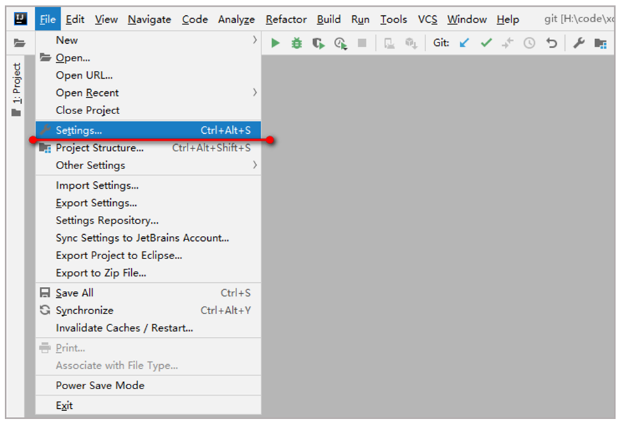

配置 maven 安装目录、setting.xml 及本地仓库的位置。

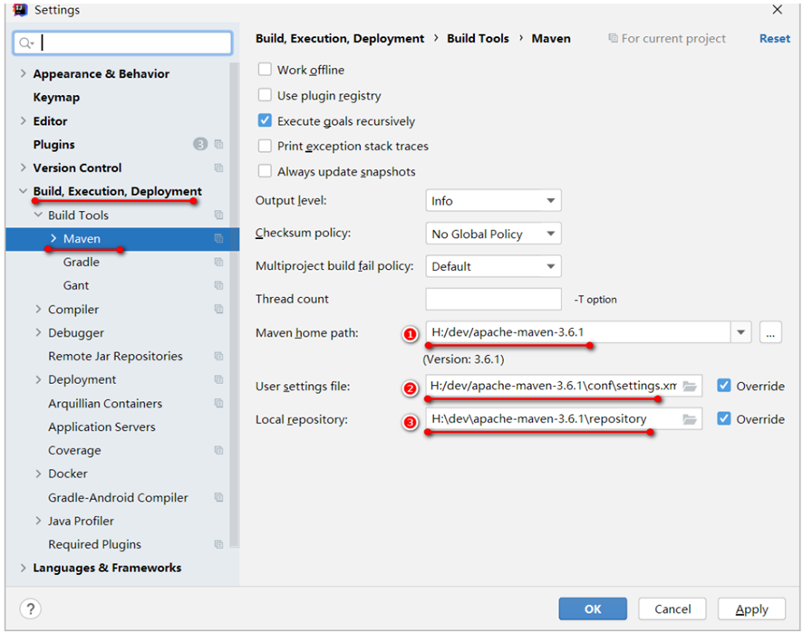

## **4 安装虚拟机**

项目中用到的一些服务端软件如：MySQL、Nacos 配置中心、RabbitMQ 消息队列等通常会安装在企业局域网的服务器中，开发人员去远程连接它们。在教学中我们在自己的电脑上安装虚拟机，虚拟机代表了企业局域网中的服务器。

服务器操作系统使用 Centos7，导入我发的虚拟机文件，也可以自行安装 Centos7 虚拟机。

1、导入虚拟机：

首先安装 VMware-workstation 16.x 虚拟机软件。

1）设置网络

点击 “编辑--》虚拟网络编辑器”配置网络地址，地址须与下图一致。

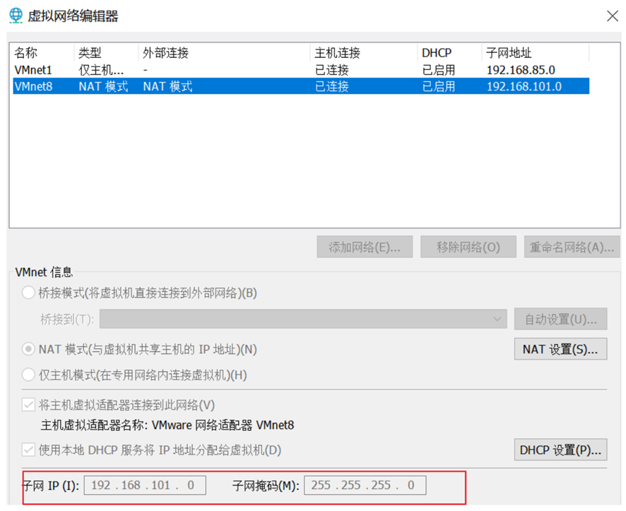

设置子网 IP：192.168.101.0，子网掩码：255.255.255.0。

2）导入虚拟机

解压老师提供的虚拟机文件，进入解压后的文件架，双击"CentOS 7 64 位.vmx" 文件，选择复制虚拟机。

对此虚拟机的设置建议 8G 内存、4 核 CPU。

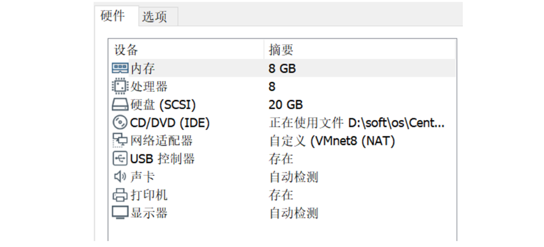

设置完成，启动虚拟机。

注意：虚拟机的 IP 地址为 192.169.101.65，不用修改 IP 地址。

3）远程连接虚拟机

使用 ssh 客户端工具 FinalShell 远程 连接 虚拟机中的 CentOS 系统。

IP 地址：`192.168.101.65`

账号与密码为：`root/centos`

执行 `systemctl start docker` 启动 docker。

运行： `sh /data/soft/restart.sh`

查询 docker 容器：docker ps

如下图：

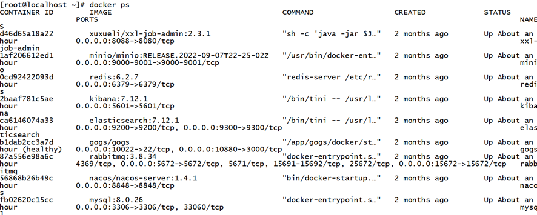

2、自行安装虚拟机：

首先安装 VMware-workstation 16.x 虚拟机软件。

Centos7 的安装文件在常用软件工具目录下的 centos7 目录中，也可以自行下载 CentOS7 的安装包，下载地址：<http://isoredirect.centos.org/centos/7/isos/x86_64/>

CentOS7 只提供了 64 位，这里选择 DVD 版本下载。

安装 CentOS7，在 VMware 中新建一个虚拟机，选择刚才下载的 CentOS7 的 iso 映像文件，然后一步一步进行安装，具体可以参考 centos7 目录中的 centos7 安装.docx。

## **5 安装数据库环境**

1、启动虚拟机中的 Docker 及容器

保证 mysql 数据库启动成功

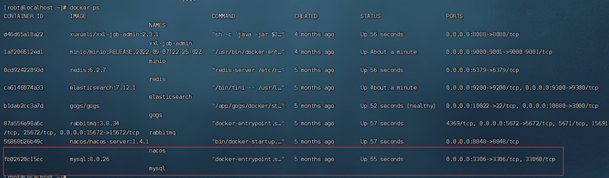

2、安装数据库客户端工具，可使用软件工具目录的 datagrip-2022.2.2.win.zip，也可自行下载。

数据库账号密码：`root/mysql`

3、远程连接数据库

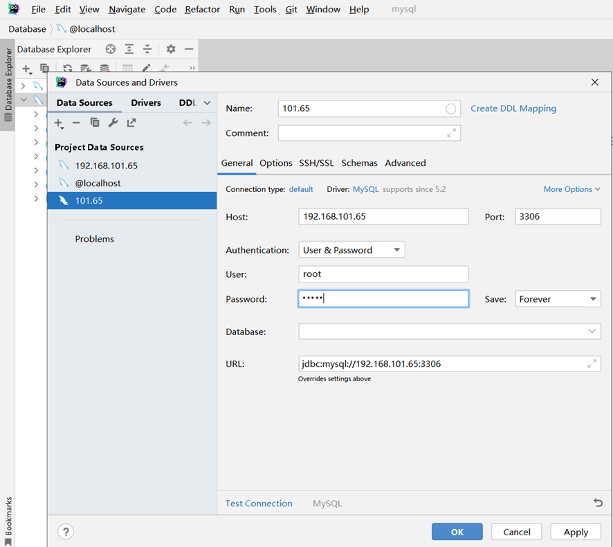

连接成功，选择 schema

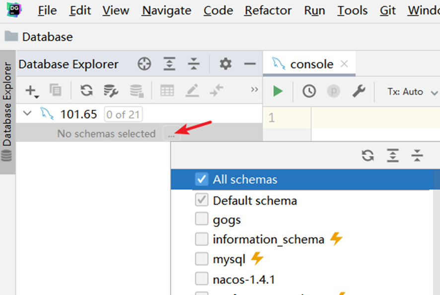

显示所有数据库，如下：

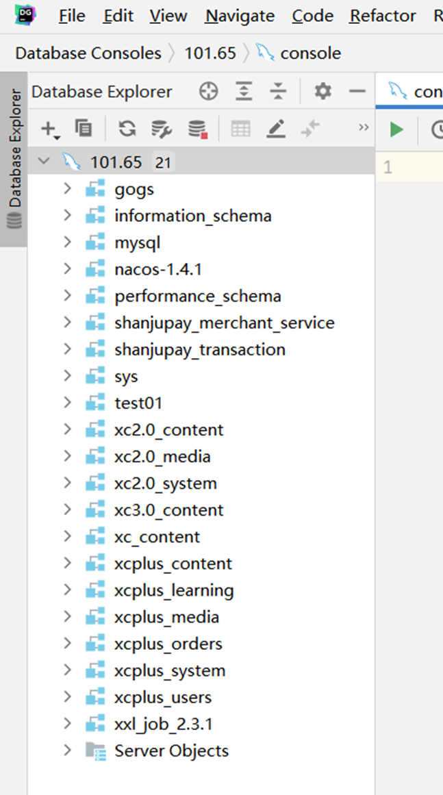

到此数据库环境搭建成功。

## **6 安装 Git 环境**

### **6.1 安装 Git**

在个人电脑安装 Git，使用常用软件工具目录中的 Git-2.37.3-64-bit.exe。

也可以自行下载，地址：https://git-scm.com/ （windows 版本：https://git-scm.com/download/win）

安装成功，在右键菜单出现 Git 菜单，如下图

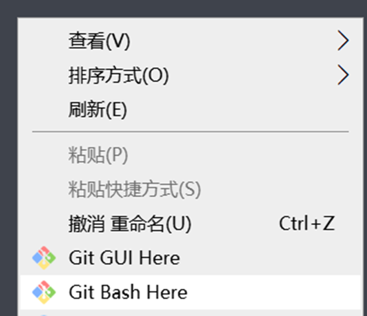

配置 git 邮箱：

```sh
git config --global user.name "你的名字"
git config --global user.email "你的邮箱"
```

安装成功在 IDEA 中配置 git 的安装目录

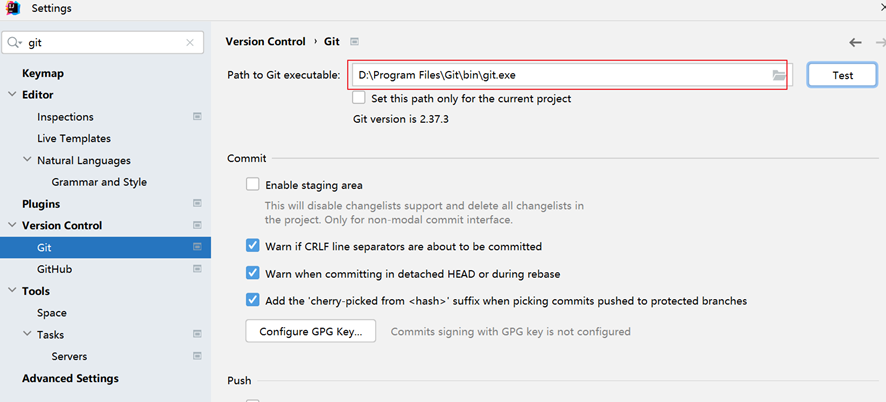

### **6.2 搭建 Gogs**

在发放的虚拟机中已经安装了 Gogs 服务，Gogs 和 GitHub、GitLab 都是 Git 托管平台，Gogs 相比它们两者更轻量。Gogs 的官网地址：<https://gogs.io/>，本项目使用 Gogs 作为 Git 远程仓库。

每位同学把虚拟上的 Gogs 服务作为远程仓库，每天练习的代码都需要上传至 Gogs。

如果个人虚拟机 Gogs 存在问题也可以使用其它 git 仓库，比如：gitee.com 等。

下边介绍 Gogs 的基本使用方法

进入 Gogs：[http://192.168.101.65:10880](http://192.168.101.65:10880/gogs/xuecheng-plus)

账号/密码：`gogs/gogs`

1、首先创建一个组织

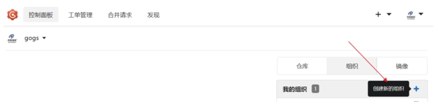

该组织通常以项目名命名，填写组织名称。

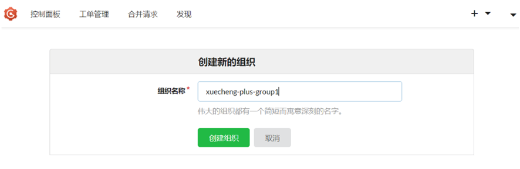

创建成功，进入管理面板修改组织信息

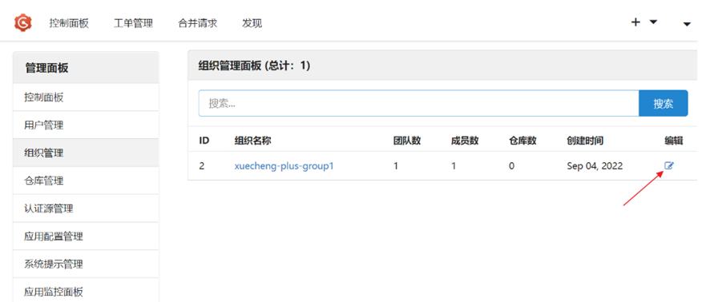

点击编辑，填写组织名称。

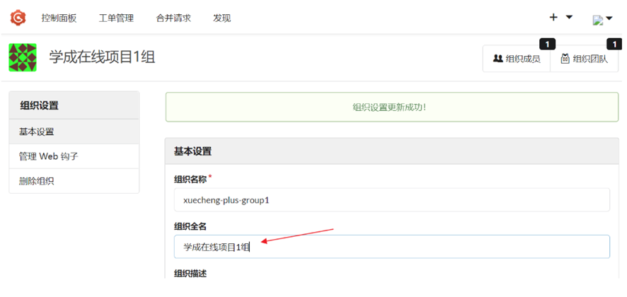

修改成功，进入首页点击组织名称

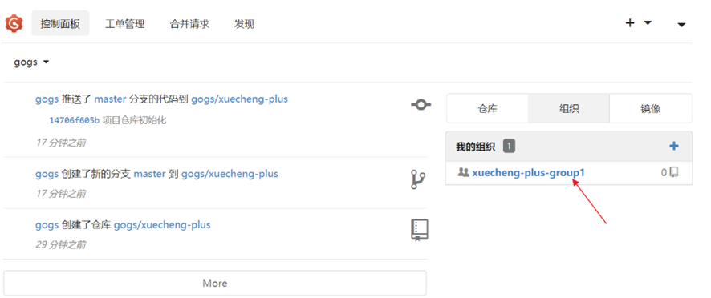

进入组织首页

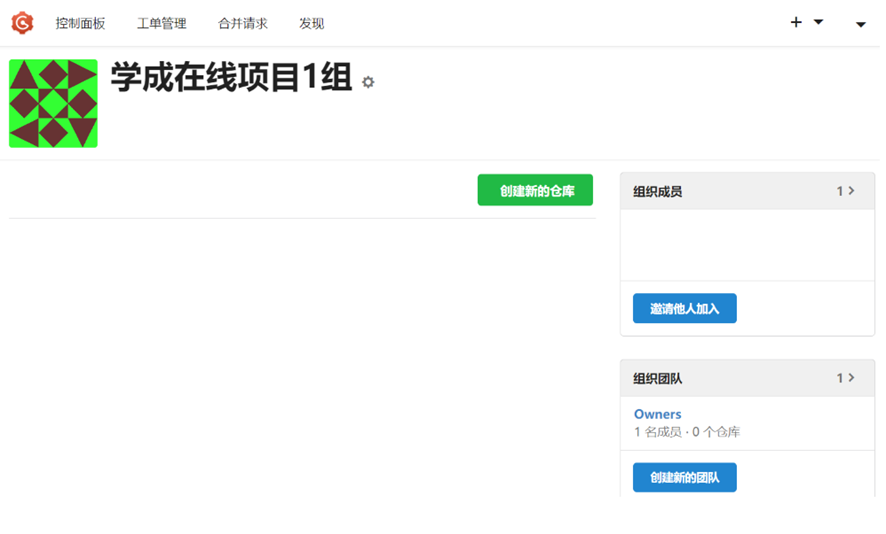

下边开始创建团队

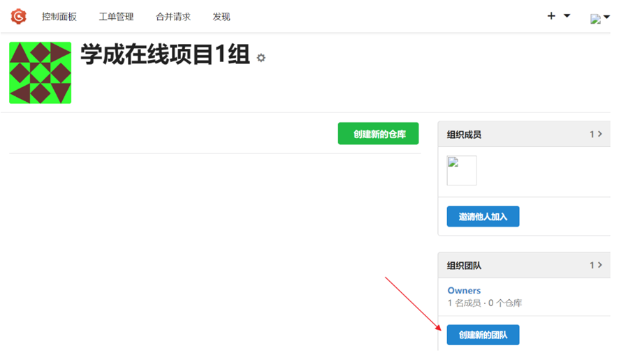

假如创建研发团队，填写团队名称

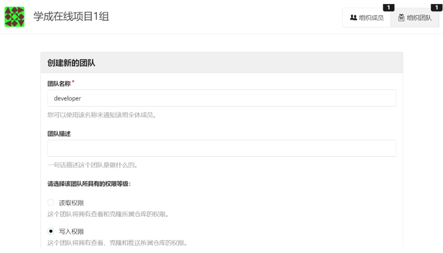

选择权限等级，注意：这里即使选择了权限等级也需要在仓库管理中去管理协作者的权限。

团队创建成功

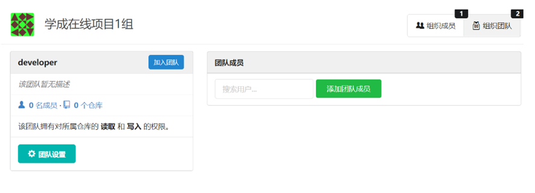

团队创建成功下边开始创建成员账号 。

首先在用户管理中添加账号分配给成员。

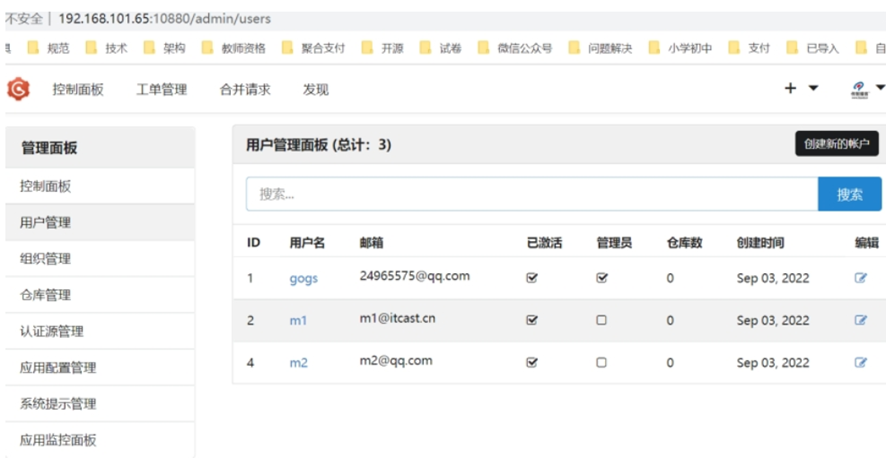

然后在下边的界面 中向团队添加成员

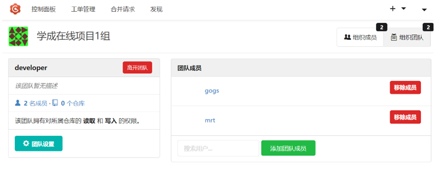

团队和组织创建完成，下边创建仓库，进入组织，创建仓库。

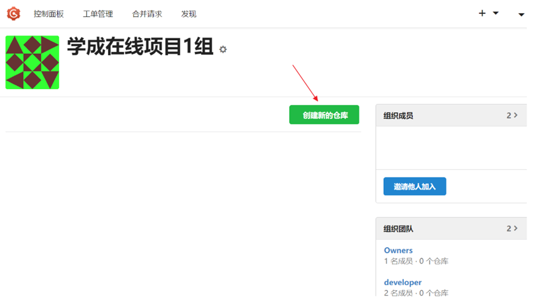

填写仓库信息

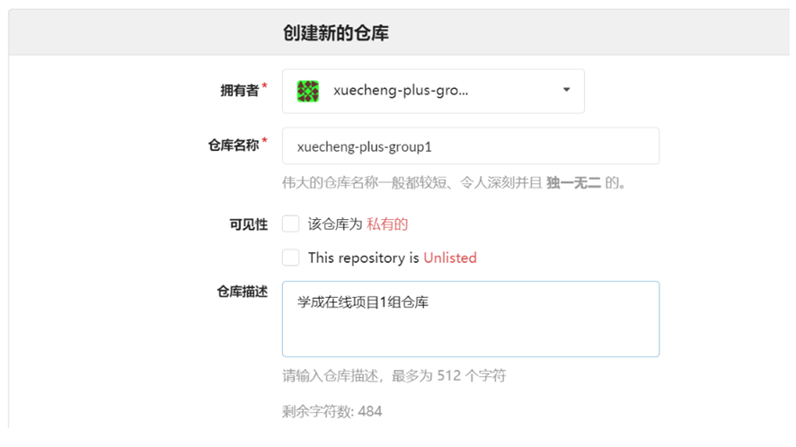

创建成功，仓库地址：<http://192.168.101.65:10880/xuecheng-plus-group1/xuecheng-plus-group1.git>，如下

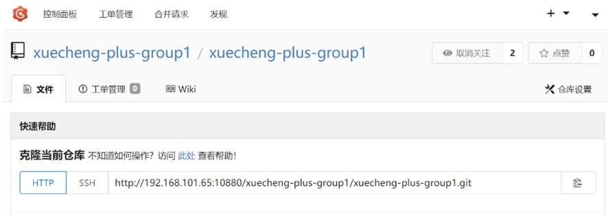

下边配置使用仓库的人员

点击“仓库设置”，

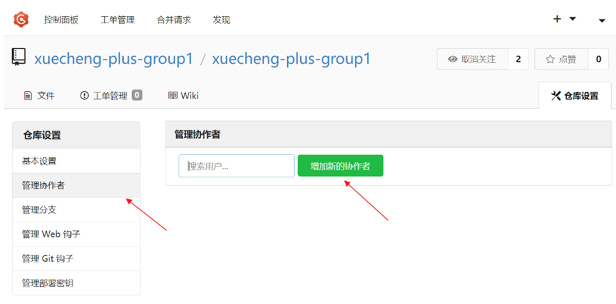

添加协作者，将团队成员的账号添加为协作者。

添加完成注意分配权限，如下图，通常测试人员为读取权限，开发人员为读写权限。

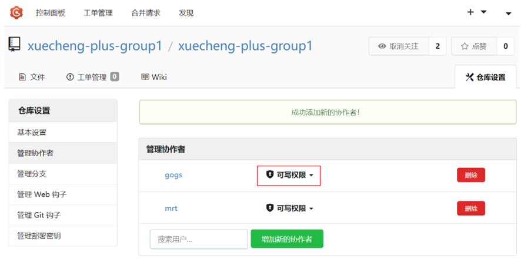

团队 Leader 需要将初始代码上传至 Git 仓库，团队成员通过 Idea 克隆一份项目代码，通过此仓库进行协作开发。
