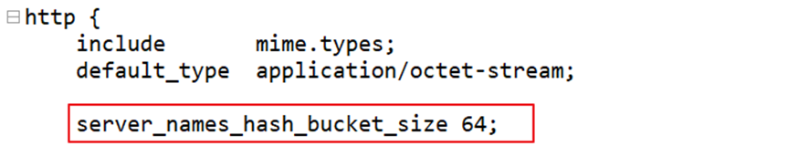
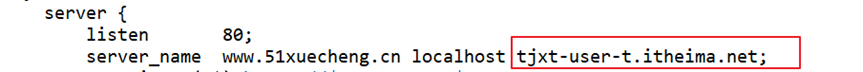
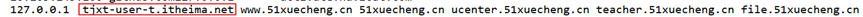

# **微信扫码登录配置**

[[TOC]]

### 1、修改前端工程 xc-ui-pc-static-portal 目录下的 wxsign.html

屏蔽代码行：redirect_uri: "http://tjxt-user-t.itheima.net/xuecheng/auth/wxLogin"

改为如下方式：

```javascript
//请用微信生成二维码
function generateWxQrcode(token) {
  var wxObj = new WxLogin({
    self_redirect: true,
    id: 'login_container',
    appid: 'wx17655f8047b85150',
    scope: 'snsapi_login',
    //redirect_uri: "http://tjxt-user-t.itheima.net/xuecheng/auth/wxLogin",
    redirect_uri: 'http://tjxt-user-t.itheima.net/api/auth/wxLogin',
    state: token,
    style: '',
    href: ''
  })
}
```

2、在 nginx.conf 配置 tjxt-user-t.itheima.net 域名

在 http 下添加 server_names_hash_bucket_size 64;如下：



配置 tjxt-user-t.itheima.net 虚拟主机，如下：



重新加载 nginx 的配置文件：nginx.exe -s reload

### 3、配置 hosts 文件

修改 hosts 文件，配置 tjxt-user-t.itheima.net 如下：


