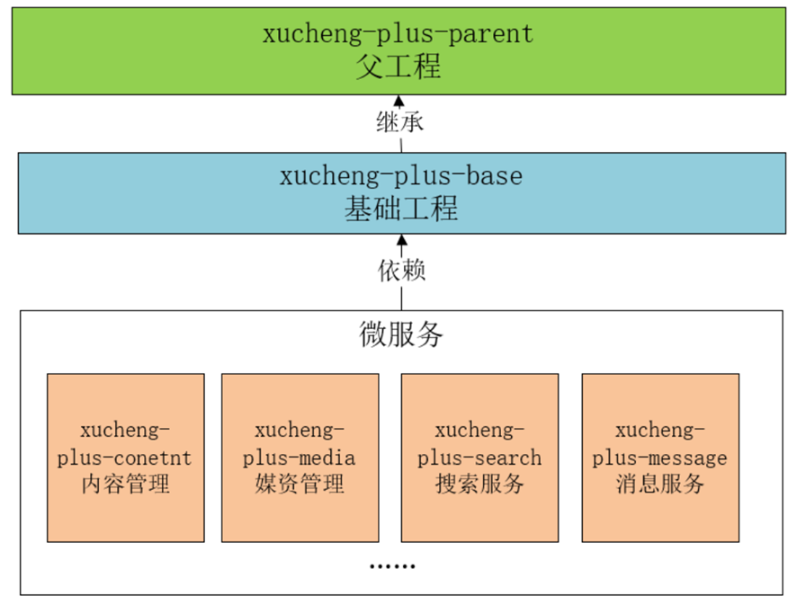

# **第 1 章 项目介绍&环境搭建 v3.1**

[[TOC]]

## **1.项目背景**

### **1.1 在线教育市场环境**

以下内容摘自<https://report.iresearch.cn/content/2021/01/358854.shtml>

在线教育行业是一个有着极强的广度和深度的行业，从校内到校外；从早幼教到职业培训；从教育工具到全信息化平台等等。

2020 年的新冠疫情外生冲击，让在线教育再次站在聚光灯下。疫情下教育领域获融资最多，而其中在线教育最受资本青睐。据[艾瑞咨询](http://s.iresearch.cn/search/airuizixun/)统计，2020 年教育行业累计融资 1164 亿元，其中在线教育融资金额 1034 亿元，占比 89%。与此同时，在行业处于困境的情况下，会加速洗牌，资源向好的企业集中。2020 年资源向头部集中趋势明显，中小型机构生存更加困难。2020 年资本向在线教育行业累计输送的 1034 亿元中，80%都流向了头部的 5 家公司。

**To C 市场**

据艾瑞咨询统计核算，2020 年中国在线教育行业市场规模 2573 亿元，过去 4 年的 CAGR 达 34.5%，其中低幼及素质教育赛道、K12 学科培训赛道在线化进程加快是在线教育市场快速增长的最主要贡献因素。疫情影响下，低幼及素质教育领域的在线化范围持续纵深，职业教育领域的在线化进程也在不断加速，新的供给和需求不断产生。但同时，2020 年疫情外生冲击加快了 2020 年的在线教育进程，将会透支一部分 2021 年的增速，艾瑞预计 2021 年在线教育行业同比增速将回落到 20%左右。


**To B** **市场**

疫情也加速了整个教育产业链的进化，to B 机构快速成长起来，扮演着赋能者的角色，课程内容、招生、师训、直播系统、管理系统等产品及服务大量涌现。随着云服务发展成熟以及疫情对直播课需求的催化，大量提供直播授课系统等 PaaS/SaaS 服务的机构迅速成长起来，成为各种会展上的主力军。


### **1.2 IT 培训市场规模**

中国 IT 人才供给报告（<https://new.qq.com/rain/a/20210831A01JI600>）

IT 人才总体供不应求，高中低人才分别占比 8%、41%、51%，详见下图：


IT 服务是贯穿 IT 应用系统全生命周期的各项服务的统称，下图是 IT 服务产品图谱，本项目属于 IT 培训产业。


下图是 IT 培训市场规模：


### **1.3 学成在线项目背景**

软件总体分为两类：系统软件和应用软件，应用软件包括：运营类、管理类、工具类等，运营类的项目由运营商按照企业的商业模式去运营，比如：外卖项目、滴滴打车、在线教育等；管理类的项目是为某个组织完成某业务的数据及业务管理，比如：医院 MIS（管理信息*系统*--Management Information System）系统，ERP 系统（ERP 全称是 Enterprise Resource Planning，其中文名字为企业资源计划，这个系统是针对物资资源管理，人力资源管理，财务资源管理，信息资源管理集成一体化的一个企业管理系统。）等；工具类的项目是为了某个领域完成具体的需求，比如：数据采集系统、文件处理系统等。

学成在线项目属于运营类的项目，运营类项目的研发可能是自研也可能是外包，自研是由运营商成立软件研发部门自己进行软件研发，运营商即是甲方也是乙方，外包则是由运营商外包给第三方软件公司进行研发，运营商是甲方，软件公司是乙方。

学成在线项目是本公司自研的一个专门针对成人职业技能教育的网络课堂系统，网站提供了成人职业技能培训的相关课程，如：软件开发培训、职业资格证书培训、成人学历教育培训等课程。项目基于 B2B2C 的业务模式，培训机构可以在平台入驻、发布课程，运营人员对发布的课程进行审核，审核通过后课程才可以发布成功，课程包括免费和收费两种形式，对于免费课程可以直接选课学习，对于收费课程在选课后需要支付成功才可以继续学习。

什么是 B2B2C？

B2B2C 是一种电子商务类型的网络购物商业模式，B 是 Business 的简称，C 是 Consumer 的简称，第一个 B 指的是商品或服务的供应商，第二个 B 指的是从事电子商务的企业，C 则是表示消费者。

B2B 的定义：企业跟企业之间的电子商务运作方式。  
B2C 的定义：企业跟消费者之间的电子商务运作方式。

## **1.项目介绍**

下边分别从业务和技术两个方式介绍项目。

### **1.1 项目业务介绍**

本项目包括了用户端、机构端、运营端。

核心模块包括：内容管理、媒资管理、课程搜索、订单支付、选课管理、认证授权等。

下图是项目的功能模块图：


下边介绍业务流程：

1、课程编辑与发布流程如下：


2、课程发布后学生登录平台进行选课、在线学习。

免费课程可直接学习，收费课程需要下单购买。

学生选课流程如下：


### **1.3 项目技术架构**

本项目采用前后端分离架构，后端采用 SpringBoot、SpringCloud 技术栈开发，数据库使用了 MySQL，还使用的 Redis、消息队列、分布式文件系统、Elasticsearch 等中间件系统。

划分的微服务包括：内容管理服务、媒资管理服务、搜索服务、订单支付服务、 学习中心服务、系统管理服务、认证授权服务、网关服务、注册中心服务、配置中心服务等。

下图是项目的技术架构图：


各层职责说明如下：

|          |                                                                                                                                                                                                                                                                                                                                                                                                                                                                     |
| -------- | ------------------------------------------------------------------------------------------------------------------------------------------------------------------------------------------------------------------------------------------------------------------------------------------------------------------------------------------------------------------------------------------------------------------------------------------------------------------- |
| 名称     | 功能描述                                                                                                                                                                                                                                                                                                                                                                                                                                                            |
| 用户层   | 用户层描述了本系统所支持的用户类型包括：pc 用户、app 用户、h5 用户。pc 用户通过浏览器访问系统、app 用户通过 android、ios 手机访问系统，H5 用户通过 h5 页面访问系统。                                                                                                                                                                                                                                                                                                |
| CDN      | CDN 全称 Content Delivery Network，即内容分发网络，本系统所有静态资源全部通过 CDN 加速来提高访问速度。系统静态资源包括：html 页面、js 文件、css 文件、image 图片、pdf 和 ppt 及 doc 教学文档、video 视频等。                                                                                                                                                                                                                                                        |
| 负载均衡 | 系统的 CDN 层、UI 层、服务层及数据层均设置了负载均衡服务，上图仅在 UI 层前边标注了负载均衡。 每一层的负载均衡会根据系统的需求来确定负载均衡器的类型，系统支持 4 层负载均衡+7 层负载均衡结合的方式，4 层负载均衡是指在网络传输层进行流程转发，根据 IP 和端口进行转发，7 层负载均衡完成 HTTP 协议负载均衡及反向代理的功能，根据 url 进行请求转发。                                                                                                                    |
| UI 层    | UI 层描述了系统向 pc 用户、app 用户、h5 用户提供的产品界面。根据系统功能模块特点确定了 UI 层包括如下产品界面类型： 1）面向 pc 用户的门户系统、学习中心系统、教学管理系统、系统管理中心。 2）面向 h5 用户的门户系统、学习中心系统。 3）面向 app 用户的门户系统、学习中心系统。                                                                                                                                                                                       |
| 微服务层 | 微服务层将系统服务分类三类：业务服务、基础服务、第三方代理服务。 业务服务：主要为学成在线核心业务提供服务，并与数据层进行交互获得数据。 基础服务：主要管理学成在线系统运行所需的配置、日志、任务调度、短信等系统级别的服务。 第三方代理服务：系统接入第三方服务完成业务的对接，例如认证、支付、视频点播/直播、用户认证和授权。                                                                                                                                      |
| 数据层   | 数据层描述了系统的数据存储的内容类型，关系性数据库：持久化的业务数据使用 MySQL。 消息队列：存储系统服务间通信的消息，本身提供消息存取服务，与微服务层的系统服务连接。 索引库：存储课程信息的索引信息，本身提供索引维护及搜索的服务，与微服务层的系统服务连接。 缓存：作为系统的缓存服务，作为微服务的缓存数据便于查询。 文件存储：提供系统静态资源文件的分布式存储服务，文件存储服务器作为 CDN 服务器的数据来源，CDN 上的静态资源将最终在文件存储服务器上保存多份。 |

### **1.2 项目演示**

下边在测试环境演示系统的核心业务流程，本项目主要包括三类用户角色：学生、教学机构的老师、平台运营人员，核心业务流程包括课程发布流程、选课学习流程。

课程发布流程：

1、教学机构的老师登录教学管理平台，编辑课程信息，发布自己的课程。

2、平台运营人员登录运营平台审核课程、视频等信息，审核通过后课程方可发布。

流程图如下：


课程发布后学生登录平台进行选课、在线学习。

免费课程可直接学习，收费课程需要下单购买。

学生选课学习流程如下：


**1.4 面试**

1、详细说说你的项目吧

从以下几个方面进行项目介绍：

1、项目的背景，包括：是自研还是外包、什么业务、服务的客户群是谁、谁去运营等问题。

2、项目的业务流程

3、项目的功能模块

4、项目的技术架构

5、个人工作职责

6、个人负责模块的详细说明，包括模块的设计，所用到的技术，技术的实现方案等。

一个例子：

我最近参与的项目是我们公司自研的专门针对成人职业技能教育的网络课堂系统，网站提供了成人职业技能培训的相关课程，如：软件开发培训、职业资格证书培训、成人学历教育培训等课程。项目基于 B2B2C 的业务模式，培训机构可以在平台入驻、发布课程，我们公司作为运营方由专门的人员对发布的课程进行审核，审核通过后课程才可以发布成功，课程包括免费和收费两种形式，对于免费课程普通用户可以直接选课学习，对于收费课程在选课后需要支付成功才可以继续学习。

本项目包括用户端、机构端、运营端三个端。

核心模块包括：内容管理、媒资管理、课程搜索、订单支付、选课管理、认证授权等。

本项目采用前后端分离架构，后端采用 SpringBoot、SpringCloud 技术栈开发，数据库使用了 MySQL，还使用的 Redis、消息队列、分布式文件系统、Elasticsearch 等中间件系统。

划分的微服务包括：内容管理服务、媒资管理服务、搜索服务、订单支付服务、 学习中心服务、系统管理服务、认证授权服务、网关服务、注册中心服务、配置中心服务等。

我在这个项目中负责了内容管理、媒资管理、订单支付模块的设计与开发。

内容管理模块，是对平台上的课程进行管理，课程的相关信息比较多这里在数据库设计了课程基本信息表、课程营销表、课程计划、课程师资表进行存储 ，培训机构要发布一门课程需要填写课程基本信息、课程营销信息、课程计划信息、课程师资信息，填写完毕后需要提交审核，由运营人员进行课程信息的审核，整个审核过程是程序自动审核加人工确认的方式，通常 24 小时审核完成。课程审核通过即可发布课程，课程的相关信息会聚合到课程发布表中，这里不仅要将课程信息写到课程发布表还要将课程信息写到索引库、分布式文件系统中，所以这里存在分布式事务的问题，项目使用本地消息表加任务调度的方式去解决这里的分布式事务，保存数据的最终一致性。

## **2 环境搭建**

### **2.1 安装开发工具**

项目基于 JDK1.8 环境开发，使用 Mavne 构建项目工程，首先安装开发工具，安装及配置步骤参考：学成在线项目开发环境配置。

学完第一章要求 JDK、IDEA、Maven、Git、MySQL 环境安装完成。

提示：如果虚拟机环境没有很快安装成功可先将 MySQL 数据库安装在本机，因为第二章的内容刚开始就要使用 MySQL 数据库。

MySQL8 下载地址：https://dev.mysql.com/downloads/

### **2.2 Git 环境**

#### **2.2.1 拉取代码**

本项目使用 Git 进行版本控制，在 gogs 上创建一个个人使用的 git 仓库：http://192.168.101.65:10880/xuecheng-plus-group01/xuecheng-plus.git，如果gogs安装有问题也可自行选择一个公网的Git仓库，比如：gitee、github，注册自己的账号并创建仓库。

使用 git 拉取远程仓库。

打开 IDEA，从版本控制创建工程。


输入仓库地址，并选择工程路径。


创建成功：


添加.gitignore 文件，编辑内容如下：

```java
Java
HELP.md
target/
!.mvn/wrapper/maven-wrapper.jar
!**/src/main/**
!**/src/test/**

#### STS ###
.apt_generated
.classpath
.factorypath
.project
.settings
.springBeans
.sts4-cache

#### IntelliJ IDEA ###
.idea
*.iws
*.iml
*.ipr

#### NetBeans ###
/nbproject/private/
/nbbuild/
/dist/
/nbdist/
/.nb-gradle/
build/
logs/

#### VS Code ###
.vscode/

```

提交代码到 git 仓库。


执行 push：


如果是首次向该 git 仓库提交代码需要输入账号和密码：


可以输入默认的账号和密码：gogs/gogs

如果账号密码输入错误报异常：Incorrect username or password (access token)


如果没有权限访问此仓库则报 403 错误：


此时就需要在仓库成员管理界面将账号添加到此仓库即可。

如果忘记密码，此时可以先修改 gogs 中的密码，再修改 windows 凭据的密码，


在此界面中找到远程仓库的记录，修改密码。

如果在 windows 凭据中找不到指定记录可以设置 IDEA 不记录密码


#### **2.2.2 创建开发分支**

通常不会在主分支进行开发，本项目在 dev 开发分支进行开发，下边创建开发分支。

新建一个分支，点击 IDEA 右下角的分支标识：


输入分支名称：


点击：Create

创建成功，右下角已经显示了 dev 分支


打开 Git Log：


下边将 dev 分支提交到远程仓库


push 成功，查看远程 git 仓库界面显示了 dev 分支：


接下来我们就在 dev 分支进行开发，开发完成后将合并到主分支。

要求：学生在练习每天老师布置的作业前都创建一个新分支进行。

### **2.4 基础工程搭建**

#### **2.4.1 工程结构关系**

学成在线使用 Maven 来进行项目的管理和构建。整个项目分为三大类工程：父工程、基础工程 和微服务工程。



每一种类的工程都有不同的作用，下面是对其功能进行说明：

- 父工程
  - 对依赖包的版本进行管理
  - 本身为 Pom 工程，对子工程进行聚合管理
- 基础工程
  - 继承父类工程
  - 提供基础类库
  - 提供工具类库
- 微服务工程
  - 分别从业务、技术方面划分模块，每个模块构建为一个微服务。
  - 每个微服务工程依赖基础工程，间接继承父工程。
  - 包括：内容管理服务、媒资管理服务、搜索服务、订单支付服务等。

#### **2.4.2 构建父工程**

父工程的职责是对依赖包的版本进行管理，本小节创建父工程分两步，第一创建父工程，第二在 pom.xml 编辑依赖管理。

1、首先创建父工程

为了对代码更好的进行权限管理，这里我们单独创建父工程。

使用 idea 打开工程目录，进入工程结构界面。

点击 File--&gt;Project Structure:


进入 Project Structure,首先检查 jdk 是否配置正确，并进行配置。


进入 Modules 界面，新建模块


进入新建模块界面，选择 Spring Initializr，填写模块的信息。

注意：这里 Server URL 默认是 start.spring.io，如果连接不上可换为 start.aliyun.com。


创建成功，删除多余文件


选择要删除的文件，进行删除


删除成功


到此父工程创建完成。

2、依赖管理定义

下边开始编辑`xuecheng-plus-parent`父工程的依赖管理 。

父工程中没有代码，不用去依赖其它的包，它的作用是限定其它子工程依赖包的版本号，即在 dependencyManagement 中去编辑即可。

1）确定父工程为一个 pom 工程，在 pom.xml 中添加如下内容：

&lt;packaging&gt;pom&lt;/packaging&gt;

2）编辑依赖的包的版本号、打包插件等。

pom.xml 如下：

```xml
<?xml version="1.0" encoding="UTF-8"?>
<project xmlns="http://maven.apache.org/POM/4.0.0" xmlns:xsi="http://www.w3.org/2001/XMLSchema-instance"
     xsi:schemaLocation="http://maven.apache.org/POM/4.0.0 https://maven.apache.org/xsd/maven-4.0.0.xsd">
<modelVersion>4.0.0</modelVersion>
<groupId>com.xuecheng</groupId>
<artifactId>xuecheng-plus-parent</artifactId>
<version>0.0.1-SNAPSHOT</version>
<name>xuecheng-plus-parent</name>
<description>xuecheng-plus-parent</description>
<packaging>pom</packaging>

<properties>
    <java.version>1.8</java.version>
    <project.build.sourceEncoding>UTF-8</project.build.sourceEncoding>
    <project.reporting.outputEncoding>UTF-8</project.reporting.outputEncoding>
    <spring-boot.version>2.3.7.RELEASE</spring-boot.version>
    <spring-cloud.version>Hoxton.SR9</spring-cloud.version>
    <org.mapstruct.version>1.3.1.Final</org.mapstruct.version>
    <spring-cloud-alibaba.version>2.2.6.RELEASE</spring-cloud-alibaba.version>
    <org.projectlombok.version>1.18.8</org.projectlombok.version>
    <javax.servlet-api.version>4.0.1</javax.servlet-api.version>
    <fastjson.version>1.2.83</fastjson.version>
    <druid-spring-boot-starter.version>1.2.8</druid-spring-boot-starter.version>
    <mysql-connector-java.version>8.0.30</mysql-connector-java.version>
    <mybatis-plus-boot-starter.version>3.4.1</mybatis-plus-boot-starter.version>
    <commons-lang.version>2.6</commons-lang.version>
    <minio.version>8.4.3</minio.version>
    <xxl-job-core.version>2.3.1</xxl-job-core.version>
    <swagger-annotations.version>1.5.20</swagger-annotations.version>
    <commons-lang3.version>3.10</commons-lang3.version>
    <okhttp.version>4.8.1</okhttp.version>
    <swagger-spring-boot-starter.version>1.9.0.RELEASE</swagger-spring-boot-starter.version>
    <elasticsearch.version>7.12.1</elasticsearch.version>
</properties>


<dependencyManagement>
    <dependencies>

        <dependency>
            <groupId>org.springframework.cloud</groupId>
            <artifactId>spring-cloud-dependencies</artifactId>
            <version>${spring-cloud.version}</version>
            <type>pom</type>
            <scope>import</scope>
        </dependency>
        <dependency>
            <groupId>org.springframework.boot</groupId>
            <artifactId>spring-boot-dependencies</artifactId>
            <version>${spring-boot.version}</version>
            <type>pom</type>
            <scope>import</scope>
        </dependency>
        <dependency>
            <groupId>com.alibaba.cloud</groupId>
            <artifactId>spring-cloud-alibaba-dependencies</artifactId>
            <version>${spring-cloud-alibaba.version}</version>
            <type>pom</type>
            <scope>import</scope>
        </dependency>
        <!-- lombok，简化类的构建-->
        <dependency>
            <groupId>org.projectlombok</groupId>
            <artifactId>lombok</artifactId>
            <version>${org.projectlombok.version}</version>
        </dependency>
        <!-- mapstruct 代码生成器，简化java bean之间的映射 -->
        <dependency>
            <groupId>org.mapstruct</groupId>
            <artifactId>mapstruct-jdk8</artifactId>
            <version>${org.mapstruct.version}</version>
        </dependency>
        <dependency>
            <groupId>org.mapstruct</groupId>
            <artifactId>mapstruct-processor</artifactId>
            <version>${org.mapstruct.version}</version>
        </dependency>
        <dependency>
            <groupId>io.swagger</groupId>
            <artifactId>swagger-annotations</artifactId>
            <version>${swagger-annotations.version}</version>
        </dependency>
        <!-- Servlet 容器管理 -->
        <dependency>
            <groupId>javax.servlet</groupId>
            <artifactId>javax.servlet-api</artifactId>
            <version>${javax.servlet-api.version}</version>
            <scope>provided</scope>
        </dependency>
        <!-- fastjson ，json解析工具 -->
        <dependency>
            <groupId>com.alibaba</groupId>
            <artifactId>fastjson</artifactId>
            <version>${fastjson.version}</version>
        </dependency>
        <!-- druid 连接池管理 -->
        <dependency>
            <groupId>com.alibaba</groupId>
            <artifactId>druid-spring-boot-starter</artifactId>
            <version>${druid-spring-boot-starter.version}</version>
        </dependency>

        <!-- mySQL数据库驱动包管理 -->
        <dependency>
            <groupId>mysql</groupId>
            <artifactId>mysql-connector-java</artifactId>
            <version>${mysql-connector-java.version}</version>
        </dependency>
        <!-- mybatis plus 集成Spring Boot启动器 -->
        <dependency>
            <groupId>com.baomidou</groupId>
            <artifactId>mybatis-plus-boot-starter</artifactId>
            <version>${mybatis-plus-boot-starter.version}</version>
        </dependency>

        <!-- mybatis plus 代码生成器 -->
        <dependency>
            <groupId>com.baomidou</groupId>
            <artifactId>mybatis-plus-generator</artifactId>
            <version>${mybatis-plus-boot-starter.version}</version>
        </dependency>

        <!-- 工具类管理 -->
        <dependency>
            <groupId>commons-lang</groupId>
            <artifactId>commons-lang</artifactId>
            <version>${commons-lang.version}</version>
        </dependency>
        <!-- 分布式文件系统 minIO的客户端API包 -->
        <dependency>
            <groupId>io.minio</groupId>
            <artifactId>minio</artifactId>
            <version>${minio.version}</version>
        </dependency>
        <!--google推荐的一套工具类库-->
        <dependency>
            <groupId>com.google.guava</groupId>
            <artifactId>guava</artifactId>
            <version>25.0-jre</version>
        </dependency>
        <!--分布式任务调度-->
        <dependency>
            <groupId>com.xuxueli</groupId>
            <artifactId>xxl-job-core</artifactId>
            <version>${xxl-job-core.version}</version>
        </dependency>
        <!--Spring boot单元测试-->
        <dependency>
            <groupId>org.springframework.boot</groupId>
            <artifactId>spring-boot-starter-test</artifactId>
            <version>${spring-boot.version}</version>
            <scope>test</scope>
            <exclusions>
                <exclusion>
                    <groupId>org.junit.vintage</groupId>
                    <artifactId>junit-vintage-engine</artifactId>
                </exclusion>
            </exclusions>
        </dependency>
        <dependency>
            <groupId>com.squareup.okhttp3</groupId>
            <artifactId>okhttp</artifactId>
            <version>${okhttp.version}</version>
        </dependency>
        <dependency>
            <groupId>org.apache.commons</groupId>
            <artifactId>commons-lang3</artifactId>
            <version>${commons-lang3.version}</version>
        </dependency>
        <dependency>
            <groupId>com.spring4all</groupId>
            <artifactId>swagger-spring-boot-starter</artifactId>
            <version>${swagger-spring-boot-starter.version}</version>
        </dependency>
        <dependency>
            <groupId>org.elasticsearch.client</groupId>
            <artifactId>elasticsearch-rest-high-level-client</artifactId>
            <version>${elasticsearch.version}</version>
        </dependency>

        <dependency>
            <groupId>org.elasticsearch</groupId>
            <artifactId>elasticsearch</artifactId>
            <version>${elasticsearch.version}</version>
        </dependency>
    </dependencies>

</dependencyManagement>

<build>
    <finalName>${project.name}</finalName>
    <!--编译打包过虑配置-->
    <resources>
        <resource>
            <directory>src/main/resources</directory>
            <filtering>true</filtering>
            <includes>
                <include>**/*</include>
            </includes>
        </resource>
        <resource>
            <directory>src/main/java</directory>
            <includes>
                <include>**/*.xml</include>
            </includes>
        </resource>
    </resources>
    <plugins>
        <plugin>
            <groupId>org.apache.maven.plugins</groupId>
            <artifactId>maven-compiler-plugin</artifactId>
            <version>3.8.1</version>
            <configuration>
                <!--指定项目源码jdk的版本-->
                <source>1.8</source>
                <!--指定项目编译后的jdk的版本-->
                <target>1.8</target>
                <!--配置注解预编译-->
                <annotationProcessorPaths>
                    <path>
                        <groupId>org.projectlombok</groupId>
                        <artifactId>lombok</artifactId>
                        <version>${org.projectlombok.version}</version>
                    </path>
                </annotationProcessorPaths>
            </configuration>
        </plugin>

        <!--责处理项目资源文件并拷贝到输出目录，如果有额外的资源文件目录则需要配置-->
        <plugin>
            <groupId>org.apache.maven.plugins</groupId>
            <artifactId>maven-resources-plugin</artifactId>
            <version>3.3.0</version>
            <configuration>
                <encoding>utf-8</encoding>
                <!--使用默认分隔符，resource中可以使用分割符定义过虑的路径-->
                <useDefaultDelimiters>true</useDefaultDelimiters>
            </configuration>
        </plugin>
    </plugins>
</build>

</project>

```

#### **2.4.3 构建基础工程**

基础工程的职责是提供一些系统架构所需要的基础类库以及一此工具类库。

1、首先创建基础工程 xuecheng-plus-base。

创建的过程同父工程的创建过程，如下图：


删除多余的文件


这里需要注意的是 xuecheng-plus-base 的父工程为 xuecheng-plus-parent，xuecheng-plus-base 的 pom.xml 的如下：

```xml
<?xml version="1.0" encoding="UTF-8"?>
<project xmlns="http://maven.apache.org/POM/4.0.0" xmlns:xsi="http://www.w3.org/2001/XMLSchema-instance"
     xsi:schemaLocation="http://maven.apache.org/POM/4.0.0 https://maven.apache.org/xsd/maven-4.0.0.xsd">
<modelVersion>4.0.0</modelVersion>
<parent>
    <groupId>com.xuecheng</groupId>
    <artifactId>xuecheng-plus-parent</artifactId>
    <version>0.0.1-SNAPSHOT</version>
    <relativePath>../xuecheng-plus-parent</relativePath>
</parent>


<artifactId>xuecheng-plus-base</artifactId>

<dependencies>
<dependency>
    <groupId>org.projectlombok</groupId>
    <artifactId>lombok</artifactId>
</dependency>
<dependency>
    <groupId>org.apache.commons</groupId>
    <artifactId>commons-lang3</artifactId>
</dependency>
<!-- fast Json -->
<dependency>
    <groupId>com.alibaba</groupId>
    <artifactId>fastjson</artifactId>
</dependency>

<!-- servlet Api 依赖 -->
<dependency>
    <groupId>javax.servlet</groupId>
    <artifactId>javax.servlet-api</artifactId>
    <scope>provided</scope>
</dependency>

<!-- 通用组件 -->
<dependency>
    <groupId>commons-lang</groupId>
    <artifactId>commons-lang</artifactId>
</dependency>
<dependency>
    <groupId>commons-codec</groupId>
    <artifactId>commons-codec</artifactId>
    <version>1.11</version>
</dependency>
<dependency>
    <groupId>io.swagger</groupId>
    <artifactId>swagger-annotations</artifactId>
</dependency>
<dependency>
    <groupId>org.springframework</groupId>
    <artifactId>spring-web</artifactId>
</dependency>
<dependency>
    <groupId>org.springframework.boot</groupId>
    <artifactId>spring-boot-starter-validation</artifactId>
</dependency>
<dependency>
    <groupId>org.springframework.boot</groupId>
    <artifactId>spring-boot-starter-log4j2</artifactId>
</dependency>
<!--根据扩展名取mimetype-->
<dependency>
    <groupId>com.j256.simplemagic</groupId>
    <artifactId>simplemagic</artifactId>
    <version>1.17</version>
</dependency>
<dependency>
    <groupId>org.apache.commons</groupId>
    <artifactId>commons-lang3</artifactId>
</dependency>
<dependency>
    <groupId>com.google.zxing</groupId>
    <artifactId>core</artifactId>
    <version>3.3.3</version>
</dependency>

<dependency>
    <groupId>com.google.zxing</groupId>
    <artifactId>javase</artifactId>
    <version>3.3.3</version>
</dependency>
<dependency>
    <groupId>com.fasterxml.jackson.module</groupId>
    <artifactId>jackson-module-parameter-names</artifactId>
</dependency>
<dependency>
    <groupId>com.fasterxml.jackson.datatype</groupId>
    <artifactId>jackson-datatype-jdk8</artifactId>
</dependency>
<dependency>
    <groupId>com.fasterxml.jackson.datatype</groupId>
    <artifactId>jackson-datatype-jsr310</artifactId>
</dependency>
</dependencies>

</project>

```

基础工程中的内容待需要时再行开发。

至此父工程和基础工程创建完成，最后提交至 git。


最后 push 到远程仓库


