# **第 2 章 内容管理模块 v3.1**

[[TOC]]

## **1 模块需求分析**

### **1.1 什么是需求分析**

在百度百科中对需求分析的定义如下：

需求分析也称为软件需求分析、系统需求分析或需求分析工程等，是开发人员经过深入细致的调研和分析，准确理解用户和项目的功能、性能、可靠性等具体要求，将用户非形式的需求表述转化为完整的需求定义，从而确定系统必须做什么的过程。

简单理解就是要搞清楚问题域，问题域就是用户的需求，软件要为用户解决什么问题，实现哪些业务功能，满足什么样的性能要求。

如何作需求分析？

**第一：首先确认用户需求**

用户需求即用户的原始需求。

通过用户访谈、问卷调查、开会讨论、查阅资料等调研手段梳理用户的原始需求。

产品人员根据用户需求会绘制界面原型，通过界面原型再和用户确认需求。

**第二：确认关键问题**

用户的原始需求可能 是含糊不清的，需求分析要从繁杂的问题中梳理出关键问题。

比如：教学机构的老师想要将课程发布到网上，这是原始需求，根据这个用户需求我们需要进行扩展分析，扩展出几下几点：

1）课程发布需要发布哪些信息

2）如果发布了不良信息怎么办？

3）课程发布后用户怎么查看课程？

根据以上几点继续延伸性分析：

1）课程发布需要发布哪些信息

课程名称、课程介绍、课程价格、课程图片、师资等信息

继续延伸分析：

这么多课程信息进行归类，方便用户编辑，分为课程基本信息、课程营销信息、课程师资等信息。

按照这样的思路对用户需求逐项分析，梳理出若干问题，再从中找到关键问题。比如：上边对课程信息分类后，哪些是关键信息，课程名称、课程图片、课程介绍等基本信息为关键信息，所以发布课程的第一步要编写课程基本信息。

找到了关键问题，下一步就可以进行数据建模，创建课程基本信息表，并设计其中的字段。

**第三：梳理业务流程**

业务流程是由一个或多个用户参与完成为了完成一个目标所进行的一系列的业务操作，不论是整个系统还是一个模块通常首先分析核心的业务流程，比如：内容管理模块的核心业务流程是课程发布，本项目的核心业务流程是学生选课学习流程。

**第四：数据建模**

数据建模要根据分析的关键问题将其相关的信息全部建模。比如：根据发布课程的用户需求，可创建课程基本信息表、课程营销信息表、课程师资表、课程发布记录表、课程审核记录表等。

**第五：编写需求规格说明书**

需求分析阶段的成果物是需求分析规格说明书，针对每一个问题编写需求用例，需求用例包括：功能名称、功能描述、参与者、基本事件流程、可选事件流、数据描述、前置条件、后置条件等内容。

比如：添加课程的需求用例如下：

| 项目         | 添加课程                                                                                                                              |
| ------------ | ------------------------------------------------------------------------------------------------------------------------------------- |
| 功能名称     | 添加课程                                                                                                                              |
| 功能描述     | 添加课程基本信息                                                                                                                      |
| 参与者       | 教学机构管理员                                                                                                                        |
| 前置条件     | 教学机构管理只允许向自己机构添加课程 拥有添加课程的权限                                                                               |
| 基本事件流程 | 1、登录教学机构平台 2、进入课程列表页面 3、点击添加课程按钮进入添加课程界面 4、填写课程基本信息 5、点击提交。                         |
| 可选事件流程 | 成功：提示添加成功，跳转到课程营销信息添加界面 失败：提示具体的失败信息，用户根据失败信息进行修改。                                   |
| 数据描述     | 课程基本信息：课程 id、课程名称、课程介绍、课程大分类、课程小分类、课程等级、课程图片、所属机构、课程创建时间、课程修改时间、课程状态 |
| 后置条件     | 向课程基本信息插入一条记录                                                                                                            |
| 补充说明     |                                                                                                                                       |

### **1.2 模块介绍**

内容管理这个词存在于很多软件系统，什么是内容管理 ？

通过百度百科查询其意思：

<https://baike.baidu.com/item/%E5%86%85%E5%AE%B9%E7%AE%A1%E7%90%86%E7%B3%BB%E7%BB%9F/2683135?fromtitle=%E5%86%85%E5%AE%B9%E7%AE%A1%E7%90%86&fromid=9868820&fr=aladdin>

内容管理系统（content management system，CMS），是一种位于 WEB 前端（Web 服务器）和后端办公系统或流程（内容创作、编辑）之间的软件系统。内容的创作人员、编辑人员、发布人员使用内容管理系统来提交、修改、审批、发布内容。这里指的“内容”可能包括文件、表格、图片、数据库中的数据甚至视频等一切你想要发布到 Internet、Intranet 以及 Extranet 网站的信息。

本项目作为一个大型的在线教育平台，其内容管理模块主要对**课程及相关内容进行管理**，包括：课程的基本信息、课程图片、课程师资信息、课程的授课计划、课程视频、课程文档等内容的管理。

### **1.3 业务流程**

内容管理的业务由教学机构人员和平台的运营人员共同完成。

教学机构人员的业务流程如下：

1、登录教学机构。

2、维护课程信息，添加一门课程需要编辑课程的基本信息、上传课程图片、课程营销信息、课程计划、上传课程视频、课程师资信息等内容。

3、课程信息编辑完成，通过课程预览确认无误后提交课程审核。

4、待运营人员对课程审核通过后方可进行课程发布。

运营人员的业务流程如下：

1、查询待审核的课程信息。

2、审核课程信息。

3、提交审核结果。

下图是课程编辑与发布的整体流程。


### **1.4 界面原型**

产品工程师根据用户需求制作产品界面原型，开发工程师除了根据用户需求进行需求分析以外，还会根据界面原型上的元素信息进行需求分析。

内容管理模块的界面原型如下：

课程列表 ：

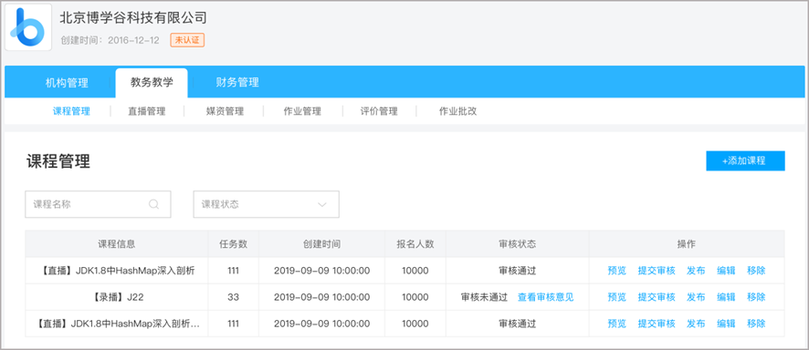

点击添加课程：


选择录播课程 ，填写课程信息：


填写课程计划信息：


填写课程师资信息：


课程填写完毕进行课程 发布：

当审核状态为通过时发布按钮点亮，点击发布按钮 即可对该课程进行发布。

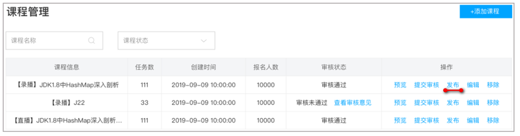

### **1.5 数据模型**

内容管理模块的基础表涉及 9 张，如下：

使用 PowerDesigner 打开课程资料下的 "数据库\\模型\\学成在线项目.sws"

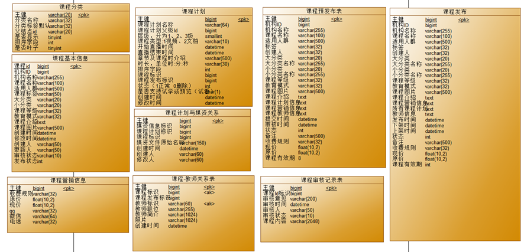

## **2. 创建模块工程**

### **2.1 模块工程结构**

在第一章节创建了项目父工程、项目基础工程，如下图：

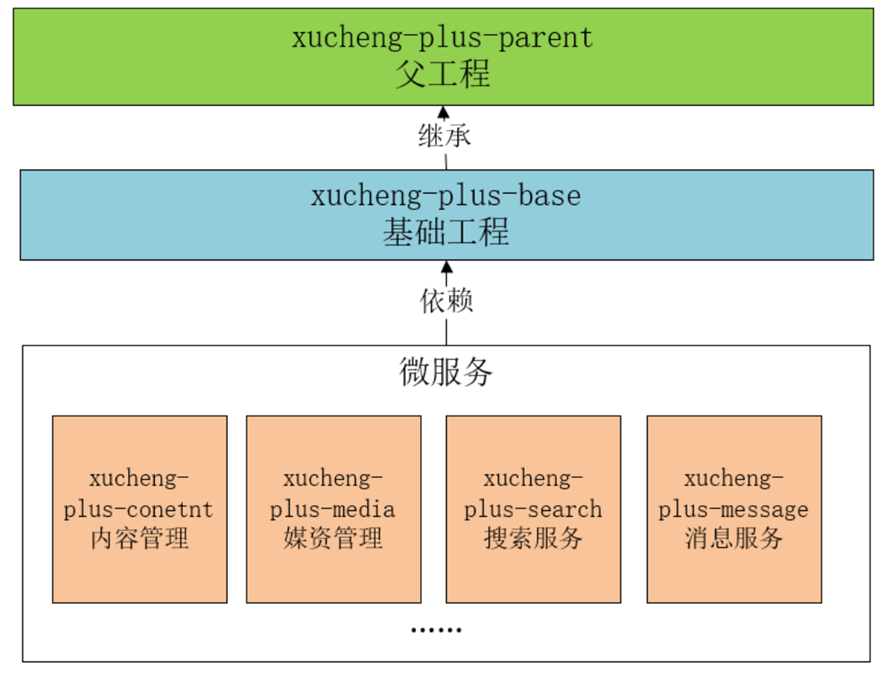

接下来要创建内容管理模块的工程结构。

本项目是一个前后端分离项目，前端与后端开发人员之间主要依据接口进行开发。

下图是前后端交互的流程图：

1、前端请求后端服务提供的接口。（通常为 http 协议 ）

2、后端服务的控制层 Controller 接收前端的请求。

3、Contorller 层调用 Service 层进行业务处理。

4、Service 层调用 Dao 持久层对数据持久化。


整个流程分为前端、接口层、业务层三部分。

所以模块工程的结构如下图所示：

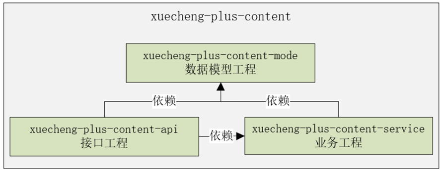

xuecheng-plus-content-api：接口工程，为前端提供接口。

xuecheng-plus-content-service: 业务工程，为接口工程提供业务支撑。

xuecheng-plus-content-model: 数据模型工程，存储数据模型类、数据传输类型等。

结合项目父工程、项目基础工程后，如下图：

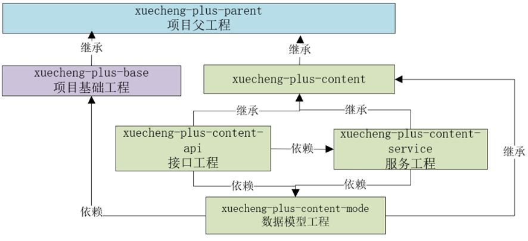

xuecheng-plus-content：内容管理模块工程，负责聚合 xuecheng-plus-content-api、xuecheng-plus-content-service、xuecheng-plus-content-model。

### **2.2 创建模块工程**

1、首先在项目根目录创建内容管理模块的父工程 xuecheng-plus-content

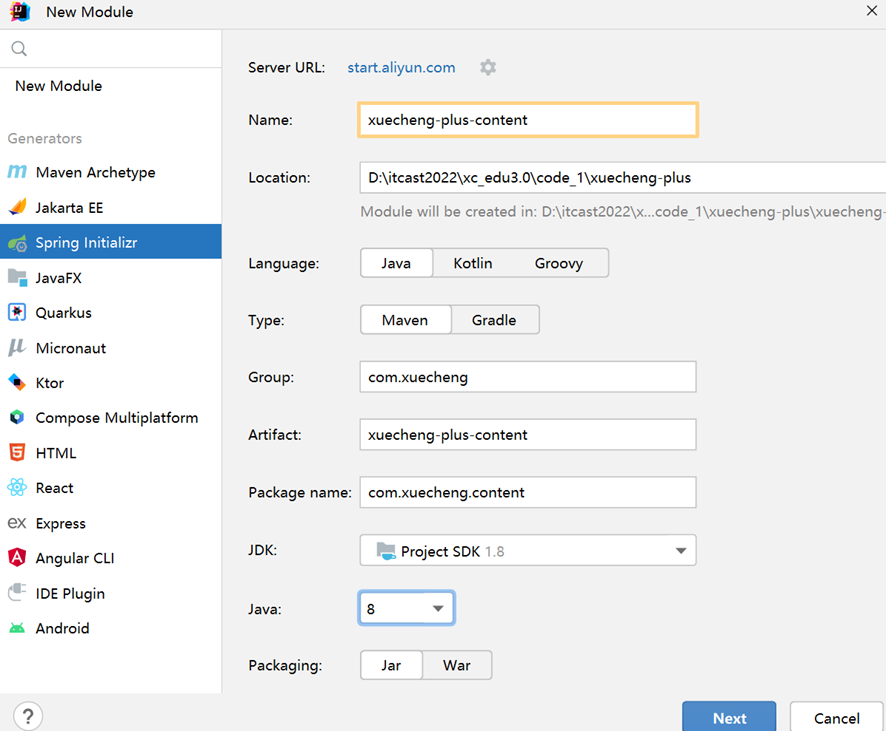

创建完成，只保留 pom.xml 文件，删除多余的文件。

内容管理父工程的主要职责是聚合内容管理接口和内容管理接口实现两个工程，它的父工程是

xuecheng-plus-parent。

pom.xml 如下

```xml
<?xml version="1.0" encoding="UTF-8"?>
<project xmlns="http://maven.apache.org/POM/4.0.0" xmlns:xsi="http://www.w3.org/2001/XMLSchema-instance"
         xsi:schemaLocation="http://maven.apache.org/POM/4.0.0 https://maven.apache.org/xsd/maven-4.0.0.xsd">
    <modelVersion>4.0.0</modelVersion>
    <parent>
        <artifactId>xuecheng-plus-parent</artifactId>
        <groupId>com.xuecheng</groupId>
        <version>0.0.1-SNAPSHOT</version>
        <relativePath>../xuecheng-plus-parent</relativePath>
    </parent>
    <artifactId>xuecheng-plus-content</artifactId>
    <name>xuecheng-plus-content</name>
    <description>xuecheng-plus-content</description>
    <packaging>pom</packaging>

  <modules>
    <module>xuecheng-plus-content-api</module>
    <module>xuecheng-plus-content-model</module>
    <module>xuecheng-plus-content-service</module>
   </modules>
</project>

```

由于 xuecheng-plus-content-api 和 xuecheng-plus-content-service 两个工程还没有创建所以 modules 报错。

2、在 xuecheng-plus-content 下创建 xuecheng-plus-content-model 数据模型工程。

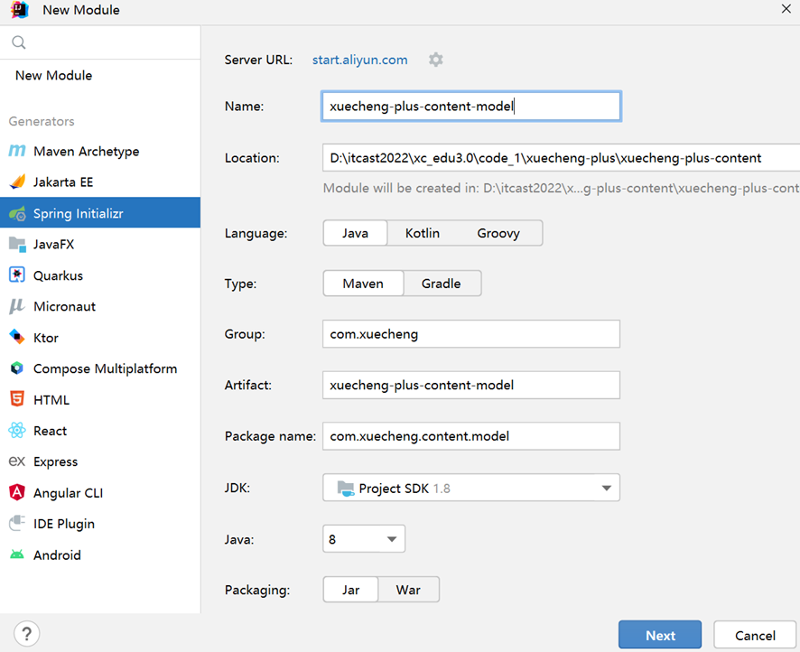

创建完成，只保留包和 pom.xml 文件 ，删除多余的文件。

修改 pom.xml 文件

```xml
<?xml version="1.0" encoding="UTF-8"?>
<project xmlns="http://maven.apache.org/POM/4.0.0" xmlns:xsi="http://www.w3.org/2001/XMLSchema-instance"
         xsi:schemaLocation="http://maven.apache.org/POM/4.0.0 https://maven.apache.org/xsd/maven-4.0.0.xsd">
    <modelVersion>4.0.0</modelVersion>
    <parent>
        <artifactId>xuecheng-plus-content</artifactId>
        <groupId>com.xuecheng</groupId>
        <version>0.0.1-SNAPSHOT</version>
    </parent>
    <artifactId>xuecheng-plus-content-model</artifactId>


    <dependencies>
        <dependency>
            <groupId>com.xuecheng</groupId>
            <artifactId>xuecheng-plus-base</artifactId>
            <version>0.0.1-SNAPSHOT</version>
        </dependency>
    </dependencies>

</project>

```

3、在 xuecheng-plus-content 下创建 xuecheng-plus-content-service 接口实现工程。

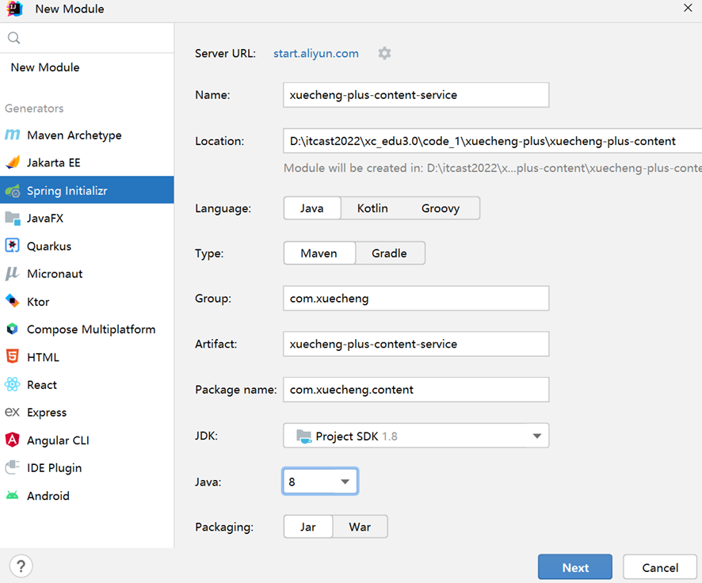

创建完成，只保留包和 pom.xml 文件 ，删除多余的文件，pom.xml 如下：

```xml
<?xml version="1.0" encoding="UTF-8"?>
<project xmlns="http://maven.apache.org/POM/4.0.0" xmlns:xsi="http://www.w3.org/2001/XMLSchema-instance"
     xsi:schemaLocation="http://maven.apache.org/POM/4.0.0 https://maven.apache.org/xsd/maven-4.0.0.xsd">
<modelVersion>4.0.0</modelVersion>
<parent>
    <artifactId>xuecheng-plus-content</artifactId>
    <groupId>com.xuecheng</groupId>
    <version>0.0.1-SNAPSHOT</version>
</parent>
<artifactId>xuecheng-plus-content-service</artifactId>

    <dependencies>
    <dependency>
        <groupId>com.xuecheng</groupId>
        <artifactId>xuecheng-plus-content-model</artifactId>
        <version>0.0.1-SNAPSHOT</version>
    </dependency>
 </dependencies>
</project>

```

4、在 xuecheng-plus-content 下创建 xuecheng-plus-content-api 接口工程。

xuecheng-plus-content-api 接口工程的父工程是 xuecheng-plus-content，它依赖了 xuecheng-plus-base 基础工程。

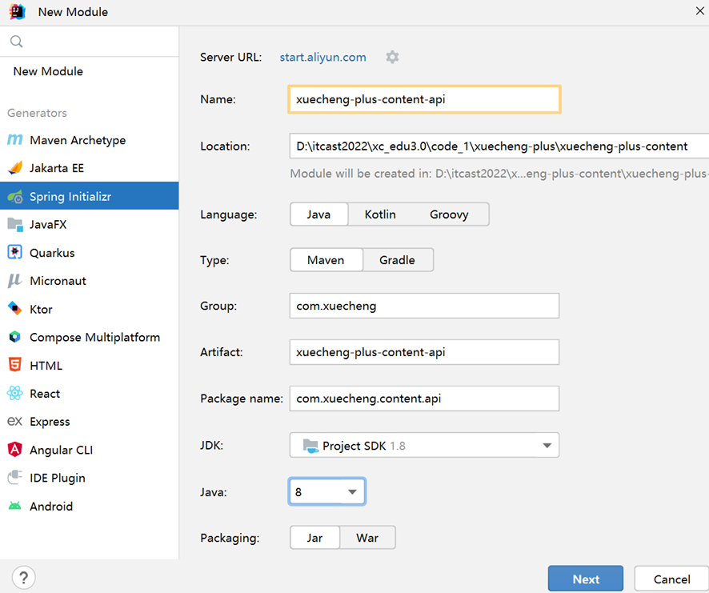

编辑 pom.xml

```xml
<?xml version="1.0" encoding="UTF-8"?>
<project xmlns="http://maven.apache.org/POM/4.0.0" xmlns:xsi="http://www.w3.org/2001/XMLSchema-instance"
         xsi:schemaLocation="http://maven.apache.org/POM/4.0.0 https://maven.apache.org/xsd/maven-4.0.0.xsd">
    <modelVersion>4.0.0</modelVersion>
    <parent>
        <artifactId>xuecheng-plus-content</artifactId>
        <groupId>com.xuecheng</groupId>
        <version>0.0.1-SNAPSHOT</version>
    </parent>
    <artifactId>xuecheng-plus-content-api</artifactId>


    <dependencies>
        <dependency>
            <groupId>com.xuecheng</groupId>
            <artifactId>xuecheng-plus-content-service</artifactId>
            <version>0.0.1-SNAPSHOT</version>
        </dependency>
    </dependencies>

</project>

```

到此内容管理模块的四个工程创建完毕，工程结构图如下：

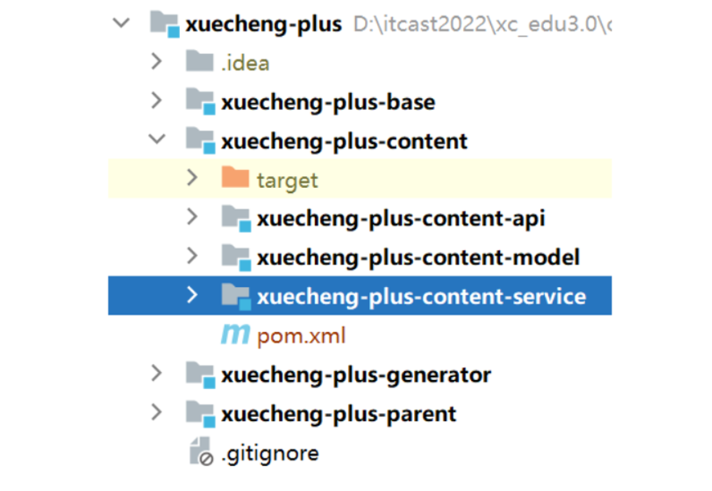

## **3.课程查询**

### **3.1 需求分析**

#### **3.1.1 业务流程**

课程查询的业务流程如下：

1、教学机构人员点击课程管理首先进入课程查询界面，如下：

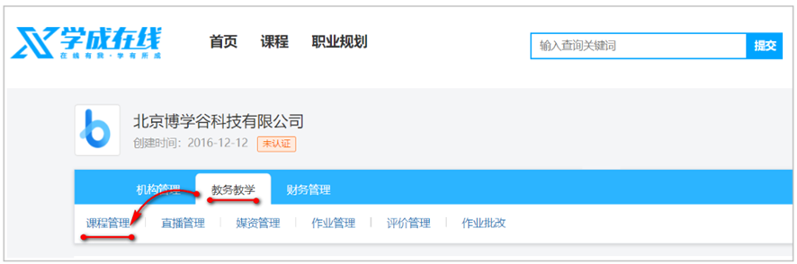

2.在课程进行列表查询页面输入查询条件查询课程信息

当不输入查询条件时输入全部课程信息。

输入查询条件查询符合条件的课程信息。

约束：本教学机构查询本机构的课程信息。

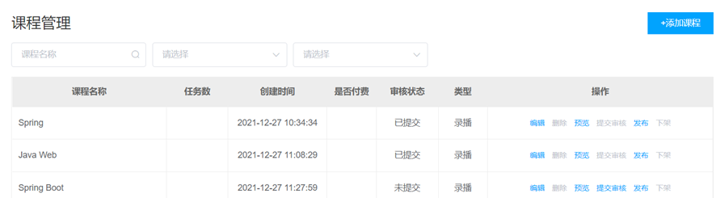

#### **3.1.2 数据模型**

下边从查询条件、查询列表两个方面分析数据模型

1、查询条件：

包括：课程名称、课程审核状态、课程发布状态

课程名称：可以模糊搜索

课程审核状态：未提交、已提交、审核通过、审核未通过

课程发布状态：未发布、已发布、已下线

因为是分页查询所以查询条件中还要包括当前页码、每页显示记录数。

2、查询结果：

查询结果中包括：课程 id、课程名称、任务数、创建时间、是否付费、审核状态、类型，操作

任务数：该课程所包含的课程计划数，即课程章节数。

是否付费：课程包括免费、收费两种。

类型：录播、直播。

因为是分页查询所以查询结果中还要包括总记录数、当前页、每页显示记录数。

### **3.2 创建数据库表及 PO 类型**

#### **3.2.1 创建数据库表**

1、创建内容管理数据库

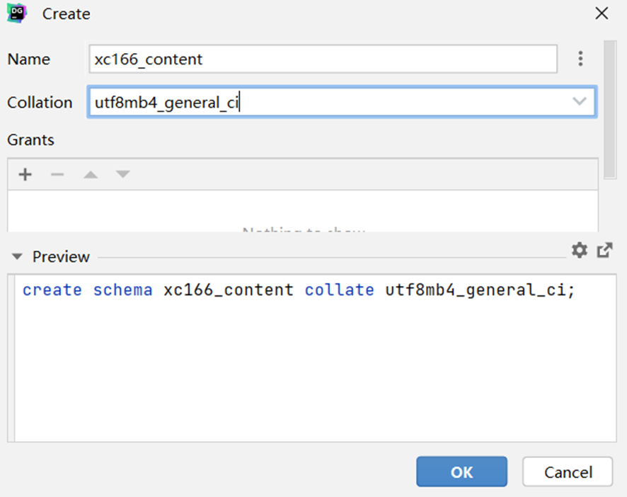

2、向创建的内容管理数据库导入数据

选择课程资料中的 xc_content.sql 脚本，这里使用 DataGrid 客户端工具连接 mysql 并执行脚本。

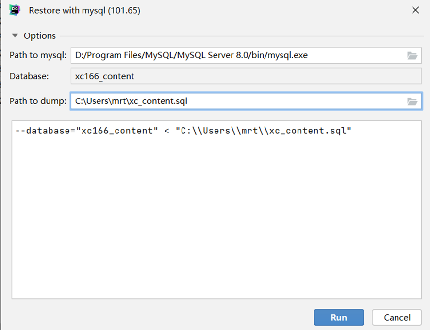

执行成功，查询 course_base 数据表，如下：

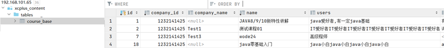

#### **3.2.2 生成 PO 类**

PO 即持久对象(Persistent Object)，它们是由一组属性和属性的 get 和 set 方法组成，PO 对应于数据库的表。

在开发持久层代码时需要根据数据表编写 PO 类，在实际开发中通常使用代码生成器（工具）生成 PO 类的代码。

由于在需求分析阶段对数据模型进行分析，PO 类对应于数据模型，所以在需求分析阶段即可使用工具生成 PO 类，为下面的接口定义准备好模型类。

在企业开发中通常使用代码生成工具去自动生成这些文件，

本项目使用 mybatis-plus 的 generator 工程生成 PO 类、Mapper 接口、Mapper 的 xml 文件，地址在：<https://github.com/baomidou/generator>

将课程资料目录下的 xuecheng-plus-generator.zip 解压后拷贝至项目工程根目录，如下图：

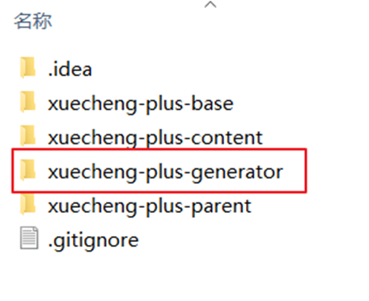

打开 IDEA 将其导入项目工程 ，打开 xuecheng-plus-generator 工程的 pom.xml，右键 点击“Add as Maven Project” 自动识别 maven 工程。

如下图：

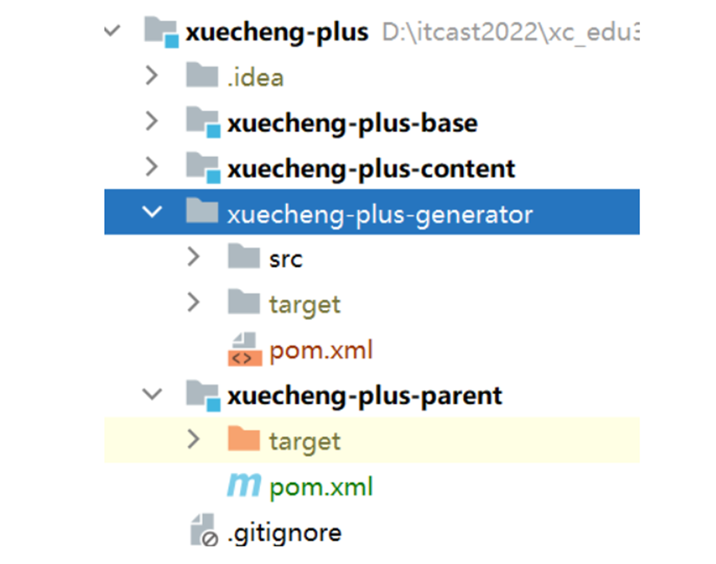

本次生成内容管理模块的 PO 类、Mapper 接口和 Mapper 的 xml 文件 ，找到 ContentCodeGenerator 类，如下图：

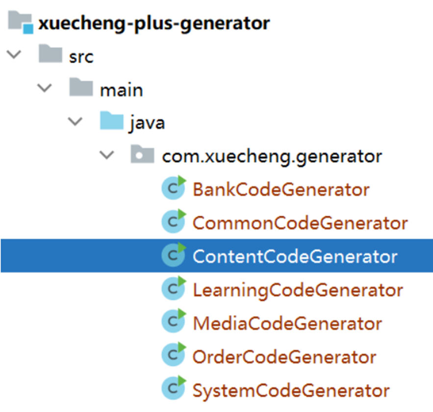

修改 ContentCodeGenerator 类中的信息，包括：数据库地址、数据库账号、数据库密码、生成的表、生成路径，如下：

```java
    //数据库账号
    private static final String DATA_SOURCE_USER_NAME  = "root";
    //数据库密码
    private static final String DATA_SOURCE_PASSWORD  = "mysql";
    //生成的表
    private static final String[] TABLE_NAMES = new String[]{
            "course_base",
            "course_market",
            "course_teacher",
            "course_category",
            "teachplan",
            "teachplan_media",
            "course_publish",
            "course_publish_pre"
    };
    // TODO 默认生成entity，需要生成DTO修改此变量
    // 一般情况下要先生成 DTO类 然后修改此参数再生成 PO 类。
    private static final Boolean IS_DTO = false;

    public static void main(String[] args) {
            ....
            //生成路径
            gc.setOutputDir(System.getProperty("user.dir") + "/xuecheng-plus-generator/src/main/java");

    ....
    // 数据库配置
            DataSourceConfig dsc = new DataSourceConfig();
            dsc.setDbType(DbType.MYSQL);
            dsc.setUrl("jdbc:mysql://192.168.101.65:3306/xcplus_" + SERVICE_NAME+"166"
                            + "?serverTimezone=UTC&useUnicode=true&useSSL=false&characterEncoding=utf8");
            ...

```

修改完成，执行该类的 main 方法，自动生成 content 包，如下：

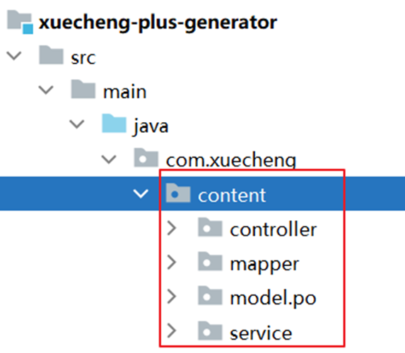

在该包下自动生成了内容管理模块的 controller、mapper、po 及 service 相关代码，这里我们只需要 po 类。

将 po 类拷贝到 model 工程

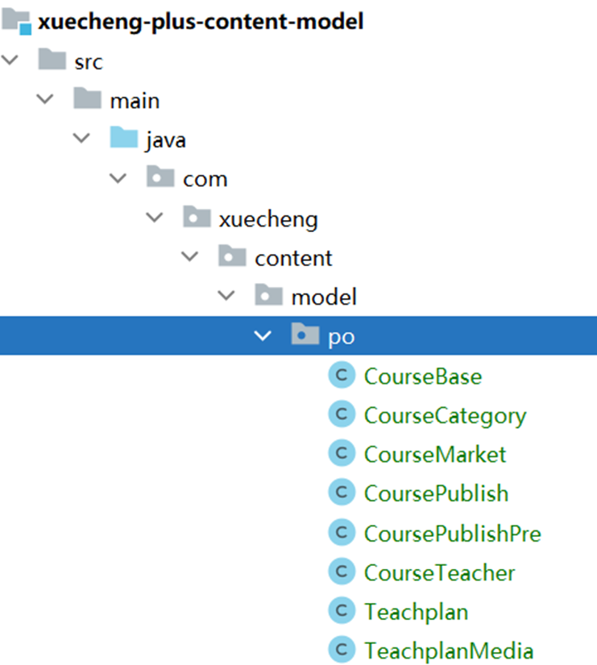

打开一个 PO 类发现编译报错，这是缺少依赖包导致，本项目使用的持久层框架是 MyBatisPlus，在生成的 po 类中加了一些 MyBatisPlus 框架的注解，这里需要添加 MyBatisPlus 框架的依赖，消除错误。

下边在 model 工程添加依赖

```xml
<dependencies>
        <dependency>
            <groupId>com.xuecheng</groupId>
            <artifactId>xuecheng-plus-base</artifactId>
            <version>0.0.1-SNAPSHOT</version>
        </dependency>
        <!--存在mybatisplus注解添加相关注解保证不报错-->
        <dependency>
            <groupId>com.baomidou</groupId>
            <artifactId>mybatis-plus-annotation</artifactId>
            <version>${mybatis-plus-boot-starter.version}</version>
        </dependency>
        <dependency>
            <groupId>com.baomidou</groupId>
            <artifactId>mybatis-plus-core</artifactId>
            <version>${mybatis-plus-boot-starter.version}</version>
        </dependency>
        <dependency>
            <groupId>org.projectlombok</groupId>
            <artifactId>lombok</artifactId>
        </dependency>
</dependencies>

```

### **3.3 设计接口**

#### **3.3.1 接口设计分析**

设计一个接口需要包括以下几个方面：

1）协议

通常协议采用 HTTP，查询类接口通常为 get 或 post，查询条件较少的使用 get，较多的使用 post。

本接口使用 http post。

还要确定 content-type，参数以什么数据格式提交，结果以什么数据格式响应。

一般情况没有特殊情况结果以 json 格式响应。

2）分析请求参数

根据前边对数据模型的分析，请求参数为：课程名称、课程审核状态、当前页码、每页显示记录数。

根据分析的请求参数定义模型类。

3）分析响应结果

根据前边对数据模型的分析，响应结果为数据列表加一些分页信息（总记录数、当前页、每页显示记录数）。

数据列表中数据的属性包括：课程 id、课程名称、任务数、创建时间、审核状态、类型。

注意：查询结果中的审核状态为数据字典中的代码字段，前端会根据审核状态代码 找到对应的名称显示。

根据分析的响应结果定义模型类。

4）分析完成，使用 SpringBoot 注解开发一个 Http 接口。

5）使用接口文档工具查看接口的内容。

6）接口中调用 Service 方法完成业务处理。

4）接口请求示例

```json
POST /content/course/list?pageNo=2&pageSize=1
Content-Type: application/json

{
  "auditStatus": "202002",
  "courseName": "",
  "publishStatus":""
}
####成功响应结果
{
  "items": [
    {
      "id": 26,
      "companyId": 1232141425,
      "companyName": null,
      "name": "spring cloud实战",
      "users": "所有人",
      "tags": null,
      "mt": "1-3",
      "mtName": null,
      "st": "1-3-2",
      "stName": null,
      "grade": "200003",
      "teachmode": "201001",
      "description": "本课程主要从四个章节进行讲解： 1.微服务架构入门 2.spring cloud 基础入门 3.实战Spring Boot 4.注册中心eureka。",
      "pic": "https://cdn.educba.com/academy/wp-content/uploads/2018/08/Spring-BOOT-Interview-questions.jpg",
      "createDate": "2019-09-04 09:56:19",
      "changeDate": "2021-12-26 22:10:38",
      "createPeople": null,
      "changePeople": null,
      "auditStatus": "202002",
      "auditMind": null,
      "auditNums": 0,
      "auditDate": null,
      "auditPeople": null,
      "status": 1,
      "coursePubId": null,
      "coursePubDate": null
    }
  ],
  "counts": 23,
  "page": 2,
  "pageSize": 1
}

```

#### **3.3.2 定义模型类**

根据接口分析需要定义模型类接收请求的参数，并定义模型类用于响应结果。

1、分页查询模型类

由于分页查询这一类的接口在项目较多，这里针对分页查询的参数（当前页码、每页显示记录数）单独在 xuecheng-plus-base 基础工程中定义。

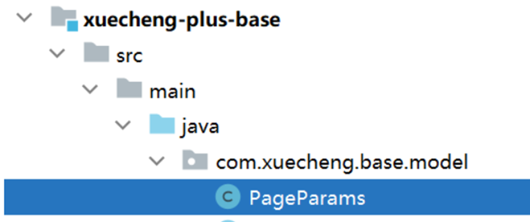

内容如下：

```java
package com.xuecheng.base.model;

import lombok.Data;
import lombok.ToString;
import lombok.extern.java.Log;

/**
 * @description 分页查询通用参数
 * @author Mr.M
 * @date 2022/9/6 14:02
 * @version 1.0
 */
@Data
@ToString
public class PageParams {

  //当前页码
  private Long pageNo = 1L;

  //每页记录数默认值
  private Long pageSize =10L;

  public PageParams(){

  }

  public PageParams(long pageNo,long pageSize){
      this.pageNo = pageNo;
      this.pageSize = pageSize;
  }
}
```

由于上边类中用到了 lombok 注解所以在 base 工程添加依赖包如下：

```xml
    <dependencies>
        <dependency>
            <groupId>org.projectlombok</groupId>
            <artifactId>lombok</artifactId>
        </dependency>
    </dependencies>
```

2、查询条件模型类

除了分页查询参数，剩下的就是课程查询的特有参数，此时需要在内容管理的 model 工程中定义课程查询参数模型类。

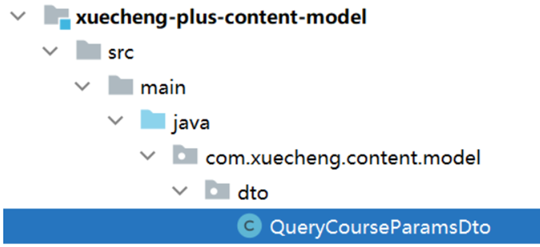

内容如下：

```Java
package com.xuecheng.content.model.dto;

import lombok.Data;
import lombok.ToString;

/**
 * @description 课程查询参数Dto
 * @author Mr.M
 * @date 2022/9/6 14:36
 * @version 1.0
 */
 @Data
 @ToString
public class QueryCourseParamsDto {

  //审核状态
 private String auditStatus;
 //课程名称
 private String courseName;
  //发布状态
 private String publishStatus;

}

```

3、响应模型类

根据接口分析，下边定义响应结果模型类。

针对分页查询结果经过分析也存在固定的数据和格式，所以在 base 工程定义一个基础的模型类。

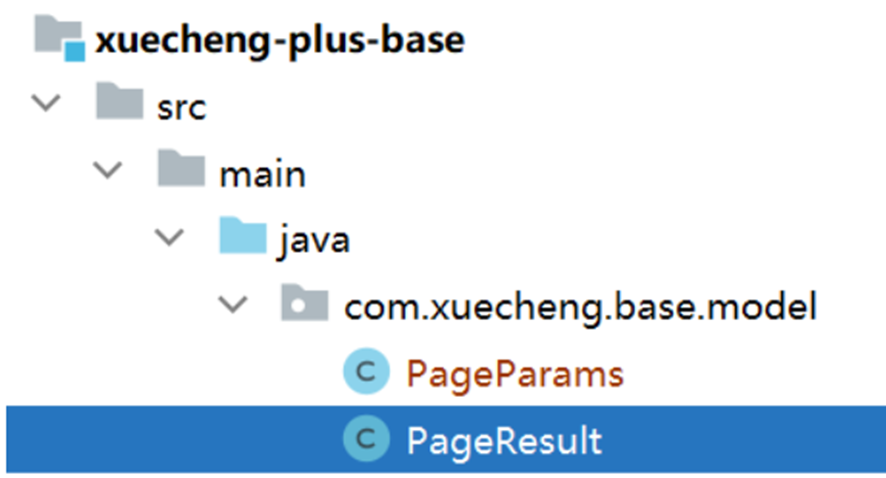

内容如下：

```java

package com.xuecheng.base.model;

import lombok.Data;
import lombok.ToString;

import java.io.Serializable;
import java.util.List;

/**
 * @description 分页查询结果模型类
 * @author Mr.M
 * @date 2022/9/6 14:15
 * @version 1.0
 */
@Data
@ToString
public class PageResult<T> implements Serializable {

    // 数据列表
    private List<T> items;

    //总记录数
    private long counts;

    //当前页码
    private long page;

    //每页记录数
    private long pageSize;

    public PageResult(List<T> items, long counts, long page, long pageSize) {
        this.items = items;
        this.counts = counts;
        this.page = page;
        this.pageSize = pageSize;
    }

}

```

我们发现此模型类中定义了 List 属性，此属性存放数据列表，且支持泛型，课程查询接口的返回类型可以是此模型类型。

List 中的数据类型用什么呢？根据需求分析使用生成的 PO 类即可，所以课程查询接口返回结果类型如下：

```java
泛型中填写CourseBase类型。
PageResult<CourseBase>
```

#### **3.3.3 定义接口**

根据分析，此接口提供 HTTP post 协议，查询条件以 json 格式提交，响应结果为 json 格式。

可使用 SpringBoot 注解在 Controller 类中实现。

1、首先在 api 工程添加依赖

```xml
<dependencies>
    <dependency>
        <groupId>com.xuecheng</groupId>
        <artifactId>xuecheng-plus-content-service</artifactId>
        <version>0.0.1-SNAPSHOT</version>
    </dependency>
    <!--cloud的基础环境包-->
    <dependency>
        <groupId>org.springframework.cloud</groupId>
        <artifactId>spring-cloud-context</artifactId>
    </dependency>
    <!-- Spring Boot 的 Spring Web MVC 集成 -->
    <dependency>
        <groupId>org.springframework.boot</groupId>
        <artifactId>spring-boot-starter-web</artifactId>
    </dependency>


    <!-- 排除 Spring Boot 依赖的日志包冲突 -->
    <dependency>
        <groupId>org.springframework.boot</groupId>
        <artifactId>spring-boot-starter</artifactId>
        <exclusions>
            <exclusion>
                <groupId>org.springframework.boot</groupId>
                <artifactId>spring-boot-starter-logging</artifactId>
            </exclusion>
        </exclusions>
    </dependency>
        <dependency>
            <groupId>org.springframework.boot</groupId>
            <artifactId>spring-boot-starter-validation</artifactId>
        </dependency>
    <!-- Spring Boot 集成 log4j2 -->
    <dependency>
        <groupId>org.springframework.boot</groupId>
        <artifactId>spring-boot-starter-log4j2</artifactId>
    </dependency>

    <!-- Spring Boot 集成 swagger -->
    <dependency>
        <groupId>com.spring4all</groupId>
        <artifactId>swagger-spring-boot-starter</artifactId>
        <version>1.9.0.RELEASE</version>
    </dependency>


</dependencies>

```

2、定义 controller 方法

```java
package com.xuecheng.content.api;

import com.xuecheng.base.model.PageParams;
import com.xuecheng.base.model.PageResult;
import com.xuecheng.content.model.dto.QueryCourseParamsDto;
import io.swagger.annotations.Api;
import io.swagger.annotations.ApiOperation;
import org.springframework.web.bind.annotation.PostMapping;
import org.springframework.web.bind.annotation.RequestBody;
import org.springframework.web.bind.annotation.RestController;

/**
 * @description 课程信息编辑接口
 * @author Mr.M
 * @date 2022/9/6 11:29
 * @version 1.0
 */
 @RestController
public class CourseBaseInfoController {

 @RequestMapping("/course/list")
  public PageResult<CourseBase> list(PageParams pageParams, @RequestBody QueryCourseParamsDto queryCourseParams){

      return null;

  }

}

```

说明：pageParams 分页参数通过 url 的 key/value 传入，queryCourseParams 通过 json 数据传入，使用@RequestBody 注解将 json 转成 QueryCourseParamsDto 对象。

3、定义启动类

```java
package com.xuecheng;


import com.spring4all.swagger.EnableSwagger2Doc;
import org.springframework.boot.SpringApplication;
import org.springframework.boot.autoconfigure.SpringBootApplication;
import org.springframework.scheduling.annotation.EnableScheduling;

@SpringBootApplication
public class ContentApplication {
   public static void main(String[] args) {
      SpringApplication.run(ContentApplication.class, args);
   }
}

```

3、添加配置文件

创建 log4j2-dev.xml、bootstrap.yml 文件。

log4j2-dev.xml:从课程资料/项目工程 获取.

bootstrap.yml 内容如下：

```yaml
server:
  servlet:
    context-path: /content
  port: 63040
##微服务配置
spring:
  application:
    name: content-api
  datasource:
    driver-class-name: com.mysql.cj.jdbc.Driver
    url: jdbc:mysql://192.168.101.65:3306/xcplus_content148?serverTimezone=UTC&userUnicode=true&useSSL=false&
    username: root
    password: mysql
## 日志文件配置路径
logging:
  config: classpath:log4j2-dev.xml
```

4、下边启动服务，测试接口是否可以正常请求

在 controller 方法中打断点，debug 启动微服务，在浏览器访问 http://localhost:63040/content/course/list

浏览器报 400 错误，400 错误通常由于你访问的页面域名不存在或者请求错误。一般是因为我们输入的语法格式有错误，服务器无法理解用户的请求，不知道要表达的是什么。这个时候我们需要认真检查下语义、请求参数是否有误，不然再怎么刷新都没有用。

接口接收两部分参数，一部分是分页参数，它是通过 http url 传递 key/value 串，另一部分是业务查询条件，通过 http body 传入 json 内容。

服务端使用 RequestBody 接收 json 内容，我们在测试并没有传递 json 内容这里导致错误。

下边在@RequestBody 后添加(required=false)表示此参数不是必填项，如下：

```java
 @PostMapping("/course/list")
  public PageResult<CourseBase> list(PageParams pageParams, @RequestBody(required=false) QueryCourseParamsDto queryCourseParams){

      return null;

  }

```

再次测试，运行到 断点处暂停。

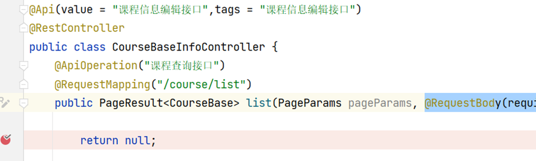

#### **3.3.4 模型类的作用**

现在项目中有两类模型类：DTO 数据传输对象、PO 持久化对象，DTO 用于接口层向业务层之间传输数据，PO 用于业务层与持久层之间传输数据，有些项目还会设置 VO 对象，VO 对象用在前端与接口层之间传输数据，如下图：


当前端有多个平台且接口存在差异时就需要设置 VO 对象用于前端和接口层传输数据。

比如：

课程列表查询接口，根据需求用户在手机端也要查询课程信息，此时课程查询接口是否需要编写手机端和 PC 端两个接口呢？如果用户要求通过手机和 PC 的查询条件或查询结果不一样，此时就需要定义两个 Controller 课程查询接口，每个接口定义 VO 对象与前端传输数据。

手机查询：根据课程状态查询，查询结果只有课程名称和课程状态。

PC 查询：可以根据课程名称、课程状态、课程审核状态等条件查询，查询结果也比手机查询结果内容多。

此时，Service 业务层尽量提供一个业务接口，即使两个前端接口需要的数据不一样，Service 可以提供一个最全查询结果，由 Controller 进行数据整合。

如下图：

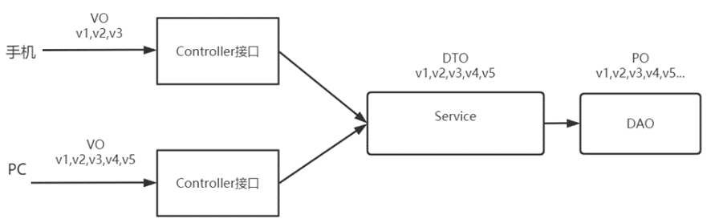

如果前端的接口没有多样性且比较固定，此时可以取消 VO，只用 DTO 即可。

如下图：

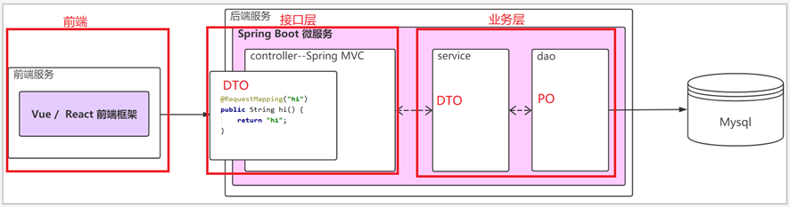

### **3.4 生成接口文档**

在前后端分离开发中通常由后端程序员设计接口，完成后需要编写接口文档，最后将文档交给前端工程师，前端工程师参考文档进行开发。

可以通过一些工具快速生成接口文档 ，本项目通过 Swagger 生成接口在线文档 。

什么是 Swagger？

OpenAPI 规范（OpenAPI Specification 简称 OAS）是 Linux 基金会的一个项目，试图通过定义一种用来描述 API 格式或 API 定义的语言，来规范 RESTful 服务开发过程，目前版本是 V3.0，并且已经发布并开源在 github 上。

（<https://github.com/OAI/OpenAPI-Specification>）

Swagger 是全球最大的 OpenAPI 规范（OAS）API 开发工具框架，Swagger 是一个在线接口文档的生成工具，前后端开发人员依据接口文档进行开发。 (<https://swagger.io/>)

Spring Boot 可以集成 Swagger，Swaager 根据 Controller 类中的注解生成接口文档 ，只要添加 Swagger 的依赖和配置信息即可使用它。

1、在 API 工程添加 swagger-spring-boot-starter 依赖

```xml
<!-- Spring Boot 集成 swagger -->
<dependency>
    <groupId>com.spring4all</groupId>
    <artifactId>swagger-spring-boot-starter</artifactId>
</dependency>
```

2、在 bootstrap.yml 中配置 swagger 的扫描包路径及其它信息，base-package 为扫描的包路径，扫描 Controller 类。

```yaml
swagger:
  title: '学成在线内容管理系统'
  description: '内容系统管理系统对课程相关信息进行管理'
  base-package: com.xuecheng.content
  enabled: true
  version: 1.0.0
```

3、在启动类中添加@EnableSwagger2Doc 注解

再次启动服务，工程启动起来，访问<http://localhost:63040/content/swagger-ui.html>查看接口信息

下图为 swagger 接口文档的界面：

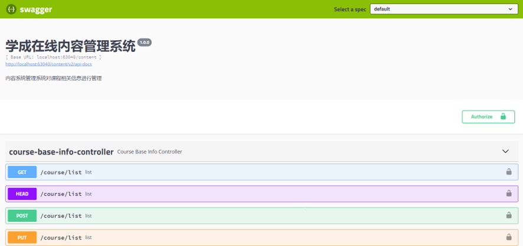

这个文档存在两个问题：

1、接口名称显示 course-base-info-controller 名称不直观

2、课程查询是 post 方式只显示 post /course/list 即可。

下边进行修改，添加一些接口说明的注解，并且将 RequestMapping 改为 PostMapping，如下：

```java
@Api(value = "课程信息编辑接口",tags = "课程信息编辑接口")
@RestController
public class CourseBaseInfoController {

@ApiOperation("课程查询接口")
@PostMapping("/course/list")
public PageResult<CourseBase> list(PageParams pageParams, @RequestBody(required=false) QueryCourseParamsDto queryCourseParams){

 //....

}

}

```

5、再次启动服务，工程启动起来，访问<http://localhost:63040/content/swagger-ui.html>查看接口信息

下图为 swagger 接口文档的界面：

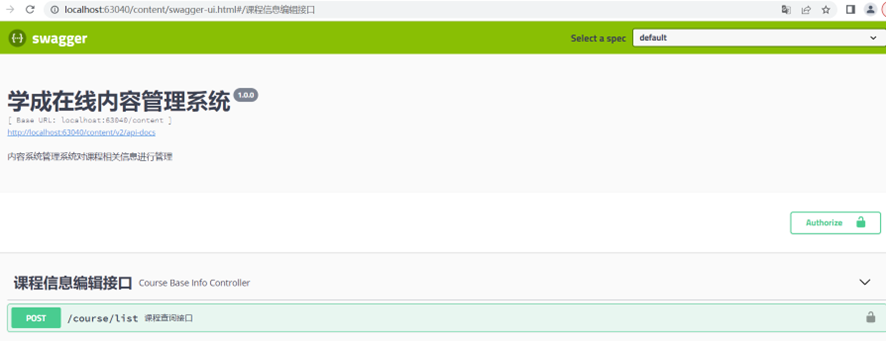

接口文档中会有关于接口参数的说明，在模型类上也可以添加注解对模型类中的属性进行说明，方便对接口文档的阅读。

比如：下边标红的属性名称，可以通过 swaager 注解标注一个中文名称，方便阅读接口文档。

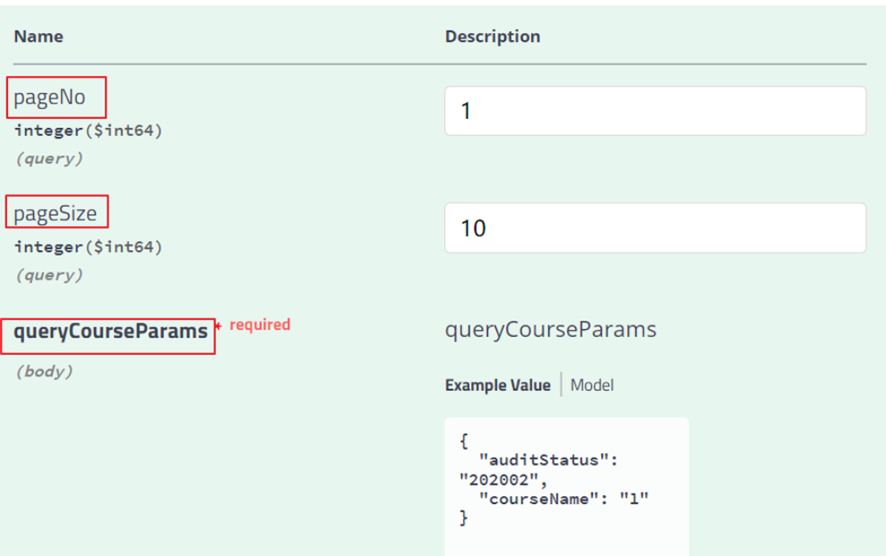

标注的方法非常简单：

找到模型类，在属性上添加注解：

```java
 public class PageParams {
 ...
 @ApiModelProperty("当前页码")
private Long pageNo = 1L;

@ApiModelProperty("每页记录数默认值")
private Long pageSize = 30L;
...
public class QueryCourseParamsDto {

  //审核状态
@ApiModelProperty("审核状态")
 private String auditStatus;
 //课程名称
 @ApiModelProperty("课程名称")
 private String courseName;

}

```

重启服务，再次进入接口文档，如下图：

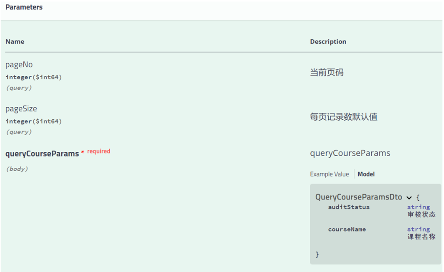

Swaager 的常用注解如下：

在 Java 类中添加 Swagger 的注解即可生成 Swagger 接口，常用 Swagger 注解如下：

```java
@Api：修饰整个类，描述Controller的作用
@ApiOperation：描述一个类的一个方法，或者说一个接口
@ApiParam：单个参数描述
@ApiModel：用对象来接收参数
@ApiModelProperty：用对象接收参数时，描述对象的一个字段
@ApiResponse：HTTP响应其中1个描述
@ApiResponses：HTTP响应整体描述
@ApiIgnore：使用该注解忽略这个API
@ApiError ：发生错误返回的信息
@ApiImplicitParam：一个请求参数
@ApiImplicitParams：多个请求参数

```

@ApiImplicitParam 属性如下：

| 属性         | 取值   | 作用                                          |
| ------------ | ------ | --------------------------------------------- |
| paramType    |        | 查询参数类型                                  |
|              | path   | 以地址的形式提交数据                          |
|              | query  | 直接跟参数完成自动映射赋值                    |
|              | body   | 以流的形式提交 仅支持 POST                    |
|              | header | 参数在 request headers 里边提交               |
|              | form   | 以 form 表单的形式提交 仅支持 POST            |
| dataType     |        | 参数的数据类型 只作为标志说明，并没有实际验证 |
|              | Long   |                                               |
|              | String |                                               |
| name         |        | 接收参数名                                    |
| value        |        | 接收参数的意义描述                            |
| required     |        | 参数是否必填                                  |
|              | true   | 必填                                          |
|              | false  | 非必填                                        |
| defaultValue |        | 默认值                                        |

使用 Swagger 可以进行接口的测试。

修改接口内容，添加一些测试代码

```java
@ApiOperation("课程查询接口")
@PostMapping("/course/list")
public PageResult<CourseBase> list(PageParams pageParams, @RequestBody(required=false) QueryCourseParamsDto queryCourseParams){

    CourseBase courseBase = new CourseBase();
    courseBase.setName("测试名称");
    courseBase.setCreateDate(LocalDateTime.now());
    List<CourseBase> courseBases = new ArrayList();
    courseBases.add(courseBase);
    PageResult pageResult = new PageResult<CourseBase>(courseBases,10,1,10);
    return pageResult;

}

```

debug 方式启动，在 return 处打断点，再用 swagger 请求接口。

通过下图可以看到请求参数已经正常请求至 controller 方法

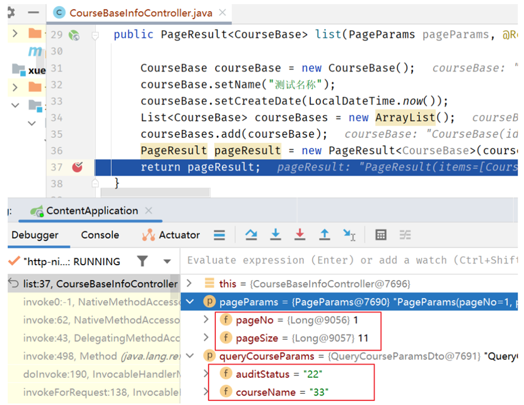

放行继续运行，观察 swagger 界面，结果可以正常返回

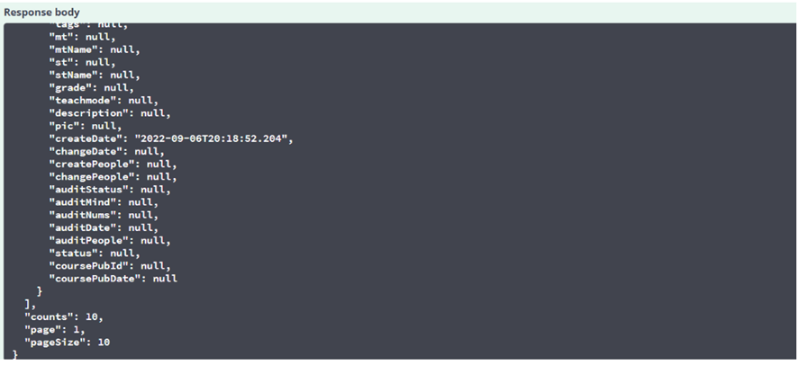

不过存在一个问题就是 LocalDateTime 类型的数据转 json 后数据格式并不是我们要的年月日时分秒

在 base 工程 com.xuecheng.base.config 包下加配置 LocalDateTimeConfig 类实现转 json 时字符串与 LocalDateTime 类型的转换，LocalDateTimeConfig 类可从课程资料下的项目工程目录中直接拷贝。

### **3.5 开发持久层**

#### **3.5.1 生成 mapper**

本项目使用 MyBatis-Plus 开发持久层，需要创建 PO 类、Mapper 接口、Mapper 的 xml 文件，每个 PO 类对应数据库的每张表，每张表需要创建一个 Mapper 接口和 Mapper 的 xml 映射文件 。

下边将使用 generator 工程成的 mapper 接口和 mapper 映射文件 拷贝到 service 工程 ，如下图：

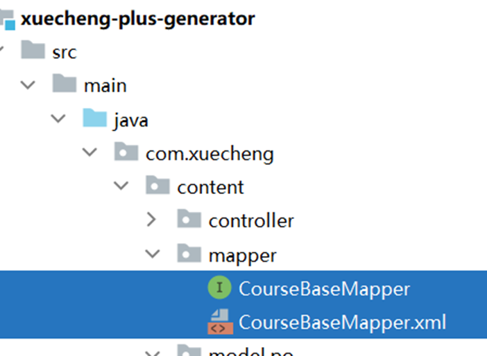

service 工程即业务层为 api 接口工程提供业务处理支撑，本项目业务层包括了持久层的代码，一些大型公司的团队职责划分更细，会将持久层和业务层分为两个工程，不过这需要增加成本。

本项目使用持久层框架 MyBatis-Plus 进行开发，下边将 mapper 接口和 xml 文件 拷贝到 service 工程 ，拷贝后如下图所示：

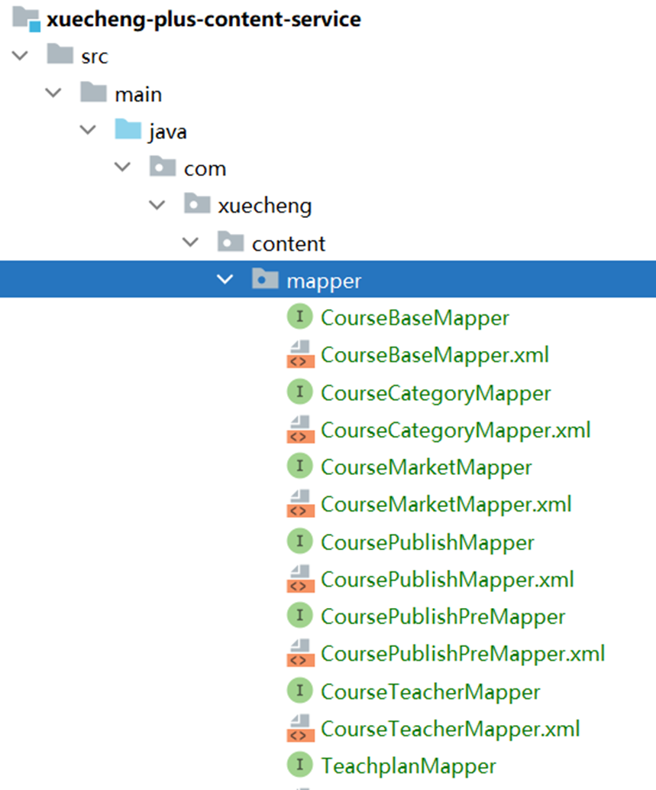

到此 mapper 接口与 mapper 映射文件生成完毕。

#### **3.5.2 测试 mapper**

下边对 mapper 进行单元测试，测试 course_base 表的查询接口。

1、下边在 service 工程的 pom.xml 中添加依赖

```xml
<dependencies>
    <dependency>
        <groupId>com.xuecheng</groupId>
        <artifactId>xuecheng-plus-content-model</artifactId>
        <version>0.0.1-SNAPSHOT</version>
    </dependency>

    <!-- MySQL 驱动 -->
    <dependency>
        <groupId>mysql</groupId>
        <artifactId>mysql-connector-java</artifactId>
        <scope>runtime</scope>
    </dependency>

    <!-- mybatis plus的依赖 -->
    <dependency>
        <groupId>com.baomidou</groupId>
        <artifactId>mybatis-plus-boot-starter</artifactId>
    </dependency>
   <dependency>
    <groupId>org.springframework.cloud</groupId>
    <artifactId>spring-cloud-context</artifactId>
  </dependency>
    <!-- Spring Boot 集成 Junit -->
    <dependency>
        <groupId>org.springframework.boot</groupId>
        <artifactId>spring-boot-starter-test</artifactId>
        <scope>test</scope>
    </dependency>
    <!-- 排除 Spring Boot 依赖的日志包冲突 -->
    <dependency>
        <groupId>org.springframework.boot</groupId>
        <artifactId>spring-boot-starter</artifactId>
        <exclusions>
            <exclusion>
                <groupId>org.springframework.boot</groupId>
                <artifactId>spring-boot-starter-logging</artifactId>
            </exclusion>
        </exclusions>
    </dependency>

    <!-- Spring Boot 集成 log4j2 -->
    <dependency>
        <groupId>org.springframework.boot</groupId>
        <artifactId>spring-boot-starter-log4j2</artifactId>
    </dependency>

</dependencies>

```

2、配置扫描 mapper 及分页插件

从课程资料/工程目录下拷贝 MybatisPlusConfig 到 service 工程的 com.xuecheng.content.config 包下：

```java
package com.xuecheng.content.config;

import com.baomidou.mybatisplus.annotation.DbType;
import com.baomidou.mybatisplus.autoconfigure.ConfigurationCustomizer;
import com.baomidou.mybatisplus.extension.plugins.MybatisPlusInterceptor;
import com.baomidou.mybatisplus.extension.plugins.inner.PaginationInnerInterceptor;
import org.mybatis.spring.annotation.MapperScan;
import org.springframework.context.annotation.Bean;
import org.springframework.context.annotation.Configuration;

/**
 * <P>
 *        Mybatis-Plus 配置
 * </p>
 */
@Configuration
@MapperScan("com.xuecheng.content.mapper")
public class MybatisPlusConfig {
   /**
    * 定义分页拦截器
    */
   @Bean
   public MybatisPlusInterceptor mybatisPlusInterceptor() {
      MybatisPlusInterceptor interceptor = new MybatisPlusInterceptor();
      interceptor.addInnerInterceptor(new PaginationInnerInterceptor(DbType.MYSQL));
      return interceptor;
   }
}
```

分页插件的原理：

首先分页参数放到 ThreadLocal 中，拦截执行的 sql，根据数据库类型添加对应的分页语句重写 sql，例如：(select \* from table where a) 转换为 (select count(\*) from table where a)和(select \* from table where a limit ,)

计算出了 total 总条数、pageNum 当前第几页、pageSize 每页大小和当前页的数据，是否为首页，是否为尾页，总页数等。

4、单元测试所需要的配置文件

在 test/resources 下创建 log4j2-dev.xml、bootstrap.yml：

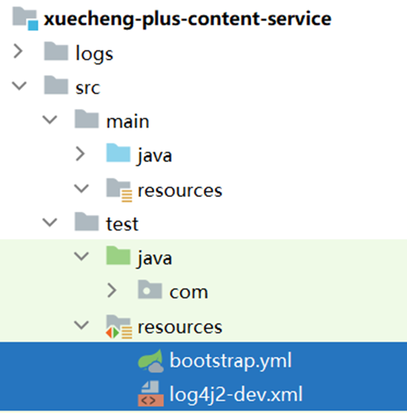

log4j2-dev.xml:从课程资料/项目工程 获取.

bootstrap.yml:

```yaml
spring:
  datasource:
    driver-class-name: com.mysql.cj.jdbc.Driver
    url: jdbc:mysql://localhost:3306/xcplus_content?serverTimezone=UTC&userUnicode=true&useSSL=false&
    username: root
    password: mysql
## 日志文件配置路径
logging:
  config: classpath:log4j2-dev.xml
```

5、编写启动类：

单元测试工作在 test 目录，在 test 下添加启动类

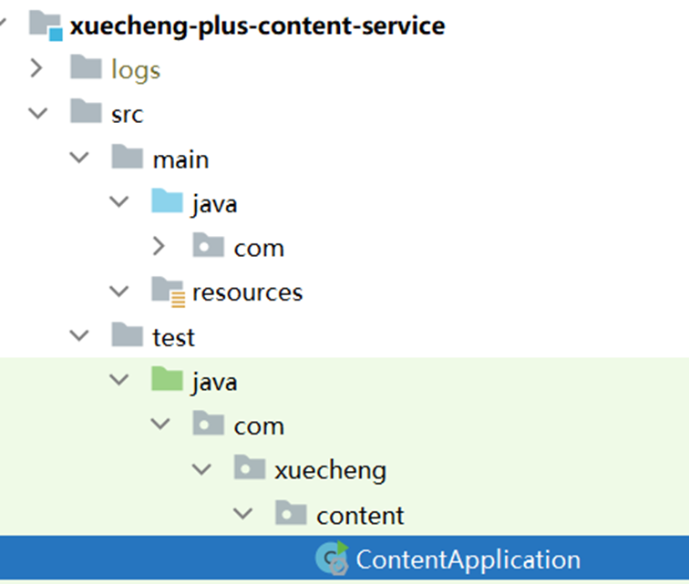

代码如下：

```java
package com.xuecheng;

import org.springframework.boot.SpringApplication;
import org.springframework.boot.autoconfigure.SpringBootApplication;

@SpringBootApplication
public class ContentApplication {
    public static void main(String[] args) {
        SpringApplication.run(ContentApplication.class, args);
    }
}
```

6、编写测试类

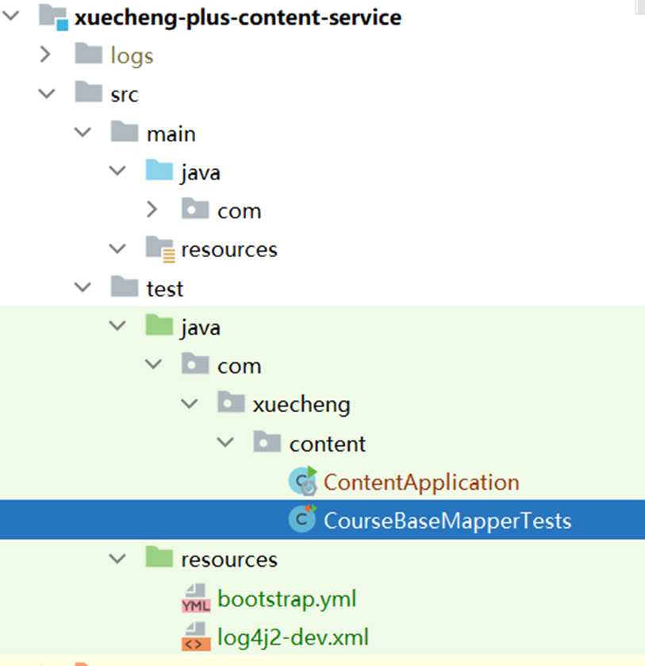

代码如下：

```java
package com.xuecheng.content;

import com.baomidou.mybatisplus.core.conditions.query.LambdaQueryWrapper;
import com.baomidou.mybatisplus.extension.plugins.pagination.Page;
import com.xuecheng.base.model.PageParams;
import com.xuecheng.base.model.PageResult;
import com.xuecheng.content.model.dto.QueryCourseParamsDto;
import com.xuecheng.content.model.po.CourseBase;
import com.xuecheng.content.mapper.CourseBaseMapper;
import org.apache.commons.lang.StringUtils;
import org.junit.jupiter.api.Assertions;
import org.junit.jupiter.api.Test;
import org.springframework.beans.factory.annotation.Autowired;
import org.springframework.boot.test.context.SpringBootTest;

import java.util.List;

@SpringBootTest
public class CourseBaseMapperTests {

    @Autowired
    public CourseBaseMapper courseBaseMapper;

    @Test
    void testCourseBaseMapper() {
        // 从数据库中查询数据
        CourseBase courseBase = courseBaseMapper.selectById(18);
        // 断言是不是 不为空?
        Assertions.assertNotNull(courseBase);

        // 详细进行分页查询的单元测试
        // 查询条件
        QueryCourseParamsDto courseParamsDto = new QueryCourseParamsDto();
        courseParamsDto.setCourseName("java"); // 课程名称查询条件

        // 拼装查询条件
        LambdaQueryWrapper<CourseBase> queryWrapper = new LambdaQueryWrapper<>();
        // 根据名称模糊查询     在sql中拼接course_base.name like '%值%'
        queryWrapper.like(StringUtils.isNotEmpty(courseParamsDto.getCourseName()), CourseBase::getName, courseParamsDto.getCourseName());
        // 根据课程审核状态查询  course_base.audit_status = ?
        queryWrapper.eq(StringUtils.isNotEmpty(courseParamsDto.getAuditStatus()), CourseBase::getAuditStatus, courseParamsDto.getAuditStatus());
        // todo:按课审核状态查询
        // todo:按课发布状态查询

        // 分页参数对象
        PageParams pageParams = new PageParams();
        pageParams.setPageNo(1L);
        pageParams.setPageSize(2L);

        // 创建page分页参数对象 参数:当前页码，每页记录数
        Page<CourseBase> page = new Page<>(pageParams.getPageNo(), pageParams.getPageSize());

        // 开始进行分页查询
        Page<CourseBase> pageResult = courseBaseMapper.selectPage(page, queryWrapper);
        // page中的数据列表
        List<CourseBase> items = pageResult.getRecords();
        // 总记录数
        long total = pageResult.getTotal();

        // 返回数据
        PageResult<CourseBase> courseBasePageResult = new PageResult<>(items, total, pageParams.getPageNo(), pageParams.getPageSize());

        System.out.println(courseBasePageResult);
    }
}

```

运行测试类的测试方法进行测试，测试成功：

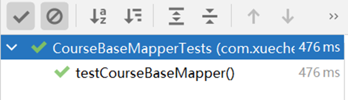

### **3.6 开发业务层**

#### **3.6.1 创建数据字典表**

课程基本信息查询的主要数据来源是课程基本信息表，这里有一个点需要注意，就是课程的审核状态、发布状态。

审核状态在查询条件和查询结果中都存在，审核状态包括：未审核、审核通过、审核未通过三种，下边思考一个问题：一个课程的审核状态如果是“审核未通过”那么在课程基本信息表记录“审核未通过”三个字合适吗？

如果将“审核未通过”五个字记录在课程基本信息表中，显示出来的审核状态就是“审核未通过”这五个字，看起来没有什么问题，如果有一天客户想要将审核未通过的记录在显示时改为“未通过”三个字，怎么办？

这时你可以需要批量处理数据库中记录了，写一个 update 语句，审核状态等于“审核未通过”的全部更新 为“未通过”。看起来解决了问题，如果有一天客户又让改了呢？

和审核状态同类的有好多这样的信息，比如：课程状态、课程类型、用户类型等等，这一类数据有一个共同点就是它有一些分类项，且这些分类项较为固定。`针对这些数据，为了提高系统的可扩展性，专门定义数据字典表去维护`。

下边是课程审核状态的定义：

```json
[
  { "code": "202001", "desc": "审核未通过" },
  { "code": "202002", "desc": "未审核" },
  { "code": "202003", "desc": "审核通过" }
]
```

每一项都由代码和名称组成。

此时我们好像要干什么了 ，该课程 的审核状态为审核未通过，那么我们在课程基本信息表存储 202001，也就是审核未通过对应的代码，这样查询出的数据在前端展示时根据代码取出它对应的内容显示给用户。如果用户要修改“审核未通过”的显示内容只需要在数据字典表修改，无法修改课程基本信息表。

数据字典表在系统管理数据库中存储，首先导入系统管理数据库，创建系统管理服务的数据库

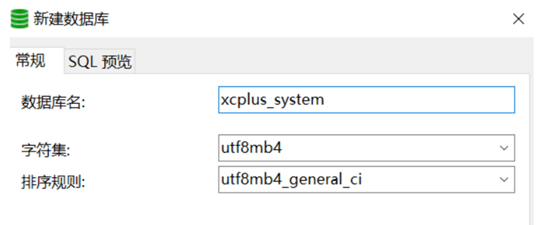

创建成功如下图：

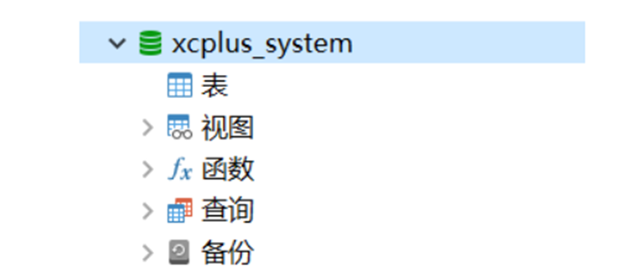

创建系统管理的数据库，导入课程资料中的 xcplus_system.sql 脚本。

#### **3.6.2 编写 Service**

接下来开发 Service 方法，首先创建 Service 接口：

```java
package com.xuecheng.content.service;

import com.xuecheng.base.model.PageParams;
import com.xuecheng.base.model.PageResult;
import com.xuecheng.content.model.dto.QueryCourseParamsDto;
import com.xuecheng.content.model.po.CourseBase;

/*
 * @description 课程基本信息管理业务接口
 * @author Mr.M
 * @date 2022/9/6 21:42
 * @version 1.0
 /
public interface CourseBaseInfoService  {

 /*
  * @description 课程查询接口
  * @param pageParams 分页参数
  * @param queryCourseParamsDto 条件条件
  * @return com.xuecheng.base.model.PageResult<com.xuecheng.content.model.po.CourseBase>
  * @author Mr.M
  * @date 2022/9/6 21:44
 */
  PageResult<CourseBase> queryCourseBaseList(PageParams pageParams, QueryCourseParamsDto queryCourseParamsDto);

 }

```

再创建接口实现类

```java
package com.xuecheng.content.service.impl;

import com.baomidou.mybatisplus.core.conditions.query.LambdaQueryWrapper;
import com.baomidou.mybatisplus.extension.plugins.pagination.Page;
import com.xuecheng.base.model.PageParams;
import com.xuecheng.base.model.PageResult;
import com.xuecheng.content.mapper.CourseBaseMapper;
import com.xuecheng.content.model.dto.QueryCourseParamsDto;
import com.xuecheng.content.model.po.CourseBase;
import com.xuecheng.content.service.CourseBaseInfoService;
import org.apache.commons.lang3.StringUtils;
import org.springframework.beans.factory.annotation.Autowired;
import org.springframework.stereotype.Service;

import java.util.List;

/**
 * @description 课程信息管理业务接口实现类
 * @author Mr.M
 * @date 2022/9/6 21:45
 * @version 1.0
 */
@Service
public class CourseBaseInfoServiceImpl  implements CourseBaseInfoService {


 @Autowired
 CourseBaseMapper courseBaseMapper;

 @Override
 public PageResult<CourseBase> queryCourseBaseList(PageParams pageParams, QueryCourseParamsDto queryCourseParamsDto) {


  //构建查询条件对象
  LambdaQueryWrapper<CourseBase> queryWrapper = new LambdaQueryWrapper<>();
  //构建查询条件，根据课程名称查询
     queryWrapper.like(StringUtils.isNotEmpty(queryCourseParamsDto.getCourseName()),CourseBase::getName,queryCourseParamsDto.getCourseName());
  //构建查询条件，根据课程审核状态查询
     queryWrapper.eq(StringUtils.isNotEmpty(queryCourseParamsDto.getAuditStatus()),CourseBase::getAuditStatus,queryCourseParamsDto.getAuditStatus());
//构建查询条件，根据课程发布状态查询
//todo:根据课程发布状态查询

  //分页对象
  Page<CourseBase> page = new Page<>(pageParams.getPageNo(), pageParams.getPageSize());
  // 查询数据内容获得结果
  Page<CourseBase> pageResult = courseBaseMapper.selectPage(page, queryWrapper);
  // 获取数据列表
  List<CourseBase> list = pageResult.getRecords();
  // 获取数据总数
  long total = pageResult.getTotal();
  // 构建结果集
  PageResult<CourseBase> courseBasePageResult = new PageResult<>(list, total, pageParams.getPageNo(), pageParams.getPageSize());
  return courseBasePageResult;


 }


}

```

#### **3.6.3 测试 service**

下边对 service 进行单元测试，编写单元测试类：

```java
package com.xuecheng.content;

import com.xuecheng.base.model.PageParams;
import com.xuecheng.base.model.PageResult;
import com.xuecheng.content.model.dto.QueryCourseParamsDto;
import com.xuecheng.content.model.po.CourseBase;
import com.xuecheng.content.service.CourseBaseInfoService;
import org.junit.jupiter.api.Test;
import org.springframework.beans.factory.annotation.Autowired;
import org.springframework.boot.test.context.SpringBootTest;

@SpringBootTest
class CourseBaseInfoServiceTests {

    @Autowired
    CourseBaseInfoService courseBaseInfoService;


    @Test
    void testCourseBaseInfoService() {
        //查询条件
        QueryCourseParamsDto queryCourseParamsDto = new QueryCourseParamsDto();
        queryCourseParamsDto.setCourseName("java");
        queryCourseParamsDto.setAuditStatus("202004");
        queryCourseParamsDto.setPublishStatus("203001");

        //分页参数
        PageParams pageParams = new PageParams();
        pageParams.setPageNo(1L);//页码
        pageParams.setPageSize(3L);//每页记录数

        PageResult<CourseBase> courseBasePageResult = courseBaseInfoService.queryCourseBaseList(pageParams, queryCourseParamsDto);
        System.out.println(courseBasePageResult);
    }

}

```

#### **3.6.4 完善 todo**

课下完成 service 方法中的 todo：根据课程发布状态查询课程信息。

### **3.7 接口测试**

#### **3.7.1 接口完善**

控制层、业务层以及持久层三层通常可以面向接口并行开发，比如：业务层开发的同事可以先只编写一个 Service 接口，接口层的同事即可面向 Service 接口去开发，待接口层和业务层完成后进行连调。

下边课程查询接口的实现。

```java
@ApiOperation("课程查询接口")
@PostMapping("/course/list")
 public PageResult<CourseBase> list(PageParams pageParams, @RequestBody QueryCourseParamsDto queryCourseParams){
     PageResult<CourseBase> pageResult = courseBaseInfoService.queryCourseBaseList(pageParams, queryCourseParams);
    return pageResult;
 }

```

代码编辑完毕，再次打开 Swagger 进行测试。

输入查询条件：

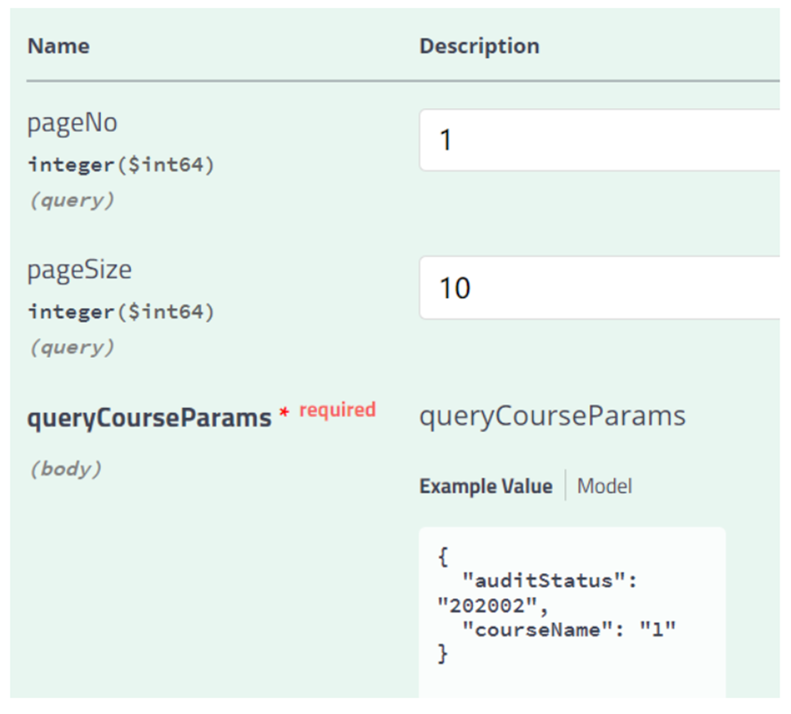

测试，观察结果是否正确。

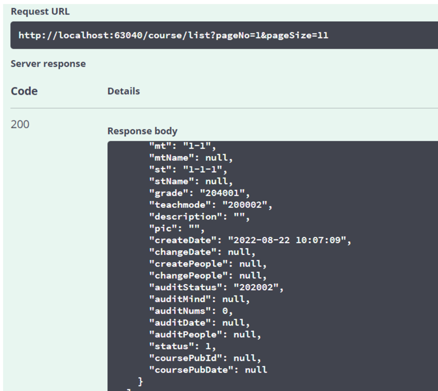

#### **3.7.2 Httpclient 测试**

Swagger 是一个在线接口文档，虽然使用它也能测试但需要浏览器进入 Swagger，最关键的是它并不能保存测试数据。

在 IDEA 中有一个非常方便的 http 接口测试工具 httpclient，下边介绍它的使用方法，后边我们会用它进行接口测试。

如果 IDEA 版本较低没有自带 httpclient，需要安装 httpclient 插件

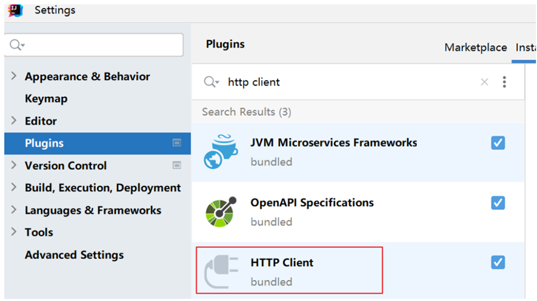

进入 controller 类，找到 http 接口对应的方法

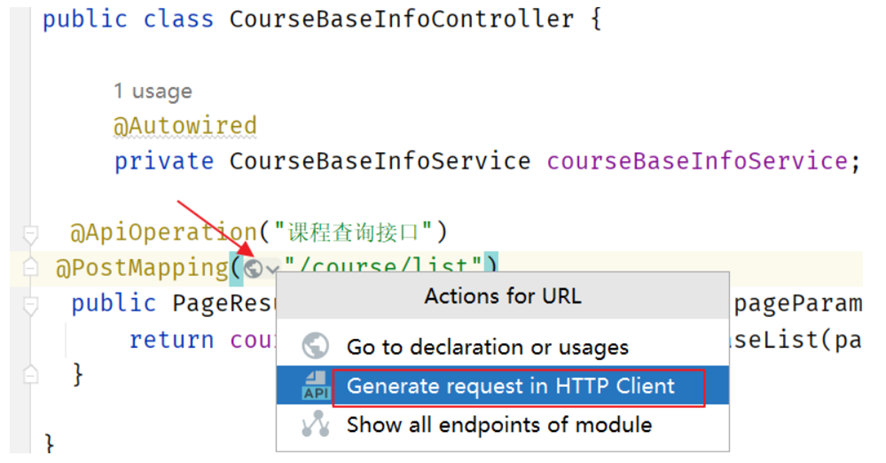

点击 Generate request in HTTP Client 即可生成的一个测试用例。

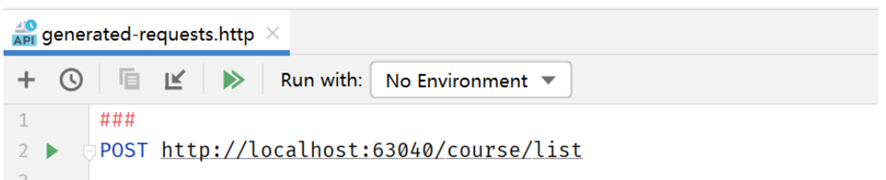

可以看到自己生成了一个.http 结尾的文件

我们可以添加请求参数进行测试

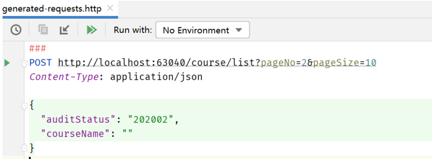

参数添加完毕可以运行它

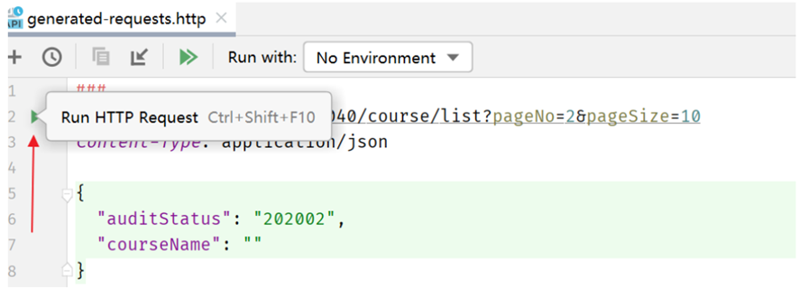

观察控制台，测试通过。

```java
http://localhost:63040/course/list?pageNo=2&pageSize=10

HTTP/1.1 200
Content-Type: application/json
Transfer-Encoding: chunked
Date: Wed, 07 Sep 2022 00:54:50 GMT
Keep-Alive: timeout=60
Connection: keep-alive

{
  "items": [
    {
      "id": 88,
      "companyId": 1232141425,
      "companyName": null,
      "name": "1",
      "users": "1",
      "tags": "1",
      "mt": "1-1",
      "mtName": null,
      "st": "1-1-1",
      "stName": null,
      "grade": "204001",
      "teachmode": "200002",
      "description": "1",
      "pic": "http://r3zc5rung.hd-bkt.clouddn.com/cb1b6038-ef68-4362-8c29-a966886d1dc5sakUiFHLb5sRFdIK",
      "createDate": "2021-12-27 20:14:53",
      "changeDate": "2021-12-27 20:28:58",
      "createPeople": null,
      "changePeople": null,
      "auditStatus": "202002",
      "auditMind": null,
      "auditNums": 0,
      "auditDate": null,
      "auditPeople": null,
      "status": 1,
      "coursePubId": null,
      "coursePubDate": null
    },
   ....
  ],
  "counts": 14,
  "page": 2,
  "pageSize": 10
}
Response file saved.
> 2022-09-07T085450.200.json

Response code: 200; Time: 392ms (392 ms); Content length: 1916 bytes (1.92 kB)


```

.http 文件即测试用例文档 ，它可以随着项目工程一起保存，这样测试的数据就可以保存下来，方便进行测试。

为了方便保存.http 文件 ，我们单独在项目工程的根目录创建一个目录单独存放它们。

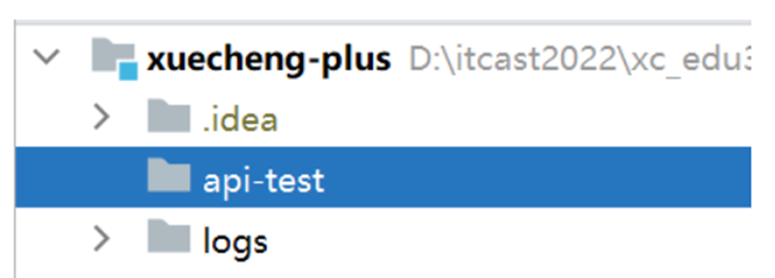

我们以模块为单位创建.http 文件。

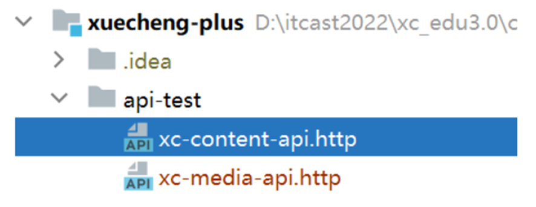

打开内容管理模块的 http 文件 ，把刚才测试数据拷贝上去

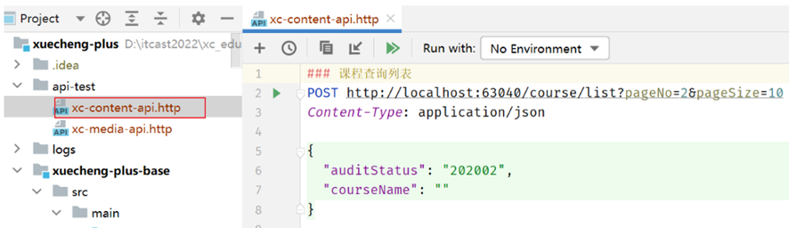

为了方便将来和网关集成测试，这里我们把测试主机地址在配置文件 http-client.env.json 中配置

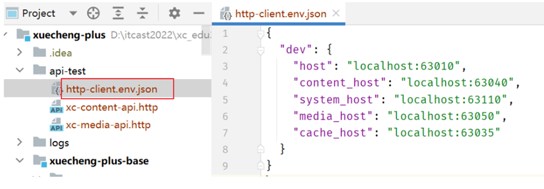

注意：文件名称 http-client.env.json 保持一致，否则无法读取 dev 环境变量的内容。

内容如下：

```json
{
  "dev": {
    "access_token": "",
    "gateway_host": "localhost:63010",
    "content_host": "localhost:63040",
    "system_host": "localhost:63110",
    "media_host": "localhost:63050",
    "search_host": "localhost:63080",
    "auth_host": "localhost:63070",
    "checkcode_host": "localhost:63075",
    "learning_host": "localhost:63020"
  }
}
```

再回到 xc-content-api.http 文件，将<http://localhost:63040> 用变量代替

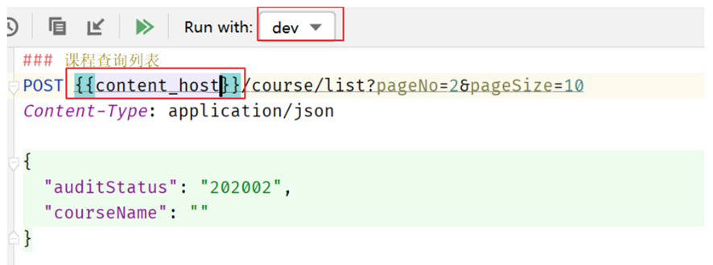

到此就完成了 httpclient 的配置与使用测试。

### **3.8 前后端联调**

#### **3.8.1 准备环境**

什么是前后端联调？

通常由后端工程师将接口设计好并编写接口文档，将接口文档交给前端工程师，前后端的工程师就开始并行开发，前端开发人员会使用 mock 数据（假数据）进行开发，当前后端代码完成后开始进行接口联调，前端工程师将 mock 数据改为请求后端接口获取，前端代码请求后端服务测试接口是否正常，这个过程是前后端联调。

当前后端联调出现问题需要根据测试环境下接口的请求及响应数据内容去判断是否符合接口文档的要求。查出是前端或后端的问题由具体的工程师负责修改缺陷，修改后再次回归测试。

在教学中进行前后端联调，首先配置前端环境，下边我们安装前端工程运行的环境。

首先从软件工具目录找到 node-v16.17.0-x64.msi 安装 nodejs

安装完成，查看版本号

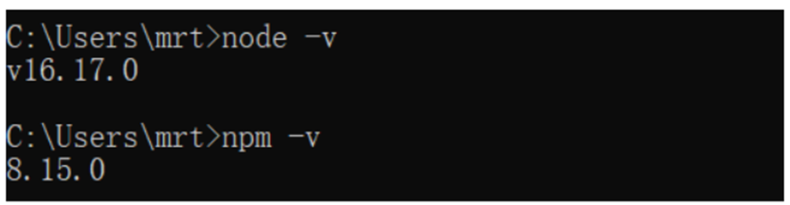

在 idea 中配置 node.js 的路径

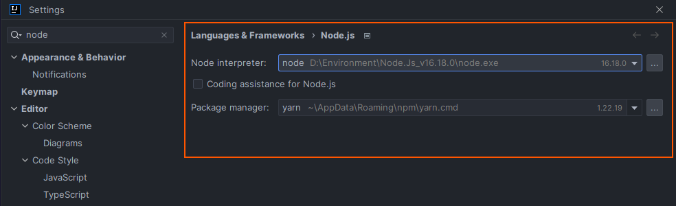

下边启动前端工程，从前端工程拷贝 project-xczx2-portal-vue-ts.zip 到代码目录并解压，并使用 IDEA 或 VS Code 打开 project-xczx2-portal-vue-ts 目录，下边以 IDEA 为例进行说明：

右键点击 project-xczx2-portal-vue-ts 目录下的 package.json 文件，

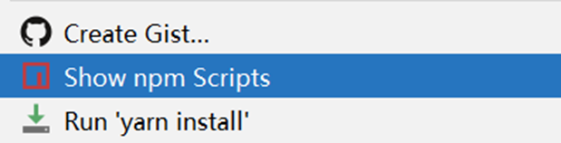

点击 Show npm Scripts 打开 npm 窗口

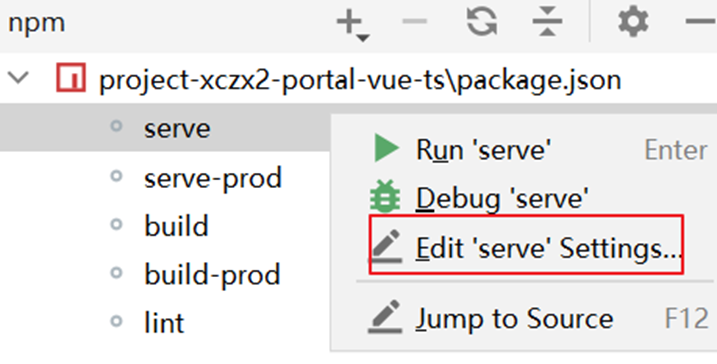

点击“Edit 'serve'” setting，下边对启动项目的一些参数进行配置，选择 nodejs、npm。

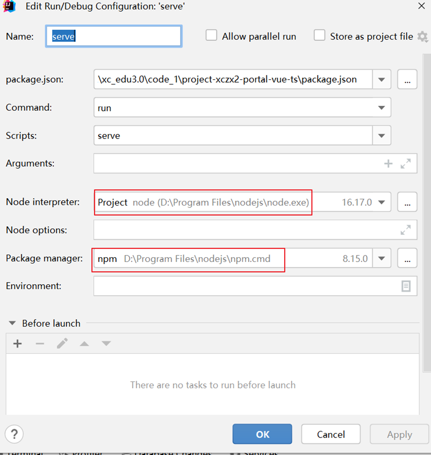

右键点击 Serve，点击“Run serve”启动工程。

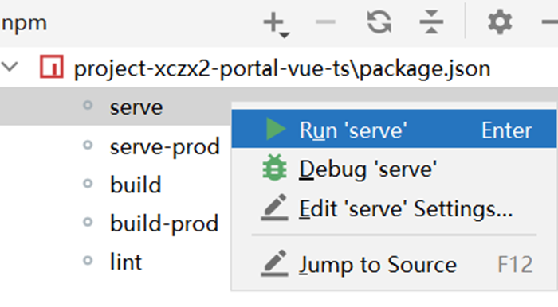

出现如下访问链接说明启动成功

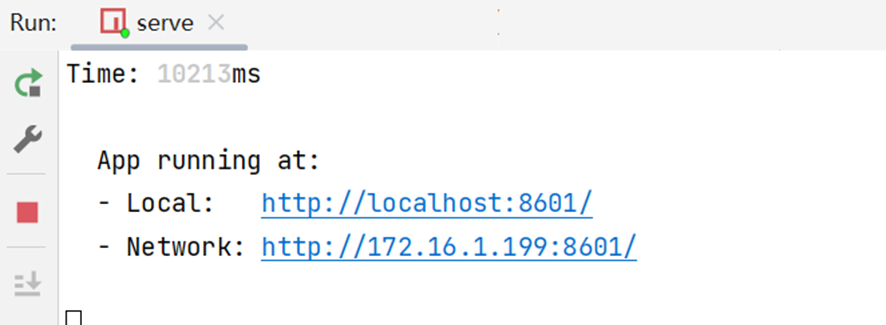

访问 http://localhost:8601 即可访问前端工程。

如果存在问题通过以下命令启动：

1、cmd 进入工程根目录

2、运行以下命令

npm install -g cnpm --registry=https://registry.npm.taobao.org

cnpm i

npm run serve

#### **3.8.2 安装系统管理服务**

启动前端工程成功，在浏览器通过<http://localhost:8601/>地址访问前端工程。

前端工程报错如下：

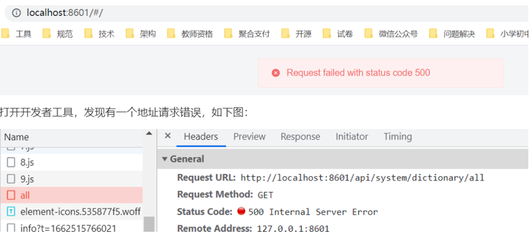

[http://localhost:8601/system/dictionary/all](http://localhost:8601/api/system/dictionary/all) 指向的是系统管理服务。在前端讲解内容管理模块的需求时我们提到一个数据字典表，此链接正是在前端请求后端获取数据字典数据的接口地址。

数据字典表中配置了项目用的字典信息，此接口是查询字典中的全部数据 ，在此我们不再开发，按照下边的步骤安装系统管理服务即可。

从课程资料/项目工程目录获取 xuecheng-plus-system.zip，并解压

将 xuecheng-plus-system 目录拷贝到项目工程根目录，刷新 maven，或进入 pom.xml 右键转为 pom 工程。

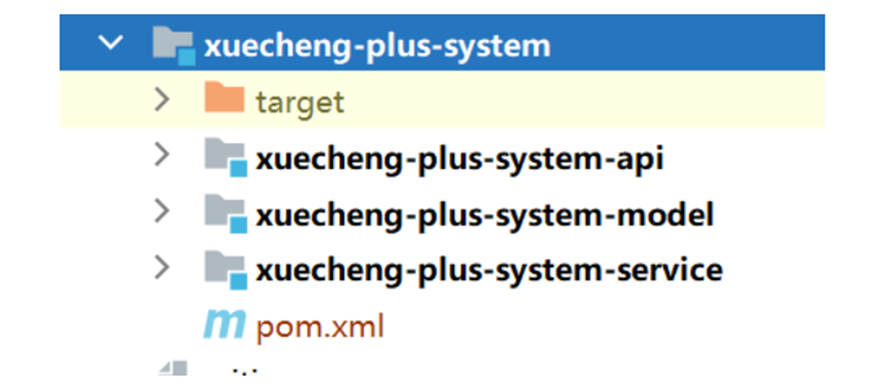

进入 xuecheng-plus-system-service 工程，找到 resources 下的 application.yml 修改数据库连接参数。

启动系统管理服务，启动成功，在浏览器请求：<http://localhost:63110/system/dictionary/all>

系统服务的端口是 63110

如果可以正常读取数据字典信息则说明系统管理服务安装成功。

#### **3.8.3 解决跨域问题**

在浏览器通过<http://localhost:8601/>地址访问前端工程。

chrome 浏览器报错如下：

```bash
Access to XMLHttpRequest at 'http://localhost:63110/system/dictionary/all' from origin 'http://localhost:8601' has been blocked by CORS policy: No 'Access-Control-Allow-Origin' header is present on the requested resource.

```

firefox 浏览器报错如下：

```bash
已拦截跨源请求：同源策略禁止读取位于 http://localhost:63110/system/dictionary/all 的远程资源。（原因：CORS 头缺少 'Access-Control-Allow-Origin'）。状态码：200。

```

提示：从<http://localhost:8601>访问<http://localhost:63110/system/dictionary/all>被 CORS policy 阻止，因为没有 Access-Control-Allow-Origin 头信息。CORS 全称是 cross origin resource share 表示跨域资源共享。

出这个提示的原因是基于浏览器的同源策略，去判断是否跨域请求，同源策略是浏览器的一种安全机制，从一个地址请求另一个地址，如果协议、主机、端口三者全部一致则不属于跨域，否则有一个不一致就是跨域请求。

比如：

从<http://localhost:8601> 到 <http://localhost:8602> 由于端口不同，是跨域。

从<http://192.168.101.10:8601> 到 <http://192.168.101.11:8601> 由于主机不同，是跨域。

从<http://192.168.101.10:8601> 到 [https://192.168.101.10:8601](https://192.168.101.11:8601) 由于协议不同，是跨域。

注意：服务器之间不存在跨域请求。

浏览器判断是跨域请求会在请求头上添加 origin，表示这个请求来源哪里。

比如：

```java
GET / HTTP/1.1
Origin: http://localhost:8601

```

服务器收到请求判断这个 Origin 是否允许跨域，如果允许则在响应头中说明允许该来源的跨域请求，如下：

```java
Access-Control-Allow-Origin：http://localhost:8601

```

如果允许任何域名来源的跨域请求，则响应如下：

```java
Access-Control-Allow-Origin：*

```

解决跨域的方法：

1、JSONP

通过 script 标签的 src 属性进行跨域请求，如果服务端要响应内容则首先读取请求参数 callback 的值，callback 是一个回调函数的名称，服务端读取 callback 的值后将响应内容通过调用 callback 函数的方式告诉请求方。如下图：

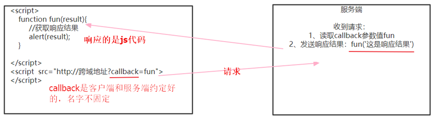

2、添加响应头

服务端在响应头添加 Access-Control-Allow-Origin：\*

3、通过 nginx 代理跨域

由于服务端之间没有跨域，浏览器通过 nginx 去访问跨域地址。

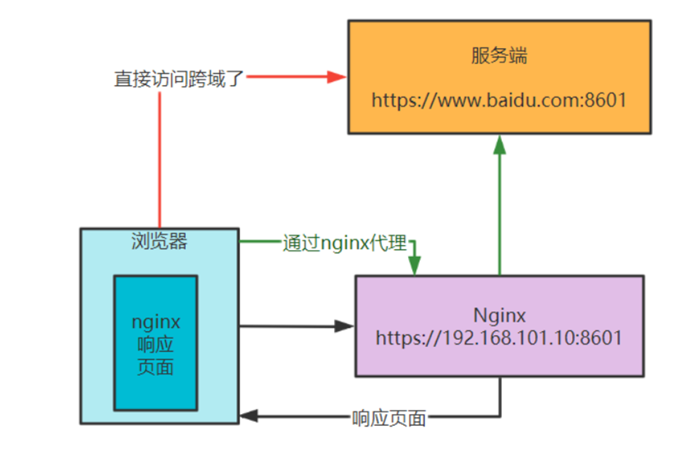

1）浏览器先访问<http://192.168.101.10:8601> nginx 提供的地址，进入页面

2）此页面要跨域访问<http://192.168.101.11:8601> ，不能直接跨域访问<http://www.baidu.com:8601> ，而是访问 nginx 的一个同源地址，比如：<http://192.168.101.11:8601/api> ，通过<http://192.168.101.11:8601/api> 的代理去访问<http://www.baidu.com:8601>。

这样就实现了跨域访问。

浏览器到<http://192.168.101.11:8601/api> 没有跨域

nginx 到<http://www.baidu.com:8601>通过服务端通信，没有跨域。

我们准备使用方案 2 解决跨域问题。在内容管理的 api 工程 config 包下编写 GlobalCorsConfig.java，

或直接从课程资料/项目工程下拷贝，

代码如下：

```java
Java
package com.xuecheng.system.config;

import org.springframework.context.annotation.Bean;
import org.springframework.context.annotation.Configuration;
import org.springframework.web.cors.CorsConfiguration;
import org.springframework.web.cors.UrlBasedCorsConfigurationSource;
import org.springframework.web.filter.CorsFilter;

/**
 * @description 跨域过虑器
 * @author Mr.M
 * @date 2022/9/7 11:04
 * @version 1.0
 */
 @Configuration
 public class GlobalCorsConfig {

  /**
   * 允许跨域调用的过滤器
   */
  @Bean
  public CorsFilter corsFilter() {
   CorsConfiguration config = new CorsConfiguration();
   //允许白名单域名进行跨域调用
   config.addAllowedOrigin("*");
   //允许跨越发送cookie
   config.setAllowCredentials(true);
   //放行全部原始头信息
   config.addAllowedHeader("*");
   //允许所有请求方法跨域调用
   config.addAllowedMethod("*");
   UrlBasedCorsConfigurationSource source = new UrlBasedCorsConfigurationSource();
   source.registerCorsConfiguration("/**", config);
   return new CorsFilter(source);
  }
 }


```

此配置类实现了跨域过虑器，在响应头添加 Access-Control-Allow-Origin。

重启系统管理服务，前端工程可以正常进入<http://localhost:8601>，观察浏览器记录，成功解决跨域。

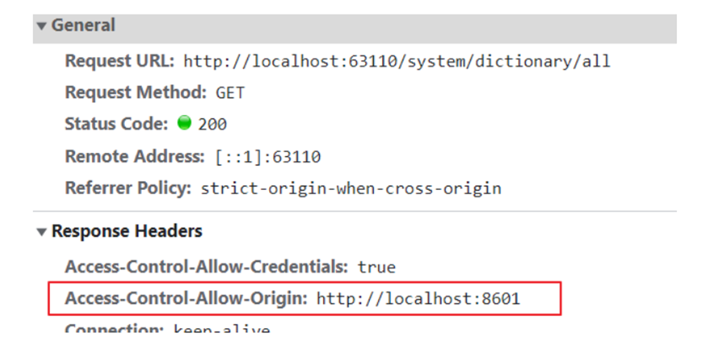

#### **3.8.4 前后端联调**

这里进行前后联调的目的是体会前后端联调的流程，测试的功能为课程查询功能。

1、启动前端工程，再启内容管理服务端。

2、修改服务端地址

前端默认连接的是项目的网关地址，由于现在网关工程还没有创建，这里需要更改前端工程的参数配置文件 ，修改网关地址为内容管理服务的地址。

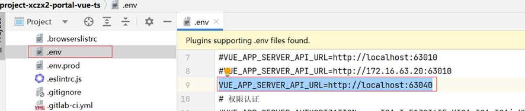

启动前端工程，用前端访问后端接口，观察前端界面的数据是否正确。

访问前端首页，进入课程管理：<http://localhost:8601/#/organization/course-list>

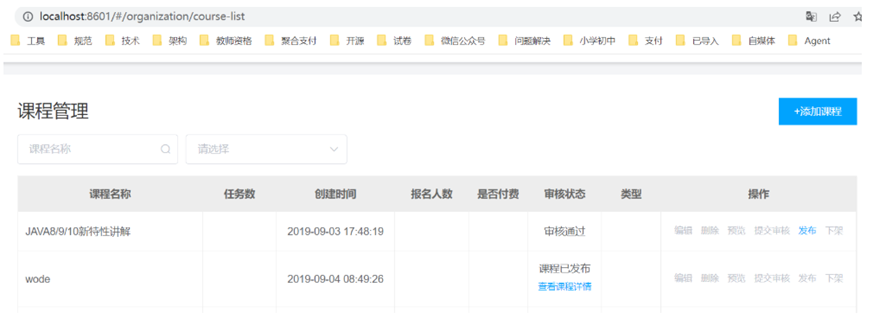

更改课程条件及分页参数测试课程查询列表是否正常显示。

跟踪内容管理服务的输出日志，查看是否正常。

到此基本完成了前后端连调。

## **4 课程分类查询**

### **4.1 需求分析**

下边根据内容管理模块的业务流程，下一步要实现新增课程，在新增课程界面，有三处信息需要选择，如下图：

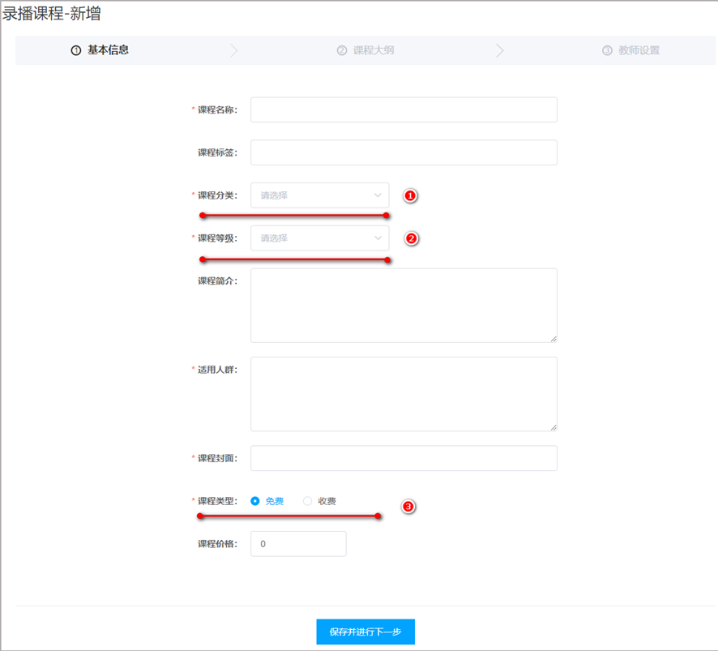

课程等级、课程类型来源于数据字典表，此部分的信息前端已从系统管理服务读取。

课程分类信息没有在数据字典表中存储，而是由单独一张课程分类表，存储在内容管理数据库中。

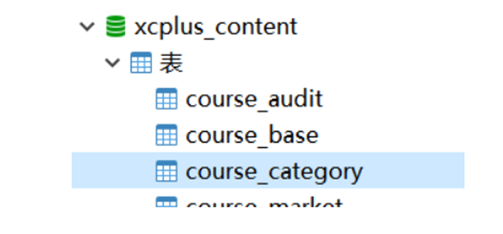

下边看下 course_category 课程分类表的结构

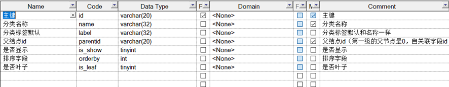

这张表是一个树型结构，通过父结点 id 将各元素组成一个树。

我们可以看下该表的数据，下图是一部分数据：

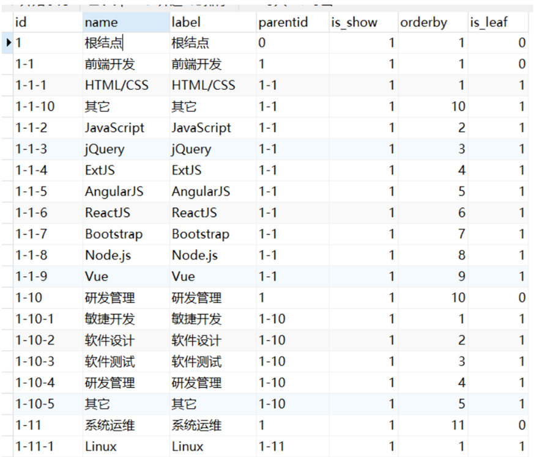

现在的需求是需要在内容管理服务中编写一个接口读取该课程分类表的数据，组成一个树型结构返回给前端。

课程分类的 PO 类如下：

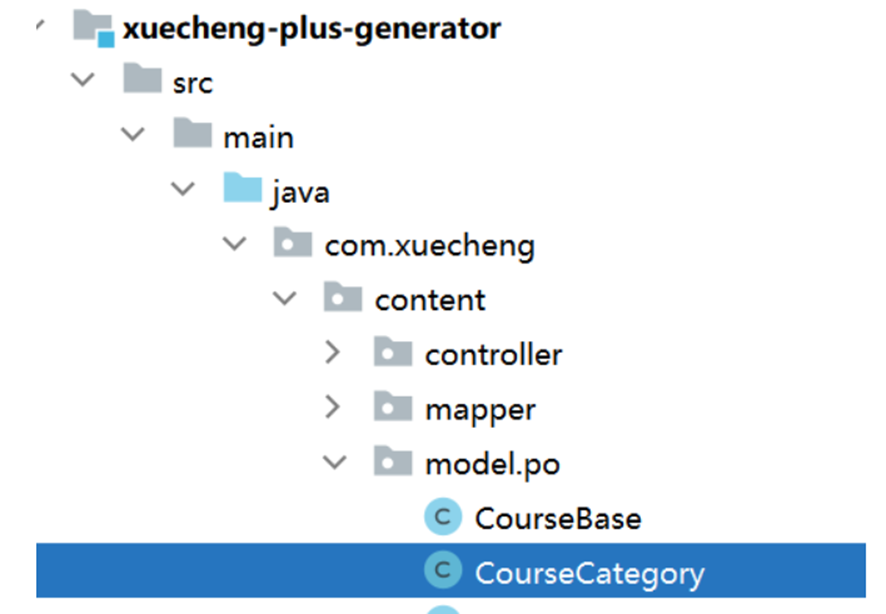

如果没有此 po 类则需要生成的此表的 po 类拷贝到内容管理模块的 model 工程中，将 mapper 拷贝到内容管理模块的 service 工程中。

### **4.2 接口定义**

我们可以点击新增课程，观察前端的请求记录：

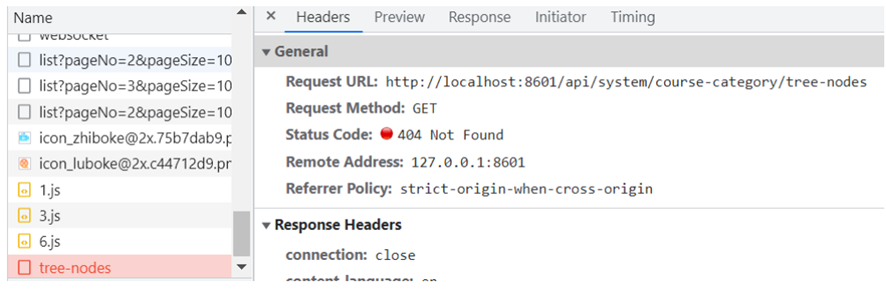

<http://localhost:8601/api/content/course-category/tree-nodes> 该地址正是前端获取课程分类的接口地址。

通过上图界面的内容可以看出该接口的协议为：HTTP GET

请求参数为空。

通过查阅接口文档，此接口要返回全部课程分类，以树型结构返回，如下所示。

```json
[
  {
    "childrenTreeNodes": [
      {
        "childrenTreeNodes": null,
        "id": "1-1-1",
        "isLeaf": null,
        "isShow": null,
        "label": "HTML/CSS",
        "name": "HTML/CSS",
        "orderby": 1,
        "parentid": "1-1"
      },
      {
        "childrenTreeNodes": null,
        "id": "1-1-2",
        "isLeaf": null,
        "isShow": null,
        "label": "JavaScript",
        "name": "JavaScript",
        "orderby": 2,
        "parentid": "1-1"
      },
      {
        "childrenTreeNodes": null,
        "id": "1-1-3",
        "isLeaf": null,
        "isShow": null,
        "label": "jQuery",
        "name": "jQuery",
        "orderby": 3,
        "parentid": "1-1"
      },
      {
        "childrenTreeNodes": null,
        "id": "1-1-4",
        "isLeaf": null,
        "isShow": null,
        "label": "ExtJS",
        "name": "ExtJS",
        "orderby": 4,
        "parentid": "1-1"
      },
      {
        "childrenTreeNodes": null,
        "id": "1-1-5",
        "isLeaf": null,
        "isShow": null,
        "label": "AngularJS",
        "name": "AngularJS",
        "orderby": 5,
        "parentid": "1-1"
      },
      {
        "childrenTreeNodes": null,
        "id": "1-1-6",
        "isLeaf": null,
        "isShow": null,
        "label": "ReactJS",
        "name": "ReactJS",
        "orderby": 6,
        "parentid": "1-1"
      },
      {
        "childrenTreeNodes": null,
        "id": "1-1-7",
        "isLeaf": null,
        "isShow": null,
        "label": "Bootstrap",
        "name": "Bootstrap",
        "orderby": 7,
        "parentid": "1-1"
      },
      {
        "childrenTreeNodes": null,
        "id": "1-1-8",
        "isLeaf": null,
        "isShow": null,
        "label": "Node.js",
        "name": "Node.js",
        "orderby": 8,
        "parentid": "1-1"
      },
      {
        "childrenTreeNodes": null,
        "id": "1-1-9",
        "isLeaf": null,
        "isShow": null,
        "label": "Vue",
        "name": "Vue",
        "orderby": 9,
        "parentid": "1-1"
      },
      {
        "childrenTreeNodes": null,
        "id": "1-1-10",
        "isLeaf": null,
        "isShow": null,
        "label": "其它",
        "name": "其它",
        "orderby": 10,
        "parentid": "1-1"
      }
    ],
    "id": "1-1",
    "isLeaf": null,
    "isShow": null,
    "label": "前端开发",
    "name": "前端开发",
    "orderby": 1,
    "parentid": "1"
  },
  {
    "childrenTreeNodes": [
      {
        "childrenTreeNodes": null,
        "id": "1-2-1",
        "isLeaf": null,
        "isShow": null,
        "label": "微信开发",
        "name": "微信开发",
        "orderby": 1,
        "parentid": "1-2"
      },
      {
        "childrenTreeNodes": null,
        "id": "1-2-2",
        "isLeaf": null,
        "isShow": null,
        "label": "iOS",
        "name": "iOS",
        "orderby": 2,
        "parentid": "1-2"
      },
      {
        "childrenTreeNodes": null,
        "id": "1-2-3",
        "isLeaf": null,
        "isShow": null,
        "label": "手游开发",
        "name": "手游开发",
        "orderby": 3,
        "parentid": "1-2"
      },
      {
        "childrenTreeNodes": null,
        "id": "1-2-4",
        "isLeaf": null,
        "isShow": null,
        "label": "Swift",
        "name": "Swift",
        "orderby": 4,
        "parentid": "1-2"
      },
      {
        "childrenTreeNodes": null,
        "id": "1-2-5",
        "isLeaf": null,
        "isShow": null,
        "label": "Android",
        "name": "Android",
        "orderby": 5,
        "parentid": "1-2"
      },
      {
        "childrenTreeNodes": null,
        "id": "1-2-6",
        "isLeaf": null,
        "isShow": null,
        "label": "ReactNative",
        "name": "ReactNative",
        "orderby": 6,
        "parentid": "1-2"
      },
      {
        "childrenTreeNodes": null,
        "id": "1-2-7",
        "isLeaf": null,
        "isShow": null,
        "label": "Cordova",
        "name": "Cordova",
        "orderby": 7,
        "parentid": "1-2"
      },
      {
        "childrenTreeNodes": null,
        "id": "1-2-8",
        "isLeaf": null,
        "isShow": null,
        "label": "其它",
        "name": "其它",
        "orderby": 8,
        "parentid": "1-2"
      }
    ],
    "id": "1-2",
    "isLeaf": null,
    "isShow": null,
    "label": "移动开发",
    "name": "移动开发",
    "orderby": 2,
    "parentid": "1"
  }
]
```

上边的数据格式是一个数组结构，数组的元素即为分类信息，分类信息设计两级分类，第一级的分类信息示例如下：

```json
"id" : "1-2",
"isLeaf" : null,
"isShow" : null,
"label" : "移动开发",
"name" : "移动开发",
"orderby" : 2,
"parentid" : "1"

```

第二级的分类是第一级分类中 childrenTreeNodes 属性，它是一个数组结构：

```json
{
"id" : "1-2",
"isLeaf" : null,
"isShow" : null,
"label" : "移动开发",
"name" : "移动开发",
"orderby" : 2,
"parentid" : "1",
"childrenTreeNodes" : [
               {
                  "childrenTreeNodes" : null,
                  "id" : "1-2-1",
                  "isLeaf" : null,
                  "isShow" : null,
                  "label" : "微信开发",
                  "name" : "微信开发",
                  "orderby" : 1,
                  "parentid" : "1-2"
               }
 }

```

所以，定义一个 DTO 类表示分类信息的模型类，如下：

```java
package com.xuecheng.content.model.dto;

import com.xuecheng.content.model.po.CourseCategory;
import lombok.Data;

import java.io.Serializable;
import java.util.List;

/**
 * @description 课程分类树型结点dto
 * @author Mr.M
 * @date 2022/9/7 15:16
 * @version 1.0
 */
@Data
public class CourseCategoryTreeDto extends CourseCategory implements Serializable {

  List<CourseCategoryTreeDto> childrenTreeNodes;
}


```

接口定义如下：

```java
package com.xuecheng.content.api;

import com.xuecheng.content.model.dto.CourseCategoryTreeDto;
import com.xuecheng.content.service.CourseCategoryService;
import lombok.extern.slf4j.Slf4j;
import org.springframework.beans.factory.annotation.Autowired;
import org.springframework.web.bind.annotation.GetMapping;
import org.springframework.web.bind.annotation.RestController;

import java.util.List;

/**
 * <p>
 * 数据字典 前端控制器
 * </p>
 *
 * @author itcast
 */
@Slf4j
@RestController
public class CourseCategoryController {

    @GetMapping("/course-category/tree-nodes")
    public List<CourseCategoryTreeDto> queryTreeNodes() {
       return null;
    }
}

```

### **4.3 接口开发**

#### **4.3.1 树型表查询**

课程分类表是一个树型结构，其中 parentid 字段为父结点 ID，它是树型结构的标志字段。

如果树的层级固定可以使用表的自连接去查询，比如：我们只查询两级课程分类，可以用下边的 SQL

```sql
select
       one.id            one_id,
       one.name          one_name,
       one.parentid      one_parentid,
       one.orderby       one_orderby,
       one.label         one_label,
       two.id            two_id,
       two.name          two_name,
       two.parentid      two_parentid,
       two.orderby       two_orderby,
       two.label         two_label
   from course_category one
            inner join course_category two on one.id = two.parentid
   where one.parentid = 1
     and one.is_show = 1
     and two.is_show = 1
   order by one.orderby,
            two.orderby

```

如果树的层级不确定，此时可以使用 MySQL8 递归实现，使用 with 语法，如下：

```sql
    WITH [RECURSIVE]
        cte_name [(col_name [, col_name] ...)] AS (subquery)
        [, cte_name [(col_name [, col_name] ...)] AS (subquery)] ...

```

cte_name :公共表达式的名称,可以理解为表名,用来表示 as 后面跟着的子查询

col_name :公共表达式包含的列名,可以写也可以不写

下边是一个递归的简单例子：

```sql
with RECURSIVE t1  AS
(
  SELECT 1 as n
  UNION ALL
  SELECT n + 1 FROM t1 WHERE n < 5
)
SELECT * FROM t1;

```

输出：

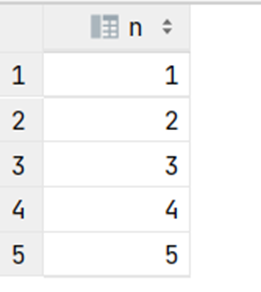

说明：

t1 相当于一个表名

select 1 相当于这个表的初始值，这里使用 UNION ALL 将初始值加入到表中。

n&lt;5 为递归执行的条件，当 n&gt;=5 时结束递归调用。

下边我们使用递归实现课程分类的查询

```sql
with recursive t1 as (
select * from  course_category p where  id= '1'
union all
 select t.* from course_category t inner join t1 on t1.id = t.parentid
)
select *  from t1 order by t1.id, t1.orderby

```

查询结果如下：

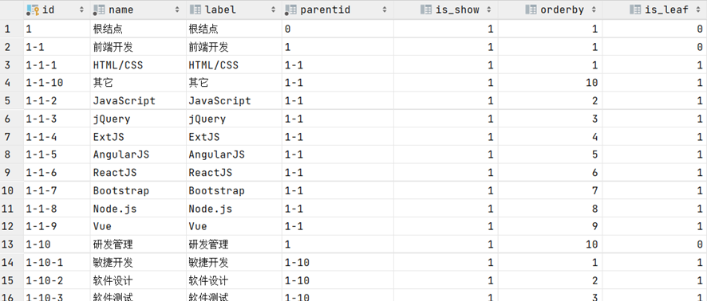

t1 表中初始的数据是 id 等于 1 的记录，即根结点。

通过 inner join t1 t2 on t2.id = t.parentid 找到 id='1'的下级节点 。

通过这种方法就找到了 id='1'的所有下级节点，下级节点包括了所有层级的节点。

上边这种方法是向下递归，即找到初始节点的所有下级节点。

如何向上递归？

下边的 sql 实现了向上递归：

```sql
with recursive t1 as (
select * from  course_category p where  id= '1-1-1'
union all
 select t.* from course_category t inner join t1 on t1.parentid = t.id
)
select *  from t1 order by t1.id, t1.orderby

```

初始节点为 1-1-1，通过递归找到它的父级节点，父级节点包括所有级别的节点。

以上是我们研究了树型表的查询方法，通过递归的方式查询课程分类比较灵活，因为它可以不限制层级。

mysql 为了避免无限递归默认递归次数为 1000，可以通过设置 cte_max_recursion_depth 参数增加递归深度，还可以通过 max_execution_time 限制执行时间，超过此时间也会终止递归操作。

mysql 递归相当于在存储过程中执行若干次 sql 语句，java 程序仅与数据库建立一次链接执行递归操作，所以只要控制好递归深度，控制好数据量性能就没有问题。

思考：如果 java 程序在递归操作中连接数据库去查询数据组装数据，这个性能高吗？

#### **4.3.2 开发 Mapper**

下边我们可自定义 mapper 方法查询课程分类，最终将查询结果映射到 List&lt;CourseCategoryTreeDto&gt;中。

生成课程分类表的 mapper 文件并拷贝至内容管理模块 的 service 工程中。

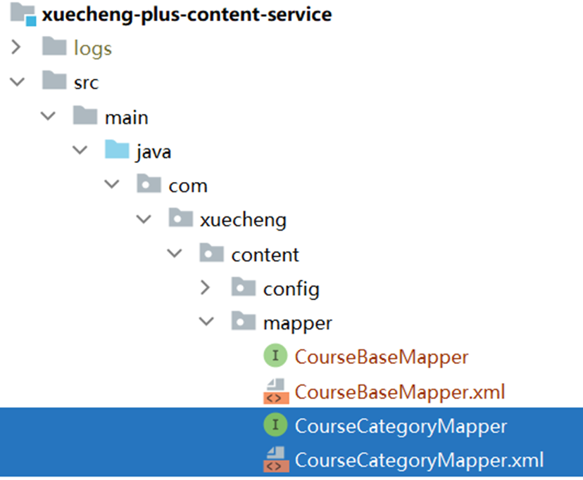

1、下边 定义一个 mapper 方法，并定义 sql 语句。

```java
public interface CourseCategoryMapper extends BaseMapper<CourseCategory> {
    public List<CourseCategoryTreeDto> selectTreeNodes(String id);
}

```

2、找到对应 的 mapper.xml 文件，编写 sql 语句。

```xml
<select id="selectTreeNodes" resultType="com.xuecheng.content.model.dto.CourseCategoryTreeDto" parameterType="string">
    with recursive t1 as (
        select * from  course_category p where  id= #{id}
        union all
        select t.* from course_category t inner join t1 on t1.id = t.parentid
    )
    select *  from t1 order by t1.id, t1.orderby

</select>

```

#### **4.3.3 开发 service**

定义 service 接口，调用 mapper 查询课程分类，遍历数据按照接口要求对数据进行封装

```java
public interface CourseCategoryService {
    /**
     * 课程分类树形结构查询
     *
     * @return
     */
    public List<CourseCategoryTreeDto> queryTreeNodes(String id);
}

```

编写 service 接口实现

```java
@Slf4j
@Service
public class CourseCategoryServiceImpl implements CourseCategoryService {

    @Autowired
    private CourseCategoryMapper courseCategoryMapper;

    /**
     * 课程分类树形结构查询
     *
     * @param id
     * @return
     */
    @Override
    public List<CourseCategoryTreeDto> queryTreeNodes(String id) { //这里默认 传入的是1 也就是根节点
        // 调用mapper 递归查询出分类信息
        List<CourseCategoryTreeDto> courseCategoryTreeDtos = courseCategoryMapper.selectTreeNodes(id);

        // 找到每个节点的子节点 List<CourseCategoryTreeDto>
        // 现将list 转成 map key就是节点id，value就是CourseCategoryTreeDto对象，目的就是为了方便从map获取节点
        Map<String, CourseCategoryTreeDto> mapTemp = courseCategoryTreeDtos.stream()
                // 排除根节点传入的参数(id)是1
                .filter(item -> !id.equals(item.getId()))
                .collect(Collectors.toMap(CourseCategoryTreeDto::getId, value -> value, (key1, key2) -> key2));

        // 定义一个list 作为最终返回的list 这里面 存放的是 1-1  1-10  1-11  1-12  等等 一级目录
        List<CourseCategoryTreeDto> courseCategoryList = new ArrayList<>();

        // 从头遍历 List<CourseCategoryTreeDto> 一边遍历一遍找子节点放在父节点的 childrenTreeNodes
        courseCategoryTreeDtos.stream()
                .filter(item -> !id.equals(item.getId()))
                .forEach(item -> {
                    // 向list写入元素
                    if (item.getParentid().equals(id)) { // 如果 parentID = 1的话  说明他就是一级目录
                        courseCategoryList.add(item);
                    }

                    // 找到当前节点的父节点       当前节点:1-1-1  1-1-10  1-1-2  1-1-3 等等 二级节点   父节点则是 1-1  1-10  1-11  1-12  等等 一级目录
                    CourseCategoryTreeDto courseCategoryParent = mapTemp.get(item.getParentid());
                    if (courseCategoryParent != null) {
                        if (courseCategoryParent.getChildrenTreeNodes() == null) {
                            // 如果该父节点的属性 ChildrenTreeNodes 为空 我们需要new一个 容器(集合),因为我们要向该集合中存放它的子节点
                            courseCategoryParent.setChildrenTreeNodes(new ArrayList<CourseCategoryTreeDto>());
                        }
                        // 找到每个节点的子节点 放在父节点的 ChildrenTreeNodes 中
                        // 将 1-1-1  1-1-10  1-1-2  1-1-3 等数据 存放到 1-1节点对象 的 ChildrenTreeNodes中
                        courseCategoryParent.getChildrenTreeNodes().add(item);
                    }

                });

        return courseCategoryList;
    }
}

```

#### **4.3.4 单元测试**

定义单元测试类对 service 接口进行测试

```java
@SpringBootTest
class CourseCategoryServiceTests {

    @Autowired
    CourseCategoryService courseCategoryService;


    @Test
    void testqueryTreeNodes() {
        List<CourseCategoryTreeDto> categoryTreeDtos = courseCategoryService.queryTreeNodes("1");
        System.out.println(categoryTreeDtos);
    }

}

```

#### **4.4 接口测试**

#### **4.4.1 接口层代码完善**

完善 controller 方法，注入 service 调用业务层方法查询课程分类。

```java
package com.xuecheng.content.controller;

import com.xuecheng.content.model.dto.CourseCategoryTreeDto;
import com.xuecheng.content.model.po.Dictionary;
import com.xuecheng.content.service.CourseCategoryService;
import com.xuecheng.content.service.DictionaryService;
import lombok.extern.slf4j.Slf4j;
import org.springframework.beans.factory.annotation.Autowired;
import org.springframework.web.bind.annotation.GetMapping;
import org.springframework.web.bind.annotation.PathVariable;
import org.springframework.web.bind.annotation.RestController;

import java.util.List;

/**
 * <p>
 * 数据字典 前端控制器
 * </p>
 *
 * @author itcast
 */
@Slf4j
@RestController
public class CourseCategoryController {

    @Autowired
    CourseCategoryService courseCategoryService;

    @GetMapping("/course-category/tree-nodes")
    public List<CourseCategoryTreeDto> queryTreeNodes() {
       return courseCategoryService.queryTreeNodes("1");
    }
}

```

#### **4.4.2 测试接口**

使用 httpclient 测试：

定义.http 文件

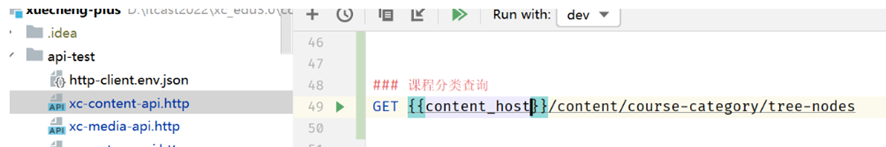

运行测试。

完成前后端连调：

打开前端工程，进入新增课程页面。

课程分类下拉框可以正常显示

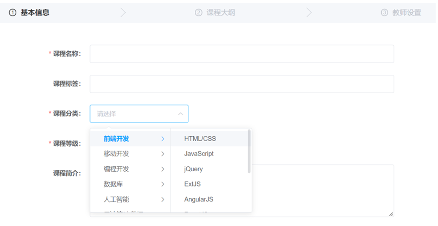

## **5 新增课程**

### **5.1 需求分析**

#### **5.1.1 业务流程**

根据前边对内容管理模块的数据模型分析，课程相关的信息有：课程基本信息、课程营销信息、课程图片信息、课程计划、课程师资信息，所以新增一门课程需要完成这几部分信息的填写。

以下是业务流程：

1、进入课程查询列表


2、点击添加课程，选择课程形式为录播。

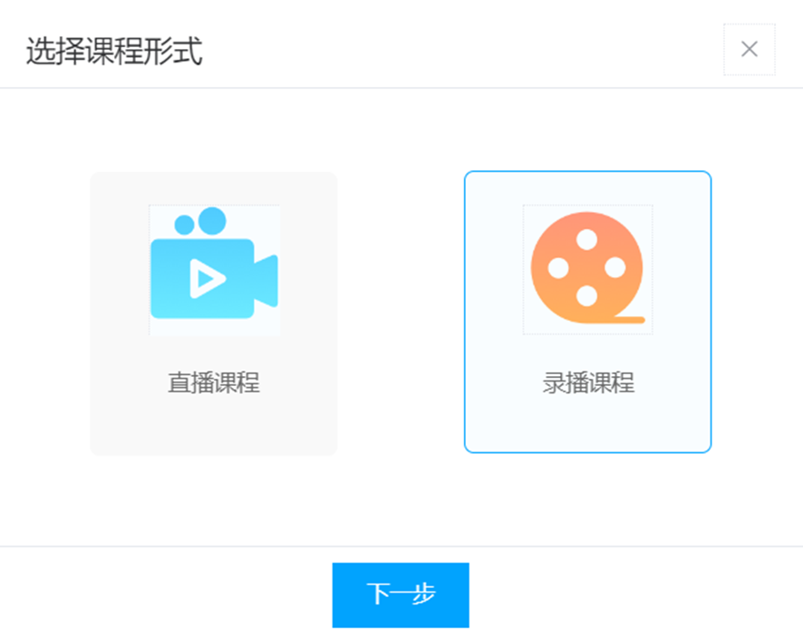

3、选择完毕，点击下一步，进入课程基本信息添加界面。

本界面分两部分信息，一部分是课程基本信息上，一部分是课程营销信息。

课程基本信息：

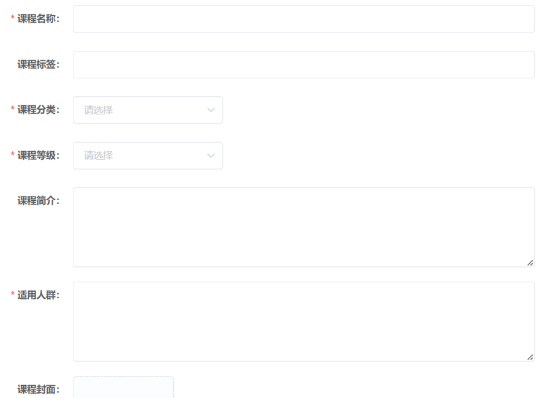

课程营销信息：

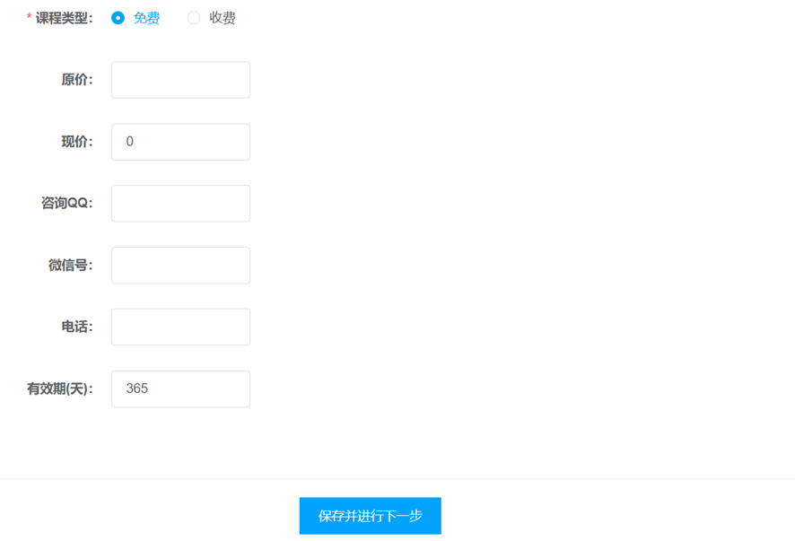

在这个界面中填写课程的基本信息、课程营销信息上。

填写完毕，保存并进行下一步。

4、在此界面填写课程计划信息

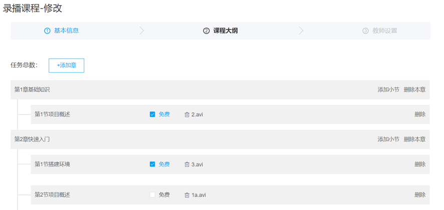课程计划即课程的大纲目录。

课程计划分为两级，章节和小节。

每个小节需要上传课程视频，用户点击 小节的标题即开始播放视频。

如果是直播课程则会进入直播间。

5、课程 计划填写完毕进入课程师资的管理。

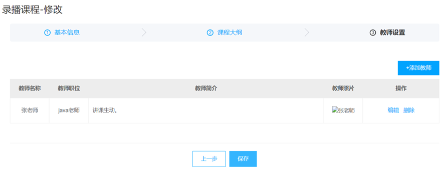

在课程师资界面维护该课程的授课老师。

至此，一门课程新增完成。

#### **4.1.2 数据模型**

通过业务流程可知，一门课程信息涉及：课程基本信息、课程营销信息、课程计划信息、课程师资信息。

本节开发新增课程按钮功能， 只向课程基本信息、课程营销信息添加记录。

这两部分信息分别在 course_base、course_market 两张表存储。当点击保存按钮时向这两张表插入数据。这两张表是一对一关联关系。

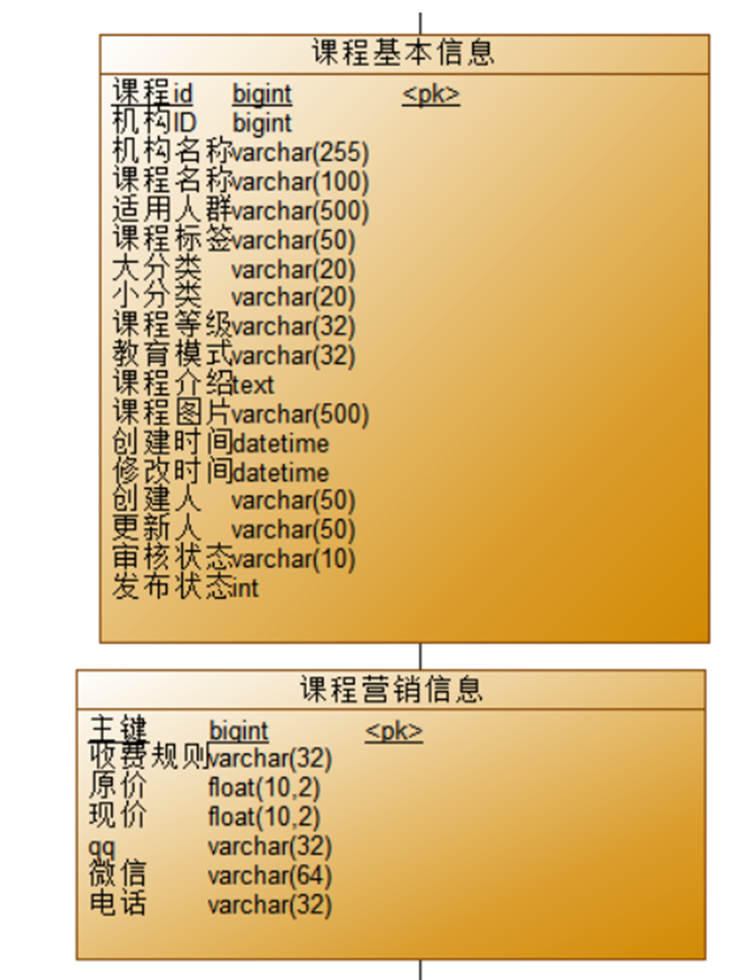新建课程的初始审核状态为“未提交”、初始发布状态为“未发布”。

生成课程基本信息、课程营销信息的 PO、Mapper 文件

### **5.2 接口定义**

根据业务流程，这里先定义提交课程基本信息的接口。

1、接口协议 ：HTTP POST，Content-Type 为 application/json

2、请求及响应结果如下

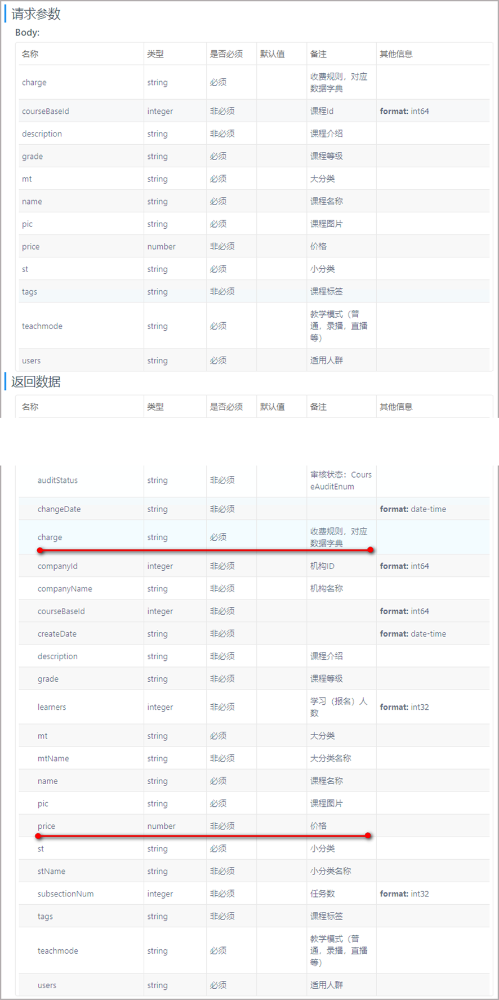

3、接口请求示例如下

```json
#### 创建课程
POST {{content_host}}/content/course
Content-Type: application/json

{

  "mt": "",
  "st": "",
  "name": "",
  "pic": "",
  "teachmode": "200002",
  "users": "初级人员",
  "tags": "",
  "grade": "204001",
  "description": "",
  "charge": "201000",
  "price": 0,
  "originalPrice":0,
  "qq": "",
  "wechat": "",
  "phone": "",
  "validDays": 365
}

####响应结果如下
##成功响应结果如下
{
  "id": 109,
  "companyId": 1,
  "companyName": null,
  "name": "测试课程103",
  "users": "初级人员",
  "tags": "",
  "mt": "1-1",
  "mtName": null,
  "st": "1-1-1",
  "stName": null,
  "grade": "204001",
  "teachmode": "200002",
  "description": "",
  "pic": "",
  "createDate": "2022-09-08 07:35:16",
  "changeDate": null,
  "createPeople": null,
  "changePeople": null,
  "auditStatus": "202002",
  "status": 1,
  "coursePubId": null,
  "coursePubDate": null,
  "charge": "201000",
  "price": null,
  "originalPrice":0,
  "qq": "",
  "wechat": "",
  "phone": "",
  "validDays": 365
}

```

3、定义请求参数类型和响应结构类型

根据接口定义内容，请求参数相比 CourseBase 模型类不一致，需要在 dto 包下自定义，模型类从课程资料/工程目录获取。

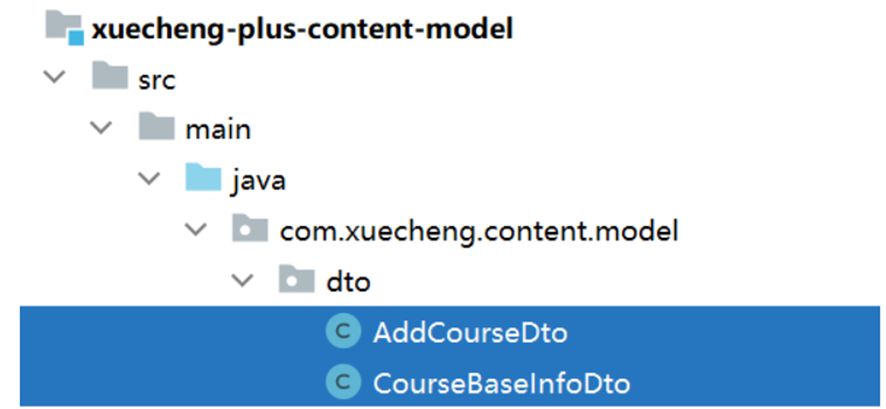

4、定义接口如下

```java
@ApiOperation("新增课程基础信息")
@PostMapping("/course")
public CourseBaseInfoDto createCourseBase(@RequestBody AddCourseDto addCourseDto){
    return null;
}

```

### **5.3 接口开发**

#### **5.3.1 保存课程基本信息**

根据需求分析，新增课程表单中包括了课程基本信息、课程营销信息，需要分别向课程基本信息表、课程营销表保证数据。

首先定义 service 接口，

```java
 /**
  * @description 添加课程基本信息
  * @param companyId  教学机构id
  * @param addCourseDto  课程基本信息
  * @return com.xuecheng.content.model.dto.CourseBaseInfoDto
  * @author Mr.M
  * @date 2022/9/7 17:51
 */
CourseBaseInfoDto createCourseBase(Long companyId,AddCourseDto addCourseDto);

```

编写 service 接口实现类，实现向课程基本信息表保存数据：

```java
@Transactional
@Override
public CourseBaseInfoDto createCourseBase(Long companyId,AddCourseDto dto) {

 //合法性校验
 if (StringUtils.isBlank(dto.getName())) {
  throw new RuntimeException("课程名称为空");
 }

 if (StringUtils.isBlank(dto.getMt())) {
  throw new RuntimeException("课程分类为空");
 }

 if (StringUtils.isBlank(dto.getSt())) {
  throw new RuntimeException("课程分类为空");
 }

 if (StringUtils.isBlank(dto.getGrade())) {
  throw new RuntimeException("课程等级为空");
 }

 if (StringUtils.isBlank(dto.getTeachmode())) {
  throw new RuntimeException("教育模式为空");
 }

 if (StringUtils.isBlank(dto.getUsers())) {
  throw new RuntimeException("适应人群为空");
 }

 if (StringUtils.isBlank(dto.getCharge())) {
  throw new RuntimeException("收费规则为空");
 }
   //新增对象
  CourseBase courseBaseNew = new CourseBase();
  //将填写的课程信息赋值给新增对象
  BeanUtils.copyProperties(dto,courseBaseNew);
  //设置审核状态
  courseBaseNew.setAuditStatus("202002");
  //设置发布状态
  courseBaseNew.setStatus("203001");
  //机构id
  courseBaseNew.setCompanyId(companyId);
  //添加时间
  courseBaseNew.setCreateDate(LocalDateTime.now());
 //插入课程基本信息表
  int insert = courseBaseMapper.insert(courseBaseNew);
  if(insert<=0){
    throw new RuntimeException("新增课程基本信息失败");
}
//todo:向课程营销表保存课程营销信息
//todo:查询课程基本信息及营销信息并返回

}


```

#### **5.3.2 保存营销信息**

下边实现向课程营销表保存课程营销信息

```java
public CourseBaseInfoDto createCourseBase(Long companyId, AddCourseDto dto) {

    //合法性校验
    if (StringUtils.isBlank(dto.getName())) {
        throw new RuntimeException("课程名称为空");
    }

    if (StringUtils.isBlank(dto.getMt())) {
        throw new RuntimeException("课程分类为空");
    }

    if (StringUtils.isBlank(dto.getSt())) {
        throw new RuntimeException("课程分类为空");
    }

    if (StringUtils.isBlank(dto.getGrade())) {
        throw new RuntimeException("课程等级为空");
    }

    if (StringUtils.isBlank(dto.getTeachmode())) {
        throw new RuntimeException("教育模式为空");
    }

    if (StringUtils.isBlank(dto.getUsers())) {
        throw new RuntimeException("适应人群为空");
    }

    if (StringUtils.isBlank(dto.getCharge())) {
        throw new RuntimeException("收费规则为空");
    }
    //新增对象
    CourseBase courseBaseNew = new CourseBase();
    //将填写的课程信息赋值给新增对象
    BeanUtils.copyProperties(dto,courseBaseNew);
    //设置审核状态
    courseBaseNew.setAuditStatus("202002");
    //设置发布状态
    courseBaseNew.setStatus("203001");
    //机构id
    courseBaseNew.setCompanyId(companyId);
    //添加时间
    courseBaseNew.setCreateDate(LocalDateTime.now());
    //插入课程基本信息表
    int insert = courseBaseMapper.insert(courseBaseNew);
    if(insert<=0){
        throw new RuntimeException("新增课程基本信息失败");
    }
    //向课程营销表保存课程营销信息
    //课程营销信息
    CourseMarket courseMarketNew = new CourseMarket();
    Long courseId = courseBaseNew.getId();
    BeanUtils.copyProperties(dto,courseMarketNew);
    courseMarketNew.setId(courseId);
    int i = saveCourseMarket(courseMarketNew);
    if(i<=0){
        throw new RuntimeException("保存课程营销信息失败");
    }
    //查询课程基本信息及营销信息并返回
    return getCourseBaseInfo(courseId);

}
//保存课程营销信息
private int saveCourseMarket(CourseMarket courseMarketNew){
    //收费规则
    String charge = courseMarketNew.getCharge();
    if(StringUtils.isBlank(charge)){
        throw new RuntimeException("收费规则没有选择");
    }
    //收费规则为收费
    if(charge.equals("201001")){
        if(courseMarketNew.getPrice() == null || courseMarketNew.getPrice().floatValue()<=0){
            throw new RuntimeException("课程为收费价格不能为空且必须大于0");
        }
    }
    //根据id从课程营销表查询
    CourseMarket courseMarketObj = courseMarketMapper.selectById(courseMarketNew.getId());
    if(courseMarketObj == null){
        return courseMarketMapper.insert(courseMarketNew);
    }else{
        BeanUtils.copyProperties(courseMarketNew,courseMarketObj);
        courseMarketObj.setId(courseMarketNew.getId());
        return courseMarketMapper.updateById(courseMarketObj);
    }
}
//根据课程id查询课程基本信息，包括基本信息和营销信息
 public CourseBaseInfoDto getCourseBaseInfo(long courseId){

  CourseBase courseBase = courseBaseMapper.selectById(courseId);
  if(courseBase == null){
   return null;
  }
  CourseMarket courseMarket = courseMarketMapper.selectById(courseId);
  CourseBaseInfoDto courseBaseInfoDto = new CourseBaseInfoDto();
  BeanUtils.copyProperties(courseBase,courseBaseInfoDto);
  if(courseMarket != null){
   BeanUtils.copyProperties(courseMarket,courseBaseInfoDto);
  }

  //查询分类名称
  CourseCategory courseCategoryBySt = courseCategoryMapper.selectById(courseBase.getSt());
  courseBaseInfoDto.setStName(courseCategoryBySt.getName());
  CourseCategory courseCategoryByMt = courseCategoryMapper.selectById(courseBase.getMt());
  courseBaseInfoDto.setMtName(courseCategoryByMt.getName());

  return courseBaseInfoDto;

 }

```

### **5.4 接口测试**

1、首先去完善 controller 方法：

```java
@ApiOperation("新增课程基础信息")
@PostMapping("/course")
public CourseBaseInfoDto createCourseBase(@RequestBody AddCourseDto addCourseDto){
    //机构id，由于认证系统没有上线暂时硬编码
    Long companyId = 1232141425L;
  return courseBaseInfoService.createCourseBase(companyId,addCourseDto);
}

```

2、使用 httpclient 测试

在 xc-content-api.http 中定义：

```json
#### 创建课程
POST {{content_host}}/content/course
Content-Type: application/json

{
  "charge": "201000",
  "price": 0,
  "originalPrice":0,
  "qq": "22333",
  "wechat": "223344",
  "phone": "13333333",
  "validDays": 365,
  "mt": "1-1",
  "st": "1-1-1",
  "name": "测试课程103",
  "pic": "",
  "teachmode": "200002",
  "users": "初级人员",
  "tags": "",
  "grade": "204001",
  "description": ""
}

```

3、前后端联调

打开新增课程页面，除了课程图片其它信息全部输入。

点击保存，观察浏览器请求接口参数及响应结果是否正常。

### **5.6 异常处理**

#### **5.6.1 异常问题分析**

在 service 方法中有很多的参数合法性校验，当参数不合法则抛出异常，下边我们测试下异常处理。

请求创建课程基本信息，故意将必填项设置为空。

测试发现报 500 异常，如下：

```java
http://localhost:63040/content/course

HTTP/1.1 500
Content-Type: application/json
Transfer-Encoding: chunked
Date: Wed, 07 Sep 2022 11:40:29 GMT
Connection: close

{
  "timestamp": "2022-09-07T11:40:29.677+00:00",
  "status": 500,
  "error": "Internal Server Error",
  "message": "",
  "path": "/content/course"
}

```

问题：并没有输出我们抛出异常时指定的异常信息。

所以，现在我们的需求是当正常操作时按接口要求返回数据，当非正常流程时要获取异常信息进行记录，并提示给用户。

异常处理除了输出在日志中，还需要提示给用户，前端和后端需要作一些约定：

1、错误提示信息统一以 json 格式返回给前端。

2、以 HTTP 状态码决定当前是否出错，非 200 为操作异常。

如何规范异常信息？

代码中统一抛出项目的自定义异常类型，这样可以统一去捕获这一类或几类的异常。

规范了异常类型就可以去获取异常信息。

如果捕获了非项目自定义的异常类型统一向用户提示“执行过程异常，请重试”的错误信息。

如何捕获异常？

代码统一用 try/catch 方式去捕获代码比较臃肿，可以通过 SpringMVC 提供的控制器增强类统一由一个类去完成异常的捕获。

如下图：

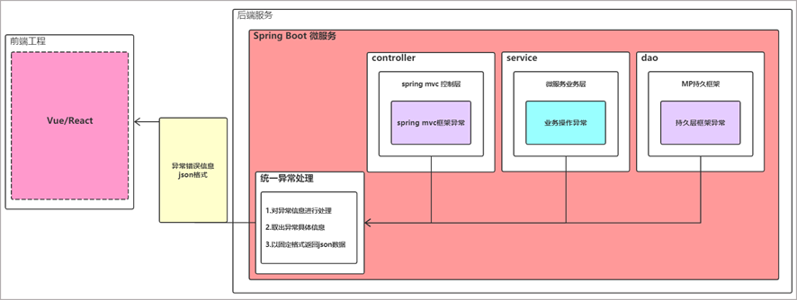

#### **5.6.2 统一异常处理实现**

根据上边分析的方案，统一在 base 基础工程实现统一异常处理，各模块依赖了 base 基础工程都 可以使用。

首先在 base 基础工程添加需要依赖的包：

```xml
<dependency>
    <groupId>org.springframework</groupId>
    <artifactId>spring-web</artifactId>
</dependency>

<dependency>
    <groupId>org.springframework.boot</groupId>
    <artifactId>spring-boot-starter-log4j2</artifactId>
</dependency>

```

1、定义一些通用的异常信息

从课程资料/工程目录 拷贝 CommonError 类到 base 工程 com.xuecheng.base.execption 下。

```java
package com.xuecheng.base.execption;


/**
 * @description 通用错误信息
 * @author Mr.M
 * @date 2022/9/6 11:29
 * @version 1.0
 */
public enum CommonError {

   UNKOWN_ERROR("执行过程异常，请重试。"),
   PARAMS_ERROR("非法参数"),
   OBJECT_NULL("对象为空"),
   QUERY_NULL("查询结果为空"),
   REQUEST_NULL("请求参数为空");

   private String errMessage;

   public String getErrMessage() {
      return errMessage;
   }

   private CommonError( String errMessage) {
      this.errMessage = errMessage;
   }

}

```

2、自定义异常类型

在 base 工程 com.xuecheng.base.execption 下自定义异常类。

```java
package com.xuecheng.base.execption;


/**
 * @description 学成在线项目异常类
 * @author Mr.M
 * @date 2022/9/6 11:29
 * @version 1.0
 */
public class XueChengPlusException extends RuntimeException {

   private String errMessage;

   public XueChengPlusException() {
      super();
   }

   public XueChengPlusException(String errMessage) {
      super(errMessage);
      this.errMessage = errMessage;
   }

   public String getErrMessage() {
      return errMessage;
   }

   public static void cast(CommonError commonError){
       throw new XueChengPlusException(commonError.getErrMessage());
   }
   public static void cast(String errMessage){
       throw new XueChengPlusException(errMessage);
   }

}

```

3、响应用户的统一类型

```java
package com.xuecheng.base.execption;

import java.io.Serializable;

/**
 * 错误响应参数包装
 */
public class RestErrorResponse implements Serializable {

    private String errMessage;

    public RestErrorResponse(String errMessage){
        this.errMessage= errMessage;
    }

    public String getErrMessage() {
        return errMessage;
    }

    public void setErrMessage(String errMessage) {
        this.errMessage = errMessage;
    }
}

```

4、全局异常处理器

从 Spring 3.0 - Spring 3.2 版本之间，对 Spring 架构和 SpringMVC 的 Controller 的异常捕获提供了相应的异常处理。

- @ExceptionHandler

&nbsp;

- Spring3.0 提供的标识在方法上或类上的注解，用来表明方法的处理异常类型。

&nbsp;

- @ControllerAdvice

&nbsp;

- Spring3.2 提供的新注解，从名字上可以看出大体意思是控制器增强， 在项目中来增强 SpringMVC 中的 Controller。通常和**@ExceptionHandler** 结合使用，来处理 SpringMVC 的异常信息。

&nbsp;

- @ResponseStatus

&nbsp;

- Spring3.0 提供的标识在方法上或类上的注解，用状态代码和应返回的原因标记方法或异常类。  
  调用处理程序方法时，状态代码将应用于 HTTP 响应。

通过上面的两个注解便可实现微服务端全局异常处理，具体代码如下：

```java
/**
 * @author ZyKun
 * @ClassName GlobalExceptionHandler
 * @description: 全局异常处理器
 * @date 2023/5/19 14:23
 */
@Slf4j
//@RestControllerAdviceX

@ControllerAdvice
//@ControllerAdvice 是为那些声明了（@ExceptionHandler、@InitBinder 或 @ModelAttribute注解修饰的）方法的类而提供的专业化的@Component , 以供多个 Controller类所共享。
//说白了，就是aop思想的一种实现，你告诉我需要拦截规则，我帮你把他们拦下来，具体你想做更细致的拦截筛选和拦截之后的处理，你自己通过@ExceptionHandler、@InitBinder 或 @ModelAttribute这三个注解以及被其注解的方法来自定义。
public class GlobalExceptionHandler {

    /**
     * 自定义异常处理
     *
     * @param e
     * @return
     *
     */
    @ResponseBody // 返回JSON格式
    @ExceptionHandler(XueChengPlusException.class) //Spring3.0提供的标识在方法上或类上的注解，用来表明方法的处理异常类型。
    @ResponseStatus(HttpStatus.INTERNAL_SERVER_ERROR)// 返回状态码
    public RestErrorResponse customException(XueChengPlusException e) {

        // 记录异常
        log.error("系统异常{}", e.getErrMessage(), e);

        // 解析出异常信息
        String errMessage = e.getErrMessage();
        RestErrorResponse restErrorResponse = new RestErrorResponse(errMessage);
        return restErrorResponse;
    }

    /**
     * 针对自定义异常以外的其他异常
     *
     * @param e
     * @return
     */
    @ResponseBody // 返回JSON格式
    @ExceptionHandler(Exception.class) //Spring3.0提供的标识在方法上或类上的注解，用来表明方法的处理异常类型。
    @ResponseStatus(HttpStatus.INTERNAL_SERVER_ERROR)// 返回状态码
    public RestErrorResponse exception(Exception e) {

        // 记录异常
        log.error("系统异常{}", e.getMessage(), e);

        // 解析出异常信息
        RestErrorResponse restErrorResponse = new RestErrorResponse(CommonError.UNKOWN_ERROR.getErrMessage());
        return restErrorResponse;
    }


}


```

#### **5.6.3 异常处理测试**

在内容管理的 api 工程添加 base 工程的依赖

```xml
    <dependency>
        <groupId>com.xuecheng</groupId>
        <artifactId>xuecheng-plus-base</artifactId>
        <version>0.0.1-SNAPSHOT</version>
    </dependency>

```

在异常处理测试之前首先在代码中抛出自定义类型的异常，这里以新增课程的 service 方法为例进行代码修改。

```java
 @Override
 public CourseBaseInfoDto createCourseBase(Long companyId,AddCourseDto dto) {
 ...
//合法性校验
  if (StringUtils.isBlank(dto.getName())) {
   throw new XueChengPlusException("课程名称为空");
  }

  if (StringUtils.isBlank(dto.getMt())) {
   throw new XueChengPlusException("课程分类为空");
  }

  if (StringUtils.isBlank(dto.getSt())) {
   throw new XueChengPlusException("课程分类为空");
  }

  if (StringUtils.isBlank(dto.getGrade())) {
   throw new XueChengPlusException("课程等级为空");
  }

  if (StringUtils.isBlank(dto.getTeachmode())) {
   throw new XueChengPlusException("教育模式为空");
  }

  if (StringUtils.isBlank(dto.getUsers())) {
   throw new XueChengPlusException("适应人群");
  }

  if (StringUtils.isBlank(dto.getCharge())) {
   throw new XueChengPlusException("收费规则为空");
  }
  。。。
    if ("201001".equals(charge)) {
   BigDecimal price = dto.getPrice();
   if (ObjectUtils.isEmpty(price)) {
    throw new XueChengPlusException("收费课程价格不能为空");
   }
   courseMarketNew.setPrice(dto.getPrice().floatValue());
  }
  ......

```

1、首先使用 httpclient 测试

请求新增课程接口，故意将必填项课程名称设置为空。

测试结果与预期一致，可以捕获异常并响应异常信息，如下：

```java
http://localhost:63040/content/course

HTTP/1.1 500
Content-Type: application/json
Transfer-Encoding: chunked
Date: Wed, 07 Sep 2022 13:17:14 GMT
Connection: close

{
  "errMessage": "课程名称为空。"
}

```

2、前后端调试

仍然测试新增课程接口，当课程收费的时候必须填写价格，这里设置课程为收费，价格设置为空。


通过测试发现，前端正常提示代码 中抛出的异常信息。

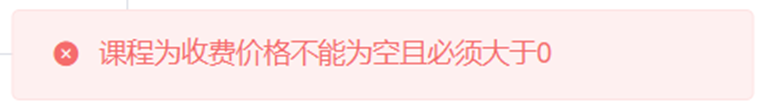

至此，项目异常处理的测试完毕，我们在开发中对于业务分支中错误的情况要抛出项目自定义的异常类型。

### **5.7 JSR303 校验**

#### **5.7.1 统一校验的需求**

前端请求后端接口传输参数，是在 controller 中校验还是在 Service 中校验？

答案是都需要校验，只是分工不同。

Contoller 中校验请求参数的合法性，包括：必填项校验，数据格式校验，比如：是否是符合一定的日期格式，等。

Service 中要校验的是业务规则相关的内容，比如：课程已经审核通过所以提交失败。

Service 中根据业务规则去校验不方便写成通用代码，Controller 中则可以将校验的代码写成通用代码。

早在 JavaEE6 规范中就定义了参数校验的规范，它就是 JSR-303，它定义了 Bean Validation，即对 bean 属性进行校验。

SpringBoot 提供了 JSR-303 的支持，它就是`spring-boot-starter-validation`，它的底层使用 Hibernate Validator，Hibernate Validator 是 Bean Validation 的参考实现。

所以，我们准备在 Controller 层使用 spring-boot-starter-validation 完成对请求参数的基本合法性进行校验。

#### **5.7.2 统一校验实现**

首先在 Base 工程添加 spring-boot-starter-validation 的依赖

```java
<dependency>
    <groupId>org.springframework.boot</groupId>
    <artifactId>spring-boot-starter-validation</artifactId>
</dependency>

```

在 javax.validation.constraints 包下有很多这样的校验注解，直接使用注解定义校验规则即可。

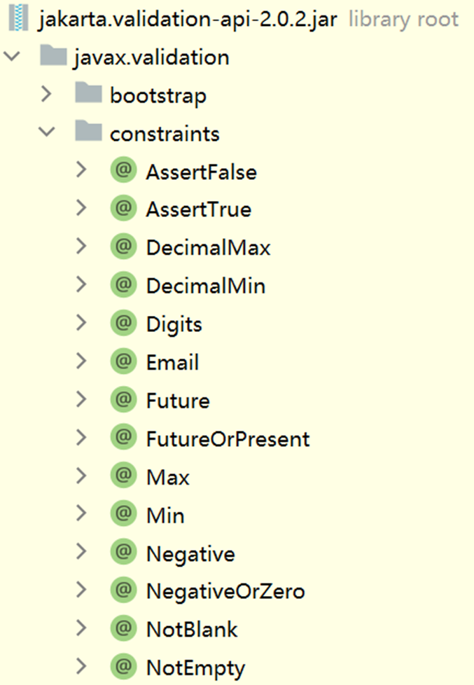

规则如下：

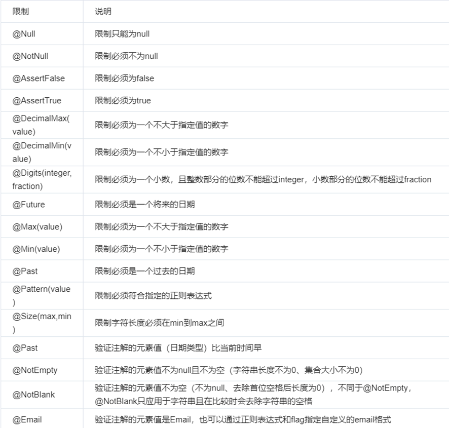

现在准备对内容管理模块添加课程接口进行参数校验，如下接口

```java
@ApiOperation("新增课程基础信息")
@PostMapping("/course")
public CourseBaseInfoDto createCourseBase(@RequestBody AddCourseDto addCourseDto){
    //机构id，由于认证系统没有上线暂时硬编码
    Long companyId = 1232141425L;
  return courseBaseInfoService.createCourseBase(companyId,addCourseDto);
}

```

此接口使用 AddCourseDto 模型对象接收参数，所以进入 AddCourseDto 类，在属性上添加校验规则。

```java
package com.xuecheng.content.model.dto;

import io.swagger.annotations.ApiModel;
import io.swagger.annotations.ApiModelProperty;
import lombok.Data;

import javax.validation.constraints.NotEmpty;
import javax.validation.constraints.Size;
import java.math.BigDecimal;

/**
 * @description 添加课程dto
 * @author Mr.M
 * @date 2022/9/7 17:40
 * @version 1.0
 */
@Data
@ApiModel(value="AddCourseDto", description="新增课程基本信息")
public class AddCourseDto {

 @NotEmpty(message = "课程名称不能为空")
 @ApiModelProperty(value = "课程名称", required = true)
 private String name;

 @NotEmpty(message = "适用人群不能为空")
 @Size(message = "适用人群内容过少",min = 10)
 @ApiModelProperty(value = "适用人群", required = true)
 private String users;

 @ApiModelProperty(value = "课程标签")
 private String tags;

 @NotEmpty(message = "课程分类不能为空")
 @ApiModelProperty(value = "大分类", required = true)
 private String mt;

 @NotEmpty(message = "课程分类不能为空")
 @ApiModelProperty(value = "小分类", required = true)
 private String st;

 @NotEmpty(message = "课程等级不能为空")
 @ApiModelProperty(value = "课程等级", required = true)
 private String grade;

 @ApiModelProperty(value = "教学模式（普通，录播，直播等）", required = true)
 private String teachmode;

 @ApiModelProperty(value = "课程介绍")
 private String description;

 @ApiModelProperty(value = "课程图片", required = true)
 private String pic;

 @NotEmpty(message = "收费规则不能为空")
 @ApiModelProperty(value = "收费规则，对应数据字典", required = true)
 private String charge;

 @ApiModelProperty(value = "价格")
 private BigDecimal price;

}

```

上边用到了@NotEmpty 和@Size 两个注解，@NotEmpty 表示属性不能为空，@Size 表示限制属性内容的长短。

定义好校验规则还需要开启校验，在 controller 方法中添加@Validated 注解，如下：

```java
@ApiOperation("新增课程基础信息")
@PostMapping("/course")
public CourseBaseInfoDto createCourseBase(@RequestBody @Validated AddCourseDto addCourseDto){
    //机构id，由于认证系统没有上线暂时硬编码
    Long companyId = 1L;
  return courseBaseInfoService.createCourseBase(companyId,addCourseDto);
}

```

如果校验出错 Spring 会抛出 MethodArgumentNotValidException 异常，我们需要在统一异常处理器中捕获异常，解析出异常信息。

代码 如下：

```java
@ResponseBody
@ExceptionHandler(MethodArgumentNotValidException.class)
@ResponseStatus(HttpStatus.INTERNAL_SERVER_ERROR)
public RestErrorResponse methodArgumentNotValidException(MethodArgumentNotValidException e) {
    BindingResult bindingResult = e.getBindingResult();
    List<String> msgList = new ArrayList<>();
    //将错误信息放在msgList
    bindingResult.getFieldErrors().stream().forEach(item->msgList.add(item.getDefaultMessage()));
    //拼接错误信息
    String msg = StringUtils.join(msgList, ",");
    log.error("【系统异常】{}",msg);
    return new RestErrorResponse(msg);
}

```

重启内容管理服务。

使用 httpclient 进行测试，将必填项设置为空，“适用人群” 属性的内容设置 1 个字。

执行测试，接口响应结果如下：

```json
{
  "errMessage": "课程名称不能为空 课程分类不能为空 课程分类不能为空 适用人群内容过少 "
}
```

可以看到校验器生效。

#### **5.7.3 分组校验**

有时候在同一个属性上设置一个校验规则不能满足要求，比如：订单编号由系统生成，在添加订单时要求订单编号为空，在更新 订单时要求订单编写不能为空。此时就用到了分组校验，同一个属性定义多个校验规则属于不同的分组，比如：添加订单定义@NULL 规则属于 insert 分组，更新订单定义@NotEmpty 规则属于 update 分组，insert 和 update 是分组的名称，是可以修改的。

下边举例说明

我们用 class 类型来表示不同的分组，所以我们定义不同的接口类型（空接口）表示不同的分组，由于校验分组是公用的，所以定义在 base 工程中。如下：

```java
package com.xuecheng.base.execption;
 /**
 * @description 校验分组
 * @author Mr.M
 * @date 2022/9/8 15:05
 * @version 1.0
 */
public class ValidationGroups {

 public interface Insert{};
 public interface Update{};
 public interface Delete{};

}

```

下边在定义校验规则时指定分组：

```java
@NotEmpty(groups = {ValidationGroups.Inster.class},message = "添加课程名称不能为空")
 @NotEmpty(groups = {ValidationGroups.Update.class},message = "修改课程名称不能为空")
// @NotEmpty(message = "课程名称不能为空")
 @ApiModelProperty(value = "课程名称", required = true)
 private String name;

```

在 Controller 方法中启动校验规则指定要使用的分组名：

```java
@ApiOperation("新增课程基础信息")
@PostMapping("/course")
public CourseBaseInfoDto createCourseBase(@RequestBody @Validated({ValidationGroups.Inster.class}) AddCourseDto addCourseDto){
    //机构id，由于认证系统没有上线暂时硬编码
    Long companyId = 1L;
  return courseBaseInfoService.createCourseBase(companyId,addCourseDto);
}

```

再次测试，由于这里指定了 Insert 分组，所以抛出 异常信息：添加课程名称不能为空。

如果修改分组为 ValidationGroups.Update.class，异常信息为：修改课程名称不能为空。

#### **5.7.4 校验规则不满足？**

如果 javax.validation.constraints 包下的校验规则满足不了需求怎么办？

1、手写校验代码 。

2、自定义校验规则注解。

如何自定义校验规则注解，请自行查阅资料实现。

## **6 修改课程**

### **6.1 需求分析**

#### **6.1.1 业务流程**

1、进入课程列表查询

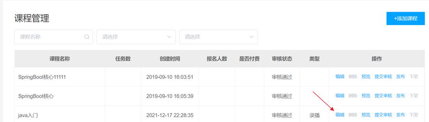

2、点击编辑

因为课程审核通过方可发布，任何时候都 可以编辑，下图是编辑课程的界面：

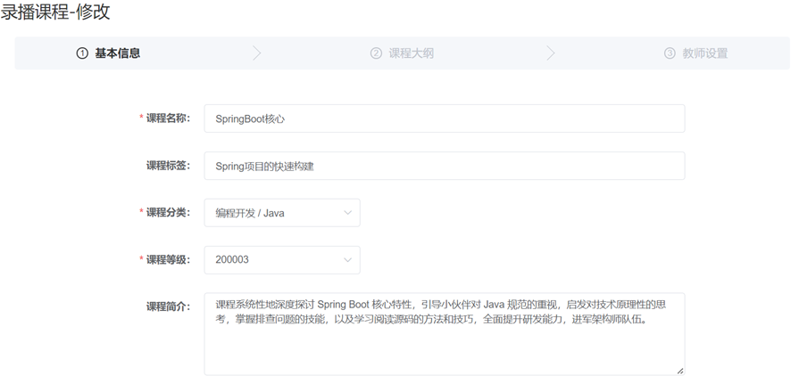

进入编辑界面显示出当前课程的信息。

3、修改成功自动进入课程计划编辑页面。

#### **6.1.2 数据模型**

修改课程的涉及到的数据表是课程基本信息表

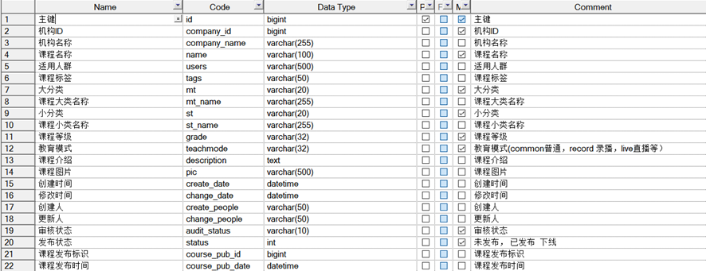

课程营销信息表：

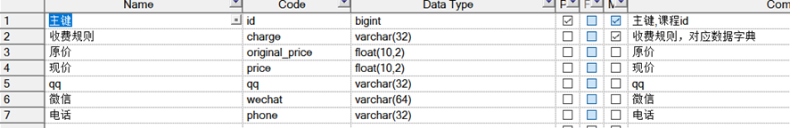

1、进入课程编辑界面

界面中显示了课程的当前信息，需要根据课程 id 查询课程基本和课程营销信息，显示在表单上。

2、编辑、提交

修改课程提交的数据比新增课程多了一项课程 id，因为修改课程需要针对某个课程进行修改。

3、保存数据

编辑完成保存课程基础信息和课程营销信息。

更新课程基本信息表中的修改人、修改时间。

### **6.2 接口定义**

#### **6.2.1 查询课程信息**

定义根据课程 id 查询课程信息接口。

接口示例如下：

```json
GET /content/course/40
Content-Type: application/json
##响应结果
##{
##  "id": 40,
##  "companyId": 1232141425,
##  "companyName": null,
##  "name": "SpringBoot核心",
##  "users": "Spring Boot初学者",
##  "tags": "Spring项目的快速构建",
##  "mt": "1-3",
##  "mtName": null,
##  "st": "1-3-2",
##  "stName": null,
##  "grade": "200003",
##  "teachmode": "201001",
##  "description": "课程系统性地深度探讨 Spring Boot 核心特性，引导小伙伴对 Java 规范的重视，启发对技术原理性的思考，掌握排查问题的技能，以及学习阅读源码的方法和技巧，全面提升研发能力，进军架构师队伍。",
##  "pic": "https://cdn.educba.com/academy/wp-content/uploads/2018/08/Spring-BOOT-Interview-questions.jpg",
##  "createDate": "2019-09-10 16:05:39",
##  "changeDate": "2022-09-09 07:27:48",
##  "createPeople": null,
##  "changePeople": null,
##  "auditStatus": "202004",
##  "status": "203001",
##  "coursePubId": 21,
##  "coursePubDate": null,
##  "charge": "201001",
##  "price": 0.01
##}

```

查询结果为单条课程信息，内容和新增课程返回结果一致，所以采用与新增课程一致的模型类。

接口定义如下：

```java
@ApiOperation("根据课程id查询课程基础信息")
@GetMapping("/course/{courseId}")
public CourseBaseInfoDto getCourseBaseById(@PathVariable Long courseId){
    return null;
}

```

#### **6.2.2 修改课程信息**

根据前边的数据模型分析，修改课程提交的数据比新增多了课程 id，接口示例如下：

```json
#### 修改课程
PUT /content/course
Content-Type: application/json

{
  "id": 40,
  "companyName": null,
  "name": "SpringBoot核心",
  "users": "Spring Boot初学者",
  "tags": "Spring项目的快速构建",
  "mt": "1-3",
  "st": "1-3-2",
  "grade": "200003",
  "teachmode": "201001",
  "description": "课程系统性地深度探讨 Spring Boot 核心特性，引导小伙伴对 Java 规范的重视，启发对技术原理性的思考，掌握排查问题的技能，以及学习阅读源码的方法和技巧，全面提升研发能力，进军架构师队伍。",
  "pic": "https://cdn.educba.com/academy/wp-content/uploads/2018/08/Spring-BOOT-Interview-questions.jpg",
  "charge": "201001",
  "price": 0.01
}

####修改成功响应结果如下
##{
##  "id": 40,
##  "companyId": 1232141425,
##  "companyName": null,
##  "name": "SpringBoot核心",
##  "users": "Spring Boot初学者",
##  "tags": "Spring项目的快速构建",
##  "mt": "1-3",
##  "mtName": null,
##  "st": "1-3-2",
##  "stName": null,
##  "grade": "200003",
##  "teachmode": "201001",
##  "description": "课程系统性地深度探讨 Spring Boot 核心特性，引导小伙伴对 Java 规范的重视，启发对技术原理性的思考，掌握排查问题的技能，以及学习阅读源码的方法和技巧，全面提升研发能力，进军架构师队伍。",
##  "pic": "https://cdn.educba.com/academy/wp-content/uploads/2018/08/Spring-BOOT-Interview-questions.jpg",
##  "createDate": "2019-09-10 16:05:39",
##  "changeDate": "2022-09-09 07:27:48",
##  "createPeople": null,
##  "changePeople": null,
##  "auditStatus": "202004",
##  "status": "203001",
##  "coursePubId": 21,
##  "coursePubDate": null,
##  "charge": "201001",
##  "price": 0.01
##}

```

这里定义修改课程提交的数据模型。

```java
package com.xuecheng.content.model.dto;

import com.xuecheng.base.execption.ValidationGroups;
import io.swagger.annotations.ApiModel;
import io.swagger.annotations.ApiModelProperty;
import lombok.Data;

import javax.validation.constraints.NotEmpty;
import javax.validation.constraints.NotNull;
import javax.validation.constraints.Size;
import java.math.BigDecimal;

/**
 * @description 添加课程dto
 * @author Mr.M
 * @date 2022/9/7 17:40
 * @version 1.0
 */
@Data
@ApiModel(value="EditCourseDto", description="修改课程基本信息")
public class EditCourseDto extends AddCourseDto {

 @ApiModelProperty(value = "课程id", required = true)
 private Long id;

}

```

修改后返回最新课程信息，采用与新增课程接口返回类型一致的数据模型。

接口定义如下：

```java
@ApiOperation("修改课程基础信息")
@PutMapping("/course")
public CourseBaseInfoDto modifyCourseBase(@RequestBody @Validated EditCourseDto editCourseDto){

}

```

### **6.3 接口开发**

#### **6.3.1 查询课程信息**

查询课程信息的 Service 方法在新增课程接口开发中已实现，无需实现，如下：

```java
//根据课程id查询课程基本信息，包括基本信息和营销信息
public CourseBaseInfoDto getCourseBaseInfo(long courseId){
    //查询课程信息
    CourseBase courseBase = courseBaseMapper.selectById(courseId);
    if(courseBase == null){
        return null;
    }
    //查询营销信息
    CourseMarket courseMarket = courseMarketMapper.selectById(courseId);
    //要返回的对象
    CourseBaseInfoDto courseBaseInfoDto = new CourseBaseInfoDto();
    BeanUtils.copyProperties(courseBase,courseBaseInfoDto);
    if(courseMarket != null){
        BeanUtils.copyProperties(courseMarket,courseBaseInfoDto);
    }
    //查询分类名称
    CourseCategory courseCategoryBySt = courseCategoryMapper.selectById(courseBase.getSt());
    courseBaseInfoDto.setStName(courseCategoryBySt.getName());
    CourseCategory courseCategoryByMt = courseCategoryMapper.selectById(courseBase.getMt());
    courseBaseInfoDto.setMtName(courseCategoryByMt.getName());

    return courseBaseInfoDto;
}

```

需要将查询课程信息的方法提到接口上，这样在 controller 中通过接口调用此方法。

```java
public interface CourseBaseInfoService {
    ....
   /**
     * @description 根据id查询课程基本信息
     * @param courseId  课程id
     * @return com.xuecheng.content.model.dto.CourseBaseInfoDto
     * @author Mr.M
     * @date 2022/10/9 8:13
    */
    public CourseBaseInfoDto getCourseBaseInfo(long courseId);
    ...

```

完善接口层代码 ：

```java
@ApiOperation("根据课程id查询课程基础信息")
@GetMapping("/course/{courseId}")
public CourseBaseInfoDto getCourseBaseById(@PathVariable Long courseId){
    return courseBaseInfoService.getCourseBaseInfo(courseId);
}

```

测试查询课程

用 httpclient 测试查询课程接口：

```java
#### 查询课程信息
GET /content/course/40

```

#### **6.3.2 修改课程信息**

修改 Service 修改课程的接口与方法：

```java
/**
 * @description 修改课程信息
 * @param companyId  机构id
 * @param dto  课程信息
 * @return com.xuecheng.content.model.dto.CourseBaseInfoDto
 * @author Mr.M
 * @date 2022/9/8 21:04
*/
public CourseBaseInfoDto updateCourseBase(Long companyId,EditCourseDto dto);

```

实现方法如下：

```java
@Transactional
@Override
public CourseBaseInfoDto updateCourseBase(Long companyId, EditCourseDto dto) {

    //课程id
    Long courseId = dto.getId();
    CourseBase courseBase = courseBaseMapper.selectById(courseId);
    if(courseBase==null){
        XueChengPlusException.cast("课程不存在");
    }

    //校验本机构只能修改本机构的课程
    if(!courseBase.getCompanyId().equals(companyId)){
        XueChengPlusException.cast("本机构只能修改本机构的课程");
    }

    //封装基本信息的数据
    BeanUtils.copyProperties(dto,courseBase);
    courseBase.setChangeDate(LocalDateTime.now());

    //更新课程基本信息
    int i = courseBaseMapper.updateById(courseBase);

    //封装营销信息的数据
    CourseMarket courseMarket = new CourseMarket();
    BeanUtils.copyProperties(dto,courseMarket);
    saveCourseMarket(courseMarket);
    //查询课程信息
    CourseBaseInfoDto courseBaseInfo = this.getCourseBaseInfo(courseId);
    return courseBaseInfo;

}

```

最后完善接口层代码：

```java
@ApiOperation("修改课程基础信息")
@PutMapping("/course")
public CourseBaseInfoDto modifyCourseBase(@RequestBody @Validated EditCourseDto editCourseDto){
    //机构id，由于认证系统没有上线暂时硬编码
    Long companyId = 1232141425L;
    return courseBaseInfoService.updateCourseBase(companyId,editCourseDto);
}

```

### **5.4 接口测试**

接口开发完成进行测试，使用 httpclient 测试

```json
#### 根据课程id查询课程信息
GET {{content_host}}/content/course/40
Content-Type: application/json
##响应结果
##{
##  "id": 40,
##  "companyId": 1232141425,
##  "companyName": null,
##  "name": "SpringBoot核心",
##  "users": "Spring Boot初学者",
##  "tags": "Spring项目的快速构建",
##  "mt": "1-3",
##  "mtName": null,
##  "st": "1-3-2",
##  "stName": null,
##  "grade": "200003",
##  "teachmode": "201001",
##  "description": "课程系统性地深度探讨 Spring Boot 核心特性，引导小伙伴对 Java 规范的重视，启发对技术原理性的思考，掌握排查问题的技能，以及学习阅读源码的方法和技巧，全面提升研发能力，进军架构师队伍。",
##  "pic": "https://cdn.educba.com/academy/wp-content/uploads/2018/08/Spring-BOOT-Interview-questions.jpg",
##  "createDate": "2019-09-10 16:05:39",
##  "changeDate": "2022-09-09 07:27:48",
##  "createPeople": null,
##  "changePeople": null,
##  "auditStatus": "202004",
##  "status": "203001",
##  "coursePubId": 21,
##  "coursePubDate": null,
##  "charge": "201001",
##  "price": 0.01
##}

#### 修改课程
PUT {{content_host}}/content/course
Content-Type: application/json

{
  "id": 40,
  "name": "SpringBoot核心",
  "users": "Spring Boot初学者",
  "tags": "Spring项目的快速构建",
  "mt": "1-3",
  "st": "1-3-2",
  "grade": "200003",
  "teachmode": "201001",
  "description": "课程系统性地深度探讨 Spring Boot 核心特性，引导小伙伴对 Java 规范的重视，启发对技术原理性的思考，掌握排查问题的技能，以及学习阅读源码的方法和技巧，全面提升研发能力，进军架构师队伍。",
  "pic": "https://cdn.educba.com/academy/wp-content/uploads/2018/08/Spring-BOOT-Interview-questions.jpg",
  "charge": "201001",
  "price": 0.01
}

####修改成功响应结果如下
##{
##  "id": 40,
##  "companyId": 1232141425,
##  "companyName": null,
##  "name": "SpringBoot核心",
##  "users": "Spring Boot初学者",
##  "tags": "Spring项目的快速构建",
##  "mt": "1-3",
##  "mtName": null,
##  "st": "1-3-2",
##  "stName": null,
##  "grade": "200003",
##  "teachmode": "201001",
##  "description": "课程系统性地深度探讨 Spring Boot 核心特性，引导小伙伴对 Java 规范的重视，启发对技术原理性的思考，掌握排查问题的技能，以及学习阅读源码的方法和技巧，全面提升研发能力，进军架构师队伍。",
##  "pic": "https://cdn.educba.com/academy/wp-content/uploads/2018/08/Spring-BOOT-Interview-questions.jpg",
##  "createDate": "2019-09-10 16:05:39",
##  "changeDate": "2022-09-09 07:27:48",
##  "createPeople": null,
##  "changePeople": null,
##  "auditStatus": "202004",
##  "status": "203001",
##  "coursePubId": 21,
##  "coursePubDate": null,
##  "charge": "201001",
##  "price": 0.01
##}

```

前端开发完毕进行前后端接口联调。

过程略。

## **7 查询课程计划**

### **7.1 需求分析**

#### **7.1.1 业务流程**

课程基本信息添加或修改成功将自动进入课程计划编辑器界面，如下图：

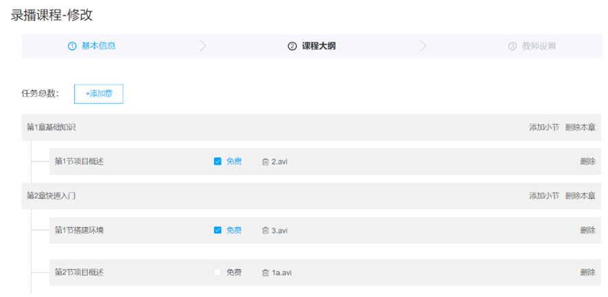课程计划即课程的大纲目录。

课程计划分为两级：大章节和不小章节。

本小节完成课程计划信息的查询。

#### **7.1.2 数据模型**

从课程计划查询界面上可以看出整体上是 一个树型结构，课程计划表 teachplan 如下：

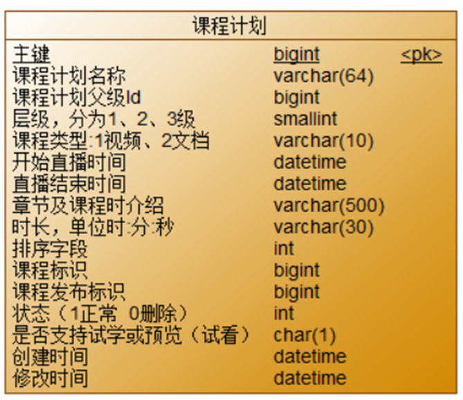

每个课程计划都有所属课程。

每个课程的课程计划有两个级别，第一级为大章节，grade 为 1、第二级为小章节，grade 为 2

3。第二级的 parentid 为第一级的 id。

课程计划的显示顺序根据排序字段去显示。

根据业务流程中的界面原型，课程计划列表展示时还有课程计划关联的视频信息。

课程计划关联的视频信息在 teachplan_media 表，结构如下：

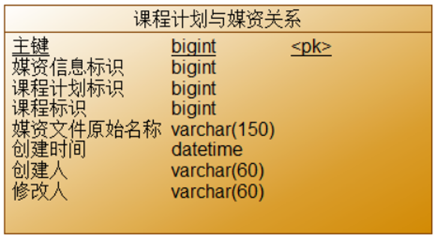

两张表是一对一关系，每个课程计划只能在 teachplan_media 表中存在一个视频。

从课程资料目录下的 db 目录中，从 xcplus_content.sql 文件中找到课程计划表 teachplan、teachplan_media 表的建表语句以及数据初始化语句，并通过 mysql 客户端去执行脚本。

这里使用 DataGrid 客户端工具连接 mysql 并执行脚本。

### **7.2 接口定义**

接口示例如下：

```json
GET /teachplan/22/tree-nodes

 [
      {
         "changeDate" : null,
         "courseId" : 74,
         "cousePubId" : null,
         "createDate" : null,
         "endTime" : null,
         "grade" : "2",
         "isPreview" : "0",
         "mediaType" : null,
         "orderby" : 1,
         "parentid" : 112,
         "pname" : "第1章基础知识",
         "startTime" : null,
         "status" : null,
         "id" : 113,
         "teachPlanTreeNodes" : [
            {
               "changeDate" : null,
               "courseId" : 74,
               "cousePubId" : null,
               "createDate" : null,
               "endTime" : null,
               "grade" : "3",
               "isPreview" : "1",
               "mediaType" : "001002",
               "orderby" : 1,
               "parentid" : 113,
               "pname" : "第1节项目概述",
               "startTime" : null,
               "status" : null,
               "id" : 115,
               "teachPlanTreeNodes" : null,
               "teachplanMedia" : {
                  "courseId" : 74,
                  "coursePubId" : null,
                  "mediaFilename" : "2.avi",
                  "mediaId" : 41,
                  "teachplanId" : 115,
                  "id" : null
               }
            }
         ],
         "teachplanMedia" : null
      },
      {
         "changeDate" : null,
         "courseId" : 74,
         "cousePubId" : null,
         "createDate" : null,
         "endTime" : null,
         "grade" : "2",
         "isPreview" : "0",
         "mediaType" : "",
         "orderby" : 1,
         "parentid" : 112,
         "pname" : "第2章快速入门",
         "startTime" : null,
         "status" : null,
         "id" : 242,
         "teachPlanTreeNodes" : [
            {
               "changeDate" : null,
               "courseId" : 74,
               "cousePubId" : null,
               "createDate" : null,
               "endTime" : null,
               "grade" : "3",
               "isPreview" : "1",
               "mediaType" : "001002",
               "orderby" : 2,
               "parentid" : 242,
               "pname" : "第1节搭建环境",
               "startTime" : null,
               "status" : null,
               "id" : 244,
               "teachPlanTreeNodes" : null,
               "teachplanMedia" : {
                  "courseId" : 74,
                  "coursePubId" : null,
                  "mediaFilename" : "3.avi",
                  "mediaId" : 42,
                  "teachplanId" : 244,
                  "id" : null
               }
            },
            {
               "changeDate" : null,
               "courseId" : 74,
               "cousePubId" : null,
               "createDate" : null,
               "endTime" : null,
               "grade" : "3",
               "isPreview" : "0",
               "mediaType" : "001002",
               "orderby" : 3,
               "parentid" : 242,
               "pname" : "第2节项目概述",
               "startTime" : null,
               "status" : null,
               "id" : 245,
               "teachPlanTreeNodes" : null,
               "teachplanMedia" : {
                  "courseId" : 74,
                  "coursePubId" : null,
                  "mediaFilename" : "1a.avi",
                  "mediaId" : 39,
                  "teachplanId" : 245,
                  "id" : null
               }
            }
         ],
         "teachplanMedia" : null
      }
   ]

```

查询课程计划的请求参数：课程 id

响应结果需要自定义模型类：

```java
package com.xuecheng.content.model.dto;

import com.xuecheng.content.model.po.Teachplan;
import com.xuecheng.content.model.po.TeachplanMedia;
import lombok.Data;
import lombok.ToString;

import java.util.List;

/**
 * @description 课程计划树型结构dto
 * @author Mr.M
 * @date 2022/9/9 10:27
 * @version 1.0
 */
@Data
@ToString
public class TeachplanDto extends Teachplan {

  //课程计划关联的媒资信息
  TeachplanMedia teachplanMedia;

  //子结点
  List<TeachplanDto> teachPlanTreeNodes;

}

```

定义接口如下：

```java
package com.xuecheng.content.api;

import com.xuecheng.content.model.dto.TeachplanDto;
import io.swagger.annotations.Api;
import io.swagger.annotations.ApiImplicitParam;
import io.swagger.annotations.ApiOperation;
import org.springframework.web.bind.annotation.GetMapping;
import org.springframework.web.bind.annotation.PathVariable;
import org.springframework.web.bind.annotation.RestController;

/**
 * @description 课程计划编辑接口
 * @author Mr.M
 * @date 2022/9/6 11:29
 * @version 1.0
 */
 @Api(value = "课程计划编辑接口",tags = "课程计划编辑接口")
 @RestController
public class TeachplanController {

    @ApiOperation("查询课程计划树形结构")
    @ApiImplicitParam(value = "courseId",name = "课程Id",required = true,dataType = "Long",paramType = "path")
    @GetMapping("/teachplan/{courseId}/tree-nodes")
    public List<TeachplanDto> getTreeNodes(@PathVariable Long courseId){
        return null;
    }

}

```

### **7.3 接口开发**

#### **7.3.1 DAO 开发**

Mapper 接口使用 sql 查询课程计划，组成一个树型结构。

在 TeachplanMapper 自定义方法：

```java
public interface TeachplanMapper extends BaseMapper<Teachplan> {

    /**
     * @description 查询某课程的课程计划，组成树型结构
     * @param courseId
     * @return com.xuecheng.content.model.dto.TeachplanDto
     * @author Mr.M
     * @date 2022/9/9 11:10
    */
    public List<TeachplanDto> selectTreeNodes(long courseId);

}

```

定义 mapper.xml 中的 sql 语句，分析如下：

1、一级分类和二级分类通过 teachplan 表的自链接进行，如果只有一级分类其下边没有二级分类，此时也需要显示一级分类，这里使用左连接，左边是一级分类，右边是二级分类。

2、由于当还没有关联 视频时 teachplan_media 对应的记录为空，所以需要 teachplan 和 teachplan_media 左链接。

sql 如下：

```sql
select
            one.id             one_id,
            one.pname          one_pname,
            one.parentid       one_parentid,
            one.grade          one_grade,
            one.media_type     one_mediaType,
            one.start_time     one_stratTime,
            one.end_time       one_endTime,
            one.orderby        one_orderby,
            one.course_id      one_courseId,
            one.course_pub_id  one_coursePubId,
            two.id             two_id,
            two.pname          two_pname,
            two.parentid       two_parentid,
            two.grade          two_grade,
            two.media_type     two_mediaType,
            two.start_time     two_stratTime,
            two.end_time       two_endTime,
            two.orderby        two_orderby,
            two.course_id      two_courseId,
            two.course_pub_id  two_coursePubId,
            m1.media_fileName mediaFilename,
            m1.id teachplanMeidaId,
            m1.media_id mediaId

        from teachplan one
                 INNER JOIN teachplan two on one.id = two.parentid
                 LEFT JOIN teachplan_media m1 on m1.teachplan_id = two.id
        where one.parentid = 0 and one.course_id=#{value}
        order by one.orderby,
                 two.orderby

```

定义 mapper.xml

```xml
<!-- 课程分类树型结构查询映射结果 -->
    <resultMap id="treeNodeResultMap" type="com.xuecheng.content.model.dto.TeachplanDto">
        <!-- 一级数据映射 -->
        <id     column="one_id"        property="id" />
        <result column="one_pname"      property="pname" />
        <result column="one_parentid"     property="parentid" />
        <result column="one_grade"  property="grade" />
        <result column="one_mediaType"   property="mediaType" />
        <result column="one_stratTime"   property="stratTime" />
        <result column="one_endTime"   property="endTime" />
        <result column="one_orderby"   property="orderby" />
        <result column="one_courseId"   property="courseId" />
        <result column="one_coursePubId"   property="coursePubId" />
        <!-- 一级中包含多个二级数据 -->
        <collection property="teachPlanTreeNodes" ofType="com.xuecheng.content.model.dto.TeachplanDto">
            <!-- 二级数据映射 -->
            <id     column="two_id"        property="id" />
            <result column="two_pname"      property="pname" />
            <result column="two_parentid"     property="parentid" />
            <result column="two_grade"  property="grade" />
            <result column="two_mediaType"   property="mediaType" />
            <result column="two_stratTime"   property="stratTime" />
            <result column="two_endTime"   property="endTime" />
            <result column="two_orderby"   property="orderby" />
            <result column="two_courseId"   property="courseId" />
            <result column="two_coursePubId"   property="coursePubId" />
            <association property="teachplanMedia" javaType="com.xuecheng.content.model.po.TeachplanMedia">
                <result column="teachplanMeidaId"   property="id" />
                <result column="mediaFilename"   property="mediaFilename" />
                <result column="mediaId"   property="mediaId" />
                <result column="two_id"   property="teachplanId" />
                <result column="two_courseId"   property="courseId" />
                <result column="two_coursePubId"   property="coursePubId" />
            </association>
        </collection>
    </resultMap>
    <!--课程计划树型结构查询-->
    <select id="selectTreeNodes" resultMap="treeNodeResultMap" parameterType="long" >
        select
            one.id             one_id,
            one.pname          one_pname,
            one.parentid       one_parentid,
            one.grade          one_grade,
            one.media_type     one_mediaType,
            one.start_time     one_stratTime,
            one.end_time       one_endTime,
            one.orderby        one_orderby,
            one.course_id      one_courseId,
            one.course_pub_id  one_coursePubId,
            two.id             two_id,
            two.pname          two_pname,
            two.parentid       two_parentid,
            two.grade          two_grade,
            two.media_type     two_mediaType,
            two.start_time     two_stratTime,
            two.end_time       two_endTime,
            two.orderby        two_orderby,
            two.course_id      two_courseId,
            two.course_pub_id  two_coursePubId,
            m1.media_fileName mediaFilename,
            m1.id teachplanMeidaId,
            m1.media_id mediaId

        from teachplan one
                 INNER JOIN teachplan two on one.id = two.parentid
                 LEFT JOIN teachplan_media m1 on m1.teachplan_id = two.id
        where one.parentid = 0 and one.course_id=#{value}
        order by one.orderby,
                 two.orderby
    </select>

```

单元测试方法，略。

#### **7.3.2 Service 开发**

定义 service 接口

```java
package com.xuecheng.content.service;

import com.xuecheng.base.model.PageParams;
import com.xuecheng.base.model.PageResult;
import com.xuecheng.content.model.dto.*;
import com.xuecheng.content.model.po.CourseBase;

/**
 * @description 课程基本信息管理业务接口
 * @author Mr.M
 * @date 2022/9/6 21:42
 * @version 1.0
 */
public interface TeachplanService {

/**
 * @description 查询课程计划树型结构
 * @param courseId  课程id
 * @return List<TeachplanDto>
 * @author Mr.M
 * @date 2022/9/9 11:13
*/
 public List<TeachplanDto> findTeachplanTree(long courseId);

 }

```

定义 service 接口实现类

```java
package com.xuecheng.content.service.impl;

import com.xuecheng.content.mapper.TeachplanMapper;
import com.xuecheng.content.model.dto.TeachplanDto;
import com.xuecheng.content.service.TeachplanService;
import org.springframework.beans.factory.annotation.Autowired;
import org.springframework.stereotype.Service;

/**
 * @description 课程计划service接口实现类
 * @author Mr.M
 * @date 2022/9/9 11:14
 * @version 1.0
 */
 @Service
public class TeachplanServiceImpl implements TeachplanService {

  @Autowired
 TeachplanMapper teachplanMapper;
 @Override
 public List<TeachplanDto> findTeachplanTree(long courseId) {
  return teachplanMapper.selectTreeNodes(courseId);
 }
}

```

### **6.4 接口测试**

1、完善接口层代码

```java
 @Autowired
TeachplanService teachplanService;

@ApiOperation("查询课程计划树形结构")
@ApiImplicitParam(value = "courseId",name = "课程基础Id值",required = true,dataType = "Long",paramType = "path")
@GetMapping("teachplan/{courseId}/tree-nodes")
public List<TeachplanDto> getTreeNodes(@PathVariable Long courseId){
    return teachplanService.findTeachplanTree(courseId);
}

```

2、使用 httpclient 测试

找一个有课程计划的课程进行测试

```java
#### 查询某个课程的课程计划
GET {{content_host}}/content/teachplan/74/tree-nodes

```

3、前后端联调

1）进入课程编辑页面

2）保存进入下一步

观察课程计划获取是否成功。

1）进入新增课程页面

2）新增课程成功，自动进入课程计划编辑界面。

由于是新增的课程，课程计划为空。

## **8 新增/修改计划**

### **8.1 需求分析**

#### **8.1.1 业务流程**

1、进入课程计划界面

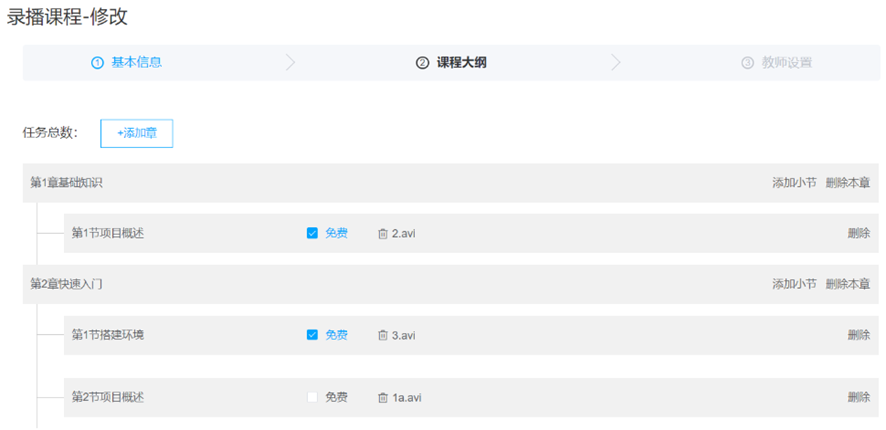

2、点击“添加章”新增第一级课程计划。

新增成功自动刷新课程计划列表。

3、点击“添加小节”向某个第一级课程计划下添加小节。

新增成功自动刷新课程计划列表。

新增的课程计划自动排序到最后。

4、点击“章”、“节”的名称，可以修改名称、选择是否免费。

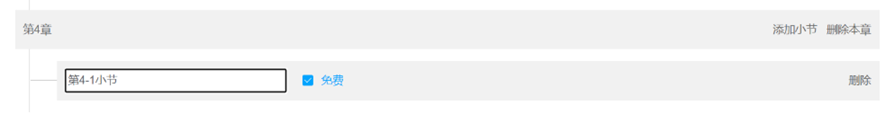

#### **8.1.2 数据模型**

1、新增第一级课程计划

名称默认为：新章名称 \[点击修改\]

grade：1

orderby: 所属课程中同级别下排在最后

2、新增第二级课程计划

名称默认为：新小节名称 \[点击修改\]

grade：2

orderby: 所属课程计划中排在最后

3、修改第一级、第二级课程计划的名称，修改第二级课程计划是否免费

### **8.2 接口定义**

接口示例如下：

```json
#### 新增课程计划--章,当grade为1时parentid为0
POST /teachplan
Content-Type: application/json

{
  "courseId" : 74,
  "parentid": 0,
  "grade" : 1,
  "pname" : "新章名称 [点击修改]"
}
#### 新增课程计划--节
POST {{content_host}}/content/teachplan
Content-Type: application/json

{
  "courseId" : 74,
  "parentid": 247,
  "grade" : 2,
  "pname" : "小节名称 [点击修改]"
}

```

同一个接口接收新增和修改两个业务请求，以是否传递课程计划 id 来判断是新增还是修改。

如果传递了课程计划 id 说明当前是要修改该课程计划，否则是新增一个课程计划。

定义接收请求参数的数据模型类：

定义 SaveTeachplanDto

```java
package com.xuecheng.content.model.dto;

import com.baomidou.mybatisplus.annotation.FieldFill;
import com.baomidou.mybatisplus.annotation.TableField;
import com.xuecheng.content.model.po.Teachplan;
import com.xuecheng.content.model.po.TeachplanMedia;
import lombok.Data;
import lombok.ToString;

import java.time.LocalDateTime;
import java.util.List;

/**
 * @description 保存课程计划dto，包括新增、修改
 * @author Mr.M
 * @date 2022/9/9 10:27
 * @version 1.0
 */
@Data
@ToString
public class SaveTeachplanDto {

 /***
  * 教学计划id
  */
 private Long id;

 /**
  * 课程计划名称
  */
 private String pname;

 /**
  * 课程计划父级Id
  */
 private Long parentid;

 /**
  * 层级，分为1、2、3级
  */
 private Integer grade;

 /**
  * 课程类型:1视频、2文档
  */
 private String mediaType;


 /**
  * 课程标识
  */
 private Long courseId;

 /**
  * 课程发布标识
  */
 private Long coursePubId;


 /**
  * 是否支持试学或预览（试看）
  */
 private String isPreview;


}

```

定义接口如下：

```java
@ApiOperation("课程计划创建或修改")
@PostMapping("/teachplan")
public void saveTeachplan( @RequestBody SaveTeachplanDto teachplan){

}

```

### **8.3 接口开发**

#### **8.3.1 Mapper 开发**

根据业务的分析，Mapper 使用自动生成的 mapper 即可满足要求。

#### **8.3.2 Service 开发**

定义保存课程计划的 Service 接口。

```java
 /**
  * @description 只在课程计划
  * @param teachplanDto  课程计划信息
  * @return void
  * @author Mr.M
  * @date 2022/9/9 13:39
 */
 public void saveTeachplan(SaveTeachplanDto teachplanDto);

```

编写接口实现：

```java
 @Transactional
 @Override
 public void saveTeachplan(SaveTeachplanDto teachplanDto) {

  //课程计划id
  Long id = teachplanDto.getId();
  //修改课程计划
  if(id!=null){
    Teachplan teachplan = teachplanMapper.selectById(id);
   BeanUtils.copyProperties(teachplanDto,teachplan);
   teachplanMapper.updateById(teachplan);
  }else{
    //取出同父同级别的课程计划数量
   int count = getTeachplanCount(teachplanDto.getCourseId(), teachplanDto.getParentid());
   Teachplan teachplanNew = new Teachplan();
   //设置排序号
   teachplanNew.setOrderby(count+1);
   BeanUtils.copyProperties(teachplanDto,teachplanNew);

   teachplanMapper.insert(teachplanNew);

  }

 }
 /**
  * @description 获取最新的排序号
  * @param courseId  课程id
  * @param parentId  父课程计划id
  * @return int 最新排序号
  * @author Mr.M
  * @date 2022/9/9 13:43
 */
 private int getTeachplanCount(long courseId,long parentId){
  LambdaQueryWrapper<Teachplan> queryWrapper = new LambdaQueryWrapper<>();
  queryWrapper.eq(Teachplan::getCourseId,courseId);
  queryWrapper.eq(Teachplan::getParentid,parentId);
  Integer count = teachplanMapper.selectCount(queryWrapper);
  return count;
 }

```

### **8.4 接口测试**

1、完善接口的代码 ，调用 service 方法完成课程计划的创建和修改。

```java
@ApiOperation("课程计划创建或修改")
@PostMapping("/teachplan")
public void saveTeachplan( @RequestBody SaveTeachplanDto teachplan){
    teachplanService.saveTeachplan(teachplan);
}

```

2、首先使用 httpclient 做以下测试。

添加章

```json
#### 新增课程计划--章
POST {{content_host}}/content/teachplan
Content-Type: application/json

{
  "courseId" : 74,
  "parentid": 0,
  "grade" : 1,
  "pname" : "新章名称 [点击修改]"
}

```

2、添加小节

```json
#### 新增课程计划--节,从数据库找到第一级的课程计划id向其下边添加计划
POST {{content_host}}/content/teachplan
Content-Type: application/json

{
  "courseId" : 74,
  "parentid": 247,
  "grade" : 2,
  "pname" : "小节名称 [点击修改]"
}

```

3、保存课程计划

```json
#### 课程课程计划,需要从数据库找到修改的课程计划id
POST {{content_host}}/content/teachplan
Content-Type: application/json

{
  "changeDate" : null,
  "courseId" : 22,
  "cousePubId" : null,
  "createDate" : null,
  "ctlBarShow" : false,
  "ctlEditTitle" : true,
  "endTime" : null,
  "grade" : "2",
  "isPreview" : "1",
  "mediaType" : "",
  "orderby" : 1,
  "parentid" : 237,
  "pname" : "第1节修改名称",
  "startTime" : null,
  "status" : null,
  "teachPlanId" : 240
}

```

4、前后端联调

分别联调新增章、新增小节、保存计划信息。

### **8.5 Bug 修改**

通过接口测试我们发现：

1、使用 httpclient 测试没有问题

2、前后端联调时发现新增的第一级目录不能显示在列表中。

请自己分析并修复。

3、思考添加课程计划的实现方式是否存在 bug?

如有 bug 进行修改。

## **9 项目实战**

### **9.1 实战环境**

#### **9.1.1 实战流程**

项目实战是模拟企业实际开发的场景，自己参考文档独立完成开发任务，项目实战可以有效的培养自己面对需求进行分析与开发的能力。

实战流程如下：

1、由组长将实战的初始代码提交至本组 git 仓库。

2、每位成员从此仓库 clone 项目。

3、小组共同讨论实战功能需求及接口。

4、根据自己小组的情况进行分工，每人至少写一个接口并测试通过、提交至仓库。

**注意：每人在开发接口时创建自己的 service、controller 接口和类，不要出现多人共用同一个文件的情况。**

5、待功能开发完毕小组成员拉下全部代码，进行交叉测试，测试出来的 bug 信息记录在 word 文档上提交给组长由组长汇总。

6、根据 bug 记录进行修复自己接口中的 bug，修复完成并测试没有问题后提交给 Git。

7、整体流程测试，包括如下：

1）从网上找一门详细的课程信息(包括课程大纲) 添加到系统中。

功能包括：添加课程、添加课程计划、添加师资信息。

2）演示修改课程、修改课程计划及修改师资信息功能。

3）演示课程计划上移、下移功能。

4）演示删除课程计划、删除师资、删除课程功能。

8、项目评比

**小组推荐一名成员作工作汇总，老师根据团队协作情况、功能完成情况、演讲能力进行打分（满分 10 分）。**

#### **9.1.2 创建 Git 远程仓库**

因为组员无法访问组长虚拟机中的 gogs 所以由组长在自己的电脑上安装 gogs，这里提供 windwos 版本安装包，如果安装有问题也可以使用公网的 git 仓库，比如码云。

组长解压 软件工具目录下的 gogs_0.12.10_windows_amd64.zip，安装 gogs

解压后 cmd 进入 gogs 安装目录，输入 gogs.exe web

自动打开安装界面：

第一步填写数据库信息

输入虚拟机中的数据库地址和账号、密码，数据库名称为 gogs_windows，需要提前在数据库中创建 gogs_windows 数据库

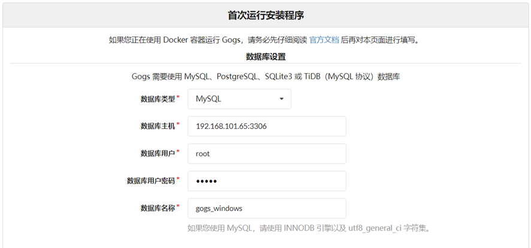

第二步应用基本设置：

仓库目录可以设置在 gogs 的安装目录下

域名为虚拟域名，组长和组员在自己的 hosts 文件中配置该域名及对应的组长电脑的 IP 地址。

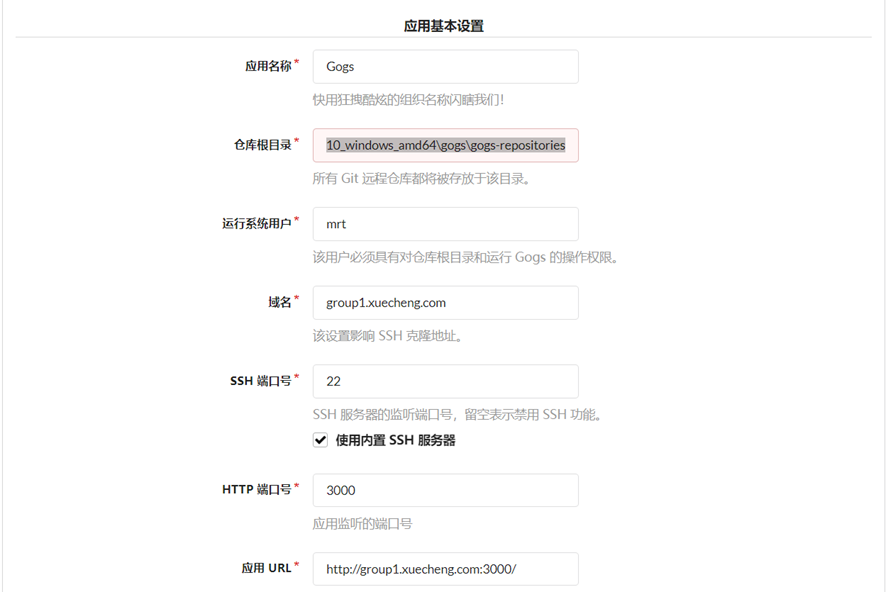

下边配置日志路径 ，日志路径可以设置在 gogs 的安装目录下

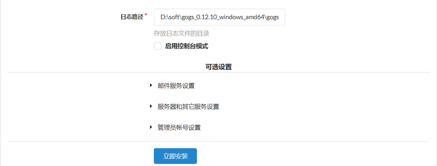

下边配置管理员账号和密码：gogs/gogs

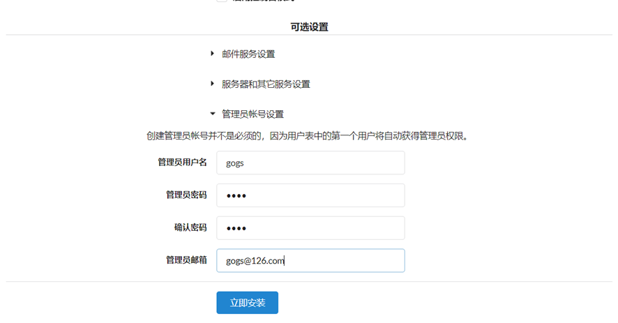

输入完毕点击立即安装

安装完毕自动跳转到 http://group1.xuecheng.com:3000/

组长使用管理员账号密码登录，登录后参考 学成在线项目开发环境配置文档去创建组织及仓库，仓库的代码是老师下发的实战基础代码。

组长为组员创建 git 账号，创建完成将账号和密码发给每位组员。

组员需要记住自己的 git 账号和密码，

#### **9.1.3 拉取代码**

组员拉取本组 git 远程仓库的代码，根据任务分工开始协作开发。

例如：本组的 git 仓库地址为http://group1.xuecheng.com:3000/xuecheng-plus-group01/xuecheng-plus-project.git

本组全体成员拉取此仓库的代码，根据任务分工开始协作开发。

### **9.2 删除课程计划**

#### **9.2.1 需求分析**

课程计划添加成功，如果课程还没有提交时可以删除课程计划。

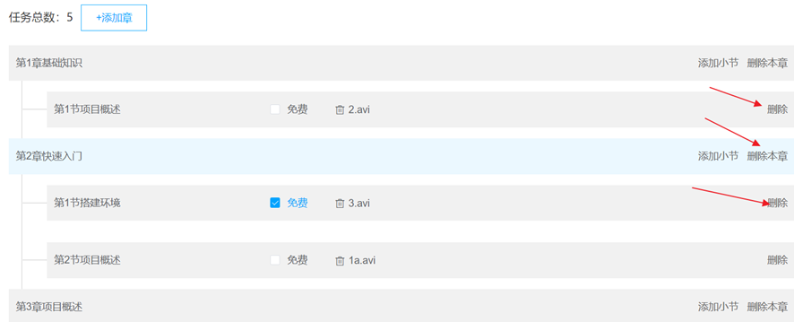

删除第一级别的大章节时要求大章节下边没有小章节时方可删除。

删除第二级别的小章节的同时需要将 teachplan_media 表关联的信息也删除。

#### **9.2.2 接口定义**

删除课程计划的接口定义：

传入课程计划 id 进行删除操作。

```json
Request URL: /content/teachplan/246
Request Method: DELETE

如果失败返回：
{"errCode":"120409","errMessage":"课程计划信息还有子级信息，无法操作"}

如果成功：状态码200，不返回信息

```

#### **9.2.3 接口测试**

首先使用 httpclient 工具进行测试

```json
#### 删除课程计划
DELETE {{content_host}}/content/teachplan/43

```

分以下情况测试：

1、删除大章节，大章节下有小章节时不允许删除。

2、删除大章节，大单节下没有小章节时可以正常删除。

3、删除小章节，同时将关联的信息进行删除。

### **9.3 课程计划排序**

#### **9.3.1 需求分析**

课程计划新增后默认排在同级别最后，课程计划排序功能是可以灵活调整课程计划的显示顺序，如下图：

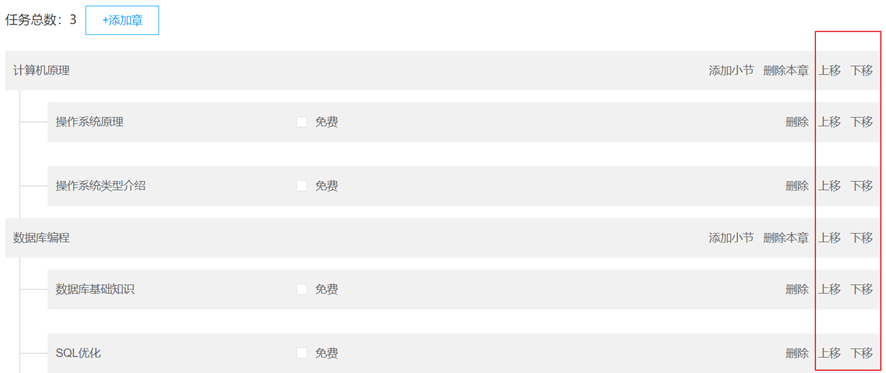

上移表示将课程计划向上移动。

下移表示将课程计划向下移动。

向上移动后和上边同级的课程计划交换位置，可以将两个课程计划的排序字段值进行交换。

向下移动后和下边同级的课程计划交换位置，可以将两个课程计划的排序字段值进行交换。

#### **9.3.2 接口定义**

接口示例如下：

向下移动：

```json
Java
Request URL: http://localhost:8601/api/content/teachplan/movedown/43
Request Method: POST

```

参数 1：movedown 为 移动类型，表示向下移动  
参数 2：43 为课程计划 id

向上移动：

```json
Request URL: http://localhost:8601/api/content/teachplan/moveup/43
Request Method: POST

```

参数 1：moveup 为 移动类型，表示向上移动  
参数 2：43 为课程计划 id

每次移动传递两个参数：

1、移动类型: movedown 和 moveup

2、课程计划 id

#### **9.3.3 接口测试**

该功能可直接进行前后端联调，可以立即看到 效果。

1、向上移动测试

先找一个上边有课程计划的进行测试，向上移动后两个交换顺序。

再找最上边的课程计划向上移动，操作后位置不变因为已经在最上边了。

2、向下移动测试

先找一个下边有课程计划的进行测试，向下移动后两个交换顺序。

再找最下边的课程计划向下移动，操作后位置不变因为已经在最下边了。

### **9.4 师资管理**

#### **9.4.1 需求分析**

在课程计划维护界面点击下一步进入师资管理界面：

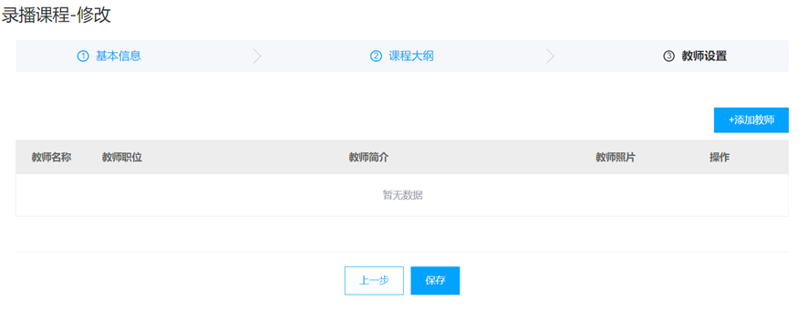

点击添加教师打开添加界面，如下图，不用实现上传照片。

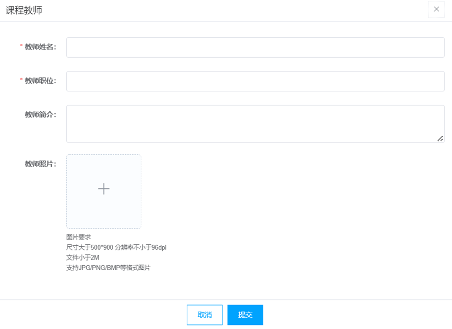

添加成功查询教师信息如下：

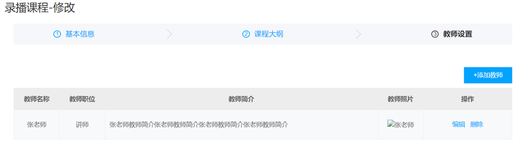

在这个界面可以删除老师，也可以点击编辑，修改教师信息：

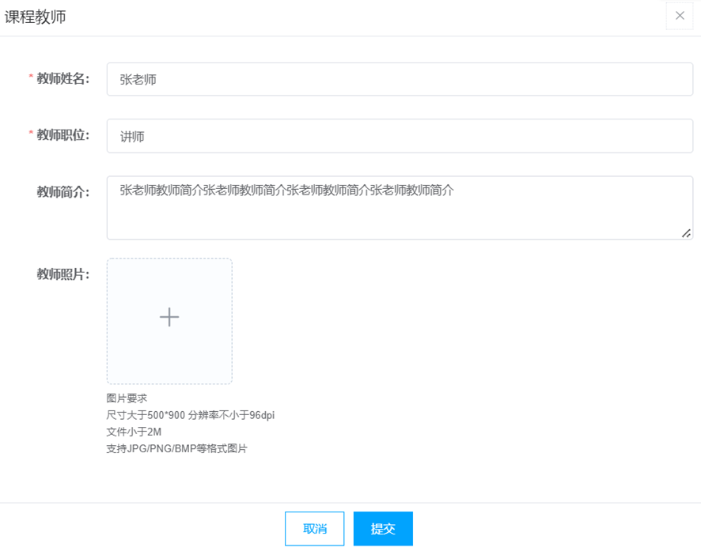

注意：

只允许向机构自己的课程中添加老师、删除老师。

机构 id 统一使用：1232141425L

#### **9.4.2 接口定义**

1、查询教师接口请求示例

```json
get /courseTeacher/list/75
75为课程id，请求参数为课程id

响应结果
[{"id":23,"courseId":75,"teacherName":"张老师","position":"讲师","introduction":"张老师教师简介张老师教师简介张老师教师简介张老师教师简介","photograph":null,"createDate":null}]

```

2、添加教师请求示例

```json
post  /courseTeacher

请求参数：
{
  "courseId": 75,
  "teacherName": "王老师",
  "position": "教师职位",
  "introduction": "教师简介"
}
响应结果：
{"id":24,"courseId":75,"teacherName":"王老师","position":"教师职位","introduction":"教师简介","photograph":null,"createDate":null}

```

3、修改教师

```json
put /courseTeacher
请求参数：
{
  "id": 24,
  "courseId": 75,
  "teacherName": "王老师",
  "position": "教师职位",
  "introduction": "教师简介",
  "photograph": null,
  "createDate": null
}
响应：
{"id":24,"courseId":75,"teacherName":"王老师","position":"教师职位","introduction":"教师简介","photograph":null,"createDate":null}

```

4、删除教师

```json
delete /ourseTeacher/course/75/26

75:课程id
26:教师id，即course_teacher表的主键
请求参数：课程id、教师id

响应：状态码200，不返回信息

```

#### **9.4.3 接口测试**

1、添加教师

2、查询教师

3、修改教师

4、删除教师

### **9.5 删除课程**

#### **9.5.1 需求分析**

课程的审核状态为未提交时方可删除。

删除课程需要删除课程相关的基本信息、营销信息、课程计划、课程教师信息。

#### **9.5.2 接口定义**

删除课程接口

```json
delete  /course/87
87为课程id
请求参数：课程id
响应：状态码200，不返回信息

```

#### **9.5.3 接口测试**

找到一门课程进行删除，删除后从数据库确认课程基本信息、课程营销信息、课程计划、课程计划关联信息、课程师资是否删除成功。
