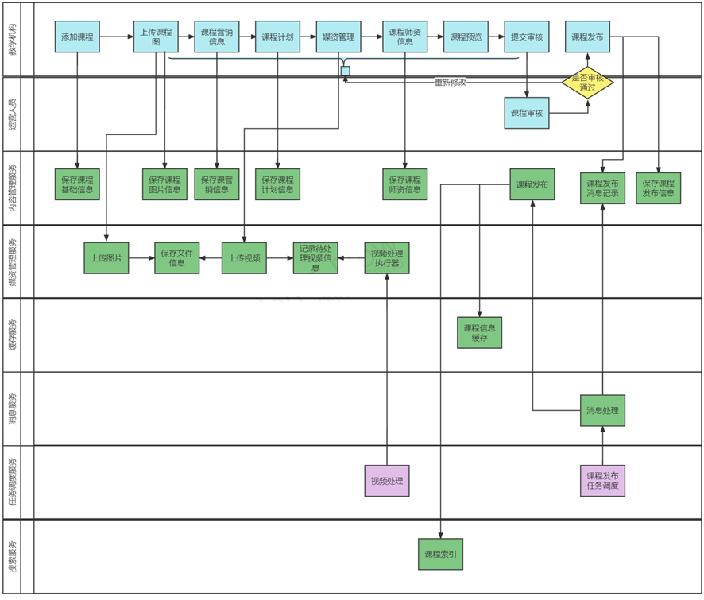

# **第 3 章媒资管理模块 v3.1**

[[TOC]]

## **1 模块需求分析**

### **1.1 模块介绍**

媒资管理系统是每个在线教育平台所必须具备的，查阅百度百科对它的定义如下：

媒体资源管理(Media Asset Management，MAM)系统是建立在多媒体、网络、数据库和数字存储等先进技术基础上的一个对各种媒体及内容(如视/音频资料、文本文件、图表等)进行数字化存储、管理以及应用的总体解决方案，包括数字媒体的采集、编目、管理、传输和编码转换等所有环节。其主要是满足[媒体](https://baike.baidu.com/item/%E5%AA%92%E4%BD%93?fromModule=lemma_inlink)资源拥有者收集、保存、查找、编辑、发布各种信息的要求，为媒体资源的使用者提供访问内容的便捷方法，实现对媒体资源的高效管理，大幅度提高媒体资源的价值。

每个教学机构都可以在媒资系统管理自己的教学资源，包括：视频、教案等文件。

目前媒资管理的主要管理对象是视频、图片、文档等，包括：媒资文件的查询、文件上传、视频处理等。

媒资查询：教学机构查询自己所拥有的媒资信息。

文件上传：包括上传图片、上传文档、上传视频。

视频处理：视频上传成功，系统自动对视频进行编码处理。

文件删除：教学机构删除自己上传的媒资文件。

下图是课程编辑与发布的整体流程，通过下图可以看到媒资管理在整体流程的位置：



### **1.2 业务流程**

#### **1.2.1 上传图片**

教学机构人员在课程信息编辑页面上传课程图片，课程图片统一记录在媒资管理系统。

下图是上传图片的界面：


#### **1.2.2 上传视频**

1、教学机构人员进入媒资管理列表查询自己上传的媒资文件。

点击“媒资管理”


进入媒资管理列表页面查询本机构上传的媒资文件。


2、教育机构用户在"媒资管理"页面中点击 "上传视频" 按钮。


点击“上传视频”打开上传页面


3、选择要上传的文件，自动执行文件上传，视频上传成功会自动处理。


#### **1.2.3 处理视频**

对需要转码处理的视频系统会自动对其处理，处理后生成视频的 URL。

处理视频没有用户界面，完全是后台自动执行。

#### **1.2.4 审核媒资**

审核媒资包括程序自动审核和人工审核，程序可以通过鉴黄接口(https://www.aliyun.com/product/lvwang?spm=5176.19720258.J\_3207526240.51.e93976f4rSq796)审核视频，对有异议的视频由人工进行审核。

1.运营用户登入运营平台并进入媒资管理页面，查找待审核媒资


2.点击列表中媒资名称链接，可预览该媒资，若是视频，则播放视频。


3.点击列表中某媒资后的"审核" 按钮，既完成媒资的审批过程。


点击“审核”，选择审核结果，输入审核意见。


#### **1.2.5 绑定媒资**

课程计划创建好后需要绑定媒资文件，比如：如果课程计划绑定了视频文件，进入课程在线学习界面后点课程计划名称则在线播放视频。如下图：


如何将课程计划绑定媒资呢？

1.教育机构用户进入课程管理页面并编辑某一个课程，在"课程大纲"标签页的某一小节后可点击”添加视频“。


2.弹出添加视频对话框，可通过视频关键字搜索已审核通过的视频媒资。


3.选择视频媒资，点击提交按钮，完成课程计划绑定媒资流程。


课程计划关联视频后如下图：


### **1.3 数据模型**

本模块媒资文件相关的数据表如下：


媒资文件表：存储文件信息，包括图片、视频、文档等。

media_process: 待处理视频表。

media_process_history: 视频处理历史表，记录已经处理成功的视频信息。

媒资文件与课程计划绑定关系表如下：


## **2 搭建模块环境**

### **2.1 架构的问题分析**

当前要开发的是媒资管理服务，目前为止共三个微服务：内容管理、系统管理、媒资管理，如下图：


后期还会添加更多的微服务，当前这种由前端直接请求微服务的方式存在弊端：

如果在前端对每个请求地址都配置绝对路径，非常不利于系统维护，比如下边代码中请求系统管理服务的地址使用的是 localhost


当系统上线后这里需要改成公网的域名，如果这种地址非常多则非常麻烦。

基于这个问题可以采用网关来解决，如下图：


这样在前端的代码中只需要指定每个接口的相对路径，如下所示：


在前端代码的一个固定的地方在接口地址前统一加网关的地址，每个请求统一到网关，由网关将请求转发到具体的微服务。

为什么所有的请求先到网关呢？

有了网关就可以对请求进行路由，路由到具体的微服务，减少外界对接微服务的成本，比如：400 电话，路由的试可以根据请求路径进行路由、根据 host 地址进行路由等， 当微服务有多个实例时可以通过负载均衡算法进行路由，如下：


另外，网关还可以实现权限控制、限流等功能。

项目采用 Spring Cloud Gateway 作为网关，网关在请求路由时需要知道每个微服务实例的地址，项目使用 Nacos 作用服务发现中心和配置中心，整体的架构图如下：


流程如下：

1、微服务启动，将自己注册到 Nacos，Nacos 记录了各微服务实例的地址。

2、网关从 Nacos 读取服务列表，包括服务名称、服务地址等。

3、请求到达网关，网关将请求路由到具体的微服务。

要使用网关首先搭建 Nacos，Nacos 有两个作用：

1、服务发现中心。

微服务将自身注册至 Nacos，网关从 Nacos 获取微服务列表。

2、配置中心。

微服务众多，它们的配置信息也非常复杂，为了提供系统的可维护性，微服务的配置信息统一在 Nacos 配置。

### **2.2 搭建 Nacos**

#### **2.2.1 服务发现中心**

Spring Cloud ：一套规范

Spring Cloud alibaba（类似与接口与实现类的关系）: nacos 服务注册中心，配置中心\*\*\*\*

根据上节讲解的网关的架构图，要使用网关首先搭建 Nacos。

首先搭建 Nacos 服务发现中心。

在搭建 Nacos 服务发现中心之前需要搞清楚两个概念：namespace 和 group

namespace：用于区分环境、比如：开发环境、测试环境、生产环境。

group：用于区分项目，比如：xuecheng-plus 项目、xuecheng2.0 项目

首先在 nacos 配置 namespace:

登录 Centos，启动 Naocs，使用 sh /data/soft/restart.sh 将自动启动 Nacos。

访问：http://192.168.101.65:8848/nacos/

账号密码：nacos/nacos

登录成功，点击左侧菜单“命名空间”进入命名空间管理界面，


点击“新建命名空间”，填写命名空间的相关信息。如下图：


使用相同的方法再创建“测试环境”、"生产环境"的命名空间。


创建成功，如下图：


在教学中可以创建具体班级的命名空间，假如创建 1010 班级的命名空间，如下：


`注意：如果使用dev1010命名空间，在下边的配置中对namespace配置为dev1010。`

首先完成各服务注册到 Naocs，下边将内容管理服务注册到 nacos 中。

1\) 在 xuecheng-plus-parent 中添加依赖管理

```xml
<dependency>
    <groupId>com.alibaba.cloud</groupId>
    <artifactId>spring-cloud-alibaba-dependencies</artifactId>
    <version>${spring-cloud-alibaba.version}</version>
    <type>pom</type>
    <scope>import</scope>
</dependency>

```

2）在内容管理模块的接口工程、系统管理模块的接口工程中添加如下依赖

```xml
<dependency>
    <groupId>com.alibaba.cloud</groupId>
    <artifactId>spring-cloud-starter-alibaba-nacos-discovery</artifactId>
</dependency>

```

3）配置 nacos 的地址

在系统管理的接口工程的配置文件中配置如下信息：

```yaml
##微服务配置
spring:
  application:
    name: system-service
  cloud:
    nacos:
      server-addr: 192.168.101.65:8848
      discovery:
        namespace: dev
        group: xuecheng-plus-project
```

在内容管理的接口工程的配置文件中配置如下信息：

```yaml
spring:
  application:
    name: content-api
  cloud:
    nacos:
      server-addr: 192.168.101.65:8848
      discovery:
        namespace: dev
        group: xuecheng-plus-project
```

4）重启内容管理服务、系统管理服务。

待微服务启动成功，进入 Nacos 服务查看服务列表


在 “开发环境” 命名空间下有两个服务这说明内容管理微服务和系统管理微服务在 Nacos 注册成功。

点击其它一个微服务的“详情”


通过上图可以查看微服务实例的地址。

#### **2.2.2 配置中心**

##### **2.2.2.1 配置三要素**

搭建完成 Nacos 服务发现中心，下边搭建 Nacos 为配置中心，其目的就是通过 Nacos 去管理项目的所有配置。

先将项目中的配置文件分分类：

**1、每个项目特有的配置**

是指该配置只在有些项目中需要配置，或者该配置在每个项目中配置的值不同。

比如：spring.application.name 每个项目都需要配置但值不一样，以及有些项目需要连接数据库而有些项目不需要，有些项目需要配置消息队列而有些项目不需要。

**2、项目所公用的配置**

是指在若干项目中配置内容相同的配置。比如：redis 的配置，很多项目用的同一套 redis 服务所以配置也一样。

另外还需要知道 nacos 如何去定位一个具体的配置文件，即：namespace、group、dataid.

1、通过 namespace、group 找到具体的环境和具体的项目。

2、通过 dataid 找到具体的配置文件，dataid 有三部分组成

`比如：content-service-dev.yaml配置文件 由（content-service）-（dev）. (yaml)三部分组成`

content-service：第一部分，它是在 application.yaml 中配置的应用名，即 spring.application.name 的值。

dev：第二部分，它是环境名，通过 spring.profiles.active 指定，

Yaml: 第三部分，它是配置文件 的后缀，目前 nacos 支持 properties、yaml 等格式类型，本项目选择 yaml 格式类型。

所以，如果我们要配置 content-service 工程的配置文件:

在开发环境中配置 content-service-dev.yaml

在测试环境中配置 content-service-test.yaml

在生产环境中配置 content-service-prod.yaml

我们启动项目中传入 spring.profiles.active 的参数决定引用哪个环境的配置文件，例如：传入 spring.profiles.active=dev 表示使用 dev 环境的配置文件即 content-service-dev.yaml。

##### **2.2.2.2 配置 content-service**

下边以开发环境为例对 content-service 工程的配置文件进行配置，进入 nacos，进入开发环境。


点击加号，添加一个配置


输入 data id、group 以及配置文件内容。

为什么没在 nacos 中配置下边的内容 ？

```yaml
spring:
  application:
    name: content-service
```

因为刚才说了 dataid 第一部分就是 spring.application.name，nacos 客户端要根据此值确定配置文件 名称，所以 spring.application.name 不在 nacos 中配置，而是要在工程的本地进行配置。

在 content-service 工程的 test/resources 中添加 bootstrap.yaml，内容如下：

```yaml
spring:
  application:
    name: content-service
  cloud:
    nacos:
      server-addr: 192.168.101.65:8848
      discovery:
        namespace: dev
        group: xuecheng-plus-project
      config:
        namespace: dev
        group: xuecheng-plus-project
        file-extension: yaml
        refresh-enabled: true

  #profiles默认为dev
  profiles:
    active: dev
```

在内容管理模块的接口工程和 service 工程配置依赖：

```xml
<dependency>
    <groupId>com.alibaba.cloud</groupId>
    <artifactId>spring-cloud-starter-alibaba-nacos-config</artifactId>
</dependency>

```

配置完成，运行 content-service 工程 的单元测试文件，能否正常测试，跟踪单元测试方法可以正常读取数据库的数据，说明从 nacos 读取配置信息正常。

通过运行观察控制台打印出下边的信息，NacosRestTemplate.java 通过 Post 方式与 nacos 服务端交互读取配置信息。

```bash
[NacosRestTemplate.java:476] - HTTP method: POST, url: http://192.168.101.65:8848/nacos/v1/cs/configs/listener, body: {Listening-Configs=content-service.yaml?xuecheng-plus-project??dev?content-service-dev.yaml?xuecheng-plus-project?88459b1483b8381eccc2ef462bd59182?dev?content-service?xuecheng-plus-project??dev?, tenant=dev}

```

##### **2.2.2.3 配置 content-api**

以相同的方法配置 content-api 工程的配置文件，在 nacos 中的开发环境中配置 content-api-dev.yaml，内容如下：

```yaml
server:
  servlet:
    context-path: /content
  port: 63040

## 日志文件配置路径
logging:
  config: classpath:log4j2-dev.xml

## swagger 文档配置
swagger:
  title: '学成在线内容管理系统'
  description: '内容系统管理系统对课程相关信息进行业务管理数据'
  base-package: com.xuecheng.content
  enabled: true
  version: 1.0.0
```

在 content-api 工程 的本地配置 bootstrap.yaml，内容如下：

```yaml
##微服务配置
spring:
  application:
    name: content-api
  cloud:
    nacos:
      server-addr: 192.168.101.65:8848
      discovery:
        namespace: dev
        group: xuecheng-plus-project
      config:
        namespace: dev
        group: xuecheng-plus-project
        file-extension: yaml
        refresh-enabled: true
        extension-configs:
          - data-id: content-service-${spring.profiles.active}.yaml
            group: xuecheng-plus-project
            refresh: true
  profiles:
    active: dev
```

注意：因为 api 接口工程依赖了 service 工程 的 jar，所以这里使用 extension-configs 扩展配置文件 的方式引用 service 工程所用到的配置文件。

```yaml
extension-configs:
  - data-id: content-service-${spring.profiles.active}.yaml
    group: xuecheng-plus-project
    refresh: true
```

如果添加多个扩展文件，继续在下添加即可，如下：

```yaml
extension-configs:
  - data-id: content-service-${spring.profiles.active}.yaml
    group: xuecheng-plus-project
    refresh: true
  - data-id: 填写文件 dataid
    group: xuecheng-plus-project
    refresh: true
```

启动 content-api 工程，查询控制台是否打印出了请求 nacos 的日志，如下:

```bash
[NacosRestTemplate.java:476] - HTTP method: POST, url: http://192.168.101.65:8848/nacos/v1/cs/configs/listener

```

并使用 Httpclient 测试课程查询接口是否可以正常查询。

#### **2.2.3 公用配置**

还有一个优化的点是如何在 nacos 中配置项目的公用配置呢？

nacos 提供了 shared-configs 可以引入公用配置。

在 content-api 中配置了 swagger，所有的接口工程 都需要配置 swagger，这里就可以将 swagger 的配置定义为一个公用配置，哪个项目用引入即可。

单独在 xuecheng-plus-common 分组下创建 xuecheng-plus 的公用配置，进入 nacos 的开发环境，添加 swagger-dev.yaml 公用配置


删除接口工程中对 swagger 的配置。

项目使用 shared-configs 可以引入公用配置。在接口工程的本地配置文件 中引入公用配置，如下：

```yaml
spring:
  application:
    name: content-api
  cloud:
    nacos:
      server-addr: 192.168.101.65:8848
      discovery:
        namespace: dev
        group: xuecheng-plus-project
      config:
        namespace: dev
        group: xuecheng-plus-project
        file-extension: yaml
        refresh-enabled: true
        extension-configs:
          - data-id: content-service-${spring.profiles.active}.yaml
            group: xuecheng-plus-project
            refresh: true
        shared-configs:
          - data-id: swagger-${spring.profiles.active}.yaml
            group: xuecheng-plus-common
            refresh: true
          - data-id: logging-${spring.profiles.active}.yaml
            group: xuecheng-plus-common
            refresh: true
  profiles:
    active: dev
```

再以相同 的方法配置日志的公用配置。


在接口工程和业务工程，引入 loggin-dev.yaml 公用配置文件


配置完成，重启 content-api 接口工程，访问 http://localhost:63040/content/swagger-ui.html 查看 swagger 接口文档是否可以正常访问，查看控制台 log4j2 日志输出是否正常。

#### **2.2.4 配置优先级**

到目前为止已将所有微服务的配置统一在 nacos 进行配置，用到的配置文件有本地的配置文件 bootstrap.yaml 和 nacos 上的配置文件，SpringBoot 读取配置文件 的顺序如下：


引入配置文件的形式有：

1、以项目应用名方式引入

2、以扩展配置文件方式引入

3、以共享配置文件 方式引入

4、本地配置文件

> 各配置文件 的优先级：项目应用名配置文件 &gt; 扩展配置文件 &gt; 共享配置文件 &gt; 本地配置文件。

有时候我们在测试程序时直接在本地加一个配置进行测试，比如下边的例子：

我们想启动两个内容管理微服务，此时需要在本地指定不同的端口，通过 VM Options 参数，在 IDEA 配置启动参数


通过-D 指定参数名和参数值，参数名即在 bootstrap.yml 中配置的 server.port。


启动 ContentApplication2，发现端口仍然是 63040，这说明本地的配置没有生效。

这时我们想让本地最优先，可以在 nacos 配置文件 中配置如下即可实现：

```yaml
##配置本地优先
spring:
  cloud:
    config:
      override-none: true
```

再次启动 ContentApplication2，端口为 63041。

#### **2.2.5 导入配置文件**

课程资料中提供了系统用的所有配置文件 nacos_config_export.zip，下边将 nacos_config_export.zip 导入 nacos。

进入具体的命名空间，点击“导入配置”


打开导入窗口


相同的配置选择覆盖配置。

点击“上传文件”选择资料中的 nacos_config_export.zip 开始导入。

#### **2.2.6 作业**

按照上边的方法 自行将系统管理服务的配置信息在 nacos 上进行配置。

### **2.3 搭建 Gateway**

本项目使用 Spring Cloud Gateway 作为网关，下边创建网关工程。

新建一个网关工程。


工程结构


添加依赖：

```xml
<parent>
    <groupId>com.xuecheng</groupId>
    <artifactId>xuecheng-plus-parent</artifactId>
    <version>0.0.1-SNAPSHOT</version>
    <relativePath>../xuecheng-plus-parent</relativePath>
</parent>
<artifactId>xuecheng-plus-gateway</artifactId>

<dependencies>

    <!--网关-->
    <dependency>
        <groupId>org.springframework.cloud</groupId>
        <artifactId>spring-cloud-starter-gateway</artifactId>
    </dependency>

    <!--服务发现中心-->
    <dependency>
        <groupId>com.alibaba.cloud</groupId>
        <artifactId>spring-cloud-starter-alibaba-nacos-discovery</artifactId>
    </dependency>
    <dependency>
        <groupId>com.alibaba.cloud</groupId>
        <artifactId>spring-cloud-starter-alibaba-nacos-config</artifactId>
    </dependency>
    <dependency>
        <groupId>com.alibaba</groupId>
        <artifactId>fastjson</artifactId>
    </dependency>
    <dependency>
        <groupId>org.projectlombok</groupId>
        <artifactId>lombok</artifactId>
    </dependency>
    <!-- 排除 Spring Boot 依赖的日志包冲突 -->
    <dependency>
        <groupId>org.springframework.boot</groupId>
        <artifactId>spring-boot-starter</artifactId>
        <exclusions>
            <exclusion>
                <groupId>org.springframework.boot</groupId>
                <artifactId>spring-boot-starter-logging</artifactId>
            </exclusion>
        </exclusions>
    </dependency>

    <!-- Spring Boot 集成 log4j2 -->
    <dependency>
        <groupId>org.springframework.boot</groupId>
        <artifactId>spring-boot-starter-log4j2</artifactId>
    </dependency>


</dependencies>

```

配置网关的 bootstrap.yaml 配置文件

```yaml
##微服务配置
spring:
  application:
    name: gateway
  cloud:
    nacos:
      server-addr: 192.168.101.65:8848
      discovery:
        namespace: dev
        group: xuecheng-plus-project
      config:
        namespace: dev
        group: xuecheng-plus-project
        file-extension: yaml
        refresh-enabled: true
        shared-configs:
          - data-id: logging-${spring.profiles.active}.yaml
            group: xuecheng-plus-common
            refresh: true

  profiles:
    active: dev
```

在 nacos 上配置网关路由策略：


详细配置如下：

```yaml
server:
  port: 63010 # 网关端口
spring:
  cloud:
    gateway:
      #      filter:
      #        strip-prefix:
      #          enabled: true
      routes: # 网关路由配置
        - id: content-api # 路由id，自定义，只要唯一即可
          # uri: http://127.0.0.1:8081 # 路由的目标地址 http就是固定地址
          uri: lb://content-api # 路由的目标地址 lb就是负载均衡，后面跟服务名称
          predicates: # 路由断言，也就是判断请求是否符合路由规则的条件
            - Path=/content/** # 这个是按照路径匹配，只要以/content/开头就符合要求
        #          filters:
        #            - StripPrefix=1
        - id: system-api
          # uri: http://127.0.0.1:8081
          uri: lb://system-api
          predicates:
            - Path=/system/**
        #          filters:
        #            - StripPrefix=1
        - id: media-api
          # uri: http://127.0.0.1:8081
          uri: lb://media-api
          predicates:
            - Path=/media/**
##          filters:
##            - StripPrefix=1
```

启动网关工程，通过网关工程访问微服务进行测试。

在 http-client-env.json 中配置网关的地址


使用 httpclient 测试课程查询 接口，如下：

```json
#### 课程查询列表
POST {{gateway_host}}/content/course/list?pageNo=2&pageSize=1
Content-Type: application/json

{
  "auditStatus": "202002",
  "courseName": ""
}

```

运行，观察是否可以正常访问接口 ，如下所示可以正常请求接口。

```json
http://localhost:63010/content/course/list?pageNo=2&pageSize=1

HTTP/1.1 200 OK
transfer-encoding: chunked
Content-Type: application/json
Date: Sun, 11 Sep 2022 09:54:32 GMT

{
  "items": [
    {
      "id": 26,
      "companyId": 1232141425,
      "companyName": null,
      "name": "spring cloud实战",
      "users": "所有人",
      "tags": null,
      "mt": "1-3",
      "mtName": null,
      "st": "1-3-2",
      "stName": null,
      "grade": "200003",
      "teachmode": "201001",
      "description": "本课程主要从四个章节进行讲解： 1.微服务架构入门 2.spring cloud 基础入门 3.实战Spring Boot 4.注册中心eureka。",
      "pic": "https://cdn.educba.com/academy/wp-content/uploads/2018/08/Spring-BOOT-Interview-questions.jpg",
      "createDate": "2019-09-04 09:56:19",
      "changeDate": "2021-12-26 22:10:38",
      "createPeople": null,
      "changePeople": null,
      "auditStatus": "202002",
      "status": "203001",
      "coursePubId": null,
      "coursePubDate": null
    }
  ],
  "counts": 29,
  "page": 2,
  "pageSize": 1
}

```

网关工程搭建完成即可将前端工程中的接口地址改为网关的地址


启动前端工程，测试之前开发内容管理模块的功能。

观察网关控制台，通过网关转发课程查询的日志如下：

```bash
Handler is being applied: {uri=http://192.168.101.1:63040/content/course/list?pageNo=2&pageSize=1, method=POST}

```

### **2.4 搭建媒资工程**

至此网关、Nacos 已经搭建完成，下边将媒资工程导入项目。

从课程资料中获取媒资工程 xuecheng-plus-media，拷贝到项目工程根目录。

右键 pom.xml 转为 maven 工程。


下边做如下配置：

1、创建媒资数据库 xc_media，并导入资料目录中的 xcplus_media.sql

2、修改 nacos 上的 media-service-dev.yaml 配置文件中的数据库链接信息

重启 media-api 工程只要能正常启动成功即可，稍后根据需求写接口。

## **3 分布式文件系统**

### **3.1 什么是分布式文件系统**

要理解分布式文件系统首先了解什么是文件系统。

查阅百度百科：


文件系统是负责管理和存储文件的系统软件，操作系统通过文件系统提供的接口去存取文件，用户通过操作系统访问磁盘上的文件。

下图指示了文件系统所处的位置：


常见的文件系统：FAT16/FAT32、NTFS、HFS、UFS、APFS、XFS、Ext4 等 。

现在有个问题，一此短视频平台拥有大量的视频、图片，这些视频文件、图片文件该如何存储呢？如何存储可以满足互联网上海量用户的浏览。

今天讲的分布式文件系统就是海量用户查阅海量文件的方案。

我们阅读百度百科去理解分布式文件系统的定义：


通过概念可以简单理解为：一个计算机无法存储海量的文件，通过网络将若干计算机组织起来共同去存储海量的文件，去接收海量用户的请求，这些组织起来的计算机通过网络进行通信，如下图：


好处：

1、一台计算机的文件系统处理能力扩充到多台计算机同时处理。

2、一台计算机挂了还有另外副本计算机提供数据。

3、每台计算机可以放在不同的地域，这样用户就可以就近访问，提高访问速度。

市面上有哪些分布式文件系统的产品呢？

1、NFS

阅读百度百科：


特点：

1）在客户端上映射 NFS 服务器的驱动器。

2）客户端通过网络访问 NFS 服务器的硬盘完全透明。

2、GFS


1）GFS 采用主从结构，一个 GFS 集群由一个 master 和大量的 chunkserver 组成。

2）master 存储了数据文件的元数据，一个文件被分成了若干块存储在多个 chunkserver 中。

3）用户从 master 中获取数据元信息，向 chunkserver 存储数据。

3\) HDFS

HDFS，是 Hadoop Distributed File System 的简称，是 Hadoop 抽象文件系统的一种实现。HDFS 是一个高度容错性的系统，适合部署在廉价的机器上。HDFS 能提供高吞吐量的数据访问，非常适合大规模数据集上的应用。 HDFS 的文件分布在集群机器上，同时提供副本进行容错及可靠性保证。例如客户端写入读取文件的直接操作都是分布在集群各个机器上的，没有单点性能压力。

下图是 HDFS 的架构图：


1）HDFS 采用主从结构，一个 HDFS 集群由一个名称结点和若干数据结点组成。

2\) 名称结点存储数据的元信息，一个完整的数据文件分成若干块存储在数据结点。

3）客户端从名称结点获取数据的元信息及数据分块的信息，得到信息客户端即可从数据块来存取数据。

**4、云计算厂家**

阿里云对象存储服务（Object Storage Service，简称 OSS），是阿里云提供的海量、安全、低成本、高可靠的云存储服务。其数据设计持久性不低于 99.9999999999%（12 个 9），服务设计可用性（或业务连续性）不低于 99.995%。

_官方网站：<https://www.aliyun.com/product/oss>_

百度对象存储 BOS 提供稳定、安全、高效、高可扩展的云存储服务。您可以将任意数量和形式的非结构化数据存入 BOS，并对数据进行管理和处理。BOS 支持标准、低频、冷和归档存储等多种存储类型，满足多场景的存储需求。

_官方网站：<https://cloud.baidu.com/product/bos.html>_

### **3.2 MinIO**

#### **3.2.1 介绍**

本项目采用 MinIO 构建分布式文件系统，MinIO 是一个非常轻量的服务,可以很简单的和其他应用的结合使用，它兼容亚马逊 S3 云存储服务接口，非常适合于存储大容量非结构化的数据，例如图片、视频、日志文件、备份数据和容器/虚拟机镜像等。

它一大特点就是轻量，使用简单，功能强大，支持各种平台，单个文件最大 5TB，兼容 Amazon S3 接口，提供了 Java、Python、GO 等多版本 SDK 支持。

官网：https://min.io

中文：https://www.minio.org.cn/，http://docs.minio.org.cn/docs/

MinIO 集群采用去中心化共享架构，每个结点是对等关系，通过 Nginx 可对 MinIO 进行负载均衡访问。

去中心化有什么好处？

在大数据领域，通常的设计理念都是无中心和分布式。Minio 分布式模式可以帮助你搭建一个高可用的对象存储服务，你可以使用这些存储设备，而不用考虑其真实物理位置。

它将分布在不同服务器上的多块硬盘组成一个对象存储服务。由于硬盘分布在不同的节点上，分布式 Minio 避免了单点故障。如下图：


Minio 使用**纠删码**技术来保护数据，它是一种恢复丢失和损坏数据的数学算法，它将数据分块冗余的分散存储在各各节点的磁盘上，所有的可用磁盘组成一个集合，上图由 8 块硬盘组成一个集合，当上传一个文件时会通过纠删码算法计算对文件进行分块存储，除了将文件本身分成 4 个数据块，还会生成 4 个校验块，数据块和校验块会分散的存储在这 8 块硬盘上。

使用纠删码的好处是即便丢失一半数量（N/2）的硬盘，仍然可以恢复数据。 比如上边集合中有 4 个以内的硬盘损害仍可保证数据恢复，不影响上传和下载，如果多于一半的硬盘坏了则无法恢复。

#### **3.2.2 数据恢复演示**

下边在本机演示 MinIO 恢复数据的过程，在本地创建 4 个目录表示 4 个硬盘。


下载 minio，下载地址在https://dl.min.io/server/minio/release/，可从课程资料找到MinIO的安装文件minio.zip解压即可使用，CMD进入有minio.exe的目录，运行下边的命令：

```tex
minio.exe server D:\develop\minio_data\data1  D:\develop\minio_data\data2  D:\develop\minio_data\data3  D:\develop\minio_data\data4

```

启动结果如下：


说明如下：

```sql
WARNING: MINIO_ACCESS_KEY and MINIO_SECRET_KEY are deprecated.
         Please use MINIO_ROOT_USER and MINIO_ROOT_PASSWORD
Formatting 1st pool, 1 set(s), 4 drives per set.
WARNING: Host local has more than 2 drives of set. A host failure will result in data becoming unavailable.
WARNING: Detected default credentials 'minioadmin:minioadmin', we recommend that you change these values with 'MINIO_ROOT_USER' and 'MINIO_ROOT_PASSWORD' environment variables

```

1）老版本使用的 MINIO_ACCESS_KEY 和 MINIO_SECRET_KEY 不推荐使用，推荐使用 MINIO_ROOT_USER 和 MINIO_ROOT_PASSWORD 设置账号和密码。

2）pool 即 minio 节点组成的池子，当前有一个 pool 和 4 个硬盘组成的 set 集合

3）因为集合是 4 个硬盘，大于 2 的硬盘损坏数据将无法恢复。

4）账号和密码默认为 minioadmin、minioadmin，可以在环境变量中设置通过'MINIO_ROOT_USER' and 'MINIO_ROOT_PASSWORD' 进行设置。

下边输入 http://localhost:9000 进行登录，账号和密码为：minioadmin/minioadmin


登录成功：

下一步创建 bucket，桶，它相当于存储文件的目录，可以创建若干的桶。


输入 bucket 的名称，点击“CreateBucket”，创建成功


点击“upload”上传文件。

下边上传几个文件


下边去四个目录观察文件的存储情况


我们发现上传的 1.mp4 文件存储在了四个目录，即四个硬盘上。

下边测试 minio 的数据恢复过程：

1、首先删除一个目录。

删除目录后仍然可以在 web 控制台上传文件和下载文件。

稍等片刻删除的目录自动恢复。

2、删除两个目录。

删除两个目录也会自动恢复。

3、删除三个目录 。

由于 集合中共有 4 块硬盘，有大于一半的硬盘损坏数据无法恢复。

此时报错：We encountered an internal error, please try again. (Read failed. Insufficient number of drives online)在线驱动器数量不足。

#### **3.2.3 测试 Docker 环境**

开发阶段和生产阶段统一使用 Docker 下的 MINIO。

在下发的虚拟机中已安装了 MinIO 的镜像和容器，执行 sh /data/soft /restart.sh 启动 Docker 下的 MinIO

启动完成登录 MinIO 查看是否正常。

访问http://192.168.101.65:9000

本项目创建两个 buckets：

mediafiles： 普通文件

video：视频文件

#### **3.2.4 SDK**

##### **3.2.4.1 上传文件**

MinIO 提供多个语言版本 SDK 的支持，下边找到 java 版本的文档：

地址：https://docs.min.io/docs/java-client-quickstart-guide.html

最低需求 Java 1.8 或更高版本:

maven 依赖如下：

```xml
<dependency>
    <groupId>io.minio</groupId>
    <artifactId>minio</artifactId>
    <version>8.4.3</version>
</dependency>
<dependency>
    <groupId>com.squareup.okhttp3</groupId>
    <artifactId>okhttp</artifactId>
    <version>4.8.1</version>
</dependency>

```

在 media-service 工程添加此依赖。

参数说明：

需要三个参数才能连接到 minio 服务。

|            |                                                |
| ---------- | ---------------------------------------------- |
| 参数       | 说明                                           |
| Endpoint   | 对象存储服务的 URL                             |
| Access Key | Access key 就像用户 ID，可以唯一标识你的账户。 |
| Secret Key | Secret key 是你账户的密码。                    |

官方的示例代码如下：

```java
import io.minio.BucketExistsArgs;
import io.minio.MakeBucketArgs;
import io.minio.MinioClient;
import io.minio.UploadObjectArgs;
import io.minio.errors.MinioException;
import java.io.IOException;
import java.security.InvalidKeyException;
import java.security.NoSuchAlgorithmException;
public class FileUploader {
  public static void main(String[] args)throws IOException, NoSuchAlgorithmException, InvalidKeyException {
    try {
      // Create a minioClient with the MinIO server playground, its access key and secret key.
      MinioClient minioClient =
          MinioClient.builder()
              .endpoint("https://play.min.io")
              .credentials("Q3AM3UQ867SPQQA43P2F", "zuf+tfteSlswRu7BJ86wekitnifILbZam1KYY3TG")
              .build();
      // Make 'asiatrip' bucket if not exist.
      boolean found =
          minioClient.bucketExists(BucketExistsArgs.builder().bucket("asiatrip").build());
      if (!found) {
        // Make a new bucket called 'asiatrip'.
        minioClient.makeBucket(MakeBucketArgs.builder().bucket("asiatrip").build());
      } else {
        System.out.println("Bucket 'asiatrip' already exists.");
      }
      // Upload '/home/user/Photos/asiaphotos.zip' as object name 'asiaphotos-2015.zip' to bucket
      // 'asiatrip'.
      minioClient.uploadObject(
          UploadObjectArgs.builder()
              .bucket("asiatrip")
              .object("asiaphotos-2015.zip")
              .filename("/home/user/Photos/asiaphotos.zip")
              .build());
      System.out.println(
          "'/home/user/Photos/asiaphotos.zip' is successfully uploaded as "
              + "object 'asiaphotos-2015.zip' to bucket 'asiatrip'.");
    } catch (MinioException e) {
      System.out.println("Error occurred: " + e);
      System.out.println("HTTP trace: " + e.httpTrace());
    }
  }
}

```

参考示例在 media-service 工程中 测试上传文件功能，

首先创建一个用于测试的 bucket


点击“Manage”修改 bucket 的访问权限


选择 public 权限


在 xuecheng-plus-media-service 工程 的 test 下编写测试代码如下：

```java
package com.xuecheng.media;

import io.minio.BucketExistsArgs;
import io.minio.MakeBucketArgs;
import io.minio.MinioClient;
import io.minio.UploadObjectArgs;
import io.minio.errors.MinioException;

import java.io.IOException;
import java.security.InvalidKeyException;
import java.security.NoSuchAlgorithmException;

/**
 * @description 测试MinIO
 * @author Mr.M
 * @date 2022/9/11 21:24
 * @version 1.0
 */
public class MinioTest {

    static MinioClient minioClient =
            MinioClient.builder()
                    .endpoint("http://192.168.101.65:9000")
                    .credentials("minioadmin", "minioadmin")
                    .build();

   //上传文件
    @Test
    public  void upload() {
        try {
            UploadObjectArgs testbucket = UploadObjectArgs.builder()
                    .bucket("testbucket")
//                    .object("test001.mp4")
                    .object("001/test001.mp4")//添加子目录
                    .filename("D:\\develop\\upload\\1mp4.temp")
                    .contentType("video/mp4")//默认根据扩展名确定文件内容类型，也可以指定
                    .build();
            minioClient.uploadObject(testbucket);
            System.out.println("上传成功");
        } catch (Exception e) {
            e.printStackTrace();
            System.out.println("上传失败");
        }

    }

}

```

执行 upload 方法，分别测试向桶的根目录上传文件以及子目录上传文件。

上传成功，通过 web 控制台查看文件，并预览文件。

说明：

设置 contentType 可以通过 com.j256.simplemagic.ContentType 枚举类查看常用的 mimeType（媒体类型）

通过扩展名得到 mimeType，代码如下：

```java
    //根据扩展名取出mimeType
    ContentInfo extensionMatch = ContentInfoUtil.findExtensionMatch(".mp4");
    String mimeType = MediaType.APPLICATION_OCTET_STREAM_VALUE;//通用mimeType，字节流

```

完善上边的代码 如下：

```java
@Test
    public  void upload() {
        //根据扩展名取出mimeType (工具类 在base工程中 Pom simplemagic)
        ContentInfo extensionMatch = ContentInfoUtil.findExtensionMatch(".mp4");
        String mimeType = MediaType.APPLICATION_OCTET_STREAM_VALUE;//通用mimeType，字节流
        if(extensionMatch!=null){
            mimeType = extensionMatch.getMimeType();
        }
        try {
            UploadObjectArgs testbucket = UploadObjectArgs.builder()
                    .bucket("testbucket")
//                    .object("test001.mp4")
                    .object("001/test001.mp4")//添加子目录
                    .filename("D:\\develop\\upload\\1mp4.temp")
                    .contentType(mimeType)//默认根据扩展名确定文件内容类型，也可以指定
                    .build();
            minioClient.uploadObject(testbucket);
            System.out.println("上传成功");
        } catch (Exception e) {
            e.printStackTrace();
            System.out.println("上传失败");
        }

    }

```

##### **3.2.4.2 删除文件**

下边测试删除文件

参考：https://docs.min.io/docs/java-client-api-reference\#removeObject

```java
@Test
public void delete(){
    try {
        minioClient.removeObject(
               RemoveObjectArgs.builder().bucket("testbucket").object("001/test001.mp4").build());
        System.out.println("删除成功");
    } catch (Exception e) {
       e.printStackTrace();
        System.out.println("删除失败");
    }
}

```

##### **3.2.4.3 查询文件**

通过查询文件查看文件是否存在 minio 中。

参考：https://docs.min.io/docs/java-client-api-reference\#getObject

```java
//查询文件
@Test
public void getFile() {
    GetObjectArgs getObjectArgs = GetObjectArgs.builder().bucket("testbucket").object("test001.mp4").build();
    try(
        FilterInputStream inputStream = minioClient.getObject(getObjectArgs);
        FileOutputStream outputStream = new FileOutputStream(new File("D:\\develop\\upload\\1_2.mp4"));
     ) {
        IOUtils.copy(inputStream,outputStream);
     } catch (Exception e) {
        e.printStackTrace();
     }
}


```

校验文件的完整性，对文件计算出 md5 值，比较原始文件的 md5 和目标文件的 md5，一致则说明完整

```java
//校验文件的完整性对文件的内容进行md5
FileInputStream fileInputStream1 = new FileInputStream(new File("D:\\develop\\upload\\1.mp4"));
String source_md5 = DigestUtils.md5Hex(fileInputStream1);
FileInputStream fileInputStream = new FileInputStream(new File("D:\\develop\\upload\\1a.mp4"));
String local_md5 = DigestUtils.md5Hex(fileInputStream);
if(source_md5.equals(local_md5)){
    System.out.println("下载成功");
}

// 个人认为这种 做法有问题 没有实际意义

```

## **4 上传图片**

### **4.1 需求分析**

#### **4.1.1 业务流程**

课程图片是宣传课程非常重要的信息，在新增课程界面上传课程图片，也可以修改课程图片。

如下图：


上传课程图片总体上包括两部分：

1、上传课程图片前端请求媒资管理服务将文件上传至分布式文件系统，并且在媒资管理数据库保存文件信息。

2、上传图片成功保存图片地址到课程基本信息表中。

详细流程如下：


1、前端进入上传图片界面

2、上传图片，请求媒资管理服务。

3、媒资管理服务将图片文件存储在 MinIO。

4、媒资管理记录文件信息到数据库。

5、前端请求内容管理服务保存课程信息，在内容管理数据库保存图片地址。

#### **4.1.2 数据模型**

涉及到的数据表有：课程信息表中的图片字段、媒资数据库的文件表，下边主要看媒资数据库的文件表。


各字段描述如下：

### **4.2 准备环境**

首先在 minio 配置 bucket，bucket 名称为：mediafiles，并设置 bucket 的权限为公开。


在 nacos 配置中 minio 的相关信息，进入 media-service-dev.yaml:


配置信息如下：

```yaml
minio:
  endpoint: http://192.168.101.65:9000
  accessKey: minioadmin
  secretKey: minioadmin
  bucket:
    files: mediafiles
    videofiles: video
```

在 media-service 工程编写 minio 的配置类：

```java
package com.xuecheng.media.config;

import io.minio.MinioClient;
import org.springframework.beans.factory.annotation.Value;
import org.springframework.context.annotation.Bean;
import org.springframework.context.annotation.Configuration;

/**
 * @description minio配置
 * @author Mr.M
 * @date 2022/9/12 19:32
 * @version 1.0
 */
 @Configuration
public class MinioConfig {


 @Value("${minio.endpoint}")
 private String endpoint;
 @Value("${minio.accessKey}")
 private String accessKey;
 @Value("${minio.secretKey}")
 private String secretKey;

 @Bean
 public MinioClient minioClient() {

  MinioClient minioClient =
          MinioClient.builder()
                  .endpoint(endpoint)
                  .credentials(accessKey, secretKey)
                  .build();
  return minioClient;
 }
}

```

### **4.3 接口定义**

根据需求分析，下边进行接口定义，此接口定义为一个通用的上传文件接口，可以上传图片或其它文件。

首先分析接口：

请求地址：/media/upload/coursefile

请求内容：**Content-Type:** multipart/form-data;

form-data; name="filedata"; filename="具体的文件名称"

响应参数：文件信息，如下

```json
{
  "id": "a16da7a132559daf9e1193166b3e7f52",
  "companyId": 1232141425,
  "companyName": null,
  "filename": "1.jpg",
  "fileType": "001001",
  "tags": "",
  "bucket": "/testbucket/2022/09/12/a16da7a132559daf9e1193166b3e7f52.jpg",
  "fileId": "a16da7a132559daf9e1193166b3e7f52",
  "url": "/testbucket/2022/09/12/a16da7a132559daf9e1193166b3e7f52.jpg",
  "timelength": null,
  "username": null,
  "createDate": "2022-09-12T21:57:18",
  "changeDate": null,
  "status": "1",
  "remark": "",
  "auditStatus": null,
  "auditMind": null,
  "fileSize": 248329
}
```

定义上传响应模型类：

```java
package com.xuecheng.media.model.dto;

import com.xuecheng.media.model.po.MediaFiles;
import lombok.Data;
import lombok.ToString;

/**
 * @description 上传普通文件成功响应结果
 * @author Mr.M
 * @date 2022/9/12 18:49
 * @version 1.0
 */
 @Data
public class UploadFileResultDto extends MediaFiles {


}

```

定义接口如下：

```java
@ApiOperation("上传文件")
@RequestMapping(value = "/upload/coursefile", consumes = MediaType.MULTIPART_FORM_DATA_VALUE)
public UploadFileResultDto upload(@RequestPart("filedata") MultipartFile upload) throws IOException {

    return null;
}

```

接口定义好后可以用 httpclient 工具测试一下

使用 httpclient 测试

```json
#### 上传文件
POST {{media_host}}/media/upload/coursefile
Content-Type: multipart/form-data; boundary=WebAppBoundary

--WebAppBoundary
Content-Disposition: form-data; name="filedata"; filename="1.jpg"
Content-Type: application/octet-stream

< d:/develop/upload/1.jpg

```

### **4.4 接口开发**

#### **4.4.1 DAO 开发**

根据需求分析 DAO 层实现向 media_files 表插入一条记录，使用 media_files 表生成的 mapper 即可。

#### **4.4.2 Service 开发**

Service 方法需要提供一个更加通用的保存文件的方法。

定义请求参数类：

```java
package com.xuecheng.media.model.dto;

import com.xuecheng.media.model.po.MediaFiles;
import lombok.Data;
import lombok.ToString;

/**
 * @description 上传普通文件请求参数
 * @author Mr.M
 * @date 2022/9/12 18:49
 * @version 1.0
 */
 @Data
public class UploadFileParamsDto {

 /**
  * 文件名称
  */
 private String filename;


 /**
  * 文件类型（文档，音频，视频）
  */
 private String fileType;
 /**
  * 文件大小
  */
 private Long fileSize;

 /**
  * 标签
  */
 private String tags;

 /**
  * 上传人
  */
 private String username;

 /**
  * 备注
  */
 private String remark;


}

```

定义 service 方法：

```java
/**
 * 上传文件
 * @param companyId 机构id
 * @param uploadFileParamsDto 上传文件信息
 * @param localFilePath 文件磁盘路径
 * @return 文件信息
 */
public UploadFileResultDto uploadFile(Long companyId, UploadFileParamsDto uploadFileParamsDto, String localFilePath);

```

实现方法如下：

```java
@Autowired
MinioClient minioClient;

@Autowired
MediaFilesMapper mediaFilesMapper;

//普通文件桶
@Value("${minio.bucket.files}")
private String bucket_Files;


//获取文件默认存储目录路径 年/月/日
private String getDefaultFolderPath() {
    SimpleDateFormat sdf = new SimpleDateFormat("yyyy-MM-dd");
    String folder = sdf.format(new Date()).replace("-", "/")+"/";
    return folder;
}

//获取文件的md5
private String getFileMd5(File file) {
    try (FileInputStream fileInputStream = new FileInputStream(file)) {
        String fileMd5 = DigestUtils.md5Hex(fileInputStream);
        return fileMd5;
    } catch (Exception e) {
        e.printStackTrace();
        return null;
    }
}


private String getMimeType(String extension){
    if(extension==null)
        extension = "";
    //根据扩展名取出mimeType
    ContentInfo extensionMatch = ContentInfoUtil.findExtensionMatch(extension);
    //通用mimeType，字节流
    String mimeType = MediaType.APPLICATION_OCTET_STREAM_VALUE;
    if(extensionMatch!=null){
        mimeType = extensionMatch.getMimeType();
    }
    return mimeType;
}
/**
 * @description 将文件写入minIO
 * @param localFilePath  文件地址
 * @param bucket  桶
 * @param objectName 对象名称
 * @return void
 * @author Mr.M
 * @date 2022/10/12 21:22
 */
public boolean addMediaFilesToMinIO(String localFilePath,String mimeType,String bucket, String objectName) {
    try {
        UploadObjectArgs testbucket = UploadObjectArgs.builder()
                .bucket(bucket)
                .object(objectName)
                .filename(localFilePath)
                .contentType(mimeType)
                .build();
        minioClient.uploadObject(testbucket);
        log.debug("上传文件到minio成功,bucket:{},objectName:{}",bucket,objectName);
        System.out.println("上传成功");
        return true;
    } catch (Exception e) {
        e.printStackTrace();
        log.error("上传文件到minio出错,bucket:{},objectName:{},错误原因:{}",bucket,objectName,e.getMessage(),e);
        XueChengPlusException.cast("上传文件到文件系统失败");
    }
    return false;
}

/**
 * @description 将文件信息添加到文件表
 * @param companyId  机构id
 * @param fileMd5  文件md5值
 * @param uploadFileParamsDto  上传文件的信息
 * @param bucket  桶
 * @param objectName 对象名称
 * @return com.xuecheng.media.model.po.MediaFiles
 * @author Mr.M
 * @date 2022/10/12 21:22
 */
@Transactional
public MediaFiles addMediaFilesToDb(Long companyId,String fileMd5,UploadFileParamsDto uploadFileParamsDto,String bucket,String objectName){
    //从数据库查询文件
    MediaFiles mediaFiles = mediaFilesMapper.selectById(fileMd5);
    if (mediaFiles == null) {
        mediaFiles = new MediaFiles();
        //拷贝基本信息
        BeanUtils.copyProperties(uploadFileParamsDto, mediaFiles);
        mediaFiles.setId(fileMd5);
        mediaFiles.setFileId(fileMd5);
        mediaFiles.setCompanyId(companyId);
        mediaFiles.setUrl("/" + bucket + "/" + objectName);
        mediaFiles.setBucket(bucket);
        mediaFiles.setFilePath(objectName);
        mediaFiles.setCreateDate(LocalDateTime.now());
        mediaFiles.setAuditStatus("002003");
        mediaFiles.setStatus("1");
        //保存文件信息到文件表
        int insert = mediaFilesMapper.insert(mediaFiles);
        if (insert < 0) {
            log.error("保存文件信息到数据库失败,{}",mediaFiles.toString());
            XueChengPlusException.cast("保存文件信息失败");
        }
        log.debug("保存文件信息到数据库成功,{}",mediaFiles.toString());

    }
    return mediaFiles;

}
@Transactional
@Override
public UploadFileResultDto uploadFile(Long companyId, UploadFileParamsDto uploadFileParamsDto, String localFilePath) {
    File file = new File(localFilePath);
    if (!file.exists()) {
        XueChengPlusException.cast("文件不存在");
    }
    //文件名称
    String filename = uploadFileParamsDto.getFilename();
    //文件扩展名
    String extension = filename.substring(filename.lastIndexOf("."));
    //文件mimeType
    String mimeType = getMimeType(extension);
    //文件的md5值
    String fileMd5 = getFileMd5(file);
    //文件的默认目录
    String defaultFolderPath = getDefaultFolderPath();
    //存储到minio中的对象名(带目录)
    String  objectName = defaultFolderPath + fileMd5 + exension;
    //将文件上传到minio
    boolean b = addMediaFilesToMinIO(localFilePath, mimeType, bucket_files, objectName);
    //文件大小
    uploadFileParamsDto.setFileSize(file.length());
    //将文件信息存储到数据库
    MediaFiles mediaFiles = addMediaFilesToDb(companyId, fileMd5, uploadFileParamsDto, bucket_files, objectName);
    //准备返回数据
    UploadFileResultDto uploadFileResultDto = new UploadFileResultDto();
    BeanUtils.copyProperties(mediaFiles, uploadFileResultDto);
    return uploadFileResultDto;

}

```

#### **4.4.3 完善接口层**

完善接口层代码 ：

```java
@ApiOperation("上传文件")
@RequestMapping(value = "/upload/coursefile",consumes = MediaType.MULTIPART_FORM_DATA_VALUE)
@ResponseBody
public UploadFileResultDto upload(@RequestPart("filedata") MultipartFile upload,@RequestParam(value = "folder",required=false) String folder,@RequestParam(value = "objectName",required=false) String objectName) throws IOException {

        Long companyId = 1232141425L;
    UploadFileParamsDto uploadFileParamsDto = new UploadFileParamsDto();
    //文件大小
    uploadFileParamsDto.setFileSize(filedata.getSize());
    //图片
    uploadFileParamsDto.setFileType("001001");
    //文件名称
    uploadFileParamsDto.setFilename(filedata.getOriginalFilename());//文件名称
    //文件大小
    long fileSize = filedata.getSize();
    uploadFileParamsDto.setFileSize(fileSize);
    //创建临时文件
    File tempFile = File.createTempFile("minio", "temp");
    //上传的文件拷贝到临时文件
    filedata.transferTo(tempFile);
    //文件路径
    String absolutePath = tempFile.getAbsolutePath();
    //上传文件
    UploadFileResultDto uploadFileResultDto = mediaFileService.uploadFile(companyId, uploadFileParamsDto, absolutePath);

    return uploadFileResultDto;
}

```

#### **4.4.4 接口测试**

1、首先使用 httpclient 测试

```json
#### 上传文件
POST {{media_host}}/media/upload/coursefile
Content-Type: multipart/form-data; boundary=WebAppBoundary

--WebAppBoundary
Content-Disposition: form-data; name="filedata"; filename="1.jpg"
Content-Type: application/octet-stream

< d:/develop/upload/1.jpg

```

2、再进行前后端联调测试

在新增课程、编辑课程界面上传图，保存课程信息后再次进入编辑课程界面，查看是否可以正常保存课程图片信息。


上图图片完成后，进入媒资管理，查看文件列表中是否有刚刚上传的图片信息。


#### **4.4.5 Service 事务优化**

上边的 service 方法优化后并测试通过，现在思考关于 uploadFile 方法的是否应该开启事务。

目前是在 uploadFile 方法上添加@Transactional，当调用 uploadFile 方法前会开启数据库事务，如果上传文件过程时间较长那么数据库的事务持续时间就会变长，这样数据库链接释放就慢，最终导致数据库链接不够用。

我们只将 addMediaFilesToDb 方法添加事务控制即可,uploadFile 方法上的@Transactional 注解去掉。

优化后如下：

```java
@Transactional
public MediaFiles addMediaFilesToDb(Long companyId,String fileMd5,UploadFileParamsDto uploadFileParamsDto,String bucket,String objectName){

   //从数据库查询文件
MediaFiles mediaFiles = mediaFilesMapper.selectById(fileMd5);
if (mediaFiles == null) {
    mediaFiles = new MediaFiles();
    //拷贝基本信息
    BeanUtils.copyProperties(uploadFileParamsDto, mediaFiles);
    mediaFiles.setId(fileMd5);
    mediaFiles.setFileId(fileMd5);
    mediaFiles.setCompanyId(companyId);
    mediaFiles.setUrl("/" + bucket + "/" + objectName);
    mediaFiles.setBucket(bucket);
    mediaFiles.setFilePath(objectName);
    mediaFiles.setCreateDate(LocalDateTime.now());
    mediaFiles.setAuditStatus("002003");
    mediaFiles.setStatus("1");
    //保存文件信息到文件表
    int insert = mediaFilesMapper.insert(mediaFiles);
    if (insert < 0) {
        log.error("保存文件信息到数据库失败,{}",mediaFiles.toString());
        XueChengPlusException.cast("保存文件信息失败");
    }
    log.debug("保存文件信息到数据库成功,{}",mediaFiles.toString());

}
return mediaFiles;

}

```

我们人为在 int insert = mediaFilesMapper.insert(mediaFiles);下边添加一个异常代码 int a=1/0;

测试是否事务控制。`很遗憾，事务控制失败`。

方法上已经添加了@Transactional 注解为什么该方法不能被事务控制呢？

如果是在 uploadFile 方法上添加@Transactional 注解就可以控制事务，去掉则不行。

> 现在的问题其实是一个非事务方法调同类一个事务方法，事务无法控制，这是为什么？

下边分析原因：

如果在 uploadFile 方法上添加@Transactional 注解，代理对象执行此方法前会开启事务，如下图：


如果在 uploadFile 方法上没有@Transactional 注解，代理对象执行此方法前不进行事务控制，如下图：


> 所以判断该方法是否可以事务控制必须保证是通过代理对象调用此方法，且此方法上添加了@Transactional 注解。

现在在 addMediaFilesToDb 方法上添加@Transactional 注解，也不会进行事务控制是因为并不是通过代理对象执行的 addMediaFilesToDb 方法。为了判断在 uploadFile 方法中去调用 addMediaFilesToDb 方法是否是通过代理对象去调用，我们可以打断点跟踪。


我们发现在 uploadFile 方法中去调用 addMediaFilesToDb 方法不是通过代理对象去调用。

如何解决呢？通过代理对象去调用 addMediaFilesToDb 方法即可解决。

在 MediaFileService 的实现类中注入 MediaFileService 的代理对象，如下：

```java
@Autowired
MediaFileService currentProxy;

```

将 addMediaFilesToDb 方法提成接口。

```java
/**
 * @description 将文件信息添加到文件表
 * @param companyId  机构id
 * @param fileMd5  文件md5值
 * @param uploadFileParamsDto  上传文件的信息
 * @param bucket  桶
 * @param objectName 对象名称
 * @return com.xuecheng.media.model.po.MediaFiles
 * @author Mr.M
 * @date 2022/10/12 21:22
 */

public MediaFiles addMediaFilesToDb(Long companyId,String fileMd5,UploadFileParamsDto uploadFileParamsDto,String bucket,String objectName);

```

调用 addMediaFilesToDb 方法的代码处改为如下：

```java
.....
//写入文件表
MediaFiles mediaFiles = currentProxy.addMediaFilesToDb(companyId, fileMd5, uploadFileParamsDto, bucket_files, objectName);
 ....

```

再次测试事务是否可以正常控制。

## **5 上传视频**

### **5.1 需求分析**

1、教学机构人员进入媒资管理列表查询自己上传的媒资文件。

点击“媒资管理”


进入媒资管理列表页面查询本机构上传的媒资文件。


2、教育机构用户在"媒资管理"页面中点击 "上传视频" 按钮。


点击“上传视频”打开上传页面


3、选择要上传的文件，自动执行文件上传。


4、视频上传成功会自动处理，处理完成可以预览视频。


### **5.2 断点续传技术**

#### **5.2.1 什么是断点续传**

通常视频文件都比较大，所以对于媒资系统上传文件的需求要满足大文件的上传要求。http 协议本身对上传文件大小没有限制，但是客户的网络环境质量、电脑硬件环境等参差不齐，如果一个大文件快上传完了网断了没有上传完成，需要客户重新上传，用户体验非常差，所以对于大文件上传的要求最基本的是断点续传。

什么是断点续传：

引用百度百科：断点续传指的是在下载或上传时，将下载或上传任务（一个文件或一个压缩包）人为的划分为几个部分，每一个部分采用一个线程进行上传或下载，如果碰到网络故障，可以从已经上传或下载的部分开始继续上传下载未完成的部分，而没有必要从头开始上传下载，断点续传可以提高节省操作时间，提高用户体验性。

断点续传流程如下图：


流程如下：

1、前端上传前先把文件分成块

2、一块一块的上传，上传中断后重新上传，已上传的分块则不用再上传

3、各分块上传完成最后在服务端合并文件

#### **5.2.2 分块与合并测试**

为了更好的理解文件分块上传的原理，下边用 java 代码测试文件的分块与合并。

文件分块的流程如下：

1、获取源文件长度

2、根据设定的分块文件的大小计算出块数

3、从源文件读数据依次向每一个块文件写数据。

测试代码如下：

```java
package com.xuecheng.media;

import org.apache.commons.codec.digest.DigestUtils;
import org.apache.commons.io.IOUtils;
import org.junit.jupiter.api.Test;

import java.io.File;
import java.io.FileInputStream;
import java.io.IOException;
import java.io.RandomAccessFile;
import java.util.*;

/**
 * @author Mr.M
 * @version 1.0
 * @description 大文件处理测试
 * @date 2022/9/13 9:21
 */
public class BigFileTest {


    //测试文件分块方法
    @Test
    public void testChunk() throws IOException {
        File sourceFile = new File("d:/develop/bigfile_test/nacos.mp4");
        String chunkPath = "d:/develop/bigfile_test/chunk/";
        File chunkFolder = new File(chunkPath);
        if (!chunkFolder.exists()) {
            chunkFolder.mkdirs();
        }
        //分块大小
        long chunkSize = 1024 * 1024 * 1;
        //分块数量
        long chunkNum = (long) Math.ceil(sourceFile.length() * 1.0 / chunkSize);
        System.out.println("分块总数："+chunkNum);
        //缓冲区大小
        byte[] b = new byte[1024];
        //使用RandomAccessFile访问文件
        RandomAccessFile raf_read = new RandomAccessFile(sourceFile, "r");
        //分块
        for (int i = 0; i < chunkNum; i++) {
            //创建分块文件
            File file = new File(chunkPath + i);
            if(file.exists()){
                file.delete();
            }
            boolean newFile = file.createNewFile();
            if (newFile) {
                //向分块文件中写数据
                RandomAccessFile raf_write = new RandomAccessFile(file, "rw");
                int len = -1;
                while ((len = raf_read.read(b)) != -1) {
                    raf_write.write(b, 0, len);
                    if (file.length() >= chunkSize) {
                        break;
                    }
                }
                raf_write.close();
                System.out.println("完成分块"+i);
            }

        }
        raf_read.close();

    }


}

```

文件合并流程：

1、找到要合并的文件并按文件合并的先后进行排序。

2、创建合并文件

3、依次从合并的文件中读取数据向合并文件写入数

文件合并的测试代码 ：

```java
//测试文件合并方法
    @Test
    public void testMerge() throws IOException {
        //块文件目录
        File chunkFolder = new File("d:/develop/bigfile_test/chunk/");
        //原始文件
        File originalFile = new File("d:/develop/bigfile_test/nacos.mp4");
        //合并文件
        File mergeFile = new File("d:/develop/bigfile_test/nacos01.mp4");
        if (mergeFile.exists()) {
            mergeFile.delete();
        }
        //创建新的合并文件
        mergeFile.createNewFile();
        //用于写文件
        RandomAccessFile raf_write = new RandomAccessFile(mergeFile, "rw");
        //指针指向文件顶端
        raf_write.seek(0);
        //缓冲区
        byte[] b = new byte[1024];
        //分块列表
        File[] fileArray = chunkFolder.listFiles();
        // 转成集合，便于排序
        List<File> fileList = Arrays.asList(fileArray);
        // 从小到大排序
        Collections.sort(fileList, new Comparator<File>() {
            @Override
            public int compare(File o1, File o2) {
                return Integer.parseInt(o1.getName()) - Integer.parseInt(o2.getName());
            }
        });
        //合并文件
        for (File chunkFile : fileList) {
            RandomAccessFile raf_read = new RandomAccessFile(chunkFile, "rw");
            int len = -1;
            while ((len = raf_read.read(b)) != -1) {
                raf_write.write(b, 0, len);

            }
            raf_read.close();
        }
        raf_write.close();

        //校验文件
        try (

                FileInputStream fileInputStream = new FileInputStream(originalFile);
                FileInputStream mergeFileStream = new FileInputStream(mergeFile);

        ) {
            //取出原始文件的md5
            String originalMd5 = DigestUtils.md5Hex(fileInputStream);
            //取出合并文件的md5进行比较
            String mergeFileMd5 = DigestUtils.md5Hex(mergeFileStream);
            if (originalMd5.equals(mergeFileMd5)) {
                System.out.println("合并文件成功");
            } else {
                System.out.println("合并文件失败");
            }

        }


    }

```

#### **5.2.3 视频上传流程**

下图是上传视频的整体流程：


1、前端对文件进行分块。

2、前端上传分块文件前请求媒资服务检查文件是否存在，如果已经存在则不再上传。

3、如果分块文件不存在则前端开始上传

4、前端请求媒资服务上传分块。

5、媒资服务将分块上传至 MinIO。

6、前端将分块上传完毕请求媒资服务合并分块。

7、媒资服务判断分块上传完成则请求 MinIO 合并文件。

8、合并完成校验合并后的文件是否完整，如果不完整则删除文件。

#### **5.2.4 minio 合并文件测试**

1、将分块文件上传至 minio

```java
//将分块文件上传至minio
@Test
public void uploadChunk(){
    String chunkFolderPath = "D:\\develop\\upload\\chunk\\";
    File chunkFolder = new File(chunkFolderPath);
    //分块文件
    File[] files = chunkFolder.listFiles();
    //将分块文件上传至minio
    for (int i = 0; i < files.length; i++) {
        try {
           UploadObjectArgs uploadObjectArgs = UploadObjectArgs.builder().bucket("testbucket").object("chunk/" + i).filename(files[i].getAbsolutePath()).build();
            minioClient.uploadObject(uploadObjectArgs);
            System.out.println("上传分块成功"+i);
        } catch (Exception e) {
          e.printStackTrace();
        }
    }

}

```

2、通过 minio 的合并文件

```java
//合并文件，要求分块文件最小5M
@Test
public void test_merge() throws Exception {
    List<ComposeSource> sources = Stream.iterate(0, i -> ++i)
            .limit(6)
            .map(i -> ComposeSource.builder()
                    .bucket("testbucket")
                    .object("chunk/".concat(Integer.toString(i)))
                    .build())
            .collect(Collectors.toList());

    ComposeObjectArgs composeObjectArgs = ComposeObjectArgs.builder().bucket("testbucket").object("merge01.mp4").sources(sources).build();
    minioClient.composeObject(composeObjectArgs);

}
//清除分块文件
@Test
public void test_removeObjects(){
    //合并分块完成将分块文件清除
    List<DeleteObject> deleteObjects = Stream.iterate(0, i -> ++i)
            .limit(6)
            .map(i -> new DeleteObject("chunk/".concat(Integer.toString(i))))
            .collect(Collectors.toList());

    RemoveObjectsArgs removeObjectsArgs = RemoveObjectsArgs.builder().bucket("testbucket").objects(deleteObjects).build();
    Iterable<Result<DeleteError>> results = minioClient.removeObjects(removeObjectsArgs);
    results.forEach(r->{
        DeleteError deleteError = null;
        try {
            deleteError = r.get();
        } catch (Exception e) {
            e.printStackTrace();
        }
    });
}

```

使用 minio 合并文件报错：java.lang.IllegalArgumentException: source testbucket/chunk/0: size 1048576 must be greater than 5242880

minio 合并文件默认分块最小 5M，我们将分块改为 5M 再次测试。

### **5.3 接口定义**

根据上传视频流程，定义接口，与前端的约定是操作成功返回{code:0}否则返回{code:-1}

从课程资料中拷贝 RestResponse.java 类到 base 工程下的 model 包下。

定义接口如下：

```java
package com.xuecheng.media.api;

import com.j256.simplemagic.ContentInfo;
import com.j256.simplemagic.ContentInfoUtil;
import com.xuecheng.base.model.RestResponse;
import com.xuecheng.media.model.dto.UploadFileParamsDto;
import com.xuecheng.media.service.MediaFileService;
import io.swagger.annotations.Api;
import io.swagger.annotations.ApiOperation;
import org.springframework.beans.factory.annotation.Autowired;
import org.springframework.web.bind.annotation.*;
import org.springframework.web.multipart.MultipartFile;

/**
 * @author Mr.M
 * @version 1.0
 * @description 大文件上传接口
 * @date 2022/9/6 11:29
 */
@Api(value = "大文件上传接口", tags = "大文件上传接口")
@RestController
public class BigFilesController {


    @ApiOperation(value = "文件上传前检查文件")
    @PostMapping("/upload/checkfile")
    public RestResponse<Boolean> checkfile(
            @RequestParam("fileMd5") String fileMd5
    ) throws Exception {
        return null;
    }


    @ApiOperation(value = "分块文件上传前的检测")
    @PostMapping("/upload/checkchunk")
    public RestResponse<Boolean> checkchunk(@RequestParam("fileMd5") String fileMd5,
                                            @RequestParam("chunk") int chunk) throws Exception {
       return null;
    }

    @ApiOperation(value = "上传分块文件")
    @PostMapping("/upload/uploadchunk")
    public RestResponse uploadchunk(@RequestParam("file") MultipartFile file,
                                    @RequestParam("fileMd5") String fileMd5,
                                    @RequestParam("chunk") int chunk) throws Exception {

        return null;
    }

    @ApiOperation(value = "合并文件")
    @PostMapping("/upload/mergechunks")
    public RestResponse mergechunks(@RequestParam("fileMd5") String fileMd5,
                                    @RequestParam("fileName") String fileName,
                                    @RequestParam("chunkTotal") int chunkTotal) throws Exception {
        return null;

    }


}

```

### **5.4 上传分块开发**

#### **5.4.1 DAO 开发**

向媒资数据库的文件表插入记录，使用自动生成的 Mapper 接口即可满足要求。

#### **5.4.2 Service 开发**

##### **5.4.2.1 检查文件和分块**

接口完成进行接口实现，首先实现检查文件方法和检查分块方法。

在 MediaFileService 中定义 service 接口如下：

```java
/**
 * @description 检查文件是否存在
 * @param fileMd5 文件的md5
 * @return com.xuecheng.base.model.RestResponse<java.lang.Boolean> false不存在，true存在
 * @author Mr.M
 * @date 2022/9/13 15:38
*/
public RestResponse<Boolean> checkFile(String fileMd5);

/**
 * @description 检查分块是否存在
 * @param fileMd5  文件的md5
 * @param chunkIndex  分块序号
 * @return com.xuecheng.base.model.RestResponse<java.lang.Boolean> false不存在，true存在
 * @author Mr.M
 * @date 2022/9/13 15:39
*/
public RestResponse<Boolean> checkChunk(String fileMd5, int chunkIndex);

```

service 接口实现方法：

```java
@Override
public RestResponse<Boolean> checkFile(String fileMd5) {
    //查询文件信息
    MediaFiles mediaFiles = mediaFilesMapper.selectById(fileMd5);
    if (mediaFiles != null) {
        //桶
        String bucket = mediaFiles.getBucket();
        //存储目录
        String filePath = mediaFiles.getFilePath();
        //文件流
        InputStream stream = null;
        try {
            stream = minioClient.getObject(
                    GetObjectArgs.builder()
                            .bucket(bucket)
                            .object(filePath)
                            .build());

            if (stream != null) {
                //文件已存在
                return RestResponse.success(true);
            }
        } catch (Exception e) {

        }
    }
    //文件不存在
    return RestResponse.success(false);
}


@Override
public RestResponse<Boolean> checkChunk(String fileMd5, int chunkIndex) {

    //得到分块文件目录
    String chunkFileFolderPath = getChunkFileFolderPath(fileMd5);
    //得到分块文件的路径
    String chunkFilePath = chunkFileFolderPath + chunkIndex;

    //文件流
    InputStream fileInputStream = null;
    try {
        fileInputStream = minioClient.getObject(
                GetObjectArgs.builder()
                        .bucket(bucket_videoFiles)
                        .object(chunkFilePath)
                        .build());

        if (fileInputStream != null) {
            //分块已存在
            return RestResponse.success(true);
        }
    } catch (Exception e) {

    }
    //分块未存在
    return RestResponse.success(false);
}

//得到分块文件的目录
private String getChunkFileFolderPath(String fileMd5) {
    return fileMd5.substring(0, 1) + "/" + fileMd5.substring(1, 2) + "/" + fileMd5 + "/" + "chunk" + "/";
}


```

##### **5.4.2.2 上传分块**

定义 service 接口

```java
/**
 * @description 上传分块
 * @param fileMd5  文件md5
 * @param chunk  分块序号
 * @param bytes  文件字节
 * @return com.xuecheng.base.model.RestResponse
 * @author Mr.M
 * @date 2022/9/13 15:50
*/
public RestResponse uploadChunk(String fileMd5,int chunk,byte[] bytes);

```

接口实现：

```java

@Override
public RestResponse uploadChunk(String fileMd5, int chunk, byte[] bytes) {


    //得到分块文件的目录路径
    String chunkFileFolderPath = getChunkFileFolderPath(fileMd5);
    //得到分块文件的路径
    String chunkFilePath = chunkFileFolderPath + chunk;

    try {
    //将文件存储至minIO
    addMediaFilesToMinIO(bytes, bucket_videoFiles,chunkFilePath);
     return RestResponse.success(true);
    } catch (Exception ex) {
        ex.printStackTrace();
        log.debug("上传分块文件:{},失败:{}",chunkFilePath,e.getMessage());
    }
    return RestResponse.validfail(false,"上传分块失败");
}

```

##### **5.4.2.3 上传分块测试**

完善接口层：

```java
@ApiOperation(value = "文件上传前检查文件")
@PostMapping("/upload/checkfile")
public RestResponse<Boolean> checkfile(
        @RequestParam("fileMd5") String fileMd5
) throws Exception {
    return mediaFileService.checkFile(fileMd5);
}


@ApiOperation(value = "分块文件上传前的检测")
@PostMapping("/upload/checkchunk")
public RestResponse<Boolean> checkchunk(@RequestParam("fileMd5") String fileMd5,
                                        @RequestParam("chunk") int chunk) throws Exception {
    return mediaFileService.checkChunk(fileMd5,chunk);
}

@ApiOperation(value = "上传分块文件")
@PostMapping("/upload/uploadchunk")
public RestResponse uploadchunk(@RequestParam("file") MultipartFile file,
                                @RequestParam("fileMd5") String fileMd5,
                                @RequestParam("chunk") int chunk) throws Exception {

    //创建临时文件
    File tempFile = File.createTempFile("minio", "temp");
    //上传的文件拷贝到临时文件
    file.transferTo(tempFile);
    //文件路径
    String absolutePath = tempFile.getAbsolutePath();
    return mediaFileService.uploadChunk(fileMd5,chunk,absolutePath);
}


```

启动前端工程，进入上传视频界面进行前后端联调测试。

前端对文件分块的大小为 5MB，SpringBoot web 默认上传文件的大小限制为 1MB，这里需要在 media-api 工程修改配置如下：

```yaml
spring:
  servlet:
    multipart:
      max-file-size: 50MB
      max-request-size: 50MB
```

max-file-size：单个文件的大小限制

Max-request-size: 单次请求的大小限制

### **5.5 合并分块开发**

#### **5.5.1 service 开发**

定义 service 接口：

```java
/**
 * @description 合并分块
 * @param companyId  机构id
 * @param fileMd5  文件md5
 * @param chunkTotal 分块总和
 * @param uploadFileParamsDto 文件信息
 * @return com.xuecheng.base.model.RestResponse
 * @author Mr.M
 * @date 2022/9/13 15:56
 */
public RestResponse mergechunks(Long companyId,String fileMd5,int chunkTotal,UploadFileParamsDto uploadFileParamsDto);

```

service 实现：

```java
@Override
public RestResponse mergechunks(Long companyId, String fileMd5, int chunkTotal, UploadFileParamsDto uploadFileParamsDto) {
    //=====获取分块文件路径=====
    String chunkFileFolderPath = getChunkFileFolderPath(fileMd5);
    //组成将分块文件路径组成 List<ComposeSource>
    List<ComposeSource> sourceObjectList = Stream.iterate(0, i -> ++i)
            .limit(chunkTotal)
            .map(i -> ComposeSource.builder()
                    .bucket(bucket_videoFiles)
                    .object(chunkFileFolderPath.concat(Integer.toString(i)))
                    .build())
            .collect(Collectors.toList());
    //=====合并=====
    //文件名称
    String fileName = uploadFileParamsDto.getFilename();
    //文件扩展名
    String extName = fileName.substring(fileName.lastIndexOf("."));
    //合并文件路径
    String mergeFilePath = getFilePathByMd5(fileMd5, extName);
    try {
        //合并文件
        ObjectWriteResponse response = minioClient.composeObject(
                ComposeObjectArgs.builder()
                        .bucket(bucket_videoFiles)
                        .object(mergeFilePath)
                        .sources(sourceObjectList)
                        .build());
        log.debug("合并文件成功:{}",mergeFilePath);
    } catch (Exception e) {
        log.debug("合并文件失败,fileMd5:{},异常:{}",fileMd5,e.getMessage(),e);
        return RestResponse.validfail(false, "合并文件失败。");
    }

    // ====验证md5====
    File minioFile = downloadFileFromMinIO(bucket_videoFiles,mergeFilePath);
    if(minioFile == null){
        log.debug("下载合并后文件失败,mergeFilePath:{}",mergeFilePath);
        return RestResponse.validfail(false, "下载合并后文件失败。");
    }

    try (InputStream newFileInputStream = new FileInputStream(minioFile)) {
        //minio上文件的md5值
        String md5Hex = DigestUtils.md5Hex(newFileInputStream);
        //比较md5值，不一致则说明文件不完整
        if(!fileMd5.equals(md5Hex)){
            return RestResponse.validfail(false, "文件合并校验失败，最终上传失败。");
        }
        //文件大小
        uploadFileParamsDto.setFileSize(minioFile.length());
    }catch (Exception e){
        log.debug("校验文件失败,fileMd5:{},异常:{}",fileMd5,e.getMessage(),e);
        return RestResponse.validfail(false, "文件合并校验失败，最终上传失败。");
    }finally {
       if(minioFile!=null){
           minioFile.delete();
       }
    }

    //文件入库
    currentProxy.addMediaFilesToDb(companyId,fileMd5,uploadFileParamsDto,bucket_videoFiles,mergeFilePath);
    //=====清除分块文件=====
    clearChunkFiles(chunkFileFolderPath,chunkTotal);
    return RestResponse.success(true);
}

/**
 * 从minio下载文件
 * @param bucket 桶
 * @param objectName 对象名称
 * @return 下载后的文件
 */
public File downloadFileFromMinIO(String bucket,String objectName){
    //临时文件
    File minioFile = null;
    FileOutputStream outputStream = null;
    try{
        InputStream stream = minioClient.getObject(GetObjectArgs.builder()
                .bucket(bucket)
                .object(objectName)
                .build());
        //创建临时文件
        minioFile=File.createTempFile("minio", ".merge");
        outputStream = new FileOutputStream(minioFile);
        IOUtils.copy(stream,outputStream);
        return minioFile;
    } catch (Exception e) {
       e.printStackTrace();
    }finally {
        if(outputStream!=null){
            try {
                outputStream.close();
            } catch (IOException e) {
                e.printStackTrace();
            }
        }
    }
    return null;
}
/**
 * 得到合并后的文件的地址
 * @param fileMd5 文件id即md5值
 * @param fileExt 文件扩展名
 * @return
 */
private String getFilePathByMd5(String fileMd5,String fileExt){
    return   fileMd5.substring(0,1) + "/" + fileMd5.substring(1,2) + "/" + fileMd5 + "/" +fileMd5 +fileExt;
}

/**
 * 清除分块文件
 * @param chunkFileFolderPath 分块文件路径
 * @param chunkTotal 分块文件总数
 */
private void clearChunkFiles(String chunkFileFolderPath,int chunkTotal){

    try {
        List<DeleteObject> deleteObjects = Stream.iterate(0, i -> ++i)
                .limit(chunkTotal)
                .map(i -> new DeleteObject(chunkFileFolderPath.concat(Integer.toString(i))))
                .collect(Collectors.toList());

        RemoveObjectsArgs removeObjectsArgs = RemoveObjectsArgs.builder().bucket("video").objects(deleteObjects).build();
        Iterable<Result<DeleteError>> results = minioClient.removeObjects(removeObjectsArgs);
        results.forEach(r->{
            DeleteError deleteError = null;
            try {
                deleteError = r.get();
            } catch (Exception e) {
                e.printStackTrace();
                log.error("清楚分块文件失败,objectname:{}",deleteError.objectName(),e);
            }
        });
    } catch (Exception e) {
        e.printStackTrace();
        log.error("清楚分块文件失败,chunkFileFolderPath:{}",chunkFileFolderPath,e);
    }
}

```

5.4.3 接口层完善

下边完善接口层

```java
@ApiOperation(value = "文件上传前检查文件")
@PostMapping("/upload/checkfile")
public RestResponse<Boolean> checkfile(
        @RequestParam("fileMd5") String fileMd5
) throws Exception {
    return mediaFileService.checkFile(fileMd5);
}


@ApiOperation(value = "分块文件上传前的检测")
@PostMapping("/upload/checkchunk")
public RestResponse<Boolean> checkchunk(@RequestParam("fileMd5") String fileMd5,
                                        @RequestParam("chunk") int chunk) throws Exception {
    return mediaFileService.checkChunk(fileMd5,chunk);
}

@ApiOperation(value = "上传分块文件")
@PostMapping("/upload/uploadchunk")
public RestResponse uploadchunk(@RequestParam("file") MultipartFile file,
                                @RequestParam("fileMd5") String fileMd5,
                                @RequestParam("chunk") int chunk) throws Exception {

    return mediaFileService.uploadChunk(fileMd5,chunk,file.getBytes());
}

@ApiOperation(value = "合并文件")
@PostMapping("/upload/mergechunks")
public RestResponse mergechunks(@RequestParam("fileMd5") String fileMd5,
                                @RequestParam("fileName") String fileName,
                                @RequestParam("chunkTotal") int chunkTotal) throws Exception {
    Long companyId = 1232141425L;

    UploadFileParamsDto uploadFileParamsDto = new UploadFileParamsDto();
    uploadFileParamsDto.setFileType("001002");
    uploadFileParamsDto.setTags("课程视频");
    uploadFileParamsDto.setRemark("");
    uploadFileParamsDto.setFilename(fileName);

    return mediaFileService.mergechunks(companyId,fileMd5,chunkTotal,uploadFileParamsDto);

}

```

#### **5.5.2 合并分块测试**

下边进行前后端联调：

1、上传一个视频测试合并分块的执行逻辑

进入 service 方法逐行跟踪。

2、断点续传测试

上传一部分后，停止刷新浏览器再重新上传，通过浏览器日志发现已经上传过的分块不再重新上传


### **5.6 其它问题**

#### **5.6.1 分块文件清理问题**

上传一个文件进行分块上传，上传一半不传了，之前上传到 minio 的分块文件要清理吗？怎么做的？

1、在数据库中有一张文件表记录 minio 中存储的文件信息。

2、文件开始上传时会写入文件表，状态为上传中，上传完成会更新状态为上传完成。

3、当一个文件传了一半不再上传了说明该文件没有上传完成，会有定时任务去查询文件表中的记录，如果文件未上传完成则删除 minio 中没有上传成功的文件目录。

## **7 视频处理**

### **7.1 需求**

#### **7.1.1 总体需求**

视频上传成功需要对视频的格式进行转码处理，比如：avi 转成 mp4。如何用 Java 程序对视频进行处理呢？当视频比较多的时候我们如何可以高效处理。

在一些云平台上对象存储产品就具有文件处理的功能，如下图：


所以一般做文件存储的服务都需要对文件进行处理，例如对视频进行转码处理，可能由于文件量较大需要使用多线程等技术进行高效处理。

#### **7.7.2 什么是视频编码**

视频上传成功后需要对视频进行转码处理。

什么是视频编码？查阅百度百科如下：


详情参考 ：<https://baike.baidu.com/item/%E8%A7%86%E9%A2%91%E7%BC%96%E7%A0%81/839038>

首先我们要分清文件格式和编码格式：

文件格式：是指.mp4、.avi、.rmvb 等 这些不同扩展名的视频文件的文件格式 ，视频文件的内容主要包括视频和音频，其文件格式是按照一 定的编码格式去编码，并且按照该文件所规定的封装格式将视频、音频、字幕等信息封装在一起，播放器会根据它们的封装格式去提取出编码，然后由播放器解码，最终播放音视频。

音视频编码格式：通过音视频的压缩技术，将视频格式转换成另一种视频格式，通过视频编码实现流媒体的传输。比如：一个.avi 的视频文件原来的编码是 a，通过编码后编码格式变为 b，音频原来为 c，通过编码后变为 d。

音视频编码格式各类繁多，主要有几下几类：

MPEG 系列

（由 ISO\[国际标准组织机构\]下属的 MPEG\[运动图象专家组\]开发 ）视频编码方面主要是 Mpeg1（vcd 用的就是它）、Mpeg2（DVD 使用）、Mpeg4（的 DVDRIP 使用的都是它的变种，如：divx，xvid 等）、Mpeg4 AVC（正热门）；音频编码方面主要是 MPEG Audio Layer 1/2、MPEG Audio Layer 3（大名鼎鼎的 mp3）、MPEG-2 AAC 、MPEG-4 AAC 等等。注意：DVD 音频没有采用 Mpeg 的。

H.26X 系列

（由 ITU\[国际电传视讯联盟\]主导，侧重网络传输，注意：只是视频编码）

包括 H.261、H.262、H.263、H.263+、H.263++、H.264（就是 MPEG4 AVC-合作的结晶）

目前最常用的编码标准是视频 H.264，音频 AAC。

提问：

H.264 是编码格式还是文件格式？

mp4 是编码格式还是文件格式？

#### **7.7.3 FFmpeg 的基本使用**

**流媒体程序员**

我们将视频录制完成后，使用视频编码软件对视频进行编码，本项目 使用 FFmpeg 对视频进行编码 。


FFmpeg 被许多开源项目采用，QQ 影音、暴风影音、VLC 等。

下载：FFmpeg <https://www.ffmpeg.org/download.html#build-windows>

请从课程资料目录解压 ffmpeg.zip,并将解压得到的 exe 文件加入环境变量。

测试是否正常：cmd 运行 ffmpeg -v


安装成功，作下简单测试

将一个.avi 文件转成 mp4、mp3、gif 等。

比如我们将 nacos.avi 文件转成 mp4，运行如下命令：

D:\\soft\\ffmpeg\\ffmpeg.exe -i 1.avi 1.mp4

可以将 ffmpeg.exe 配置到环境变量 path 中，进入视频目录直接运行：ffmpeg.exe -i 1.avi 1.mp4

转成 mp3：ffmpeg -i nacos.avi nacos.mp3

转成 gif：ffmpeg -i nacos.avi nacos.gif

官方文档（英文）：<http://ffmpeg.org/ffmpeg.html>

#### **7.7.4 视频处理工具类**

将课程资料目录中的 util.zip 解压，将解压出的工具类拷贝至 base 工程。


其中 Mp4VideoUtil 类是用于将视频转为 mp4 格式，是我们项目要使用的工具类。

下边看下这个类的代码，并进行测试。

我们要通过 ffmpeg 对视频转码，Java 程序调用 ffmpeg，使用 java.lang.ProcessBuilder 去完成，具体在 Mp4VideoUtil 类的 63 行，下边进行简单的测试，下边的代码运行本机安装的 QQ 软件。

```java
ProcessBuilder builder = new ProcessBuilder();
builder.command("C:\\Program Files (x86)\\Tencent\\QQ\\Bin\\QQScLauncher.exe");
//将标准输入流和错误输入流合并，通过标准输入流程读取信息
builder.redirectErrorStream(true);
Process p = builder.start();

```

对 Mp4VideoUtil 类需要学习使用方法，下边代码将一个 avi 视频转为 mp4 视频，如下：

```java
public static void main(String[] args) throws IOException {
    //ffmpeg的路径
    String ffmpeg_path = "D:\\soft\\ffmpeg\\ffmpeg.exe";//ffmpeg的安装位置
    //源avi视频的路径
    String video_path = "D:\\develop\\bigfile_test\\nacos01.avi";
    //转换后mp4文件的名称
    String mp4_name = "nacos01.mp4";
    //转换后mp4文件的路径
    String mp4_path = "D:\\develop\\bigfile_test\\nacos01.mp4";
    //创建工具类对象
    Mp4VideoUtil videoUtil = new Mp4VideoUtil(ffmpeg_path,video_path,mp4_name,mp4_path);
    //开始视频转换，成功将返回success
    String s = videoUtil.generateMp4();
    System.out.println(s);
}

```

执行 main 方法，最终在控制台输出 success 表示执行成功。

### **7.2 分布式任务处理**

#### **7.2.1 什么是分布式任务调度**

如何去高效处理一批任务呢？

1、多线程

多线程是充分利用单机的资源。

2、分布式加多线程

充分利用多台计算机，每台计算机使用多线程处理。

方案 2 可扩展性更强。

方案 2 是一种分布式任务调度的处理方案。

什么是分布式任务调度？

我们可以先思考一下下面业务场景的解决方案：

每隔 24 小时执行数据备份任务。

12306 网站会根据车次不同，设置几个时间点分批次放票。

某财务系统需要在每天上午 10 点前结算前一天的账单数据，统计汇总。

商品成功发货后，需要向客户发送短信提醒。

类似的场景还有很多，我们该如何实现？

**多线程方式实现：**

学过多线程的同学，可能会想到，我们可以开启一个线程，每 sleep 一段时间，就去检查是否已到预期执行时间。

以下代码简单实现了任务调度的功能：

```java
public static void main(String[] args) {
    //任务执行间隔时间
    final long timeInterval = 1000;
    Runnable runnable = new Runnable() {
        public void run() {
            while (true) {
                //TODO：something
                try {
                    Thread.sleep(timeInterval);
                } catch (InterruptedException e) {
                    e.printStackTrace();
                }
            }
        }
    };
    Thread thread = new Thread(runnable);
    thread.start();
}

```

上面的代码实现了按一定的间隔时间执行任务调度的功能。

Jdk 也为我们提供了相关支持，如 Timer、ScheduledExecutor，下边我们了解下。

**Timer 方式实现**：

```java
public static void main(String[] args){
    Timer timer = new Timer();
    timer.schedule(new TimerTask(){
        @Override
        public void run() {
           //TODO：something
        }
    }, 1000, 2000);  //1秒后开始调度，每2秒执行一次
}

```

Timer 的优点在于简单易用，每个 Timer 对应一个线程，因此可以同时启动多个 Timer 并行执行多个任务，同一个 Timer 中的任务是串行执行。

**ScheduledExecutor 方式实现**：

```java
public static void main(String [] agrs){
    ScheduledExecutorService service = Executors.newScheduledThreadPool(10);
    service.scheduleAtFixedRate(
            new Runnable() {
                @Override
                public void run() {
                    //TODO：something
                    System.out.println("todo something");
                }
            }, 1,
            2, TimeUnit.SECONDS);
}

```

Java 5 推出了基于线程池设计的 ScheduledExecutor，其设计思想是，每一个被调度的任务都会由线程池中一个线程去执行，因此任务是并发执行的，相互之间不会受到干扰。

Timer 和 ScheduledExecutor 都仅能提供基于开始时间与重复间隔的任务调度，不能胜任更加复杂的调度需求。比如，设置每月第一天凌晨 1 点执行任务、复杂调度任务的管理、任务间传递数据等等。

**第三方 Quartz 方式实现，项目地址：https://github.com/quartz-scheduler/quartz**

Quartz 是一个功能强大的任务调度框架，它可以满足更多更复杂的调度需求，Quartz 设计的核心类包括 Scheduler, Job 以及 Trigger。其中，Job 负责定义需要执行的任务，Trigger 负责设置调度策略，Scheduler 将二者组装在一起，并触发任务开始执行。Quartz 支持简单的按时间间隔调度、还支持按日历调度方式，通过设置 CronTrigger 表达式（包括：秒、分、时、日、月、周、年）进行任务调度。

下边是一个例子代码：

```java
public static void main(String [] agrs) throws SchedulerException {
    //创建一个Scheduler
    SchedulerFactory schedulerFactory = new StdSchedulerFactory();
    Scheduler scheduler = schedulerFactory.getScheduler();
    //创建JobDetail
    JobBuilder jobDetailBuilder = JobBuilder.newJob(MyJob.class);
    jobDetailBuilder.withIdentity("jobName","jobGroupName");
    JobDetail jobDetail = jobDetailBuilder.build();
    //创建触发的CronTrigger 支持按日历调度
        CronTrigger trigger = TriggerBuilder.newTrigger()
                .withIdentity("triggerName", "triggerGroupName")
                .startNow()
                .withSchedule(CronScheduleBuilder.cronSchedule("0/2 * * * * ?"))
                .build();
    scheduler.scheduleJob(jobDetail,trigger);
    scheduler.start();
}

public class MyJob implements Job {
    @Override
    public void execute(JobExecutionContext jobExecutionContext){
        System.out.println("todo something");
    }
}

```

通过以上内容我们学习了什么是任务调度，任务调度所解决的问题，以及任务调度的多种实现方式。

**任务调度顾名思义，就是对任务的调度，它是指系统为了完成特定业务，基于给定时间点，给定时间间隔或者给定执行次数自动执行任务。**

**什么是分布式任务调度？**

通常任务调度的程序是集成在应用中的，比如：优惠卷服务中包括了定时发放优惠卷的的调度程序，结算服务中包括了定期生成报表的任务调度程序，由于采用分布式架构，一个服务往往会部署多个冗余实例来运行我们的业务，在这种分布式系统环境下运行任务调度，我们称之为**分布式任务调度**，如下图：


**分布式调度要实现的目标：**

不管是任务调度程序集成在应用程序中，还是单独构建的任务调度系统，如果采用分布式调度任务的方式就相当于将任务调度程序分布式构建，这样就可以具有分布式系统的特点，并且提高任务的调度处理能力：

1、并行任务调度

并行任务调度实现靠多线程，如果有大量任务需要调度，此时光靠多线程就会有瓶颈了，因为一台计算机 CPU 的处理能力是有限的。

如果将任务调度程序分布式部署，每个结点还可以部署为集群，这样就可以让多台计算机共同去完成任务调度，我们可以将任务分割为若干个分片，由不同的实例并行执行，来提高任务调度的处理效率。

2、高可用

若某一个实例宕机，不影响其他实例来执行任务。

3、弹性扩容

当集群中增加实例就可以提高并执行任务的处理效率。

4、任务管理与监测

对系统中存在的所有定时任务进行统一的管理及监测。让开发人员及运维人员能够时刻了解任务执行情况，从而做出快速的应急处理响应。

5、避免任务重复执行

当任务调度以集群方式部署，同一个任务调度可能会执行多次，比如在上面提到的电商系统中到点发优惠券的例子，就会发放多次优惠券，对公司造成很多损失，所以我们需要控制相同的任务在多个运行实例上只执行一次。

#### **7.2.2 XXL-JOB 介绍**

XXL-JOB 是一个轻量级分布式任务调度平台，其核心设计目标是开发迅速、学习简单、轻量级、易扩展。现已开放源代码并接入多家公司线上产品线，开箱即用。

官网：https://www.xuxueli.com/xxl-job/

文档：https://www.xuxueli.com/xxl-job/\#%E3%80%8A%E5%88%86%E5%B8%83%E5%BC%8F%E4%BB%BB%E5%8A%A1%E8%B0%83%E5%BA%A6%E5%B9%B3%E5%8F%B0XXL-JOB%E3%80%8B

XXL-JOB 主要有调度中心、执行器、任务：


**调度中心：**

负责管理调度信息，按照调度配置发出调度请求，自身不承担业务代码；

主要职责为执行器管理、任务管理、监控运维、日志管理等

**任务执行器：**

负责接收调度请求并执行任务逻辑；

只要职责是注册服务、任务执行服务（接收到任务后会放入线程池中的任务队列）、执行结果上报、日志服务等

**任务：**负责执行具体的业务处理。

调度中心与执行器之间的工作流程如下：


**执行流程：**

1.任务执行器根据配置的调度中心的地址，自动注册到调度中心

2.达到任务触发条件，调度中心下发任务

3.执行器基于线程池执行任务，并把执行结果放入内存队列中、把执行日志写入日志文件中

4.执行器消费内存队列中的执行结果，主动上报给调度中心

5.当用户在调度中心查看任务日志，调度中心请求任务执行器，任务执行器读取任务日志文件并返回日志详情

#### **7.2.3 搭建 XXL-JOB**

##### **7.2.3.1 调度中心**

首先下载 XXL-JOB

GitHub：<https://github.com/xuxueli/xxl-job>

码云：<https://gitee.com/xuxueli0323/xxl-job>

项目使用 2.3.1 版本： https://github.com/xuxueli/xxl-job/releases/tag/2.3.1

也可从课程资料目录获取，解压 xxl-job-2.3.1.zip

使用 IDEA 打开解压后的目录


xxl-job-admin：调度中心

xxl-job-core：公共依赖

xxl-job-executor-samples：执行器 Sample 示例（选择合适的版本执行器，可直接使用）

：xxl-job-executor-sample-springboot：Springboot 版本，通过 Springboot 管理执行器，推荐这种方式；

：xxl-job-executor-sample-frameless：无框架版本；

doc :文档资料，包含数据库脚本

在下发的虚拟机的 MySQL 中已经创建了 xxl_job_2.3.1 数据库


如下图：


执行 sh /data/soft/restart.sh 自动启动 xxl-job 调度中心

访问：http://192.168.101.65:8088/xxl-job-admin/

账号和密码：admin/123456

如果无法使用虚拟机运行 xxl-job 可以在本机 idea 运行 xxl-job 调度中心。

##### **7.2.3.2 执行器**

下边配置执行器，执行器负责与调度中心通信接收调度中心发起的任务调度请求。

1、下边进入调度中心添加执行器


点击新增，填写执行器信息，appname 是前边在 nacos 中配置 xxl 信息时指定的执行器的应用名。


添加成功：


2、首先在媒资管理模块的 service 工程添加依赖，在项目的父工程已约定了版本 2.3.1

```java
<dependency>
    <groupId>com.xuxueli</groupId>
    <artifactId>xxl-job-core</artifactId>
</dependency>

```

3、在 nacos 下的 media-service-dev.yaml 下配置 xxl-job

```yaml
xxl:
  job:
    admin:
      addresses: http://192.168.101.65:8088/xxl-job-admin
    executor:
      appname: media-process-service
      address:
      ip:
      port: 9999
      logpath: /data/applogs/xxl-job/jobhandler
      logretentiondays: 30
    accessToken: default_token
```

注意配置中的 appname 这是执行器的应用名，port 是执行器启动的端口，如果本地启动多个执行器注意端口不能重复。

4、配置 xxl-job 的执行器

将 xxl-job 示例工程下配置类拷贝到媒资管理的 service 工程下


拷贝至：


到此完成媒资管理模块 service 工程配置 xxl-job 执行器，在 xxl-job 调度中心添加执行器，下边准备测试执行器与调度中心是否正常通信，因为接口工程依赖了 service 工程，所以启动媒资管理模块的接口工程。

启动后观察日志，出现下边的日志表示执行器在调度中心注册成功


同时观察调度中心中的执行器界面


在线机器地址处已显示 1 个执行器。

##### **7.2.3.3 执行任务**

下边编写任务，参考示例工程中任务类的编写方法，如下图：


在媒资服务 service 包下新建 jobhandler 存放任务类，下边参考示例工程编写一个任务类

```java
package com.xuecheng.media.service.jobhandler;

import com.xxl.job.core.context.XxlJobHelper;
import com.xxl.job.core.handler.annotation.XxlJob;
import lombok.extern.slf4j.Slf4j;
import org.springframework.stereotype.Component;

import java.util.concurrent.TimeUnit;

/**
 * @description 测试执行器
 * @author Mr.M
 * @date 2022/9/13 20:32
 * @version 1.0
 */
 @Component
 @Slf4j
public class SampleJob {

 /**
  * 1、简单任务示例（Bean模式）
  */
 @XxlJob("testJob")
 public void testJob() throws Exception {
  log.info("开始执行.....");

 }

}

```

下边在调度中心添加任务，进入任务管理


点击新增，填写任务信息


注意红色标记处：

**调度类型：**

固定速度指按固定的间隔定时调度。

Cron，通过 Cron 表达式实现更丰富的定时调度策略。

Cron 表达式是一个字符串，通过它可以定义调度策略，格式如下：

{秒数} {分钟} {小时} {日期} {月份} {星期} {年份(可为空)}

xxl-job 提供图形界面去配置：


一些例子如下：

30 10 1 \* \* ? 每天 1 点 10 分 30 秒触发

0/30 \* \* \* \* ? 每 30 秒触发一次

\* 0/10 \* \* \* ? 每 10 分钟触发一次

**运行模式**有 BEAN 和 GLUE，bean 模式较常用就是在项目工程中编写执行器的任务代码，GLUE 是将任务代码编写在调度中心。

**JobHandler**即任务方法名，填写任务方法上边@XxlJob 注解中的名称。

**路由策略：**当执行器集群部署时，调度中心向哪个执行器下发任务，这里选择第一个表示只向第一个执行器下发任务，路由策略的其它选项稍后在分片广播章节详细解释。

高级配置的其它配置项稍后在分片广播章节详细解释。

添加成功，启动任务


通过调度日志查看任务执行情况


下边启动媒资管理的 service 工程，启动执行器。

观察执行器方法的执行。


如果要停止任务需要在调度中心操作


任务跑一段时间注意清理日志


#### **7.2.4 分片广播**

掌握了 xxl-job 的基本使用，下边思考如何进行分布式任务处理呢？如下图，我们会启动多个执行器组成一个集群，去执行任务。


> 执行器在集群部署下调度中心有哪些调度策略呢？

查看 xxl-job 官方文档，阅读高级配置相关的内容：

```sql
高级配置：
    - 路由策略：当执行器集群部署时，提供丰富的路由策略，包括；
        FIRST（第一个）：固定选择第一个机器；
        LAST（最后一个）：固定选择最后一个机器；
        ROUND（轮询）：；
        RANDOM（随机）：随机选择在线的机器；
        CONSISTENT_HASH（一致性HASH）：每个任务按照Hash算法固定选择某一台机器，且所有任务均匀散列在不同机器上。
        LEAST_FREQUENTLY_USED（最不经常使用）：使用频率最低的机器优先被选举；
        LEAST_RECENTLY_USED（最近最久未使用）：最久未使用的机器优先被选举；
        FAILOVER（故障转移）：按照顺序依次进行心跳检测，第一个心跳检测成功的机器选定为目标执行器并发起调度；
        BUSYOVER（忙碌转移）：按照顺序依次进行空闲检测，第一个空闲检测成功的机器选定为目标执行器并发起调度；
        SHARDING_BROADCAST(分片广播)：广播触发对应集群中所有机器执行一次任务，同时系统自动传递分片参数；可根据分片参数开发分片任务；

    - 子任务：每个任务都拥有一个唯一的任务ID(任务ID可以从任务列表获取)，当本任务执行结束并且执行成功时，将会触发子任务ID所对应的任务的一次主动调度，通过子任务可以实现一个任务执行完成去执行另一个任务。
    - 调度过期策略：
        - 忽略：调度过期后，忽略过期的任务，从当前时间开始重新计算下次触发时间；
        - 立即执行一次：调度过期后，立即执行一次，并从当前时间开始重新计算下次触发时间；
    - 阻塞处理策略：调度过于密集执行器来不及处理时的处理策略；
        单机串行（默认）：调度请求进入单机执行器后，调度请求进入FIFO队列并以串行方式运行；
        丢弃后续调度：调度请求进入单机执行器后，发现执行器存在运行的调度任务，本次请求将会被丢弃并标记为失败；
        覆盖之前调度：调度请求进入单机执行器后，发现执行器存在运行的调度任务，将会终止运行中的调度任务并清空队列，然后运行本地调度任务；
    - 任务超时时间：支持自定义任务超时时间，任务运行超时将会主动中断任务；
    - 失败重试次数；支持自定义任务失败重试次数，当任务失败时将会按照预设的失败重试次数主动进行重试；

```

下边要重点说的是分片广播策略，分片是指是调度中心以执行器为维度进行分片，将集群中的执行器标上序号：0，1，2，3...，广播是指每次调度会向集群中的所有执行器发送任务调度，请求中携带分片参数。

如下图：


每个执行器收到调度请求同时接收分片参数。

xxl-job 支持动态扩容执行器集群从而动态增加分片数量，当有任务量增加可以部署更多的执行器到集群中，调度中心会动态修改分片的数量。

**作业分片适用哪些场景呢？**

分片任务场景：10 个执行器的集群来处理 10w 条数据，每台机器只需要处理 1w 条数据，耗时降低 10 倍；

广播任务场景：广播执行器同时运行 shell 脚本、广播集群节点进行缓存更新等。

所以，广播分片方式不仅可以充分发挥每个执行器的能力，并且根据分片参数可以控制任务是否执行，最终灵活控制了执行器集群分布式处理任务。

**使用说明：**

"分片广播" 和普通任务开发流程一致，不同之处在于可以获取分片参数进行分片业务处理。

Java 语言任务获取分片参数方式：

BEAN、GLUE 模式(Java)，可参考 Sample 示例执行器中的示例任务"ShardingJobHandler"：

```java
/**
 * 2、分片广播任务
 */
@XxlJob("shardingJobHandler")
public void shardingJobHandler() throws Exception {
    // 分片序号，从0开始
    int shardIndex = XxlJobHelper.getShardIndex();
    // 分片总数
    int shardTotal = XxlJobHelper.getShardTotal();
    ....

```

下边测试作业分片：

1、定义作业分片的任务方法

```java
/**
  * 2、分片广播任务
  */
 @XxlJob("shardingJobHandler")
 public void shardingJobHandler() throws Exception {

  // 分片参数
  int shardIndex = XxlJobHelper.getShardIndex();
  int shardTotal = XxlJobHelper.getShardTotal();

log.info("分片参数：当前分片序号 = {}, 总分片数 = {}", shardIndex, shardTotal);
log.info("开始执行第"+shardIndex+"批任务");

 }

```

2、在调度中心添加任务


添加成功：


启动任务，观察日志


下边启动两个执行器实例，观察每个实例的执行情况

首先在 nacos 中配置 media-service 的本地优先配置：

```java
##配置本地优先
spring:
 cloud:
  config:
    override-none: true

```

将 media-service 启动两个实例

两个实例的在启动时注意端口不能冲突：

实例 1 在 VM options 处添加：-Dserver.port=63051 -Dxxl.job.executor.port=9998

实例 2 在 VM options 处添加：-Dserver.port=63050 -Dxxl.job.executor.port=9999

例如：


启动两个实例

观察任务调度中心，稍等片刻执行器有两个


观察两个执行实例的日志：


另一实例的日志如下：


从日志可以看每个实例的分片序号不同。

如果其中一个执行器挂掉，只剩下一个执行器在工作，稍等片刻调用中心发现少了一个执行器将动态调整总分片数为 1。

到此作业分片任务调试完成，此时我们可以思考：

> 当一次分片广播到来，各执行器如何根据分片参数去分布式执行任务，保证执行器之间执行的任务不重复呢？

### **7.3 技术方案**

#### **7.3.1 作业分片方案**

掌握了 xxl-job 的分片广播调度方式，下边思考如何分布式去执行学成在线平台中的视频处理任务。

任务添加成功后，对于要处理的任务会添加到待处理任务表中，现在启动多个执行器实例去查询这些待处理任务，**此时如何保证多个执行器不会查询到重复的任务呢？**

XXL-JOB 并不直接提供数据处理的功能，它只会给执行器分配好分片序号，在向执行器任务调度的同时下发分片总数以及分片序号等参数，执行器收到这些参数根据自己的业务需求去利用这些参数。

下图表示了多个执行器获取视频处理任务的结构：


每个执行器收到广播任务有两个参数：分片总数、分片序号。每个执行从数据表取任务时可以让任务 id 模上 分片总数，如果等于分片序号则执行此任务。

上边两个执行器实例那么分片总数为 2，序号为 0、1，从任务 1 开始，如下：

1 % 2 = 1 执行器 2 执行

2 % 2 = 0 执行器 1 执行

3 % 2 = 1 执行器 2 执行

以此类推.

#### **7.3.2 保证任务不重复执行**

> 通过作业分片方案保证了执行器之间查询到不重复的任务，如果一个执行器在处理一个视频还没有完成，此时调度中心又一次请求调度，为了不重复处理同一个视频该怎么办？

首先配置调度过期策略：

查看文档如下：

\- 调度过期策略：调度中心错过调度时间的补偿处理策略，包括：忽略、立即补偿触发一次等；

- 忽略：调度过期后，忽略过期的任务，从当前时间开始重新计算下次触发时间；
- 立即执行一次：调度过期后，立即执行一次，并从当前时间开始重新计算下次触发时间；
- 阻塞处理策略：调度过于密集执行器来不及处理时的处理策略；

这里我们选择忽略，如果立即执行一次就可能重复执行相同的任务。


其次，再看阻塞处理策略，阻塞处理策略就是当前执行器正在执行任务还没有结束时调度中心进行任务调度，此时该如何处理。

查看文档如下：
单机串行（默认）：调度请求进入单机执行器后，调度请求进入 FIFO 队列并以串行方式运行；
丢弃后续调度：调度请求进入单机执行器后，发现执行器存在运行的调度任务，本次请求将会被丢弃并标记为失败；
覆盖之前调度：调度请求进入单机执行器后，发现执行器存在运行的调度任务，将会终止运行中的调度任务并清空队列，然后运行本地调度任务；

这里如果选择覆盖之前调度则可能重复执行任务，这里选择 丢弃后续调度或单机串行方式来避免任务重复执行。

只做这些配置可以保证任务不会重复执行吗？

做不到，还需要保证任务处理的幂等性，**什么是任务的幂等性？**任务的幂等性是指：对于数据的操作不论多少次，操作的结果始终是一致的。在本项目中要实现的是不论多少次任务调度同一个视频只执行一次成功的转码。

**什么是幂等性？**

它描述了一次和多次请求某一个资源对于资源本身应该具有同样的结果。

幂等性是为了解决重复提交问题，比如：恶意刷单，重复支付等。

解决幂等性常用的方案：

1）数据库约束，比如：唯一索引，主键。

2）乐观锁，常用于数据库，更新数据时根据乐观锁状态去更新。

3）唯一序列号，操作传递一个唯一序列号，操作时判断与该序列号相等则执行。

基于以上分析，在执行器接收调度请求去执行视频处理任务时要实现视频处理的幂等性，要有办法去判断该视频是否处理完成，如果正在处理中或处理完则不再处理。这里我们在数据库视频处理表中添加处理状态字段，视频处理完成更新状态为完成，执行视频处理前判断状态是否完成，如果完成则不再处理。

#### **7.3.3 视频处理方案**

确定了分片方案，下边梳理整个视频上传及处理的业务流程。


上传视频成功向视频处理待处理表添加记录。

视频处理的详细流程如下：


1、任务调度中心广播作业分片。

2、执行器收到广播作业分片，从数据库读取待处理任务，读取未处理及处理失败的任务。

3、执行器更新任务为处理中，根据任务内容从 MinIO 下载要处理的文件。

4、执行器启动多线程去处理任务。

5、任务处理完成，上传处理后的视频到 MinIO。

6、将更新任务处理结果，如果视频处理完成除了更新任务处理结果以外还要将文件的访问地址更新至任务处理表及文件表中，最后将任务完成记录写入历史表。

### **7.4 查询待处理任务**

#### **7.4.1 需求分析**

查询待处理任务只处理未提交及处理失败的任务，任务处理失败后进行重试，最多重试 3 次。

任务处理成功将待处理记录移动到历史任务表。

下图是待处理任务表：


历史任务表与待处理任务表的结构相同。

#### **7.4.2 添加待处理任务**

上传视频成功向视频处理待处理表添加记录，暂时只添加对 avi 视频的处理记录。

根据 MIME Type 去判断是否是 avi 视频，下边列出部分 MIME Type


avi 视频的 MIME Type 是 video/x-msvideo

修改文件信息入库方法，如下：

```java
@Transactional
public MediaFiles addMediaFilesToDb(Long companyId, String fileMd5, UploadFileParamsDto uploadFileParamsDto, String bucket, String objectName) {
    //从数据库查询文件
    MediaFiles mediaFiles = mediaFilesMapper.selectById(fileMd5);
    if (mediaFiles == null) {
        mediaFiles = new MediaFiles();
        //拷贝基本信息
        BeanUtils.copyProperties(uploadFileParamsDto, mediaFiles);
        mediaFiles.setId(fileMd5);
        mediaFiles.setFileId(fileMd5);
        mediaFiles.setCompanyId(companyId);
        //媒体类型
        mediaFiles.setUrl("/" + bucket + "/" + objectName);
        mediaFiles.setBucket(bucket);
        mediaFiles.setFilePath(objectName);
        mediaFiles.setCreateDate(LocalDateTime.now());
        mediaFiles.setAuditStatus("002003");
        mediaFiles.setStatus("1");
        //保存文件信息到文件表
        int insert = mediaFilesMapper.insert(mediaFiles);
        if (insert < 0) {
            log.error("保存文件信息到数据库失败,{}", mediaFiles.toString());
            XueChengPlusException.cast("保存文件信息失败");
        }
        //添加到待处理任务表
        addWaitingTask(mediaFiles);
        log.debug("保存文件信息到数据库成功,{}", mediaFiles.toString());

    }
    return mediaFiles;

}

/**
 * 添加待处理任务
 * @param mediaFiles 媒资文件信息
 */
private void addWaitingTask(MediaFiles mediaFiles){
    //文件名称
    String filename = mediaFiles.getFilename();
    //文件扩展名
    String exension = filename.substring(filename.lastIndexOf("."));
    //文件mimeType
    String mimeType = getMimeType(exension);
    //如果是avi视频添加到视频待处理表
    if(mimeType.equals("video/x-msvideo")){
        MediaProcess mediaProcess = new MediaProcess();
        BeanUtils.copyProperties(mediaFiles,mediaProcess);
        mediaProcess.setStatus("1");//未处理
        mediaProcess.setFailCount(0);//失败次数默认为0
        mediaProcessMapper.insert(mediaProcess);
    }
}

```

进行前后端测试，上传 4 个 avi 视频，观察待处理任务表是否存在记录，记录是否完成

#### **7.4.3 查询待处理任务**

**如何保证查询到的待处理视频记录不重复？**

编写根据分片参数获取待处理任务的 DAO 方法，定义 DAO 接口如下：

```java
public interface MediaProcessMapper extends BaseMapper<MediaProcess> {
    /**
     * @description 根据分片参数获取待处理任务
     * @param shardTotal  分片总数
     * @param shardindex  分片序号
     * @param count 任务数
     * @return java.util.List<com.xuecheng.media.model.po.MediaProcess>
     * @author Mr.M
     * @date 2022/9/14 8:54
    */
    @Select("select * from media_process t where t.id % #{shardTotal} = #{shardIndex} and (t.status = '1' or t.status = '3') and t.fail_count < 3 limit #{count}")
    List<MediaProcess> selectListByShardIndex(@Param("shardTotal") int shardTotal,@Param("shardIndex") int shardIndex,@Param("count") int count);
}
```

定义 Service 接口，查询待处理

```java
package com.xuecheng.media.service;

import com.xuecheng.base.model.PageParams;
import com.xuecheng.base.model.PageResult;
import com.xuecheng.base.model.RestResponse;
import com.xuecheng.media.model.dto.QueryMediaParamsDto;
import com.xuecheng.media.model.dto.UploadFileParamsDto;
import com.xuecheng.media.model.dto.UploadFileResultDto;
import com.xuecheng.media.model.po.MediaFiles;
import com.xuecheng.media.model.po.MediaProcess;
import org.springframework.transaction.annotation.Transactional;

import java.io.File;
import java.util.List;

/**
 * @author Mr.M
 * @version 1.0
 * @description 媒资文件处理业务方法
 * @date 2022/9/10 8:55
 */
public interface MediaFileProcessService {

    /**
     * @description 获取待处理任务
     * @param shardIndex 分片序号
     * @param shardTotal 分片总数
     * @param count 获取记录数
     * @return java.util.List<com.xuecheng.media.model.po.MediaProcess>
     * @author Mr.M
     * @date 2022/9/14 14:49
    */
    public List<MediaProcess> getMediaProcessList(int shardTotal,int shardIndex,int count);


}


```

service 接口实现

```java
package com.xuecheng.media.service.impl;

import com.baomidou.mybatisplus.core.conditions.query.LambdaQueryWrapper;
import com.xuecheng.media.mapper.MediaFilesMapper;
import com.xuecheng.media.mapper.MediaProcessHistoryMapper;
import com.xuecheng.media.mapper.MediaProcessMapper;
import com.xuecheng.media.model.po.MediaFiles;
import com.xuecheng.media.model.po.MediaProcess;
import com.xuecheng.media.model.po.MediaProcessHistory;
import com.xuecheng.media.service.MediaFileProcessService;
import lombok.extern.slf4j.Slf4j;
import org.springframework.beans.BeanUtils;
import org.springframework.beans.factory.annotation.Autowired;
import org.springframework.boot.autoconfigure.AutoConfigureOrder;
import org.springframework.stereotype.Service;
import org.springframework.transaction.annotation.Transactional;

import java.time.LocalDateTime;
import java.util.List;

/**
 * @description TODO
 * @author Mr.M
 * @date 2022/9/14 14:41
 * @version 1.0
 */
@Slf4j
@Service
public class MediaFileProcessServiceImpl implements MediaFileProcessService {

 @Autowired
 MediaFilesMapper mediaFilesMapper;

 @Autowired
 MediaProcessMapper mediaProcessMapper;


 @Override
 public List<MediaProcess> getMediaProcessList(int shardIndex, int shardTotal, int count) {
  List<MediaProcess> mediaProcesses = mediaProcessMapper.selectListByShardIndex(shardTotal, shardIndex, count);
   return mediaProcesses;
 }


}

```

### **7.5 开始执行任务**

#### **7.5.1 分布式锁**

为了避免多线程去争抢同一个任务可以使用 synchronized 同步锁去解决，如下代码：

```java
synchronized(锁对象){
   执行任务...
}

```

synchronized 只能保证同一个虚拟机中多个线程去争抢锁。


如果是多个执行器分布式部署，并不能保证同一个视频只有一个执行器去处理。

现在要实现分布式环境下所有虚拟机中的线程去同步执行就需要让多个虚拟机去共用一个锁，虚拟机可以分布式部署，锁也可以分布式部署，如下图：


虚拟机都去抢占同一个锁，锁是一个单独的程序提供加锁、解锁服务。

该锁已不属于某个虚拟机，而是分布式部署，由多个虚拟机所共享，这种锁叫**分布式锁**。

实现分布式锁的方案有很多，常用的如下：

1、基于数据库实现分布锁

利用数据库主键唯一性的特点，或利用数据库唯一索引、行级锁的特点，多个线程同时去更新相同的记录，谁更新成功谁就抢到锁。

2、基于 redis 实现锁

redis 提供了分布式锁的实现方案，比如：SETNX、set nx、redisson 等。

拿 SETNX 举例说明，SETNX 命令的工作过程是去 set 一个不存在的 key，多个线程去设置同一个 key 只会有一个线程设置成功，设置成功的的线程拿到锁。

3、使用 zookeeper 实现

zookeeper 是一个分布式协调服务，主要解决分布式程序之间的同步的问题。zookeeper 的结构类似的文件目录，多线程向 zookeeper 创建一个子目录(节点)只会有一个创建成功，利用此特点可以实现分布式锁，谁创建该结点成功谁就获得锁。

#### **7.5.2 开启任务**

下边基于数据库方式实现分布锁，开始执行任务将任务执行状态更新为 4 表示任务执行中。

下边的 sql 语句可以实现更新操作：

```sql
update media_process m set m.status='4' where  m.id=?

```

如果是多个线程去执行该 sql 都将会执行成功，但需求是只能有一个线程抢到锁，所以此 sql 无法满足需求。

下边使用乐观锁的方式实现更新操作：

```sql
update media_process m set m.status='4' where (m.status='1' or m.status='3') and m.fail_count < 3 and m.id=?

```

多个线程同时执行上边的 sql 只会有一个线程执行成功。

**什么是乐观锁、悲观锁？**

synchronized 是一种悲观锁，在执行被 synchronized 包裹的代码时需要首先获取锁，没有拿到锁则无法执行，是总悲观的认为别的线程会去抢，所以叫悲观锁。

乐观锁的思想是它不认为会有线程去争抢，尽管去执行，如果没有执行成功就再去重试。

实现如下：

1、定义 mapper

```java
public interface MediaProcessMapper extends BaseMapper<MediaProcess> {

    /**
     * 开启一个任务
     * @param id 任务id
     * @return 更新记录数
     */
    @Update("update media_process m set m.status='4' where (m.status='1' or m.status='3') and m.fail_count<3 and m.id=#{id}")
    int startTask(@Param("id") long id);

}

```

2、service 方法

```java
/**
 *  开启一个任务
 * @param id 任务id
 * @return true开启任务成功，false开启任务失败
 */
public boolean startTask(long id);

//实现如下
public boolean startTask(long id) {
    int result = mediaProcessMapper.startTask(id);
    return result<=0?false:true;
}

```

### **7.6 更新任务状态**

任务处理完成需要更新任务处理结果，任务执行成功更新视频的 URL、及任务处理结果，将待处理任务记录删除，同时向历史任务表添加记录。

在 MediaFileProcessService 接口添加方法

```java
/**
 * @description 保存任务结果
 * @param taskId  任务id
 * @param status 任务状态
 * @param fileId  文件id
 * @param url url
 * @param errorMsg 错误信息
 * @return void
 * @author Mr.M
 * @date 2022/10/15 11:29
 */
void saveProcessFinishStatus(Long taskId,String status,String fileId,String url,String errorMsg);

```

service 接口方法实现如下：

```java
package com.xuecheng.media.service.impl;

import com.baomidou.mybatisplus.core.conditions.query.LambdaQueryWrapper;
import com.xuecheng.media.mapper.MediaFilesMapper;
import com.xuecheng.media.mapper.MediaProcessHistoryMapper;
import com.xuecheng.media.mapper.MediaProcessMapper;
import com.xuecheng.media.model.po.MediaFiles;
import com.xuecheng.media.model.po.MediaProcess;
import com.xuecheng.media.model.po.MediaProcessHistory;
import com.xuecheng.media.service.MediaFileProcessService;
import lombok.extern.slf4j.Slf4j;
import org.springframework.beans.BeanUtils;
import org.springframework.beans.factory.annotation.Autowired;
import org.springframework.boot.autoconfigure.AutoConfigureOrder;
import org.springframework.stereotype.Service;
import org.springframework.transaction.annotation.Transactional;

import java.time.LocalDateTime;
import java.util.List;

/**
 * @description TODO
 * @author Mr.M
 * @date 2022/9/14 14:41
 * @version 1.0
 */
@Slf4j
@Service
public class MediaFileProcessServiceImpl implements MediaFileProcessService {

 @Autowired
 MediaFilesMapper mediaFilesMapper;

 @Autowired
 MediaProcessMapper mediaProcessMapper;

 @Autowired
 MediaProcessHistoryMapper mediaProcessHistoryMapper;


@Transactional
@Override
public void saveProcessFinishStatus(Long taskId, String status, String fileId, String url, String errorMsg) {
    //查出任务，如果不存在则直接返回
    MediaProcess mediaProcess = mediaProcessMapper.selectById(taskId);
    if(mediaProcess == null){
        return ;
    }
    //处理失败，更新任务处理结果
    LambdaQueryWrapper<MediaProcess> queryWrapperById = new LambdaQueryWrapper<MediaProcess>().eq(MediaProcess::getId, taskId);
    //处理失败
    if(status.equals("3")){
        MediaProcess mediaProcess_u = new MediaProcess();
        mediaProcess_u.setStatus("3");
        mediaProcess_u.setErrormsg(errorMsg);
        mediaProcess_u.setFailCount(mediaProcess.getFailCount()+1);
        mediaProcessMapper.update(mediaProcess_u,queryWrapperById);
        log.debug("更新任务处理状态为失败，任务信息:{}",mediaProcess_u);
        return ;
    }
    //任务处理成功
    MediaFiles mediaFiles = mediaFilesMapper.selectById(fileId);
    if(mediaFiles!=null){
        //更新媒资文件中的访问url
        mediaFiles.setUrl(url);
        mediaFilesMapper.updateById(mediaFiles);
    }
    //处理成功，更新url和状态
    mediaProcess.setUrl(url);
    mediaProcess.setStatus("2");
    mediaProcess.setFinishDate(LocalDateTime.now());
    mediaProcessMapper.updateById(mediaProcess);

    //添加到历史记录
    MediaProcessHistory mediaProcessHistory = new MediaProcessHistory();
    BeanUtils.copyProperties(mediaProcess, mediaProcessHistory);
    mediaProcessHistoryMapper.insert(mediaProcessHistory);
    //删除mediaProcess
    mediaProcessMapper.deleteById(mediaProcess.getId());

}

 @Override
 public List<MediaProcess> getMediaProcessList(int shardIndex, int shardTotal, int count) {
  List<MediaProcess> mediaProcesses = mediaProcessMapper.selectListByShardIndex(shardTotal, shardIndex, count);
   return mediaProcesses;
 }


}

```

### **7.7 视频处理**

视频采用并发处理，每个视频使用一个线程去处理，每次处理的视频数量不要超过 cpu 核心数。

所有视频处理完成结束本次执行，为防止代码异常出现无限期等待则添加超时设置，到达超时时间还没有处理完成仍结束任务。

定义任务类 VideoTask 如下：

```java
package com.xuecheng.media.service.jobhander;

import com.xuecheng.base.utils.Mp4VideoUtil;
import com.xuecheng.media.model.po.MediaProcess;
import com.xuecheng.media.service.MediaFileProcessService;
import com.xuecheng.media.service.MediaFileService;
import com.xxl.job.core.context.XxlJobHelper;
import com.xxl.job.core.handler.annotation.XxlJob;
import lombok.extern.slf4j.Slf4j;
import org.springframework.beans.factory.annotation.Autowired;
import org.springframework.beans.factory.annotation.Value;
import org.springframework.stereotype.Component;

import java.io.File;
import java.io.IOException;
import java.util.List;
import java.util.concurrent.*;

/**
 * @author Mr.M
 * @version 1.0
 * @description TODO
 * @date 2022/10/15 11:58
 */
@Slf4j
@Component
public class VideoTask {

    @Autowired
    MediaFileService mediaFileService;
    @Autowired
    MediaFileProcessService mediaFileProcessService;


    @Value("${videoprocess.ffmpegpath}")
    String ffmpegpath;

    @XxlJob("videoJobHandler")
    public void videoJobHandler() throws Exception {

        // 分片参数
    int shardIndex = XxlJobHelper.getShardIndex();
    int shardTotal = XxlJobHelper.getShardTotal();
    List<MediaProcess> mediaProcessList = null;
    int size = 0;
    try {
        //取出cpu核心数作为一次处理数据的条数
        int processors = Runtime.getRuntime().availableProcessors();
        //一次处理视频数量不要超过cpu核心数
        mediaProcessList = mediaFileProcessService.getMediaProcessList(shardIndex, shardTotal, processors);
        size = mediaProcessList.size();
        log.debug("取出待处理视频任务{}条", size);
        if (size < 0) {
            return;
        }
    } catch (Exception e) {
        e.printStackTrace();
        return;
    }
    //启动size个线程的线程池
    ExecutorService threadPool = Executors.newFixedThreadPool(size);
    //计数器
    CountDownLatch countDownLatch = new CountDownLatch(size);
    //将处理任务加入线程池
    mediaProcessList.forEach(mediaProcess -> {
        executorService.execute(() -> {
            try {
                //任务id
                Long taskId = mediaProcess.getId();
                //抢占任务
                boolean b = mediaFileProcessService.startTask(taskId);
                if (!b) {
                    return;
                }
                log.debug("开始执行任务:{}", mediaProcess);
                //下边是处理逻辑
                //桶
                String bucket = mediaProcess.getBucket();
                //存储路径
                String filePath = mediaProcess.getFilePath();
                //原始视频的md5值
                String fileId = mediaProcess.getFileId();
                //原始文件名称
                String filename = mediaProcess.getFilename();
                //将要处理的文件下载到服务器上
                 File originalFile = mediaFileService.downloadFileFromMinIO(bucket, objectName);
                if (originalFile == null) {
                    log.debug("下载待处理文件失败,originalFile:{}", mediaProcess.getBucket().concat(mediaProcess.getFilePath()));
                    mediaFileProcessService.saveProcessFinishStatus(mediaProcess.getId(), "3", fileId, null, "下载待处理文件失败");
                    return;
                }
                //处理结束的视频文件
                File mp4File = null;
                try {
                    mp4File = File.createTempFile("mp4", ".mp4");
                } catch (IOException e) {
                    log.error("创建mp4临时文件失败");
                    mediaFileProcessService.saveProcessFinishStatus(mediaProcess.getId(), "3", fileId, null, "创建mp4临时文件失败");
                    return;
                }
                //视频处理结果
                String result = "";
                try {
                    //开始处理视频
                    Mp4VideoUtil videoUtil = new Mp4VideoUtil(ffmpegpath, originalFile.getAbsolutePath(), mp4File.getName(), mp4File.getAbsolutePath());
                    //开始视频转换，成功将返回success
                    result = videoUtil.generateMp4();
                } catch (Exception e) {
                    e.printStackTrace();
                    log.error("处理视频文件:{},出错:{}", mediaProcess.getFilePath(), e.getMessage());
                }
                if (!result.equals("success")) {
                    //记录错误信息
                    log.error("处理视频失败,视频地址:{},错误信息:{}", bucket + filePath, result);
                    mediaFileProcessService.saveProcessFinishStatus(mediaProcess.getId(), "3", fileId, null, result);
                    return;
                }

                //将mp4上传至minio
                //mp4在minio的存储路径
                String objectName = getFilePath(fileId, ".mp4");
                //访问url
                String url = "/" + bucket + "/" + objectName;
                try {
                    mediaFileService.addMediaFilesToMinIO(mp4File.getAbsolutePath(), "video/mp4", bucket, objectName);
                    //将url存储至数据，并更新状态为成功，并将待处理视频记录删除存入历史
                    mediaFileProcessService.saveProcessFinishStatus(mediaProcess.getId(), "2", fileId, url, null);
                } catch (Exception e) {
                    log.error("上传视频失败或入库失败,视频地址:{},错误信息:{}", bucket + objectName, e.getMessage());
                    //最终还是失败了
                    mediaFileProcessService.saveProcessFinishStatus(mediaProcess.getId(), "3", fileId, null, "处理后视频上传或入库失败");
                }
            }finally {
                countDownLatch.countDown();
            }
        });
    });
    //等待,给一个充裕的超时时间,防止无限等待，到达超时时间还没有处理完成则结束任务
    countDownLatch.await(30, TimeUnit.MINUTES);
    }

    private String getFilePath(String fileMd5,String fileExt){
        return   fileMd5.substring(0,1) + "/" + fileMd5.substring(1,2) + "/" + fileMd5 + "/" +fileMd5 +fileExt;
    }

}

```

### **7.8 测试**

#### **7.8.1 基本测试**

进入 xxl-job 调度中心添加执行器和视频处理任务

在 xxl-job 配置任务调度策略：

1）配置阻塞处理策略为：丢弃后续调度。

2）配置视频处理调度时间间隔不用根据视频处理时间去确定，可以配置的小一些，如：5 分钟，即使到达调度时间如果视频没有处理完会丢弃调度请求。

配置完成开始测试视频处理：

1、首先上传至少 4 个视频，非 mp4 格式。

2、在 xxl-job 启动视频处理任务

3、观察媒资管理服务后台日志

#### **7.8.2 失败测试**

1、先停止调度中心的视频处理任务。

2、上传视频，手动修改待处理任务表中 file_path 字段为一个不存在的文件地址

3、启动任务

观察任务处理失败后是否会重试，并记录失败次数。

#### **7.8.3 抢占任务测试**

1、修改调度中心中视频处理任务的阻塞处理策略为“覆盖之间的调度”


2、在抢占任务代码处打断点并选择支持多线程方式


3、在抢占任务代码处的下边两行代码分别打上断点，避免观察时代码继续执行。

4、启动任务

此时多个线程执行都停留在断点处


依次放行，观察同一个任务只会被一个线程抢占成功。


### **7.9 其它问题**

#### **7.9.1 任务补偿机制**

如果有线程抢占了某个视频的处理任务，如果线程处理过程中挂掉了，该视频的状态将会一直是处理中，其它线程将无法处理，这个问题需要用补偿机制。

单独启动一个任务找到待处理任务表中超过执行期限但仍在处理中的任务，将任务的状态改为执行失败。

任务执行期限是处理一个视频的最大时间，比如定为 30 分钟，通过任务的启动时间去判断任务是否超过执行期限。

大家思考这个 sql 该如何实现？

大家尝试自己实现此任务补偿机制。

#### **7.9.2 达到最大失败次数**

当任务达到最大失败次数时一般就说明程序处理此视频存在问题，这种情况就需要人工处理，在页面上会提示失败的信息，人工可手动执行该视频进行处理，或通过其它转码工具进行视频转码，转码后直接上传 mp4 视频。

## **8 绑定媒资**

### **8.1 需求分析**

#### **8.1.1 业务流程**

到目前为止，媒资管理已完成文件上传、视频处理、我的媒资功能等基本功能，其它模块可以使用媒资文件，本节要讲解课程计划绑定媒资文件。

如何将课程计划绑定媒资呢？

首先进入课程计划界面，然后选择要绑定的视频进行绑定即可。

具体的业务流程如下：

1.教育机构用户进入课程管理页面并编辑某一个课程，在"课程大纲"标签页的某一小节后可点击”添加视频“。


2.弹出添加视频对话框，可通过视频关键字搜索已审核通过的视频媒资。


3.选择视频媒资，点击提交按钮，完成课程计划绑定媒资流程。


课程计划关联视频后如下图：


点击已经绑定的视频名称即可解除绑定。


#### **8.1.2 数据模型**

课程计划绑定媒资文件后存储至课程计划绑定媒资表


### **8.2 接口定义**

根据业务流程，用户进入课程计划列表，首先确定向哪个课程计划添加视频，点击”添加视频“后用户选择视频，选择视频，点击提交，前端以 json 格式请求以下参数：

提交媒资文件 id、文件名称、教学计划 id

示例如下：

```json
{
  "mediaId": "70a98b4a2fffc89e50b101f959cc33ca",
  "fileName": "22-Hmily实现TCC事务-开发bank2的confirm方法.avi",
  "teachplanId": 257
}
```

此接口在内容管理模块提供。

在内容管理模块定义请求参数模型类型：

```java

@Data
@ApiModel(value="BindTeachplanMediaDto", description="教学计划-媒资绑定提交数据")
public class BindTeachplanMediaDto {

@ApiModelProperty(value = "媒资文件id", required = true)
private String mediaId;

@ApiModelProperty(value = "媒资文件名称", required = true)
private String fileName;

 @ApiModelProperty(value = "课程计划标识", required = true)
 private Long teachplanId;


}

```

在 TeachplanController 类中定义接口如下：

```java
@ApiOperation(value = "课程计划和媒资信息绑定")
@PostMapping("/teachplan/association/media")
public void associationMedia(@RequestBody BindTeachplanMediaDto bindTeachplanMediaDto){

}


```

### **8.3 接口开发**

#### **8.3.1 DAO 开发**

对 teachplanMedia 表自动生成 Mapper。

#### **8.3.2 Service 开发**

根据需求定义 service 接口

```java
/**
 * @description 教学计划绑定媒资
 * @param bindTeachplanMediaDto
 * @return com.xuecheng.content.model.po.TeachplanMedia
 * @author Mr.M
 * @date 2022/9/14 22:20
*/
public TeachplanMedia associationMedia(BindTeachplanMediaDto bindTeachplanMediaDto);


```

定义接口实现

```java
 @Transactional
 @Override
public TeachplanMedia associationMedia(BindTeachplanMediaDto bindTeachplanMediaDto) {
 //教学计划id
 Long teachplanId = bindTeachplanMediaDto.getTeachplanId();
 Teachplan teachplan = teachplanMapper.selectById(teachplanId);
 if(teachplan==null){
  XueChengPlusException.cast("教学计划不存在");
 }
 Integer grade = teachplan.getGrade();
 if(grade!=2){
  XueChengPlusException.cast("只允许第二级教学计划绑定媒资文件");
 }
 //课程id
 Long courseId = teachplan.getCourseId();

 //先删除原来该教学计划绑定的媒资
 teachplanMediaMapper.delete(new LambdaQueryWrapper<TeachplanMedia>().eq(TeachplanMedia::getTeachplanId,teachplanId));

 //再添加教学计划与媒资的绑定关系
 TeachplanMedia teachplanMedia = new TeachplanMedia();
 teachplanMedia.setCourseId(courseId);
 teachplanMedia.setTeachplanId(teachplanId);
 teachplanMedia.setMediaFilename(bindTeachplanMediaDto.getFileName());
 teachplanMedia.setMediaId(bindTeachplanMediaDto.getMediaId());
 teachplanMedia.setCreateDate(LocalDateTime.now());
 teachplanMediaMapper.insert(teachplanMedia);
 return teachplanMedia;
}


```

#### **8.3.3 接口层完善**

完善接口层调用 Service 层的代码

```java
@ApiOperation(value = "课程计划和媒资信息绑定")
@PostMapping("/teachplan/association/media")
void associationMedia(@RequestBody BindTeachplanMediaDto bindTeachplanMediaDto){
    teachplanService.associationMedia(bindTeachplanMediaDto);
}

```

#### **8.3.4 接口测试**

1、使用 httpclient 测试

```json
#### 课程计划绑定视频
POST {{media_host}}/media/teachplan/association/media
Content-Type: application/json

{
  "mediaId": "",
  "fileName": "",
  "teachplanId": ""
}


```

2、前后端联调

此功能较为简单推荐直接前后端联调

向指定课程计划添加视频

### **8.4 实战（前端代码有问题）**

根据接口定义实现解除绑定功能。

点击已经绑定的视频名称即可解除绑定。


接口定义如下：

```json
delete /teachplan/association/media/{teachPlanId}/{mediaId}

返回200状态码表示成功。


```

开发完成使用 httpclient 测试、前后端联调

```json
#### 课程计划接触视频绑定
DELETE {{media_host}}/media/teachplan/association/media/{teachPlanId}/{mediaId}

```
