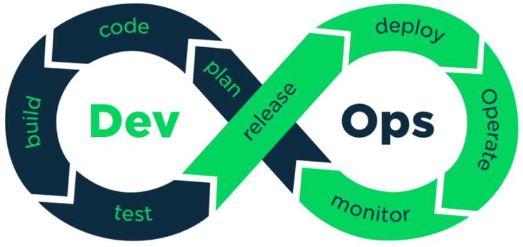
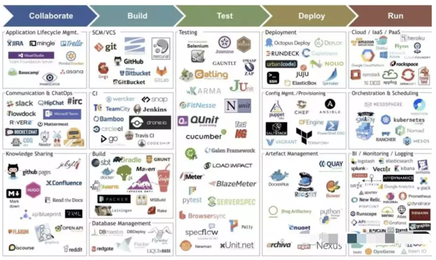
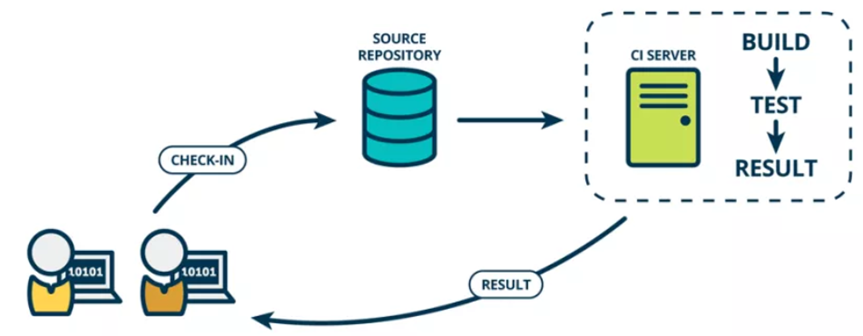
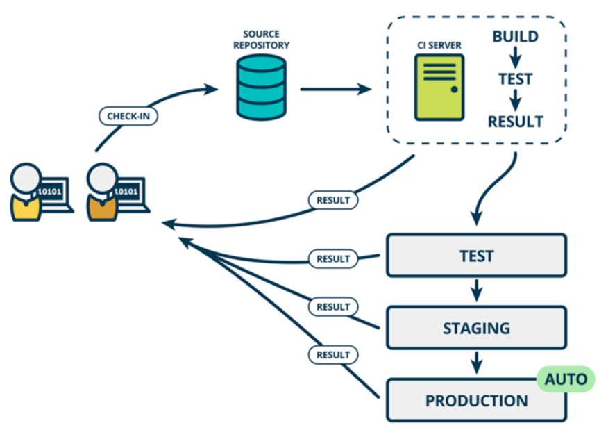
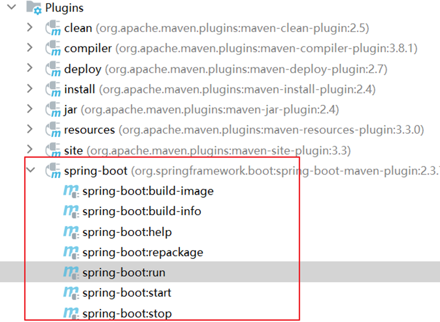
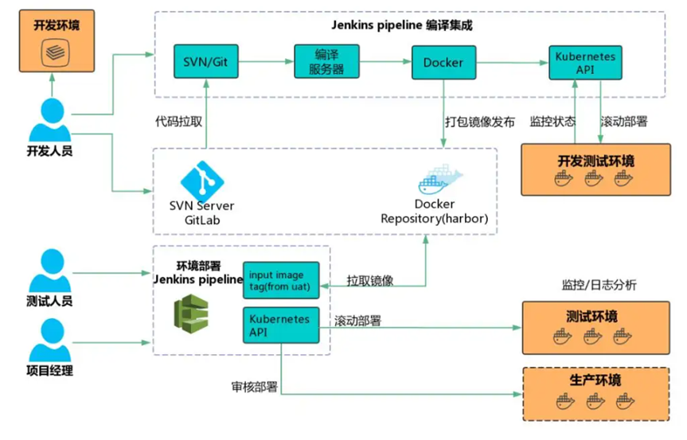
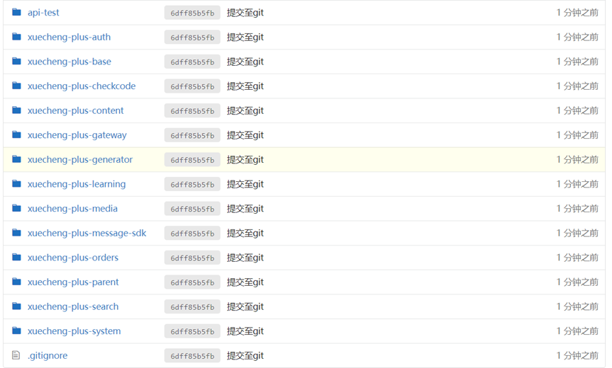
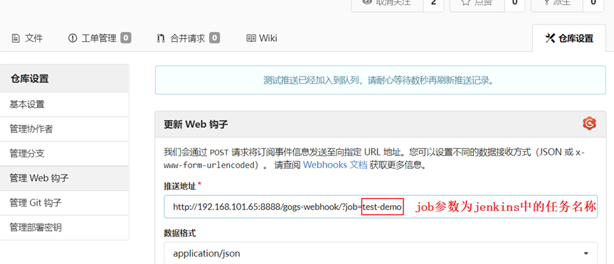
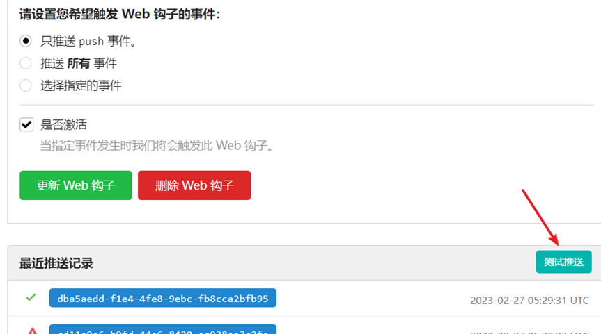
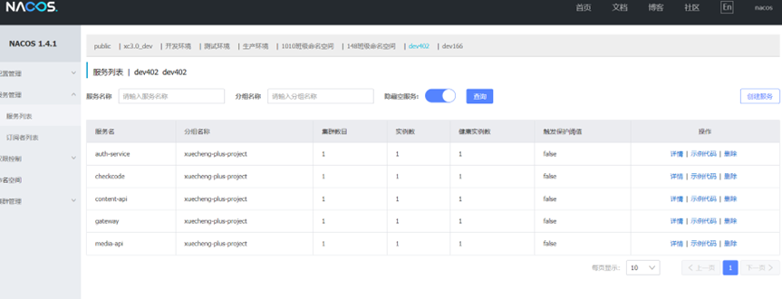

# **第 7 章 项目部署 v3.1**

[[TOC]]

## **1 什么是 DevOps**

一个软件的生命周期包括：需求分析阶、设计、开发、测试、上线、维护、升级、废弃。

通过示例说明如下：

1、产品人员进行需求分析

2、设计人员进行软件架构设计和模块设计。

3、每个模块的开发人员并行开发，设计接口、进行编码，并进行单元测试

4、开发完毕，将代码集成部署到测试服务器，测试人员进行测试。

5、测试人员发现 bug，提交 bug、开发人员修改 bug

6、bug 修改完毕再次集成、测试。

7、测试完毕，项目上线。

8、运维人员进行安装部署、培训。

9、用户提出问题，返回给运维人员。

10、运维人员反馈给开发人员，开发人员进行问题处理。

11、再次提交测试。

12、测试完毕再次部署升级。

....

最后软件下线。

所以，在整体生命周期中比较核心的两个阶段是：开发阶段、维护阶段，开发阶段的成果是软件开发完成并成功上线，运维阶段则负责对软件进行维护和升级，而运维阶段通常在一个软件 的生命周期中占比最多。

提高开发阶段、运维阶段的工作效率是企业在进行软件项目管理的重点。

因此，专家提出了 DevOps，DevOps 是什么呢？

下边是摘自百度百科的定义：

DevOps（Development 和 Operations 的组合词）是一组过程、方法与系统的统称，用于促进开发（[应用程序](https://baike.baidu.com/item/%E5%BA%94%E7%94%A8%E7%A8%8B%E5%BA%8F/5985445?fromModule=lemma_inlink)/软件工程）、技术运营和质量保障（[QA](https://baike.baidu.com/item/QA/476016?fromModule=lemma_inlink)）部门之间的沟通、协作与整合。

它是一种重视“[软件开发](https://baike.baidu.com/item/%E8%BD%AF%E4%BB%B6%E5%BC%80%E5%8F%91/3448966?fromModule=lemma_inlink)人员（Dev）”和“[IT 运维](https://baike.baidu.com/item/IT%E8%BF%90%E7%BB%B4/5727814?fromModule=lemma_inlink)技术人员（Ops）”之间沟通合作的文化、运动或惯例。透过自动化“[软件交付](https://baike.baidu.com/item/%E8%BD%AF%E4%BB%B6%E4%BA%A4%E4%BB%98/638479?fromModule=lemma_inlink)”和“架构变更”的流程，来使得构建、测试、发布软件能够更加地快捷、频繁和可靠。

它的出现是由于软件行业日益清晰地认识到：为了按时交付[软件产品](https://baike.baidu.com/item/%E8%BD%AF%E4%BB%B6%E4%BA%A7%E5%93%81/6800028?fromModule=lemma_inlink)和服务，开发和运维工作必须紧密合作。


DevOps 是一个工具吗？

DevOps 是一个工作职位吗？

都不是。

DevOps 是一种思想理念，它涵盖开发、测试、运维的整个过程。DevOps 追求的目标是提高软件开发、测试、运维、运营等各部门的沟通与协作质量，DevOps 强调软件开发人员与软件测试、软件运维、质量保障（QA）部门之间有效的沟通与协作，强调通过自动化的方法去管理软件变更、软件集成，使软件从构建到测试、发布更加快捷、可靠，最终按时交付软件。



## **2 什么是 CI/CD**

如何来落地实现 DevOps 呢？

DevOps 兴起于 2009 年，近年来由于云计算、互联网的发展，促进了 DevOps 的基础设施及工具链的发展，涌现了一大批优秀的工具，这些工具包括开发、测试、运维的各各领域，例如：GitHub、Docker、Jenkins、Hudson、K8S、Ant/Maven/Gradle、Selenium、QUnit、JMeter 等。下图是 DevOps 相关的工具集：



好的工具有利于 DevOps 的实施，但并不代表实施 DevOps 就一定需要去引入一堆工具。

问题的关键：如何解决问题，而不是具体应用工具。

CI/CD 是近年来企业有效实施 DevOps 的具体方案。

CI/CD 包含了一个 CI 和两个 CD，CI 全称 Continuous Integration，表示持续集成，CD 包含 Continuous Delivery 和 Continuous Deployment，分别是持续交付和持续部署，三者具有前后依赖关系。

CI 持续集成：

持续集成倡导团队成员需要频繁的集成他们的工作，将开发分支合并到主分支，每次集成都通过自动化构建（包括编译、构建、自动化测试）来验证，从而尽快地发现集成中的错误，让产品可以快速迭代，同时还能保持高质量。



CD 持续交付:

持续交付将集成后的代码部署到类生产环境(预发布)，除了交付到类生产环境之外，还会执行一些集成测试、API 测试。持续交付强调的是“交付”，交付给测试、产品验收，不管怎么更新，软件是随时随地可以交付的。


CD 持续部署：

在持续交付的基础上由开发人员或运维人员自助式的定期向生产环境部署稳定的构建版本，持续部署的目标是代码在任何时刻都是可部署的，并可自动进入到生产环境。



## **3 DevOps 实战**

### **3.1 技术方案**

下图是比较流行的一种 CI/CD 的技术方案：


下边我们参考该技术方案将学成在线项目使用 Docker 进行部署。

本次项目部署实战旨在理解 CI/CD 的流程，考虑 Kubernates 的复杂性课堂上我们用 Jenkins 代替 Kubernates 完成容器部署。

### **3.2 准备环境**

准备一台 Centos7 虚拟机，安装 Docker、jdk、maven，通过 Docker 容器安装 jenkins、Docker 私服软件，其它软件为学成在线项目所需要的，如下：

|               |                    |        |
| ------------- | ------------------ | ------ |
| Mysql         | 8.x                | docker |
| nacos         | 1.4.1              | docker |
| rabbitmq      | 3.8.34             | docker |
| redis         | 6.2.7              | docker |
| xxl-job-admin | 2.3.1              | docker |
| minio         | RELEASE.2022-09-07 | docker |
| elasticsearch | 7.12.1             | docker |
| kibana        | 7.12.1             | docker |
| gogs          | 0.13.0             | docker |
| nginx         | 1.12.2             | docker |

在课堂资料中提供了安装以上软件的虚拟机，使用 VMware 导入即可使用。

### **3.3 人工部署方式**

如果不使用 CI/CD 则需要人工手动对工程进行测试、打包、部署。使用 CI/CD 后通过自动化的工具去完成。

下边先演示手动部署方式，之后采用工具进行部署。

#### **3.3.1 项目打包**

1、在父工程聚合各模块

首先在父工程添加 models，聚合各各模块

```xml

<modules>
    <module>../xuecheng-plus-base</module>
    <module>../xuecheng-plus-checkcode</module>
    <module>../xuecheng-plus-gateway</module>
    <module>../xuecheng-plus-auth</module>
    <module>../xuecheng-plus-content</module>
    <module>../xuecheng-plus-learning</module>
    <module>../xuecheng-plus-media</module>
    <module>../xuecheng-plus-orders</module>
    <module>../xuecheng-plus-message-sdk</module>
    <module>../xuecheng-plus-search</module>
    <module>../xuecheng-plus-system</module>
</modules>

```

2、配置打包插件

使用 springboot 打包插件进行打包，在需要打可执行包的工程中配置 spring-boot-maven-plugin 插件否则报 “jar 中没有主清单属性” 。

注意：在要打可执行 jar 包的工程中配置该插件。

```xml
<!--    springboot打包插件   -->
<build>
    <finalName>${project.artifactId}-${project.version}</finalName>
    <plugins>
        <plugin>
            <groupId>org.springframework.boot</groupId>
            <artifactId>spring-boot-maven-plugin</artifactId>
            <version>${spring-boot.version}</version>
            <executions>
                <execution>
                    <goals>
                        <goal>repackage</goal>
                    </goals>
                </execution>
            </executions>
        </plugin>
    </plugins>
</build>

```

说明：

配置了 springboot 打包插件即可在 maven 窗口显示如下：



功能说明：

build-info：生成项目的构建信息文件 build-info.properties

repackage：这个是默认 goal，在 mvn package 执行之后，这个命令再次打包生成可执行的 jar，同时将 mvn package 生成的 jar 重命名为 \*.origin

run：这个可以用来运行 Spring Boot 应用

start：这个在 mvn integration-test 阶段，进行 Spring Boot 应用生命周期的管理

stop：这个在 mvn integration-test 阶段，进行 Spring Boot 应用生命周期的管理

在父工程执行：clean install -DskipTests -f pom.xml 对所有工程进行打包

打包完成可在本地通过 java -jar 运行 jar 包观察是否可以正常运行。

下边测试验证码服务：

进入验证码服务的 target 目录，cmd 运行：

java -Dfile.encoding=utf-8 -jar xuecheng-plus-checkcode-0.0.1-SNAPSHOT.jar

如下图：


使用 httpclient 测试申请验证码：

```http

#### 申请验证码
POST localhost:63075/checkcode/pic

```

**3.3.2 部署到 Linux**

将打成的 jar 包拷贝到 Linux，生成镜像，并创建容器。

1、编写 Dockerfile 文件

```dockerfile

FROM java:8u20
MAINTAINER docker_maven docker_maven@email.com
WORKDIR /ROOT
ADD xuecheng-plus-checkcode-0.0.1-SNAPSHOT.jar xuecheng-plus-checkcode.jar
CMD ["java", "-version"]
ENTRYPOINT ["java", "-Dfile.encoding=utf-8","-jar", "xuecheng-plus-checkcode.jar"]
EXPOSE 63075


```

2、创建镜像

```shell

docker build -t checkcode:1.0 .

```

创建成功，查询镜像:


3、创建容器

```shell

docker run --name xuecheng-plus-checkcode -p 63075:63075 -idt checkcode:1.0

```

再次测试

```http

#### 申请验证码
POST 192.168.101.65:63075/checkcode/pic

```

### **3.5 自动部署**

#### **3.5.1 实战流程**

下边使用 jenkins 实现 CI/CD 的流程。



1、将代码 使用 Git 托管

2、在 jenkins 创建任务，从 Git 拉取代码。

3、拉取代码后进行自动构建：测试、打包、部署。

首先将代码打成镜像包上传到 docker 私服。

自动创建容器、启动容器。

4、当有代码 push 到 git 实现自动构建。

#### **3.5.2 代码提交至 Git**



#### **3.5.3 修改 pom.xml 文件**

在 pom.xml 添加 docker-maven-plugin 插件实现将 springboot 工程创建镜像， 此 pom.xml 添加 docker-maven-plugin 插件用于生成镜像。

分别修改 system-api、content-api、media-api、gateway、auth、checkcode 服务的 pom.xml 文件。

插件的坐标如下：

```xml

<dependency>
    <groupId>com.spotify</groupId>
    <artifactId>docker-maven-plugin</artifactId>
    <version>1.2.2</version>
</dependency>

```

修改 pom.xml 文件，以 xuecheng-plus-checkcode 为例，如下：

```xml

<build>
    <finalName>${project.artifactId}-${project.version}</finalName>
    <plugins>
        <plugin>
            <groupId>org.springframework.boot</groupId>
            <artifactId>spring-boot-maven-plugin</artifactId>
            <version>${spring-boot.version}</version>
            <executions>
                <execution>
                    <goals>
                        <goal>repackage</goal>
                    </goals>
                </execution>
            </executions>
        </plugin>
        <plugin>
            <groupId>com.spotify</groupId>
            <artifactId>docker-maven-plugin</artifactId>
            <version>1.2.2</version>
            <configuration>
                <!--修改imageName节点的内容，改为私有仓库地址和端口，再加上镜像id和 TAG,我们要直接传到私服-->
                <!--配置最后生成的镜像名，docker images里的，我们这边取项目名:版本-->
                <!--<imageName>${project.artifactId}:${project.version}</imageName>-->
                <imageName>192.168.101.65:5000/${project.artifactId}:${project.version}</imageName>
                <!--也可以通过以下方式定义image的tag信息。 -->
                <!-- <imageTags>
                     <imageTag>${project.version}</imageTag>
                     &lt;!&ndash;build 时强制覆盖 tag，配合 imageTags 使用&ndash;&gt;
                     <forceTags>true</forceTags>
                     &lt;!&ndash;build 完成后，push 指定 tag 的镜像，配合 imageTags 使用&ndash;&gt;
                     <pushImageTag>true</pushImageTag>
                 </imageTags>-->
                <baseImage>java:8u20</baseImage>
                <maintainer>docker_maven docker_maven@email.com</maintainer>
                <workdir>/root</workdir>
                <cmd>["java", "-version"]</cmd>
                <!--来指明Dockerfile文件的所在目录，如果配置了dockerDirectory则忽略baseImage，maintainer等配置-->
                <!--<dockerDirectory>./</dockerDirectory>-->
                <!--2375是docker的远程端口，插件生成镜像时连接docker，这里需要指定docker远程端口-->
                <dockerHost>http://192.168.101.65:2375</dockerHost>
                <!--入口点，project.build.finalName就是project标签下的build标签下 的filename标签内容，testDocker-->
                <!--相当于启动容器后，会自动执行java -jar ...-->
                <entryPoint>["java", "-Dfile.encoding=utf-8","-jar", "/root/${project.build.finalName}.jar"]</entryPoint>
                <!--是否推送到docker私有仓库，旧版本插件要配置maven的settings文件。 -->
                <pushImage>true</pushImage>
                <registryUrl>192.168.101.65:5000</registryUrl>  <!-- 这里是复制 jar 包到 docker 容器指定目录配置 -->
                <resources>
                    <resource>
                        <targetPath>/root</targetPath>
                        <directory>${project.build.directory}</directory>
                        <!--把哪个文件上传到docker，相当于Dockerfile里的add app.jar /-->
                        <include>${project.build.finalName}.jar</include>
                    </resource>
                </resources>
            </configuration>
        </plugin>
    </plugins>
</build>

```

其中 system-api 服务的 bootstrap.yml 修改如下：

```yaml
server:
  servlet:
    context-path: /system
  port: 63110
##微服务配置
spring:
  application:
    name: system-api
  datasource:
    driver-class-name: com.mysql.cj.jdbc.Driver
    url: jdbc:mysql://192.168.101.65:3306/xcplus_system?serverTimezone=UTC&userUnicode=true&useSSL=false&
    username: root
    password: mysql
  cloud:
    nacos:
      server-addr: 192.168.101.65:8848
      discovery:
        namespace: dev166
        group: xuecheng-plus-project
## 日志文件配置路径
logging:
  config: classpath:log4j2-dev.xml

## swagger 文档配置
swagger:
  title: '学成在线系统管理'
  description: '系统管理接口'
  base-package: com.xuecheng.system
  enabled: true
  version: 1.0.0
```

在 system-api 工程添加 nacos 的依赖：

```xml

<dependency>
    <groupId>com.alibaba.cloud</groupId>
    <artifactId>spring-cloud-starter-alibaba-nacos-discovery</artifactId>
</dependency>

```

删除 system-service 工程下的配置文件。

以上内容修改完毕再次提交 Git.

#### **3.5.4 自动构建测试**

找到 jenkins_02 任务，配置源码管理


配置完毕，开始构建


通过控制台输出日志观察构建情况


如果控制台有报错，根据错误信息进行调试。

部署成功后，进入服务器查看 docker 容器是否启动成功


**3.5.5 部署前端门户**

在虚拟机的 docker 中已经部署了 nginx，修改 nginx.conf 的配置文件

```javascript

##user  nobody;
worker_processes  1;

##error_log  logs/error.log;
##error_log  logs/error.log  notice;
##error_log  logs/error.log  info;

##pid        logs/nginx.pid;


events {
    worker_connections  1024;
}


http {
     server_names_hash_bucket_size 64;
     client_max_body_size 100M; # 设置客户端请求体最大值
     client_body_buffer_size 128k; # 设置请求体缓存区大小
    include       mime.types;
    default_type  application/octet-stream;

    #log_format  main  '$remote_addr - $remote_user [$time_local] "$request" '
    #                  '$status $body_bytes_sent "$http_referer" '
    #                  '"$http_user_agent" "$http_x_forwarded_for"';

    #access_log  logs/access.log  main;

    sendfile        on;
    #tcp_nopush     on;

    #keepalive_timeout  0;
    keepalive_timeout  65;
   #文件服务
  upstream fileserver{
    server 192.168.101.65:9000 weight=10;
  }
     #后台网关
  upstream gatewayserver{
    server 192.168.101.65:63010 weight=10;
  }
    #gzip  on;

    server {
        listen       80;
        server_name  www.51xuecheng.cn localhost;
        #rewrite ^(.*) https://$server_name$1 permanent;
        #charset koi8-r;
        ssi on;
        ssi_silent_errors on;
        #access_log  logs/host.access.log  main;

        location / {
            alias   /etc/nginx/html/;
            index  index.html index.htm;
        }
        #api
        location /api/ {
                proxy_pass http://gatewayserver/;
        }
        #静态资源
        location /static/img/ {
                alias  /etc/nginx/html/img/;
        }
        location /static/css/ {
                alias   /etc/nginx/html/css/;
        }
        location /static/js/ {
                alias   /etc/nginx/html/js/;
        }
        location /static/plugins/ {
                alias   /etc/nginx/html/plugins/;
                add_header Access-Control-Allow-Origin http://ucenter.51xuecheng.cn;
                add_header Access-Control-Allow-Credentials true;
                add_header Access-Control-Allow-Methods GET;
        }
        location /plugins/ {
                alias   /etc/nginx/html/plugins/;
        }
        location /course/preview/learning.html {
                alias /etc/nginx/html/course/learning.html;
        }
        location /course/search.html {
                root   /etc/nginx/html;
        }
        location /course/learning.html {
                root   /etc/nginx/html;
        }
        location /course/ {
                proxy_pass http://fileserver/mediafiles/course/;
        }
        #openapi
        location /open/content/ {
                proxy_pass http://gatewayserver/content/open/;
        }
        location /open/media/ {
                proxy_pass http://gatewayserver/media/open/;
        }

        #error_page  404              /404.html;

        # redirect server error pages to the static page /50x.html
        #
        error_page   500 502 503 504  /50x.html;
        location = /50x.html {
            root   html;
        }

        # proxy the PHP scripts to Apache listening on 127.0.0.1:80
        #
        #location ~ \.php$ {
        #    proxy_pass   http://127.0.0.1;
        #}

        # pass the PHP scripts to FastCGI server listening on 127.0.0.1:9000
        #
        #location ~ \.php$ {
        #    root           html;
        #    fastcgi_pass   127.0.0.1:9000;
        #    fastcgi_index  index.php;
        #    fastcgi_param  SCRIPT_FILENAME  /scripts$fastcgi_script_name;
        #    include        fastcgi_params;
        #}

        # deny access to .htaccess files, if Apache's document root
        # concurs with nginx's one
        #
        #location ~ /\.ht {
        #    deny  all;
        #}
    }

   server {
        listen       80;
        server_name  file.51xuecheng.cn;
        #charset koi8-r;
        ssi on;
        ssi_silent_errors on;
        #access_log  logs/host.access.log  main;
        location /video {
            proxy_pass   http://fileserver;
        }

        location /mediafiles {
            proxy_pass   http://fileserver;
        }
   }

   server {
        listen       80;
        server_name  teacher.51xuecheng.cn;
        #charset koi8-r;
        ssi on;
        ssi_silent_errors on;
        #access_log  logs/host.access.log  main;
        location / {
            alias   /etc/nginx/html/dist/;
            index  index.html index.htm;
        }
        #location / {
        #    proxy_pass   http://uidevserver;
        #}

        location /api/ {
                proxy_pass http://gatewayserver/;
        }


   }

    server {
        listen       80;
        server_name  ucenter.51xuecheng.cn;
        #charset koi8-r;
        ssi on;
        ssi_silent_errors on;
        #access_log  logs/host.access.log  main;
        location / {
            alias   /etc/nginx/html/ucenter/;
            index  index.html index.htm;
        }
        location /include {
            proxy_pass   http://192.168.101.65;
        }
        location /img/ {
            proxy_pass   http://192.168.101.65/static/img/;
        }
        location /api/ {
                proxy_pass http://gatewayserver/;
        }
   }
    # another virtual host using mix of IP-, name-, and port-based configuration
    #
    #server {
    #    listen       8000;
    #    listen       somename:8080;
    #    server_name  somename  alias  another.alias;

    #    location / {
    #        root   html;
    #        index  index.html index.htm;
    #    }
    #}


    # HTTPS server
    #
    #server {
    #    listen       443 ssl;
    #    server_name  localhost;

    #    ssl_certificate      cert.pem;
    #    ssl_certificate_key  cert.key;

    #    ssl_session_cache    shared:SSL:1m;
    #    ssl_session_timeout  5m;

    #    ssl_ciphers  HIGH:!aNULL:!MD5;
    #    ssl_prefer_server_ciphers  on;

    #    location / {
    #        root   html;
    #        index  index.html index.htm;
    #    }
    #}

}


```

将前端门户的静态页面拷贝到 /data/soft/nginx/xuecheng_portal_static

启动 nginx 容器：

```shell
docker start nginx
```

修改本机 hosts 文件：

```sh

192.168.101.65   www.51xuecheng.cn 51xuecheng.cn ucenter.51xuecheng.cn teacher.51xuecheng.cn file.51xuecheng.cn

```

将本机的 nginx 服务停掉，访问www.51xuecheng.cn。

#### **3.5.6 部署机构端前端**

将机构端的前端工程打包，运行 yarn build

打包成功在工程目录生成 dist 目录

将此目录的内容拷贝到虚拟机的/data/soft/nginx/xuecheng_portal_static/dist

#### **3.5.7 配置触发器**

当向 gogs 提交代码时进行自动构建


在 gogs 配置钩子



推送地址设置 jenkins 的接口：

http://192.168.101.65:8888/gogs-webhook/?job=jenkins\_02

配置好可以测试一下：



测试后观察 jenkina 是否重新构建任务。

提交代码测试：

修改代码提交到 gogs，观察 jenkins 是否自动构建任务

### **3.6 功能测试**

#### **3.6.1 测试认证功能**

部署成功后对功能进行测试。

1、首先测试认证功能

进入www.51xuecheng.cn，点击登录，输入账号和密码进行登录。

账号和密码：t1/111111

#### **3.6.2 测试内容管理**

1、测试课程列表

出现 Request failed with status code 503 错误

通过 nacos 排查，进入服务列表

缺少 system-api



排查 system-api 工程的 bootstrap.yml 配置文件、依赖包等内容。

修改代码后重新提交 git

再次进行 jenkins 构建。

2、测试上传课程图片

首先测试修改课程，上传一个新图片。

3、测试课程发布

首先观察 xxl-job 调度中心是否成功注册执行器


启动课程发布任务

发布一门课程，观察 content-api 容器的日志

错误日志：

```java
java.io.FileNotFoundException: file:/root/xuecheng-plus-content-api-0.0.1-SNAPSHOT.jar!/BOOT-INF/classes!/templates does not exist.

```

无法找到静态化的模板

屏蔽原来的方式，改如下方式

```java

//            String classpath = this.getClass().getResource("/").getPath(); //打包jar无法获取模板
//            configuration.setDirectoryForTemplateLoading(new File(classpath + "/templates/"));
        //更改为如下方式
        configuration.setTemplateLoader(new ClassTemplateLoader(this.getClass().getClassLoader(),"/templates"));

```

#### **3.6.3 测试媒资管理**

1、配置 ffmpeg 的目录

将 linux 版本的 ffmpeg 拷贝到 /data/soft/service 下，在 nacos 配置 ffmpeg 的地址：

Ffmpeg linux 版本下载地址：https://johnvansickle.com/ffmpeg/

```yaml
videoprocess:
  ffmpegpath: /root/soft/ffmpeg
```

2、测试上传视频
