# **第 8 章 项目优化 3.1**

[[TOC]]

## **1 优化需求**

视频播放页面用户未登录也可以访问，当用户观看试学课程时需要请求服务端查询数据，接口如下：

1、根据课程 id 查询课程信息。

2、根据文件 id 查询视频信息。

这些接口在用户未认证状态下也可以访问，如果接口的性能不高，当高并发到来很可能耗尽整个系统的资源，将整个系统压垮，所以特别需要对这些暴露在外边的接口进行优化。

下边对 根据课程 id 查询课程信息 接口进行优化，下边的内容将此接口简称为课程查询接口。

接口地址：http://www.51xuecheng.cn/open/content/course/whole/{courseId}

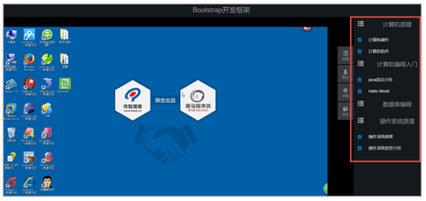

## **2 压力测试**

### **2.1 性能指标**

对接口进行优化之前需要对接口进行压力测试，不仅接口需要压力测试，整个微服务在发布前也是需要经历压力测试的，因为压力测试可以暴露功能测试所发现不了的问题。

功能测试即是对系统的功能按用户需求进行测试，比如：添加一门课程，根据需求文档先准备测试数据，再通过前端界面将一门课程添加到系统，测试是否可以操作成功。整个过程就是测试软件是否可以实现用户的需求。

压力测试是通过测试工具制造大规模的并发请求去访问系统，测试系统是否经受住压力。

比如：一个在线学习网站，上线要求该网站可以支持 1 万用户同时在线，此时就需要模拟 1 万并发请求去访问网站的关键业务流程，比如：测试点播学习流程，测试系统是否可以抗住 1 万并发请求。

一些功能测试时无法发现的问题在压力测试时就会发现，比如：内存泄露、线程安全、IO 异常等问题。

压力测试常用的性能指标如下：

> 1、吞吐量

吞吐量是系统每秒可以处理的事务数，也称为 TPS（Transaction Per Second）。

比如：一次点播流程，从请求进入系统到视频画图显示出来这整个流程就是一次事务。

所以吞吐量并不是一次数据库事务，它是完成一次业务的整体流程。

> 2、响应时间

响应时间是指客户端请求服务端，从请求进入系统到客户端拿到响应结果所经历的时间。响应时间包括：最大响应时间、最小响应时间、平均响应时间。

> 3、每秒查询数

每秒查询数即 QPS（Queries-per-second），它是衡量查询接口的性能指标，比如：商品信息查询， 一秒可以请求该接口查询商品信息的次数就是 QPS。

拿查询接口举例，一次查询请求内部不会再去请求其它接口，此时 QPS=TPS

如果一次查询请求内容需要远程调用另一个接口查询数据，此时 QPS=2 \* TPS

> 4、错误率

错误率 是一批请求发生错误的请求占全部请求的比例。

不同的指标其要求不同，比如现在进行接口优化，优化后的接口响应时间应该越来越小，吞吐量越来越大，以及 QPS 值也是越大越好，错误率要保持在一个很小的范围。

另外除了关注这些性能指标以外还要关注系统的负载情况：

1、CPU 使用率，不高于 85%

2、内存利用率，不高于 85%

3、网络利用率，不高于 80%

4、磁盘 IO

磁盘 IO 的性能指标是 IOPS (Input/Output Per Second)即每秒的输入输出量(或读写次数)。

如果过大说明 IO 操作密集，IO 过大也会影响性能指标。

### **2.2 安装 Jmeter**

Apache JMeter 是 Apache 组织基于 Java 开发的压力测试工具，用于对软件做压力测试。

下载 Jmeter

https://jmeter.apache.org/download\_jmeter.cgi

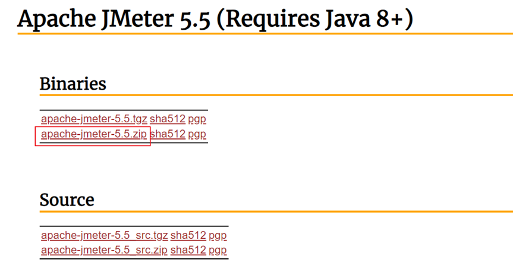

下载，解压，进入 bin 目录修改 jmeter.properties，设置中文和字体

```properties
language=zh_CN
jmeter.hidpi.mode=true
jmeter.hidpi.scale.factor=1.8
jsyntaxtextarea.font.family= Hack
jsyntaxtextarea.font.size=25
jmeter.toolbar.icons.size=32x32
jmeter.tree.icons.size=24x24

```

双击运行 bin 目录下的 jmeter.bat 文件。

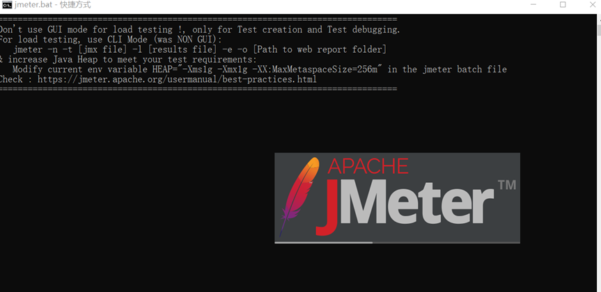

界面如下图：

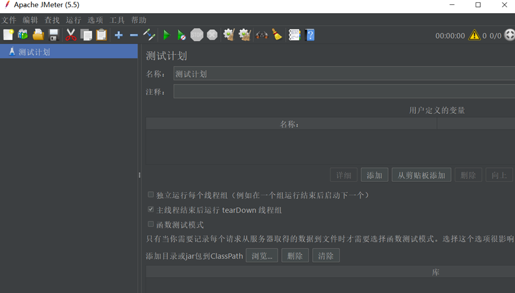

### 2.3 压力测试样本数：200 个线程，每个线程请求 100 次，共 20000 次

压力机：通常压力机是单独的客户端。

测试 gateway+content

吞吐量 180 左右

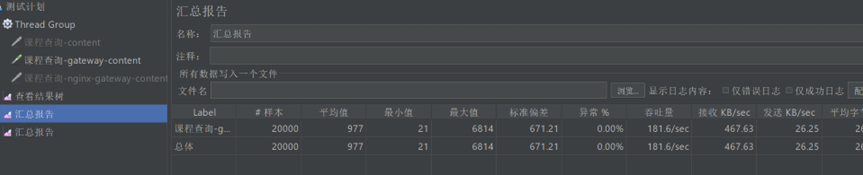

测试 content

吞吐量 300 左右

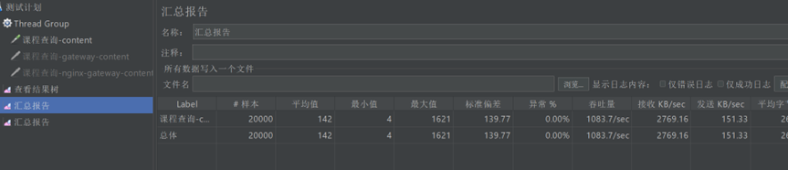

### **2.4 优化日志**

内容管理日志级别改为 info 级别.

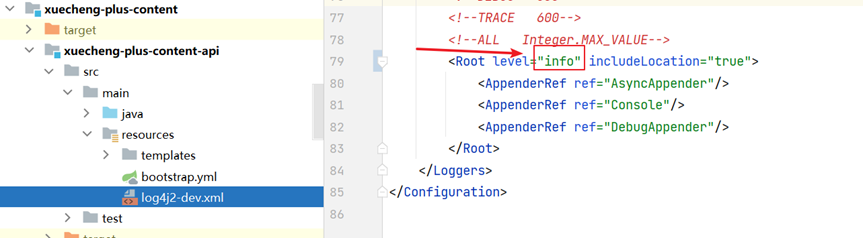

单独请求内容管理测试，吞吐量达到 1500 左右

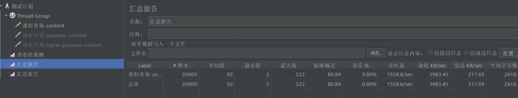

## **3 缓存优化**

### **3.1 redis 缓存**

测试用例是根据 id 查询课程信息，这里不存在复杂的 SQL，也不存在数据库连接不释放的问题，暂时不考虑数据库方面的优化。

课程发布信息的特点的是查询较多，修改很少，这里考虑将课程发布信息进行缓存。

课程信息缓存的流程如下：

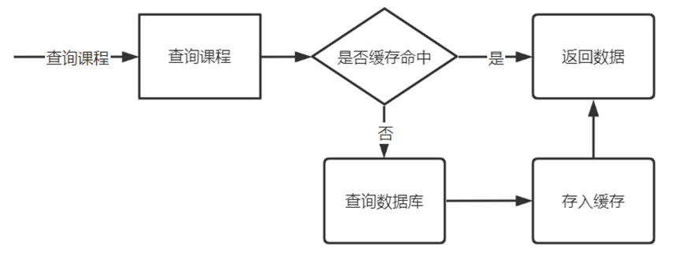

在 nacos 配置 redis-dev.yaml（group=xuecheng-plus-common）

```yaml
spring:
  redis:
    host: 192.168.101.65
    port: 6379
    password: redis
    database: 0
    lettuce:
      pool:
        max-active: 20
        max-idle: 10
        min-idle: 0
    timeout: 10000
```

在 content-api 微服务加载 redis-dev.yaml

```yaml
shared-configs:
  - data-id: redis-${spring.profiles.active}.yaml
    group: xuecheng-plus-common
    refresh: true
```

在 content-service 微服务中添加依赖

```xml
<dependency>
    <groupId>org.springframework.boot</groupId>
    <artifactId>spring-boot-starter-data-redis</artifactId>
</dependency>
<dependency>
    <groupId>org.apache.commons</groupId>
    <artifactId>commons-pool2</artifactId>
    <version>2.6.2</version>
</dependency>

```

定义查询缓存接口：

```Java

/**
 * @description 查询缓存中的课程信息
 * @param courseId
 * @return com.xuecheng.content.model.po.CoursePublish
 * @author Mr.M
 * @date 2022/10/22 16:15
*/
public CoursePublish getCoursePublishCache(Long courseId);

```

接口实现如下：

```java
public CoursePublish getCoursePublishCache(Long courseId){
    //查询缓存
   Object  jsonObj = redisTemplate.opsForValue().get("course:" + courseId);
    if(jsonObj!=null){
    String jsonString = jsonObj.toString();
        System.out.println("=================从缓存查=================");
        CoursePublish coursePublish = JSON.parseObject(jsonString, CoursePublish.class);
        return coursePublish;
    } else {
        System.out.println("从数据库查询...");
        //从数据库查询
        CoursePublish coursePublish = getCoursePublish(courseId);
        if(coursePublish!=null){
            redisTemplate.opsForValue().set("course:" + courseId, JSON.toJSONString(coursePublish));
        }
        return coursePublish;
    }
}
}

```

修改 controller 接口调用代码

```java
@ApiOperation("获取课程发布信息")
    @ResponseBody
    @GetMapping("/course/whole/{courseId}")
    public CoursePreviewDto getCoursePublish(@PathVariable("courseId") Long courseId) {
        //查询课程发布信息
        CoursePublish coursePublish = coursePublishService.getCoursePublishCache(courseId);
//        CoursePublish coursePublish = coursePublishService.getCoursePublish(courseId);
        if(coursePublish==null){
            return new CoursePreviewDto();
        }

        //课程基本信息
        CourseBaseInfoDto courseBase = new CourseBaseInfoDto();
        BeanUtils.copyProperties(coursePublish, courseBase);
        //课程计划
        List<TeachplanDto> teachplans = JSON.parseArray(coursePublish.getTeachplan(), TeachplanDto.class);
        CoursePreviewDto coursePreviewInfo = new CoursePreviewDto();
        coursePreviewInfo.setCourseBase(courseBase);
        coursePreviewInfo.setTeachplans(teachplans);
        return coursePreviewInfo;
    }

```

重新测试请求内容管理服务课程查询接口。

吞吐量达到 2700 左右，增加了近一倍。

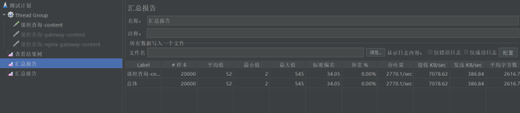

### **3.2 缓存穿透问题**

#### **3.2.1 什么是缓存穿透**

使用缓存后代码的性能有了很大的提高，虽然性能有很大的提升但是控制台打出了很多“从数据库查询”的日志，明明判断了如果缓存存在课程信息则从缓存查询，为什么要有这么多从数据库查询的请求的？

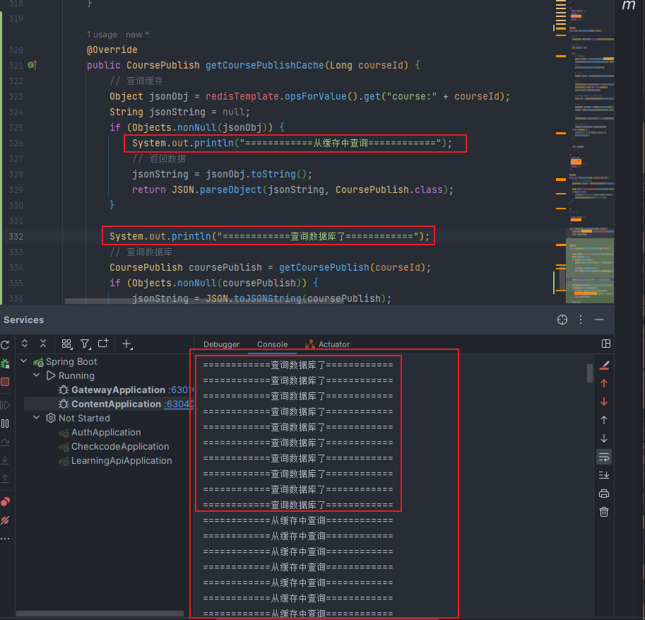

**这是因为并发数高，很多线程会同时到达查询数据库代码处去执行。**

我们分析下代码：

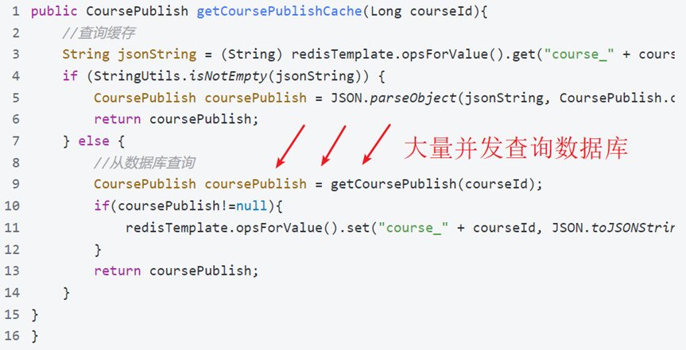

如果存在恶意攻击的可能，如果有大量并发去查询一个不存在的课程信息会出现什么问题呢？

比如去请求/content/course/whole/181，查询 181 号课程，该课程并不在课程发布表中。

进行压力测试发现会去请求数据库。

大量并发去访问一个数据库不存在的数据，由于缓存中没有该数据导致大量并发查询数据库，这个现象要缓存穿透。


缓存穿透可以造成数据库瞬间压力过大，连接数等资源用完，最终数据库拒绝连接不可用。

#### **3.2.2 解决缓存穿透**

如何解决缓存穿透?

1、对请求增加校验机制

比如：课程 Id 是长整型，如果发来的不是长整型则直接返回。

2、使用布隆过滤器

什么是布隆过滤器，以下摘自百度百科：

布隆过滤器可以用于检索一个元素是否在一个集合中。如果想要判断一个元素是不是在一个集合里，一般想到的是将所有元素保存起来，然后通过比较确定。[链表](https://baike.baidu.com/item/%E9%93%BE%E8%A1%A8/9794473?fromModule=lemma_inlink)，树等等数据结构都是这种思路. 但是随着集合中元素的增加，我们需要的存储空间越来越大，[检索速度](https://baike.baidu.com/item/%E6%A3%80%E7%B4%A2%E9%80%9F%E5%BA%A6/20807841?fromModule=lemma_inlink)也越来越慢(O(n),O(logn))。不过世界上还有一种叫作散列表（又叫[哈希表](https://baike.baidu.com/item/%E5%93%88%E5%B8%8C%E8%A1%A8/5981869?fromModule=lemma_inlink)，Hash table）的数据结构。它可以通过一个 Hash 函数将一个元素映射成一个位阵列（Bit array）中的一个点。这样一来，我们只要看看这个点是不是 1 就可以知道集合中有没有它了。这就是布隆过滤器的基本思想。

布隆过滤器的特点是，高效地插入和查询，占用空间少；查询结果有不确定性，如果查询结果是存在则元素不一定存在，如果不存在则一定不存在；另外它只能添加元素不能删除元素，因为删除元素会增加误判率。

> 比如：将商品 id 写入布隆过滤器，如果分 3 次 hash 此时在布隆过滤器有 3 个点，当从布隆过滤器查询该商品 id，通过 hash 找到了该商品 id 在过滤器中的点，此时返回 1，如果找不到一定会返回 0。

所以，为了避免缓存穿透我们需要缓存预热将要查询的课程或商品信息的 id 提前存入布隆过滤器，添加数据时将信息的 id 也存入过滤器，当去查询一个数据时先在布隆过滤器中找一下如果没有到到就说明不存在，此时直接返回。

实现方法有：

Google 工具包 Guava 实现。

redisson 。

2、缓存空值或特殊值

请求通过了第一步的校验，查询数据库得到的数据不存在，此时我们仍然去缓存数据，缓存一个空值或一个特殊值的数据。

但是要注意：如果缓存了空值或特殊值要设置一个短暂的过期时间。

```java
public CoursePublish getCoursePublishCache(Long courseId) {

    //查询缓存
   Object  jsonObj = redisTemplate.opsForValue().get("course:" + courseId);
    if(jsonObj!=null){
    String jsonString = jsonObj.toString();
        if(jsonString.equals("null"))
            return null;
        CoursePublish coursePublish = JSON.parseObject(jsonString, CoursePublish.class);
        return coursePublish;
    } else {
        //从数据库查询
        System.out.println("从数据库查询数据...");
        CoursePublish coursePublish = getCoursePublish(courseId);
        //设置过期时间300秒
        redisTemplate.opsForValue().set("course:" + courseId, JSON.toJSONString(coursePublish),30, TimeUnit.SECONDS);
        return coursePublish;
    }
}

```

再测试，虽然还存在个别请求去查询数据库，但不是所有请求都去查询数据库，基本上都命中缓存。

### **3.3 缓存雪崩**

#### **3.3.1 什么是缓存雪崩**

缓存雪崩是缓存中大量 key 失效后当高并发到来时导致大量请求到数据库，瞬间耗尽数据库资源，导致数据库无法使用。

造成缓存雪崩问题的原因是是大量 key 拥有了相同的过期时间，比如对课程信息设置缓存过期时间为 10 分钟，在大量请求同时查询大量的课程信息时，此时就会有大量的课程存在相同的过期时间，一旦失效将同时失效，造成雪崩问题。

#### **3.3.2 解决缓存雪崩**

如何解决缓存雪崩？

1、使用同步锁控制查询数据库的线程

使用同步锁控制查询数据库的线程，只允许有一个线程去查询数据库，查询得到数据后存入缓存。

```java
synchronized(obj){
  //查询数据库
  //存入缓存
}

```

2、对同一类型信息的 key 设置不同的过期时间

通常对一类信息的 key 设置的过期时间是相同的，这里可以在原有固定时间的基础上加上一个随机时间使它们的过期时间都不相同。

示例代码如下：

```Java

//设置过期时间300秒
redisTemplate.opsForValue().set("course:" + courseId, JSON.toJSONString(coursePublish),300+new Random().nextInt(100), TimeUnit.SECONDS);

```

3、缓存预热

不用等到请求到来再去查询数据库存入缓存，可以提前将数据存入缓存。使用缓存预热机制通常有专门的后台程序去将数据库的数据同步到缓存。

### **3.4 缓存击穿**

#### **3.4.1 什么是缓存击穿**

缓存击穿是指大量并发访问同一个热点数据，当热点数据失效后同时去请求数据库，瞬间耗尽数据库资源，导致数据库无法使用。

比如某手机新品发布，当缓存失效时有大量并发到来导致同时去访问数据库。

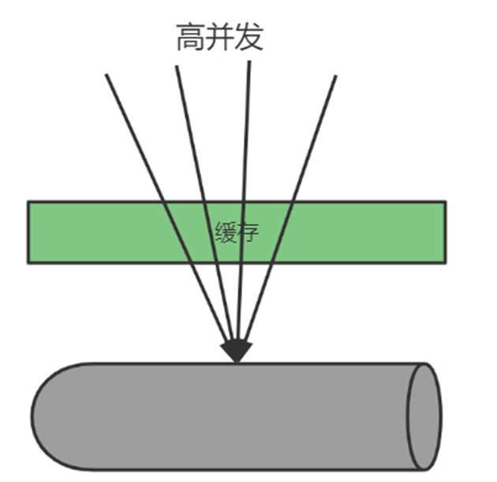

#### **3.4.2 解决缓存击穿**

如何解决缓存击穿？

1、使用同步锁控制查询数据库的线程

使用同步锁控制查询数据库的代码，只允许有一个线程去查询数据库，查询得到数据库存入缓存。

```java
synchronized(obj){
  //查询数据库
  //存入缓存
}

```

2、热点数据不过期

可以由后台程序提前将热点数据加入缓存，缓存过期时间不过期，由后台程序做好缓存同步。

下边使用 synchronized 对代码加锁。

```java
public  CoursePublish getCoursePublishCache(Long courseId){
    synchronized(this){ // 这里的this是当前实例 默认为单例bean
        //查询缓存
        String jsonString = (String) redisTemplate.opsForValue().get("course:" + courseId);
        if(StringUtils.isNotEmpty(jsonString)){
            if(jsonString.equals("null"))
                return null;
            CoursePublish coursePublish = JSON.parseObject(jsonString, CoursePublish.class);
            return coursePublish;
        }else{
            System.out.println("=========从数据库查询==========");
            //从数据库查询
            CoursePublish coursePublish = getCoursePublish(courseId);
           //设置过期时间300秒
        redisTemplate.opsForValue().set("course:" + courseId, JSON.toJSONString(coursePublish),300, TimeUnit.SECONDS);
            return coursePublish;
        }
    }

}

```

测试，吞吐量有 1300 左右

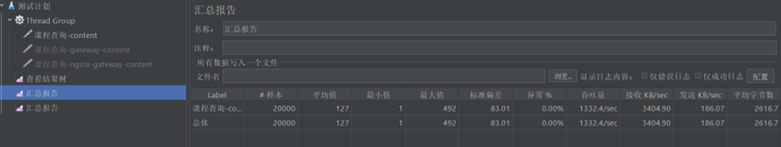

对上边的代码进行优化，对查询缓存的代码不用 synchronized 加锁控制，只对查询数据库进行加锁，如下：

```java
public  CoursePublish getCoursePublishCache(Long courseId){

        //查询缓存
         Object  jsonObj = redisTemplate.opsForValue().get("course:" + courseId);
         if(jsonObj!=null){
            String jsonString = jsonObj.toString();
            CoursePublish coursePublish = JSON.parseObject(jsonString, CoursePublish.class);
            return coursePublish;
        }else{
            synchronized(this){
                Object  jsonObj = redisTemplate.opsForValue().get("course:" + courseId);
                if(jsonObj!=null){
                   String jsonString = jsonObj.toString();
                    CoursePublish coursePublish = JSON.parseObject(jsonString, CoursePublish.class);
                    return coursePublish;
                }
                 System.out.println("=========从数据库查询==========");
                //从数据库查询
                CoursePublish coursePublish = getCoursePublish(courseId);
              //设置过期时间300秒
                redisTemplate.opsForValue().set("course:" + courseId, JSON.toJSONString(coursePublish),300, TimeUnit.SECONDS);
                return coursePublish;
            }
        }


}

```

测试，查询数据库只发生一次，整个测试过程的吞吐量在 3800 左右。

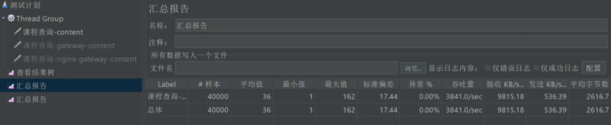

#### **3.4.3 小结**

1）缓存穿透：

去访问一个数据库不存在的数据无法将数据进行缓存，导致查询数据库，当并发较大就会对数据库造成压力。缓存穿透可以造成数据库瞬间压力过大，连接数等资源用完，最终数据库拒绝连接不可用。

解决的方法：

缓存一个 null 值。

使用布隆过滤器。

2）缓存雪崩：

缓存中大量 key 失效后当高并发到来时导致大量请求到数据库，瞬间耗尽数据库资源，导致数据库无法使用。

造成缓存雪崩问题的原因是是大量 key 拥有了相同的过期时间。

解决办法：

使用同步锁控制

对同一类型信息的 key 设置不同的过期时间，比如：使用固定数+随机数作为过期时间。

3）缓存击穿

大量并发访问同一个热点数据，当热点数据失效后同时去请求数据库，瞬间耗尽数据库资源，导致数据库无法使用。

解决办法：

使用同步锁控制

设置 key 永不过期

无中生有是穿透，布隆过滤 null 隔离。  
缓存击穿 key 过期， 锁与非期解难题。  
大量过期成雪崩，过期时间要随机。  
面试必考三兄弟，可用限流来保底。

限流技术方案：

alibaba/Sentinel

nginx+Lua

### **3.5 分布式锁**

#### **3.5.1 本地锁的问题**

上边的程序使用了同步锁解决了缓存击穿、缓存雪崩的问题，保证同一个 key 过期后只会查询一次数据库。

如果将同步锁的程序分布式部署在多个虚拟机上则无法保证同一个 key 只会查询一次数据库，如下图：

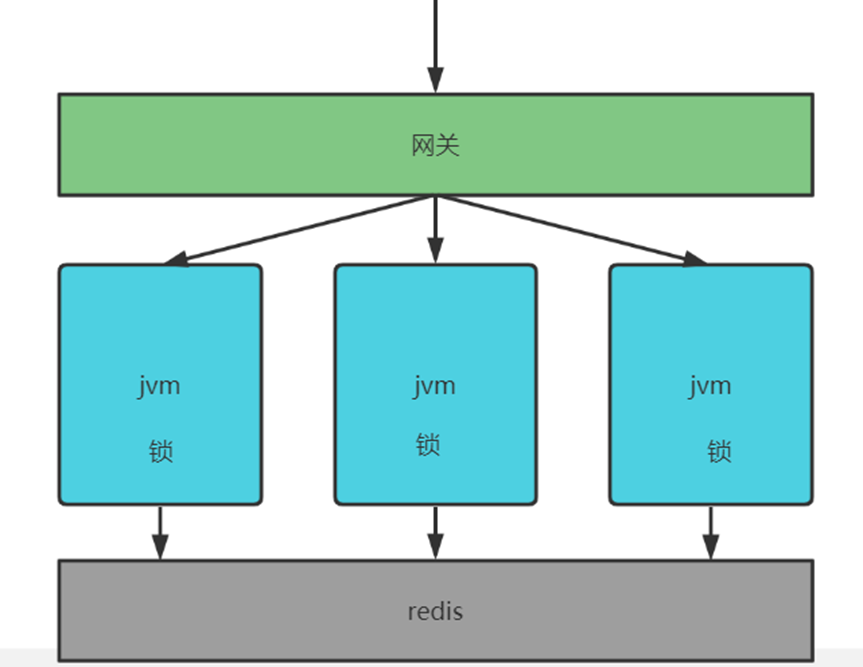

一个同步锁程序只能保证同一个虚拟机中多个线程只有一个线程去数据库，如果高并发通过网关负载均衡转发给各个虚拟机，此时就会存在多个线程去查询数据库情况，因为虚拟机中的锁只能保证该虚拟机自己的线程去同步执行，无法跨虚拟机保证同步执行。

我们将虚拟机内部的锁叫本地锁，本地锁只能保证所在虚拟机的线程同步执行。

下边进行测试：

启动三个内容管理服务：

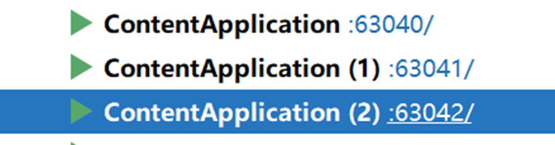

通过网关访问课程查询，网关通过负载均衡将请求转发给三个服务。

通过测试发现，有两个服务各有一次数据库查询，这说明本地锁无法跨虚拟机保证同步执行。

#### **3.5.2 什么是分布锁**

本地锁只能控制所在虚拟机中的线程同步执行，现在要实现分布式环境下所有虚拟机中的线程去同步执行就需要让多个虚拟机去共用一个锁，虚拟机可以分布式部署，锁也可以分布式部署，如下图：

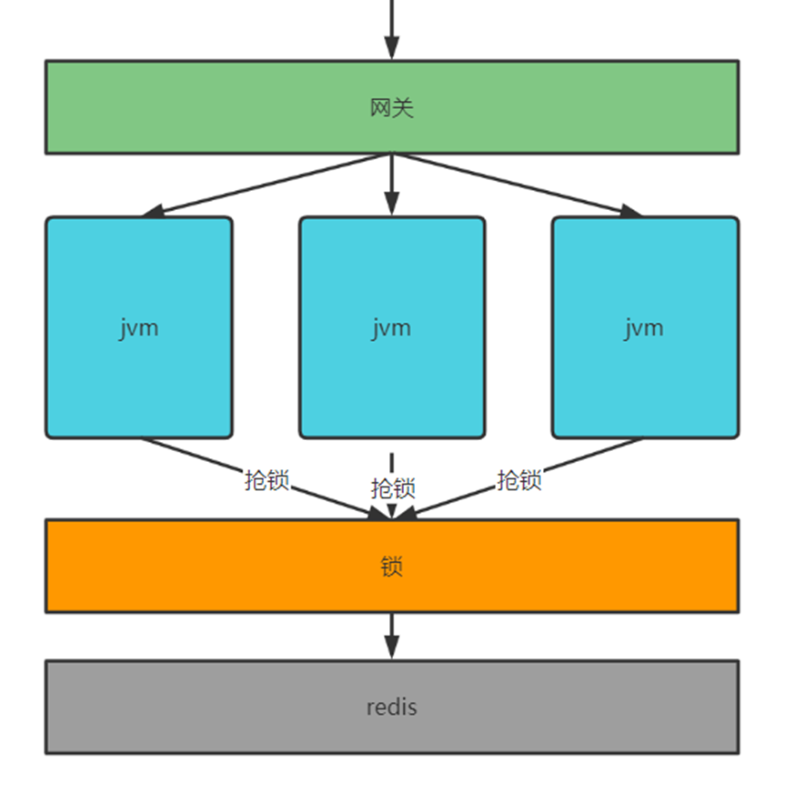

虚拟机都去抢占同一个锁，锁是一个单独的程序提供加锁、解锁服务，谁抢到锁谁去查询数据库。

该锁已不属于某个虚拟机，而是分布式部署，由多个虚拟机所共享，这种锁叫分布式锁。

#### **3.5.3 分布式锁的实现方案**

实现分布式锁的方案有很多，常用的如下：

1、基于数据库实现分布锁

利用数据库主键唯一性的特点，或利用数据库唯一索引的特点，多个线程同时去插入相同的记录，谁插入成功谁就抢到锁。

2、基于 redis 实现锁

redis 提供了分布式锁的实现方案，比如：SETNX、set nx、redisson 等。

拿 SETNX 举例说明，SETNX 命令的工作过程是去 set 一个不存在的 key，多个线程去设置同一个 key 只会有一个线程设置成功，设置成功的的线程拿到锁。

3、使用 zookeeper 实现

zookeeper 是一个分布式协调服务，主要解决分布式程序之间的同步的问题。zookeeper 的结构类似的文件目录，多线程向 zookeeper 创建一个子目录(节点)只会有一个创建成功，利用此特点可以实现分布式锁，谁创建该结点成功谁就获得锁。

#### **3.5.4 Redis NX 实现分布式锁**

redis 实现分布式锁的方案可以在 redis.cn 网站查阅，地址http://www.redis.cn/commands/set.html

使用命令： SET resource-name anystring NX EX max-lock-time 即可实现。

NX：表示 key 不存在才设置成功。

EX：设置过期时间

这里启动三个 ssh 客户端，连接 redis: docker exec -it redis redis-cli

先认证: auth redis

同时向三个客户端发送测试命令如下：

表示设置 lock001 锁，value 为 001，过期时间为 30 秒

```java
SET lock001 001 NX EX 30

```

命令发送成功，观察三个 ssh 客户端发现只有一个设置成功，其它两个设置失败，设置成功的请求表示抢到了 lock001 锁。

如何在代码中使用 Set nx 去实现分布锁呢？

使用 spring-boot-starter-data-redis 提供的 api 即可实现 set nx。

添加依赖：

```xml

<dependency>
    <groupId>org.springframework.boot</groupId>
    <artifactId>spring-boot-starter-data-redis</artifactId>
</dependency>
<dependency>
    <groupId>org.apache.commons</groupId>
    <artifactId>commons-pool2</artifactId>
    <version>2.6.2</version>
</dependency>

```

添加依赖后，在 bean 中注入 restTemplate。

我们先分析一段伪代码如下：

```java
if(缓存中有){

  返回缓存中的数据
}else{

  获取分布式锁
  if(获取锁成功）{
       try{
         查询数据库
      }finally{
         释放锁
      }
  }

}

```

1、获取分布式锁

使用 redisTemplate.opsForValue().setIfAbsent(key,vaue)获取锁

这里考虑一个问题，当 set nx 一个 key/value 成功 1 后，这个 key(就是锁)需要设置过期时间吗？

如果不设置过期时间当获取到了锁却没有执行 finally 这个锁将会一直存在，其它线程无法获取这个锁。

所以执行 set nx 时要指定过期时间，即使用如下的命令

SET resource-name anystring NX EX max-lock-time

> 具体调用的方法是：redisTemplate.opsForValue().setIfAbsent(K var1, V var2, long var3, TimeUnit var5)

2、如何释放锁

释放锁分为两种情况：key 到期自动释放，手动删除。

1）key 到期自动释放的方法

因为锁设置了过期时间，key 到期会自动释放，但是会存在一个问题就是 查询数据库等操作还没有执行完时 key 到期了，此时其它线程就抢到锁了，最终重复查询数据库执行了重复的业务操作。

怎么解决这个问题？

可以将 key 的到期时间设置的长一些，足以执行完成查询数据库并设置缓存等相关操作。

如果这样效率会低一些，另外这个时间值也不好把控。

2）手动删除锁

如果是采用手动删除锁可能和 key 到期自动删除有所冲突，造成删除了别人的锁。

比如：当查询数据库等业务还没有执行完时 key 过期了，此时其它线程占用了锁，当上一个线程执行查询数据库等业务操作完成后手动删除锁就把其它线程的锁给删除了。

要解决这个问题可以采用删除锁之前判断是不是自己设置的锁，伪代码如下：

```java
if(缓存中有){

  返回缓存中的数据
}else{

  获取分布式锁: set lock 01 NX
  if(获取锁成功）{
       try{
         查询数据库
      }finally{
         if(redis.call("get","lock")=="01"){
            释放锁: redis.call("del","lock")
         }

      }
  }

}

```

以上代码第 11 行到 13 行非原子性，也会导致删除其它线程的锁。

查看文档上的说明：http://www.redis.cn/commands/set.html

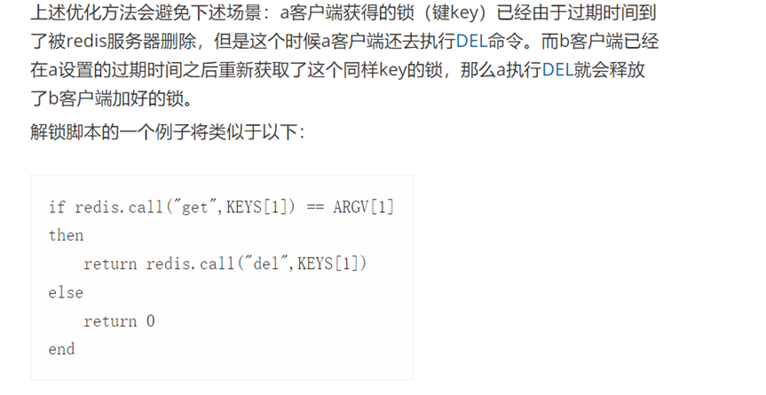

在调用 setnx 命令设置 key/value 时，每个线程设置不一样的 value 值，这样当线程去删除锁时可以先根据 key 查询出来判断是不是自己当时设置的 vlaue，如果是则删除。

这整个操作是原子的，实现方法就是去执行上边的 lua 脚本。

_Lua_ 是一个小巧的脚本语言，redis 在 2.6 版本就支持通过执行 Lua 脚本保证多个命令的原子性。

什么是原子性？

这些指令要么全成功要么全失败。

以上就是使用 Redis Nx 方式实现分布式锁，为了避免删除别的线程设置的锁需要使用 redis 去执行 Lua 脚本的方式去实现，这样就具有原子性，但是过期时间的值设置不存在不精确的问题。

#### **3.5.5 Redisson 实现分布式锁**

##### **3.5.5.1 什么是 Redisson**

再查阅 文档http://www.redis.cn/commands/set.html

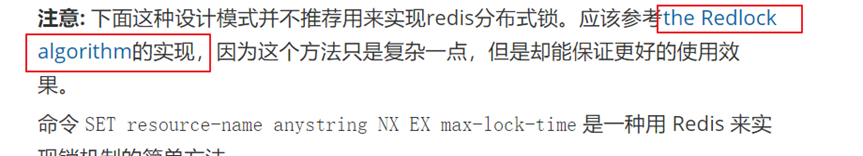

点击链接查看

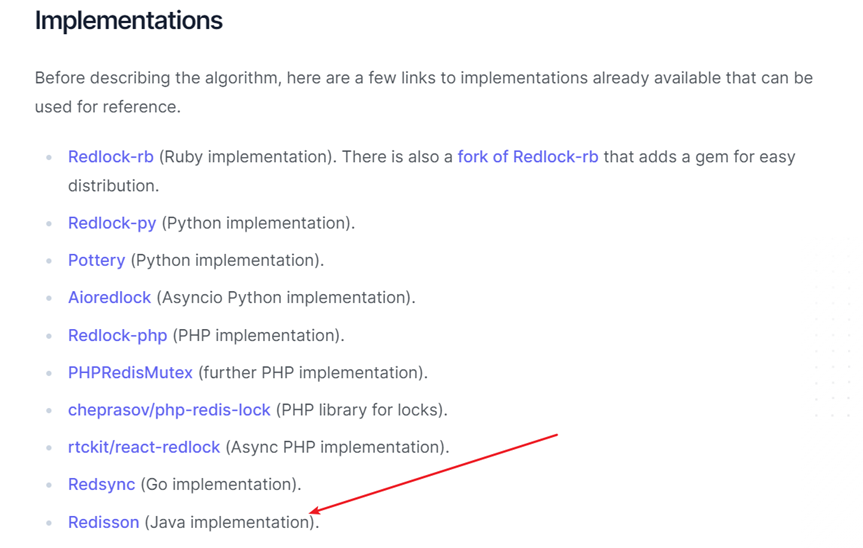

我们选用 Java 的实现方案 https://github.com/redisson/redisson

Redisson 的文档地址：https://github.com/redisson/redisson/wiki/Table-of-Content

Redisson 底层采用的是[Netty](http://netty.io/) 框架。支持[Redis](http://redis.cn/) 2.8 以上版本，支持 Java1.6+以上版本。Redisson 是一个在 Redis 的基础上实现的 Java 驻内存数据网格（In-Memory Data Grid）。它不仅提供了一系列的分布式的 Java 常用对象，还提供了许多分布式服务。其中包括(BitSet, Set, Multimap, SortedSet, Map, List, Queue, BlockingQueue, Deque, BlockingDeque, Semaphore, Lock, AtomicLong, CountDownLatch, Publish / Subscribe, Bloom filter, Remote service, Spring cache, Executor service, Live Object service, Scheduler service) 。

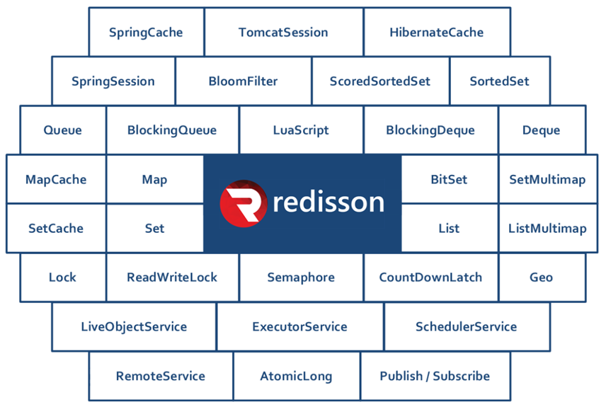

使用 Redisson 可以非常方便将 Java 本地内存中的常用数据结构的对象搬到分布式缓存 redis 中。

也可以将常用的并发编程工具如：AtomicLong、CountDownLatch、Semaphore 等支持分布式。

使用 RScheduledExecutorService 实现分布式调度服务。

支持数据分片，将数据分片存储到不同的 redis 实例中。

支持分布式锁，基于 Java 的 Lock 接口实现分布式锁，方便开发。

下边使用 Redisson 将 Queue 队列的数据存入 Redis，实现一个排队及出队的接口。


添加 redisson 的依赖

```xml
<dependency>
    <groupId>org.redisson</groupId>
    <artifactId>redisson-spring-boot-starter</artifactId>
    <version>3.11.2</version>
</dependency>

```

从课程资料目录拷贝 singleServerConfig.yaml 到 config 工程下

在 redis 配置文件中添加：

```yaml
spring:
  redis:
    redisson:
      #配置文件目录
      config: classpath:singleServerConfig.yaml
      #config: classpath:clusterServersConfig.yaml
```

redis 集群配置 clusterServersConfig.yaml.

Redisson 相比 set nx 实现分布式锁要简单的多，工作原理如下：

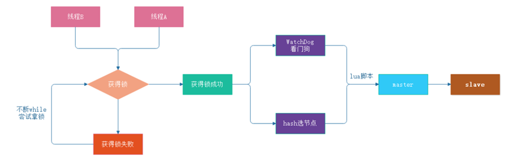

**加锁机制**

线程去获取锁，获取成功: 执行 lua 脚本，保存数据到 redis 数据库。

线程去获取锁，获取失败: 一直通过 while 循环尝试获取锁，获取成功后，执行 lua 脚本，保存数据到 redis

**WatchDog 自动延期看门狗机制**

第一种情况：在一个分布式环境下，假如一个线程获得锁后，突然服务器宕机了，那么这个时候在一定时间后这个锁会自动释放，你也可以设置锁的有效时间(当不设置默认 30 秒时），这样的目的主要是防止死锁的发生

> 第二种情况：线程 A 业务还没有执行完，时间就过了，线程 A 还想持有锁的话，就会启动一个 watch dog 后台线程，不断的延长锁 key 的生存时间。

**lua 脚本-保证原子性操作**

主要是如果你的业务逻辑复杂的话，通过封装在 lua 脚本中发送给 redis，而且 redis 是单线程的，这样就保证这段复杂业务逻辑执行的原子性

具体使用 RLock 操作分布锁，RLock 继承 JDK 的 Lock 接口，所以他有 Lock 接口的所有特性，比如 lock、unlock、trylock 等特性,同时它还有很多新特性：强制锁释放，带有效期的锁,。

```java
public interface RRLock {

   //----------------------Lock接口方法-----------------------
    /**
     * 加锁 锁的有效期默认30秒
     */
    void lock();

     /**
     * 加锁 可以手动设置锁的有效时间
     *
     * @param leaseTime 锁有效时间
     * @param unit      时间单位 小时、分、秒、毫秒等
     */
    void lock(long leaseTime, TimeUnit unit);

    /**
     * tryLock()方法是有返回值的，用来尝试获取锁，
     * 如果获取成功，则返回true，如果获取失败（即锁已被其他线程获取），则返回false .
     */
    boolean tryLock();

    /**
     * tryLock(long time, TimeUnit unit)方法和tryLock()方法是类似的，
     * 只不过区别在于这个方法在拿不到锁时会等待一定的时间，
     * 在时间期限之内如果还拿不到锁，就返回false。如果如果一开始拿到锁或者在等待期间内拿到了锁，则返回true。
     *
     * @param time 等待时间
     * @param unit 时间单位 小时、分、秒、毫秒等
     */
    boolean tryLock(long time, TimeUnit unit) throws InterruptedException;

    /**
     * 比上面多一个参数，多添加一个锁的有效时间
     *
     * @param waitTime  等待时间
     * @param leaseTime 锁有效时间
     * @param unit      时间单位 小时、分、秒、毫秒等
     * waitTime 大于 leaseTime
     */
    boolean tryLock(long waitTime, long leaseTime, TimeUnit unit) throws InterruptedException;

    /**
     * 解锁
     */
    void unlock();
}

```

**lock()**：

此方法为加锁，但是锁的有效期采用**默认 30 秒**

如果主线程未释放，且当前锁未调用 unlock 方法，则进入到**watchDog 机制**

如果主线程未释放，且当前锁调用 unlock 方法，则直接释放锁

##### **3.5.5.3 分布式锁避免缓存击穿**

下边使用分布式锁修改查询课程信息的接口。

```java
//Redisson分布式锁
public  CoursePublish getCoursePublishCache(Long courseId){
        //查询缓存
        String jsonString = (String) redisTemplate.opsForValue().get("course:" + courseId);
        if(StringUtils.isNotEmpty(jsonString)){
            if(jsonString.equals("null")){
                return null;
            }
            CoursePublish coursePublish = JSON.parseObject(jsonString, CoursePublish.class);
            return coursePublish;
        }else{
            //每门课程设置一个锁
            RLock lock = redissonClient.getLock("coursequerylock:"+courseId);
            //获取锁
            lock.lock();
            try {
                jsonString = (String) redisTemplate.opsForValue().get("course:" + courseId);
                if(StringUtils.isNotEmpty(jsonString)){
                    CoursePublish coursePublish = JSON.parseObject(jsonString, CoursePublish.class);
                    return coursePublish;
                }
                System.out.println("=========从数据库查询==========");
                //从数据库查询
                CoursePublish coursePublish = getCoursePublish(courseId);
                redisTemplate.opsForValue().set("course:" + courseId, JSON.toJSONString(coursePublish),1,TimeUnit.DAYS);
                return coursePublish;
            }finally {
                //释放锁
                lock.unlock();
            }
        }


}

```

启动多个内容管理服务实例，使用 JMeter 压力测试，只有一个实例查询一次数据库。

测试 Redisson 自动续期功能。

在查询数据库处添加休眠，观察锁是否会自动续期。

```java
try {
    Thread.sleep(60000);
} catch (InterruptedException e) {
    throw new RuntimeException(e);
}

```
