# **课程发布-部署门户文档 v3.1**

[[TOC]]

## **1 模块需求分析**

### **1.1 模块介绍**

课程信息编辑完毕即可发布课程，发布课程相当于一个确认操作，课程发布后学习者在网站可以搜索到课程，然后查看课程的详细信息，进一步选课、支付、在线学习。

下边是课程编辑与发布的整体流程：

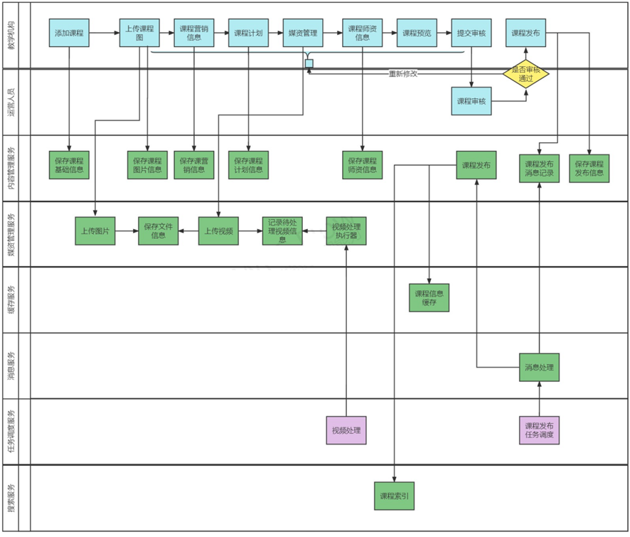

为了课程内容没有违规信息、课程内容安排合理，在课程发布之前运营方会进行课程审核，审核通过后课程方可发布。

作为课程制作方即教学机构，在课程发布前通过课程预览功能可以看到课程发布后的效果，哪里的课程信息存在问题方便查看，及时修改。

下图是课程预览的效果图，也是课程正式发布后的课程详情界面：

教学机构确认课程内容无误，提交审核，平台运营人员对课程内容审核，审核通过后教学机构人员发布课程成功。

课程发布模块共包括三块功能：

1、课程预览

2、课程审核

3、课程发布

### **1.2 业务流程**

#### **1.2.1 课程预览**

1.**教育机构用户**在课程管理中可对该机构内所管理的课程进行检索。

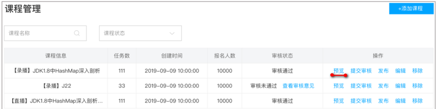

2.点击某课程数据后的预览链接，即可对该课程进行预览，可以看到发布后的详情页面效果。

下图是课程详情首页，显示了课程的基本信息。


点击课程目录，显示课程计划，通过此界面去核实课程计划的信息是否存在问题。

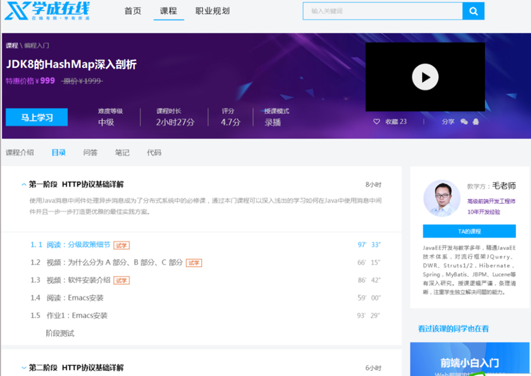

点击课程目录中的具体章节，查看视频播放是否正常

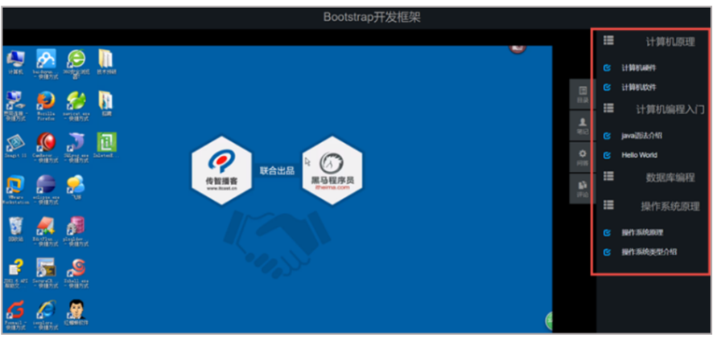

#### **1.2.2 课程审核**

教学机构提交课程审核后，平台运营人员登录运营平台进行课程审核，课程审核包括程序自动审核和人工审核，程序会审核内容的完整性，人员通过课程预览进行审核。

流程如下：

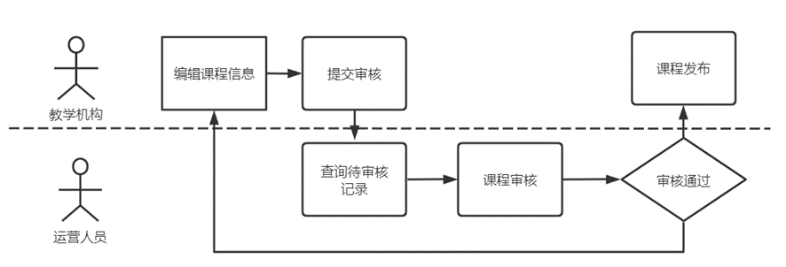

1、首先查询待审核的记录。

2、课程审核

具体审核的过程与课程预览的过程类似，运营人员查看课程信息、课程视频等内容。

如果存在问题则审核不通过，并附上审核不通过的原因供教学机构人员查看。

如果课程内容没有违规信息且课程内容全面则审核通过。

课程审核通过后教学机构发布课程成功。

#### **1.2.3 课程发布**

1.**教育机构用户**在课程管理中可对机构内课程进行检索。

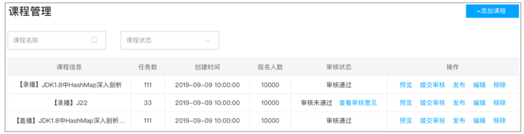

2.点击某课程数据后的 发布 链接（审核状态为通过），即可对该课程进行发布。


3、课程发布后可通过课程搜索查询到课程信息，并查看课程的详细信息。

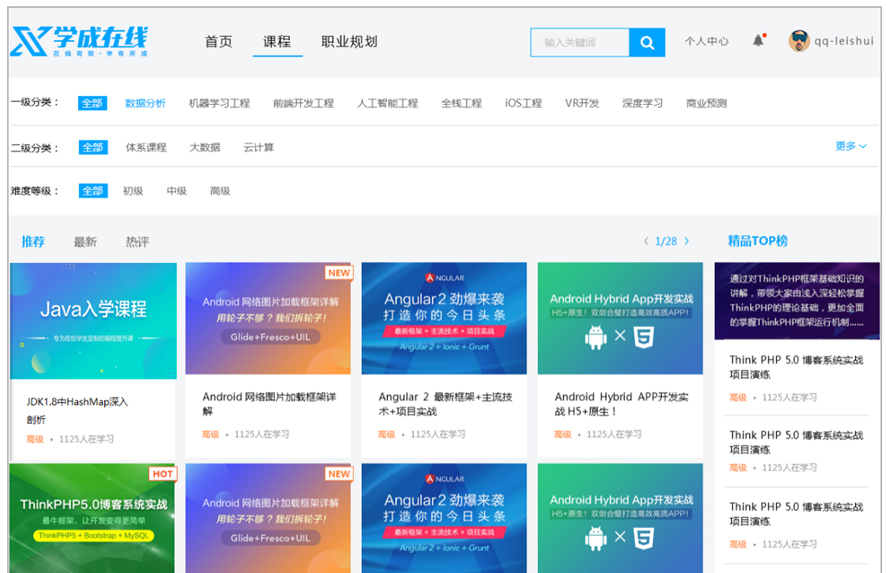

4 点击课程搜索页中课程列表的某个课程，可进入课程详情页。

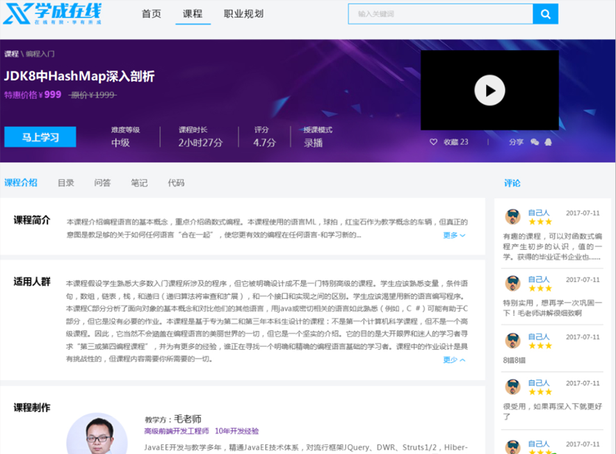

## **2 课程预览**

### **2.1 需求分析**

课程预览就是把课程的相关信息进行整合，在课程详情界面进行展示，通过课程预览页面查看信息是否存在问题。


下图是课程预览的数据来源：

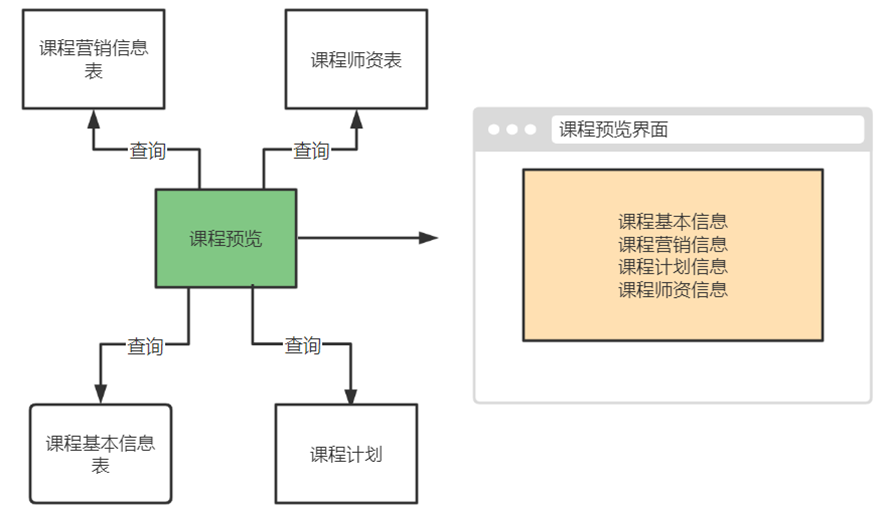

在课程预览页面点击"视频播放图片"打开视频播放页面，通过视频播放页面查看课程计划对应的视频是否存在问题。


课程预览的效果与最终课程发布后查看到的效果是一致的，所以课程预览时会通过网站门户域名地址进行预览，下图显示了整个课程预览的流程图：

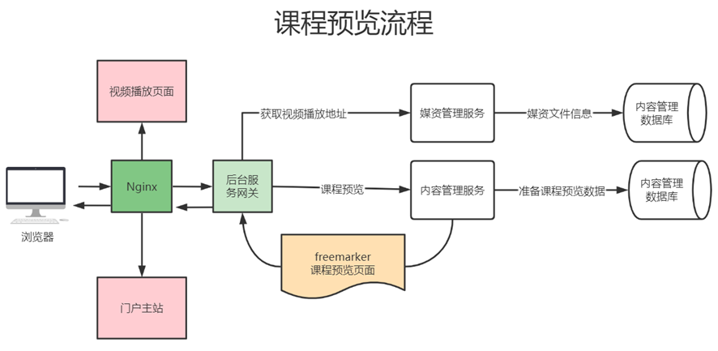

说明如下：

1、点击课程预览，通过 Nginx、后台服务网关请求内容管理服务进行课程预览。

2、内容管理服务查询课程相关信息进行整合，并通过模板引擎技术在服务端渲染生成页面，返回给浏览器。

3、通过课程预览页面点击”马上学习“打开视频播放页面。

4、视频播放页面通过 Nginx 请求后台服务网关，查询课程信息展示课程计划目录，请求媒资服务查询课程计划绑定的视频文件地址，在线浏览播放视频。

**2.2 模板引擎**

#### **2.2.1 什么是模板引擎**

根据前边的数据模型分析，课程预览就是把课程的相关信息进行整合，在课程预览界面进行展示，课程预览界面与课程发布的课程详情界面一致。

项目采用模板引擎技术实现课程预览界面。什么是模板引擎？

早期我们采用的 jsp 技术就是一种模板引擎技术，如下图：

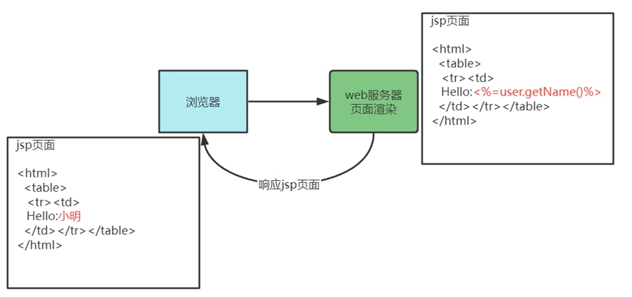

1、浏览器请求 web 服务器

2、服务器渲染页面，渲染的过程就是向 jsp 页面(模板)内填充数据(模型)。

3、服务器将渲染生成的页面返回给浏览器。

所以模板引擎就是：模板+数据=输出，Jsp 页面就是模板，页面中嵌入的 jsp 标签就是数据，两者相结合输出 html 网页。

常用的 java 模板引擎还有哪些？

Jsp、Freemarker、Thymeleaf 、Velocity 等。

本项目采用 Freemarker 作为模板引擎技术。

Freemarker 官方地址：http://freemarker.foofun.cn/

FreeMarker 是一款 _模板引擎_： 即一种基于模板和要改变的数据， 并用来生成输出文本(HTML 网页，电子邮件，配置文件，源代码等)的通用工具。 它不是面向最终用户的，而是一个 Java 类库，是一款程序员可以嵌入他们所开发产品的组件。FreeMarker 是 免费的， 基于 Apache 许可证 2.0 版本发布。

#### **2.2.2 Freemarker 快速入门**

下边在内容管理接口层搭建 Freemarker 的运行环境并进行测试。

在内容管理接口工层 添加 Freemarker 与 SpringBoot 的整合包

```xml
<!-- Spring Boot 对结果视图 Freemarker 集成 -->
<dependency>
    <groupId>org.springframework.boot</groupId>
    <artifactId>spring-boot-starter-freemarker</artifactId>
</dependency>

```

在 nacos 为内容管理接口层配置 freemarker，公用配置组新加一个 freemarker-config-dev.yaml

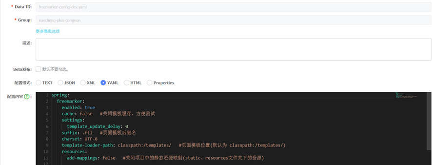

配置信息如下：

```yaml
spring:
  freemarker:
    enabled: true
    cache: false #关闭模板缓存，方便测试
    settings:
      template_update_delay: 0
    suffix: .ftl #页面模板后缀名
    charset: UTF-8
    template-loader-path: classpath:/templates/ #页面模板位置(默认为 classpath:/templates/)
    resources:
      add-mappings: false #关闭项目中的静态资源映射(static、resources文件夹下的资源)
```

在内容管理接口工程添加 freemarker-config-dev.yaml

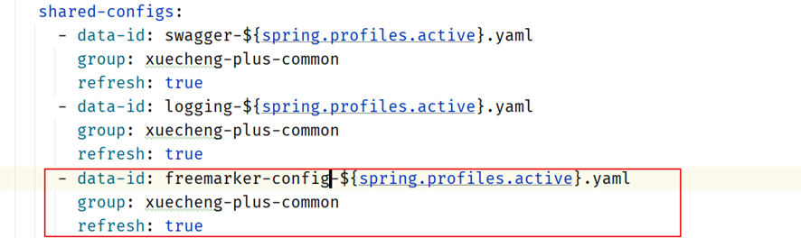

添加模板，在 resources 下创建 templates 目录，添加 test.ftl 模板文件

```html
<!DOCTYPE html>
<html>
  <head>
    <meta charset="utf-8" />
    <title>Hello World!</title>
  </head>
  <body>
    Hello ${name}!
  </body>
</html>
```

编写 controller 方法，准备模型数据

```java
package com.xuecheng.content.api;

import org.bouncycastle.math.raw.Mod;
import org.springframework.stereotype.Controller;
import org.springframework.web.bind.annotation.GetMapping;
import org.springframework.web.servlet.ModelAndView;

import java.util.Map;

/**
 * @author Mr.M
 * @version 1.0
 * @description freemarker测试
 * @date 2022/9/15 19:20
 */
@Controller
public class FreemarkerController {

    @GetMapping("/testfreemarker")
    public ModelAndView test(){
        ModelAndView modelAndView = new ModelAndView();
        //设置模型数据
        modelAndView.addObject("name","小明");
        //设置模板名称
        modelAndView.setViewName("test");
        return modelAndView;
    }


}

```

启动内容管理接口工程，访问 http://localhost:63040/content/testfreemarker

屏幕输出：Hello 小明！

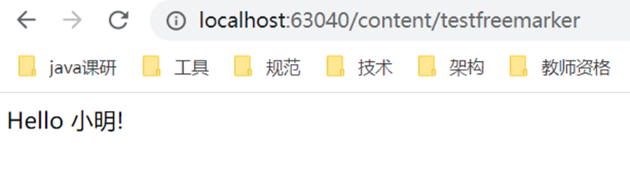

freemarker 提供很多指令用于解析各种类型的数据模型，参考地址：http://freemarker.foofun.cn/ref\_directives.html

### **2.3 测试静态页面**

#### **2.3.1 部署网站门户**

在课程预览界面上要加载 css、js、图片等内容，这里部署 nginx 来访问这些静态资源，对于 SpringBoot 服务的动态资源由 Nginx 去代理请求，如下图：

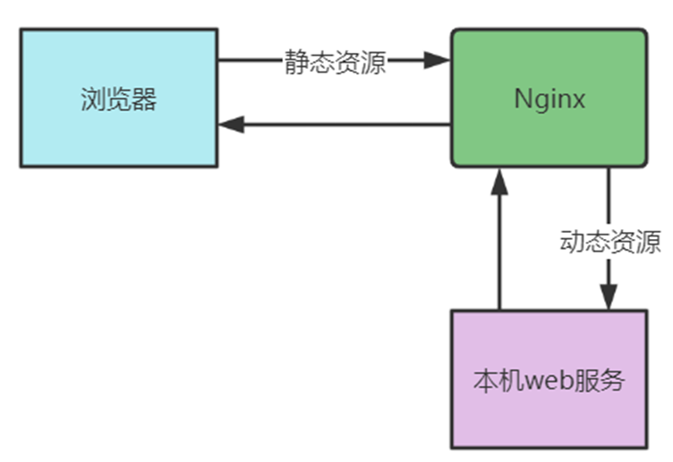

1、在本机安装 Nginx ，从课程资料目录获取 nginx-1.23.1.zip 并解压。

2、运行 nginx-1.23.1 目录下的 nginx.exe。

默认端口为 80，如果本机 80 端口被占用，则需要杀掉占用进程后再启动 nginx。

如果无法杀掉 80 端口占用进程则需要修改 nginx-1.23.1 目录下 conf/nginx.conf 配置文件

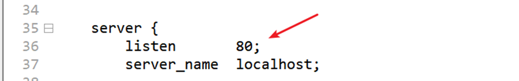

将 80 端口修改为空闲端口。

启动 nginx，访问 http://localhost 出现下边的网页表示启动成功

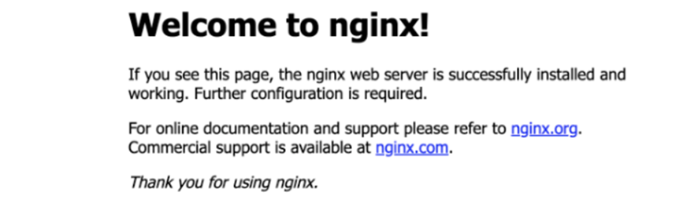

下边开始部署前端工程：

1、从课程资料目录获取 xc-ui-pc-static-portal.zip 并解压。

2、修改本机 hosts 文件，加入 127.0.0.1 www.51xuecheng.cn 51xuecheng.cn ucenter.51xuecheng.cn teacher.51xuecheng.cn file.51xuecheng.cn。

window10 操作系统 hosts 文件在 C:\\Windows\\System32\\drivers\\etc 下

Centos7 操作系统的 hosts 文件在/etc 目录下。

在 hosts 文件加入如下配置

```tex
127.0.0.1 www.51xuecheng.cn 51xuecheng.cn ucenter.51xuecheng.cn teacher.51xuecheng.cn file.51xuecheng.cn

```

3、在 nginx-1.23.1 目录中找到 conf 目录，配置目录下的 nginx.conf 文件。

配置内容如下，注意更改成自己电脑 xc-ui-pc-static-portal 目录的路径：

```tex
server {
        listen       80;
        server_name  www.51xuecheng.cn localhost;
        #rewrite ^(.*) https://$server_name$1 permanent;
        #charset koi8-r;
        ssi on;
        ssi_silent_errors on;
        #access_log  logs/host.access.log  main;

        location / {
            alias   D:/itcast2022/xc_edu3.0/code_1/xc-ui-pc-static-portal/;
            index  index.html index.htm;
        }
        #静态资源
        location /static/img/ {
                alias  D:/itcast2022/xc_edu3.0/code_1/xc-ui-pc-static-portal/img/;
        }
        location /static/css/ {
                alias   D:/itcast2022/xc_edu3.0/code_1/xc-ui-pc-static-portal/css/;
        }
        location /static/js/ {
                alias   D:/itcast2022/xc_edu3.0/code_1/xc-ui-pc-static-portal/js/;
        }
        location /static/plugins/ {
                alias   D:/itcast2022/xc_edu3.0/code_1/xc-ui-pc-static-portal/plugins/;
                add_header Access-Control-Allow-Origin http://ucenter.51xuecheng.cn;
                add_header Access-Control-Allow-Credentials true;
                add_header Access-Control-Allow-Methods GET;
        }
        location /plugins/ {
                alias   D:/itcast2022/xc_edu3.0/code_1/xc-ui-pc-static-portal/plugins/;
        }


        #error_page  404              /404.html;

        # redirect server error pages to the static page /50x.html
        #
        error_page   500 502 503 504  /50x.html;
        location = /50x.html {
            root   html;
        }

        # proxy the PHP scripts to Apache listening on 127.0.0.1:80
        #
        #location ~ \.php$ {
        #    proxy_pass   http://127.0.0.1;
        #}

        # pass the PHP scripts to FastCGI server listening on 127.0.0.1:9000
        #
        #location ~ \.php$ {
        #    root           html;
        #    fastcgi_pass   127.0.0.1:9000;
        #    fastcgi_index  index.php;
        #    fastcgi_param  SCRIPT_FILENAME  /scripts$fastcgi_script_name;
        #    include        fastcgi_params;
        #}

        # deny access to .htaccess files, if Apache's document root
        # concurs with nginx's one
        #
        #location ~ /\.ht {
        #    deny  all;
        #}
    }

```

启动 nginx:

进入任务管理器，杀死 nginx 的两个进程

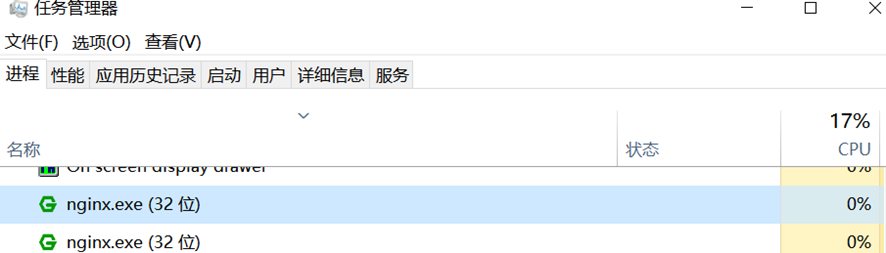

杀死后再次双击 nginx.exe。

启动成功在任务管理器会出现 nginx 的进程。

日志文件在 nginx 安装目录下的 logs 目录：

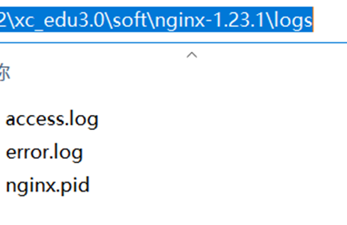

启动成功访问http://www.51xuecheng.cn


#### **2.3.2 课程详情页面**

course_template.html 是一个静态 html 页面，里边还没有添加 freemarker 标签，如果要预览该页面需要借助 Nginx 进行预览，因为页面需要加载一些 css 样式表、图片等内容。

course_template.html 文件在 xc-ui-pc-static-portal\\course 目录下

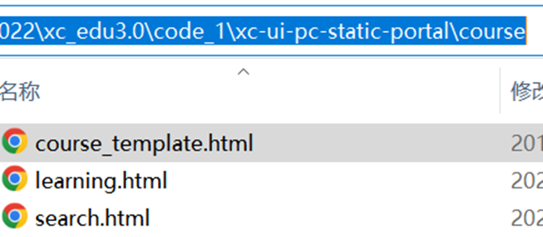

通过浏览器访问：http://www.51xuecheng.cn/course/course\_template.html

效果如下：

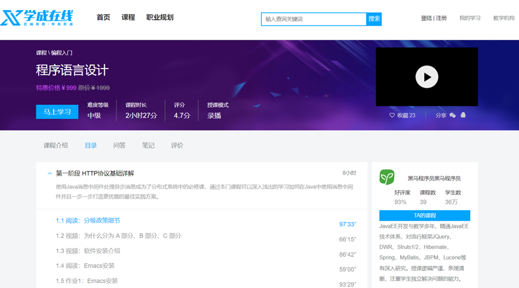

出现这个画面说明模板文件正常浏览是没有问题的。

#### **2.3.3 文件服务器**

在进行课程预览时需要展示课程的图片，在线插放课程视频，课程图片、视频这些都在 MinIO 文件系统存储，下边统一由 Nginx 代理，通过文件服务域名统一访问。如下图：

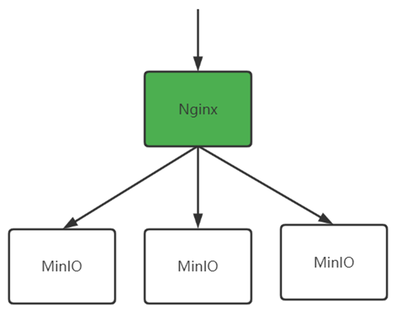

在 hosts 文件配置如下内容，如果已存在不要重复配置。

```java
127.0.0.1 www.51xuecheng.cn file.51xuecheng.cn

```

在 nginx.conf 中配置文件服务器的代理地址

```java
   #文件服务
  upstream fileserver{
    server 192.168.101.65:9000 weight=10;
  }
   server {
        listen       80;
        server_name  file.51xuecheng.cn;
        #charset koi8-r;
        ssi on;
        ssi_silent_errors on;
        #access_log  logs/host.access.log  main;
        location /video {
            proxy_pass   http://fileserver;
        }

        location /mediafiles {
            proxy_pass   http://fileserver;
        }
   }

```

配置完毕，重新加载 nginx 配置文件。

通过 cmd 进入 nginx.exe 所在目录,运行如下命令

```tex
nginx.exe -s reload

```

通过http://file.51xuecheng.cn/mediafiles/图片文件地址 访问图片

在媒资数据库的文件表中找一个图片的地址进行测试。

#### **2.3.4 视频播放页面**

进入课程详情页面，点击马上学习或课程目录下的小节的名称将打开视频播放页面。

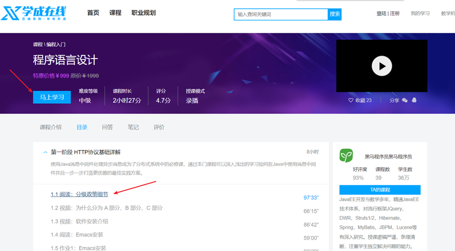

首先在 nginx.conf 中配置视频播放页面的地址

```tex
    location /course/preview/learning.html {
            alias D:/itcast2022/xc_edu3.0/code_1/xc-ui-pc-static-portal/course/learning.html;
    }
    location /course/search.html {
            root   D:/itcast2022/xc_edu3.0/code_1/xc-ui-pc-static-portal;
    }
    location /course/learning.html {
            root   D:/itcast2022/xc_edu3.0/code_1/xc-ui-pc-static-portal;
    }

```

加载 nginx 配置文件

点击课程详情页面上的视频播放链接，打开视频播放页面，如下图：


下边需要配置 learning.html 页面的视频播放路径来测试视频播放页面，找到 learning.html 页面中 videoObject 对象的定义处，配置视频的播放地址。

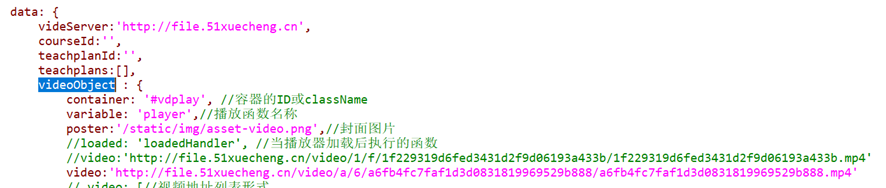

配置完成，刷新页面，观察视频是否可以正常播放。

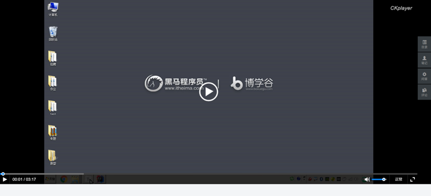

注意：此页面会去请求后台接口获取课程计划，这里暂时不处理，稍后在接口开发处进行处理。只要页面可以正常打开，可以播放视频就测试通过了。
