# **第一章节：你好 Python**

[[toc]]

## **1.初识 Python**

### **1.1Python 的起源**

1989 年，为了**打发**圣诞节假期，Gudio van Rossum 吉多· 范罗苏姆（龟叔）决心开发一个新的解释程序（Python 雏形）

1991 年，第一个 Python 解释器诞生

Python 这个名字，来自龟叔所挚爱的电视剧 Monty Python's Flying Circus

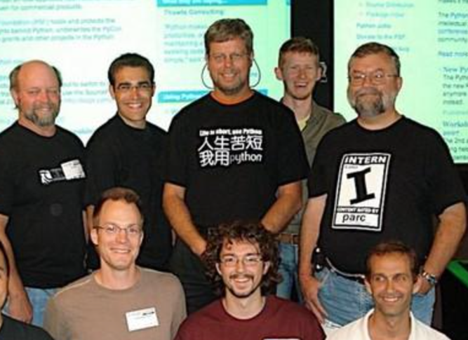

### **1.2 为什么选择 Python**

**优雅**

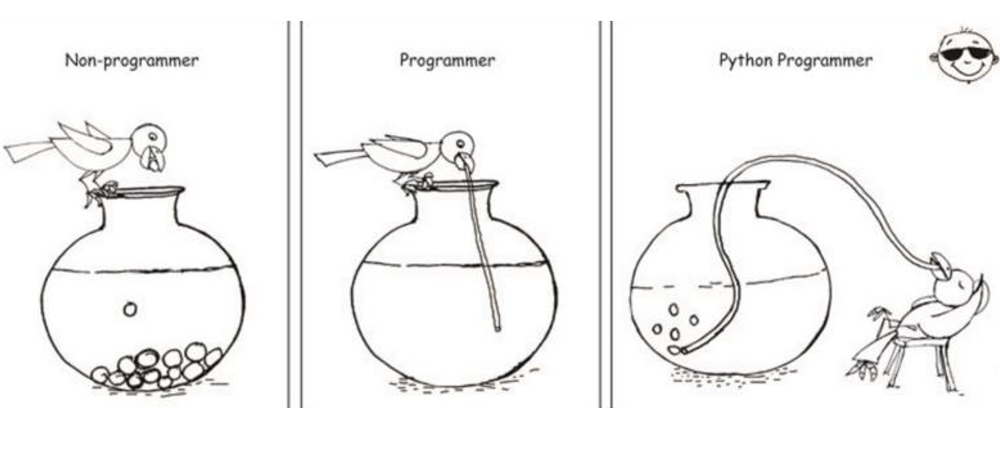

**适用面广泛**

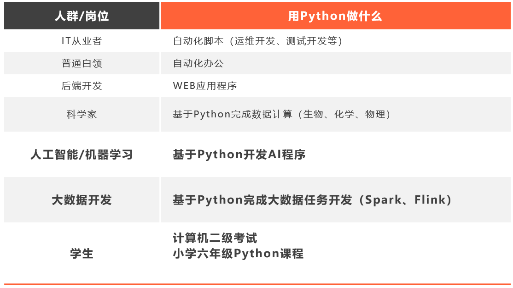

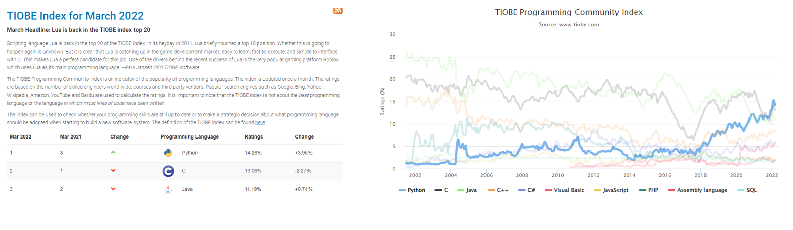

> **简单** **易学** **开发效率高**

### **1.3 总结**

1. python 的诞生？

> 1991 年吉多·范·罗苏姆（龟叔）创建

2. 为什么使用 Python？

   > 简单易学、全球第一、优雅、应用场景丰富（就业方向多）

3. Python 的应用场景？

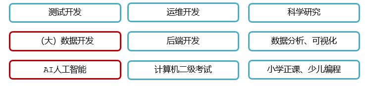

## **2.什么是编程语言**

首先，不管 Python，我们先明白，什么是编程语言?

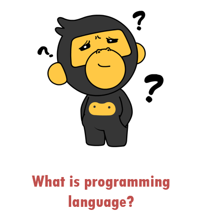

语言：进行沟通交流的表达方式

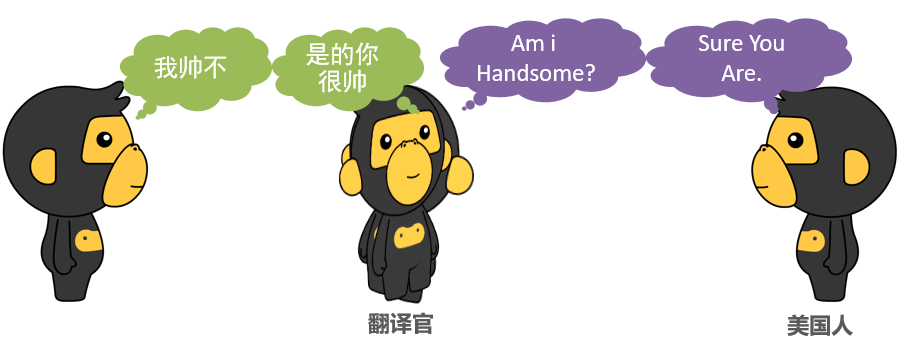

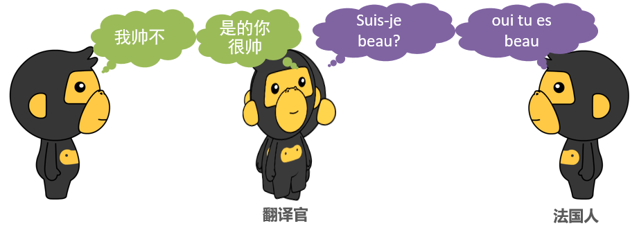

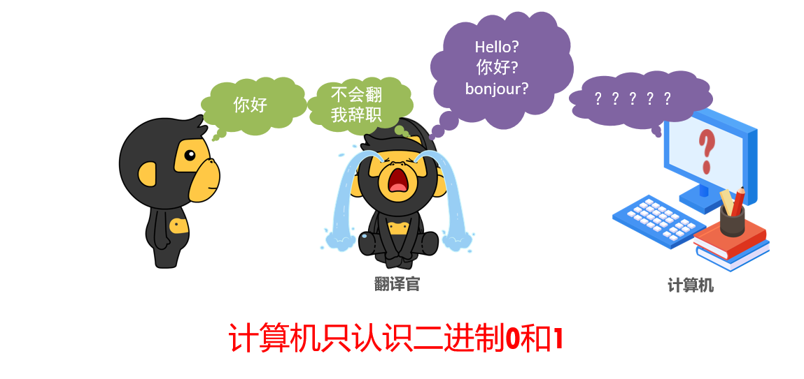

**问题：**人类翻译官无法沟通，那要怎么做才能和计算机交流呢？

**答案：**编程语言

以 Python 为例

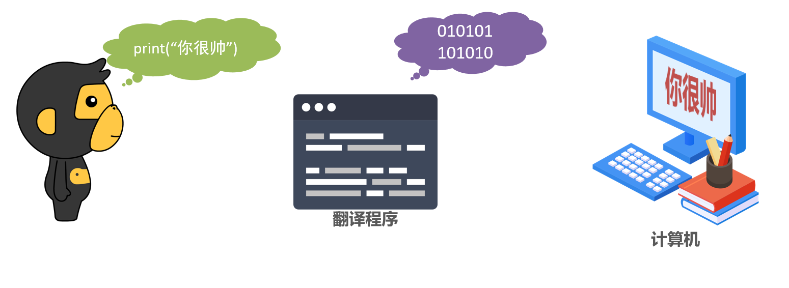

**思考：**为什么不直接把中文翻译成二进制呢？

**答：**

> 自然语言远比编程语言复杂
>
> 编程语言语法”死板”
>
> 翻译官”更容易翻译

**例如：**

- **中文** `在屏幕上显示你好帅 ` `把你好帅显示在屏幕上` `快夸我帅`
- **Python：** **print(“你好帅”)**

### **2.1 总结**

1. **什么是编程语言？**

> **人类和计算机交流的一种专有领域语言**

1.  **编程语言的工作原理？**

> **想法转换为编程语言代码**
>
> **通过翻译官（解释器）翻译成二进制提交计算机执行**

## **3.Python 安装（Windows）**

### **3.1 下载**

想要使用 Python 语言编写程序，我们必须下载 Python 安装包并配置 Python 环境，

Python 目前最新版本是：3.10.4（发布于 2022 年 3 月 24 日）

本次就基于当前最新版本进行学习

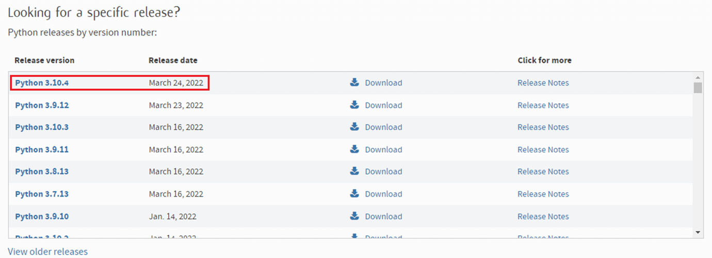

下载最新版 Python

https://www.python.org/downloads

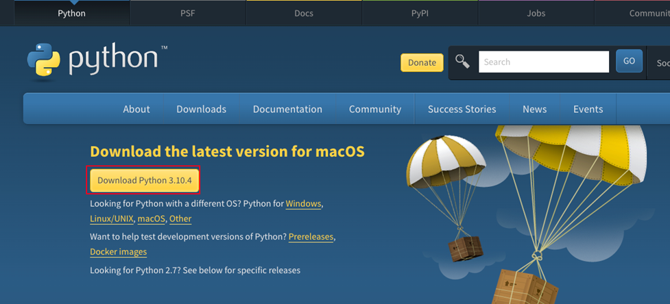

点击即可下载

### **3.2 安装**

双击打开下载的安装包（以 Windows 系统为例）

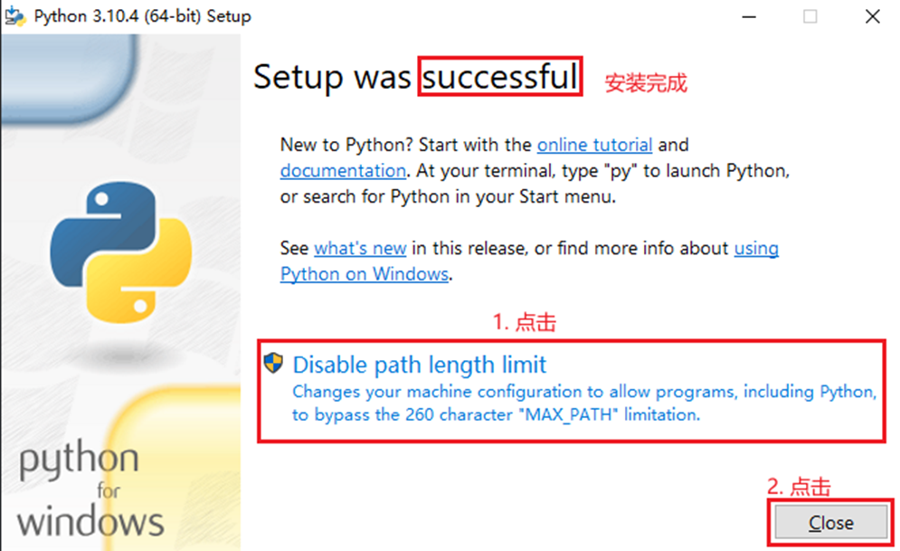

点击左下角 Windows 键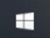

### **3.3 验证安装**

输入: cmd

打开“命令提示符”程序

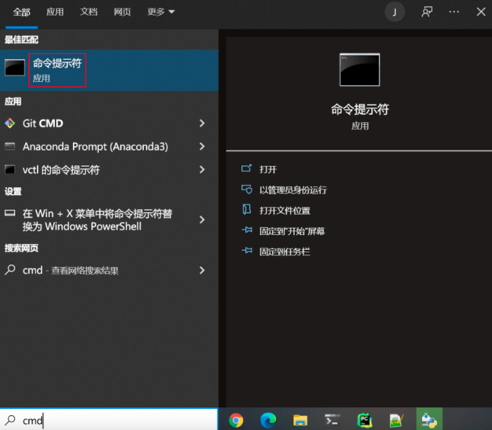

在命令提示符程序内，输入: python 并回车

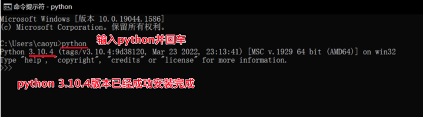

## **4.Python 安装（MacOS）**

### **4.1 下载**

下载最新版 Python

https://www.python.org/downloads

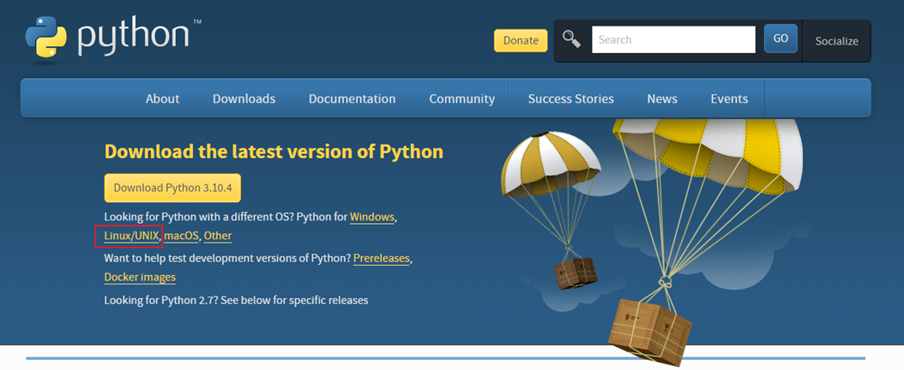

找到 macOS 系统按钮，并点击

点击后在弹出的网页内

点击最新的 python3.10.4 的按钮

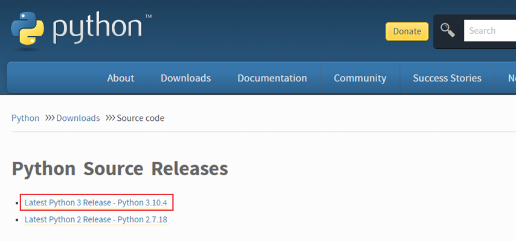

拖动网页到最下方，如下图

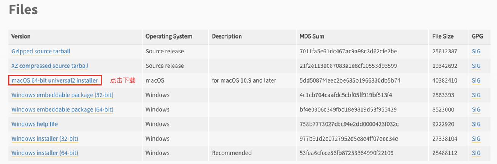

### **4.2 安装**

下载完成后，应该可以看到如下文件：

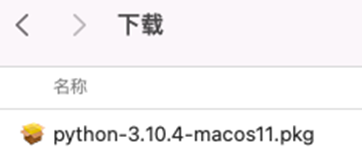

双击打开下载好的：python-3.10.4-macos11.pkg 文件，开始安装

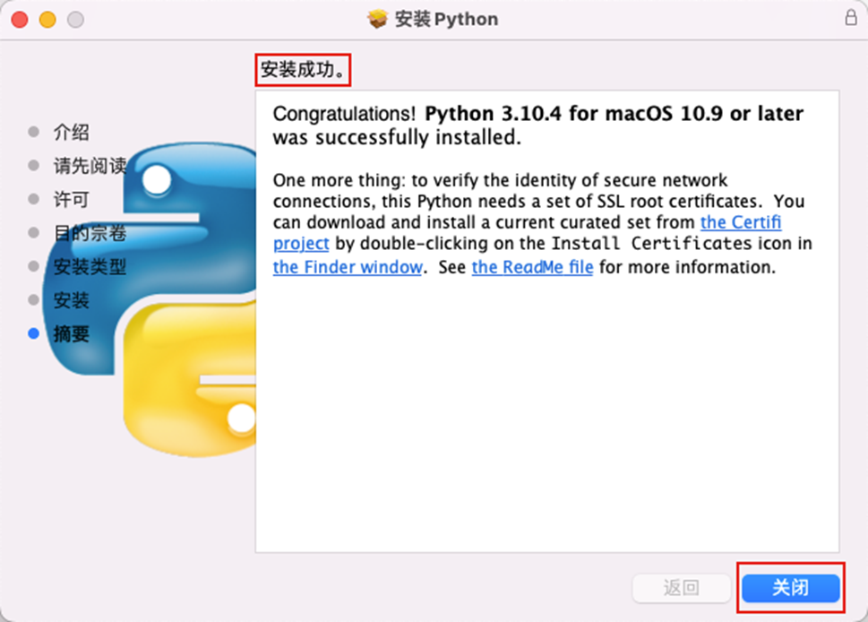

### **4.3 验证安装**

找到 mac 中的“终端”程序并打开：

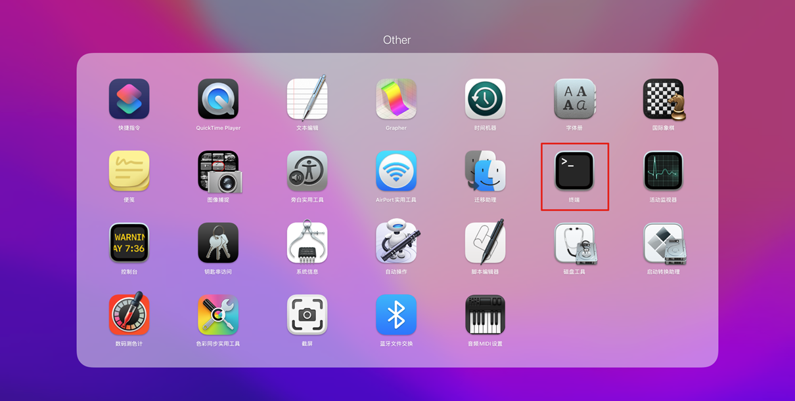

直接在终端中输入：

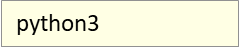

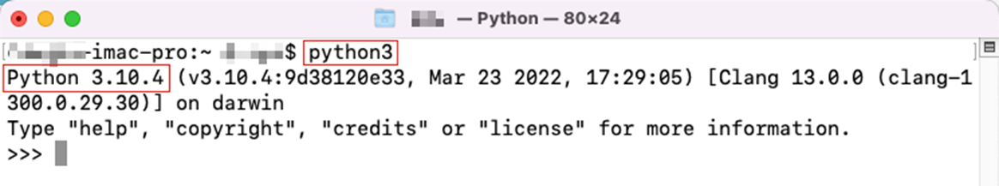

如图，最新版 3.10.4 已经安装成功。

### **4.4 拓展**

如果想要使用 python 命令，而非 python3 命令执行 python

那么可以设置环境变量来解决，在终端中执行如下代码：

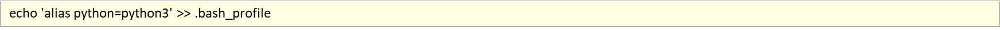

退出且重新打开终端，然后执行：

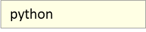

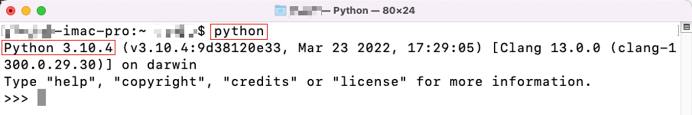

## **5.第一个 Python 程序**

向世界说你好，应该是全世界，所有程序员入门编程语言时，都会选择的第一个程序。

让我们也延续这一份来自程序员之间的浪漫，学习如何使用 Python，向世界说你好。

我们的 Python 代码非常简单，如下：

> print(“Hello World!!!”)

含义：向屏幕上输出（显示），Hello World!!!

**注意**：输入的双引号和括号，请使用**英文符号**哦

打开 CMD（命令提示符）程序，输入 Python 并回车

然后，在里面输入代码回车即可立即执行

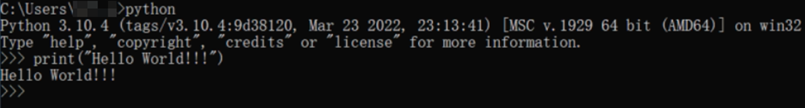

### **2.1 小练习**

请在“命令提示符”（CMD）程序内，通过 Python，向屏幕上输出：

> 学 Python 尊嘟假嘟 o.O?

### **2.2 第一个 Python 程序常见问题**

**问：**找不到“命令提示符”程序在哪里

**答：**

> 使用快捷键：win + r

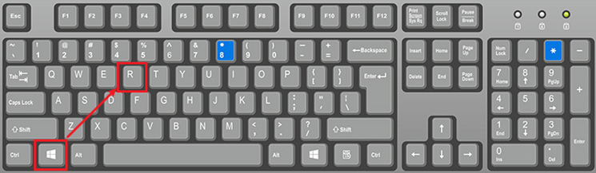

打开运行框，输入 cmd 后回车即可打开命令提示符程序

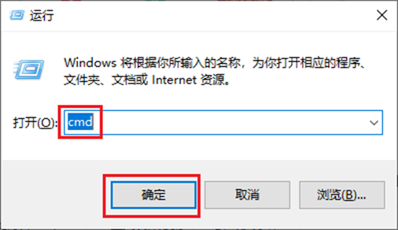

**问：**命令提示符内，输入 python 出现 `'python' 不是内部或外部命令，也不是可运行的程序或批处理文件。`

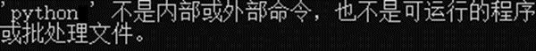

**答：**安装 python 的时候，没有勾选：`add python 3.10 to PATH的选项`

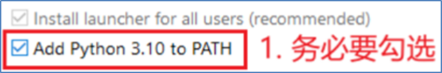

卸载 Python，重新安装 python，勾选这个选项。

然后重新打开命令提示符程序，即可

**问：**命令提示符内，出现：`无法初始化设备 PRN`

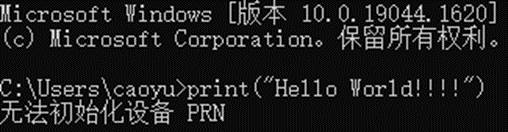

**答：**这是因为没有进入到 python 解释器环境内执行代码。

应该在命令提示符内：

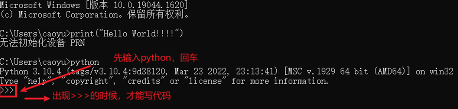

**问：**执行出现：`SyntaxError: invalid character '“' (U+201C)`

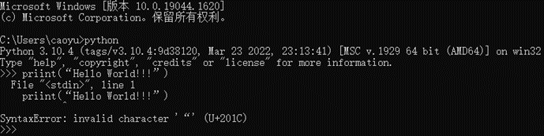

**答：**这是因为，代码中的符号是中文符号。

请检查代码中的：

\- 双引号

\- 小括号

这两个符号，应该是英文符号

## **6.Python 解释器**

首先，一个基本原理是：

**计算机只认识二进制，即：** **0** **和** **1**

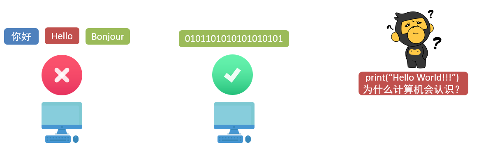

其实很简单，计算机是不会认识 Python 代码的。但是 Python 有解释器程序，如下图

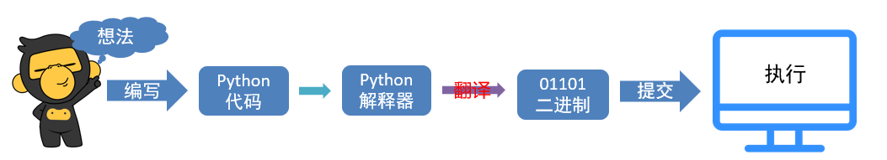

安装 Python 环境，本质上，就是在电脑中，安装：

**Python 解释器程序**

**代码，随时可以写，但能不能运行，就要看电脑里面有没有解释器程序了。**

Python 解释器，是一个计算机程序，用来翻译 Python 代码，并提交给计算机执行。

所以，它的功能很简单，就 2 点：

1. 翻译代码

2. 提交给计算机运行

**问：** **解释器我明白了，可是解释器在哪呢？**

**答：**

解释器存放在：`Python 安装目录` /**python.exe**

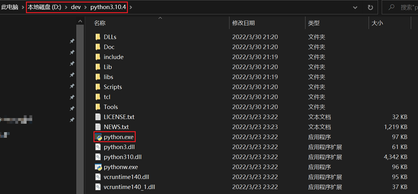

**我们在 CMD（命令提示符）程序内，执行的 python，就是上图的 python.exe 程序哦**

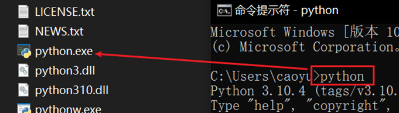

不使用解释器，计算机不认识 Python 代码哦

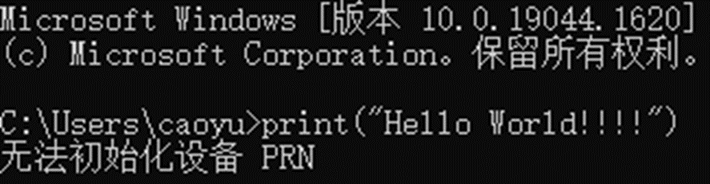

**使用 Python 解释器程序，就能执行 Python 代码了**

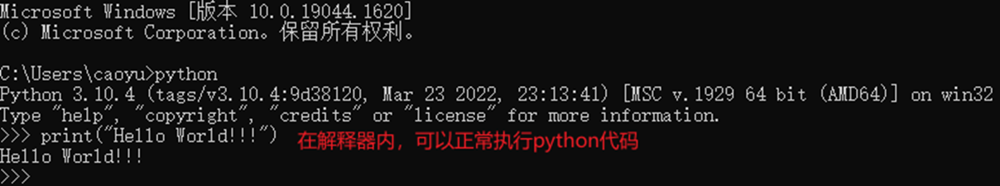

**思考一下：**

**在 python 解释器程序内，我们发现，写完一行代码并回车后，会直接运行他。**

**问题来了：**

**我们能否写好多行代码，一次性的运行呢？**

**答：案那，肯定是：可以的**

我们可以将代码，写入一个以”.py”结尾的文件中，使用 python 命令去运行它。

如，在 Windows 系统的 D 盘，我们新建一个名为：test.py 的文件，并通过记事本程序打开它

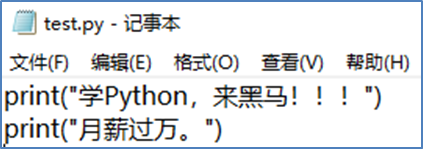

python 命令，运行它，如图：

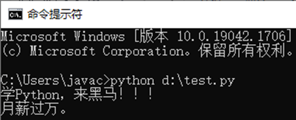

### **6.1 总结**

1. 计算机只认识什么？

> 0 和 1

2. Python 解释器的作用是

> 将 Python 代码翻译成计算机认识的 0 和 1 并提交计算机执行
>
> 在解释器环境内可以一行行的执行我们输入的代码
>
> 也可以使用解释器程序，去执行”.py”代码文件

3. “.py”文件是什么？

> python 语言的代码文件，里面记录了 python 的代码

4. Python 解释器程序在

> `Python 安装目录`/python.exe

## **7.Python 开发环境**

### **7.1 安装和配置 PyCharm 工具**

Python 程序的开发有许多种方式，一般我们常见的有：

- Python 解释器环境内，执行单行代码

- 使用 Python 解释器程序，执行 Python 代码文件

- **使用第三方 DE（集成开发工具），如 PyCharm 软件，开发 Python 程序**

**最常用的就是使用 PyCharm 软件 进行开发**

PyCharm 集成开发工具（IDE），是当下全球 Python 开发者，使用**最频繁的工具软件**。

绝大多数的 Python 程序，都是在 PyCharm 工具内完成的开发。

本次全程基于 PyCharm 软件工具，来讲解 Python。

首先，我们先下载并安装它：

\- 打开网站：https://www.jetbrains.com/pycharm/download/#section=windows

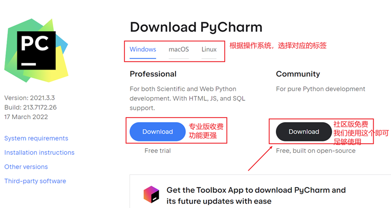

**步骤 1：**

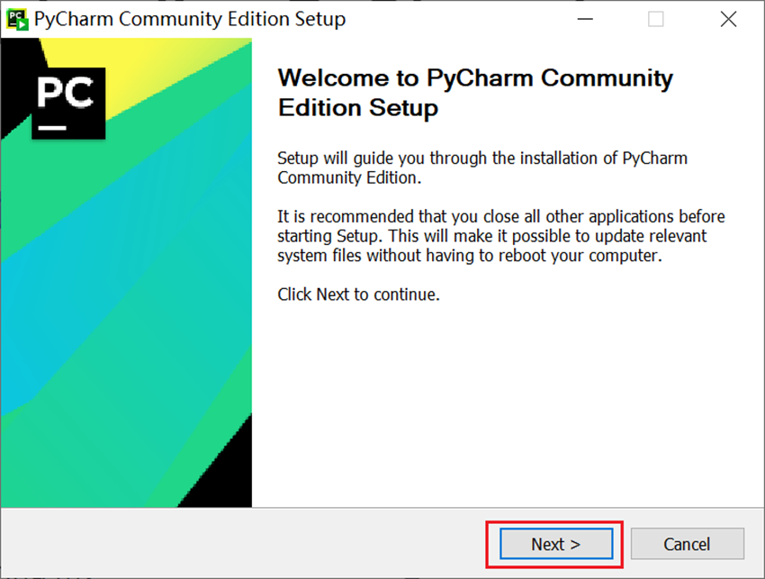

**步骤 2：**

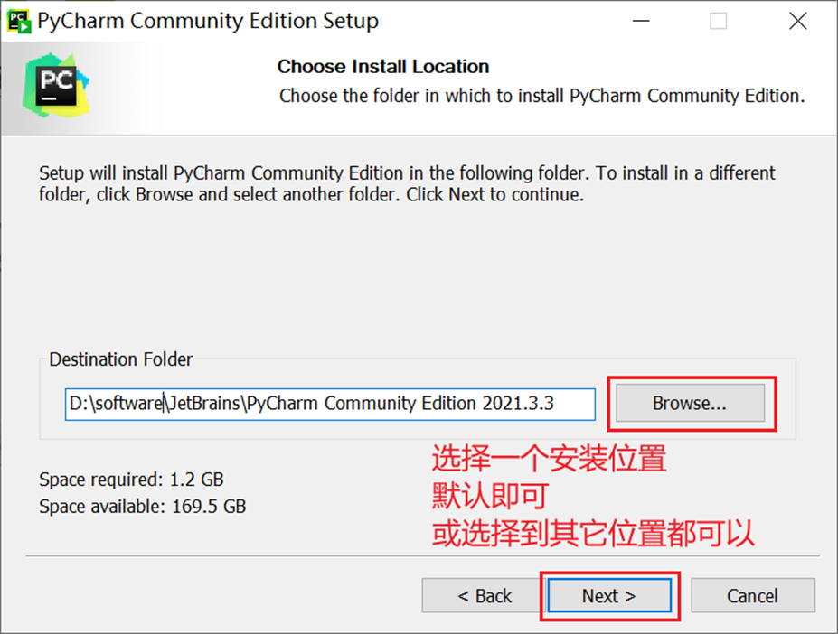

**步骤 3：**

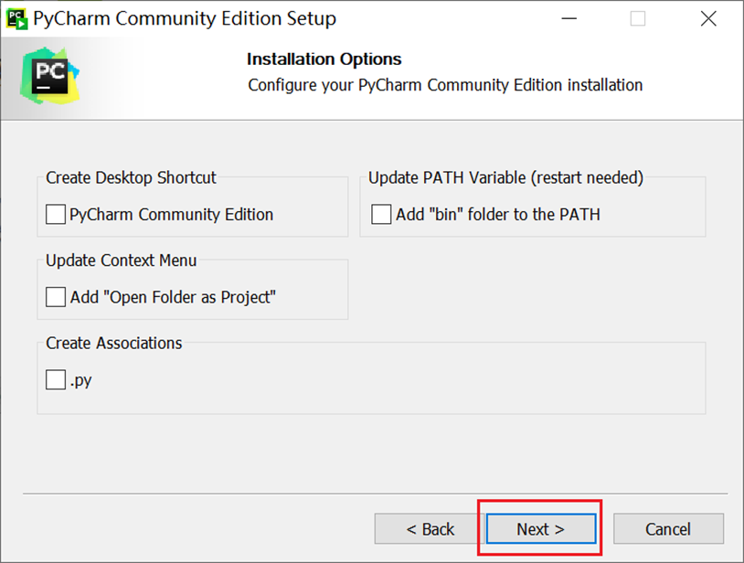

**步骤 4:**

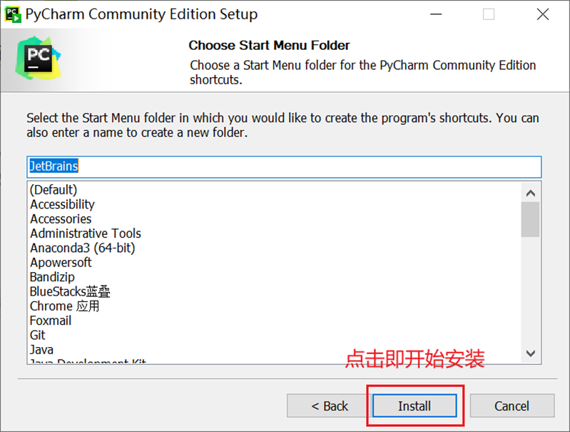

**步骤 5：**

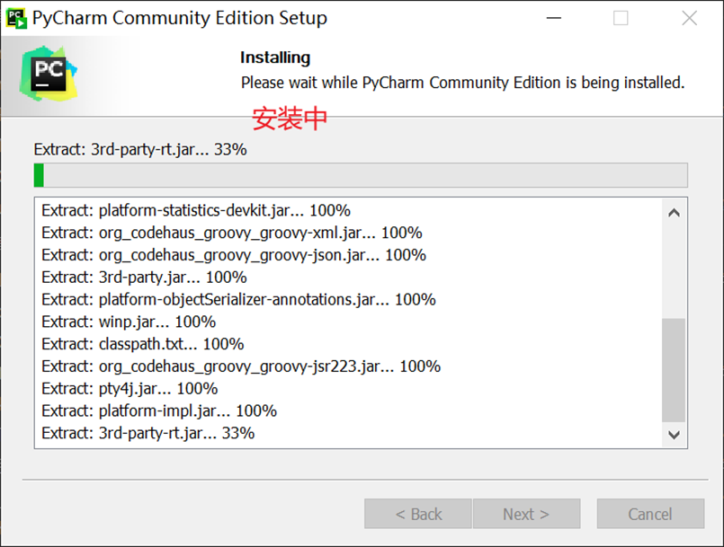

**步骤 6：安装完成。**

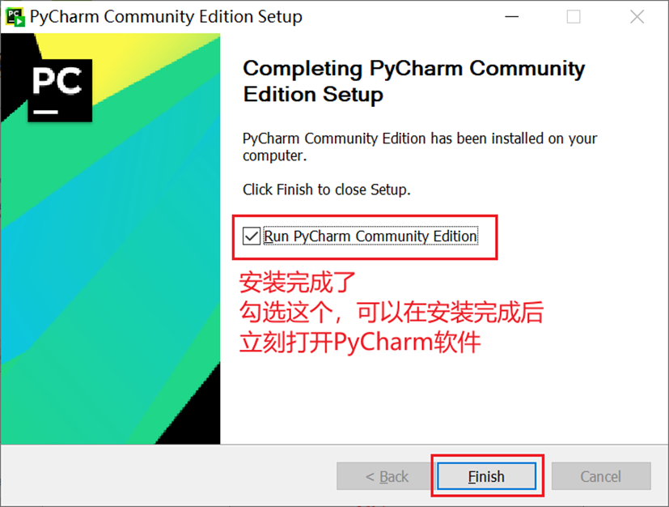

**找到安装好的 Python，打开：**

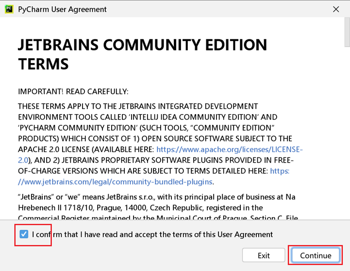

**即可看到软件正常可用：**

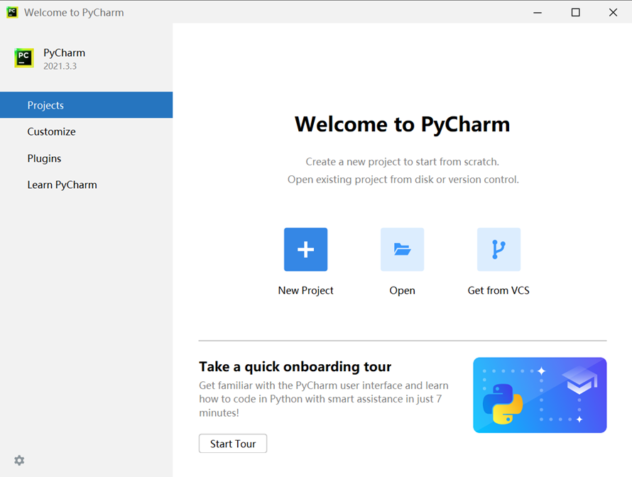

**创建一个工程，我们来尝试写一写代码**

**指定工程路径以及选择 Python 解释器：**

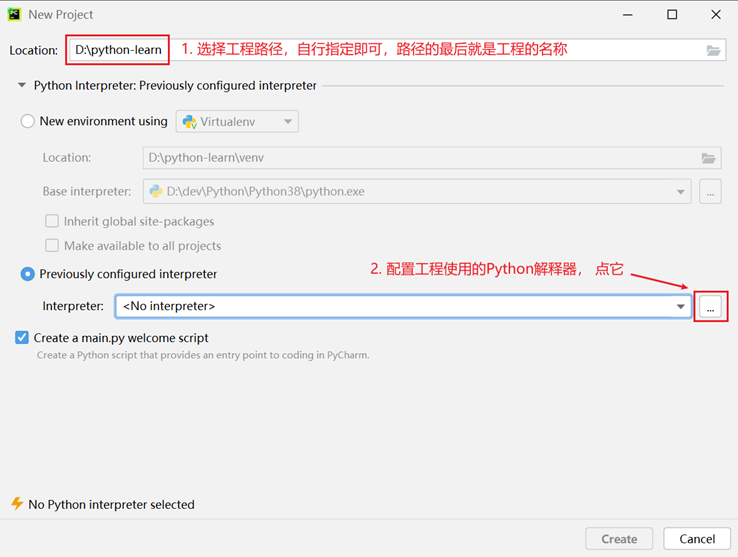

**配置 Python 解释器：**

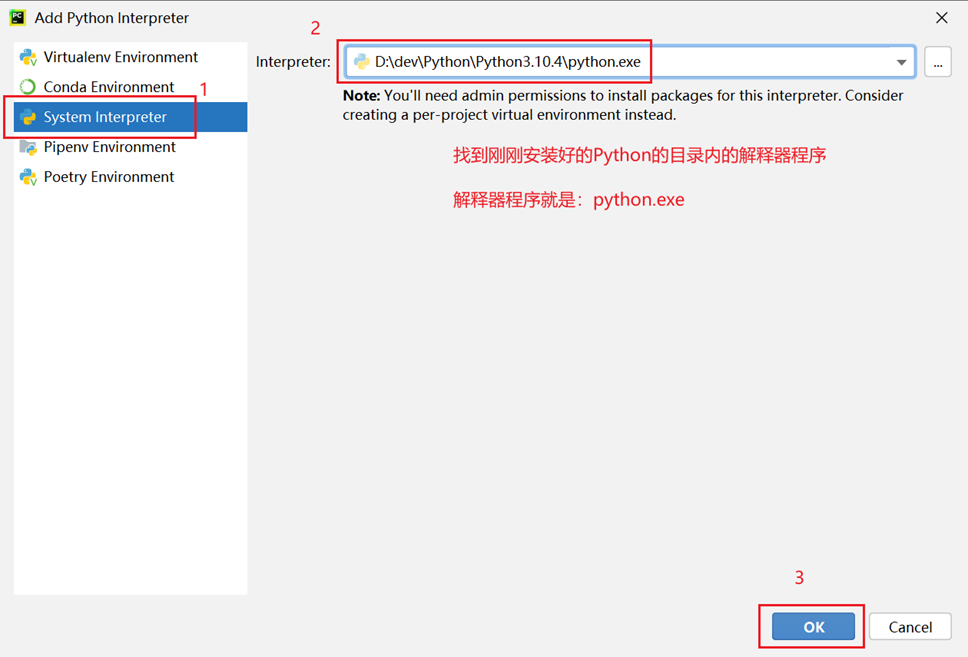

**确认工程路径和解释器**

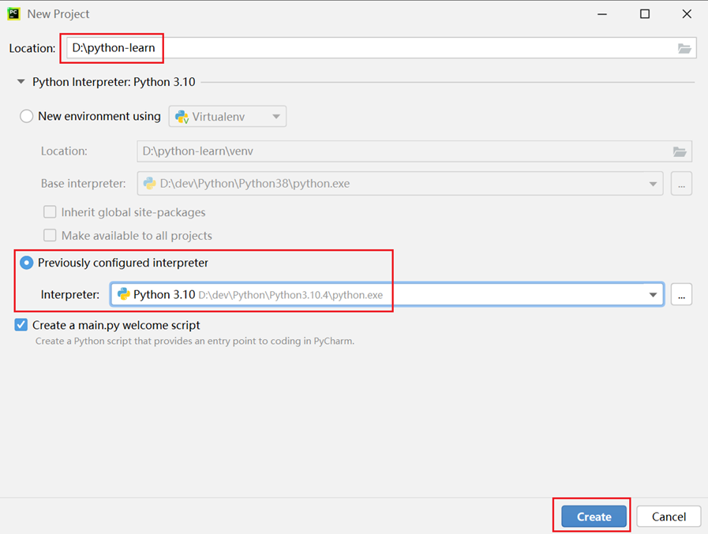

**工程创建完成：**

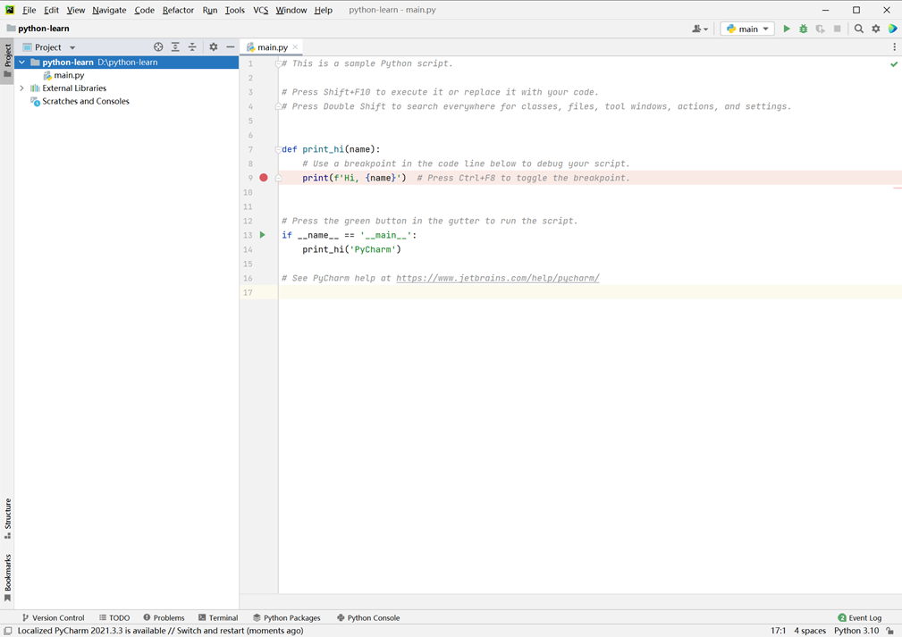

**创建一个 Python 代码文件 ，名称 test.py**

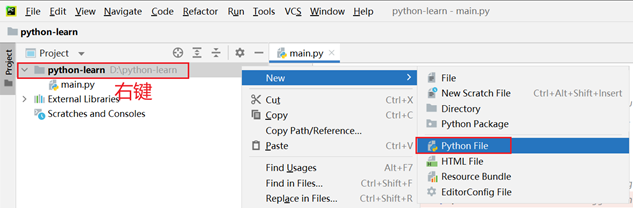

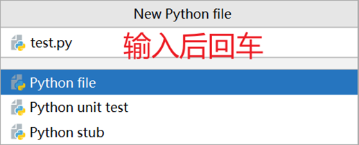

**填写如下内容**

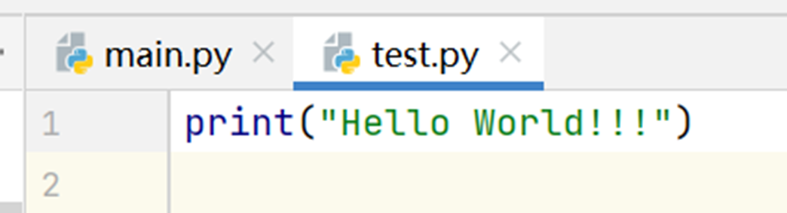

**在空白处右键，然后选择运行：**

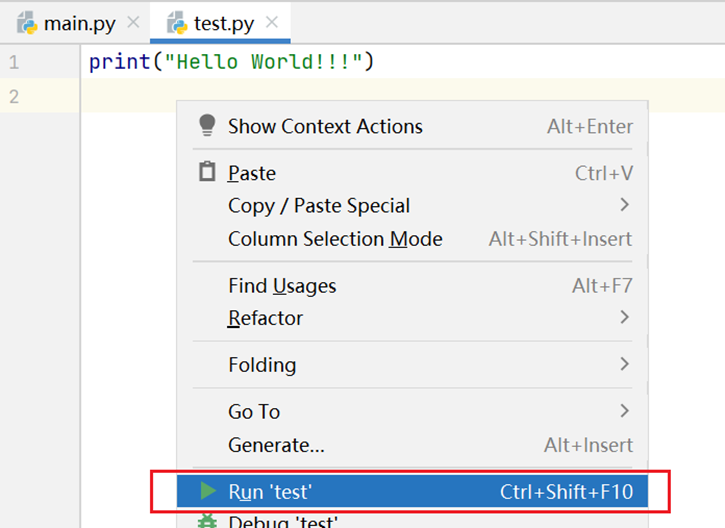

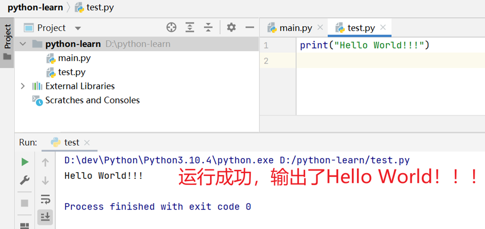

### **7.2 总结**

1.Python 最常见的开发环境是：PyCharm 软件，这是一个专用于 Python 的开发工具

2.PyCharm 需要以“工程”为单元，供我们使用。想要写代码需要先创建一个工程
