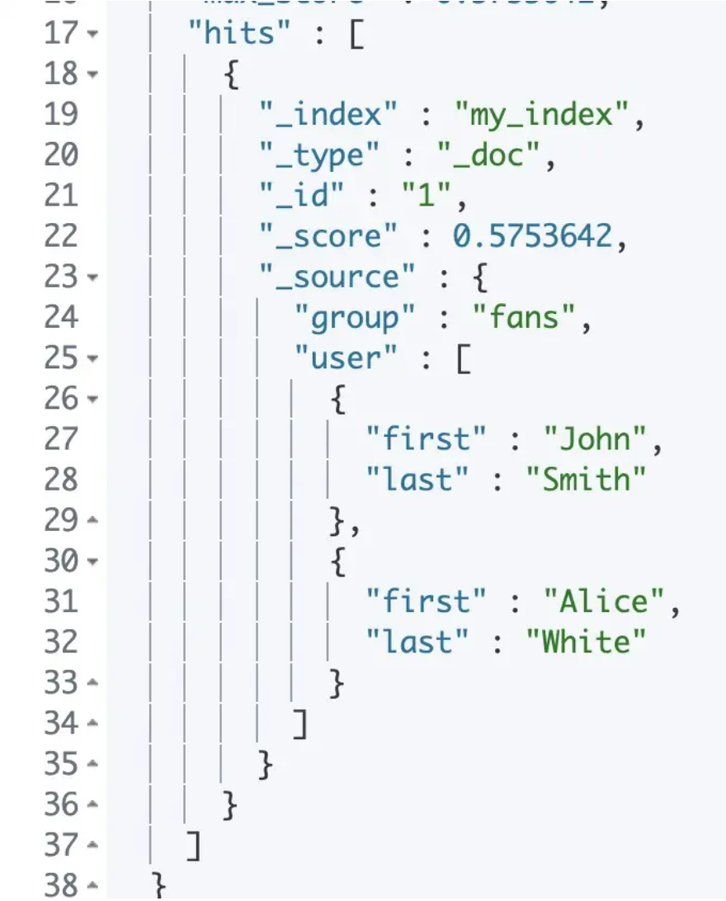

# 🌈ES 中的 Nested 数据类型

<hr/>

[[toc]]

## 前言

在开始之前需要提前理解一下两点

- 一个 object 字段只能存入一个 JSON 对象, 不适合存对象数组
- 如果想要一个字段存一个对象数组,可以使用 nested 字段类型

在工作开发中, 我们常遇到 2 张表示 1 对多的关系,这样的父子结构, 如果用 MySQL 存的话,子表设一个字段 parentId 存储父表的 id,这样就可以用 join 关联查询.
那么 ES 作为 NoSQL,它有更便捷的存储方式来保存父子结构:

- 第一种:join 字段类型,子文档包含父文档 ID,可用 has_parent 和 has_child 来查询
- 第二种:nested 字段类型,子文档就存在父文档某个字段内部,适合子文档数量较少的情况

object 存储对象数组的缺陷, 如果要存对象数组, 并且对数组中每一个对象进行单独查询, 用 nested 类型比较合适.
但是 nested 类型适合子文档数量较少情况,有 es 有如下默认设置

- 一个文档最多有 50 个 nested 类型的字段
- 一个文档所有 nested 类型的字段存储文档最大数量是 10000 条

## （一）ES 如何存储对象

ElasticSearch 中可以将数据以对象的方式存储并查询，但是 ES 底层的 Lucene 没有内部对象的概念，因此如果**通过默认的方式**往 ES 中插入对象**【暂且我们叫他为 Object 类型】**，ES 会将对象层次结构扁平化为字段名称和值的简单列表。 比如下面这一段数据：

```json
PUT my_index/_doc/1
{
  "group" : "fans",
  "user" : [
    {
      "first" : "John",
      "last" :  "Smith"
    },
    {
      "first" : "Alice",
      "last" :  "White"
    }
  ]
}
```

ES 内部会将这份数据变成下面这个样子：

```json
{
  "group": "fans",
  "user.first": ["alice", "john"],
  "user.last": ["smith", "white"]
}
```

缺失了**first**和**last**之间的关联性。比如这个时候想查询一个 first 为**John**，last 为**White**的人，理论上是没有这个人的，但是实际上名为 fans 的这个组还是被查出来了。

```json
GET my_index/_search
{
  "query": {
    "bool": {
      "must": [
        { "match": { "user.first": "John" }},
        { "match": { "user.last":  "White" }}
      ]
    }
  }
}
```

从结果可以看到，两条数据都被查询出来了。



## （二）Nested 类型

这个时候就需要用到**nested**，nested 类型是 object 数据类型的特殊版本，它允许对象数组以一种可以相互独立查询的方式进行索引。

在 Nested 内部，每个对象索引其实是一个单独的隐藏文档，这意味着每个嵌套对象都可以独立于其他对象进行查询。

使用 Nested 需要先创建索引，依旧通过上边的这个例子

```json
DELETE my_index

PUT my_index
{
  "mappings": {
    "properties": {
      "user": {
        "type": "nested"
      }
    }
  }
}

PUT my_index/_doc/1
{
  "group" : "fans",
  "user" : [
    {
      "first" : "John",
      "last" :  "Smith",
      "age" : "23"
    },
    {
      "first" : "Alice",
      "last" :  "White",
      "age":"24"
    }
  ]
}
```

首先创建 my_index 索引，设置 user 的类型为 nested，接着在查询时，需要通过 es 的 nested 查询语句查询，使用同样的方式查询 first 为 John，last 为 White 的用户，这次的结果是不存在。因为通过 nested 存储的对象是具有关联性的。

```json
GET my_index/_search
{
  "query": {
    "nested": {
      "path": "user",
      "query": {
        "bool": {
          "must": [
            { "match": { "user.first": "John" }},
            { "match": { "user.last":  "White" }}
          ]
        }
      }
    }
  }
}
```

上边的 DSL 语句用 Java API 实现如下：

```java
@Test
public void testNested() throws Exception{
    //自己封装的一个获取RestHighLevelClient的类
    RestHighLevelClient client=ElasticSearchClient.getClient();
    SearchRequest request = new SearchRequest("my_index");
    SearchSourceBuilder searchSourceBuilder = new SearchSourceBuilder();
    BoolQueryBuilder boolQueryBuilder = QueryBuilders.boolQuery();
    boolQueryBuilder.must(QueryBuilders.matchQuery("user.first","John"));
    boolQueryBuilder.must(QueryBuilders.matchQuery("user.last","White"));
    searchSourceBuilder.query(QueryBuilders.nestedQuery("user",boolQueryBuilder, ScoreMode.None));
    request.source(searchSourceBuilder);
    SearchResponse search = client.search(request, RequestOptions.DEFAULT);
    SearchHit[] hits = search.getHits().getHits();
    for (int i = 0; i < hits.length; i++) {
        SearchHit hit = hits[i];
        System.out.println(hit.getSourceAsString());
    }
}
```

## （三）使用 nested 进行聚合查询

除了使用 nested 进行普通查询外，nested 也支持聚合查询，同样是上面的例子，现在做一个对年龄聚合的操作：

```json
GET my_index/_search
{
  "aggs": {
    "nestedAgg": {
      "nested": {
        "path": "user"
      },
      "aggs": {
        "ageAgg": {
          "terms": {
            "field": "user.age.keyword",
            "size": 10
          }
        }
      }
    }
  }
}
```

## （四）nested 中的 inner_hits

查询 nested 对象时，只要查询条件符合这个 nested 对象里的某一个条件，整个 nested 对象都会被检索出来。比如上面这个例子中，我只想查询叫做 John Smith 的这个人，但是通过普通的 query 查询会把整条记录都查询出来，效果就是这样：

```json
"hits" : [
      {
        "_index" : "my_index",
        "_type" : "_doc",
        "_id" : "1",
        "_score" : 1.3862942,
        "_source" : {
          "group" : "fans",
          "user" : [
            {
              "first" : "John",
              "last" : "Smith",
              "age" : "23"
            },
            {
              "first" : "Alice",
              "last" : "White",
              "age" : "24"
            }
          ]
        }
      }
    ]
```

如果只想要 nested 中里的一个对象，就可以使用 inner_hits。使用比较简单，只需要在查询语句之后加上 inner_hits 即可。

```json
GET my_index/_search
{
  "query": {
    "nested": {
      "path": "user",
      "query": {
        "bool": {
          "must": [
            { "match": { "user.first": "John" }},
            { "match": { "user.last":  "Smith" }}
          ]
        }
      },
      "inner_hits": {}
    }
  }
}
```

查询结果里就会多出来一块数据，里面就只会展示具体的 nested 对象：

```json
"inner_hits" : {
          "user" : {
            "hits" : {
              "total" : {
                "value" : 1,
                "relation" : "eq"
              },
              "max_score" : 1.3862942,
              "hits" : [
                {
                  "_index" : "my_index",
                  "_type" : "_doc",
                  "_id" : "1",
                  "_nested" : {
                    "field" : "user",
                    "offset" : 0
                  },
                  "_score" : 1.3862942,
                  "_source" : {
                    "last" : "Smith",
                    "first" : "John",
                    "age" : "23"
                  }
                }
              ]
            }
          }
        }
```

## （五）nested 的使用建议

nested 可以很好地存储和查询对象类型数据，但是也不能滥用 nested。每个 nested 对象都被索引为一个单独的文档，简单来讲就是如果一个索引里包含 100 个 user 对象，那么在实际底层将创建 101 个 Lucene 文档，是一个很大的消耗。

nested 类型只应在特殊情况下使用，一个索引在创建的时候，nested 类型的对象默认不能超过 50 个，可通过`index.mapping.nested_fields.limit`修改。

一个具体的文档中，nested 类型中包含的嵌套对象的数量默认不能超过 10000 个，也就是说上面创建的 user 在一个文档里不能超过 10000 个，可通过`index.mapping.nested_objects.limit`修改。
