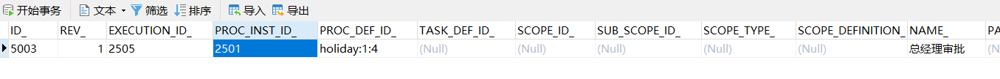

# 🎐Flowable 入门-基础篇

<hr/>

[[toc]]

# 最新 Flowable 工作流教程

# 一、Flowable 介绍

&emsp;&emsp;Flowable 是 BPMN 的一个基于 java 的软件实现，不过 Flowable 不仅仅包括 BPMN，还有 DMN 决策表和 CMMN Case 管理引擎，并且有自己的用户管理、微服务 API 等一系列功能，是一个服务平台。


# 二、Flowable 基础

官方手册：https://tkjohn.github.io/flowable-userguide/#_introduction

## 1.创建 ProcessEngine

&emsp;&emsp;创建一个基本的 maven 工程，可以是 Eclipse 也可以是其他 IDEA。然后添加两个依赖

- Flowable 流程引擎。使我们可以创建一个 ProcessEngine 流程引擎对象，并访问 Flowable API。
- 一个是 MySQL 的数据库驱动

在*pom.xml*文件中添加下列行：

```xml
<dependency>
    <groupId>org.flowable</groupId>
    <artifactId>flowable-engine</artifactId>
    <version>6.3.0</version>
</dependency>
<dependency>
    <groupId>mysql</groupId>
    <artifactId>mysql-connector-java</artifactId>
    <version>8.0.21</version>
</dependency>
```

&emsp;&emsp;然后创建一个普通的 Java 类，添加对应的 main 方法，首先要做的是初始化**ProcessEngine**流程引擎实例。这是一个线程安全的对象，因此通常只需要在一个应用中初始化一次。 *ProcessEngine*由**ProcessEngineConfiguration**实例创建。该实例可以配置与调整流程引擎的设置。 通常使用一个配置 XML 文件创建*ProcessEngineConfiguration*，但是（像在这里做的一样）也可以编程方式创建它。 *ProcessEngineConfiguration*所需的最小配置，是数据库 JDBC 连接：

```java
public static void main(String[] args) {
    ProcessEngineConfiguration cfg = new StandaloneProcessEngineConfiguration()
        .setJdbcUrl("jdbc:mysql://localhost:3306/flowable-learn?serverTimezone=UTC")
        .setJdbcUsername("root")
        .setJdbcPassword("123456")
        .setJdbcDriver("com.mysql.cj.jdbc.Driver")
        .setDatabaseSchemaUpdate(ProcessEngineConfiguration.DB_SCHEMA_UPDATE_TRUE);
    ProcessEngine processEngine = cfg.buildProcessEngine();
}
```

&emsp;&emsp;注意在 mysql8.0 中执行可能出现如下的错误


&emsp;&emsp;出现这种情况只需要在 mysql 的连接字符串中添加上 nullCatalogMeansCurrent=true，设置为只查当前连接的 schema 库即可。

```java
/**
 * 获取流程引擎对象
 */
@Test
public void testProcessEngine() {
    // 获取  ProcessEngineConfiguration 对象(流程引擎配置对象)
    ProcessEngineConfiguration configuration = new StandaloneProcessEngineConfiguration();
    // 配置 相关的数据库的连接信息
    configuration.setJdbcDriver("com.mysql.cj.jdbc.Driver");
    configuration.setJdbcUsername("root");
    configuration.setJdbcPassword("123456");
    configuration.setJdbcUrl("jdbc:mysql://localhost:3306/flowable-learn?serverTimezone=UTC&nullCatalogMeansCurrent=true");
    // 如果数据库中的表结构不存在就新建
    configuration.setDatabaseSchemaUpdate(ProcessEngineConfiguration.DB_SCHEMA_UPDATE_TRUE);
    // 通过 ProcessEngineConfiguration 构建我们需要的 processEngine 对象(流程引擎对象)
    ProcessEngine processEngine = configuration.buildProcessEngine();
    System.out.println("processEngine = " + processEngine);
}
```

&emsp;&emsp;然后应用运行没有问题，但也没有在控制台提供有用的信息，只有一条消息提示日志没有正确配置。Flowable 使用[SLF4J](http://www.slf4j.org/)作为内部日志框架。在这个例子中，我们使用 log4j 作为 SLF4J 的实现。因此在 pom.xml 文件中添加下列依赖：

```xml
<dependency>
    <groupId>org.slf4j</groupId>
    <artifactId>slf4j-api</artifactId>
    <version>1.7.21</version>
</dependency>
<dependency>
    <groupId>org.slf4j</groupId>
    <artifactId>slf4j-log4j12</artifactId>
    <version>1.7.21</version>
</dependency>
```

&emsp;&emsp;Log4j 需要一个配置文件。在*src/main/resources*文件夹下添加*log4j.properties*文件，并写入下列内容：

```properties
log4j.rootLogger=DEBUG, CA

log4j.appender.CA=org.apache.log4j.ConsoleAppender
log4j.appender.CA.layout=org.apache.log4j.PatternLayout
log4j.appender.CA.layout.ConversionPattern= %d{hh:mm:ss,SSS} [%t] %-5p %c %x - %m%n
```

&emsp;&emsp;重新运行应用。应该可以看到关于引擎启动与创建数据库表结构的提示日志：


&emsp;&emsp;同时可以看到创建了相关的表结构在数据库中(34 张表)


&emsp;&emsp;这样就得到了一个启动可用的流程引擎。接下来为它提供一个流程！

## 2.部署流程定义

&emsp;&emsp;接下来我们构建一个非常简单的请假流程，Flowable 引擎需要流程定义为 BPMN 2.0 格式，这是一个业界广泛接受的 XML 标准。 在 Flowable 术语中，我们将其称为一个**流程定义(process definition)**。一个*流程定义*可以启动多个**流程实例(process instance)**。*流程定义*可以看做是重复执行流程的蓝图。 在这个例子中，*流程定义*定义了请假的各个步骤，而一个*流程实例*对应某个雇员提出的一个请假申请。

&emsp;&emsp;BPMN 2.0 存储为 XML，并包含可视化的部分：使用标准方式定义了每个步骤类型（人工任务，自动服务调用，等等）如何呈现，以及如何互相连接。这样 BPMN 2.0 标准使技术人员与业务人员能用双方都能理解的方式交流业务流程。

&emsp;&emsp;我们要使用的流程定义为：


&emsp;&emsp;流程定义说明：

- 我们假定启动流程需要提供一些信息，例如雇员名字、请假时长以及说明。当然，这些可以单独建模为流程中的第一步。 但是如果将它们作为流程的“输入信息”，就能保证只有在实际请求时才会建立一个流程实例。否则（将提交作为流程的第一步），用户可能在提交之前改变主意并取消，但流程实例已经创建了。 在某些场景中，就可能影响重要的指标（例如启动了多少申请，但还未完成），取决于业务目标。
- 左侧的圆圈叫做**启动事件(start event)**。这是一个流程实例的起点。
- 第一个矩形是一个**用户任务(user task)**。这是流程中用户操作的步骤。在这个例子中，经理需要批准或驳回申请
- 取决于经理的决定，**排他网关(exclusive gateway)** (带叉的菱形)会将流程实例路由至批准或驳回路径
- 如果批准，则需要将申请注册至某个外部系统，并跟着另一个用户任务，将经理的决定通知给申请人。当然也可以改为发送邮件。
- 如果驳回，则为雇员发送一封邮件通知他。

&emsp;&emsp;一般来说，这样的*流程定义*使用可视化建模工具建立，如 Flowable Designer(Eclipse)或 Flowable Web Modeler(Web 应用)。但在这里我们直接撰写 XML，以熟悉 BPMN 2.0 及其概念。

&emsp;&emsp;与上面展示的流程图对应的 BPMN 2.0 XML 在下面显示。请注意这只包含了“流程部分”。如果使用图形化建模工具，实际的 XML 文件还将包含“可视化部分”，用于描述图形信息，如流程定义中各个元素的坐标（所有的图形化信息包含在 XML 的*BPMNDiagram*标签中，作为*definitions*标签的子元素）。

&emsp;&emsp;将下面的 XML 保存在*src/main/resources*文件夹下名为*holiday-request.bpmn20.xml*的文件中。

```xml
<?xml version="1.0" encoding="UTF-8"?>
<definitions xmlns="http://www.omg.org/spec/BPMN/20100524/MODEL"
             xmlns:xsi="http://www.w3.org/2001/XMLSchema-instance"
             xmlns:xsd="http://www.w3.org/2001/XMLSchema"
             xmlns:bpmndi="http://www.omg.org/spec/BPMN/20100524/DI"
             xmlns:omgdc="http://www.omg.org/spec/DD/20100524/DC"
             xmlns:omgdi="http://www.omg.org/spec/DD/20100524/DI"
             xmlns:flowable="http://flowable.org/bpmn"
             typeLanguage="http://www.w3.org/2001/XMLSchema"
             expressionLanguage="http://www.w3.org/1999/XPath"
             targetNamespace="http://www.flowable.org/processdef">

    <process id="holidayRequest" name="Holiday Request" isExecutable="true">

        <startEvent id="startEvent"/>
        <sequenceFlow sourceRef="startEvent" targetRef="approveTask"/>

        <userTask id="approveTask" name="Approve or reject request"/>
        <sequenceFlow sourceRef="approveTask" targetRef="decision"/>

        <exclusiveGateway id="decision"/>
        <sequenceFlow sourceRef="decision" targetRef="externalSystemCall">
            <conditionExpression xsi:type="tFormalExpression">
                <![CDATA[
          ${approved}
        ]]>
            </conditionExpression>
        </sequenceFlow>
        <sequenceFlow  sourceRef="decision" targetRef="sendRejectionMail">
            <conditionExpression xsi:type="tFormalExpression">
                <![CDATA[
          ${!approved}
        ]]>
            </conditionExpression>
        </sequenceFlow>

        <serviceTask id="externalSystemCall" name="Enter holidays in external system"
                     flowable:class="org.flowable.CallExternalSystemDelegate"/>
        <sequenceFlow sourceRef="externalSystemCall" targetRef="holidayApprovedTask"/>

        <userTask id="holidayApprovedTask" name="Holiday approved"/>
        <sequenceFlow sourceRef="holidayApprovedTask" targetRef="approveEnd"/>

        <serviceTask id="sendRejectionMail" name="Send out rejection email"
                     flowable:class="org.flowable.SendRejectionMail"/>
        <sequenceFlow sourceRef="sendRejectionMail" targetRef="rejectEnd"/>

        <endEvent id="approveEnd"/>

        <endEvent id="rejectEnd"/>
    </process>

</definitions>
```

&emsp;&emsp;现在我们已经有了流程 BPMN 2.0 XML 文件，下来需要将它**\*部署(deploy)\***到引擎中。*部署*一个流程定义意味着：

- 流程引擎会将 XML 文件存储在数据库中，这样可以在需要的时候获取它
- 流程定义转换为内部的、可执行的对象模型，这样使用它就可以启动*流程实例*。


&emsp;&emsp;将流程定义*部署*至 Flowable 引擎，需要使用*RepositoryService*，其可以从*ProcessEngine*对象获取。使用*RepositoryService*，可以通过 XML 文件的路径创建一个新的*部署(Deployment)*，并调用*deploy()*方法实际执行：

```java
    /**
     * 部署流程
     * 部署完成后 可以在 表中看到记录 act_re_deployment  act_ge_bytearray  act_re_procdef
     */
    @Test
    public void testDeploy(){
        // 配置数据库相关信息 获取 ProcessEngineConfiguration
        ProcessEngineConfiguration cfg = new StandaloneProcessEngineConfiguration()
                .setJdbcUrl("jdbc:mysql://localhost:3306/flowable-learn2?serverTimezone=UTC&nullCatalogMeansCurrent=true")
                .setJdbcUsername("root")
                .setJdbcPassword("123456")
                .setJdbcDriver("com.mysql.cj.jdbc.Driver")
                .setDatabaseSchemaUpdate(ProcessEngineConfiguration.DB_SCHEMA_UPDATE_TRUE);
        // 获取流程引擎对象
        ProcessEngine processEngine = cfg.buildProcessEngine();
        // 部署流程 获取RepositoryService对象
        RepositoryService repositoryService = processEngine.getRepositoryService();
        Deployment deployment = repositoryService.createDeployment()// 创建Deployment对象
                .addClasspathResource("holiday-request.bpmn20.xml") // 添加流程部署文件
                .name("请求流程") // 设置部署流程的名称
                .deploy(); // 执行部署操作
        System.out.println("deployment.getId() = " + deployment.getId());   // 获取该流程名称
        System.out.println("deployment.getName() = " + deployment.getName());// 获取该流程ID

    }
```

​ 输出结果：

```txt
deploy.getId() = 2501
deploy.getName() = 请求流程
```

&emsp;&emsp;然后执行该方法日志操作成功：


&emsp;&emsp;在后台表结构也可以看到相关的信息

act_re_deployment: 流程定义部署表，每部署一次就增加一条记录


act_re_procdef ：流程定义表，部署每个新的流程定义都会在这张表中增加一条记录


act_ge_bytearray ：流程资源表，流程部署的 bpmn 文件和 png 图片会保存在该表中


&emsp;&emsp;我们现在可以通过 API 查询验证流程定义已经部署在引擎中（并学习一些 API）。通过*RepositoryService*创建的*ProcessDefinitionQuery*对象实现。

```java
/**
 * 查看流程定义
 */
@Test
public void testDeployQuery(){
    // 配置数据库相关信息 获取 ProcessEngineConfiguration
    ProcessEngineConfiguration cfg = new StandaloneProcessEngineConfiguration()
            .setJdbcUrl("jdbc:mysql://localhost:3306/flowable-learn2?serverTimezone=UTC&nullCatalogMeansCurrent=true")
            .setJdbcUsername("root")
            .setJdbcPassword("123456")
            .setJdbcDriver("com.mysql.cj.jdbc.Driver")
            .setDatabaseSchemaUpdate(ProcessEngineConfiguration.DB_SCHEMA_UPDATE_TRUE);
    // 获取流程引擎对象
    ProcessEngine processEngine = cfg.buildProcessEngine();
    // 部署流程 获取RepositoryService对象
    RepositoryService repositoryService = processEngine.getRepositoryService();
    // 获取流程定义对象
    ProcessDefinition processDefinition = repositoryService.createProcessDefinitionQuery()
            .deploymentId("2501")
            .singleResult();
    System.out.println("processDefinition.getId() = " + processDefinition.getId());
    System.out.println("processDefinition.getName() = " + processDefinition.getName());
    System.out.println("processDefinition.getDeploymentId() = " + processDefinition.getDeploymentId());
    System.out.println("processDefinition.getDescription() = " + processDefinition.getDescription());

}
```

输出结果为：

```txt
processDefinition.getId() = holidayRequest:2:2503
processDefinition.getName() = Holiday Request
processDefinition.getDeploymentId() = 2501
processDefinition.getDescription() = null
```

```java
    /**
     * 查询流程定义的信息
     */
    @Test
    public void testDeployQuery() {
        ProcessEngine processEngine = configuration.buildProcessEngine();
        RepositoryService repositoryService = processEngine.getRepositoryService();
        /*ProcessDefinitionQuery processDefinitionQuery = repositoryService.createProcessDefinitionQuery();
        ProcessDefinition processDefinition = processDefinitionQuery.deploymentId("1").singleResult();*/

        // 获取流程定义 也可以链式编程
        ProcessDefinition processDefinition = repositoryService.createProcessDefinitionQuery()
                .deploymentId("1")  // 部署id
                .singleResult();       // 获取一个结果集
        System.out.println("processDefinition.getDeploymentId() = " + processDefinition.getDeploymentId()); // 流程部署ID
        System.out.println("processDefinition.getName() = " + processDefinition.getName());                 // 部署名称
        System.out.println("processDefinition.getDescription() = " + processDefinition.getDescription());   // 部署描述
        System.out.println("processDefinition.getId() = " + processDefinition.getId());                     // 流程定义ID
    }
```

输出结果：

```txt
processDefinition.getDeploymentId() = 1
processDefinition.getName() = 请假流程
processDefinition.getDescription() = null
processDefinition.getId() = holidayRequest:1:3
```

## 3.启动流程实例

&emsp;&emsp;现在已经在流程引擎中*部署*了流程定义，因此可以使用这个*流程定义*作为“模板”启动*流程实例*。


&emsp;&emsp;要启动流程实例，需要提供一些初始化*流程变量*。一般来说，可以通过呈现给用户的表单，或者在流程由其他系统自动触发时通过 REST API，来获取这些变量。在这个例子里，我们简化直接在代码中定义了，我们使用*RuntimeService*启动一个*流程实例*。

```java
/**
 * 启动流程实例
 */
@Test
public void testRunProcess(){
    // 配置数据库相关信息 获取 ProcessEngineConfiguration
    ProcessEngineConfiguration cfg = new StandaloneProcessEngineConfiguration()
            .setJdbcUrl("jdbc:mysql://localhost:3306/flowable-learn2?serverTimezone=UTC&nullCatalogMeansCurrent=true")
            .setJdbcUsername("root")
            .setJdbcPassword("123456")
            .setJdbcDriver("com.mysql.cj.jdbc.Driver")
            .setDatabaseSchemaUpdate(ProcessEngineConfiguration.DB_SCHEMA_UPDATE_TRUE);
    // 获取流程引擎对象
    ProcessEngine processEngine = cfg.buildProcessEngine();
    // 启动流程实例通过 RuntimeService 对象
    RuntimeService runtimeService = processEngine.getRuntimeService();
    // 构建流程变量
    Map<String,Object> variables = new HashMap<>();
    variables.put("employee","张三") ;// 谁申请请假
    variables.put("nrOfHolidays",3); // 请几天假
    variables.put("description","工作累了，想出去玩玩"); // 请假的原因
    // 启动流程实例，第一个参数是流程定义的id
    ProcessInstance processInstance = runtimeService
            .startProcessInstanceByKey("holidayRequest", variables);// 启动流程实例
    // 输出相关的流程实例信息
    System.out.println("流程定义的ID：" + processInstance.getProcessDefinitionId());
    System.out.println("流程实例的ID：" + processInstance.getId());
    System.out.println("当前活动的ID：" + processInstance.getActivityId());
}
```

启动成功，输出结果如下：

```txt
流程定义的ID：holidayRequest:2:2503
流程实例的ID：5001
当前活动的ID：null
```

对应的流程实例 ID 为：5001

启动流程实例涉及到的表结构：

- act_hi_actinst 流程实例执行历史
- act_hi_identitylink 流程的参与用户的历史信息
- act_hi_procinst 流程实例历史信息
- act_hi_taskinst 流程任务历史信息
- act_ru_execution 流程执行信息
- act_ru_identitylink 流程的参与用户信息
- act_ru_task 任务信息

## 4.查看任务

&emsp;&emsp;上面员工发起了一个请假流程，接下来就会流转到总经理这儿来处理，之前我们没有指定经理这的处理人，我们可以加一个


&emsp;&emsp;然后我们来查看下 lisi 的任务

```java
/**
* 查看任务
*/
@Test
public void testQueryTask(){
// 配置数据库相关信息 获取 ProcessEngineConfiguration
ProcessEngineConfiguration cfg = new StandaloneProcessEngineConfiguration()
        .setJdbcUrl("jdbc:mysql://localhost:3306/flowable-learn2?serverTimezone=UTC&nullCatalogMeansCurrent=true")
        .setJdbcUsername("root")
        .setJdbcPassword("123456")
        .setJdbcDriver("com.mysql.cj.jdbc.Driver")
        .setDatabaseSchemaUpdate(ProcessEngineConfiguration.DB_SCHEMA_UPDATE_TRUE);
// 获取流程引擎对象
ProcessEngine processEngine = cfg.buildProcessEngine();
// 获取任务服务对象
TaskService taskService = processEngine.getTaskService();
// 获取查询
List<Task> list = taskService.createTaskQuery()
        .processDefinitionKey("holidayRequestNew")
        .taskAssignee("lisi")
        .list();
   for (Task task : list) {
        System.out.println("task.getProcessDefinitionId() = " + task.getProcessDefinitionId()); // 流程定义的主键
        System.out.println("task.getName() = " + task.getName());   // 任务名称
        System.out.println("task.getAssignee() = " + task.getAssignee());   // 任务代理人（受理人）
        System.out.println("task.getDescription() = " + task.getDescription()); // 任务的描述
        System.out.println("task.getId() = " + task.getId());   // 任务的ID
    }
}
```

输出结果为：

```txt
task.getProcessDefinitionId() = holidayRequestNew:1:10003
task.getId() = 12508
task.getAssignee() = lisi
task.getName() = Approve or reject request
```

## 5.完成任务

&emsp;&emsp;现在李四这个角色可以来完成当前的任务了


&emsp;&emsp;在此处我们直接解决掉这个请假，然后会走发送拒绝邮件的流程，这块我们需要用到 JavaDelegate 来触发。


我们定义这样一个 Java 类

```java
public class SendRejectionMail implements JavaDelegate {
/**
 * 触发发送邮件的操作
 * @param delegateExecution
 */
@Override
public void execute(DelegateExecution delegateExecution) {
    System.out.println("请假被拒绝,,,安心工作吧");
}
}
```

然后来完成任务

```java
/**
 * 完成任务
 */
@Test
public void testCompleteTask(){
    // 配置数据库相关信息 获取 ProcessEngineConfiguration
    ProcessEngineConfiguration cfg = new StandaloneProcessEngineConfiguration()
            .setJdbcUrl("jdbc:mysql://localhost:3306/flowable-learn2?serverTimezone=UTC&nullCatalogMeansCurrent=true")
            .setJdbcUsername("root")
            .setJdbcPassword("123456")
            .setJdbcDriver("com.mysql.cj.jdbc.Driver")
            .setDatabaseSchemaUpdate(ProcessEngineConfiguration.DB_SCHEMA_UPDATE_TRUE);
    // 获取流程引擎对象
    ProcessEngine processEngine = cfg.buildProcessEngine();
    // 获取任务服务对象
    TaskService taskService = processEngine.getTaskService();
    // 获取任务
    Task task = taskService.createTaskQuery()
            .processDefinitionKey("holidayRequestNew")
            .taskAssignee("lisi")
            .singleResult();
    // 添加流程变量(参数)
    Map<String,Object> variables = new HashMap<>();
    variables.put("approved",false); // 拒绝请假
    // 完成任务
    taskService.complete(task.getId(),variables);
}
```

然后可以看到 JavaDelegate 触发了


## 6.流程的删除

&emsp;&emsp;有些流程已经没有用了，我们需要删除掉，其实也非常简单

```java
    /**
     * 删除流程
     */
    @Test
    public void testDeleteProcess(){
        // 配置数据库相关信息 获取 ProcessEngineConfiguration
        ProcessEngineConfiguration cfg = new StandaloneProcessEngineConfiguration()
                .setJdbcUrl("jdbc:mysql://localhost:3306/flowable-learn2?serverTimezone=UTC&nullCatalogMeansCurrent=true")
                .setJdbcUsername("root")
                .setJdbcPassword("123456")
                .setJdbcDriver("com.mysql.cj.jdbc.Driver")
                .setDatabaseSchemaUpdate(ProcessEngineConfiguration.DB_SCHEMA_UPDATE_TRUE);
        // 获取流程引擎对象
        ProcessEngine processEngine = cfg.buildProcessEngine();
        RepositoryService repositoryService = processEngine.getRepositoryService();
        // 删除部署的流程 第一个参数是 id  如果部署的流程启动了就不允许删除了(报错)
        // repositoryService.deleteDeployment("2501");
        // 第二个参数是级联删除，如果流程启动了 相关的任务也会一并会被删除掉 (强制删除)
        repositoryService.deleteDeployment("2501",true);

    }
```

## 7.查看历史信息

&emsp;&emsp;选择使用 Flowable 这样的流程引擎的原因之一，是它可以自动存储所有流程实例的**审计数据**或**历史数据**。这些数据可以用于创建报告，深入展现组织运行的情况，瓶颈在哪里，等等。

&emsp;&emsp;例如，如果希望显示流程实例已经执行的时间，就可以从*ProcessEngine*获取*HistoryService*，并创建*历史活动(historical activities)*的查询。在下面的代码片段中，可以看到我们添加了一些额外的过滤条件：

- 只选择一个特定流程实例的活动
- 只选择已完成的活动

&emsp;&emsp;结果按照结束时间排序，代表其执行顺序。

```java
/**
 * 查看历史
 */
@Test
public void testQueryHistory(){
    // 配置数据库相关信息 获取 ProcessEngineConfiguration
    ProcessEngineConfiguration cfg = new StandaloneProcessEngineConfiguration()
            .setJdbcUrl("jdbc:mysql://localhost:3306/flowable-learn2?serverTimezone=UTC&nullCatalogMeansCurrent=true")
            .setJdbcUsername("root")
            .setJdbcPassword("123456")
            .setJdbcDriver("com.mysql.cj.jdbc.Driver")
            .setDatabaseSchemaUpdate(ProcessEngineConfiguration.DB_SCHEMA_UPDATE_TRUE);
    // 获取流程引擎对象
    ProcessEngine processEngine = cfg.buildProcessEngine();
     // 获取历史服务
    HistoryService historyService = processEngine.getHistoryService();
    // 获取历史活动实例
    List<HistoricActivityInstance> list = historyService.createHistoricActivityInstanceQuery()
            .processDefinitionId("holidayRequestNew:1:10003")	// 定义流程ID
            .finished()	// 查询的历史记录的状态是已经完成
            .orderByHistoricActivityInstanceEndTime().asc()	// 指定排序的字段和顺序（这里是示例结束时间升序）
            .list();	// 得到集合
    for (HistoricActivityInstance historicActivityInstance : list) {
        System.out.println(historicActivityInstance.getActivityId() + " took "
                + historicActivityInstance.getDurationInMillis() + " milliseconds");
    }

}
```

输出结果

```txt
startEvent took 1 milliseconds
approveTask took 837735 milliseconds
decision took 13 milliseconds
sendRejectionMail took 2 milliseconds
rejectEnd took 1 milliseconds
```

好了~flowable 的基本应用我们就先介绍到这里了。

# 三、Flowable 流程设计器

## 1.Eclipse Designer

&emsp;&emsp;Flowable 提供了名为 Flowable Eclipse Designer 的 Eclipse 插件，可以用于图形化地建模、测试与部署 BPMN 2.0 流程。

### 1.1 下载安装 Eclipse

&emsp;&emsp;去 Eclipse 官网下载即可：https://www.eclipse.org/downloads/packages/release 注意 2020-09 后的版本不再支持 jdk8


&emsp;解压缩就可以了，然后进入解压缩的目录


&emsp;&emsp;直接启动即可


### 1.2 安装 Flowable 插件

&emsp;&emsp;然后我们再安装下 Flowable 的插件，选择**Help → Install New Software**。在下图面板中，点击*Add*按钮，并填写下列字段

- **Name:** Flowable BPMN 2.0 designer
- **Location:** http://www.flowable.org/designer/update/


&emsp;&emsp;这种在线更新的方式已经被官网移除了，操作不了


&emsp;&emsp;这时我们就只能通过离线安装的方式来实现了，下载对应的离线文件


&emsp;&emsp;安装步骤来操作，


然后继续：选择**Help → Install New Software**


下一步


再下一步


然后 finish。弹出如下窗口


重启即可

### 1.3 创建项目

&emsp;&emsp;然后我们就可以创建一个 Flowable Project 了


&emsp;&emsp;然后我们可以在 src/mian/resources/ 的目录下创建对应的流程图了


&emsp;&emsp;看到如下的界面说明插件安装成功了


### 1.4 创建流程图

使用滑板来绘制流程，通过从右侧把图标拖拽到左侧的面板，最终的效果


指 定流程的主键


指定任务的负责人

在 Properties 视图中指定每个任务节点的负责人


创建请假单：zhangsan

审批请假单：lisi

当我们设置完成后保存文件，会同时生成 png 图片


注意：生成图片需要如下配置


### 1.5 部署流程

&emsp;&emsp;首先在 Eclipse 中生成 bar 文件，选中项目然后鼠标右击


然后会发现在项目的根目录下多了一个 deployment 文件夹，里面多了一个 MyProcess.bar 文件


然后我们就可以把这个 bar 文件拷贝到 IDEA 中，继续部署的流程


而部署的代码和前面没啥区别

```java
    @Test
    public void testDeploy(){
        // 1.获取 ProcessEngine 对象
        ProcessEngine processEngine = configuration.buildProcessEngine();
        // 2.获取RepositoryService
        RepositoryService repositoryService = processEngine.getRepositoryService();
        InputStream in = this.getClass().getClassLoader().getResourceAsStream("MyHoliday.bar");
        ZipInputStream zipInputStream = new ZipInputStream(in);
        // 3.完成流程的部署操作 ZIP 或者 Bar文件
        Deployment deploy = repositoryService.createDeployment()
               // .addClasspathResource("MyHoliday.bar")// 关联要部署的流程文件
                .addZipInputStream(zipInputStream)
                .name("XXX公司请求流程")
                .deploy() ;// 部署流程
        System.out.println("deploy.getId() = " + deploy.getId());
        System.out.println("deploy.getName() = " + deploy.getName());
    }
```

执行后查看表结构，相关的信息就进去了


完整的案例代码：

```java
package com.bobo.flowable.test;

import org.flowable.engine.*;
import org.flowable.engine.history.HistoricActivityInstance;
import org.flowable.engine.impl.cfg.StandaloneProcessEngineConfiguration;
import org.flowable.engine.repository.Deployment;
import org.flowable.engine.runtime.ProcessInstance;
import org.flowable.task.api.Task;
import org.junit.Before;
import org.junit.Test;

import java.io.InputStream;
import java.util.HashMap;
import java.util.List;
import java.util.Map;
import java.util.zip.ZipInputStream;

public class Test02 {

    ProcessEngineConfiguration configuration = null;
    @Before
    public void before(){
        // 获取  ProcessEngineConfiguration 对象
        configuration = new StandaloneProcessEngineConfiguration();
        // 配置 相关的数据库的连接信息
        configuration.setJdbcDriver("com.mysql.cj.jdbc.Driver");
        configuration.setJdbcUsername("root");
        configuration.setJdbcPassword("123456");
        configuration.setJdbcUrl("jdbc:mysql://localhost:3306/flowable-learn?serverTimezone=UTC&nullCatalogMeansCurrent=true");
        // 如果数据库中的表结构不存在就新建
        configuration.setDatabaseSchemaUpdate(ProcessEngineConfiguration.DB_SCHEMA_UPDATE_TRUE);
    }

    /**
     * 部署流程
     *
     */
    @Test
    public void testDeploy(){
        // 1.获取 ProcessEngine 对象
        ProcessEngine processEngine = configuration.buildProcessEngine();
        // 2.获取RepositoryService
        RepositoryService repositoryService = processEngine.getRepositoryService();
        InputStream in = this.getClass().getClassLoader().getResourceAsStream("MyHoliday.bar");
        ZipInputStream zipInputStream = new ZipInputStream(in);
        // 3.完成流程的部署操作 ZIP 或者 Bar文件
        Deployment deploy = repositoryService.createDeployment()
               // .addClasspathResource("MyHoliday.bar")// 关联要部署的流程文件
                .addZipInputStream(zipInputStream)
                .name("XXX公司请求流程")
                .deploy() ;// 部署流程
        System.out.println("deploy.getId() = " + deploy.getId());
        System.out.println("deploy.getName() = " + deploy.getName());
    }

    /**
     * 启动流程实例
     */
    @Test
    public void testRunProcess(){
        ProcessEngine processEngine = configuration.buildProcessEngine();

        // 我们需要通过RuntimeService来启动流程实例
        RuntimeService runtimeService = processEngine.getRuntimeService();

        // 启动流程实例
        ProcessInstance holidayRequest = runtimeService.startProcessInstanceById("myProcess:1:25004");
        System.out.println("holidayRequest.getProcessDefinitionId() = " + holidayRequest.getProcessDefinitionId());
        System.out.println("holidayRequest.getActivityId() = " + holidayRequest.getActivityId());
        System.out.println("holidayRequest.getId() = " + holidayRequest.getId());
    }

    /**
     * 测试任务查询
     */
    @Test
    public void testQueryTask(){
        ProcessEngine processEngine = configuration.buildProcessEngine();
        TaskService taskService = processEngine.getTaskService();
        List<Task> list = taskService.createTaskQuery()
                .processDefinitionKey("myProcess") // 指定查询的流程编程
                .taskAssignee("zhangsan") // 查询这个任务的处理人
                .list();
        for (Task task : list) {
            System.out.println("task.getProcessDefinitionId() = " + task.getProcessDefinitionId());
            System.out.println("task.getName() = " + task.getName());
            System.out.println("task.getAssignee() = " + task.getAssignee());
            System.out.println("task.getDescription() = " + task.getDescription());
            System.out.println("task.getId() = " + task.getId());
        }
    }

    /**
     * 完成当前任务
     */
    @Test
    public void testCompleteTask(){
        ProcessEngine processEngine = configuration.buildProcessEngine();
        TaskService taskService = processEngine.getTaskService();
        Task task = taskService.createTaskQuery()
                .processDefinitionKey("myProcess")
                .taskAssignee("lisi")
                .singleResult();
        // 创建流程变量

        if(task != null){
            // 完成任务
            taskService.complete(task.getId());
        }


    }

    /**
     * 获取流程任务的历史数据
     */
    @Test
    public void testHistory(){
        ProcessEngine processEngine = configuration.buildProcessEngine();
        HistoryService historyService = processEngine.getHistoryService();
        List<HistoricActivityInstance> list = historyService.createHistoricActivityInstanceQuery()
                .processDefinitionId("myProcess:1:25004")
                .finished() // 查询的历史记录的状态是已经完成
                .orderByHistoricActivityInstanceEndTime().asc() // 指定排序的字段和顺序
                .list();
        for (HistoricActivityInstance history : list) {
            System.out.println(history.getActivityName()+":"+history.getAssignee()+"--"
                    +history.getActivityId()+":" + history.getDurationInMillis()+"毫秒");
        }

    }
}

```

## 2.Flowable UI 应用

&emsp;&emsp;Flowable 提供了几个 web 应用，用于演示及介绍 Flowable 项目提供的功能：

- Flowable IDM: 身份管理应用。为所有 Flowable UI 应用提供单点登录认证功能，并且为拥有 IDM 管理员权限的用户提供了管理用户、组与权限的功能。
- Flowable Modeler: 让具有建模权限的用户可以创建流程模型、表单、选择表与应用定义。
- Flowable Task: 运行时任务应用。提供了启动流程实例、编辑任务表单、完成任务，以及查询流程实例与任务的功能。
- Flowable Admin: 管理应用。让具有管理员权限的用户可以查询 BPMN、DMN、Form 及 Content 引擎，并提供了许多选项用于修改流程实例、任务、作业等。管理应用通过 REST API 连接至引擎，并与 Flowable Task 应用及 Flowable REST 应用一同部署。

&emsp;&emsp;所有其他的应用都需要 Flowable IDM 提供认证。每个应用的 WAR 文件可以部署在相同的 servlet 容器（如 Apache Tomcat）中，也可以部署在不同的容器中。由于每个应用使用相同的 cookie 进行认证，因此应用需要运行在相同的域名下。

### 2.1 安装部署

下载 Tomcat：https://tomcat.apache.org/download-80.cgi 官网下载后解压缩到非中文目录即可，然后是下载 FlowableUI 的文件，在 Flowable6.6 之后把 FlowableUI 中提供的四个功能合并到了一起。


然后把解压缩后的两个 war 包拷贝到 Tomcat 的解压缩的 webapps 目录下


Tomcat 目录：


### 2.2 启动服务

&emsp;&emsp;启动 Tomcat 服务，执行 startup.bat 文件


如果启动中出现乱码修改 Tomcat 的 conf 目录下的 logging.properties 文件中的编码


如果一闪而过则检查 jdk 的环境变量配置。启动成功后，在浏览器中访问 http://localhost:8080/flowable-ui, 默认的账号密码是 admin/test


### 2.3 用户管理

&emsp;&emsp;我们先在 `身份管理应用程序` 中创建用户并授权


创建用户


填写详细信息


授权管理


### 2.4 绘制流程

创建新的流程


流程图界面


创建流程，分配处理人


继续完成流程图的创建


### 2.5 部署流程

&emsp;&emsp;绘制好的流程图，我们只需要一键导出即可


下载下来后拷贝到项目的 resource 目录下即可


然后就是正常的操作流程了

`部署流程`--`查询流程定义的信息`--`删除流程定义`--`启动流程实例`--`任务查询`--`完成当前任务`--`获取流程任务的历史数据`等等（项目中的 Test03）

### 2.6 FlowableUI 演示

#### 2.6.1 部署流程

&emsp;&emsp;在 FlowableUI 中提供了演示程序 `该功能可以方便的更直观的看到程序的运转流程`


创建一个新的应用程序，并指定相关的信息


创建应用后需要指定对应的流程图


发布应用程序


#### 2.6.2 启动流程

&emsp;&emsp;发布了应用程序后我们就可以来启动流程了


点击显示图：


也就是可以看到当前是 user1 来处理，user1 登录后可以看到要处理的流程，user2 登录是看不到的。


点击完成后`流程`就向下一步流转了


这时再通过 user2 登录，就可以看到对应的代办的信息


然后点击完成，那么整个流程就结束了

# 四、Flowable 进阶

## 1.表结构讲解

&emsp;&emsp;工作流程的相关操作都是操作存储在对应的表结构中，为了能更好的弄清楚 Flowable 的实现原理和细节，我们有必要先弄清楚 Flowable 的相关表结构及其作用。在 Flowable 中的表结构在初始化的时候会创建五类表结构，具体如下：

- **ACT_RE** ：'RE'表示 repository。 这个前缀的表包含了流程定义和流程静态资源 （图片，规则，等等）。
- **ACT_RU**：'RU'表示 runtime。 这些运行时的表，包含流程实例，任务，变量，异步任务，等运行中的数据。 Flowable 只在流程实例执行过程中保存这些数据， 在流程结束时就会删除这些记录。 这样运行时表可以一直很小速度很快。
- **ACT_HI**：'HI'表示 history。 这些表包含历史数据，比如历史流程实例， 变量，任务等等。
- **ACT_GE**： GE 表示 general。 通用数据， 用于不同场景下
- **ACT_ID:** ’ID’表示 identity(组织机构)。这些表包含标识的信息，如用户，用户组，等等。

具体的表结构的含义:

| **表分类**   | **表名**              | **解释**                                           |
| ------------ | --------------------- | -------------------------------------------------- |
| 一般数据     |                       |                                                    |
|              | [ACT_GE_BYTEARRAY]    | 通用的流程定义和流程资源                           |
|              | [ACT_GE_PROPERTY]     | 系统相关属性                                       |
| 流程历史记录 |                       |                                                    |
|              | [ACT_HI_ACTINST]      | 历史的流程实例                                     |
|              | [ACT_HI_ATTACHMENT]   | 历史的流程附件                                     |
|              | [ACT_HI_COMMENT]      | 历史的说明性信息                                   |
|              | [ACT_HI_DETAIL]       | 历史的流程运行中的细节信息                         |
|              | [ACT_HI_IDENTITYLINK] | 历史的流程运行过程中用户关系                       |
|              | [ACT_HI_PROCINST]     | 历史的流程实例                                     |
|              | [ACT_HI_TASKINST]     | 历史的任务实例                                     |
|              | [ACT_HI_VARINST]      | 历史的流程运行中的变量信息                         |
| 流程定义表   |                       |                                                    |
|              | [ACT_RE_DEPLOYMENT]   | 部署单元信息                                       |
|              | [ACT_RE_MODEL]        | 模型信息                                           |
|              | [ACT_RE_PROCDEF]      | 已部署的流程定义                                   |
| 运行实例表   |                       |                                                    |
|              | [ACT_RU_EVENT_SUBSCR] | 运行时事件                                         |
|              | [ACT_RU_EXECUTION]    | 运行时流程执行实例                                 |
|              | [ACT_RU_IDENTITYLINK] | 运行时用户关系信息，存储任务节点与参与者的相关信息 |
|              | [ACT_RU_JOB]          | 运行时作业                                         |
|              | [ACT_RU_TASK]         | 运行时任务                                         |
|              | [ACT_RU_VARIABLE]     | 运行时变量表                                       |
| 用户用户组表 |                       |                                                    |
|              | [ACT_ID_BYTEARRAY]    | 二进制数据表                                       |
|              | [ACT_ID_GROUP]        | 用户组信息表                                       |
|              | [ACT_ID_INFO]         | 用户信息详情表                                     |
|              | [ACT_ID_MEMBERSHIP]   | 人与组关系表                                       |
|              | [ACT_ID_PRIV]         | 权限表                                             |
|              | [ACT_ID_PRIV_MAPPING] | 用户或组权限关系表                                 |
|              | [ACT_ID_PROPERTY]     | 属性表                                             |
|              | [ACT_ID_TOKEN]        | 记录用户的 token 信息                              |
|              | [ACT_ID_USER]         | 用户表                                             |

## 2.ProcessEngine 讲解（ProcessEngineTest）

**初始化方式**

### 2.1 硬编码的方式

&emsp;&emsp;我们前面讲解案例的时候是通过 ProcessEngineConfiguration 这个配置类来加载的。

```java
// 配置数据库相关信息 获取 ProcessEngineConfiguration
ProcessEngineConfiguration cfg = new StandaloneProcessEngineConfiguration()
    .setJdbcUrl("jdbc:mysql://localhost:3306/flowable-learn2?serverTimezone=UTC&nullCatalogMeansCurrent=true")
    .setJdbcUsername("root")
    .setJdbcPassword("123456")
    .setJdbcDriver("com.mysql.cj.jdbc.Driver")
    .setDatabaseSchemaUpdate(ProcessEngineConfiguration.DB_SCHEMA_UPDATE_TRUE);
// 获取流程引擎对象
ProcessEngine processEngine = cfg.buildProcessEngine();
```

&emsp;&emsp;这种方式会调用 buildProcessEngine()方法，里面的核心代码为：


### 2.2 配置文件

&emsp;&emsp;除了上面的硬编码的方式外，我们还可以在 resources 目录下创建一个`flowable.cfg.xml`文件，注意这个名称是固定的哦。内容如下：

```xml
<beans xmlns="http://www.springframework.org/schema/beans"
       xmlns:xsi="http://www.w3.org/2001/XMLSchema-instance"
       xsi:schemaLocation="http://www.springframework.org/schema/beans http://www.springframework.org/schema/beans/spring-beans.xsd">
    <bean id="processEngineConfiguration"
          class="org.flowable.engine.impl.cfg.StandaloneProcessEngineConfiguration">
        <property name="jdbcUrl" value="jdbc:mysql://localhost:3306/flow1?allowMultiQueries=true&amp;useUnicode=true&amp;characterEncoding=UTF-8&amp;useSSL=false&amp;serverTimezone=UTC&amp;nullCatalogMeansCurrent=true" /><property name="jdbcDriver" value="com.mysql.cj.jdbc.Driver" />
        <property name="jdbcUsername" value="root" />
        <property name="jdbcPassword" value="123456" />
        <property name="databaseSchemaUpdate" value="true" />
        <property name="asyncExecutorActivate" value="false" />
    </bean>
</beans>
```

&emsp;&emsp;在上面的配置文件中配置相关的信息。我们在 Java 代码中就可以简化为：

```java
/**
 * 加载默认的配置文件
 * flowable.cfg.xml（官方默认文件）
 */
@Test
public void processEngin02() {
    ProcessEngine defaultProcessEngine = ProcessEngines.getDefaultProcessEngine();
    System.out.println("defaultProcessEngine = " + defaultProcessEngine);
}
```

&emsp;&emsp;可以看下 getDefaultProcessEngine 的源码，在里面最终还是执行了和硬编码一样的代码

```java
    public static ProcessEngine getProcessEngine(String processEngineName) {
        if (!isInitialized()) {
            init(); // 完成初始化操作
        }
        return processEngines.get(processEngineName);
    }
```

&emsp;&emsp;进入 init 方法

```java
    public static synchronized void init() {
        if (!isInitialized()) {
            if (processEngines == null) {
                // Create new map to store process-engines if current map is null
                processEngines = new HashMap<>();
            }
            ClassLoader classLoader = ReflectUtil.getClassLoader();
            Enumeration<URL> resources = null;
            try {
                resources = classLoader.getResources("flowable.cfg.xml"); // 加载flowable.cfg.xml配置文件
            } catch (IOException e) {
                throw new FlowableIllegalArgumentException("problem retrieving flowable.cfg.xml resources on the classpath: " + System.getProperty("java.class.path"), e);
            }

            // Remove duplicated configuration URL's using set. Some
            // classloaders may return identical URL's twice, causing duplicate
            // startups
            Set<URL> configUrls = new HashSet<>();
            while (resources.hasMoreElements()) {
                configUrls.add(resources.nextElement());
            }
            for (Iterator<URL> iterator = configUrls.iterator(); iterator.hasNext();) {
                URL resource = iterator.next();
                LOGGER.info("Initializing process engine using configuration '{}'", resource.toString());
                initProcessEngineFromResource(resource); // 初始化ProcessEngine
            }

            try {
                resources = classLoader.getResources("flowable-context.xml"); // 在整合Spring的情况下加载该文件
            } catch (IOException e) {
                throw new FlowableIllegalArgumentException("problem retrieving flowable-context.xml resources on the classpath: " + System.getProperty("java.class.path"), e);
            }
            while (resources.hasMoreElements()) {
                URL resource = resources.nextElement();
                LOGGER.info("Initializing process engine using Spring configuration '{}'", resource.toString());
                initProcessEngineFromSpringResource(resource); // 从Spring的资源文件中完成ProcessEngine的初始化
            }

            setInitialized(true);
        } else {
            LOGGER.info("Process engines already initialized");
        }
    }
```

&emsp;&emsp;在源码中提供了单独使用好整合 Spring 的配置加载方式。再进入到 initProcessEngineFromResource(resource)方法中：


而且我们也可以看到 ProcessEngine 最终的实现是 ProcessEngineImpl 对象。

### 2.3 自定义配置文件

&emsp;&emsp;最后我们如果要加载自定义名称的配置文件可以通过 ProcessEngineConfiguration 中的对应构造方法来实现

```java
    @Test
    public void test2() throws Exception{
        ProcessEngineConfiguration configuration = ProcessEngineConfiguration
                .createProcessEngineConfigurationFromResource("flowable.cfg.xml");
        ProcessEngine processEngine = configuration.buildProcessEngine();
        System.out.println("processEngine = " + processEngine);
    }
```

## 3. Servcie 服务接口

Service 是工作流引擎提供用于进行工作流部署、执行、管理的服务接口，我们使用这些接口可以就是操作服务对应的数据表


### 3.1 Service 创建方式

通过 ProcessEngine 创建 Service

方式如下：

```java
RuntimeService runtimeService = processEngine.getRuntimeService();
RepositoryService repositoryService = processEngine.getRepositoryService();
TaskService taskService = processEngine.getTaskService();
// ...
```

### 3.2 Service 总览

| service 名称      | service 作用              |
| ----------------- | ------------------------- |
| RepositoryService | Flowable 的资源管理类     |
| RuntimeService    | Flowable 的流程运行管理类 |
| TaskService       | Flowable 的任务管理类     |
| HistoryService    | Flowable 的历史管理类     |
| ManagerService    | Flowable 的引擎管理类     |

简单介绍：

**RepositoryService**

是 activiti 的资源管理类，提供了管理和控制流程发布包和流程定义的操作。使用工作流建模工具设计的业务流程图需要使用此 service 将流程定义文件的内容部署到计算机。

除了部署流程定义以外还可以：查询引擎中的发布包和流程定义。

暂停或激活发布包，对应全部和特定流程定义。 暂停意味着它们不能再执行任何操作了，激活是对应的反向操作。获得多种资源，像是包含在发布包里的文件， 或引擎自动生成的流程图。

获得流程定义的 pojo 版本， 可以用来通过 java 解析流程，而不必通过 xml。

**RuntimeService**

Activiti 的流程运行管理类。可以从这个服务类中获取很多关于流程执行相关的信息

**TaskService**

Activiti 的任务管理类。可以从这个类中获取任务的信息。

**HistoryService**

Flowable 的历史管理类，可以查询历史信息，执行流程时，引擎会保存很多数据（根据配置），比如流程实例启动时间，任务的参与者， 完成任务的时间，每个流程实例的执行路径，等等。 这个服务主要通过查询功能来获得这些数据。

**ManagementService**

Activiti 的引擎管理类，提供了对 Flowable 流程引擎的管理和维护功能，这些功能不在工作流驱动的应用程序中使用，主要用于 Flowable 系统的日常维护。

## 4.图标介绍

&emsp;&emsp;BPMN 2.0 是业务流程建模符号 2.0 的缩写。它由 Business Process Management Initiative 这个非营利协会创建并不断发展。作为一种标识，BPMN 2.0 是使用一些**符号**来明确业务流程设计流程图的一整套符号规范，它能增进业务建模时的沟通效率。目前 BPMN2.0 是最新的版本，它用于在 BPM 上下文中进行布局和可视化的沟通。接下来我们先来了解在流程设计中常见的 符号。

BPMN2.0 的**基本符合**主要包含：

### 4.1 事件图标

&emsp;&emsp;在 Flowable 中的事件图标启动事件，边界事件,中间事件和结束事件.


### 4.2 活动(任务)图标

&emsp;&emsp;活动是工作或任务的一个通用术语。一个活动可以是一个任务，还可以是一个当前流程的子处理流程； 其次，你还可以为活动指定不同的类型。常见活动如下:


### 4.3 结构图标

&emsp;&emsp;结构图标可以看做是整个流程活动的结构，一个流程中可以包括子流程。常见的结构有：


### 4.4 网关图标

&emsp;&emsp;网关用来处理决策，有几种常用网关需要了解：


## 5.流程部署详解

### 5.1 部署实现

&emsp;&emsp;我们先来看下流程部署的具体过程。代码实现

```java
/**
 * 部署流程
 */
@Test
public void test3(){
    ProcessEngine processEngine = ProcessEngines.getDefaultProcessEngine();
    RepositoryService repositoryService = processEngine.getRepositoryService();
    Deployment deploy = repositoryService.createDeployment()
            .addClasspathResource("holiday-request-new.bpmn20.xml")
            .name("请假流程...")
            .category("请假") // 分类
            .tenantId("dpb") // 租户id
            .deploy();
    System.out.println("deploy.getId() = " + deploy.getId());
    System.out.println("deploy.getName() = " + deploy.getName());
    System.out.println("deploy.getCategory() = " + deploy.getCategory());
}
```

### 5.2 部署涉及表结构

涉及到的三张表：

部署资源表：act_ge_bytearray

| 字段           | 名称               | 备注                                                                               |
| -------------- | ------------------ | ---------------------------------------------------------------------------------- |
| ID\_           | 主键               |                                                                                    |
| REV\_          | 版本号             |                                                                                    |
| NAME\_         | 名称               | 部署的文件名称，如：holiday-request-new.bpmn20.xml、holiday-request-new.bpmn20.png |
| DEPLOYMENT*ID* | 部署 ID            |                                                                                    |
| BYTES\_        | 字节（二进制数据） |                                                                                    |
| GENERATED\_    | 是否系统生成       | 0 为用户上传，<br/>1 为系统自动生成， 比如系统会 自动根据 xml 生 成 png            |

部署 ID 表：act_re_deployment

| 字段               | 名称           | 备注 |
| ------------------ | -------------- | ---- |
| ID\_               | 主键           |      |
| NAME\_             | 名称           |      |
| CATEGORY\_         | 分类           |      |
| TENANT*ID*         | 租户 ID        |      |
| DEPLOY*TIME*       | 部署时间       |      |
| DERIVED*FROM*      | 来源于         |      |
| DERIVED*FROM_ROOT* | 来源于         |      |
| ENGINE*VERSION*    | 流程引擎的版本 |      |

流程表：act_re_procdef

| 字段                    | 名称             | 备注                                 |
| ----------------------- | ---------------- | ------------------------------------ |
| ID\_                    | 主键             |                                      |
| REV\_                   | 版本号           |                                      |
| CATEGORY\_              | 分类             | 流程定义的 Namespace 就是类别        |
| NAME\_                  | 名称             |                                      |
| KEY\_                   | 标识             |                                      |
| VERSION\_               | 版本             |                                      |
| DEPLOYMENT*ID*          | 部署 ID          |                                      |
| RESOURCE*NAME*          | 资源名称         | 流程 bpmn 文件名称                   |
| DGRM*RESOURCE_NAME*     | 图片资源名称     |                                      |
| DESCRIPTION\_           | 描述             |                                      |
| HAS*START_FORM_KEY*     | 拥有开始表单标识 | start 节点是否存在 formKey 0 否 1 是 |
| HAS*GRAPHICAL_NOTATION* | 拥有图形信息     |                                      |
| SUSPENSION*STATE*       | 挂起状态         | 暂停状态 1 激活 2 暂停               |
| TENANT*ID*              | 租户 ID          |                                      |
|                         |                  |                                      |

> 详细说明：
>
> 业务流程定义数据表。此表和 ACT_RE_DEPLOYMENT 是多对一的关系，即，一个部署的 bar 包里可能包含多个流程定义文件，每个流程定义文件都会有一条记录在 ACT_REPROCDEF 表内，每个流程定义的数据，都会对于 ACT_GE_BYTEARRAY 表内的一个资源文件和 PNG 图片文件。
>
> 和 ACT*GE_BYTEARRAY 的关联是通过程序用 ACT_GE_BYTEARRAY.NAME 与 ACT_RE_PROCDEF.NAME*完成的

### 5.3 挂起和激活

&emsp;&emsp;部署的流程默认的状态为激活，如果我们暂时不想使用该定义的流程，那么可以挂起该流程。当然该流程定义下边所有的流程实例全部暂停。

流程定义为挂起状态，该流程定义将不允许启动新的流程实例，同时该流程定义下的所有的流程实例都将全部挂起暂停执行。

```java
/**
     * 挂起流程
     */
    @Test
    public void test05(){
        // 获取流程引擎对象
        ProcessEngine processEngine = ProcessEngines.getDefaultProcessEngine();
        RepositoryService repositoryService = processEngine.getRepositoryService();
        ProcessDefinition processDefinition = repositoryService.createProcessDefinitionQuery()
                .processDefinitionId("holiday:1:4")
                .singleResult();
        // 获取流程定义的状态
        boolean suspended = processDefinition.isSuspended();
        System.out.println("suspended = " + suspended);
        if(suspended){
            // 表示被挂起
            System.out.println("激活流程定义");
            repositoryService.activateProcessDefinitionById("holiday:1:4",true,null);
        }else{
            // 表示激活状态
            System.out.println("挂起流程");
            repositoryService.suspendProcessDefinitionById("holiday:1:4",true,null);
        }
    }
```

具体的实现其实就是更新了流程定义表中的字段


而且通过 REV\_字段来控制数据安全，也是一种乐观锁的体现了，如果要启动一个已经挂起的流程就会出现如下的错误


## 6.启动流程实例

&emsp;&emsp;然后我们来看看启动流程实例的过程。实现代码如下：

```java
/**
     * 启动流程实例
     */
    @Test
    public void testRunProcess(){
        // 获取流程引擎对象
        ProcessEngine processEngine = ProcessEngines.getDefaultProcessEngine();
        // 启动流程实例通过 RuntimeService 对象
        RuntimeService runtimeService = processEngine.getRuntimeService();
        // 构建流程变量
        Map<String,Object> variables = new HashMap<>();
        variables.put("employee","张三") ;// 谁申请请假
        variables.put("nrOfHolidays",3); // 请几天假
        variables.put("description","工作累了，想出去玩玩"); // 请假的原因
        // 启动流程实例，第一个参数是流程定义的id
        ProcessInstance processInstance = runtimeService
                .startProcessInstanceById("holiday:1:4", variables);// 启动流程实例
        // 输出相关的流程实例信息
        System.out.println("流程定义的ID：" + processInstance.getProcessDefinitionId());
        System.out.println("流程实例的ID：" + processInstance.getId());
        System.out.println("当前活动的ID：" + processInstance.getActivityId());
    }
```

&emsp;&emsp;当我们启动了一个流程实例后，会在 ACT*RU*\*对应的表结构中操作,运行时实例涉及的表结构共 10 张：

- ACT_RU_DEADLETTER_JOB 正在运行的任务表
- ACT_RU_EVENT_SUBSCR 运行时事件
- ACT_RU_EXECUTION 运行时流程执行实例
- ACT_RU_HISTORY_JOB 历史作业表
- ACT_RU_IDENTITYLINK 运行时用户关系信息
- ACT_RU_JOB 运行时作业表
- ACT_RU_SUSPENDED_JOB 暂停作业表
- ACT_RU_TASK 运行时任务表
- ACT_RU_TIMER_JOB 定时作业表
- ACT_RU_VARIABLE 运行时变量表

&emsp;&emsp;启动一个流程实例的时候涉及到的表有

- ACT_RU_EXECUTION 运行时流程执行实例
- ACT_RU_IDENTITYLINK 运行时用户关系信息
- ACT_RU_TASK 运行时任务表
- ACT_RU_VARIABLE 运行时变量表

ACT_RU_EXECUTION 表结构

| 字段                  | 名称                    | 备注 |
| --------------------- | ----------------------- | ---- |
| ID\_                  | 主键                    |      |
| REV\_                 | 版本号                  |      |
| PROC*INST_ID*         | 流程实例 ID             |      |
| BUSINESS*KEY*         | 业务主键 ID             |      |
| PARENT*ID*            | 父执行流的 ID           |      |
| PROC*DEF_ID*          | 流程定义的数据 ID       |      |
| SUPER*EXEC*           |                         |      |
| ROOT*PROC_INST_ID*    | 流程实例的 root 流程 id |      |
| ACT*ID*               | 节点实例 ID             |      |
| IS*ACTIVE*            | 是否存活                |      |
| IS*CONCURRENT*        | 执行流是否正在并行      |      |
| IS*SCOPE*             |                         |      |
| IS*EVENT_SCOPE*       |                         |      |
| IS*MI_ROOT*           |                         |      |
| SUSPENSION*STATE*     | 流程终端状态            |      |
| CACHED*ENT_STATE*     |                         |      |
| TENANT*ID*            | 租户编号                |      |
| NAME\_                |                         |      |
| START*TIME*           | 开始时间                |      |
| START*USER_ID*        | 开始的用户编号          |      |
| LOCK*TIME*            | 锁定时间                |      |
| IS*COUNT_ENABLED*     |                         |      |
| EVT*SUBSCR_COUNT*     |                         |      |
| TASK*COUNT*           |                         |      |
| JOB*COUNT*            |                         |      |
| TIMER*JOB_COUNT*      |                         |      |
| SUSP*JOB_COUNT*       |                         |      |
| DEADLETTER*JOB_COUNT* |                         |      |
| VAR*COUNT*            |                         |      |
| ID*LINK_COUNT*        |                         |      |

创建流程实例后对应的表结构的数据


ACT_RU_TASK 运行时任务表

| 字段              | 名称                 | 备注                  |
| ----------------- | -------------------- | --------------------- |
| ID\_              | 主键                 |                       |
| REV\_             | 版本号               |                       |
| EXECUTION*ID*     | 任务所在的执行流 ID  |                       |
| PROC*INST_ID*     | 流程实例 ID          |                       |
| PROC*DEF_ID*      | 流程定义数据 ID      |                       |
| NAME\_            | 任务名称             |                       |
| PARENT*TASK_ID*   | 父任务 ID            |                       |
| DESCRIPTION\_     | 说明                 |                       |
| TASK*DEF_KEY*     | 任务定义的 ID 值     |                       |
| OWNER\_           | 任务拥有人           |                       |
| ASSIGNEE\_        | 被指派执行该任务的人 |                       |
| DELEGATION\_      | 委托人               |                       |
| PRIORITY\_        | 优先级               |                       |
| CREATE*TIME*      | 创建时间             |                       |
| DUE*DATE*         | 耗时                 |                       |
| CATEGORY\_        | 类别                 |                       |
| SUSPENSION*STATE* | 是否挂起             | 1 代表激活 2 代表挂起 |
| TENANT*ID*        | 租户编号             |                       |
| FORM*KEY*         |                      |                       |
| CLAIM*TIME*       | 拾取时间             |                       |

创建流程实例后对应的表结构的数据


ACT_RU_VARIABLE 运行时变量表

| 字段          | 名称                            | 备注                                 |
| ------------- | ------------------------------- | ------------------------------------ |
| ID\_          | 主键                            |                                      |
| REV\_         | 版本号                          |                                      |
| TYPE\_        | 参数类型                        | 可以是基本的类型，也可以用户自行扩展 |
| NAME\_        | 参数名称                        |                                      |
| EXECUTION*ID* | 参数执行 ID                     |                                      |
| PROC*INST_ID* | 流程实例 ID                     |                                      |
| TASK*ID*      | 任务 ID                         |                                      |
| BYTEARRAY*ID* | 资源 ID                         |                                      |
| DOUBLE\_      | 参数为 double，则保存在该字段中 |                                      |
| LONG\_        | 参数为 long，则保存在该字段中   |                                      |
| TEXT\_        | 用户保存文本类型的参数值        |                                      |
| TEXT2\_       | 用户保存文本类型的参数值        |                                      |

创建流程实例后对应的表结构的数据


ACT_RU_IDENTITYLINK 运行时用户关系信息

| 字段          | 名称         | 备注                                                                       |
| ------------- | ------------ | -------------------------------------------------------------------------- |
| ID\_          | 主键         |                                                                            |
| REV\_         | 版本号       |                                                                            |
| GROUP*ID*     | 用户组 ID    |                                                                            |
| TYPE\_        | 关系数据类型 | assignee 支配人(组)、candidate 候选人(组)、owner 拥有人,participant 参与者 |
| USER*ID*      | 用户 ID      |                                                                            |
| TASK*ID*      | 任务 ID      |                                                                            |
| PROC*INST_ID* | 流程定义 ID  |                                                                            |
| PROC*DEF_ID*  | 属性 ID      |                                                                            |

创建流程实例后对应的表结构的数据:


## 7.处理流程

&emsp;&emsp;上面的流程已经流转到了 zhangsan 这个用户这里，然后可以开始审批了

```java
// 获取流程引擎对象
    ProcessEngine processEngine = ProcessEngines.getDefaultProcessEngine();
    TaskService taskService = processEngine.getTaskService();
    Task task = taskService.createTaskQuery()
            .processDefinitionId("holiday:1:4")
            .taskAssignee("zhangsan")
            .singleResult();
    // 添加流程变量
    Map<String,Object> variables = new HashMap<>();
    variables.put("approved",false); // 拒绝请假
    // 完成任务
    taskService.complete(task.getId(),variables);
```

&emsp;&emsp;在正常处理流程中涉及到的表结构

- ACT_RU_EXECUTION 运行时流程执行实例
- ACT_RU_IDENTITYLINK 运行时用户关系信息
- ACT_RU_TASK 运行时任务表
- ACT_RU_VARIABLE 运行时变量表

ACT_RU_TASK 运行时任务表 :会新生成一条记录




ACT_RU_VARIABLE 运行时变量表:会记录新的流程变量


当然流程实例也可以挂起

```java
// 1.获取ProcessEngine对象
ProcessEngine engine = ProcessEngines.getDefaultProcessEngine();
// 2.获取RuntimeService
RuntimeService runtimeService = engine.getRuntimeService();
// 3.获取流程实例对象
ProcessInstance processInstance = runtimeService.createProcessInstanceQuery()
    .processInstanceId("25001")
    .singleResult();
// 4.获取相关的状态操作
boolean suspended = processInstance.isSuspended();
String id = processInstance.getId();
if(suspended){
    // 挂起--》激活
    runtimeService.activateProcessInstanceById(id);
    System.out.println("流程定义：" + id + "，已激活");
}else{
    // 激活--》挂起
    runtimeService.suspendProcessInstanceById(id);
    System.out.println("流程定义：" + id + "，已挂起");
}
```

启动第二个流程实例后再查看相关的表结构时，对他们的关系理解会更加的清楚一些

启动一个新的流程实例对应的就会产生两条记录


IDENTITYLINK 中会记录每次流程操作的信息


流程变量数据，及时 key 相同，但是属于不同的流程实例相互间也是隔离的


## 8.完成一个流程

&emsp;&emsp;然后我们把第一个流程处理完成

```java
ProcessEngine processEngine = cfg.buildProcessEngine();
TaskService taskService = processEngine.getTaskService();
Task task = taskService.createTaskQuery()
    .processDefinitionId("holiday:1:4")
    .taskAssignee("lisi")
    .singleResult();
// 添加流程变量
Map<String,Object> variables = new HashMap<>();
variables.put("approved",false); // 拒绝请假
// 完成任务
taskService.complete(task.getId(),variables);
```

处理完了一个工作流程后，我们来看看相关的表结构信息

首先我们会发现

- ACT_RU_EXECUTION 运行时流程执行实例
- ACT_RU_IDENTITYLINK 运行时用户关系信息
- ACT_RU_TASK 运行时任务表
- ACT_RU_VARIABLE 运行时变量表

这四张表中对应的数据都没有了，也就是这个流程已经不是运行中的流程了。然后在对应的历史表中我们可以看到相关的信息

- ACT_HI_ACTINST 历史的流程实例

- ACT_HI_ATTACHMENT 历史的流程附件
- ACT_HI_COMMENT 历史的说明性信息
- ACT_HI_DETAIL 历史的流程运行中的细节信息
- ACT_HI_IDENTITYLINK 历史的流程运行过程中用户关系
- ACT_HI_PROCINST 历史的流程实例
- ACT_HI_TASKINST 历史的任务实例
- ACT_HI_VARINST 历史的流程运行中的变量信息

在我们上面的处理流程的过程中设计到的历史表有

ACT_HI_ACTINST 历史的流程实例

| 字段               | 名称                  | 备注 |
| ------------------ | --------------------- | ---- |
| ID\_               | 主键                  |      |
| PROC*DEF_ID*       | 流程定义 ID           |      |
| PROC*INST_ID*      | 流程实例 ID           |      |
| EXECUTION*ID*      | 执行 ID               |      |
| ACT*ID*            | 节点实例 ID           |      |
| TASK*ID*           | 任务 ID               |      |
| CALL*PROC_INST_ID* | 调用外部的流程实例 ID |      |
| ACT*NAME*          | 节点名称              |      |
| ACT*TYPE*          | 节点类型              |      |
| ASSIGNEE\_         | 处理人                |      |
| START*TIME*        | 开始时间              |      |
| END*TIME*          | 结束时间              |      |
| DURATION\_         | 耗时                  |      |
| DELETE*REASON*     | 删除原因              |      |
| TENANT*ID*         | 租户编号              |      |


ACT_HI_IDENTITYLINK 历史的流程运行过程中用户关系

| 字段                 | 名称         | 备注 |
| -------------------- | ------------ | ---- |
| ID\_                 | 主键         |      |
| GROUP*ID*            | 组编号       |      |
| TYPE\_               | 类型         |      |
| USER*ID*             | 用户编号     |      |
| TASK*ID*             | 任务编号     |      |
| CREATE*TIME*         | 创建时间     |      |
| PROC*INST_ID*        | 流程实例编号 |      |
| SCOPE*ID*            |              |      |
| SCOPE*TYPE*          |              |      |
| SCOPE*DEFINITION_ID* |              |      |
|                      |              |      |


ACT_HI_PROCINST 历史的流程实例

| 字段                       | 名称          | 备注 |
| -------------------------- | ------------- | ---- |
| ID\_                       | 主键          |      |
| PROC*INST_ID*              | 流程实例 ID   |      |
| BUSINESS*KEY*              | 业务主键      |      |
| PROC*DEF_ID*               | 属性 ID       |      |
| START*TIME*                | 开始时间      |      |
| END*TIME*                  | 结束时间      |      |
| DURATION\_                 | 耗时          |      |
| START*USER_ID*             | 起始人        |      |
| START*ACT_ID*              | 起始节点      |      |
| END*ACT_ID*                | 结束节点      |      |
| SUPER*PROCESS_INSTANCE_ID* | 父流程实例 ID |      |
| DELETE*REASON*             | 删除原因      |      |
| TENANT*ID*                 | 租户编号      |      |
| NAME\_                     | 名称          |      |


ACT_HI_TASKINST 历史的任务实例

| 字段            | 名称                    | 备注                                   |
| --------------- | ----------------------- | -------------------------------------- |
| ID\_            | 主键                    |                                        |
| PROC*DEF_ID*    | 流程定义 ID             |                                        |
| TASK*DEF_KEY*   | 任务定义的 ID 值        |                                        |
| PROC*INST_ID*   | 流程实例 ID             |                                        |
| EXECUTION*ID*   | 执行 ID                 |                                        |
| PARENT*TASK_ID* | 父任务 ID               |                                        |
| NAME\_          | 名称                    |                                        |
| DESCRIPTION\_   | 说明                    |                                        |
| OWNER\_         | 实际签收人 任务的拥有者 | 签收人（默认为空，只有在委托时才有值） |
| ASSIGNEE\_      | 被指派执行该任务的人    |                                        |
| START*TIME*     | 开始时间                |                                        |
| CLAIM*TIME*     | 任务拾取时间            |                                        |
| END*TIME*       | 结束时间                |                                        |
| DURATION\_      | 耗时                    |                                        |
| DELETE*REASON*  | 删除原因                |                                        |
| PRIORITY\_      | 优先级别                |                                        |
| DUE*DATE*       | 过期时间                |                                        |
| FORM*KEY*       | 节点定义的 formkey      |                                        |
| CATEGORY\_      | 类别                    |                                        |
| TENANT*ID*      | 租户                    |                                        |


ACT_HI_VARINST 历史的流程运行中的变量信息：流程变量虽然在任务完成后在流程实例表中会删除，但是在历史表中还是会记录的

| 字段          | 名称                 | 备注 |
| ------------- | -------------------- | ---- |
| ID\_          | 主键                 |      |
| PROC*INST_ID* | 流程实例 ID          |      |
| EXECUTION*ID* | 指定 ID              |      |
| TASK*ID*      | 任务 ID              |      |
| NAME\_        | 名称                 |      |
| VAR*TYPE*     | 参数类型             |      |
| REV\_         | 数据版本             |      |
| BYTEARRAY*ID* | 字节表 ID            |      |
| DOUBLE\_      | 存储 double 类型数据 |      |
| LONG\_        | 存储 long 类型数据   |      |
| .....         |                      |      |


好了一个相对简单的流程处理涉及到的相关表结构内容就介绍完了
