# 🎐Flowable 入门-高级篇

<hr/>

[[toc]]

# 一、任务分配和流程变量

## 1.任务分配

### 1.1 固定分配

&emsp;&emsp;固定分配就是我们前面介绍的，在绘制流程图或者直接在流程文件中通过 Assignee 来指定的方式

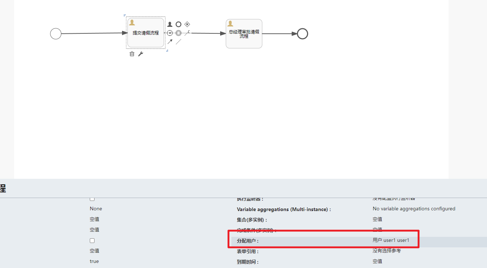

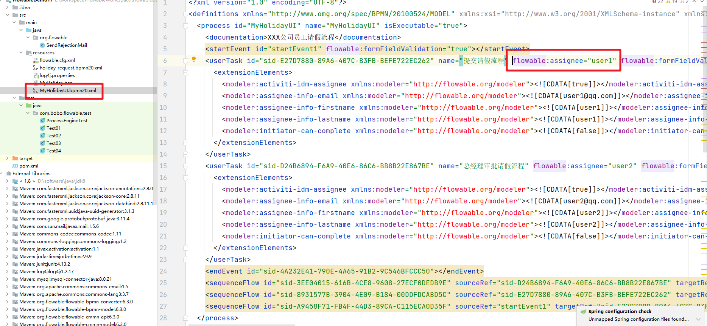

### 1.2 表达式分配

&emsp;&emsp;Flowable 使用 UEL 进行表达式解析。UEL 代表*Unified Expression Language*，是 EE6 规范的一部分.Flowable 支持两种 UEL 表达式： UEL-value 和 UEL-method

#### 1.2.1 值表达式

&emsp;&emsp;**值表达式 Value expression**: 解析为一个值。默认情况下，所有流程变量都可以使用。（若使用 Spring）所有的 Spring bean 也可以用在表达式里。例如

```txt
${myVar}
${myBean.myProperty}
```

案例讲解：


可以看到通过表达式处理的效果


先部署流程，然后在启动流程实例的时候绑定表达式对应的值

```java
/**
     * 启动流程实例
     */
    @Test
    public void testRunProcess(){

        // 获取流程引擎对象
        ProcessEngine processEngine = ProcessEngines.getDefaultProcessEngine();
        // 启动流程实例通过 RuntimeService 对象
        RuntimeService runtimeService = processEngine.getRuntimeService();
        // 设置 assignee 的取值
        Map<String,Object> variables = new HashMap<>();
        variables.put("assignee0","张三") ;
        variables.put("assignee1","李四");
        // 启动流程实例，第一个参数是流程定义的id
        ProcessInstance processInstance = runtimeService
                .startProcessInstanceById("MyHolidayUI:1:4", variables);// 启动流程实例
        // 输出相关的流程实例信息
        System.out.println("流程定义的ID：" + processInstance.getProcessDefinitionId());
        System.out.println("流程实例的ID：" + processInstance.getId());
        System.out.println("当前活动的ID：" + processInstance.getActivityId());
    }
```

在流程变量表中我们可以看到对应的流程变量信息


同时在 Task 表中，可以看到流程当前的分配人是`张三`，说明 UEL 表达式被解析了


#### 1.2.2 方法表达式

&emsp;&emsp;**方法表达式 Method expression**: 调用一个方法，可以带或不带参数。**当调用不带参数的方法时，要确保在方法名后添加空括号（以避免与值表达式混淆）。**传递的参数可以是字面值(literal value)，也可以是表达式，它们会被自动解析。例如：

```txt
${printer.print()}
${myBean.addNewOrder('orderName')}
${myBean.doSomething(myVar, execution)}
```

&emsp;&emsp;myBean 是 Spring 容器中的个 Bean 对象，表示调用的是 bean 的 addNewOrder 方法

### 1.3 监听器分配

可以使用监听器来完成很多 Flowable 的流程业务。

我们在此处使用监听器来完成负责人的指定，那么我们在流程设计的时候就不需要指定 assignee

创建自定义监听器：

```java
/**
 * 自定义的监听器
 */
public class MyTaskListener implements TaskListener {
    @Override
    public void notify(DelegateTask delegateTask) {
        System.out.println("监听器触发了：" + delegateTask.getName());
        if("提交请假流程".equals(delegateTask.getName()) &&
                "create".equals(delegateTask.getEventName())){
            // 指定任务的负责人
            delegateTask.setAssignee("小明");
        }else {
            delegateTask.setAssignee("小张");
        }
    }
}
```

然后在 FlowableUI 中关联对应的监听器

```txt
create:任务创建后触发
assignment:任务分配后触发
Delete:任务完成后触发
All：所有事件都触发
```


然后我们先部署流程，然后执行查看效果：

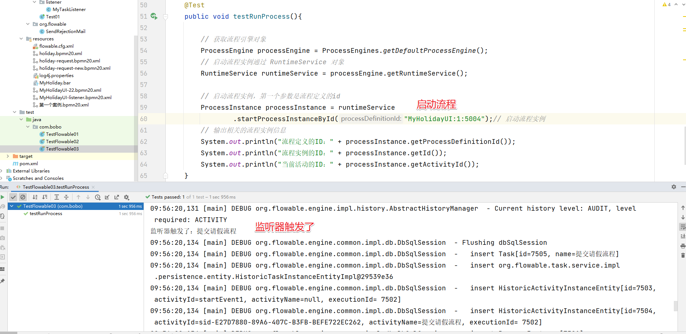

然后在 Task 表中我们可以看到对应的分配人为`小明`说明通过监听也完成了任务分配的工作了

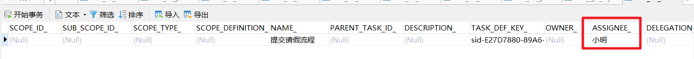

## 2.流程变量

&emsp;&emsp;流程实例按步骤执行时，需要使用一些数据。在 Flowable 中，这些数据称作*变量(variable)*，并会存储在数据库中。变量可以用在表达式中（例如在排他网关中用于选择正确的出口路径），也可以在 Java 服务任务(service task)中用于调用外部服务（例如为服务调用提供输入或结果存储），等等。

&emsp;&emsp;流程实例可以持有变量（称作*流程变量 process variables*）；用户任务以及*执行(executions)*——流程当前活动节点的指针——也可以持有变量。流程实例可以持有任意数量的变量，每个变量存储为*ACT_RU_VARIABLE*数据库表的一行。

&emsp;&emsp;所有的*startProcessInstanceXXX*方法都有一个可选参数，用于在流程实例创建及启动时设置变量。例如，在*RuntimeService*中：

```java
ProcessInstance startProcessInstanceByKey(String processDefinitionKey, Map<String, Object> variables);
```

&emsp;&emsp;也可以在流程执行中加入变量。例如，(_RuntimeService_):

```java
void setVariable(String executionId, String variableName, Object value);
void setVariableLocal(String executionId, String variableName, Object value);
void setVariables(String executionId, Map<String, ? extends Object> variables);
void setVariablesLocal(String executionId, Map<String, ? extends Object> variables);
```


### 2.1 全局变量

&emsp;&emsp;流程变量的默认作用域是流程实例。当一个流程变量的作用域为流程实例时，可以称为 global 变量

注意：如： Global 变量：userId（变量名）、zhangsan（变量值）

&emsp;&emsp;global 变量中变量名不允许重复，设置相同名称的变量，后设置的值会覆盖前设置的变量值。

### 2.2 局部变量

&emsp;&emsp;任务和执行实例仅仅是针对一个任务和一个执行实例范围，范围没有流程实例大， 称为 local 变量。

&emsp;&emsp;Local 变量由于在不同的任务或不同的执行实例中，作用域互不影响，变量名可以相同没有影响。Local 变量名也可以和 global 变量名相同，没有影响。

### 2.3 案例讲解

需求：员工创建出差申请单，由部门经理审核，部门经理申请通过后 3 天以下由财务直接申批，3 天以上先由总经理审批，总经理审批通过后再由财务审批。

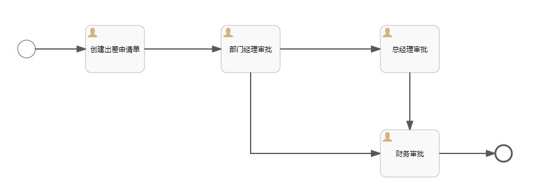

连接先设置条件

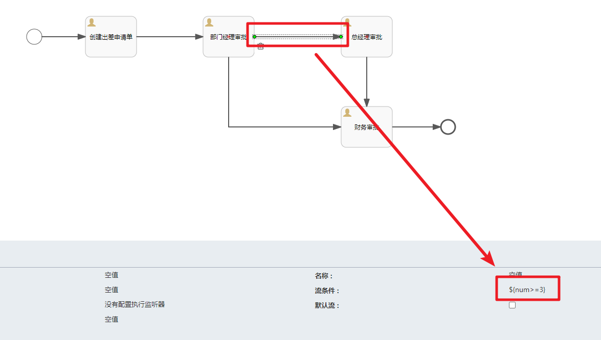


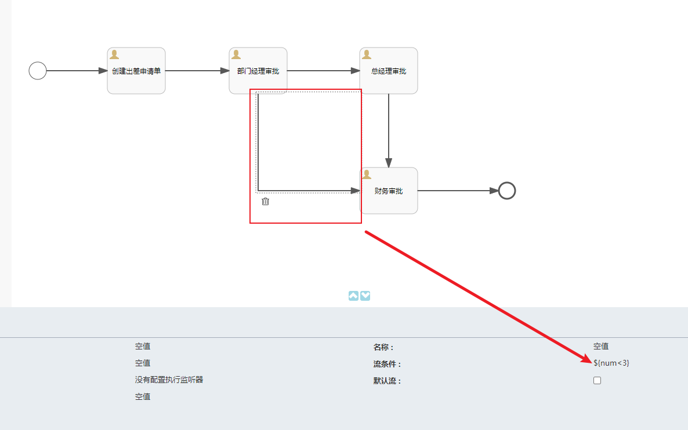

部署流程

```java
@Test
public void deploy(){
    ProcessEngine processEngine = ProcessEngines.getDefaultProcessEngine();
    RepositoryService repositoryService = processEngine.getRepositoryService();
    Deployment deploy = repositoryService.createDeployment()
        .addClasspathResource("出差申请单.bpmn20.xml")
        .name("请假流程...")
        .category("请假") // 分类
        .tenantId("dpb") // 租户id
        .deploy();
    System.out.println("deploy.getId() = " + deploy.getId());
    System.out.println("deploy.getName() = " + deploy.getName());
    System.out.println("deploy.getCategory() = " + deploy.getCategory());
}
```

启动流程实例：并且指定全局流程变量

```java
/**
     * 在启动流程实例的时候设置流程变量
     */
    @Test
    public void runProcess(){
        // 获取流程引擎对象
        ProcessEngine processEngine = ProcessEngines.getDefaultProcessEngine();
        // 启动流程实例通过 RuntimeService 对象
        RuntimeService runtimeService = processEngine.getRuntimeService();
        // 设置流程变量
        Map<String,Object> variables = new HashMap<>();
        // 设置assignee的取值
        variables.put("assignee0","张三");
        variables.put("assignee1","李四");
        variables.put("assignee2","王五");
        variables.put("assignee3","赵财务");
        // 启动流程实例，第一个参数是流程定义的id
        ProcessInstance processInstance = runtimeService
                .startProcessInstanceById("evection:1:4",variables);// 启动流程实例
        // 输出相关的流程实例信息
        System.out.println("流程定义的ID：" + processInstance.getProcessDefinitionId());
        System.out.println("流程实例的ID：" + processInstance.getId());
        System.out.println("当前活动的ID：" + processInstance.getActivityId());

    }
```

完成 Task 任务，同时也可以指定流程变量

```java
/**
     * 完成任务时指定流程变量
     */
    @Test
    public void completeTask(){

        // 获取流程引擎对象
        ProcessEngine processEngine = ProcessEngines.getDefaultProcessEngine();
        TaskService taskService = processEngine.getTaskService();
        Task task = taskService.createTaskQuery()
                .processDefinitionId("evection:1:4")
                .taskAssignee("李四")
                .singleResult();
        // 添加流程变量
        Map<String, Object> map = task.getProcessVariables();
        map.put("num",4);

        // 完成任务
        taskService.complete(task.getId(),map);
    }
```

当然我们也可以在处理流程之外通过 Task 编号来修改流程变量

```java
/**
     * 通过当前任务设置
     */
    @Test
    public void currentTask(){
        //   当前待办任务id
        //  获取processEngine
        ProcessEngine processEngine = ProcessEngines.getDefaultProcessEngine();
        TaskService taskService = processEngine.getTaskService();
        Task task = taskService.createTaskQuery()
                .processDefinitionId("evection:1:4")
                .taskAssignee("王五")
                .singleResult();
        // 添加流程变量
        Map<String, Object> map = task.getProcessVariables();
        map.put("num",1);
        //  一次设置多个值 设置局部变量
        taskService.setVariables(task.getId(), map);
    }
```

# 二、候选人和候选人组

&emsp;&emsp;在流程定义中在任务结点的 assignee 固定设置任务负责人，在流程定义时将参与者固定设置在.bpmn 文件中，如果临时任务负责人变更则需要修改流程定义，系统可扩展性差。针对这种情况可以给任务设置多个候选人或者候选人组，可以从候选人中选择参与者来完成任务。

## 1.候选人

### 1.1 定义流程图

&emsp;&emsp;定义流程图，同时指定候选人，多个候选人会通过`,`连接


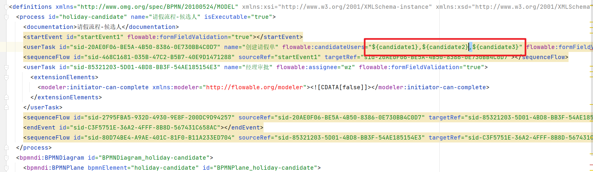

### 1.2 部署和启动流程实例

&emsp;&emsp;部署流程，并且在启动流程实例的时候对 UEL 表达式赋值

```java
    /**
     * 部署流程
     */
    @Test
    public void deploy(){
        ProcessEngine processEngine = ProcessEngines.getDefaultProcessEngine();
        RepositoryService repositoryService = processEngine.getRepositoryService();

        Deployment deploy = repositoryService.createDeployment()
                .addClasspathResource("请假流程-候选人.bpmn20.xml")
                .name("请求流程-候选人")
                .deploy();
        System.out.println("deploy.getId() = " + deploy.getId());
        System.out.println(deploy.getName());
    }

    /**
     * 启动流程实例
     */
    @Test
    public void runProcess(){
        ProcessEngine processEngine = ProcessEngines.getDefaultProcessEngine();
        RuntimeService runtimeService = processEngine.getRuntimeService();
        // 给流程定义中的UEL表达式赋值
        Map<String,Object> variables = new HashMap<>();
        variables.put("candidate1","张三");
        variables.put("candidate2","李四");
        variables.put("candidate3","王五");
        runtimeService.startProcessInstanceById("holiday-candidate:1:4",variables);
    }
```

&emsp;&emsp;在对应的表结构中我们可以看到流程变量已经有了，但是对于的 Task 的 Assignee 还是为空。

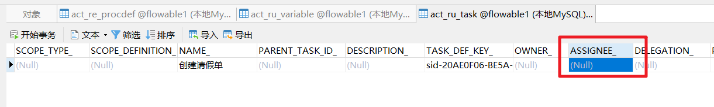


### 1.3 任务的查询

&emsp;&emsp;根据当前登录的用户，查询对应的候选任务

```java
/**
 * 根据登录的用户查询对应的可以拾取的任务
 *
 */
@Test
public void queryTaskCandidate(){
    ProcessEngine processEngine = ProcessEngines.getDefaultProcessEngine();
    TaskService taskService = processEngine.getTaskService();
    List<Task> list = taskService.createTaskQuery()
            //.processInstanceId("2501")
            .processDefinitionId("holiday-candidate:1:4")
            .taskCandidateUser("李四") # 注意
            .list();
    for (Task task : list) {
        System.out.println("task.getId() = " + task.getId());
        System.out.println("task.getName() = " + task.getName());
    }
}
```

### 1.4 任务的拾取

&emsp;&emsp;知道了我有可拾取的任务后，拾取任务。

```java
/**
 * 拾取任务
 * 一个候选人拾取了这个任务之后其他的用户就没有办法拾取这个任务了
 * 所以如果一个用户拾取了任务之后又不想处理了，那么可以退还
 */
@Test
public void claimTaskCandidate(){
    ProcessEngine processEngine = ProcessEngines.getDefaultProcessEngine();
    TaskService taskService = processEngine.getTaskService();
    Task task = taskService.createTaskQuery()
            //.processInstanceId("2501")
            .processDefinitionId("holiday-candidate:1:4")
            .taskCandidateUser("李四")
            .singleResult();
    if(task != null){
        // 拾取对应的任务
        taskService.claim(task.getId(),"李四");
        System.out.println("任务拾取成功");
    }
}
```


### 1.5 任务的归还

&emsp;&emsp;拾取任务后不想操作那么就归还任务（站着茅坑不拉屎）

```java
/**
 * 退还任务
 * 一个候选人拾取了这个任务之后其他的用户就没有办法拾取这个任务了
 * 所以如果一个用户拾取了任务之后又不想处理了，那么可以退还
 */
@Test
public void unclaimTaskCandidate(){
    ProcessEngine processEngine = ProcessEngines.getDefaultProcessEngine();
    TaskService taskService = processEngine.getTaskService();
    Task task = taskService.createTaskQuery()
            //.processInstanceId("2501")
            .processDefinitionId("holiday-candidate:1:4")
            .taskAssignee("张三")
            .singleResult();
    if(task != null){
        // 拾取对应的任务
        taskService.unclaim(task.getId());
        System.out.println("归还拾取成功");
    }
}
```

### 1.6 任务的交接（委派）

&emsp;&emsp;拾取任务后如果不想操作也不想归还可以直接交接（委派）给另外一个人来处理

```java
   /**
     * 任务的交接
     *    如果我获取了任务，但是不想执行，那么我可以把这个任务交接给其他的用户
     */
    @Test
    public void taskCandidate(){
        ProcessEngine processEngine = ProcessEngines.getDefaultProcessEngine();
        TaskService taskService = processEngine.getTaskService();
        Task task = taskService.createTaskQuery()
                //.processInstanceId("2501")
                .processDefinitionId("holiday-candidate:1:4")
                .taskAssignee("李四")
                .singleResult();
        if(task != null){
            // 任务的交接
            taskService.setAssignee(task.getId(),"王五");
            System.out.println("任务交接给了王五");
        }
    }
```

### 1.7 任务的完成

&emsp;&emsp;正常的任务处理

```java
/**
 * 完成任务
 */
@Test
public void completeTask(){
    ProcessEngine processEngine = ProcessEngines.getDefaultProcessEngine();
    TaskService taskService = processEngine.getTaskService();
    Task task = taskService.createTaskQuery()
            //.processInstanceId("2501")
            .processDefinitionId("holiday-candidate:1:4")
            .taskAssignee("王五")
            .singleResult();
    if(task != null){
        // 完成任务
        taskService.complete(task.getId());
        System.out.println("完成Task");
    }
}

```

## 2.候选人组

&emsp;&emsp;当候选人很多的情况下（比如有一百个人？三百个人？难道要一个一个设置进去吗？），我们可以分组来处理。先创建组，然后把用户分配到这个组中。

### 2.1 管理用户和组

#### 2.1.1 用户管理

&emsp;&emsp;我们需要先单独维护用户信息。后台对应的表结构是`ACT_ID_USER`.

```java
/**
 * 维护用户
 */
@Test
public void createUser() {
    ProcessEngine processEngine = ProcessEngines.getDefaultProcessEngine();
    // 通过 IdentityService 完成相关的用户和组的管理
    IdentityService identityService = processEngine.getIdentityService();
    // 创建用户
    User user = identityService.newUser("田佳");
    user.setFirstName("tian");
    user.setLastName("jia");
    user.setEmail("tianjia@qq.com");
    // 保存用户
    identityService.saveUser(user);
}
```

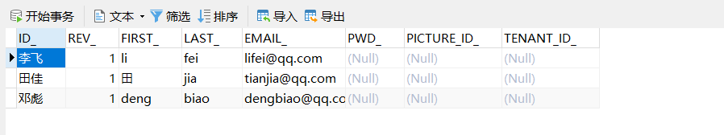

> 问题：如何将系统内的用户表(比如 sys_user 等等)跟 flowable 中的 act_id_user 表进行关联呢？
>
> 用户在系统进行注册的时候，我们就可以向 act_id_user 进行写入数据保来证数据的原子性
>
> 当然更新的时候也需要进行同步的更新

#### 2.1.2 Group 管理

&emsp;&emsp;维护对应的 Group 信息，后台对应的表结构是`ACT_ID_GROUP`

```java
/**
 * 创建用户组
 */
@Test
public void createGroup() {
    ProcessEngine processEngine = ProcessEngines.getDefaultProcessEngine();
    IdentityService identityService = processEngine.getIdentityService();
    // 创建Group对象并指定相关的信息
    Group group = identityService.newGroup("group2");
    group.setName("开发部");
    group.setType("type1");
    // 保存Group对应的表结构数据
    identityService.saveGroup(group);

}
```


#### 2.1.3 用户分配组

&emsp;&emsp;用户和组是一个多对多的关联关联，我们需要做相关的分配，后台对应的表结构是`ACT_ID_MEMBERSHIP`

```java
/**
 * 将用户分配给对应的Group
 */
@Test
public void userGroup() {
    ProcessEngine processEngine = ProcessEngines.getDefaultProcessEngine();
    IdentityService identityService = processEngine.getIdentityService();
    // 根据组的编号找到对应的Group对象
    Group group = identityService.createGroupQuery()
            .groupId("group1")
            .singleResult();
    List<User> list = identityService
            .createUserQuery()
            .list();
    for (User user : list) {
        // 将用户分配给对应的组
        identityService.createMembership(user.getId(), group.getId());
//            System.out.println(user.getId()); // 打印用户信息
    }
}
```


### 2.2 候选人组应用

&emsp;&emsp;搞清楚了用户和用户组的关系后我们就可以来使用候选人组的应用了

#### 2.2.1 创建流程图


#### 2.2.2 流程的部署运行

&emsp;&emsp;然后我们把流程部署和运行，注意对 UEL 表达式赋值，关联上 Group

```java
/**
 * 部署流程
 */
@Test
public void deploy() {
    ProcessEngine processEngine = ProcessEngines.getDefaultProcessEngine();
    RepositoryService repositoryService = processEngine.getRepositoryService();

    Deployment deploy = repositoryService.createDeployment()
            .addClasspathResource("请假流程-候选人组.bpmn20.xml")
            .name("Test请求流程-候选人组")
            .deploy();
    System.out.println("deploy.getId() = " + deploy.getId());
    System.out.println(deploy.getName());
}

/**
 * 删除流程定义
 */
@Test
public void testDeleteDeploy() {
    ProcessEngine processEngine = ProcessEngines.getDefaultProcessEngine();
    RepositoryService repositoryService = processEngine.getRepositoryService();
    // 删除部署的流程 第一个参数是 id  如果部署的流程启动了就不允许删除了(报错)
    // repositoryService.deleteDeployment("2501");
    // 第二个参数是级联删除，如果流程启动了 相关的任务也会一并会被删除掉 (强制删除)
    repositoryService.deleteDeployment("1", true);
    System.out.println("删除成功");
}

/**
 * 启动流程实例
 */
@Test
public void runProcess() {
    ProcessEngine processEngine = ProcessEngines.getDefaultProcessEngine();
    IdentityService identityService = processEngine.getIdentityService();
    // 获取所有的信息
    Group group = identityService
            .createGroupQuery()
            .groupId("group1")
            .singleResult();
    RuntimeService runtimeService = processEngine.getRuntimeService();
    // 给流程定义中的UEL表达式赋值
    Map<String, Object> variables = new HashMap<>();
    // variables.put("g1","group1");
    variables.put("g1", group.getId()); // 给流程定义中的UEL表达式赋值
    runtimeService.startProcessInstanceById("holiday-group:1:2504", variables);
}
```

对应表结构中就有对应的体现

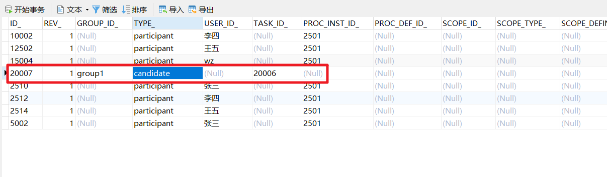

#### 2.2.3 任务的拾取和完成

&emsp;&emsp;然后完成任务的查询拾取和处理操作

```java
/**
 * 根据登录的用户查询对应的可以拾取的任务
 *
 */
@Test
public void queryTaskCandidateGroup(){
    ProcessEngine processEngine = ProcessEngines.getDefaultProcessEngine();
    // 根据当前登录的用户找到对应的组
    IdentityService identityService = processEngine.getIdentityService();
    // 当前用户所在的组
    Group group = identityService.createGroupQuery().groupMember("邓彪").singleResult();

    TaskService taskService = processEngine.getTaskService();
            // 根据组的编号来找到 分配给改组的任务列表
    List<Task> list = taskService.createTaskQuery()
            //.processInstanceId("2501")
            .processDefinitionId("holiday-group:1:17504")
            .taskCandidateGroup(group.getId())
            .list();
    for (Task task : list) {
        System.out.println("task.getId() = " + task.getId());
        System.out.println("task.getName() = " + task.getName());
    }
}

/**
 * 拾取任务
 *    一个候选人拾取了这个任务之后其他的用户就没有办法拾取这个任务了
 *    所以如果一个用户拾取了任务之后又不想处理了，那么可以退还
 */
@Test
public void claimTaskCandidate(){
    String userId = "田佳";
    ProcessEngine processEngine = ProcessEngines.getDefaultProcessEngine();
    // 根据当前登录的用户找到对应的组
    IdentityService identityService = processEngine.getIdentityService();
    // 当前用户所在的组
    Group group = identityService.createGroupQuery().groupMember(userId).singleResult();
    TaskService taskService = processEngine.getTaskService();
    Task task = taskService.createTaskQuery()
            //.processInstanceId("2501")
            .processDefinitionId("holiday-group:1:17504")
            .taskCandidateGroup(group.getId())
            .singleResult();
    if(task != null) {
        // 任务拾取
        taskService.claim(task.getId(),userId);
        System.out.println("任务拾取成功");
    }
}
/**
 * 完成任务
 */
@Test
public void completeTask() {
    ProcessEngine processEngine = ProcessEngines.getDefaultProcessEngine();
    TaskService taskService = processEngine.getTaskService();
    Task task = taskService.createTaskQuery()
            //.processInstanceId("2501")
            .processDefinitionId("holiday-group:1:2504")
            .taskAssignee("lisi")
            .singleResult();
    if (task != null) {
        // 完成任务
        taskService.complete(task.getId());

        System.out.println("task.getId() = " + task.getId());
        System.out.println("task.getName() = " + task.getName());
        System.out.println("完成Task");
    }
}
```

# 三、网关

> 网关是用来控制流程的流向

## 1.排他网关

&emsp;&emsp;排他网关（exclusive gateway）（也叫*异或网关 XOR gateway*，或者更专业的，_基于数据的排他网关 exclusive data-based gateway_），用于对流程中的**决策**建模。当执行到达这个网关时，会按照所有出口顺序流定义的顺序对它们进行计算。选择第一个条件计算为 true 的顺序流（当没有设置条件时，认为顺序流为*true*）继续流程。

&emsp;&emsp;**请注意这里出口顺序流的含义与 BPMN 2.0 中的一般情况不一样。一般情况下，会选择所有条件计算为 true 的顺序流，并行执行。而使用排他网关时，只会选择一条顺序流。当多条顺序流的条件都计算为 true 时，会且仅会选择在 XML 中最先定义的顺序流继续流程。如果没有可选的顺序流，会抛出异常。**

图示

&emsp;&emsp;排他网关用内部带有’X’图标的标准网关（菱形）表示，'X’图标代表*异或*的含义。请注意内部没有图标的网关默认为排他网关。BPMN 2.0 规范不允许在同一个流程中混合使用有及没有 X 的菱形标志。


案例：


```java
   /**
     * 部署流程
     */
    @Test
    public void deploy(){
        ProcessEngine processEngine = ProcessEngines.getDefaultProcessEngine();
        RepositoryService repositoryService = processEngine.getRepositoryService();

        Deployment deploy = repositoryService.createDeployment()
                .addClasspathResource("请假流程-排他网关.bpmn20.xml")
                .name("请求流程-排他网关")
                .deploy();
        System.out.println("deploy.getId() = " + deploy.getId());
        System.out.println(deploy.getName());
    }

    /**
     * 启动流程实例
     */
    @Test
    public void runProcess(){
        ProcessEngine processEngine = ProcessEngines.getDefaultProcessEngine();
        RuntimeService runtimeService = processEngine.getRuntimeService();
        // 给流程定义中的UEL表达式赋值
        Map<String,Object> variables = new HashMap<>();
        // variables.put("g1","group1");
        variables.put("num",3); // 给流程定义中的UEL表达式赋值
        runtimeService.startProcessInstanceById("holiday-exclusive:1:4",variables);
    }


    /**
     * 启动流程实例
     */
    @Test
    public void setVariables(){
        ProcessEngine processEngine = ProcessEngines.getDefaultProcessEngine();
        RuntimeService runtimeService = processEngine.getRuntimeService();
        // 给流程定义中的UEL表达式赋值
        Map<String,Object> variables = new HashMap<>();
        // variables.put("g1","group1");
        variables.put("num",4); // 给流程定义中的UEL表达式赋值
        runtimeService.setVariables("12503",variables);
    }


    /**
     * 完成任务
     */
    @Test
    public void completeTask(){
        ProcessEngine processEngine = ProcessEngines.getDefaultProcessEngine();
        TaskService taskService = processEngine.getTaskService();
        Task task = taskService.createTaskQuery()
                //.processInstanceId("2501")
                .processDefinitionId("holiday-exclusive:1:4")
                .taskAssignee("zhangsan")
                .singleResult();
        if(task != null){
            // 完成任务
            taskService.complete(task.getId());
            System.out.println("完成Task");
        }
    }
```

如果从网关出去的线所有条件都不满足的情况下会抛出系统异常，


但是要注意任务没有结束，还是原来的任务，我们可以重置流程变量

```java
@Test
public void setVariables(){
    ProcessEngine processEngine = ProcessEngines.getDefaultProcessEngine();
    RuntimeService runtimeService = processEngine.getRuntimeService();
    // 给流程定义中的UEL表达式赋值
    Map<String,Object> variables = new HashMap<>();
    // variables.put("g1","group1");
    variables.put("num",4); // 给流程定义中的UEL表达式赋值
    runtimeService.setVariables("12503",variables);
}
```

> 前面我们可以直接在连接线上定义条件，那为什么还要有排他网关呢？
>
> - 直接在线上的情况，如果条件都不满足，流程就结束了，是异常结束!!
>
> - 然而在网关层面的话，如果条件都不满足，他只是抛出了一个异常，但流程没有结束，我们可以继续对流程操作（比如上面案例中 修改变量(请假天数)）

## 2.并行网关

&emsp;&emsp;并行网关允许将流程分成多条分支，也可以把多条分支汇聚到一起，并行网关的功能是基于进入和外出顺序流的：

- fork 分支：并行后的所有外出顺序流，为每个顺序流都创建一个并发分支。

- join 汇聚： 所有到达并行网关，在此等待的进入分支， 直到所有进入顺序流的分支都到达以后， 流程就会通过汇聚网关。

&emsp;&emsp;注意，如果同一个并行网关有多个进入和多个外出顺序流， 它就同时具有分支和汇聚功能。` 这时，网关会先汇聚所有进入的顺序流，然后再切分成多个并行分支。`

**与其他网关的主要区别是，并行网关不会解析条件。** **即使顺序流中定义了条件，也会被忽略。**

> 比如说 请假申请需要 部门经理&技术经理共同审批

案例：


当我们执行了创建请假单后，到并行网关的位置的时候，在 ACT_RU_TASK 表中就有两条记录


然后同时在 ACT_RU_EXECUTION 中有三条记录，一个任务对应的有两个执行实例


## 3.包含网关

&emsp;包含网关可以看做是排他网关和并行网关的结合体。 和排他网关一样，你可以在外出顺序流上定义条件，包含网关会解析它们。 但是主要的区别是包含网关可以选择多于一条顺序流，这和并行网关一样。

包含网关的功能是基于进入和外出顺序流的：

- 分支： 所有外出顺序流的条件都会被解析，结果为 true 的顺序流会以并行方式继续执行， 会为每个顺序流创建一个分支。
- 汇聚：所有并行分支到达包含网关，会进入等待状态， 直到每个包含流程 token 的进入顺序流的分支都到达。 这是与并行网关的最大不同。换句话说，包含网关只会等待被选中执行了的进入顺序流。 在汇聚之后，流程会穿过包含网关继续执行。

> 比如：申请流程开始 交给技术经理 或者 项目经理任其一个进行审批 但是 一定会流转到 人事进行审批
>
> 也就是说 不管怎么走 都会交给人事进行审批

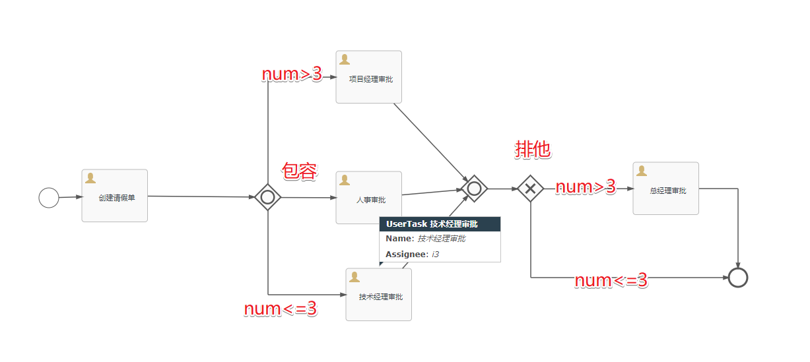

## 4.事件网关

&emsp;&emsp;事件网关允许根据事件判断流向。网关的每个外出顺序流都要连接到一个中间捕获事件。 当流程到达一个基于事件网关，网关会进入等待状态：会暂停执行。与此同时，会为每个外出顺序流创建相对的事件订阅。

&emsp;&emsp;事件网关的外出顺序流和普通顺序流不同，这些顺序流不会真的"执行"， 相反它们让流程引擎去决定执行到事件网关的流程需要订阅哪些事件。 要考虑以下条件：

1. 事件网关必须有两条或以上外出顺序流；
2. 事件网关后，只能使用 intermediateCatchEvent 类型（activiti 不支持基于事件网关后连接 ReceiveTask）
3. 连接到事件网关的中间捕获事件必须只有一个入口顺序流。
