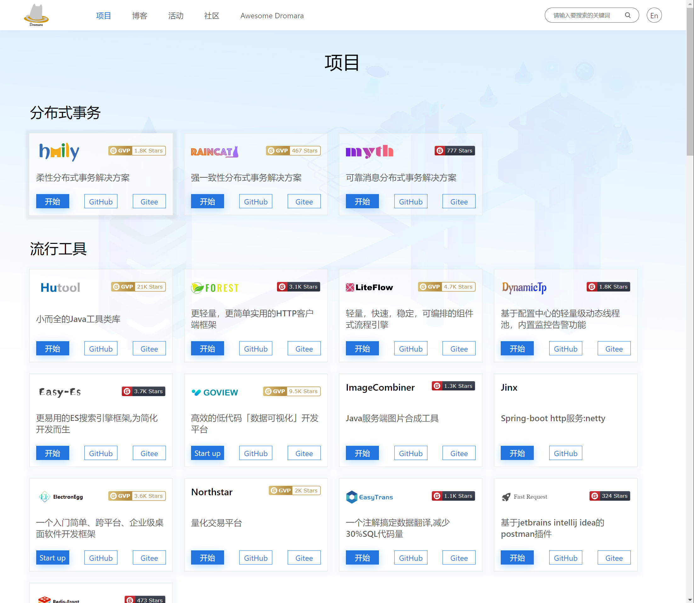
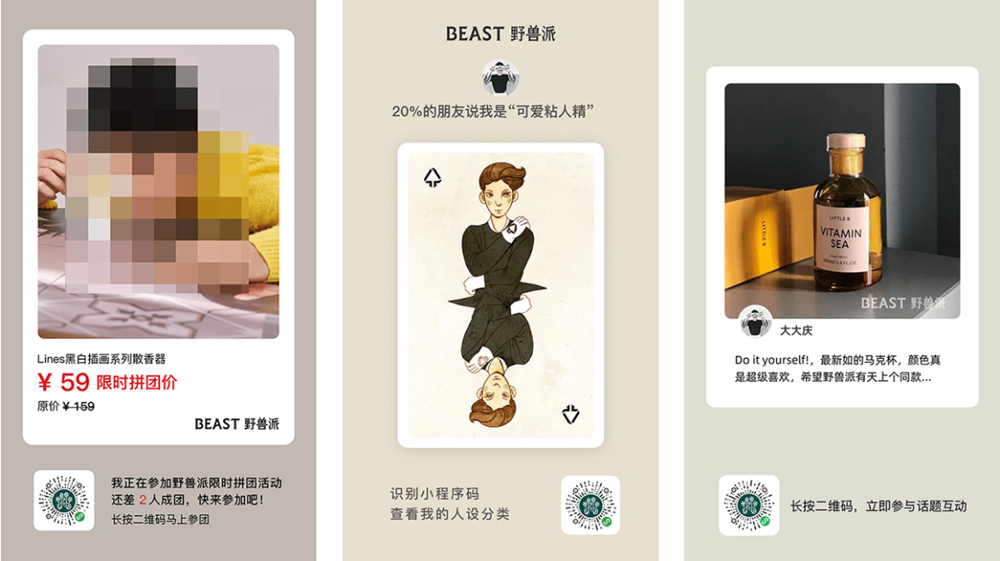
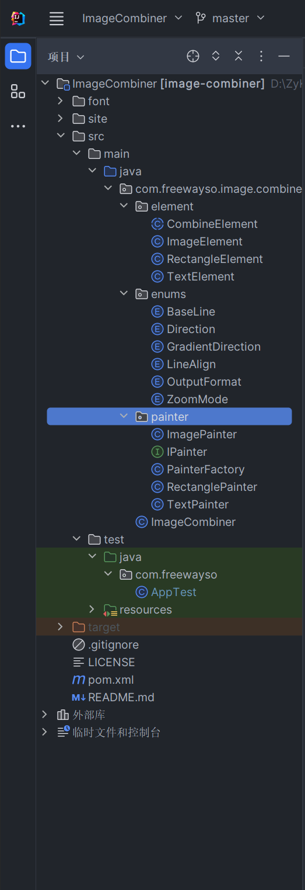
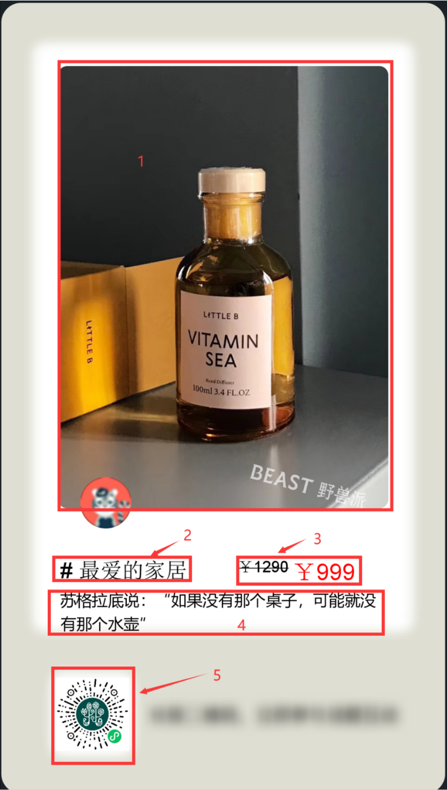
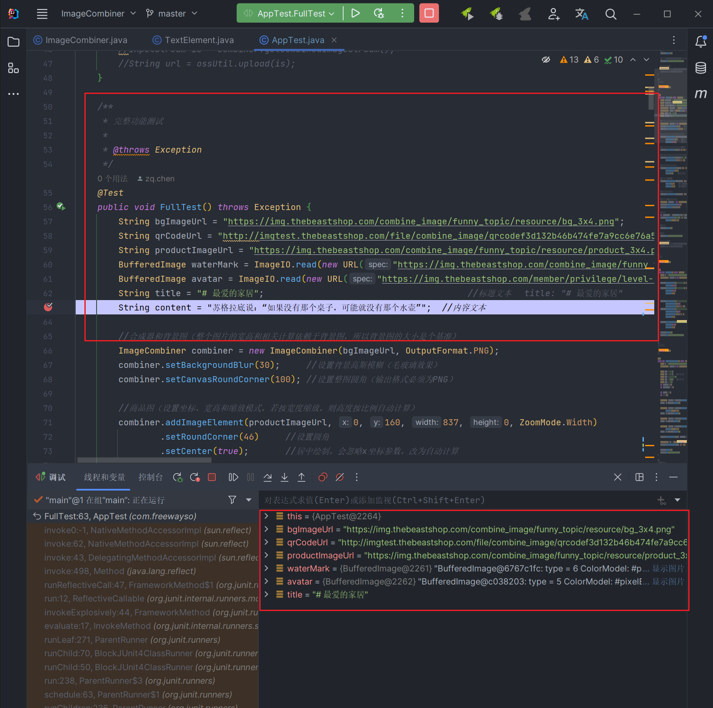
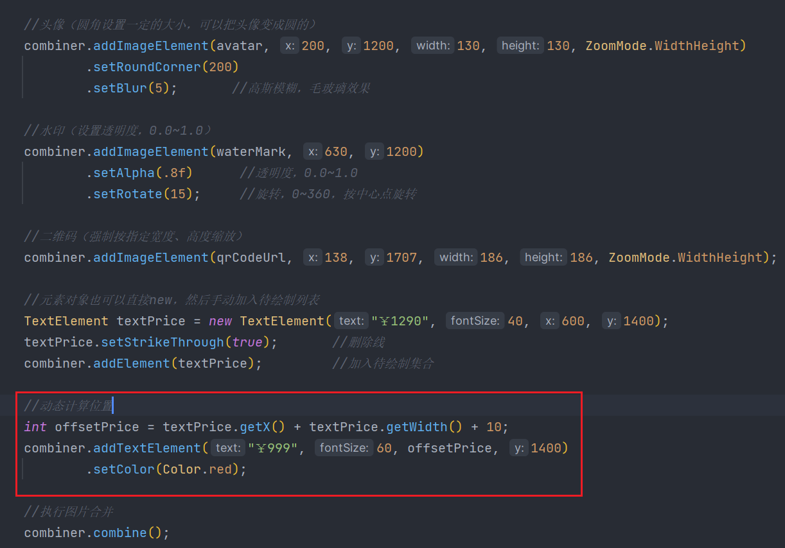

# 🧩ImageCombiner

<hr/>

[[toc]]

# 一个专门用于图片合成的工具

[[toc]]

> 引文：ImageCombiner 是一个专门用于图片合成的工具，没有很复杂的功能，简单实用，却不失强大

## 项目背景

> 如果你是 UI 美工大师或者 PS 大牛，那本文一定不适合你；如果当你需要自己做一张海报时，可以立马有小伙伴帮您实现，那本文大概率也不适合你。但是，如果你跟我一样，遇上到以下场景，最近有类似的需求，需要合成各模版图片。人事部和办公室的小伙伴想做一些具有通用场景功能海报，比如宣传报，会议宣传图片，但自己又对于 PS 这类的工具不是很擅长时，那么您不妨看看我推荐的这款开源小工具，看看这篇文章。作为程序猿，可以不会 PS，但一定要有自己解决问题的办法。通过开源程序，站在巨人的肩膀上，让你不用重复从 0 开始造轮子，将时间投入到实际业务维护和开发中。在这里要感谢 [dromara](https://dromara/)社区的 [image-combiner](https://image-combiner/)。

## 1. dromara 社区

在正式介绍这款工具时，先介绍一下 dromara 社区，dromara 社区是很多开源工具的集结地，很多开源的 GVP，比如熟知的 MaxKey,[Hutool](https://so.csdn.net/so/search?q=Hutool&spm=1001.2101.3001.7020),Sa-Token,Lite_Flow,Lamp-cloud 等等，感兴趣的朋友可以到他们的介绍页[https://gitee.com/dromara](https://dromara/)看看介绍和[开源项目](https://so.csdn.net/so/search?q=开源项目&spm=1001.2101.3001.7020)的列表。



## 2. image-combiner 介绍

### 1、能做什么

**ImageCombiner**是一个专门用于 Java 服务端图片合成的工具，没有很复杂的功能，简单实用，从实际业务场景出发，提供简单的接口，几行代码即可实现图片拼合（当然用于合成水印也可以），素材上支持图片、文本、矩形三种，支持定位、缩放、旋转、圆角、透明度、颜色、字体、字号、删除线、居中绘制、文本自动换行等特性，足够覆盖图片合成的日常需求。

是不是对文字描述没有直观的感受？那就先来一波成果图让你先直观的感受下他的功能。这是一张使用官网的代码生成出来的宣传海报图。是不是跟一些宣传的海报差不多了。后面会给出生成的具体的代码来详细说明大概的步骤来生成如下的结果。



### 2、image-combiner 目录


将代码使用 git clone 下载下来之后，使用开发 IDE（这里以 IntelliJ IDEA 为例）打开。image-combiner 的源代码还是比较清爽的，从它的 star 数就可以看到，受欢迎的程度还是可以的。



## 3. 如何编程化生成

### 1、跟着官方例子调试

任何一个开源项目拿到手之后，除了先熟悉开源软件的源码结构之外，在找到程序的主入口之后，通过调试运行来预测和跟踪程序的运行方式，从而掌握其源码的执行原理。在和自己的项目进行集成的时候，就可以进行充分的调优，甚至可以可以按照自己的方式进行优化，如果是一些通用场景，可以提交给社区，最终实现来源开源，反哺开源的正向操作。

打开 test 目录下的**AppTest.java**类。这里以一个面比较全的方法类说明 image-combiner 的主要用法。选取的代码如下：

```java

/**
 * 完整功能测试
 *
 * @throws Exception
 */
@Test
public void FullTest() throws Exception {
    String bgImageUrl = "https://img.thebeastshop.com/combine_image/funny_topic/resource/bg_3x4.png";                       //背景图（测试url形式）
    String qrCodeUrl = "http://imgtest.thebeastshop.com/file/combine_image/qrcodef3d132b46b474fe7a9cc6e76a511dfd5.jpg";     //二维码
    String productImageUrl = "https://img.thebeastshop.com/combine_image/funny_topic/resource/product_3x4.png";             //商品图
    BufferedImage waterMark = ImageIO.read(new URL("https://img.thebeastshop.com/combine_image/funny_topic/resource/water_mark.png"));  //水印图（测试BufferedImage形式）
    BufferedImage avatar = ImageIO.read(new URL("https://img.thebeastshop.com/member/privilege/level-icon/level-three.jpg"));           //头像
    String title = "# 最爱的家居";                                       //标题文本
    String content = "苏格拉底说：“如果没有那个桌子，可能就没有那个水壶”";  //内容文本

    //合成器和背景图（整个图片的宽高和相关计算依赖于背景图，所以背景图的大小是个基准）
    ImageCombiner combiner = new ImageCombiner(bgImageUrl, OutputFormat.PNG);
    combiner.setBackgroundBlur(30);     //设置背景高斯模糊（毛玻璃效果）
    combiner.setCanvasRoundCorner(100); //设置整图圆角（输出格式必须为PNG）

    //商品图（设置坐标、宽高和缩放模式，若按宽度缩放，则高度按比例自动计算）
    combiner.addImageElement(productImageUrl, 0, 160, 837, 0, ZoomMode.Width)
            .setRoundCorner(46)     //设置圆角
            .setCenter(true);       //居中绘制，会忽略x坐标参数，改为自动计算

    //标题（默认字体为“阿里巴巴普惠体”，也可以自己指定字体名称或Font对象）
    combiner.addTextElement(title, 55, 150, 1400);

    //内容（设置文本自动换行，需要指定最大宽度（超出则换行）、最大行数（超出则丢弃）、行高）
    combiner.addTextElement(content, "微软雅黑", 40, 150, 1480)
            .setAutoBreakLine(837, 2, 60);

    //头像（圆角设置一定的大小，可以把头像变成圆的）
    combiner.addImageElement(avatar, 200, 1200, 130, 130, ZoomMode.WidthHeight)
            .setRoundCorner(200)
            .setBlur(5);       //高斯模糊，毛玻璃效果

    //水印（设置透明度，0.0~1.0）
    combiner.addImageElement(waterMark, 630, 1200)
            .setAlpha(.8f)      //透明度，0.0~1.0
            .setRotate(15);     //旋转，0~360，按中心点旋转

    //二维码（强制按指定宽度、高度缩放）
    combiner.addImageElement(qrCodeUrl, 138, 1707, 186, 186, ZoomMode.WidthHeight);

    //元素对象也可以直接new，然后手动加入待绘制列表
    TextElement textPrice = new TextElement("￥1290", 40, 600, 1400);
    textPrice.setStrikeThrough(true);       //删除线
    combiner.addElement(textPrice);         //加入待绘制集合

    //动态计算位置
    int offsetPrice = textPrice.getX() + textPrice.getWidth() + 10;
    combiner.addTextElement("￥999", 60, offsetPrice, 1400)
            .setColor(Color.red);

    //执行图片合并
    combiner.combine();

    //保存文件
    combiner.save("d://fullTest.png");

    //或者获取流（并上传oss等）
    //InputStream is = combiner.getCombinedImageStream();
    //String url = ossUtil.upload(is);
}
```

### 2、海报生成区分解



针对上述的宣传海报进行了分区，并用数字 1-5 号进行标记，

- 1 号一般用于宣传海报上的主要目标图片

- 2 号一般是商品的名字

- 3 号可以使价格

- 4 号位置通常会对商品或者活动信息进行简单的描述

- 5 号位置可以预留给二维码等信息

> 这里我们忽略了一个基本需求，就是海报有一个最基础的背景，所以在制作海报前首先还应该准备一张基本的背景图。针对上面这种需求，结合代码应该怎么进行实现？



图片合成类**ImageCombiner**是主要的工作类，可以看下这个类的工作方法如下，可以看到这个类的方法非常丰富，包含所有的图片合成与处理的函数。通过构造**ImageElement**对象将背景图片设置到海报中，同时海报的宽度等信息也是在这里进行了初始化。


### 4、添加商品图和相关文字介绍

在背景图的上面，继续添加主要的宣传图片，比如商品图像信息。

```java

//商品图（设置坐标、宽高和缩放模式，若按宽度缩放，则高度按比例自动计算）
combiner.addImageElement(productImageUrl, 0, 160, 837, 0, ZoomMode.Width)
     .setRoundCorner(46)     //设置圆角
     .setCenter(true);       //居中绘制，会忽略x坐标参数，改为自动计算

//标题（默认字体为“阿里巴巴普惠体”，也可以自己指定字体名称或Font对象）
combiner.addTextElement(title, 55, 150, 1400);

//内容（设置文本自动换行，需要指定最大宽度（超出则换行）、最大行数（超出则丢弃）、行高）
combiner.addTextElement(content, "微软雅黑", 40, 150, 1480)
      .setAutoBreakLine(837, 2, 60);

//头像（圆角设置一定的大小，可以把头像变成圆的）
combiner.addImageElement(avatar, 200, 1200, 130, 130, ZoomMode.WidthHeight)
    .setRoundCorner(200)
    .setBlur(5);       //高斯模糊，毛玻璃效果

//水印（设置透明度，0.0~1.0）
combiner.addImageElement(waterMark, 630, 1200)
    .setAlpha(.8f)      //透明度，0.0~1.0
    .setRotate(15);     //旋转，0~360，按中心点旋转

//二维码（强制按指定宽度、高度缩放）
combiner.addImageElement(qrCodeUrl, 138, 1707, 186, 186, ZoomMode.WidthHeight);
```

### 5、动态位置计算

在一些场景中，文字的距离不是提前可控的，比如会根据前面文字的距离来设置后面文字的宽度，实现动态的设置。这里来看 image-combiner 应该如何实现？

```java
//元素对象也可以直接new，然后手动加入待绘制列表
TextElement textPrice = new TextElement("￥1290", 40, 600, 1400);
textPrice.setStrikeThrough(true);       //删除线
combiner.addElement(textPrice);         //加入待绘制集合

//动态计算位置
int offsetPrice = textPrice.getX() + textPrice.getWidth() + 10;
combiner.addTextElement("￥999", 60, offsetPrice, 1400)
    .setColor(Color.red);
```



### 6、最后

使用 Graphics2D 对象创建图片并执行相关的写入操作。


通过以上的步骤，就可以生成我们需要的宣传图，是不是很方便，也很简单。

## 4. 总结和展望

### 1、展望

image-combiner 的其它能力你可以下载代码后在自己的 ide 中进行实际跑一下，这样比较有直观的效果。这里只是展示了它的基础能力，具体的使用场景需要你来定义。通过编程化海报处理，在应对批量的动态电子证书，动态的个人信息证明等等是非常具有想象力的，再此基础之上，可以进行 web 化提供云服务接口，或者桌面化，提供给需要的用户进行使用。这些功能的扩展需要大家的聪明才智来头脑风暴，肯定会有很多有意思的 Idea。

### 2、总结

以上就是本文的主要内容，文章首先简单介绍了 Dromara 开源社区，然后介绍了基于 Java 的海报生成器 image-combiner，通过 debug 调试的方式完整的介绍了如何使用编程模式来完成一份海报的生成。最后对于 image-combiner 的功能扩展进行了展望。如果您有兴趣，可以自己来扩展和完善。
