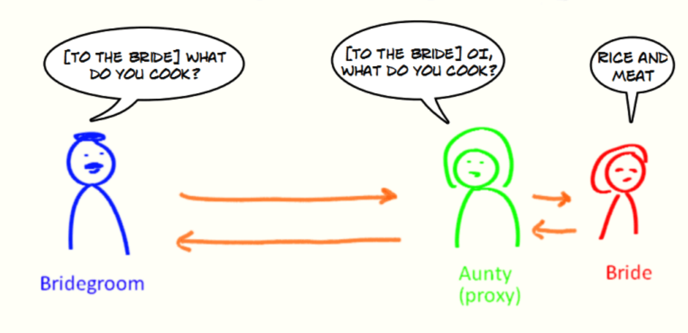

# 🥳 Java 代理模式

<hr/>

[[toc]]

## 1. 代理模式

代理模式是一种比较好理解的设计模式。简单来说就是 **我们使用代理对象来代替对真实对象(real object)的访问，这样就可以在不修改原目标对象的前提下，提供额外的功能操作，扩展目标对象的功能。**

**代理模式的主要作用是扩展目标对象的功能，比如说在目标对象的某个方法执行前后你可以增加一些自定义的操作。**

举个例子：新娘找来了自己的姨妈来代替自己处理新郎的提问，新娘收到的提问都是经过姨妈处理过滤之后的。姨妈在这里就可以看作是代理你的代理对象，代理的行为（方法）是接收和回复新郎的提问。



​ Understanding the Proxy Design Pattern | by Mithun Sasidharan | Medium

代理模式有静态代理和动态代理两种实现方式，我们 先来看一下静态代理模式的实现。

## 2. 静态代理

**静态代理中，我们对目标对象的每个方法的增强都是手动完成的（\*后面会具体演示代码\*），非常不灵活（\*比如接口一旦新增加方法，目标对象和代理对象都要进行修改\*）且麻烦(\*需要对每个目标类都单独写一个代理类\*）。** 实际应用场景非常非常少，日常开发几乎看不到使用静态代理的场景。

上面我们是从实现和应用角度来说的静态代理，从 JVM 层面来说， **静态代理在编译时就将接口、实现类、代理类这些都变成了一个个实际的 class 文件。**

静态代理实现步骤:

1. 定义一个接口及其实现类；
2. 创建一个代理类同样实现这个接口
3. 将目标对象注入进代理类，然后在代理类的对应方法调用目标类中的对应方法。这样的话，我们就可以通过代理类屏蔽对目标对象的访问，并且可以在目标方法执行前后做一些自己想做的事情。

下面通过代码展示！

**1.定义发送短信的接口**

```java
public interface SmsService {
    String send(String message);
}
```

**2.实现发送短信的接口**

```java
public class SmsServiceImpl implements SmsService {
    public String send(String message) {
        System.out.println("send message:" + message);
        return message;
    }
}
```

**3.创建代理类并同样实现发送短信的接口**

```java
public class SmsProxy implements SmsService {

    private final SmsService smsService;

    public SmsProxy(SmsService smsService) {
        this.smsService = smsService;
    }

    @Override
    public String send(String message) {
        //调用方法之前，我们可以添加自己的操作
        System.out.println("before method send()");
        smsService.send(message);
        //调用方法之后，我们同样可以添加自己的操作
        System.out.println("after method send()");
        return null;
    }
}

```

**4.实际使用**

```java
public class Main {
    public static void main(String[] args) {
        SmsService smsService = new SmsServiceImpl();
        SmsProxy smsProxy = new SmsProxy(smsService);
        smsProxy.send("java");
    }
}
```

运行上述代码之后，控制台打印出：

```bash
before method send()
send message:java
after method send()
```

可以输出结果看出，我们已经增加了 `SmsServiceImpl` 的`send()`方法。

## 3. 动态代理

相比于静态代理来说，动态代理更加灵活。我们不需要针对每个目标类都单独创建一个代理类，并且也不需要我们必须实现接口，我们可以直接代理实现类( _CGLIB 动态代理机制_)。

**从 JVM 角度来说，动态代理是在运行时动态生成类字节码，并加载到 JVM 中的。**

说到动态代理，Spring AOP、RPC 框架应该是两个不得不提的，它们的实现都依赖了动态代理。

**动态代理在我们日常开发中使用的相对较少，但是在框架中的几乎是必用的一门技术。学会了动态代理之后，对于我们理解和学习各种框架的原理也非常有帮助。**

就 Java 来说，动态代理的实现方式有很多种，比如 **JDK 动态代理**、**CGLIB 动态代理**等等。

### 3.1. JDK 动态代理机制

#### 3.1.1. 介绍

**在 Java 动态代理机制中 `InvocationHandler` 接口和 `Proxy` 类是核心。**

`Proxy` 类中使用频率最高的方法是：`newProxyInstance()` ，这个方法主要用来生成一个代理对象。

```java
public static Object newProxyInstance(ClassLoader loader,
                                      Class<?>[] interfaces,
                                      InvocationHandler h)
    throws IllegalArgumentException
{
    ......
}
```

这个方法一共有 3 个参数：

1. **loader** :类加载器，用于加载代理对象。
2. **interfaces** : 被代理类实现的一些接口；
3. **h** : 实现了 `InvocationHandler` 接口的对象；

要实现动态代理的话，还必须需要实现`InvocationHandler` 来自定义处理逻辑。 当我们的动态代理对象调用一个方法时，这个方法的调用就会被转发到实现`InvocationHandler` 接口类的 `invoke` 方法来调用。

```java
public interface InvocationHandler {

/**
 * 当你使用代理对象调用方法的时候实际会调用到这个方法
 */
public Object invoke(Object proxy, Method method, Object[] args)
    throws Throwable;
}
```

`invoke()` 方法有下面三个参数：

1. **proxy** :动态生成的代理类
2. **method** : 与代理类对象调用的方法相对应
3. **args** : 当前 method 方法的参数

也就是说：**你通过`Proxy` 类的 `newProxyInstance()` 创建的代理对象在调用方法的时候，实际会调用到实现`InvocationHandler` 接口的类的 `invoke()`方法。** 你可以在 `invoke()` 方法中自定义处理逻辑，比如在方法执行前后做什么事情。

#### 3.1.2. JDK 动态代理类使用步骤

1. 定义一个接口及其实现类；
2. 自定义 `InvocationHandler` 并重写`invoke`方法，在 `invoke` 方法中我们会调用原生方法（被代理类的方法）并自定义一些处理逻辑；
3. 通过 `Proxy.newProxyInstance(ClassLoader loader,Class<?>[] interfaces,InvocationHandler h)` 方法创建代理对象；

#### 3.1.3. 代码示例

这样说可能会有点空洞和难以理解，我上个例子，大家感受一下吧！

**1.定义发送短信的接口**

```java
public interface SmsService {
    String send(String message);
}
```

**2.实现发送短信的接口**

```java
public class SmsServiceImpl implements SmsService {
    public String send(String message) {
        System.out.println("send message:" + message);
        return message;
    }
}
```

**3.定义一个 JDK 动态代理类**

```java
import java.lang.reflect.InvocationHandler;
import java.lang.reflect.InvocationTargetException;
import java.lang.reflect.Method;

/**
 * @author ZyKun
 * @createTime 2020年05月11日 11:23:00
 */
public class DebugInvocationHandler implements InvocationHandler {
    /**
     * 代理类中的真实对象
     */
    private final Object target;

    public DebugInvocationHandler(Object target) {
        this.target = target;
    }

    @Override
    public Object invoke(Object proxy, Method method, Object[] args) throws InvocationTargetException, IllegalAccessException {
        //调用方法之前，我们可以添加自己的操作
        System.out.println("before method " + method.getName());
        Object result = method.invoke(target, args);
        //调用方法之后，我们同样可以添加自己的操作
        System.out.println("after method " + method.getName());
        return result;
    }
}

```

`invoke()` 方法: 当我们的动态代理对象调用原生方法的时候，最终实际上调用到的是 `invoke()` 方法，然后 `invoke()` 方法代替我们去调用了被代理对象的原生方法。

**4.获取代理对象的工厂类**

```java
public class JdkProxyFactory {
    public static Object getProxy(Object target) {
        return Proxy.newProxyInstance(
                target.getClass().getClassLoader(), // 目标类的类加载器
                target.getClass().getInterfaces(),  // 代理需要实现的接口，可指定多个
                new DebugInvocationHandler(target)   // 代理对象对应的自定义 InvocationHandler
        );
    }
}
```

`getProxy()`：主要通过`Proxy.newProxyInstance（）`方法获取某个类的代理对象

**5.实际使用**

```java
SmsService smsService = (SmsService) JdkProxyFactory.getProxy(new SmsServiceImpl());
smsService.send("java");
```

运行上述代码之后，控制台打印出：

```plain
before method send
send message:java
after method send
```

### 3.2. CGLIB 动态代理机制

#### 3.2.1. 介绍

**JDK 动态代理有一个最致命的问题是其只能代理实现了接口的类。**

**为了解决这个问题，我们可以用 CGLIB 动态代理机制来避免。**

[CGLIBopen in new window](https://github.com/cglib/cglib)(_Code Generation Library_)是一个基于[ASMopen in new window](http://www.baeldung.com/java-asm)的字节码生成库，它允许我们在运行时对字节码进行修改和动态生成。CGLIB 通过继承方式实现代理。很多知名的开源框架都使用到了[CGLIBopen in new window](https://github.com/cglib/cglib)， 例如 Spring 中的 AOP 模块中：如果目标对象实现了接口，则默认采用 JDK 动态代理，否则采用 CGLIB 动态代理。

**在 CGLIB 动态代理机制中 `MethodInterceptor` 接口和 `Enhancer` 类是核心。**

你需要自定义 `MethodInterceptor` 并重写 `intercept` 方法，`intercept` 用于拦截增强被代理类的方法。

```java
public interface MethodInterceptor
extends Callback{
    // 拦截被代理类中的方法
    public Object intercept(Object obj, java.lang.reflect.Method method, Object[] args,MethodProxy proxy) throws Throwable;
}

```

1. **obj** : 被代理的对象（需要增强的对象）
2. **method** : 被拦截的方法（需要增强的方法）
3. **args** : 方法入参
4. **proxy** : 用于调用原始方法

你可以通过 `Enhancer`类来动态获取被代理类，当代理类调用方法的时候，实际调用的是 `MethodInterceptor` 中的 `intercept` 方法。

#### 3.2.2. CGLIB 动态代理类使用步骤

1. 定义一个类；
2. 自定义 `MethodInterceptor` 并重写 `intercept` 方法，`intercept` 用于拦截增强被代理类的方法，和 JDK 动态代理中的 `invoke` 方法类似；
3. 通过 `Enhancer` 类的 `create()`创建代理类；

#### 3.2.3. 代码示例

不同于 JDK 动态代理不需要额外的依赖。[CGLIBopen in new window](https://github.com/cglib/cglib)(_Code Generation Library_) 实际是属于一个开源项目，如果你要使用它的话，需要手动添加相关依赖。

```xml
<dependency>
  <groupId>cglib</groupId>
  <artifactId>cglib</artifactId>
  <version>3.3.0</version>
</dependency>
```

**1.实现一个使用阿里云发送短信的类**

```java
package github.javaguide.dynamicProxy.cglibDynamicProxy;

public class AliSmsService {
    public String send(String message) {
        System.out.println("send message:" + message);
        return message;
    }
}
```

**2.自定义 `MethodInterceptor`（方法拦截器）**

```java
import net.sf.cglib.proxy.MethodInterceptor;
import net.sf.cglib.proxy.MethodProxy;

import java.lang.reflect.Method;

/**
 * 自定义MethodInterceptor
 */
public class DebugMethodInterceptor implements MethodInterceptor {


    /**
     * @param o           被代理的对象（需要增强的对象）
     * @param method      被拦截的方法（需要增强的方法）
     * @param args        方法入参
     * @param methodProxy 用于调用原始方法
     */
    @Override
    public Object intercept(Object o, Method method, Object[] args, MethodProxy methodProxy) throws Throwable {
        //调用方法之前，我们可以添加自己的操作
        System.out.println("before method " + method.getName());
        Object object = methodProxy.invokeSuper(o, args);
        //调用方法之后，我们同样可以添加自己的操作
        System.out.println("after method " + method.getName());
        return object;
    }
}
```

**3.获取代理类**

```java
import net.sf.cglib.proxy.Enhancer;

public class CglibProxyFactory {

    public static Object getProxy(Class<?> clazz) {
        // 创建动态代理增强类
        Enhancer enhancer = new Enhancer();
        // 设置类加载器
        enhancer.setClassLoader(clazz.getClassLoader());
        // 设置被代理类
        enhancer.setSuperclass(clazz);
        // 设置方法拦截器
        enhancer.setCallback(new DebugMethodInterceptor());
        // 创建代理类
        return enhancer.create();
    }
}
```

**4.实际使用**

```java
AliSmsService aliSmsService = (AliSmsService) CglibProxyFactory.getProxy(AliSmsService.class);
aliSmsService.send("java");
```

运行上述代码之后，控制台打印出：

```bash
before method send
send message:java
after method send
```

### 3.3. JDK 动态代理和 CGLIB 动态代理对比

1. **JDK 动态代理只能代理实现了接口的类或者直接代理接口，而 CGLIB 可以代理未实现任何接口的类。** 另外， CGLIB 动态代理是通过生成一个被代理类的子类来拦截被代理类的方法调用，因此不能代理声明为 final 类型的类和方法。
2. 就二者的效率来说，大部分情况都是 JDK 动态代理更优秀，随着 JDK 版本的升级，这个优势更加明显。

## 4. 静态代理和动态代理的对比

1. **灵活性**：动态代理更加灵活，不需要必须实现接口，可以直接代理实现类，并且可以不需要针对每个目标类都创建一个代理类。另外，静态代理中，接口一旦新增加方法，目标对象和代理对象都要进行修改，这是非常麻烦的！
2. **JVM 层面**：静态代理在编译时就将接口、实现类、代理类这些都变成了一个个实际的 class 文件。而动态代理是在运行时动态生成类字节码，并加载到 JVM 中的。

## 5. 总结

这篇文章中主要介绍了代理模式的两种实现：静态代理以及动态代理。涵盖了静态代理和动态代理实战、静态代理和动态代理的区别、JDK 动态代理和 Cglib 动态代理区别等内容。
