# 🤔Linux

<hr/>

[[toc]]

**为什么要学 Linux ?**

- 企业用人要求
- 个人发展要求

**学习后能干什么？**
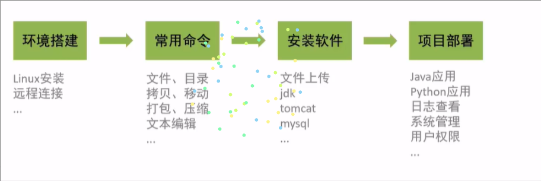

## Linux 简介

### 不同应用领域的主流操作系统

- 桌面操作系统
  - Windows （用户数量最多)
  - Mac OS（操作体验好，办公人士首选)
  - Linux（用户数量少)
- 服务器操作系统
  - UNIX（安全、稳定、付费)
  - Linux（安全、稳定、免费、占有率高)
  - Windows Server (付费、占有率低)
- 移动设备操作系统
  - Android (基于 Linux 、开源，主要用于智能手机、平板电脑和智能电视)
  - ios（苹果公司开发、不开源，用于苹果公司的产品，例如: iPhone、iPad )
- 嵌入式操作系统
  - Linux（机顶盒、路由器、交换机)

### Linux 发展历史

Linux 系统历史

- 时间:1991 年
- 地点:芬兰赫尔辛基大学
- 人物:Linus Torvalds ( 21 岁)
- 语言:C 语言、汇编语言
- logo:企鹅
- 特点:免费、开源、多用户、多任务

### Linux 系统版本

Linux 系统分为内核版和发行版

- 内核版
  - 由 Linus Torvalds 及其团队开发、维护
  - 免费、开源
  - 负责控制硬件
- 发行版
  - 基于 Linux 内核版进行扩展
  - 由各个 Linux 厂商开发、维护
  - 有收费版本和免费版本

**Linux 系统发行版**:

- ubuntu:以桌面应用为主·
- RedHat:应用最广泛、收费
- CentOs: RedHat 的社区版、免费·
- opensuSE:对个人完全免费、图形界面华丽
- Fedora:功能完备、快速更新、免费
- 红旗 Linux:北京中科红旗软件技术有限公司开发
  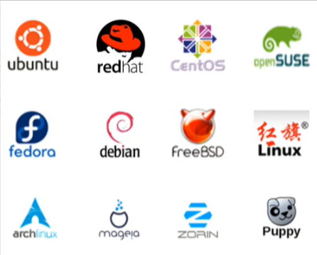

## Linux 安装

### 安装方式介绍

Linux 系统的安装方式

- 物理机安装:直接将操作系统安装到服务器硬件上
- 虚拟机安装:通过虚拟机软件安装

**虚拟机**( Virtual Machine)指通过**软件**模拟的具有完整硬件系统功能、运行在完全隔离环境中的完整计算机系统。

常用虚拟机软件

- VMware
- VirtualBox
- VMLite workStation
- Qemu
- HopeddotVos

### 安装 Linux

**安装方式-安装 VMWare**

直接双击运行资料中的 VMware 安装程序，根据提示完成安装即可

**安装 CentOS 镜像**

使用资料中提供的 CentOS 镜像文件来完成 Linux 系统的安装

### 网卡设置

由于启动服务器时未加载网卡，导致 IP 地址初始化失败

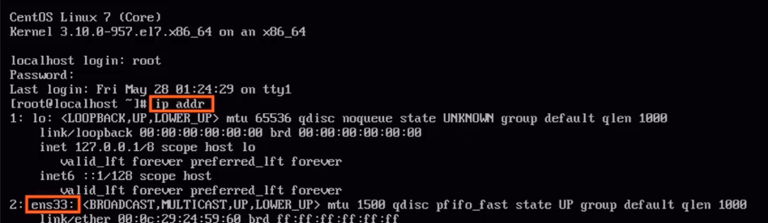

修改网络初始化配置，设定网卡在系统启动时初始化
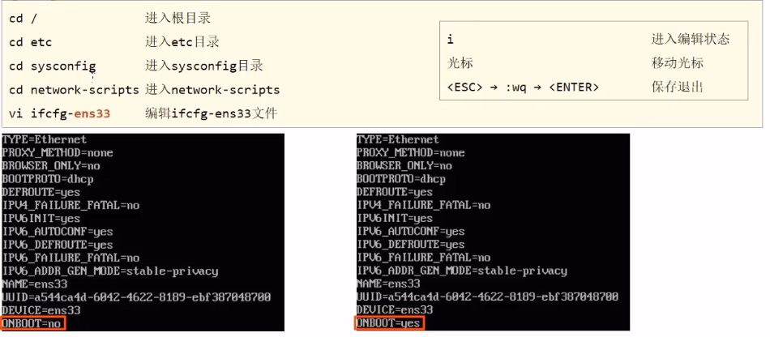

### 安装 SSH 连接工具

SSH ( Secure Shell)，建立在应用层基础上的安全协议

常用的 SSH 连接工具

- putty
- secureCRT
- xshell
- finalshell

通过 SSH 连接工具就可以实现从本地连接到远程的 Linux 服务器

### Linux 和 windows 目录结构对比

Linux 系统中的目录

- /是所有目录的顶点
- 目录结构像一颗倒挂的树
  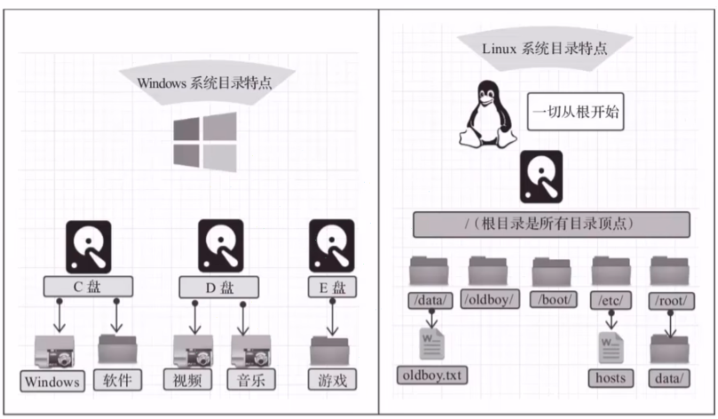

### Linux 目录结构

- bin 存放二进制可执行文件
- boot 存放系统引导时使用的各种文件
- dev 存放设备文件
- etc 存放系统配置文件
- home 存放系统用户的文件
- lib 存放程序运行所需的共享库和内核模块
- opt 额外安装的可选应用程序包所放置的位置
- root 超级用户目录
- sbin 存放二进制可执行文件，只有 root 用户才能访问
- tmp 存放临时文件
- usr 存放系统应用程序
- var 存放运行时需要改变数据的文件，例如日志文件
  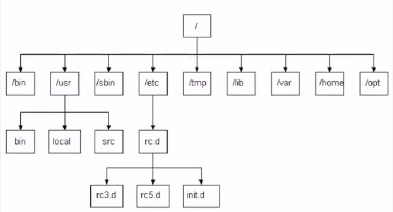

## Linux 常用命令

### Linux 命令初体验

| 序号 | 命令           | 对应英文             | 作用                     |
| ---- | -------------- | -------------------- | ------------------------ |
| 1    | ls             | list                 | 查看当前目录下的内容     |
| 2    | pwd            | print work directory | 查看当前所在目录         |
| 3    | cd [目录名]    | change directory     | 切换目录                 |
| 4    | touch [文件名] | touch                | 如果文件不存在，新建文件 |
| 5    | mkdir [目录名] | make directory       | 创建目录                 |
| 6    | rm [文件名]    | remove               | 删除指定文件             |

**使用技巧**

- Tab 键自动补全
- 连续两次 Tab 键，给出操作提示
- 使用上下箭头快速调出曾经使用过的命令
- 使用 clear 命令或者 Ctrl+l 快捷键实现清屏

**命令格式**

command 【-options】【parameter】

说明:

- command:命令名
- 【-options】:选项，可用来对命令进行控制，也可以省略
- 【parameter】:传给命令的参数，可以是零个、一个或者多个

注意:

[]代表可选

命令名、选项、参数之间有空格进行分隔

### 文件目录操作命令

#### 文件目录操作命令**ls**

作用:显示指定目录下的内容

语法:ls [-al] [dir]

说明:

- -a 显示所有文件及目录(.开头的隐藏文件也会列出)
- -l 除文件名称外，同时将文件型态(d 表示目录，-表示文件)、权限、拥有者、文件大小等信息详细列出

注意:
由于我们使用 ls 命令时经常需要加入-l 选项，所以 Linux 为 ls -l 命令提供了一种简写方式，即 ll

#### 文件目录操作命令**cd**

作用:用于切换当前工作目录，即进入指定目录

语法:cd [dirName]

特殊说明:

- ~表示用户的 home 目录
- .表示目前所在的目录
- ..表示目前目录位置的上级目录

举例:

- cd ..
  切换到当前目录的上级目录
- cd ~
  切换到用户的 home 目录
- cd /usr/local 切换到/usr/local 目录

#### 文件目录操作命令**cat**

作用:用于显示文件内容

语法: cat [-n] fileName

说明:

- -n :由 1 开始对所有输出的行数编号

举例:

- cat /etc/profile
  查看/etc 目录下的 profile 文件内容

#### 文件目录操作命令**more**

作用:以分页的形式显示文件内容

语法: more fileName

操作说明:

- 回车键
  向下滚动一行
- 空格键
  向下滚动一屏
- b
  返回上一屏
- q 或者 Ctrl+C
  退出 more

举例:

more /etc/profile
以分页方式显示/etc 目录下的 profile 文件内容

#### 文件目录操作命令**tail**

作用:查看文件末尾的内容

语法:tail [-f] fileName

说明:

- -f :动态读取文件末尾内容并显示，通常用于日志文件的内容输出

举例:

- tail /etc/profile
  显示/etc 目录下的 profile 文件末尾 10 行的内容
- tail -20 /etc/profile
  显示/etc 目录下的 profile 文件末尾 20 行的内容
- tail -f /itcast/my.log
  动态读取/itcast 目录下的 my.log 文件末尾内容并显示

#### 文件目录操作命令**mkdir**

作用:创建目录

语法:mkdir [-p] dirName

说明:

- -p︰确保目录名称存在，不存在的就创建一个。通过此选项，可以实现多层目录同时创建

举例:

- mkdir itcast 　在当前目录下，建立一个名为 itcast 的子目录
- mkdir-p itcast/test 　在工作目录下的 itcast 目录中建立一个名为 test 的子目录，若 itcast 目录不存在，则建立一个

#### 文件目录操作命令 rmdir

作用:删除空目录

语法:rmdir [-p] dirName

说明:

- -p:当子目录被删除后使父目录为空目录的话，则一并删除

举例:

- rmdir itcast 　删除名为 itcast 的空目录
- rmdir-p itcast/test 　删除 itcast 目录中名为 test 的子目录，若 test 目录删除后 itcast 目录变为空目录，则也被删除
- rmdir itcast\*　删除名称以 itcast 开始的空目录

#### 文件目录操作命令 rm

作用:删除文件或者目录

语法:rm[-rf] name

说明:

- -r:将目录及目录中所有文件（目录）逐一删除，即递归删除
- -f:无需确认，直接删除

举例:

- rm -r itcast/删除名为 itcast 的目录和目录中所有文件，删除前需确认
- rm -rf itcast/无需确认，直接删除名为 itcast 的目录和目录中所有文件
- rm -f hello.txt 无需确认，直接删除 hello.txt 文件

### 拷贝移动命令

#### 拷贝移动命令 cp

作用:用于复制文件或目录语法:cp [-r] source dest

说明:

- -r:如果复制的是目录需要使用此选项，此时将复制该目录下所有的子目录和文件

举例:

- cp hello.txt itcast/
  将 hello.txt 复制到 itcast 目录中
- cp hello.txt . / hi.txt
  将 hello.txt 复制到当前目录，并改名为 hi.txt
- cp -r itcast/ ./itheimal 将 itcast 目录和目录下所有文件复制到 itheima 目录下
- cp -r itcast/\* ./ itheima/将 itcast 目录下所有文件复制到 itheima 目录下

#### 拷贝移动命令 mv

作用:为文件或目录改名、或将文件或目录移动到其它位置

语法: mv source dest

举例:

- mv hello.txt hi.txt
  将 hello.txt 改名为 hi.txt
- mv hi.txt itheima/
  将文件 hi.txt 移动到 itheima 目录中
- mv hi.txt itheima/ hello.txt 将 hi.txt 移动到 itheima 目录中，并改名为 hello.txt
- mv itcast/ itheima/如果 itheima 目录不存在，将 itcast 目录改名为 itheima
- mv itcast/ itheima/
  如果 itheima 目录存在，将 itcast 目录移动到 itheima 目录中

### 打包压缩命令 tar

作用:对文件进行打包、解包、压缩、解压

语法: tar [-zcxvf] fileName [files]

包文件后缀为.tar 表示只是完成了打包，并没有压缩

包文件后缀为.tar.gz 表示打包的同时还进行了压缩

说明:

- -z∶ z 代表的是 gzip，通过 gzip 命令处理文件，gzip 可以对文件压缩或者解压
- -c: c 代表的是 create，即创建新的包文件
- -x: x 代表的是 extract，实现从包文件中还原文件
- -v: v 代表的是 verbose，显示命令的执行过程
- -f: f 代表的是 file，用于指定包文件的名称

### 文本编辑命令 vi/vim

作用: vi 命令是 Linux 系统提供的一个文本编辑工具，可以对文件内容进行编辑，类似于 Windows 中的记事本

语法: vi fileName

说明:

1、 vim 是从 vi 发展来的一个功能更加强大的文本编辑工具，在编辑文件时可以对文本内容进行着色，方便我们对文件进行编辑处理，所以实际工作中 vim 更加常用。

2、要使用 vim 命令，需要我们自己完成安装。可以使用该命令来完成安装:yum install vim

#### 文本编辑命令 vim

作用:对文件内容进行编辑，vim 其实就是一个文本编辑器

语法:vim fileName

说明:

1、在使用 vim 命令编辑文件时，如果指定的文件存在则直接打开此文件。如果指定的文件不存在则新建文件。

2、vim 在进行文本编辑时共分为三种模式，分别是命令模式(Command mode)，插入模式（Insert mode)和底行模式(Last line mode)。这三种模式之间可以相互切换。我们在使用 vim 时一定要注意我们当前所处的是哪种模式。

针对 vim 中的三种模式说明如下:

1、命令模式

- 命令模式下可以查看文件内容、移动光标（上下左右箭头、gg、G)
- 通过 vim 命令打开文件后，默认进入命令模式
- 另外两种模式需要首先进入命令模式，才能进入彼此

2、插入模式

- 插入模式下可以对文件内容进行编辑
- 在命令模式下按下[i,a,o]任意一个，可以进入插入模式。进入插入模式后，下方会出现【insert】字样
- 在插入模式下按下 ESC 键，回到命令模式

3、底行模式

- 底行模式下可以通过命令对文件内容进行查找、显示行号、退出等操作
- 在命令模式下按下[:,/]任意一个，可以进入底行模式
- 通过/方式进入底行模式后，可以对文件内容进行查找
- 通过:方式进入底行模式后，可以输入 wq（保存并退出）、q!(不保存退出） 、 set nu(显示行号)

### 查找命令

#### 查找命令 find

作用:在指定目录下查找文件

语法:find dirName -option fileName

举例:

- find . -name "\*.java"
  在当前目录及其子目录下查找.java 结尾文件
- find /itcast -name "\*.java"
  在/itcast 目录及其子目录下查找.java 结尾的文件

#### 查找命令 grep

作用:从指定文件中查找指定的文本内容

语法: grep word fileName

举例:

- grep Hello Helloworld.java
  查找 Helloworld.java 文件中出现的 Hello 字符串的位置
- grep hello \*.java
  查找当前目录中所有.java 结尾的文件中包含 hello 字符串的位置

## Linux 软件安装

### 软件安装方式

- 二进制发布包安装
  - 软件已经针对具体平台编译打包发布，只要解压，修改配置即可
- rpm 安装
  - 软件已经按照 redhat 的包管理规范进行打包，使用 rpm 命令进行安装，不能自行解决库依赖问题
- yum 安装
  - 一种在线软件安装方式，本质上还是 rpm 安装，自动下载安装包并安装，安装过程中自动解决库依赖问题
- 源码编译安装
  - 软件以源码工程的形式发布，需要自己编译打包

### 安装 jdk

操作步骤:

1、使用 FinalShell 自带的上传工具将 jdk 的二进制发布包上传到 Linux jdk-8u171-linux-×64.tar.gz

2、解压安装包，命令为 tar -zxvf jdk-8u171-linux-x64.tar.gz -C/usr/local

3、配置环境变量，使用 vim 命令修改/etc/profile 文件，在文件末尾加入如下配置

- JAVA_HOME=/usr/local/jdk1.8.0_171
- PATH=$JAVA_HOME/bin :$PATH

4、重新加载 profile 文件，使更改的配置立即生效，命令为 source /etc/profile

5、检查安装是否成功，命令为 java -version

### 安装 Tomcat

#### 操作步骤:

1、使用 FinalShell 自带的上传工具将 Tomcat 的二进制发布包上传到 Linuxapache-tomcat-7.0.57.tar.gz

2、解压安装包，命令为 tar -zxvf apache-tomcat-7.0.57.tar.gz -C/usr/local

3、进入 Tomcat 的 bin 目录启动服务，命令为 sh startup.sh 或者./startup.sh

#### 验证 Tomcat 启动是否成功，有多种方式:

- 查看启动日志

  more /usr/local/apache-tomcat-7.0.57/logs/catalina.out

  tail -50 /usr/local/apache-tomcat-7.0.57/logs/catalina.out

- 查看进程 ps -ef | grep tomcat
  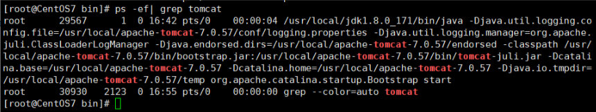

**注意:**

- ps 命令是 linux 下非常强大的进程查看命令，通过 ps -ef 可以查看当前运行的所有进程的详细信息
- “|”在 Linux 中称为管道符，可以将前一个命令的结果输出给后一个命令作为输入
- 使用 ps 命令查看进程时，经常配合管道符和查找命令 grep 一起使用，来查看特定进程

#### 防火墙操作:

- 查看防火墙状态(systemctl status firewalld、firewall-cmd --state)
- 暂时关闭防火墙(systemctl stop firewalld)
- 永久关闭防火墙(systemctl disable firewalld)
- 开启防火墙(systemctl start firewalld)
- 开放指定端口(firewall-cmd --zone=public --add-port=8080/tcp --permanent)
- 关闭指定端口(firewall-cmd --zone=public --remove-port=8080/tcp --permanent)
- 立即生效(firewall-cmd --reload)
- 查看开放的端口(firewall-cmd --zone=public --list-ports)

**注意:**

1、systemctl 是管理 Linux 中服务的命令，可以对服务进行启动、停止、重启、查看状态等操作

2、firewall-cmd 是 Linux 中专门用于控制防火墙的命令

3、为了保证系统安全，服务器的防火墙不建议关闭

#### 停止 Tomcat 服务的方式:

- 运行 Tomcat 的 bin 目录中提供的停止服务的脚本文件`shutdown.sh`

  sh shutdown.sh

  ./shutdown.sh

- 结束 Tomcat 进程
  查看 Tomcat 进程，获得进程 id
  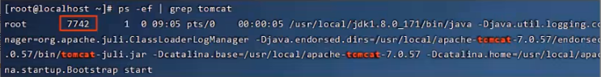
  执行命令结束进程**kill -9 7742**

**注意:**
kill 命令是 Linux 提供的用于结束进程的命令，-9 表示强制结束

### 安装 MySQL

1、检测当前系统中是否安装 MySQL 数据库

- rpm -qa
  查询当前系统中安装的所有软件
- rpm -qa l grep mysql
  查询当前系统中安装的名称带 mysql 的软件
- rpm -qa l grep mariadb
  查询当前系统中安装的名称带 mariadb 的软件
  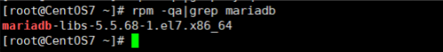

RPM（ Red-Hat Package Manager ）RPM 软件包管理器，是红帽 Linux 用于管理和安装软件的工具

**注意**：如果当前系统中已经安装有 MySQL 数据库，安装将失败。CentoS7 自带 mariadb，与 My5QL 数据库冲突

2、卸载已经安装的冲突软件

- rpm -e --nodeps 软件名称 　　　　卸载软件
- rpm -e --nodeps mariadb-libs-5.5.60-1.el7_5.x86_64

3、将资料中提供的 MySQL 安装包上传到 Linux 并解压

- mkdir /usr/local/mysql
- tar -zxvf mysql-5.7.25-1.el7.x86_64.rpm-bundle.tar.gz -C /usr/local/mysql

4、按照顺序安装 rpm 软件包

- rpm -ivh mysql-community-common-5.7.25-1.el7.x86_64.rpm

- rpm -ivh mysql-community-libs-5.7.25-1.el7.x86_64.rpm

- rpm -ivh mysql-community-devel-5.7.25-1.el7.x86_64.rpm

- rpm -ivh mysql-community-libs-compat-5.7.25-1.el7.x86_64.rpm

- rpm -ivh mysql-community-client-5.7.25-1.el7.x86_64.rpm

- yum install libaio

- yum install net-tools

- rpm -ivh mysql-community-server-5.7.25-1.el7.x86_64.rpm

  说明 1:安装过程中提示缺少 net-tools 依赖，使用 yum 安装

  说明 2:可以通过指令升级现有软件及系统内核

- yum update

5、启动 mysql

- systemctl status mysqld
  查看 mysql 服务状态
- systemctl start mysqld
  启动 mysql 服务
  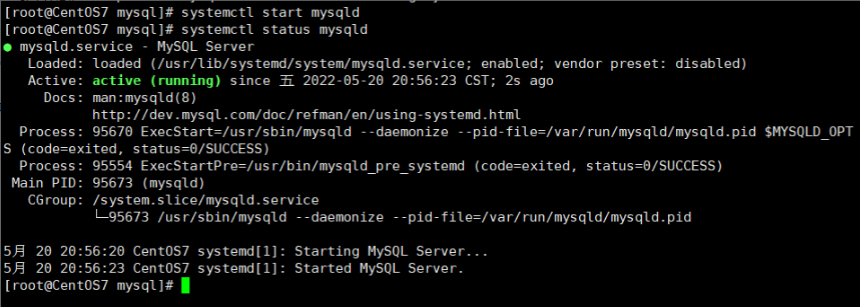

说明:可以设置开机时启动 mysql 服务，避免每次开机启动 mysql

- systemctl enable mysqld
  开机启动 mysql 服务
- netstat -tunlp
  查看已经启动的服务
- netstat -tunlp | grep mysql
- ps -ef | grep mysql
  查看 mysql 进程

6、登录 MySQL 数据库，查阅临时密码

- cat /var/log/mysqld.log
  查看文件内容
- cat /var/log/mysqld.log l grep password
  查看文件内容中包含 password 的行信息

7、登录 MySQL，修改密码，开放访问权限

- mysql -urpot -p
  登录 mysql（使用临时密码登录)

修改密码

- set global validate_password_length=4;
  设置密码长度最低位数
- set global validate_password_policy=LOW;
  设置密码安全等级低，便于密码可以修改成 root
- set password = password('root');
  设置密码为 root

开启访问权限

- grant all on _._ to 'root'@'%' identified by 'root';

  flush privileges;

8、测试 Mysql 数据库是否正常工作

- showdatabase;

### 安装 lrzsz

**操作步骤:**

1、搜索 lrzsz 安装包，命令为 **yum list lrzsz**

2、使用 yum 命令在线安装，命令为**yum install lrzsz.x86_64**

**注意：** Yum(全称为 Yellow dog Updater, Modified)是一个在 Fedora 和 RedHat 以及 CentoS 中的 Shell 前端软件包管理器。基于 RPM 包管理，能够从指定的服务器自动下载 RPM 包并且安装，可以自动处理依赖关系，并且一次安装所有依赖的软件包，无须繁琐地一次次下载、安装。

## 项目部署

### 手工部署项目

一、在 IDEA 中开发 SpringBoot 项目并打成 jar 包

```xml
<build>
    <plugins>
        <plugin>
            <groupId>org.springframework.boot</groupId>
            <artifactId>spring-boot-maven-plugin</artifactId>
        </plugin>
    </plugins>
</build>
```

pom 文件必须加入上面代码

二、将 jar 包上传到 Linux 服务器

- mkdir /usr/local/app 创建目录，将项目 jar 包放到此目录

三、启动 Spring 程序
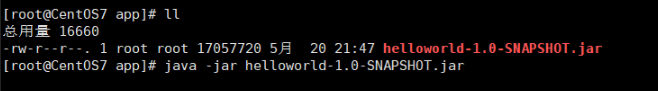

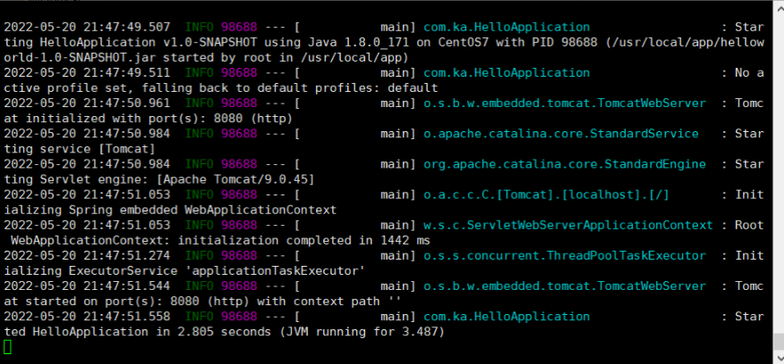

四、检查防火墙，确保 8080 端口对外开放，访问 SpringBoot 项目

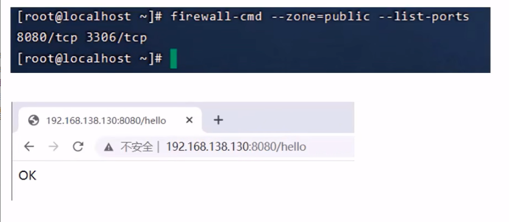

五、改为后台运行 SpringBoot 程序，并将日志输出到日志文件目前程序运行的问题

- 线上程序不会采用控制台霸屏的形式运行程序，而是将程序在后台运行
- 线上程序不会将日志输出到控制台，而是输出到日志文件，方便运维查阅信息

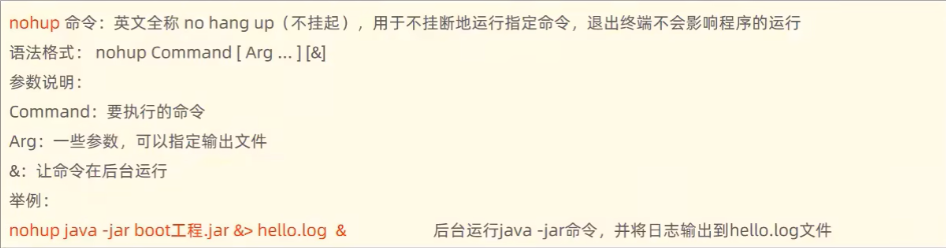

六、停止 SpringBoot 程序
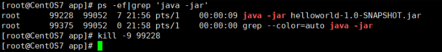

### 通过 Shell 脚本自动部署项目

操作步骤:

- 1、在 Linux 中安装 Git
- 2、使用 Git 克隆代码
- 3、在 Linux 中安装 maven
- 4、编写 Shell 脚本（拉取代码、编译、打包、启动）
- 5、为用户授予执行 Shell 脚本的权限
- 6、执行 Shell 脚本

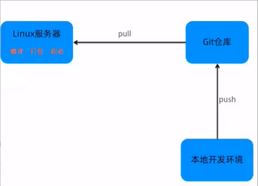

#### 1、在 Linux 中安装 Git

- yum list git
  列出 git 安装包
- yum install git
  在线安装 git

#### 2、使用 Git 克隆代码

- cd /usr/local/
- git clone <https://github.com/SummerW1nd/helloworld.git>

#### 3、在 Linux 中安装 maven

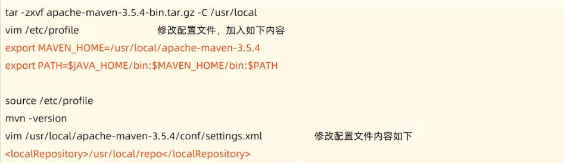

#### 4、将资料中提供的 Shell 脚本文件复制到 Linux (bootStart.sh)

- Shell 脚本(shell script)，是一种 Linux 系统中的脚本程序。
- 使用 Shell 脚本编程跟 JavaScript、Java 编程一样，只要有一个能编写代码的文本编辑器和一个能解释执行的脚本解释器就可以了.
- 对于 Shell 脚本编写不作为本课程重点内容，直接使用课程资料中提供的脚本文件 bootStart.sh 即可。

#### 五、为用户授权

chmod（英文全拼: change mode）命令是控制用户对文件的权限的命令

Linux 中的权限分为:读(r)、写(w)、执行(x)三种权限

Linux 的文件调用权限分为三级︰文件所有者（Owner)、用户组（Group)、其它用户(Other Users)

只有文件的所有者和超级用户可以修改文件或目录的权限

要执行 Shell 脚本需要有对此脚本文件的执行权限，如果没有则不能执行

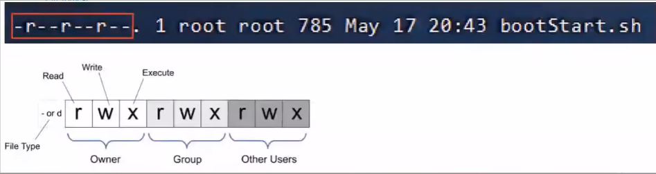

chmod 命令可以使用八进制数来指定权限

**举例**:

- chmod 777 bootStart.sh 为所有用户授予读、写、执行权限
- chmod 755 bootStart.sh 为文件拥有者授予读、写、执行权限，同组用户和其他用户授予读、执行权限
- chmod 210 bootstart.sh 为文件拥有者授予写权限，同组用户授予执行权限，其他用户没有任何权限

**注意**:三位数字分别代表不同用户的权限

- 第 1 位表示文件拥有者的权限
- 第 2 位表示同组用户的权限
- 第 3 位表示其他用户的权限

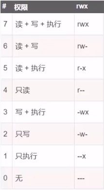

#### 设置静态 ip

修改文件/etc/sysconfig/network-scripts/ifcfg-ens33，内容如下:

```ini
TYPE="Ethernet"
PROXY_METHOD="none"
BROWSER_ONLY="no"
BOOTPROTO="static"#使用静态IP地址，默认为dhcp
IPADDR="192.168.138.100"#设置的静态IP地址
NETMASK="255.255.255.0"#子网掩码
GATEWAY="192.168.138.2"#网关地址
DNS1="192.168.138. 2"#DNS服务器
DEFROUTE="yes"
IPV4_FAILURE_FATAL="no"
IPV6INIT="yes "
IPV6_AUTOCONF="yes"
IPV6_DEFROUTE="yes"
IPV6_FAILURE_FATAL="no"
IPV6_ADDR_GEN_MODE="stable-privacy"
NAME="ens33"
UUID="95b614cd-79b0-4755-be8d-99f1cca7271b"
DEVICE="ens33"
ONBOOT="yes"#是否开机启用
```

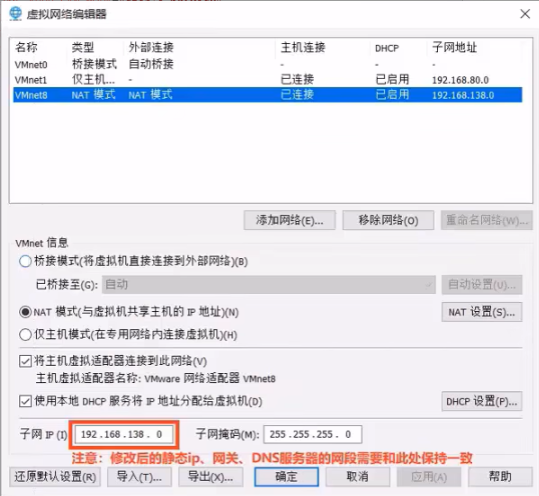
