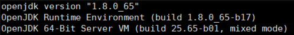
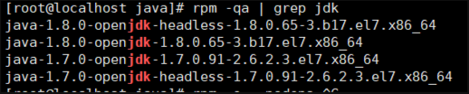
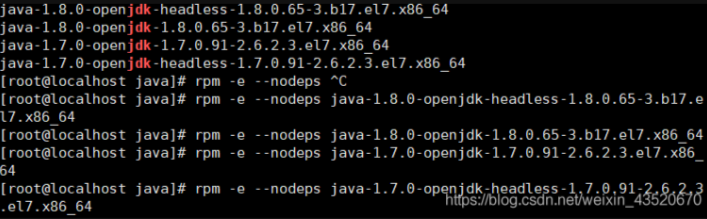
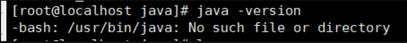
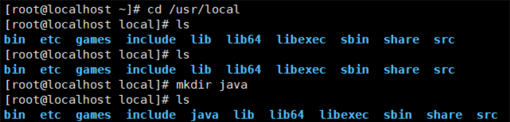
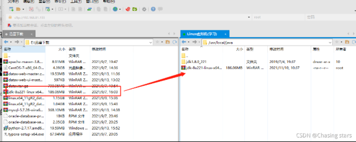
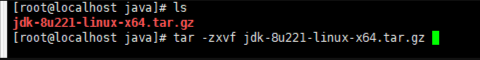
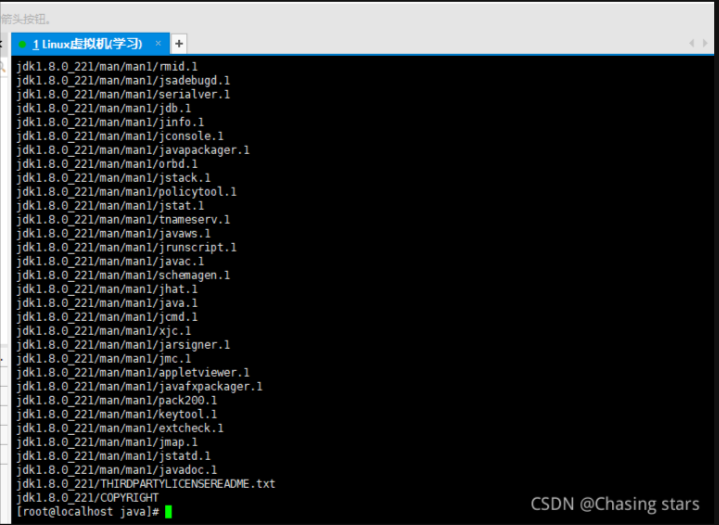
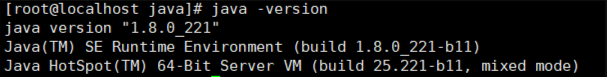

# 🤠Linux 配置 Java 环境

<hr/>

[[toc]]

# 查看系统是否有 java 环境

输入指令`java -version`回车即可

如图表示 Linux 系统有自带的 jdk，但是这并不是我们想要的，所以得卸载

# 卸载系统自带的 jdk

## 1 .找到具体的 jdk

```sh
rpm -qa | grep jdk
```



## 2.然后分别一个一个删除

指令 `rpm -e --nodeps + jdk名字`表示强制删除该 jdk，如图


## 3.验证是否删除成功

输入指令 `java -version`

表示删除成功

# 3、创建一个文件夹用于存放 java 的压缩包

一般放在 `/usr/local` 下

`cd` 到该目录
`ls` 查看目录下的文件
`mkdir java` 创建 java 文件夹
`ls` 查看目录下的文件


# 4、包下载好的 jdk 拖到 java 文件夹

jdk 下载地址：
链接：https://pan.baidu.com/s/18tMOeOLfP-jSOHOa7ME6xA
提取码：pksq


# 5、安装 jdk

指令 `tar -zxvf jdk-8u221-linux-x64.tar.gz` 表示解压我对应的 jdk 版本



# 6、配置环境变量

输入指令 `vi /etc/profile` 打开配置文件

点击 i 键 进入编辑模式，如下
在末尾追加

```sh
JAVA_HOME=/usr/local/java/jdk1.8.0_221
CLASSPATH=%JAVA_HOME%/lib:%JAVA_HOME%/jre/lib
PATH=$PATH:$JAVA_HOME/bin:$JAVA_HOME/jre/bin
export PATH CLASSPATH JAVA_HOME
1234
```

然后 按 Esc 键退出编辑模式

最后`:wq` 保存编辑并退出（注意有“:”）

# 7、让配置生效

输入指令`source /etc/profile`即可


# 8、验证是否配置成功

输入指令 `java -version`，出现如下图表示配置成功


# 关闭防火墙命令

应用可能需要用到各种端口，逐一去修改防火墙设置。非常麻烦，因此建议大家直接关闭防火墙！

```sh
# 关闭
systemctl stop firewalld
# 禁止开机启动防火墙
systemctl disable firewalld
```
