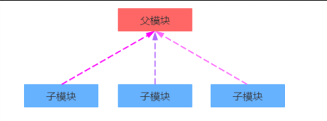
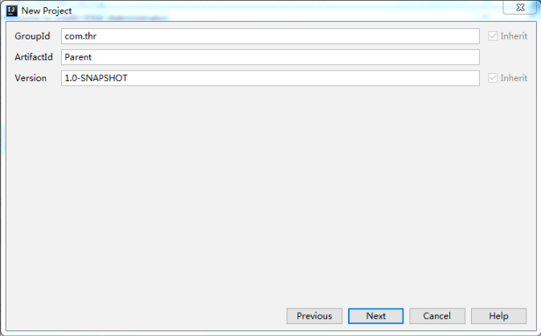
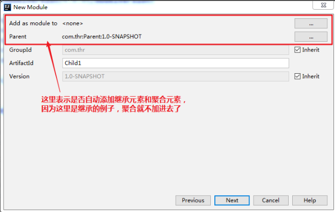
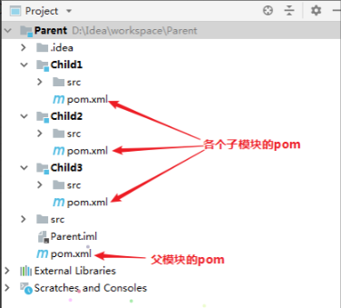
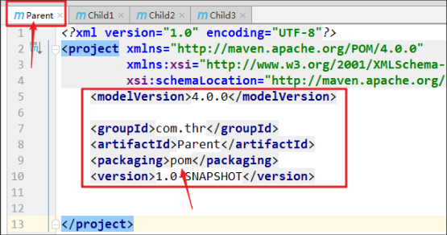
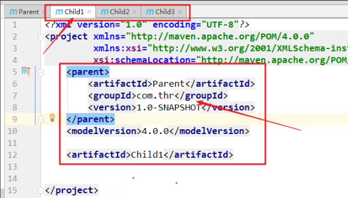
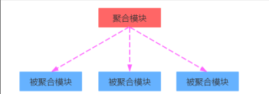
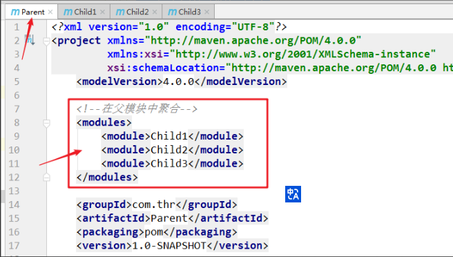
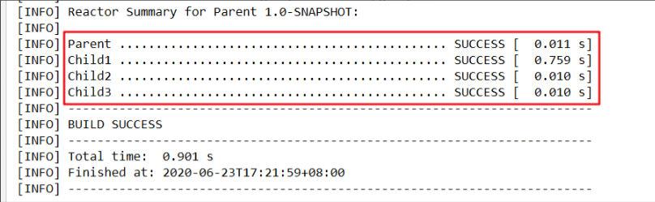

# 🈴Maven 的继承与聚合

<hr/>

[[toc]]

## 1、Maven 的继承

Maven 的继承，就是子模块会自动继承父模块中定义的一些依赖、插件、属性等等。我们使用继承的目的是为了消除重复性，实际项目中最常用的是把子模块 pom 中很多相同的依赖配置提取出来，统一锁定在父模块的 pom 中。如：grouptId、artifactId、version 等等。然后在使用的时候子模块会直接继承父模块的依赖版本号，子模块中不再需要指定具体版本号，方便统一管理项目的依赖问题。

Maven 继承的关系：



继承使用到的元素是`<parent>`对于继承关系的父模块 pom 来说，它不知道自己被哪些子模块继承了，而对于子模块的 pom 来说，它必须知道自己的父模块 pom 是谁。所以我们必须要在每个子模块的 pom 文件中添加指向父模块的引用，如下所示。

```xml
<parent>
    <artifactId>Parent</artifactId>
    <groupId>com.thr</groupId>
    <version>1.0-SNAPSHOT</version>
</parent>
```

还有要注意的是父模块坐标中的 packaging 必须是 pom 类型，否则子模块就不会继承。

```xml
<groupId>com.thr</groupId>
<artifactId>Parent</artifactId>
<packaging>pom</packaging>
<version>1.0-SNAPSHOT</version>
```

Maven 继承的实际使用举例：

①、创建父工程——Parent



②、然后分别创建三个子模块，Child1、Child2 和 Child3。（IDEA 右击项目选择 Module）



③、项目创建后的目录为。



④、项目创建后父模块和子模块的 pom。

1）父模块中的 pom 文件：



2）子模块中的 pom 文件(其它两个省略)：



⑤、然后我们统一管理项目的依赖版本，在父模块中使用版本锁定和版本常量的方法来锁定版本，并且在相应的子模块中导入依赖。

1）在父模块 pom 中设置依赖管理：

```xml
<?xml version="1.0" encoding="UTF-8"?>
<project xmlns="http://maven.apache.org/POM/4.0.0"
     xmlns:xsi="http://www.w3.org/2001/XMLSchema-instance"
     xsi:schemaLocation="http://maven.apache.org/POM/4.0.0 http://maven.apache.org/xsd/maven-4.0.0.xsd">
<modelVersion>4.0.0</modelVersion>

<groupId>com.thr</groupId>
<artifactId>Parent</artifactId>
<packaging>pom</packaging>
<version>1.0-SNAPSHOT</version>

<!-- 集中定义依赖版本号 -->
<properties>
    <spring.version>5.2.6.RELEASE</spring.version>
    <junit.version>4.11</junit.version>
</properties>

<!-- 版本锁定，当子模块中有需要并且自行添加了具体依赖后才有效，
它仅仅是起到锁定作用，不下载依赖包 -->
<dependencyManagement>
    <dependencies>
        <dependency>
            <groupId>junit</groupId>
            <artifactId>junit</artifactId>
            <version>${junit.version}</version>
            <scope>test</scope>
        </dependency>

        <!-- https://mvnrepository.com/artifact/org.springframework/spring-core -->
        <dependency>
            <groupId>org.springframework</groupId>
            <artifactId>spring-core</artifactId>
            <version>${spring.version}</version>
        </dependency>
    </dependencies>
</dependencyManagement>
```

2）在子模块中的 pom 设置需要的依赖：

```xml
<?xml version="1.0" encoding="UTF-8"?>
<project xmlns="http://maven.apache.org/POM/4.0.0"
     xmlns:xsi="http://www.w3.org/2001/XMLSchema-instance"
     xsi:schemaLocation="http://maven.apache.org/POM/4.0.0 http://maven.apache.org/xsd/maven-4.0.0.xsd">
<!--父模块的引用-->
<parent>
    <artifactId>Parent</artifactId>
    <groupId>com.thr</groupId>
    <version>1.0-SNAPSHOT</version>
</parent>
<modelVersion>4.0.0</modelVersion>

<artifactId>Child1</artifactId>

<!--依赖包的下载仍然有dependencies管理-->
<dependencies>
    <dependency>
        <groupId>junit</groupId>
        <artifactId>junit</artifactId>
        <!-- 版本号由父模块里面统一指定不再需要特别指定 -->
        <!--<version>4.11</version>-->
        <scope>test</scope>
    </dependency>
    <dependency>
        <groupId>org.springframework</groupId>
        <artifactId>spring-core</artifactId>
    </dependency>
</dependencies>
</project>
```

补充：可继承的 POM 元素如下**（红色为常用的元素）**

- `groupId`：项目组 ID，项目坐标的核心元素。
- `version`：项目版本，项目坐标的核心因素。
- description：项目的描述信息。
- organization：项目的组织信息。
- inceptionYear：项目的创始年份。
- url：项目的 URL 地址。
- developers：项目的开发者信息。
- contributors：项目的贡献者信息。
- distributionManagement：项目的部署配置。
- issueManagement：项目的缺陷跟踪系统信息。
- ciManagement：项目的持续集成系统信息。
- scm：项目的版本控制系统。
- malilingLists：项目的邮件列表信息。
- `properties`：自定义的 Maven 属性。
- `dependencies`：项目的依赖配置。
- `dependencyManagement`：项目的依赖管理配置。
- repositories：项目的仓库配置。
- build：包括项目的源码目录配置、输出目录配置、插件配置、插件管理配置等。
- reporting：包括项目的报告输出目录配置、报告插件配置等。

## 2、Maven 的聚合

Maven 的聚合，就是用多个子模块聚合成一个整体模块，它们是整体与部分的关系，通常在定义一个整体后，再去分析这个整体的组成结构。例如一辆汽车是由轮胎、发动机、底盘、电器设备等等聚合而成。

Maven 聚合的关系：



聚合使用到的元素是`<module>`。对于聚合模块来说，它知道有哪些被聚合的模块，而对于被聚合的模块来说，它们不知道被谁聚合了，也不知道它的存在。所以我们要在聚合模块中添加指向被聚合模块的引用，如下。

```xml
<modules>
    <module>../被聚合模块1</module>
    <module>../被聚合模块2</module>
    <module>../被聚合模块3</module>
</modules>
```

注意：module 中的路径为相对路径。

例如前面继承例子中的 Child1、Child2 和 Child3 这三个模块，我们对它进行聚合。

```xml
<!--在父模块中聚合-->
<modules>
    <module>Child1</module>
    <module>Child2</module>
    <module>Child3</module>
</modules>
```



聚合完成之后我们在使用 Maven 命令执行项目时，整个项目都会被构建，例如我们执行 mvn compile 指令。运行后如下图。



注意：这里被聚合模块的执行顺序不是按照`<modules>`元素中声明的先后顺序执行的，而是 Maven 在编译时会根据 pom.xml 中配置的 modules 得出一个**反应堆**构建顺序，并按照这个顺序编译项目模块。所以建议我们在创建项目的时候为项目模块提供一个合理的 Name，因为构建的结果中是通过各个模块中配置的 Name 来标识每一个项目模块的构件状态的。

**反应堆**

对于单模块 Maven 项目而言，反应堆就是整个项目本身。而对于多模块的 Maven 项目，反应堆是整个项目所有模块组成的一个构建结构，包含模块之间继承与依赖的关系。模块间的依赖关系会将反应堆构成一个有向非循环图。

**裁剪反应堆**

一般来说，我们要么构建整个项目，要么构建单个模块，但是有些时候，我们会想要仅仅构建这个完整的反应堆中的某些模块，所以我们需要裁剪反应堆。

Maven 提供的如下几条裁剪反应堆命令：

- -pl –projects：构建指定的模块，多个模块用,分隔，不会构建所列模块的依赖
- -am alse mak：构建模块同时构建所列模块依赖的其他模块
- -amd alse make dependency：构建模块同时构建依赖当前模块的其他模块
- -rf resume –from：在计算出的反应堆顺序基础上，从指定模块开始向后构建

> 在实际的开发中，我们通常会将聚合和继承合二为一，也就是合在一起使用。但是聚合和继承是两个不同的概念，它们二者之间是没有什么关系的。
