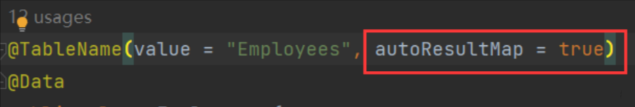
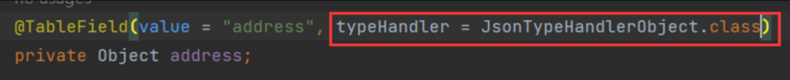
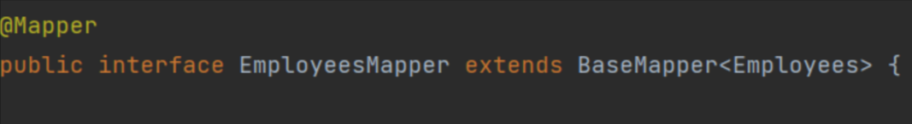

# 🔡Mybatis&MybatisPlus 操作 jsonb 格式数据

<hr/>

[[toc]]

最近有用到**postgresql**，里面的一个特色数据类型便是**jsonb**，和 json 差不多，但是查询比较快，关于概念，这里就提一句，不赘述。

我们先来看下用 mybatisplus，首先是查询数据。

依赖：

```xml
<dependency>
        <groupId>com.baomidou</groupId>
        <artifactId>mybatis-plus-boot-starter</artifactId>
        <version>3.5.1</version>
    </dependency>

    <dependency>
        <groupId>org.mybatis.spring.boot</groupId>
        <artifactId>mybatis-spring-boot-starter</artifactId>
        <version>2.2.2</version>
    </dependency>
```

然后数据库：

```sql
CREATE TABLE employees (
    id SERIAL PRIMARY KEY,
    name TEXT,
    age INTEGER,
    address JSONB
);

INSERT INTO employees (name, age, address) VALUES
  ('Alice', 25, '{"city": "New York", "street": "123 Main St"}'),
  ('Bob', 30, '{"city": "San Francisco", "street": "456 Elm St"}'),
  ('Charlie', 35, '{"city": "Seattle", "street": "789 Oak St"}'),
  ('David', 28, '{"city": "Chicago", "street": "678 Walnut St"}'),
  ('Eve', 27, '{"city": "Los Angeles", "street": "234 Pine St"}'),
  ('Frank', 32, '{"city": "Boston", "street": "345 Maple St"}'),
  ('Grace', 29, '{"city": "Austin", "street": "567 Birch St"}');
```

前面的都无所谓，主要来看实体类，实体类中有两个地方注意：

**类**



**字段**



因为是用的 MP，所以在这里直接就注解上配置了 （**这里是为了扩展性，所以才自定义的，其实在 MP 中，是自带了 TypeHandler 的，有 Gson，FastJson 等等**）

```java
import com.alibaba.fastjson.JSON;
import org.apache.ibatis.type.BaseTypeHandler;
import org.apache.ibatis.type.JdbcType;
import org.apache.ibatis.type.MappedTypes;
import org.postgresql.util.PGobject;

import java.sql.CallableStatement;
import java.sql.PreparedStatement;
import java.sql.ResultSet;
import java.sql.SQLException;

/**
 * @Description:
 * @Author ZyKun
 * @Date 2023/12/18 11:30
 */
@MappedTypes(Object.class)
public class JsonTypeHandlerObject<T extends Object> extends BaseTypeHandler<T> {

    private static final PGobject jsonObject = new PGobject();

    @Override
    public void setNonNullParameter(PreparedStatement ps, int i, T parameter, JdbcType jdbcType) throws SQLException {
        jsonObject.setType("jsonb");
        jsonObject.setValue(JSON.toJSONString(parameter));
        ps.setObject(i, jsonObject);
    }

    @Override
    public T getNullableResult(ResultSet resultSet, String columnName) throws SQLException {
        return (T) resultSet.getString(columnName);

    }

    @Override
    public T getNullableResult(ResultSet resultSet, int columnIndex) throws SQLException {
        return (T) resultSet.getString(columnIndex);

    }

    @Override
    public T getNullableResult(CallableStatement callableStatement, int columnIndex) throws SQLException {
        return (T) callableStatement.getString(columnIndex);
    }
}
```

添加 TypeHandler，用于类型处理，这个应该不陌生，如有不知道这个的小伙伴，可以去温习一下 mybatis 相关知识。

定义 mapper，这个不用说，最基本的



再来看下 Mybatis 的，mybatis 不像 plus，很多都要手动进行配置

先定义一个 resultMap，然后在字段上指定 TypeHandler 即可

```xml
<mapper namespace="com.ZyKun.mapper.EmployeesMapper">

    <resultMap id="EmployeesMap" type="com.jack.entity.Employees">
        <id column="id" property="id"/>
        <result column="name" property="name"/>
        <result column="age" property="age"/>
        <result column="address" property="address" typeHandler="com.jack.handler.JsonTypeHandlerObject"/>
    </resultMap>

    <select id="findList"  resultMap="EmployeesMap">
        select * from employees;
    </select>

</mapper>
```

然后再写个测试类自己测一下，这里不多说

重点说一下插入数据

以 mybatis 为例，先在 mapperx.xml 中定义好

```xml
<insert id="insertEmp" parameterType="com.jack.entity.Employees">
    insert into employees values (#{id}, {name}, {age}, {address,jdbcType=OTHER,typeHandler=com.ZyKun.handler.JsonTypeHandlerObject})
</insert>
```

```java
@Mapper
public interface EmployeesMapper {

    int insertEmp();
}
```

**--------------------------------------------------------------------------------------------------------------------------------**

补充：如果要存的话，建议还是用 Map 进行存取，因为刚好也是键值对，比较方便，下面是我自定义的 TypeHandler

```java
@MappedTypes(Map.class)
public class JsonTypeHandlerMap<T> extends BaseTypeHandler<T> {

    private static final PGobject pgObject = new PGobject();

    @Override
    public void setNonNullParameter(PreparedStatement preparedStatement, int i, T parameter, JdbcType jdbcType) throws SQLException {
        pgObject.setType("jsonb");
        pgObject.setValue(JSON.toJSONString(parameter));
        preparedStatement.setObject(i, pgObject);
    }

    @Override
    public T getNullableResult(ResultSet resultSet, String s) throws SQLException {
        return (T) resultSet.getString(s);
    }

    @Override
    public T getNullableResult(ResultSet resultSet, int i) throws SQLException {
        return (T) resultSet.getString(i);
    }

    @Override
    public T getNullableResult(CallableStatement callableStatement, int i) throws SQLException {
        return (T) callableStatement.getString(i);
    }
}
```

同样在实体类中指定或者在 mapper.xml 中进行指定即可。

然后去测试：

```java
@Test
    public void TestUsersInsert(){
        Users users = new Users();
        users.setId(13);
        users.setName("zhangsan");
        HashMap<String, Object> map = new HashMap<>();
        map.put("name","测试1111");
        map.put("age","测2222");
        System.out.println("---------------------------->>>>     "+ map);
        users.setAddress(map);
        int insert = usersMapper.insert(users);
        System.out.println(insert > 0 ? "成功" : "失败");
    }
```

成功存到数据库中


**--------------------------------------------------------------------------------------------------------------------------------**

补充：如果嫌麻烦 也可以用 FastJSON 的 JSONObject 去定义

pojo 代码

```java
package link.anyin.dataLake.pojo;

import com.alibaba.fastjson2.JSONObject;
import com.baomidou.mybatisplus.annotation.TableField;
import com.baomidou.mybatisplus.annotation.TableId;
import com.baomidou.mybatisplus.annotation.TableName;
import com.baomidou.mybatisplus.extension.handlers.JacksonTypeHandler;
import com.ruoyi.common.core.domain.BaseCommEntity;
import lombok.Data;

import java.io.Serializable;

/**
 * 基坑通道参数
 *
 * @TableName foundation_channel_param
 */
@Data
@TableName(value = "foundation_channel_param", autoResultMap = true)
public class FoundationChannelParam extends BaseCommEntity implements Serializable {
    @TableField(exist = false)
    private static final long serialVersionUID = 1L;
    /**
     * 主键
     */
    @TableId
    private Long id;

    /**
     * 通道ID
     */
    private Long channelId;

    /**
     * 通道各种数据
     * JSONB
     */
    @TableField(typeHandler = JacksonTypeHandler.class)
    private JSONObject param;


}
```

mapper.xml 代码

```xml
<?xml version="1.0" encoding="UTF-8"?>
<!DOCTYPE mapper
        PUBLIC "-//mybatis.org//DTD Mapper 3.0//EN"
        "http://mybatis.org/dtd/mybatis-3-mapper.dtd">
<mapper namespace="link.anyin.dataLake.mapper.FoundationChannelParamMapper">

    <resultMap id="BaseResultMap" type="link.anyin.dataLake.pojo.FoundationChannelParam">
        <id property="id" column="id" jdbcType="BIGINT"/>
        <result property="channelId" column="channel_id" jdbcType="BIGINT"/>
        <result property="param" column="param" typeHandler="com.baomidou.mybatisplus.extension.handlers.JacksonTypeHandler"/>
        <result property="createBy" column="create_by" jdbcType="VARCHAR"/>
        <result property="createTime" column="create_time" jdbcType="TIMESTAMP"/>
        <result property="updateBy" column="update_by" jdbcType="VARCHAR"/>
        <result property="updateTime" column="update_time" jdbcType="TIMESTAMP"/>
    </resultMap>

    <sql id="Base_Column_List">
        id
        ,channel_id,param,
        create_by,create_time,update_by,
        update_time
    </sql>

</mapper>

```
