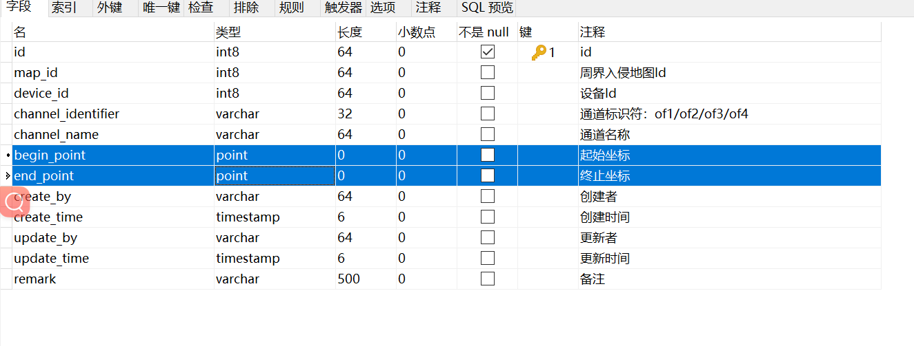
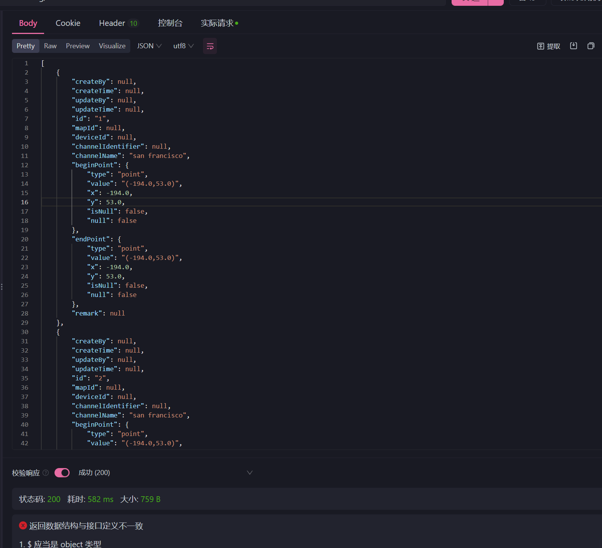
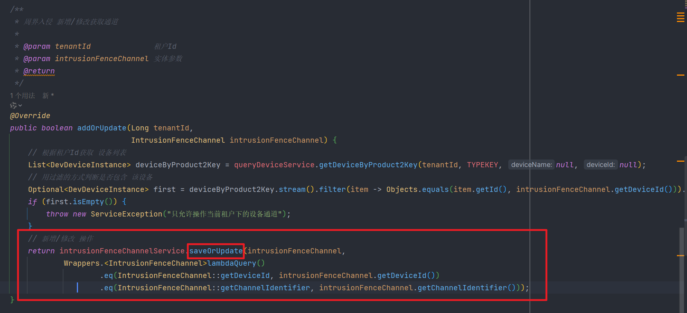
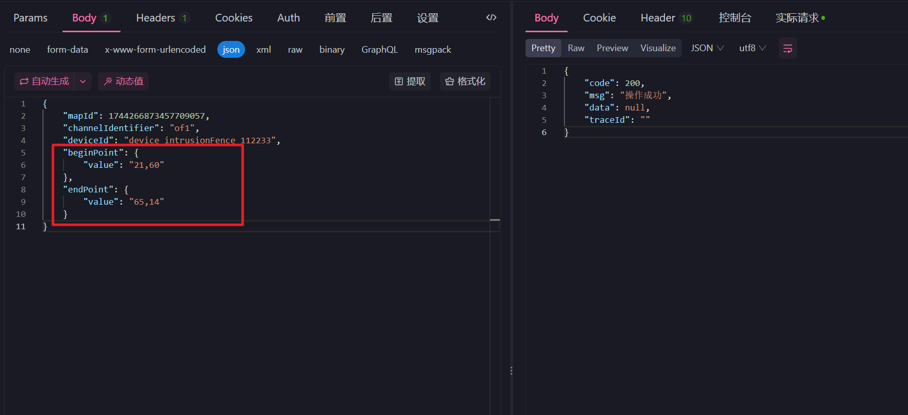

# 🔡Mybatis&MybatisPlus 操作 point 格式数据

<hr/>

[[toc]]

今天用到了**postgresql**中**point**数据类型 整合 Mybatis-plus 在此做个记录

## 1.数据库字段



## 2.依赖

```xml
<dependency>
    <groupId>com.baomidou</groupId>
    <artifactId>mybatis-plus-boot-starter</artifactId>
    <version>3.5.1</version>
</dependency>

<dependency>
    <groupId>org.mybatis.spring.boot</groupId>
    <artifactId>mybatis-spring-boot-starter</artifactId>
    <version>2.2.2</version>
</dependency>

```

## 3.实体类

```java
package link.anyin.dataLake.pojo;

import com.baomidou.mybatisplus.annotation.TableField;
import com.baomidou.mybatisplus.annotation.TableId;
import com.baomidou.mybatisplus.annotation.TableName;
import com.ruoyi.common.core.domain.BaseCommEntity;
import link.anyin.dataLake.typeHandler.PointTypeHandler;
import lombok.Data;
import org.postgresql.geometric.PGpoint;

import java.io.Serializable;

/**
 * 周界入侵通道关联关系
 *
 * @TableName intrusion_fence_channel
 */
@TableName(value = "intrusion_fence_channel", autoResultMap = true)
@Data
public class IntrusionFenceChannel extends BaseCommEntity implements Serializable {

    @TableField(exist = false)
    private static final long serialVersionUID = 1L;

    /**
     * id
     */
    @TableId
    private Long id;

    /**
     * 周界入侵地图Id
     */
    private Long mapId;

    /**
     * 设备Id
     */
    private Long deviceId;

    /**
     * 通道标识符：of1/of2/of3/of4
     */
    private String channelIdentifier;

    /**
     * 通道名称
     */
    private String channelName;

    /**
     * 起始坐标
     */
    @TableField(typeHandler = PointTypeHandler.class)
    private PGpoint beginPoint;

    /**
     * 终止坐标
     */
    @TableField(typeHandler = PointTypeHandler.class)
    private PGpoint endPoint;


    /**
     * 备注
     */
    private String remark;


}
```

这里就得注意到几个地方:

1. **类名上的注解：** @TableName(value = "intrusion_fence_channel", **autoResultMap = true**)
2. **字段上的注解：**@TableField(**typeHandler = PointTypeHandler.class**)
3. **字段类型：**PGpoint 这里采用的是 **pgsq 包下的 PGpoint 类来作为接收参数**

> PointTypeHandler 是自己定义的 typeHandler

## 4.类型处理器

```java
package link.anyin.dataLake.typeHandler;

import org.apache.ibatis.type.BaseTypeHandler;
import org.apache.ibatis.type.JdbcType;
import org.apache.ibatis.type.MappedTypes;
import org.postgresql.geometric.PGpoint;

import java.sql.CallableStatement;
import java.sql.PreparedStatement;
import java.sql.ResultSet;
import java.sql.SQLException;
import java.util.Map;

/**
 * @ClassName: [JsonbTypeHandlerMap]
 * @Description: TODO
 * @Author: [ZyKun]
 * @Date: [2023/12/7 11:24]
 */
@MappedTypes(Map.class)
public class PointTypeHandler extends BaseTypeHandler<PGpoint> {

    @Override
    public void setNonNullParameter(PreparedStatement preparedStatement, int i, PGpoint pGpoint, JdbcType jdbcType) throws SQLException {
        preparedStatement.setObject(i, pGpoint);
    }

    @Override
    public PGpoint getNullableResult(ResultSet resultSet, String s) throws SQLException {
        return resultSet.getObject(s, PGpoint.class);
    }

    @Override
    public PGpoint getNullableResult(ResultSet resultSet, int i) throws SQLException {
        return resultSet.getObject(i, PGpoint.class);
    }

    @Override
    public PGpoint getNullableResult(CallableStatement callableStatement, int i) throws SQLException {
        return callableStatement.getObject(i, PGpoint.class);
    }
}
```

## 5.xml 文件(mapper)

```xml
<?xml version="1.0" encoding="UTF-8"?>
<!DOCTYPE mapper
        PUBLIC "-//mybatis.org//DTD Mapper 3.0//EN"
        "http://mybatis.org/dtd/mybatis-3-mapper.dtd">
<mapper namespace="link.anyin.dataLake.mapper.IntrusionFenceChannelMapper">

    <resultMap id="BaseResultMap" type="link.anyin.dataLake.pojo.IntrusionFenceChannel">
        <id property="id" column="id" jdbcType="BIGINT"/>
        <result property="mapId" column="map_id" jdbcType="BIGINT"/>
        <result property="deviceId" column="device_id" jdbcType="BIGINT"/>
        <result property="channelIdentifier" column="channel_identifier" jdbcType="VARCHAR"/>
        <result property="channelName" column="channel_name" jdbcType="VARCHAR"/>
        <result property="beginPoint" column="begin_point"
                typeHandler="link.anyin.dataLake.typeHandler.PointTypeHandler"/>
        <result property="endPoint" column="end_point" typeHandler="link.anyin.dataLake.typeHandler.PointTypeHandler"/>
        <result property="createBy" column="create_by" jdbcType="VARCHAR"/>
        <result property="createTime" column="create_time" jdbcType="TIMESTAMP"/>
        <result property="updateBy" column="update_by" jdbcType="VARCHAR"/>
        <result property="updateTime" column="update_time" jdbcType="TIMESTAMP"/>
        <result property="remark" column="remark" jdbcType="VARCHAR"/>
    </resultMap>

    <sql id="Base_Column_List">
        id
        ,map_id,device_id,
        channel_identifier,channel_name,begin_point,
        end_point,create_by,create_time,
        update_by,update_time,remark
    </sql>
</mapper>
```

**注意：**`beginPoint`字段、`endPoint`字段的 `typeHandler`设置

## 6.测试：

```java
package link.anyin.dataLake.controller;

import com.baomidou.mybatisplus.core.toolkit.Wrappers;
import link.anyin.dataLake.mapper.IntrusionFenceChannelMapper;
import lombok.RequiredArgsConstructor;
import lombok.extern.slf4j.Slf4j;
import org.springframework.validation.annotation.Validated;
import org.springframework.web.bind.annotation.GetMapping;
import org.springframework.web.bind.annotation.RequestMapping;
import org.springframework.web.bind.annotation.RestController;

/**
 * 周界入侵模块 相关
 *
 * @ClassName: [IntrusionFenceController]
 * @Description: TODO
 * @Author: [ZyKun]
 * @Date: [2024/1/8 17:23]
 */

@Slf4j
@Validated
@RestController
@RequestMapping("/personnelPositioning")
@RequiredArgsConstructor
public class IntrusionFenceController {

    private final IntrusionFenceChannelMapper baseMapper;

    @GetMapping("/test")
    public Object intrusionFence() {
        return baseMapper.selectList(Wrappers.emptyWrapper());
    }
}

```

## 7.结果一览




## 8.insert / update

代码预览：



参数预览 【具体实体参数  上方实体类】：


