# 📂Ruoyi-Vue 集成 Minio

<hr/>

[[toc]]

## 前言

> 最近公司有需求，项目上不采用`若依`原版文件上传下载模块，用独立的文件服务器来替换，我这里采用的是 Minio，我集成后在此文做个记录。

## 1. 简单了解 Minion

Minio 是一款开源的[对象存储服务](https://so.csdn.net/so/search?q=对象存储服务&spm=1001.2101.3001.7020)器，它与云存储服务 Amazon S3 兼容，能够提供高性能、高可用性、分布式的文件存储服务。Minio 适合用于存储、备份、存档、大数据的分布式存储等场景。Minio 使用 Go 语言编写，具有轻量级、可扩展、易于部署的特点。并且可以通过 API 和命令行进行管理和访问。搭建 Minio 服务器的方法网上很多，这里就不作阐述，直接从整合开始。

官网：https://min.io/
中文版：http://www.minio.org.cn/ （注意：中文版本的有些资料更新没那么及时，建议看官网地址）
github 项目地址：https://github.com/minio/
下载地址：https://min.io/download

> 开源协议的对象存储服务,轻量,性能强

### 1.1 安装

这里我是演示 windows 版本下 minio 服务器的安装，以下是下载链接地址
https://dl.minio.io/server/minio/release/windows-amd64/minio.exe

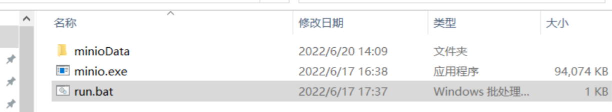

创建 run.bat 脚本，内容如下

```bash
# 设置用户名
set MINIO_ROOT_USER=admin
# 设置密码
set MINIO_ROOT_PASSWORD=admin123
minio.exe server --address :9000 --console-address :9001 D:\devtool\minioData
```

默认账号密码是`minioadmin`/`minioadmin `，编写 bat 脚本设置启动账号和密码，设置为`admin`/`admin123`

启动命令为 minio.exe server D:\devtool\minioData

默认参数分别为指定文件访问端口为 9000，指定服务控制台访问地址端口为 9001

启动 bat 脚本

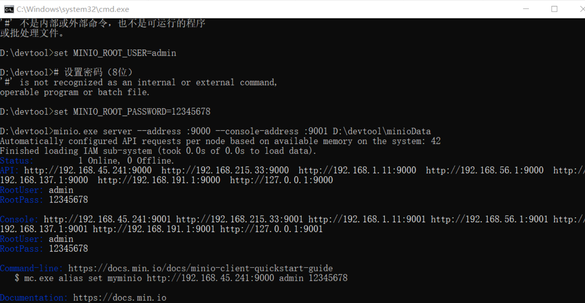

访问地址 127.0.0.1:9001 账号为`admin`/`admin123`

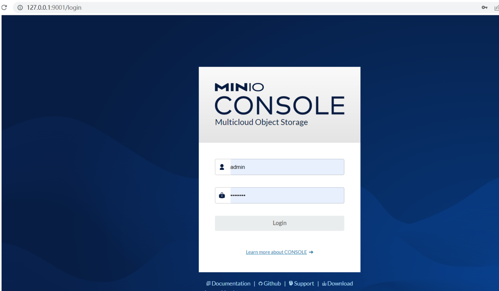


### 1.2 操作介绍

1.创建**bucket**


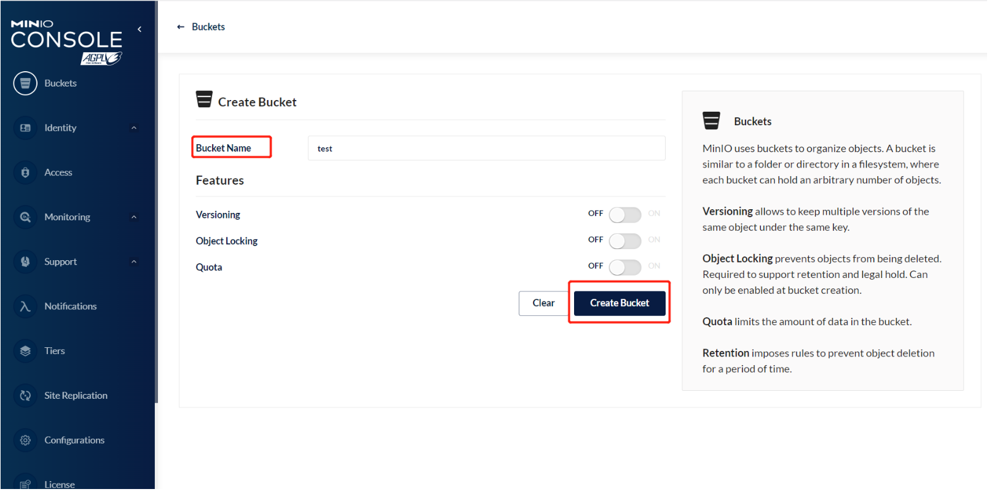

2.创建账号获取**access-key** 和**secret-key**

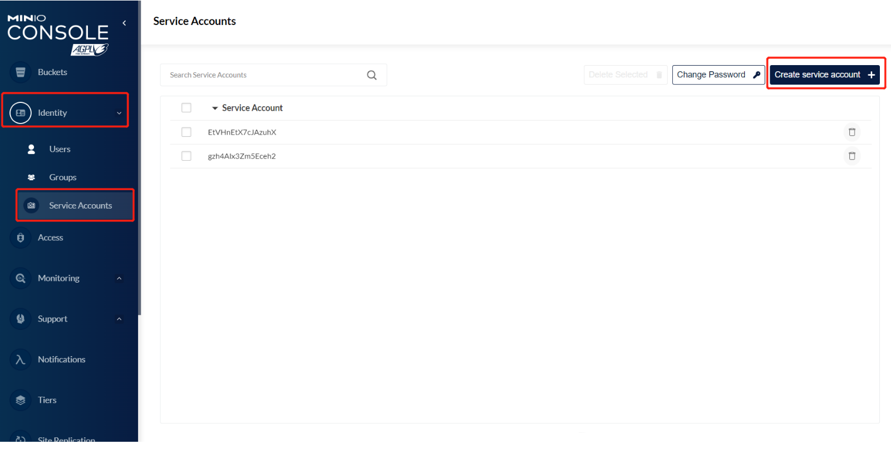

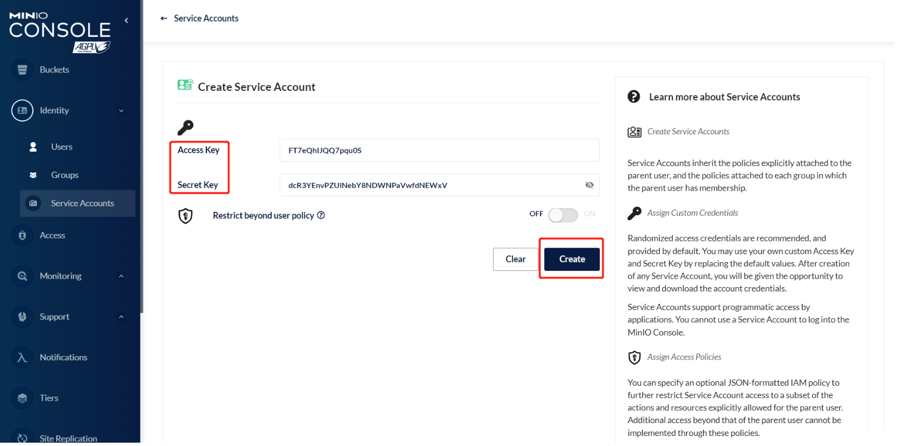

**记录下两个 key，在代码中使用**

3.图片上传

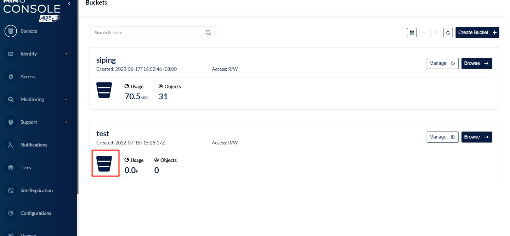

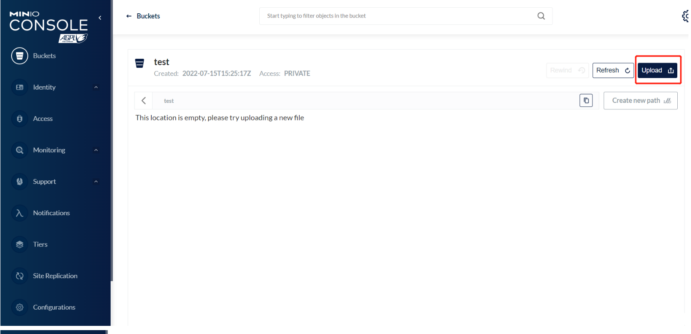

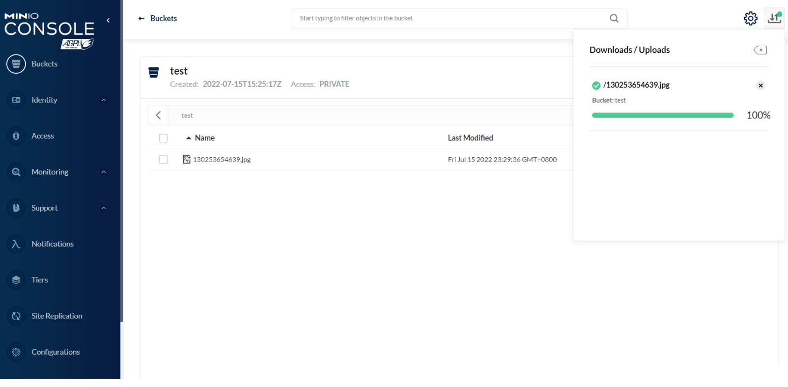

访问图片的地址为 127.0.0.1:9000/test/130253654639.jpg

**ip+端口+buckets+图片名称**

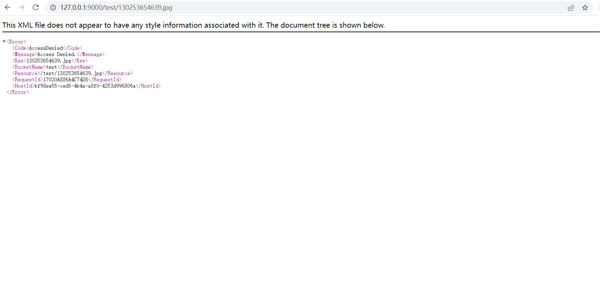

查不到？ 这是因为权限问题

调用地址时，返回没权限访问的提示，需要将 bucket 设置为 public 权限

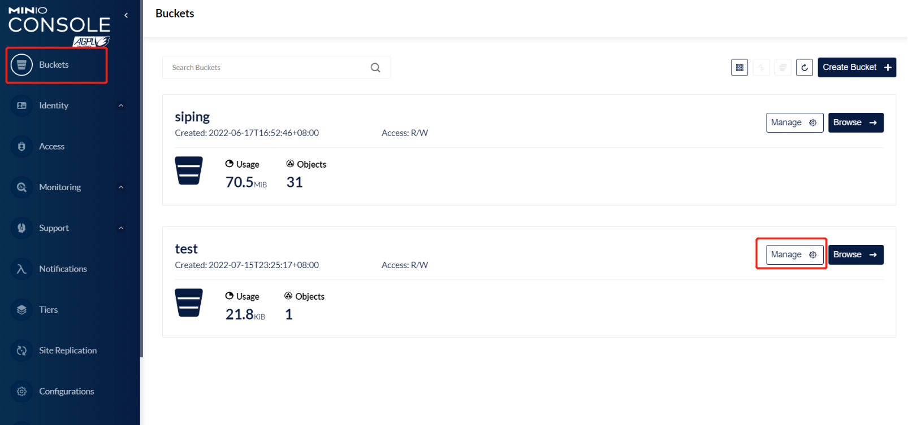

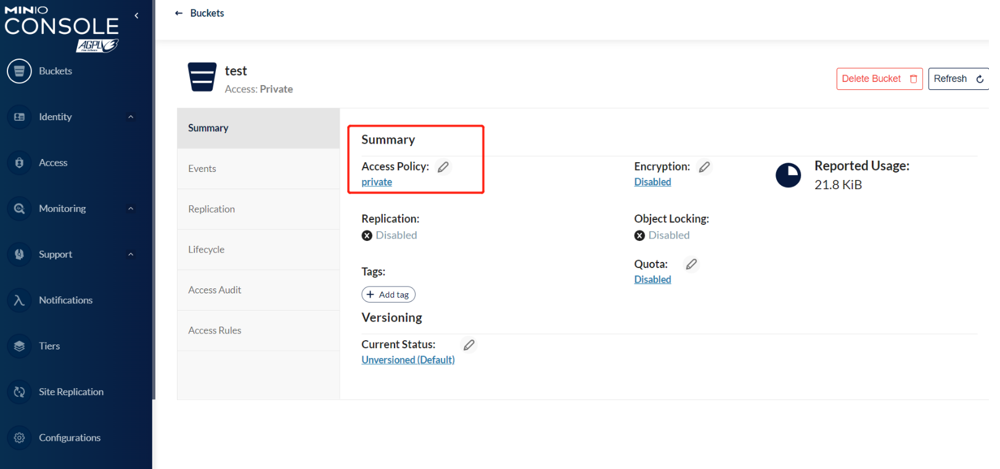

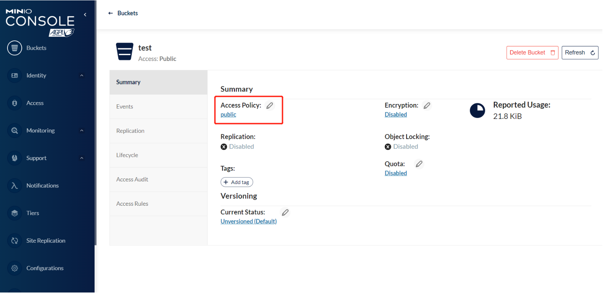

测试访问

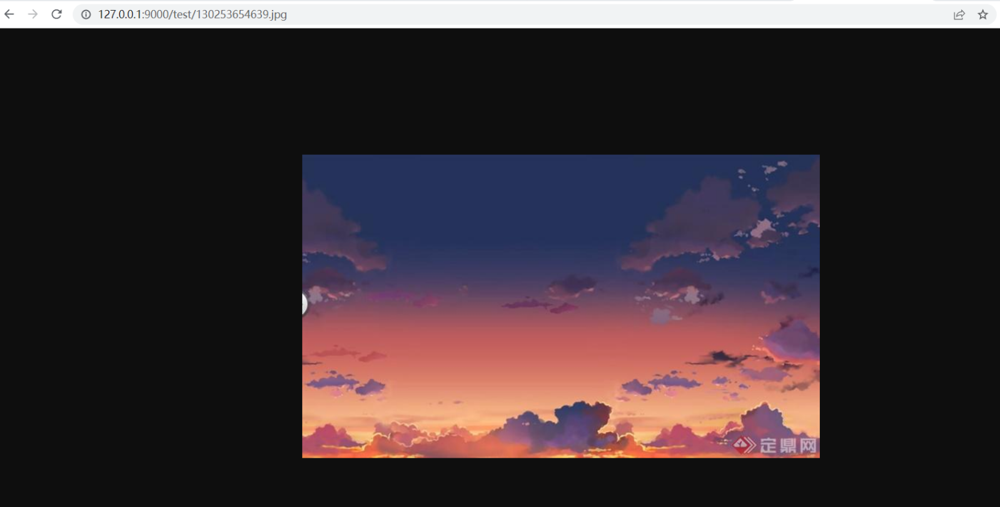

## 3. 代码方面

> 抄的时候注意一下，项目上改了一些东西如结果集，等等 无脑贴上去可能会造成编译异常。

### 3.1 在 ruoyi-common 模块 pom.xml 引入 Minio 的依赖

```xml
<dependency>
    <groupId>io.minio</groupId>
    <artifactId>minio</artifactId>
    <version>7.1.0</version>
</dependency>
```

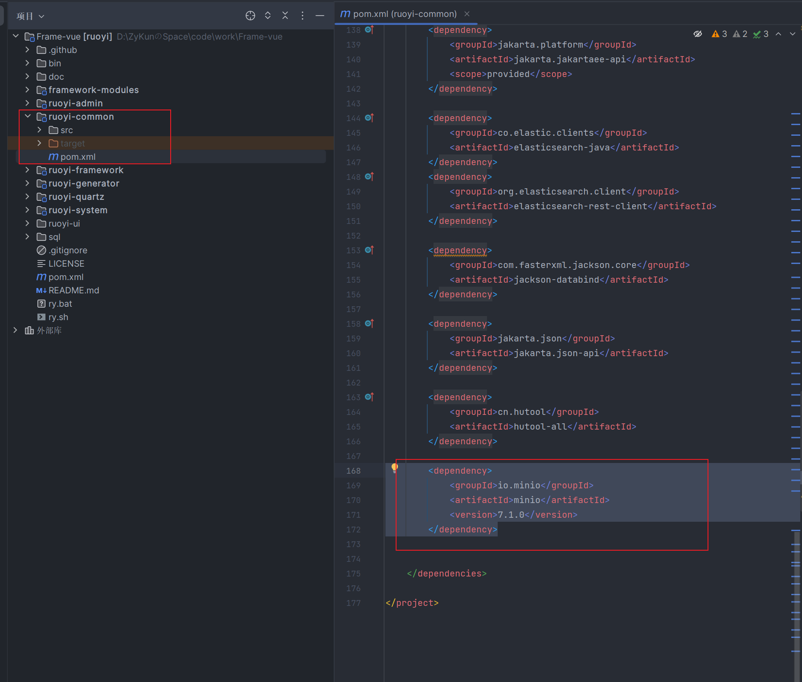

### 3.2 在 yml 里增加 Minio 的账号信息配置

```yaml
#Minio
minio:
  url: 服务器地址
  accessKey: 账号
  secretKey: 密码
  bucketName: 桶名字
```

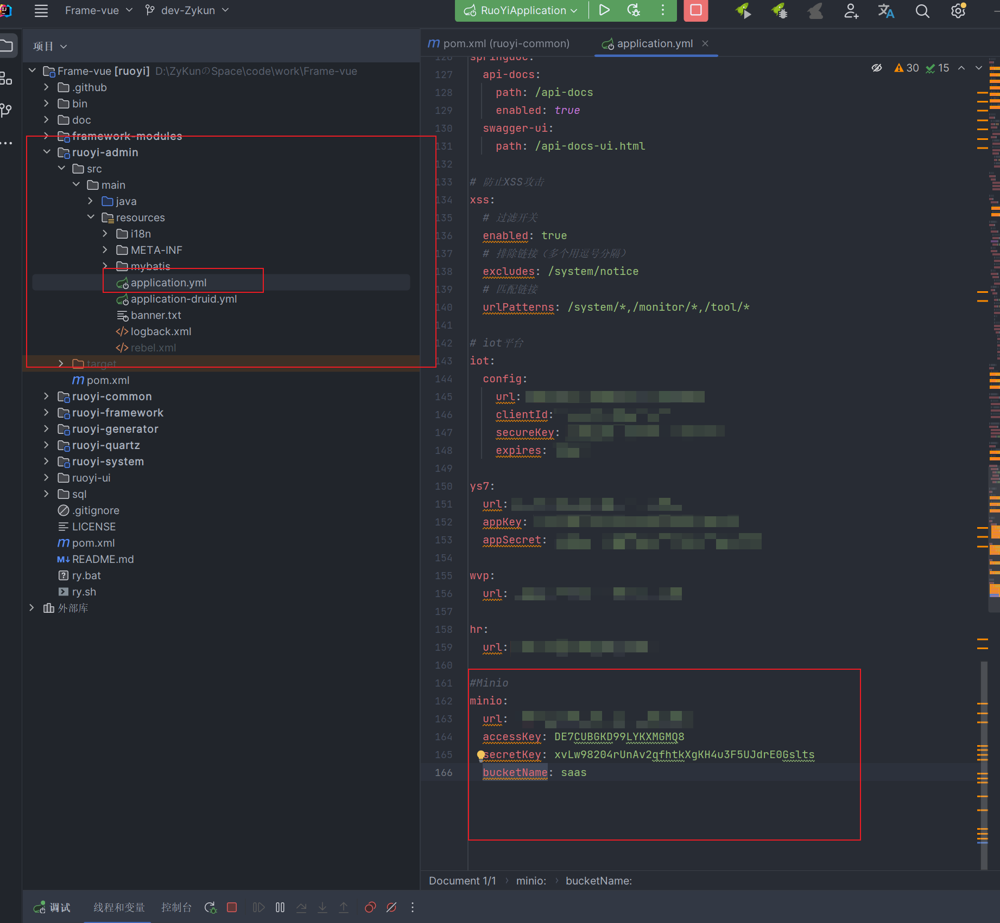

### 3.3 读取配置，初始化 Minio 客户端

```java
@Configuration
public class MinioConfig {
    @Value("${minio.accessKey}")
    private String accessKey;
    @Value("${minio.secretKey}")
    private String secretKey;
    @Value("${minio.url}")
    private String url;

    /**
     * 注入客户端
     */
    @Bean
    public MinioClient minioClient() {
        return MinioClient.builder()
                .credentials(accessKey, secretKey)
                .endpoint(url)
                .build();
    }
}
```

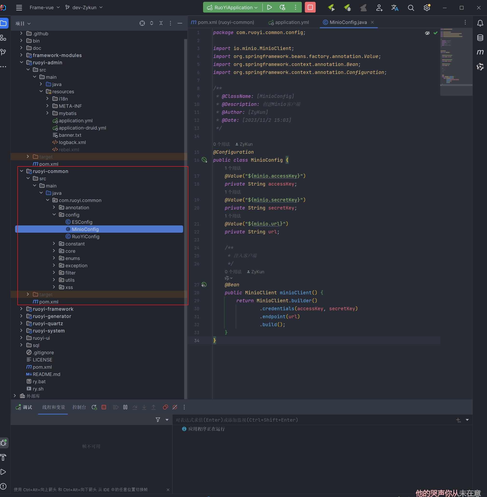

### 3.4 引入 Minio 工具类

```java
/**
 * @ClassName: [MinioTemplate]
 * @Description: TODO
 * @Author: [ZyKun]
 * @Date: [2023/11/2 15:08]
 */
@Data
@AllArgsConstructor
@NoArgsConstructor
@Component
public class MinioTemplate {
    @Value("${minio.bucketName}")
    public String bucketName;
    @Autowired
    private MinioClient minioClient;


    /**
     * 判断桶是否存在,如果存在返回true,如果不存在返回false
     *
     * @param bucketName
     * @return
     */
    @SneakyThrows
    public Boolean existBucket(String bucketName) {
        boolean exist = minioClient.bucketExists(BucketExistsArgs.builder().bucket(bucketName).build());
        if (!exist) {
            return false;
        }
        return true;

    }

    /**
     * 创建桶
     *
     * @param bucketName
     * @return
     */
    @SneakyThrows
    public void makeBucket(String bucketName) {
        minioClient.makeBucket(MakeBucketArgs.builder().bucket(bucketName).build());
    }

    /**
     * 上传对象
     *
     * @param objectName
     * @param file
     * @return
     * @throws Exception
     */
    @SneakyThrows
    public void putObject(String objectName, MultipartFile file) {

        //判断 桶是否存在
        boolean flag = existBucket(bucketName);

        if (flag) {
            PutObjectArgs args = PutObjectArgs.builder()
                    .bucket(bucketName)
                    .object(objectName)
                    .contentType(file.getContentType())
                    .stream(file.getInputStream(), file.getSize(), -1)
                    .build();
            minioClient.putObject(args);
        }
    }

    /**
     * 删除对象
     *
     * @param objectName
     * @return
     * @throws Exception
     */
    @SneakyThrows
    public boolean removeObject(String objectName) {
        boolean flag = existBucket(bucketName);
        if (flag) {
            RemoveObjectArgs args = RemoveObjectArgs.builder()
                    .bucket(bucketName)
                    .object(objectName)
                    .build();
            minioClient.removeObject(args);
            return true;
        }
        return false;
    }

    /**
     * 获取对象信息
     *
     * @param objectName
     * @return
     * @throws Exception
     */
    @SneakyThrows
    public ObjectStat getMessage(String objectName) {
        boolean flag = existBucket(bucketName);
        if (flag) {
            ObjectStat statObject = minioClient.statObject(StatObjectArgs.builder()
                    .bucket(bucketName)
                    .object(objectName)
                    .build());
            return statObject;
        }
        return null;
    }

    /**
     * 返回的文件路径,不会过期.
     *
     * @param objectName
     * @return
     */
    @SneakyThrows
    public String getObjectUrl(String objectName) {
        Boolean flag = existBucket(bucketName);
        String url = "";
        if (flag) {
            url = minioClient.getObjectUrl(bucketName, objectName);

        }
        return url;

    }

    /**
     * 下载
     *
     * @param filename
     * @param response
     */
    public void getObject(String filename, HttpServletResponse response) {
        InputStream in = null;
        OutputStream out = null;
        try {
            in = minioClient.getObject(GetObjectArgs.builder().bucket(bucketName).object(filename).build());
            int length = 0;
            byte[] buffer = new byte[1024];
            out = response.getOutputStream();
            response.reset();
            response.addHeader("Content-Disposition",
                    " attachment;filename=" + URLEncoder.encode(filename, "UTF-8"));
            response.setContentType("application/octet-stream");
            while ((length = in.read(buffer)) > 0) {
                out.write(buffer, 0, length);
            }
        } catch (Exception e) {
            e.printStackTrace();
        } finally {
            if (in != null) {
                try {
                    in.close();
                } catch (Exception e) {
                    throw new RuntimeException(e);
                }
            }
            if (out != null) {
                try {
                    out.close();
                } catch (IOException e) {
                    e.printStackTrace();
                }
            }
        }
    }


}
```

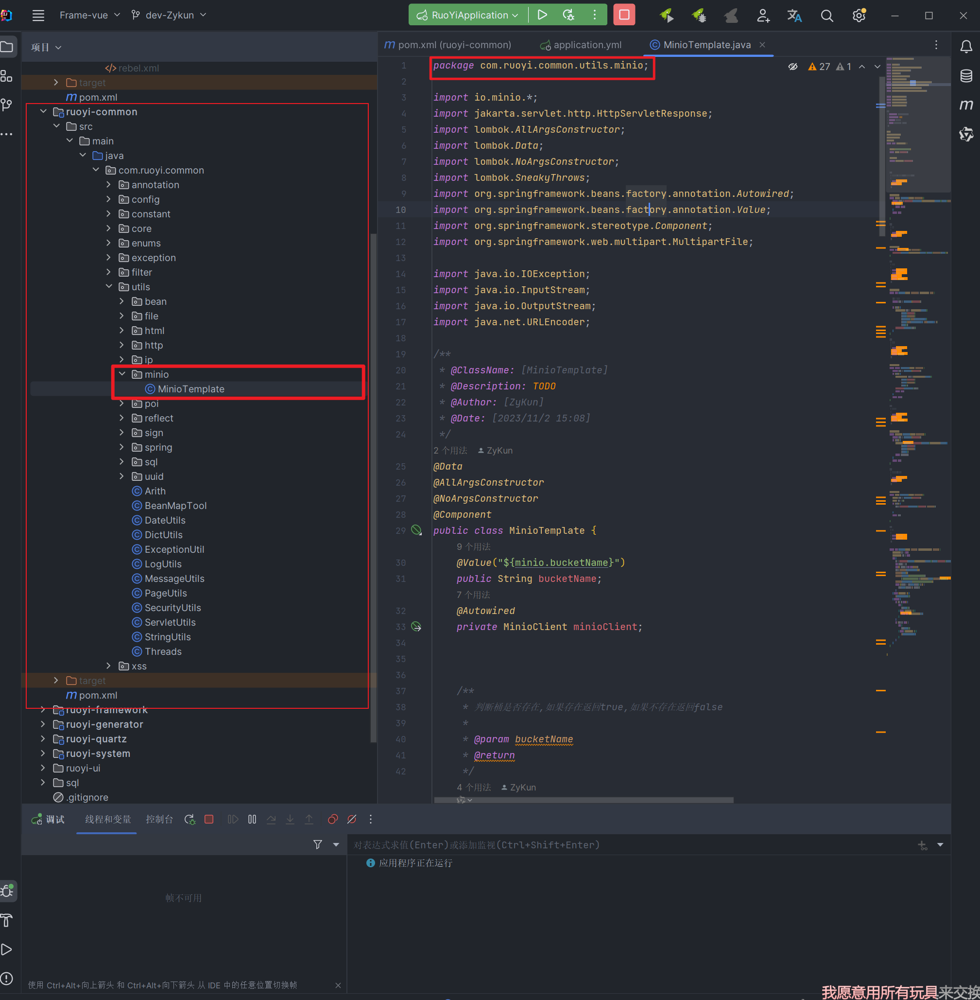

### 3.5 测试代码 ( )

```java
@PostMapping("/minio/upload")
public AjaxResult minioUploadFile(@RequestPart MultipartFile file) throws Exception {
try {
    System.out.println("文件正在上传");
    String fileName = file.getOriginalFilename();
    String uuid = UUID.randomUUID().toString();
    String imgType = fileName.substring(fileName.lastIndexOf("."));
    String finalFileName = "images/"+uuid + imgType;
    minioTemplate.putObject(finalFileName,file);
    String path = "/test/" + finalFileName;

    Map<String,String> result = new HashMap();
    result.put("path", path);

    return AjaxResult.success(result);
} catch (Exception e) {
    return AjaxResult.error(e.getMessage());
}
}
```

> **（下面配套接口代码 按需拷贝）数据库表字段方面，参考若依 plus sys_Oss 表**

### 3.6 接口

```java
package com.ruoyi.web.controller.system;

import cn.hutool.core.util.ObjectUtil;
import com.baomidou.mybatisplus.extension.plugins.pagination.Page;
import com.ruoyi.common.annotation.Log;
import com.ruoyi.common.core.domain.AjaxResult;
import com.ruoyi.common.core.domain.R;
import com.ruoyi.common.core.page.PageQuery;
import com.ruoyi.common.core.page.TableDataInfo;
import com.ruoyi.common.enums.BusinessType;
import com.ruoyi.common.exception.ServiceException;
import com.ruoyi.system.domain.SysOss;
import com.ruoyi.system.service.SysOssService;
import jakarta.servlet.http.HttpServletResponse;
import jakarta.validation.constraints.NotEmpty;
import jakarta.validation.constraints.NotNull;
import lombok.RequiredArgsConstructor;
import org.springframework.http.MediaType;
import org.springframework.validation.annotation.Validated;
import org.springframework.web.bind.annotation.*;
import org.springframework.web.multipart.MultipartFile;

import java.util.Arrays;
import java.util.List;
import java.util.Map;

/**
 * @ClassName: [SysOssController]
 * @Description: TODO
 * @Author: [ZyKun]
 * @Date: [2023/11/6 9:55]
 */
@Validated
@RestController
@RequestMapping("/system/oss")
@RequiredArgsConstructor
public class SysOssController {

    private final SysOssService baseService;


    /**
     * 查询OSS对象存储列表
     */
//    @PreAuthorize("@ss.hasPermi('system:oss:list')")
    @GetMapping("/list")
    public TableDataInfo<SysOss> list(SysOss sysOss, PageQuery pageQuery) {
        Page<SysOss> ossPage = baseService.selectOssList(sysOss, pageQuery);
        return AjaxResult.successList(ossPage);
    }

    /**
     * 查询OSS对象基于id串
     *
     * @param ossIds OSS对象ID串
     */
//    @PreAuthorize("@ss.hasPermi('system:oss:list')")
    @GetMapping("/listByIds/{ossIds}")
    public R<List<SysOss>> listByIds(@NotEmpty(message = "主键不能为空")
                                     @PathVariable Long[] ossIds) {
        List<SysOss> list = baseService.selectListByIds(Arrays.asList(ossIds));
        return R.ok(list);
    }


    /**
     * 上传OSS对象存储
     *
     * @param file 文件
     */
//    @PreAuthorize("@ss.hasPermi('system:oss:upload')")
    @Log(title = "OSS对象存储", businessType = BusinessType.INSERT)
    @PostMapping(value = "/upload", consumes = MediaType.MULTIPART_FORM_DATA_VALUE)
    public AjaxResult<Map<String, String>> upload(@RequestPart("file") MultipartFile file,
                                                  @NotNull(message = "租户标识不能为空") Long tenantId) {
        if (ObjectUtil.isNull(file)) {
            throw new ServiceException("上传文件不能为空");
        }
        return baseService.upload(file, tenantId);
    }

    /**
     * minio 文件服务器下载
     */
//    @PreAuthorize("@ss.hasPermi('system:oss:download')")
    @PostMapping("/minio/download")
    public AjaxResult minioDownloadFile(String filename, HttpServletResponse response) {
        baseService.download(filename, response);
        return AjaxResult.success();
    }

    /**
     * 删除OSS对象存储
     *
     * @param ossIds OSS对象ID串
     */
//    @PreAuthorize("@ss.hasPermi('system:oss:remove')")
    @Log(title = "OSS对象存储", businessType = BusinessType.DELETE)
    @DeleteMapping("/{ossIds}")
    public AjaxResult remove(@NotEmpty(message = "主键不能为空")
                             @PathVariable Long[] ossIds) {
        return AjaxResult.toAjax(baseService.deleteWithValidByIds(Arrays.asList(ossIds), true) ? 1 : 0);
    }


    /**
     * 删除OSS对象存储【ByUrl】
     *
     * @param oss OSS对象
     */
//    @PreAuthorize("@ss.hasPermi('system:oss:remove')")
    @Log(title = "OSS对象存储", businessType = BusinessType.DELETE)
    @DeleteMapping("/remove")
    public AjaxResult removeByUrl(@RequestBody SysOss oss) {
        return AjaxResult.toAjax(baseService.deleteWithValidByUrl(oss, true) ? 1 : 0);
    }

}

```

### 3.7 service

```java
package com.ruoyi.system.service;


import com.baomidou.mybatisplus.extension.plugins.pagination.Page;
import com.baomidou.mybatisplus.extension.service.IService;
import com.ruoyi.common.core.domain.AjaxResult;
import com.ruoyi.common.core.page.PageQuery;
import com.ruoyi.system.domain.SysOss;
import jakarta.servlet.http.HttpServletResponse;
import org.springframework.web.multipart.MultipartFile;

import java.util.Collection;
import java.util.List;

/**
 * @author Administrator
 * @description 针对表【sys_oss】的数据库操作Service
 * @createDate 2023-11-03 17:43:43
 */
public interface SysOssService extends IService<SysOss> {

    Page<SysOss> selectOssList(SysOss sysOss, PageQuery pageQuery);

    List<SysOss> selectListByIds(Collection<Long> ossIds);

    AjaxResult upload(MultipartFile file, Long tenantId);

    void download(String filename, HttpServletResponse response);

    boolean deleteWithValidByIds(List<Long> ids, boolean isValid);

    boolean deleteWithValidByUrl(SysOss oss, boolean isValid);
}

```

### 3.8 serviceImpl

```java
package com.ruoyi.system.service.impl;


import cn.hutool.core.date.DateTime;
import cn.hutool.core.date.DateUtil;
import cn.hutool.core.util.IdUtil;
import cn.hutool.core.util.ObjectUtil;
import cn.hutool.core.util.StrUtil;
import com.baomidou.mybatisplus.core.conditions.query.LambdaQueryWrapper;
import com.baomidou.mybatisplus.core.toolkit.Wrappers;
import com.baomidou.mybatisplus.extension.plugins.pagination.Page;
import com.baomidou.mybatisplus.extension.service.impl.ServiceImpl;
import com.ruoyi.common.core.domain.AjaxResult;
import com.ruoyi.common.core.page.PageQuery;
import com.ruoyi.common.exception.ServiceException;
import com.ruoyi.common.utils.SecurityUtils;
import com.ruoyi.common.utils.minio.MinioTemplate;
import com.ruoyi.system.domain.SysOss;
import com.ruoyi.system.mapper.SysOssMapper;
import com.ruoyi.system.service.SysOssService;
import jakarta.servlet.http.HttpServletResponse;
import lombok.RequiredArgsConstructor;
import lombok.extern.slf4j.Slf4j;
import org.springframework.beans.factory.annotation.Value;
import org.springframework.stereotype.Service;
import org.springframework.web.multipart.MultipartFile;

import java.util.*;

/**
 * @author Administrator
 * @description 针对表【sys_oss】的数据库操作Service实现
 * @createDate 2023-11-03 17:43:43
 */
@Service
@Slf4j
@RequiredArgsConstructor
public class SysOssServiceImpl extends ServiceImpl<SysOssMapper, SysOss> implements SysOssService {

    private final SysOssMapper baseMapper;
    private final MinioTemplate minioTemplate;

    @Value("${minio.url}")
    private String url;
    @Value("${minio.bucketName}")
    private String bucketName;

    /**
     * 查询OSS对象存储列表
     *
     * @param sysOss
     * @param pageQuery
     * @return
     */
    @Override
    public Page<SysOss> selectOssList(SysOss sysOss, PageQuery pageQuery) {
        if (Objects.isNull(sysOss.getTenantId())) throw new ServiceException("租户ID不能为空");

        LambdaQueryWrapper<SysOss> eq = Wrappers.<SysOss>lambdaQuery()
                // 租户ID
                .eq(SysOss::getTenantId, sysOss.getTenantId())
                // 后缀名
                .eq(StrUtil.isNotBlank(sysOss.getFileSuffix()), SysOss::getFileSuffix, sysOss.getFileSuffix())
                // 文件名
                .eq(StrUtil.isNotBlank(sysOss.getFileName()), SysOss::getFileName, sysOss.getFileName())
                // 文件原名
                .eq(StrUtil.isNotBlank(sysOss.getOriginalName()), SysOss::getOriginalName, sysOss.getOriginalName())
                .orderByDesc(SysOss::getCreateTime);
        return baseMapper.selectPage(pageQuery.build(), eq);
    }

    @Override
    public List<SysOss> selectListByIds(Collection<Long> ossIds) {
        List<SysOss> list = new ArrayList<>();
        for (Long id : ossIds) {
            SysOss vo = getById(id);
            if (ObjectUtil.isNotNull(vo)) {
                list.add(vo);
            }
        }
        return list;
    }

    /**
     * 文件上传
     *
     * @param file
     * @return
     */
    @Override
    public AjaxResult upload(MultipartFile file, Long tenantId) {
        try {
            // 前置校验
            preCheck(file);
            // 源文件名
            String fileName = file.getOriginalFilename();
            // UUID
            String uuid = IdUtil.simpleUUID();
            // 文件后缀
            String fileSuffix = fileName.substring(fileName.lastIndexOf("."));
            // 根据 文件后缀名 生成 文件名
            String folderName = generateFolderName(fileSuffix);
            // 文件地址
            String path = folderName + uuid + fileSuffix;
            // Url
            String url = minioTemplate.getObjectUrl(path);

            log.info("文件正在上传....");
            minioTemplate.putObject(path, file);

            SysOss sysOss = new SysOss();
            sysOss.setTenantId(tenantId);
            sysOss.setFileName(path);
            sysOss.setOriginalName(fileName);
            sysOss.setFileSuffix(fileSuffix);
            sysOss.setUrl(url);
            sysOss.setCreateBy(SecurityUtils.getUsername());
            // 保存文件信息？
            baseMapper.insert(sysOss);

            HashMap<String, String> resultMap = new HashMap<>();
            resultMap.put("path", path);
            resultMap.put("url", url);
            resultMap.put("fileName", fileName);
            resultMap.put("ossId", sysOss.getOssId().toString());

            return AjaxResult.success(resultMap);
        } catch (Exception e) {
            return AjaxResult.error(e.getMessage());
        }
    }

    /**
     * 文件下载
     *
     * @param filename
     * @param response
     */
    @Override
    public void download(String filename, HttpServletResponse response) {
        try {
            minioTemplate.getObject(filename, response);
        } catch (Exception e) {
            throw new ServiceException(e.getMessage());
        }
    }

    /**
     * 删除OSS对象存储
     *
     * @param ids
     * @param isValid
     * @return
     */
    @Override
    public boolean deleteWithValidByIds(List<Long> ids, boolean isValid) {
        if (isValid) {
            // TODO 做一些业务上的校验,判断是否需要校验
        }
        List<SysOss> list = baseMapper.selectBatchIds(ids);
        for (SysOss sysOss : list) {
            boolean b = minioTemplate.removeObject(sysOss.getFileName());
            if (!b) throw new ServiceException("文件服务器有误，删除失败");
        }
        return baseMapper.deleteBatchIds(ids) > 0;
    }

    /**
     * 删除OSS对象存储【ByUrl】
     *
     * @param oss
     * @param isValid
     * @return
     */
    @Override
    public boolean deleteWithValidByUrl(SysOss oss, boolean isValid) {
        if (isValid) {
            // TODO 做一些业务上的校验,判断是否需要校验
            if (StrUtil.isEmpty(oss.getUrl())) {
                throw new ServiceException("文件地址不允许为空");
            }
        }
        SysOss sysOss = baseMapper.selectOne(Wrappers.<SysOss>lambdaQuery()
                .eq(SysOss::getUrl, oss.getUrl()));
        // 容错处理 避免前端 展示报错信息
        if (Objects.isNull(sysOss)) {
            throw new ServiceException("未查询到该文件");
        }
        boolean b = minioTemplate.removeObject(sysOss.getFileName());
        if (!b) throw new ServiceException("文件服务器有误，删除失败");

        return baseMapper.deleteById(sysOss) > 0;
    }

    /**
     * 前置校验
     */
    private void preCheck(MultipartFile file) {
        // TODO 做一些前置校验
        // 校验是否符合文件格式
        String fileName = file.getOriginalFilename();
        String fileSuffix = fileName.substring(fileName.lastIndexOf("."));
        switch (fileSuffix) {
            case ".jpg", ".png", ".jpeg" -> {
                // 校验图片大小
                if (file.getSize() > 1024 * 1024 * 10) {
                    throw new ServiceException("图片大小超过10M");
                }
            }
            case ".doc", ".xls", ".ppt", ".txt", ".pdf " -> {
                // 校验文件大小 不超过20M
                if (file.getSize() > 1024 * 1024 * 20) {
                    throw new ServiceException("文件大小超过20M");
                }
            }
            default -> throw new ServiceException("不支持的文件格式");
        }
    }

    /**
     * 根据 文件后缀名 生成 文件名
     * <p>
     * 例： image/2023/11/06
     *
     * @param fileSuffix
     * @return
     */
    private String generateFolderName(String fileSuffix) {
        String fileBucket = getFileBucket(fileSuffix);
        DateTime now = DateTime.now();
        String data = DateUtil.format(now, "yyyy/MM/dd");
        return fileBucket + data + "/";
    }

    private static String getFileBucket(String fileSuffix) {
        return switch (fileSuffix) {
            case ".jpg", ".png", ".jpeg" -> "image/";
            case ".doc", ".xls", ".ppt", ".txt", ".pdf " -> "file/";
            default -> null;
        };
    }

}


```

> 其它需求自己写
