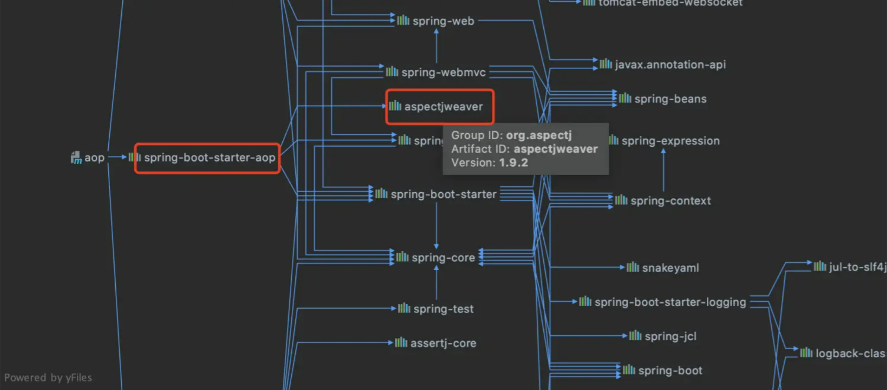
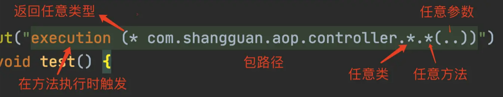
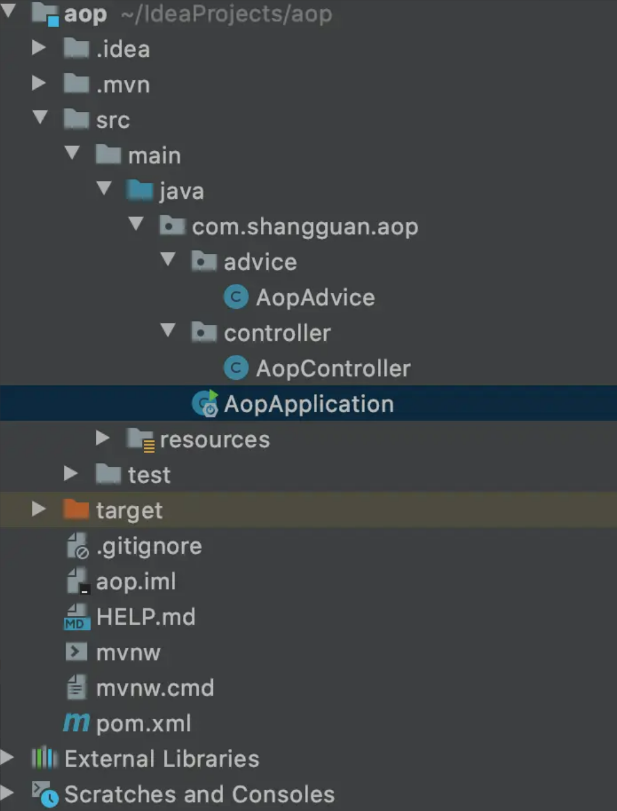
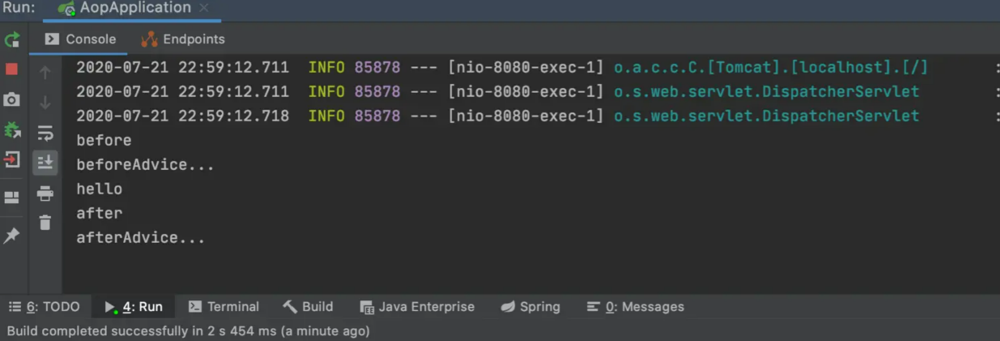

# 🧐 SpringBoot AOP 使用

<hr/>

[[toc]]

## 1. 引言

> 平时很少涉及到 SpringBoot AOP，但每次用到时都得费力地查阅官方文档，感觉挺麻烦的。为了加深印象，特地写了这篇博客 📃

## 2. 简介

**AOP** (Aspect Oriented Programming) 即 **面向切面编程**，听上去有点抽象和高大上，那么这玩意儿有啥用呢？和平时我们说的 **OOP** (面向女朋友编程) 有啥区别呢？

AOP：面向切面编程，相对于 OOP 面向对象编程 Spring 的 AOP 的存在目的是为了解耦。AOP 可以让一组类共享相同的行为。在 OOP 中只能继承和实现接口，且类继承只能单继承，阻碍更多行为添加到一组类上，AOP 弥补了 OOP 的不足。

还有就是为了清晰的逻辑，让业务逻辑关注业务本身，不用去关心其它的事情，比如事务（环绕通知+异常通知）。

Spring 的 AOP 是通过 JDK 的动态代理和 CGLIB 实现的。

## 3. AOP 的术语：

Aop 有一堆术语，非常难以理解，简单说一下

-  通知(有的地方叫增强)(Advice)

   需要完成的工作叫做通知，就是你写的业务逻辑中需要比如事务、日志等先定义好，然后需要的地方再去用

-  连接点(Join point)

   就是 spring 中允许使用通知的地方，基本上每个方法前后抛异常时都可以是连接点

-  切点(Poincut)

   其实就是筛选出的连接点，一个类中的所有方法都是连接点，但又不全需要，会筛选出某些作为连接点做为切点。如果说通知定义了切面的动作或者执行时机的话，切点则定义了执行的地点

-  切面(Aspect)

   其实就是通知和切点的结合，通知和切点共同定义了切面的全部内容，它是干什么的，什么时候在哪执行

-  引入(Introduction)

   在不改变一个现有类代码的情况下，为该类添加属性和方法,可以在无需修改现有类的前提下，让它们具有新的行为和状态。其实就是把切面（也就是新方法属性：通知定义的）用到目标类中去

-  目标(target)

   被通知的对象。也就是需要加入额外代码的对象，也就是真正的业务逻辑被组织织入切面。

-  织入(Weaving)

   把切面加入程序代码的过程。切面在指定的连接点被织入到目标对象中，在目标对象的生命周期里有多个点可以进行织入：

   -  编译期：切面在目标类编译时被织入，这种方式需要特殊的编译器
   -  类加载期：切面在目标类加载到 JVM 时被织入，这种方式需要特殊的类加载器，它可以在目标类被引入应用之前增强该目标类的字节码
   -  运行期：切面在应用运行的某个时刻被织入，一般情况下，在织入切面时，AOP 容器会为目标对象动态创建一个代理对象，Spring AOP 就是以这种方式织入切面的。

**云里雾里 不理解？ 没关系我们来看看例子**

```java
public class UserService{
    void save(){}
    List list(){}
    ....
}
```

在 UserService 中的 save()方法前需要开启事务，在方法后关闭事务，在抛异常时回滚事务。

那么，UserService 中的所有方法都是连接点(JoinPoint)，save()方法就是切点(Poincut)。需要在 save()方法前后执行的方法就是通知(Advice)，切点和通知合起来就是一个切面(Aspect)。save()方法就是目标(target)。把想要执行的代码动态的加入到 save()方法前后就是织入(Weaving)。

有的地方把通知称作增强是有道理的，在业务方法前后加上其它方法，其实就是对该方法的增强。

## 4. 常用 AOP 通知(增强)类型

-  before(前置通知)： 在方法开始执行前执行
-  after(后置通知)： 在方法执行后执行
-  afterReturning(返回后通知)： 在方法返回后执行
-  afterThrowing(异常通知)： 在抛出异常时执行
-  around(环绕通知)： 在方法执行前和执行后都会执行

## 5. 执行顺序

> around > before > around > after > afterReturning

## 6. 代码示例

### 6.1 引入依赖

Spring Boot 使用 AOP 需要添加 spring-boot-starter-aop 依赖，如下：

```xml
<dependency>
    <groupId>org.springframework.boot</groupId>
    <artifactId>spring-boot-starter-aop</artifactId>
</dependency>

```

不需要再添加 aspectjweaver 的依赖了，因为 spring-boot-starter-aop 包含了 aspectjweaver，并且版本是较新的版本，如果在添加老版本（如 1.5.4）启动会报错。



### 6.2 编写用于拦截的 bean

直接定义一个 controller，代码如下：

```java
@RestController
public class AopController {

    @RequestMapping("/hello")
    public String sayHello(){
        System.out.println("hello");
        return "hello";
    }
}

```

### 6.3 定义切面

Spring 采用**@Aspect**注解对 POJO 进行标注，该注解表明该类是一个切面类。切面是切点和通知的结合，那么定义一个切面就需要编写切点和通知。在代码中，只需要添加**@Aspect**注解即可。

### 6.4 定义切点

切点是通过**@Pointcut**注解和切点表达式定义的。

**@Pointcut**注解可以在一个切面内定义可重用的切点。

由于 Spring 切面粒度最小是达到方法级别，而 execution 表达式可以用于明确指定方法返回类型，类名，方法名和参数名等与方法相关的部件，并且实际中，大部分需要使用 AOP 的业务场景也只需要达到方法级别即可，因而 execution 表达式的使用是最为广泛的。如图是 execution 表达式的语法：

execution 表示在方法执行的时候触发。以“_”开头，表明方法返回值类型为任意类型。然后是全限定的类名和方法名，“_”可以表示任意类和任意方法。对于方法参数列表，可以使用“..”表示参数为任意类型。如果需要多个表达式，可以使用“&&”、“||”和“!”完成与、或、非的操作。



### 6.5 定义通知

代码中定义了三种类型的通知

使用@Before 注解标识前置通知，打印“beforeAdvice...”

使用@After 注解标识后置通知，打印“AfterAdvice...”

使用@Around 注解标识环绕通知，在方法执行前和执行之后分别打印“before”和“after”

这样一个切面就定义好了，代码如下：

```java
@Aspect
@Component
public class AopAdvice {

    @Pointcut("execution (* com.shangguan.aop.controller.*.*(..))")
    public void test() {

    }

    @Before("test()")
    public void beforeAdvice() {
        System.out.println("beforeAdvice...");
    }

    @After("test()")
    public void afterAdvice() {
        System.out.println("afterAdvice...");
    }

    @Around("test()")
    public void aroundAdvice(ProceedingJoinPoint proceedingJoinPoint) {
        System.out.println("before");
        try {
            proceedingJoinPoint.proceed();
        } catch (Throwable t) {
            t.printStackTrace();
        }
        System.out.println("after");
    }

}

```

### 6.6 启动测试

完成之后的代码结构如图所示：



运行 AopApplication，在浏览器访问 http://localhost:8080/hello，不出意外，控制台输出如图所示：



## 7. 常见问题：

### 7.1. 解释切面类代码

这段代码是一个基于切面编程（AOP）的示例，使用了 Spring 的 AOP 模块。

1. `@Aspect` 注解标识该类为一个切面类，它定义了横切关注点（cross-cutting concerns）。
2. `@Component` 注解将该类声明为 Spring 管理的组件，使得 Spring 能够自动扫描并将其实例化。
3. `@Pointcut` 注解定义了切入点，即在哪些方法上应用切面逻辑。在这个示例中，切入点 `test()` 定义了所有 `com.shangguan.aop.controller` 包下的方法。
4. `@Before`、`@After` 和 `@Around` 注解分别标识了前置通知、后置通知和环绕通知，它们分别在切入点方法执行前、执行后以及执行前后都执行一些逻辑。在示例中，这些通知方法输出了一些简单的日志信息。
5. `proceedingJoinPoint.proceed()` 是在环绕通知中调用的方法，它实际上是执行目标方法的代码。

综上所述，这段代码实现了一个简单的 AOP 切面，用于在指定包下的方法执行前、执行后和执行前后输出日志信息。

### 7.2 切面类中的 test() 是干嘛的 为什么方法体是空的？

这段代码定义了一个切入点，用于指定在哪些方法上应用切面逻辑。`@Pointcut` 注解用于声明切入点，其参数指定了切入点表达式，这里使用的表达式是 `"execution (* com.shangguan.aop.controller.*.*(..))"`，它表示匹配 `com.shangguan.aop.controller` 包下的所有方法。

方法体是空的是因为在这里只是定义了切入点，而不需要具体的方法体逻辑。`test()` 方法本身并不会被调用，它只是作为切入点的标识符，供其他通知方法引用。这样做的目的是为了提高代码的可读性和可维护性，将切入点的定义与实际的通知逻辑分离开来，使得代码更加清晰。

### 7.3 前置通知 中的"test"有含义

在这里，`@Before("test()")` 是一个前置通知，它告诉 Spring 框架在目标方法执行之前执行指定的逻辑。`"test()"` 是指定的切入点表达式，即要在哪些方法执行之前应用前置通知。在这个示例中，`"test()"` 是之前定义的切入点，表示在 `com.shangguan.aop.controller` 包下的所有方法执行之前都会执行该前置通知。

因此，当任何一个符合条件的方法执行之前，都会先执行 `beforeAdvice()` 方法中定义的逻辑，比如输出一段日志信息 `"beforeAdvice..."`。这样做可以在方法执行前执行一些预处理逻辑，如权限验证、参数校验、日志记录等。

### 7.4 那么对于这个切面我可以定义 很多个切点 也可以定义很多个@Before 是吗？

是的，您可以在一个切面类中定义多个切入点和多个通知（比如 `@Before`、`@After`、`@Around` 等）。这样做有助于将不同的业务逻辑分开，提高代码的可读性和可维护性。

以下是一个示例，演示了在一个切面类中定义了多个切入点和多个前置通知：

```java
@Aspect
@Component
public class MyAspect {

    @Pointcut("execution(* com.example.service.*.*(..))")
    public void serviceMethods() {
    }

    @Pointcut("execution(* com.example.repository.*.*(..))")
    public void repositoryMethods() {
    }

    @Before("serviceMethods()")
    public void beforeServiceMethod() {
        System.out.println("Before executing service method...");
    }

    @Before("repositoryMethods()")
    public void beforeRepositoryMethod() {
        System.out.println("Before executing repository method...");
    }
}

```

在这个示例中，`MyAspect` 类定义了两个切入点 `serviceMethods()` 和 `repositoryMethods()`，分别匹配了 `com.example.service` 包和 `com.example.repository` 包中的所有方法。然后，它定义了两个前置通知 `beforeServiceMethod()` 和 `beforeRepositoryMethod()`，分别在匹配的方法执行前执行一些逻辑。

这样，您可以根据需要定义多个切入点和多个通知，以满足不同的业务场景需求。
