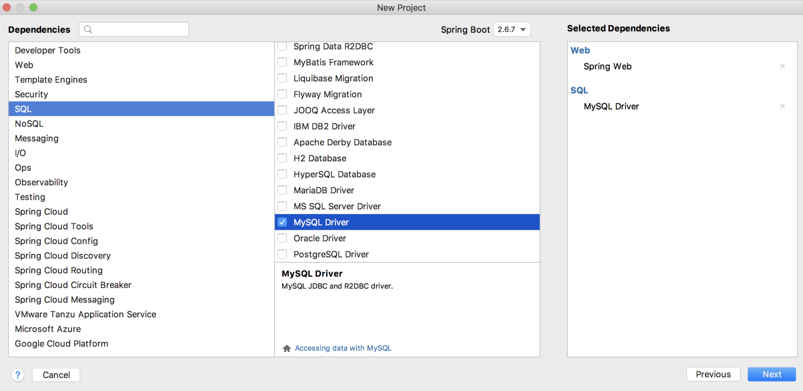
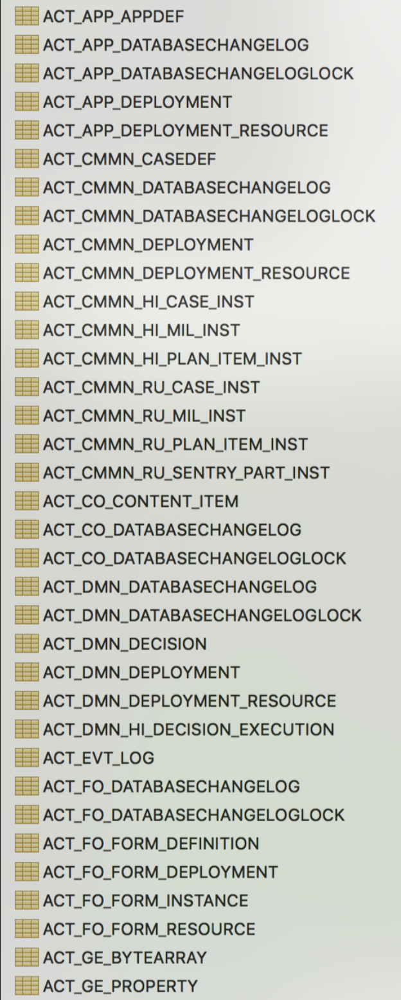
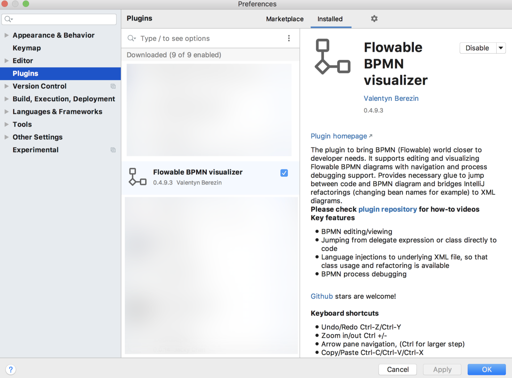
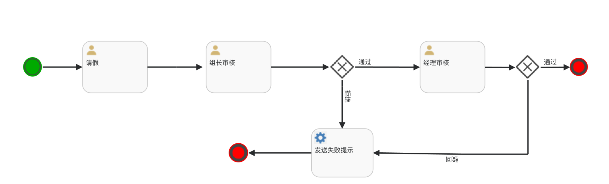
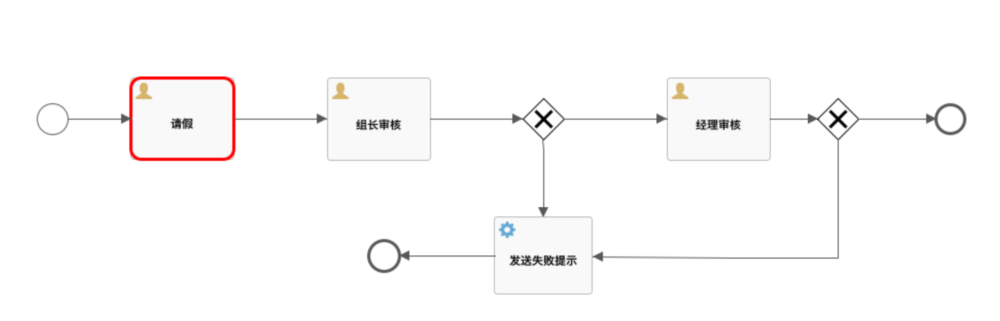
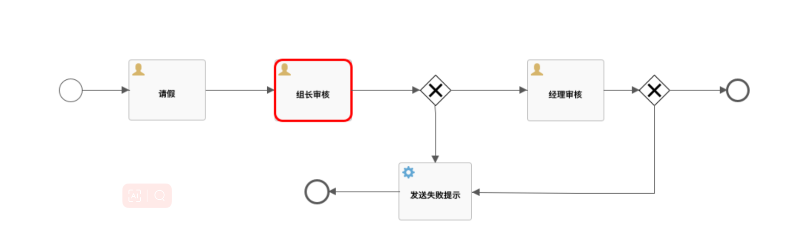
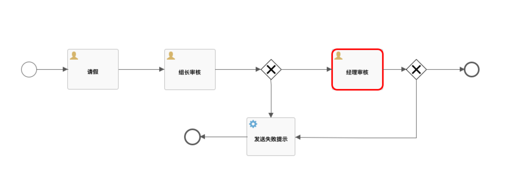

# 🎐Spring Boot 整合流程引擎 Flowable

<hr/>

[[toc]]

[流程引擎](https://so.csdn.net/so/search?q=流程引擎&spm=1001.2101.3001.7020)，也算是一个比较常见的工具了，我们在日常的很多开发中都会用到，当然用的最多的就是 OA 系统了，但是在一些非 OA 系统中，我们也会涉及到，比如一个 CRM 中，可能会有合同管理的需求，合同的审批，也是需要流程引擎的。

所以今天我们来简单聊聊流程引擎，顺便写一个简单的例子，小伙伴们一起来感受下流程引擎到底是个啥。

## 1. 流程引擎介绍

Flowable 是一个使用 Java 编写的轻量级业务流程引擎。Flowable 流程引擎可用于部署 BPMN2.0 流程定义（用于定义流程的行业 XML 标准），创建这些流程定义的流程实例，进行查询，访问运行中或历史的流程实例与相关数据，等等。

Java 领域另一个流程引擎是 Activiti，不过我觉得这两个东西，只要你会使用其中一个，另一个就不在话下。

咱就不废话了，上代码吧。

## 2. 创建项目

首先我们创建一个 Spring Boot 项目，引入 Web、和 MySQL 驱动两个依赖，如下图：



项目创建成功之后，我们引入 flowable 依赖，如下：

```xml
<dependency>
    <groupId>org.flowable</groupId>
    <artifactId>flowable-spring-boot-starter</artifactId>
    <version>6.7.2</version>
</dependency>

```

这个会帮我们做一些自动化配置，默认情况下，所以位于 resources/processes 的流程都会被自动部署（Flowable 官网上有介绍）。

接下来我们在 application.yaml 中配置一下数据库连接信息，当项目启动的时候会自动初始化数据库，将来流程引擎运行时候的数据会被自动持久化到数据库中。

```yaml
spring:
  datasource:
    username: root
    password: 123
    url: jdbc:mysql://localhost:3306/flowable-learn?serverTimezone=UTC&nullCatalogMeansCurrent=true
```

好啦，配置完成后，我们就可以启动项目了。项目启动成功之后，flowable 数据库中就会自动创建如下这些表，将来流程引擎相关的数据都会自动保存到这些表中。

默认的表比较多，截图只是其中一部分。



## 3. 画流程图

画流程图算是比较有挑战的一个步骤了，也是流程引擎使用的关键。官方提供了一些流程引擎绘制工具，这个我就不说了，感兴趣的小伙伴可以自行去体验；IDEA 也自带了一个流程可视化的工具，但是特别难用，我这里也就 不说了。

这里说一下我常用的 IDEA 插件 **Flowable BPMN visualizer**，如下图：



插件怎么安装就不用我教了吧，小伙伴们自行安装即可。

装好插件之后，我们在 resources 目录下新建 processes 目录，这个目录下的流程文件将来会被自动部署**（Flowable 官网上有介绍）**。

接下来我们在 processes 目录下，新建一个 BPMN 文件（插件装好了就有这个选项了），如下：


我们来画个请假的流程，就叫做 ask_for_leave.bpmn20.xml，注意最后面的 `.bpmn20.xml` 是固定后缀。

文件创建出来之后，右键单击，选择 View BPMN(Flowable) Diagram,就打开了可视化页面了，我们就可以来绘制自己的流程图了。

我的请假流程画出来是这样：



员工发起一个请假流程，首先是组长审核，组长审核通过了，就进入到经理审核，经理审核通过了，这个流程就结束了，如果组长审核未通过或者经理审核未通过，则流程给员工发送一个请假失败的通知，流程结束。

我们来看下这个流程对应的 XML 文件，一些流程细节会在 XML 文件中体现出来，如下：

```xml
<process id="ask_for_leave" name="ask_for_leave" isExecutable="true">
    <userTask id="leaveTask" name="请假" flowable:assignee="#{leaveTask}"/>
    <userTask id="zuzhangTask" name="组长审核" flowable:assignee="#{zuzhangTask}"/>
    <userTask id="managerTask" name="经理审核" flowable:assignee="#{managerTask}"/>
    <exclusiveGateway id="managerJudgeTask"/>
    <exclusiveGateway id="zuzhangJudeTask"/>
    <endEvent id="endLeave" name="结束"/>
    <startEvent id="startLeave" name="开始"/>
    <sequenceFlow id="flowStart" sourceRef="startLeave" targetRef="leaveTask"/>
    <sequenceFlow id="modeFlow" sourceRef="leaveTask" targetRef="zuzhangTask"/>
    <sequenceFlow id="zuzhang_go" sourceRef="zuzhangJudeTask" targetRef="managerTask" name="通过">
        <conditionExpression xsi:type="tFormalExpression"><![CDATA[${checkResult=='通过'}]]></conditionExpression>
    </sequenceFlow>
    <sequenceFlow id="zuzhang_reject" sourceRef="zuzhangJudeTask" targetRef="sendMail" name="拒绝">
        <conditionExpression xsi:type="tFormalExpression"><![CDATA[${checkResult=='拒绝'}]]></conditionExpression>
    </sequenceFlow>
    <sequenceFlow id="jugdeFlow" sourceRef="managerTask" targetRef="managerJudgeTask"/>
    <sequenceFlow id="flowEnd" name="通过" sourceRef="managerJudgeTask" targetRef="endLeave">
        <conditionExpression xsi:type="tFormalExpression"><![CDATA[${checkResult=='通过'}]]></conditionExpression>
    </sequenceFlow>
    <sequenceFlow id="rejectFlow" name="拒绝" sourceRef="managerJudgeTask" targetRef="sendMail">
        <conditionExpression xsi:type="tFormalExpression"><![CDATA[${checkResult=='拒绝'}]]></conditionExpression>
    </sequenceFlow>
    <serviceTask id="sendMail" flowable:exclusive="true" name="发送失败提示" isForCompensation="true" flowable:class="org.javaboy.flowable.AskForLeaveFail"/>
    <sequenceFlow id="endFlow" sourceRef="sendMail" targetRef="askForLeaveFail"/>
    <endEvent id="askForLeaveFail" name="请假失败"/>
    <sequenceFlow id="zuzhangTask_zuzhangJudeTask" sourceRef="zuzhangTask" targetRef="zuzhangJudeTask"/>
</process>

```

结合 XML 文件我来和大家解释一下这里涉及到的 Flowable 中的组件，我们来看下：

- `<process>` ： 表示一个完整的工作流程。
- `<startEvent>` ： 工作流中起点位置，也就是图中的绿色按钮。
- `<endEvent>` ： 工作流中结束位置，也就是图中的红色按钮。
- `<userTask>` ： 代表一个任务审核节点（组长、经理等角色），这个节点上有一个 `flowable:assignee` 属性，这表示这个节点该由谁来处理，将来在 Java 代码中调用的时候，我们需要指定对应的处理人的 ID 或者其他唯一标记。
- `<serviceTask>`：这是服务任务，在具体的实现中，这个任务可以做任何事情。
- `<exclusiveGateway>` ： 逻辑判断节点，相当于流程图中的菱形框。
- `<sequenceFlow>` ：链接各个节点的线条，sourceRef 属性表示线的起始节点，targetRef 属性表示线指向的节点，我们图中的线条都属于这种。

流程图这块松哥和大家稍微说一下，咋一看这个图挺复杂很难画，但是实际上只要你认认真真去捋一捋这里边的各个属性，基本上很快就明白到底是怎么一回事，我也相信各位小伙伴都有这样的悟性。

## 4. 开发接口

接下来我们写几个接口，来体验一把流程引擎。

在正式体验之前，我们先来熟悉几个类，这几个类我们一会写代码会用到。

### 4.1 Java 类梳理

- ProcessDefinition

这个最好理解，就是流程的定义，也就相当于规范，每个 ProcessDefinition 都会有一个 id。

- ProcessInstance

这个就是流程的一个实例。简单来说，ProcessDefinition 相当于是类，而 ProcessInstance 则相当于是根据类 new 出来的对象。

- Activity

Activity 是流程标准规范 BPMN2.0 里面的规范，流程中的每一个步骤都是一个 Activity。

- Execution

Execution 的含义是流程的执行线路，通过 Execution 可以获得当前 ProcessInstance 当前执行到哪个 Activity 了。

- Task

Task 就是当前要做的工作。

实际上这里涉及到的东西比较多，不过我们今天先整一个简单的例子，所以上面这些知识点暂时够用了。

### 4.2 查看流程图

在正式开始之前，我们先准备一个接口，用来查看流程图的实时执行情况，这样方便我们查看流程到底执行到哪一步了。

具体的代码如下：

```java
@RestController
public class HelloController {

    @Autowired
    RuntimeService runtimeService;

    @Autowired
    TaskService taskService;

    @Autowired
    RepositoryService repositoryService;

    @Autowired
    ProcessEngine processEngine;

    @GetMapping("/pic")
    public void showPic(HttpServletResponse resp, String processId) throws Exception {
        ProcessInstance pi = runtimeService.createProcessInstanceQuery().processInstanceId(processId).singleResult();
        if (pi == null) {
            return;
        }
        List<Execution> executions = runtimeService
            .createExecutionQuery()
            .processInstanceId(processId)
            .list();

        List<String> activityIds = new ArrayList<>();
        List<String> flows = new ArrayList<>();
        for (Execution exe : executions) {
            List<String> ids = runtimeService.getActiveActivityIds(exe.getId());
            activityIds.addAll(ids);
        }

        /**
         * 生成流程图
         */
        BpmnModel bpmnModel = repositoryService.getBpmnModel(pi.getProcessDefinitionId());
        ProcessEngineConfiguration engconf = processEngine.getProcessEngineConfiguration();
        ProcessDiagramGenerator diagramGenerator = engconf.getProcessDiagramGenerator();
        InputStream in = diagramGenerator.generateDiagram(bpmnModel, "png", activityIds, flows, engconf.getActivityFontName(), engconf.getLabelFontName(), engconf.getAnnotationFontName(), engconf.getClassLoader(), 1.0, false);
        OutputStream out = null;
        byte[] buf = new byte[1024];
        int legth = 0;
        try {
            out = resp.getOutputStream();
            while ((legth = in.read(buf)) != -1) {
                out.write(buf, 0, legth);
            }
        } finally {
            if (in != null) {
                in.close();
            }
            if (out != null) {
                out.close();
            }
        }
    }
}

```

这就一个工具，没啥好说的，一会大家看完后面的代码，再回过头来看这个接口，很多地方就都懂了。

### 4.3 开启一个流程

为了方便，接下来的代码我们都在单元测试中完成。

首先我们来开启一个流程，代码如下：

```java
String staffId = "1000";
/**
 * 开启一个流程
 */
@Test
void askForLeave() {
    HashMap<String, Object> map = new HashMap<>();
    map.put("leaveTask", staffId);
    ProcessInstance processInstance = runtimeService.startProcessInstanceByKey("ask_for_leave", map);
    runtimeService.setVariable(processInstance.getId(), "name", "javaboy");
    runtimeService.setVariable(processInstance.getId(), "reason", "休息一下");
    runtimeService.setVariable(processInstance.getId(), "days", 10);
    logger.info("创建请假流程 processId：{}", processInstance.getId());
}

```

首先由员工发起一个请假流程，map 中存放的 leaveTask 是我们在 XML 流程文件中提前定义好的，提前定义好当前这个任务创建之后，该由谁来处理，这里我们是假设由工号为 1000 的员工来发起这样一个请假流程。同时，我们还设置了一些额外信息。ask_for_leave 是我们在 XML 文件中定义的一个 process 的名称。

好啦，现在我们执行这个单元测试方法，执行完成后，控制台会打印出当前这个流程的 id，我们拿着这个 id 去访问 4.2 小节的接口，结果如下：



可以看到，请假用红色的框框起来了，说明当前流程走到了这一步。

### 4.4 将请求提交给组长

接下来，我们就需要将这个请假流程向后推进一步，将请假事务提交给组长，代码如下：

```java
String zuzhangId = "90";
/**
 * 提交给组长审批
 */
@Test
void submitToZuzhang() {
    //员工查找到自己的任务，然后提交给组长审批
    List<Task> list = taskService.createTaskQuery().taskAssignee(staffId).orderByTaskId().desc().list();
    for (Task task : list) {
        logger.info("任务 ID：{}；任务处理人：{}；任务是否挂起：{}", task.getId(), task.getAssignee(), task.isSuspended());
        Map<String, Object> map = new HashMap<>();
        //提交给组长的时候，需要指定组长的 id
        map.put("zuzhangTask", zuzhangId);
        taskService.complete(task.getId(), map);
    }
}

```

首先我们利用 staffId 查找到当前员工的 id，进而找到当前员工需要执行的任务，遍历这个任务，调用 taskService.complete 方法将任务提交给组长，注意在 map 中指定组长的 id。

提交完成后，我们再去看流程图片，如下：



可以看到，流程图走到组长审批了。

### 4.5 组长审批

组长现在有两种选择，同意或者拒绝，同意的代码如下：

```java
/**
 * 组长审批-批准
 */
@Test
void zuZhangApprove() {
    List<Task> list = taskService.createTaskQuery().taskAssignee(zuzhangId).orderByTaskId().desc().list();
    for (Task task : list) {
        logger.info("组长 {} 在审批 {} 任务", task.getAssignee(), task.getId());
        Map<String, Object> map = new HashMap<>();
        //组长审批的时候，如果是同意，需要指定经理的 id
        map.put("managerTask", managerId);
        map.put("checkResult", "通过");
        taskService.complete(task.getId(), map);
    }
}

```

通过组长的 id 查询组长的任务，同意的话，需要指定经理，也就是这个流程下一步该由谁来处理。

拒绝的代码如下：

```java
/**
 * 组长审批-拒绝
 */
@Test
void zuZhangReject() {
    List<Task> list = taskService.createTaskQuery().taskAssignee(zuzhangId).orderByTaskId().desc().list();
    for (Task task : list) {
        logger.info("组长 {} 在审批 {} 任务", task.getAssignee(), task.getId());
        Map<String, Object> map = new HashMap<>();
        //组长审批的时候，如果是拒绝，就不需要指定经理的 id
        map.put("checkResult", "拒绝");
        taskService.complete(task.getId(), map);
    }
}

```

拒绝的话，就没那么多事了，直接设置 checkResult 为拒绝即可。

假设这里执行了同意，那么流程图如下：



### 4.6 经理审批

经理审批和组长审批差不多，只不过经理这里是最后一步了，不需要再指定下一位处理人了，同意的代码如下：

```java
/**
 * 经理审批自己的任务-批准
 */
@Test
void managerApprove() {
    List<Task> list = taskService.createTaskQuery().taskAssignee(managerId).orderByTaskId().desc().list();
    for (Task task : list) {
        logger.info("经理 {} 在审批 {} 任务", task.getAssignee(), task.getId());
        Map<String, Object> map = new HashMap<>();
        map.put("checkResult", "通过");
        taskService.complete(task.getId(), map);
    }
}

```

拒绝代码如下：

```java
/**
 * 经理审批自己的任务-拒绝
 */
@Test
void managerReject() {
    List<Task> list = taskService.createTaskQuery().taskAssignee(managerId).orderByTaskId().desc().list();
    for (Task task : list) {
        logger.info("经理 {} 在审批 {} 任务", task.getAssignee(), task.getId());
        Map<String, Object> map = new HashMap<>();
        map.put("checkResult", "拒绝");
        taskService.complete(task.getId(), map);
    }
}

```

### 4.7 拒绝流程

如果组长拒绝了或者经理拒绝了，我们也有相应的处理方案，首先在 XML 流程文件定义时，如下：

```xml
<serviceTask id="sendMail" flowable:exclusive="true" name="发送失败提示" isForCompensation="true" flowable:class="org.javaboy.flowable.AskForLeaveFail"/>

```

如果请假被拒绝，会进入到这个 serviceTask，serviceTask 对应的处理类是 org.javaboy.flowable.AskForLeaveFail，该类的代码如下：

```java
public class AskForLeaveFail implements JavaDelegate {
    @Override
    public void execute(DelegateExecution execution) {
        System.out.println("请假失败。。。");
    }
}

```

也就是请假失败会进入到这个方法中，现在我们就可以在这个方法中该干嘛干嘛了。

## 5. 小结

好啦，一个简单的请假流程，希望能带小伙伴们入门 flowable。
