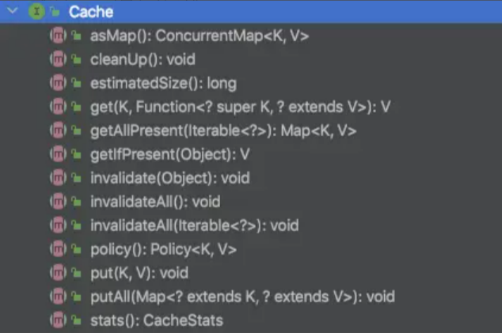
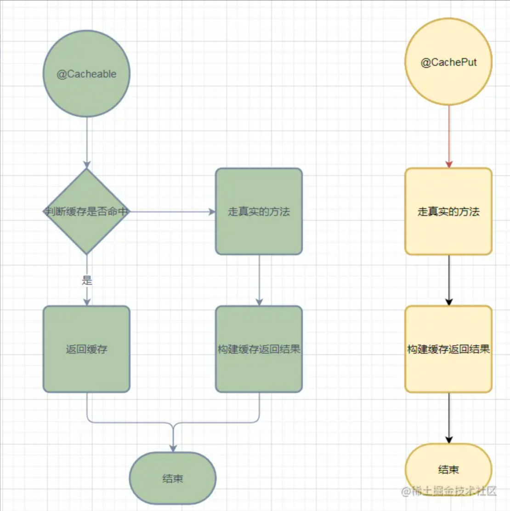

# ☀️SpringBoot 集成 Caffeine

<hr/>

[[toc]]

## 引言

前面我们有学习`Caffeine` **本地缓存性能之王 Caffeine**，并且也提到`SpringBoot`默认使用的本地缓存也是`Caffeine`啦，今天我们来看看`Caffeine`如何与`SpringBoot`集成的。

## 集成 caffeine

`caffeine`与`SpringBoot`集成有两种方式：

-  一种是我们直接引入 `Caffeine` 依赖，然后使用 `Caffeine` 方法实现缓存。相当于使用原生 api
-  引入 `Caffeine` 和 `Spring Cache` 依赖，使用 `SpringCache` 注解方法实现缓存。SpringCache 帮我们封装了 Caffeine pom 文件引入

```xml
<dependency>
    <groupId>org.springframework.boot</groupId>
    <artifactId>spring-boot-starter-cache</artifactId>
</dependency>
<dependency>
    <groupId>com.github.ben-manes.caffeine</groupId>
    <artifactId>caffeine</artifactId>
    <version>2.6.0</version>
</dependency>
```

### 第一种方式

首先配置一个`Cache`，通过构造者模式构建一个`Cache`对象，然后后续关于缓存的增删查都是基于这个`cache`对象。

```java
@Configuration
public class CacheConfig {
    @Bean
    public Cache<String, Object> caffeineCache() {
        return Caffeine.newBuilder()
                // 设置最后一次写入或访问后经过固定时间过期
                .expireAfterWrite(60, TimeUnit.SECONDS)
                // 初始的缓存空间大小
                .initialCapacity(100)
                // 缓存的最大条数
                .maximumSize(1000)
                .build();
    }
```

第一种方式我们就一一不介绍了，基本上就是使用`caffeineCache`来根据你自己的业务来操作以下方法



这种方式使用的话是对代码有侵入性的。

### 第二种方式

-  需要在 SpingBoot 启动类标上`EnableCaching`注解，这个玩意跟很多框架都一样，比如我们肴集成`dubbo`也需要标上`@EnableDubbole`注解等。

```java
@SpringBootApplication
@EnableCaching
public class DemoApplication {
    public static void main(String[] args) {
        SpringApplication.run(DemoApplication.class, args);
    }
```

-  在`application.yml`配置我们的使用的缓存类型、过期时间、缓存策略等。

```yaml
spring:
   profiles:
      active: dev
   cache:
      type: CAFFEINE
      caffeine:
         spec: maximumSize=500,expireAfterAccess=600s
```

如果我们不习惯使用这种方式的配置，当然我们也可以使用`JavaConfig`的配置方式来代替配置文件。

```java
@Configuration
public class CacheConfig {
        @Bean
        public CacheManager cacheManager() {
            CaffeineCacheManager cacheManager = new CaffeineCacheManager();
            cacheManager.setCaffeine(Caffeine.newBuilder()
                    // 设置最后一次写入或访问后经过固定时间过期
                    .expireAfterAccess(600, TimeUnit.SECONDS)
                    // 初始的缓存空间大小
                    .initialCapacity(100)
                    // 缓存的最大条数
                    .maximumSize(500));
            return cacheManager;
        }
```

接下来就是代码中如何来使用这个缓存了

```java

    @Override
    @CachePut(value = "user", key = "#userDTO.id")
    public UserDTO save(UserDTO userDTO) {
        userRepository.save(userDTO);
        return userDTO;
    }

    @Override
    @CacheEvict(value = "user", key = "#id")//2
    public void remove(Long id) {
        logger.info("删除了id、key为" + id + "的数据缓存");
    }

    @Override
    @Cacheable(value = "user",key = "#id")
    public UserDTO getUserById(Long id) {
        return userRepository.findOne(id);
    }
```

上述代码中我们可以看到有几个注解`@CachePut、@CacheEvict、@Cacheable` 我们只需要在方法上标上这几个注解，我们就能够使用缓存了，我们分别来介绍下这几个注解。

### @Cacheable

`@Cacheable`它是既可以标注在类上也可以标注在方法上，当它标记在类上的时候它表述这个类上面的所有方法都会支持缓存，同样的 当它作用在法上面时候它表示这个方法是支持缓存的。比如上面我们代码中的`getUserById`这个方法第一次缓存里面没有数据，我们会去查询`DB`，但是第二次来查询的时候就不会走`DB`查询了，而是直接从缓存里面拿到结果就返回了。

#### value 属性

-  `@Cacheable`的`value`属性是必须指定的，其表示当前方法的返回值是会被缓存在哪个`Cache`上的，对应`Cache`的名称。

#### key

-  `@Cacheable`的`key` 有两种方式一种是我们自己显示的去指定我们的`key`，还有一种默认的生成策略，默认的生成策略是`SimpleKeyGenerator`这个类，这个生成`key`的方式也比较简单我们可以看下它的源码：

```java
public static Object generateKey(Object... params) {
        // 如果方法没有参数 key就是一个 new SimpleKey()
		if (params.length == 0) {
			return SimpleKey.EMPTY;
		}
		// 如果方法只有一个参数 key就是当前参数
		if (params.length == 1) {
			Object param = params[0];
			if (param != null && !param.getClass().isArray()) {
				return param;
			}
		}
		// 如果key是多个参数，key就是new SimpleKey ，不过这个SimpleKey对象的hashCode 和Equals方法是根据方法传入的参数重写的。
		return new SimpleKey(params);
	}
```

上述代码还是非常好理解的分为三种情况：

-  方法没有参数，那就 new 使用一个全局空的`SimpleKey`对象来作为`key`。
-  方法就一个参数，就使用当前参数来作为`key`
-  方法参数大于`1`个，就`new`一个`SimpleKey`对象来作为`key`，`new` 这个`SimpleKey`的时候用传入的参数重写了`SimpleKey`的`hashCode`和`equals`方法， 至于为啥需要重写的原因话，就跟`Map`用自定义对象来作为`key`的时候必须要重写`hashCode`和`equals`方法原理是一样的，因为`caffein`也是借助了`ConcurrentHashMap`来实现，

#### 小结

上述代码我们可以发现默认生成`key`只跟我们传入的参数有关系，如果我们有一个类里面如果存在多个没有参数的方法，然后我们使用了默认的缓存生成策略的话，就会造成缓存丢失。 或者缓存相互覆盖，或者还有可能会发生`ClassCastException` 因为都是使用同一个`key`。比如下面这代码就会发生异常(`ClassCastException`)

```java
  @Cacheable(value = "user")
    public UserDTO getUser() {
        UserDTO userDTO = new UserDTO();
        userDTO.setUserName("Java金融");
        return userDTO;
    }
    @Cacheable(value = "user")
    public UserDTO2 getUser1() {
        UserDTO2 userDTO2 = new UserDTO2();
        userDTO2.setUserName2("javajr.cn");
        return userDTO2;
    }
```

所以一般不怎么推荐使用默认的缓存生成`key`的策略。如果非要用的话我们最好自己重写一下，带上方法名字等。类似于如下代码：

```java
@Component
public class MyKeyGenerator extends SimpleKeyGenerator {

    @Override
    public Object generate(Object target, Method method, Object... params) {
        Object generate = super.generate(target, method, params);
        String format = MessageFormat.format("{0}{1}{2}", method.toGenericString(), generate);
        return format;
    }
```

#### 自定义 key

我们可以通过`Spring`的 EL 表达式来指定我们的`key`。这里的 EL 表达式可以使用方法参数及它们对应的属性。 使用方法参数时我们可以直接使用“`#参数名`”或者“`#p参数index`”这也是我们比较推荐的做法：

```java
 @Cacheable(value="user", key="#id")
    public UserDTO getUserById(Long id) {
        UserDTO userDTO = new UserDTO();
        userDTO.setUserName("java金融");
        return userDTO;
    }
    @Cacheable(value="user", key="#p0")
    public UserDTO getUserById1(Long id) {
        return null;
    }
    @Cacheable(value="user", key="#userDTO.id")
    public UserDTO getUserById2(UserDTO userDTO) {
        return null;
    }
    @Cacheable(value="user", key="#p0.id")
    public UserDTO getUserById3(UserDTO userDTO) {
        return null;
    }
```

### @CachePut

`@CachePut`指定的属性是和`@Cacheable`一样的，但是它们两个是有区别的，`@CachePut`标注的方法不会先去查询缓存是否有值，而是每次都会先去执行该方法，然后把结果返回，并且结果也会缓存起来。



为什么是这样的一个流程我们可以去看看它的源码关键代码就是这一行，

```java
Cache.ValueWrapper cacheHit = findCachedItem(contexts.get(CacheableOperation.class));
```

当我们使用方法上有`@Cacheable`注解的时候再`contexts`里面会把`CacheableOperation`加入进去，只有 contexts.get(CacheableOperation.class)取到的内容不为空的话，才会去从缓存里面取内容，否则的话`cacheHit`会直接返回`null`。至于 contexts 什么时候加入 CacheableOperation 的话我们看下`SpringCacheAnnotationParser#parseCacheAnnotations`这个方法就会明白的。具体的源码就不展示了，感兴趣的可以自己去翻。

### @CacheEvict

把缓存中数据删除，用法跟前面两个注解差不多有 value 和 key 属性，需要注意一点的是它多了一个属性`beforeInvocation`

-  `beforeInvocation` 这个属性需要注意下它的默认值是 false，false 代表的意思是再执调用方法之前不删除缓存，只有方法执行成功之后才会去删除缓存。设置为`true`的话调用方法之前会去删除一下缓存，方法执行成功之后还会去调用删除缓存这样就是双删了。如果方法执行异常的话就不会去删除缓存。
-  `allEntrie` 是否清空所有缓存内容，默认值为 `false`，如果指定为 `true`，则方法调用后将立即清空所有缓存

### @Caching

这是一个组合注解集成了上面三个注解，有三个属性：`cacheable、put和evict`，分别用于来指定`@Cacheable`、`@CachePut`和`@CacheEvict`。

#### 小结

第二种方式是侵入式的，它的实现原理也比较简单就是通过切面的方法拦截器来实现，拦截所有的方法，它的核心代码如下：看起来就跟我们的业务代码差不了多少，感兴趣的也可以去瞅一瞅。

```java
if (contexts.isSynchronized()) {
			CacheOperationContext context = contexts.get(CacheableOperation.class).iterator().next();
			if (isConditionPassing(context, CacheOperationExpressionEvaluator.NO_RESULT)) {
				Object key = generateKey(context, CacheOperationExpressionEvaluator.NO_RESULT);
				Cache cache = context.getCaches().iterator().next();
				try {
					return wrapCacheValue(method, cache.get(key, () -> unwrapReturnValue(invokeOperation(invoker))));
				}
				catch (Cache.ValueRetrievalException ex) {
					// The invoker wraps any Throwable in a ThrowableWrapper instance so we
					// can just make sure that one bubbles up the stack.
					throw (CacheOperationInvoker.ThrowableWrapper) ex.getCause();
				}
			}
			else {
				// No caching required, only call the underlying method
				return invokeOperation(invoker);
			}
		}


		// Process any early evictions
		// beforeInvocation 属性是否为true，如果是true就删除缓存
		processCacheEvicts(contexts.get(CacheEvictOperation.class), true,
				CacheOperationExpressionEvaluator.NO_RESULT);

		// Check if we have a cached item matching the conditions
		Cache.ValueWrapper cacheHit = findCachedItem(contexts.get(CacheableOperation.class));

		// Collect puts from any @Cacheable miss, if no cached item is found
		List<CachePutRequest> cachePutRequests = new LinkedList<>();
		if (cacheHit == null) {
			collectPutRequests(contexts.get(CacheableOperation.class),
					CacheOperationExpressionEvaluator.NO_RESULT, cachePutRequests);
		}

		Object cacheValue;
		Object returnValue;

		if (cacheHit != null && !hasCachePut(contexts)) {
			// If there are no put requests, just use the cache hit
			cacheValue = cacheHit.get();
			returnValue = wrapCacheValue(method, cacheValue);
		}
		else {
			// Invoke the method if we don't have a cache hit
			returnValue = invokeOperation(invoker);
			cacheValue = unwrapReturnValue(returnValue);
		}

		// Collect any explicit @CachePuts
		collectPutRequests(contexts.get(CachePutOperation.class), cacheValue, cachePutRequests);

		// Process any collected put requests, either from @CachePut or a @Cacheable miss
		for (CachePutRequest cachePutRequest : cachePutRequests) {
			cachePutRequest.apply(cacheValue);
		}

		// Process any late evictions
		processCacheEvicts(contexts.get(CacheEvictOperation.class), false, cacheValue);

		return returnValue;
	}
```
