# Spring Security OAuth2.0 认证授权

<hr/>

[[toc]]

## 1.基本概念

### 1.1.什么是认证

​ 进入移动互联网时代，大家每天都在刷手机，常用的软件有微信、支付宝、头条等，下边拿微信来举例子说明认证 相关的基本概念，在初次使用微信前需要注册成为微信用户，然后输入账号和密码即可登录微信，输入账号和密码 登录微信的过程就是认证。

> 系统为什么要认证？

​ 认证是为了保护系统的隐私数据与资源，用户的身份合法方可访问该系统的资源。

**认证 ：**用户认证就是判断一个用户的身份是否合法的过程，用户去访问系统资源时系统要求验证用户的身份信 息，身份合法方可继续访问，不合法则拒绝访问。常见的用户身份认证方式有：用户名密码登录，二维码登录，手 机短信登录，指纹认证等方式。

### 1.2 什么是会话

​ 用户认证通过后，为了避免用户的每次操作都进行认证可将用户的信息保证在会话中。会话就是系统为了保持当前 用户的登录状态所提供的机制，常见的有基于 session 方式、基于 token 方式等。

> 基于 session 的认证方式如下图：

​ 它的交互流程是，用户认证成功后，在服务端生成用户相关的数据保存在 session(当前会话)中，发给客户端的 sesssion_id 存放到 cookie 中，这样用户客户端请求时带上 session_id 就可以验证服务器端是否存在 session 数 据，以此完成用户的合法校验，当用户退出系统或 session 过期销毁时,客户端的 session_id 也就无效了。

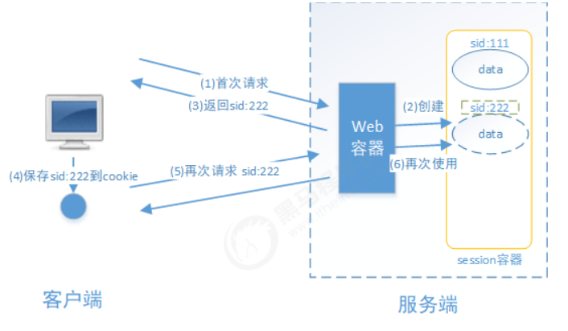

> 基于 token 方式如下图：

​ 它的交互流程是，用户认证成功后，服务端生成一个 token 发给客户端，客户端可以放到 cookie 或 localStorage 等存储中，每次请求时带上 token，服务端收到 token 通过验证后即可确认用户身份。

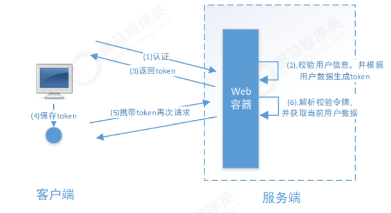

​ 基于 session 的认证方式由 Servlet 规范定制，服务端要存储 session 信息需要占用内存资源，客户端需要支持 cookie；基于 token 的方式则一般不需要服务端存储 token，并且不限制客户端的存储方式。如今移动互联网时代 更多类型的客户端需要接入系统，系统多是采用前后端分离的架构进行实现，所以基于 token 的方式更适合。

### 1.2 什么是授权

​ 还拿微信来举例子，微信登录成功后用户即可使用微信的功能，比如，发红包、发朋友圈、添加好友等，没有绑定 银行卡的用户是无法发送红包的，绑定银行卡的用户才可以发红包，发红包功能、发朋友圈功能都是微信的资源即 功能资源，用户拥有发红包功能的权限才可以正常使用发送红包功能，拥有发朋友圈功能的权限才可以使用发朋友 圈功能，这个根据用户的权限来控制用户使用资源的过程就是授权。

> ​ 为什么要授权？

​ 认证是为了保证用户身份的合法性，授权则是为了更细粒度的对隐私数据进行划分，授权是在认证通过后发生的， 控制不同的用户能够访问不同的资源。

​ **授权：** 授权是用户认证通过根据用户的权限来控制用户访问资源的过程，拥有资源的访问权限则正常访问，没有 权限则拒绝访问。

### 1.3 授权的数据模型

​ 如何进行授权即如何对用户访问资源进行控制，首先需要学习授权相关的数据模型。

​ 授权可简单理解为 Who 对 What(which)进行 How 操作，包括如下：

​ **Who**，即主体（Subject），主体一般是指用户，也可以是程序，需要访问系统中的资源。

​ **What**，即资源 （Resource），如系统菜单、页面、按钮、代码方法、系统商品信息、系统订单信息等。系统菜单、页面、按 钮、代码方法都属于（系统功能资源），对于 web 系统每个功能资源通常对应一个 URL；系统商品信息、系统订单信息 都属于实体资源（数据资源），实体资源由资源类型和资源实例组成，比如商品信息为资源类型，商品编号 为 001 的商品为资源实例。

​ **How**，权限/许可（Permission），规定了用户对资源的操作许可，权限离开资源没有意义， 如用户查询权限、用户添加权限、某个代码方法的调用权限、编号为 001 的用户的修改权限等，通过权限可知用户 对哪些资源都有哪些操作许可。

> 主体、资源、权限关系如下图：

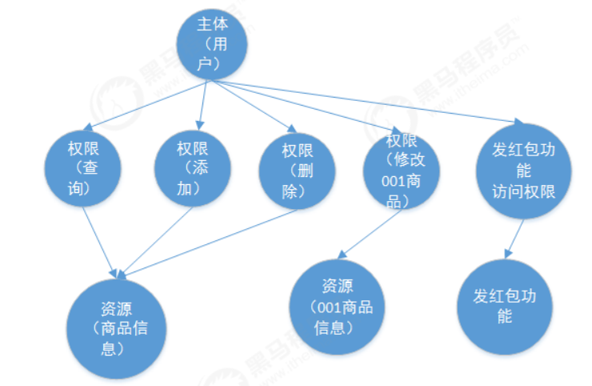

主体、资源、权限相关的数据模型如下：

主体（用户 id、账号、密码、...）

资源（资源 id、资源名称、访问地址、...）

权限（权限 id、权限标识、权限名称、资源 id、...）

角色（角色 id、角色名称、...）

角色和权限关系（角色 id、权限 id、...）

主体（用户）和角色关系（用户 id、角色 id、...）

主体（用户）、资源、权限关系如下图：

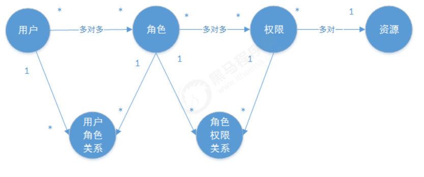

**通常企业开发中将资源和权限表合并为一张权限表，如下：**

资源（资源 id、资源名称、访问地址、...）

权限（权限 id、权限标识、权限名称、资源 id、...）

**合并为：**

权限（权限 id、权限标识、权限名称、资源名称、资源访问地址、...）

修改后数据模型之间的关系如下图：

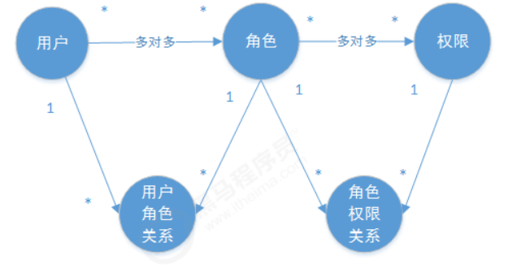

### 1.4 RBAC

​ 如何实现授权？业界通常基于 RBAC 实现授权。

#### 1.4.1 基于角色的访问控制

​ RBAC 基于角色的访问控制（Role-Based Access Control）是按角色进行授权，比如：主体的角色为总经理可以查 询企业运营报表，查询员工工资信息等，访问控制流程如下：

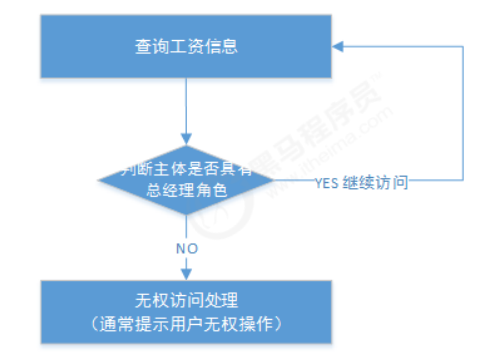

根据上图中的判断逻辑，授权代码可表示如下：

```java
if(主体.hasRole("总经理角色id")){
	查询工资
}

```

如果上图中查询工资所需要的**角色变化为总经理和部门经理**，此时就需要修改判断逻辑为“判断用户的角色是否是 总经理或部门经理”，修改代码如下：

```java
if(主体.hasRole("总经理角色id") || 主体.hasRole("部门经理角色id")){
	查询工资
}

```

根据上边的例子发现，当需要修改角色的权限时就需要修改授权的相关代码，系统可扩展性差。

#### 1.4.2 基于资源的访问控制

​ RBAC 基于资源的访问控制（Resource-Based Access Control）是按资源（或权限）进行授权，比如：用户必须 具有查询工资权限才可以查询员工工资信息等，访问控制流程如下：

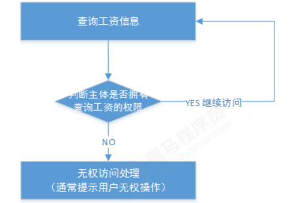

根据上图中的判断，授权代码可以表示为：

```java
if(主体.hasPermission("查询工资权限标识")){
	查询工资
}

```

> 优点：系统设计时定义好查询工资的权限标识，即使查询工资所需要的角色变化为总经理和部门经理也不需要修改 授权代码，系统可扩展性强。

## 2 基于 Session 的认证方式

### 2.1 认证流程

​ 基于 Session 认证方式的流程是，用户认证成功后，在服务端生成用户相关的数据保存在 session(当前会话)，而发 给客户端的 sesssion_id 存放到 cookie 中，这样用客户端请求时带上 session_id 就可以验证服务器端是否存在 session 数据，以此完成用户的合法校验。当用户退出系统或 session 过期销毁时,客户端的 session_id 也就无效了。 下图是 session 认证方式的流程图：

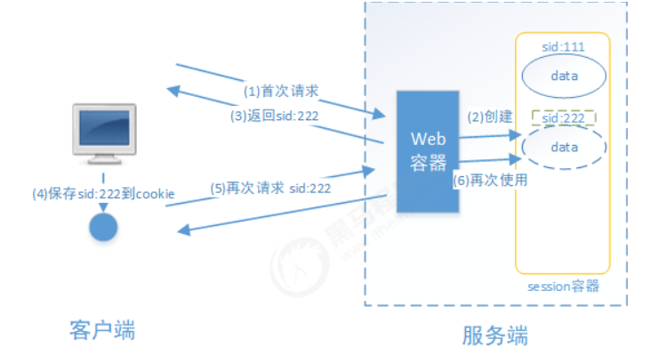

​ 基于 Session 的认证机制由 Servlet 规范定制，Servlet 容器已实现，用户通过 HttpSession 的操作方法即可实现，如 下是 HttpSession 相关的操作 API。

| 方法                                        | 含义                      |
| ------------------------------------------- | ------------------------- |
| HttpSession getSession(Boolean create)      | 获取当前 HttpSession 对象 |
| void setAttribute(String name,Object value) | 向 session 中存放对象     |
| object getAttribute(String name)            | 从 session 中获取对象     |
| void removeAttribute(String name);          | 移除 session 中对象       |
| void invalidate()                           | 使 HttpSession 失效       |
| 略...                                       |                           |

### 2.2.创建工程

​ 本案例工程使用 maven 进行构建，使用 SpringMVC、Servlet3.0 实现。

#### 2.2.1 创建 maven 工程

创建 maven 工程 security-springmvc，工程结构如下：

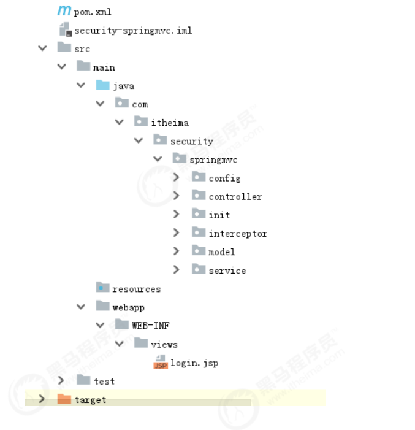

引入如下依赖如下，注意：

1、由于是 web 工程，packaging 设置为 war

2、使用 tomcat7-maven-plugin 插件来运行工程

```xml
<?xml version="1.0" encoding="UTF-8"?>
<project xmlns="http://maven.apache.org/POM/4.0.0"
     xmlns:xsi="http://www.w3.org/2001/XMLSchema-instance"
     xsi:schemaLocation="http://maven.apache.org/POM/4.0.0 http://maven.apache.org/xsd/maven-4.0.0.xsd">
<modelVersion>4.0.0</modelVersion>

<groupId>com.itheima.security</groupId>
<artifactId>security-springmvc</artifactId>
<version>1.0-SNAPSHOT</version>
<packaging>war</packaging>
<properties>
    <project.build.sourceEncoding>UTF-8</project.build.sourceEncoding>
    <maven.compiler.source>1.8</maven.compiler.source>
    <maven.compiler.target>1.8</maven.compiler.target>
</properties>
<dependencies>
    <dependency>
        <groupId>org.springframework</groupId>
        <artifactId>spring-webmvc</artifactId>
        <version>5.1.5.RELEASE</version>
    </dependency>

    <dependency>
        <groupId>javax.servlet</groupId>
        <artifactId>javax.servlet-api</artifactId>
        <version>3.0.1</version>
        <scope>provided</scope>
    </dependency>
    <dependency>
        <groupId>org.projectlombok</groupId>
        <artifactId>lombok</artifactId>
        <version>1.18.8</version>
    </dependency>
</dependencies>
<build>
    <finalName>security-springmvc</finalName>
    <pluginManagement>
        <plugins>
            <plugin>
                <groupId>org.apache.tomcat.maven</groupId>
                <artifactId>tomcat7-maven-plugin</artifactId>
                <version>2.2</version>
            </plugin>
            <plugin>
                <groupId>org.apache.maven.plugins</groupId>
                <artifactId>maven-compiler-plugin</artifactId>
                <configuration>
                    <source>1.8</source>
                    <target>1.8</target>
                </configuration>
            </plugin>

            <plugin>
                <artifactId>maven-resources-plugin</artifactId>
                <configuration>
                    <encoding>utf-8</encoding>
                    <useDefaultDelimiters>true</useDefaultDelimiters>
                    <resources>
                        <resource>
                            <directory>src/main/resources</directory>
                            <filtering>true</filtering>
                            <includes>
                                <include>**/*</include>
                            </includes>
                        </resource>
                        <resource>
                            <directory>src/main/java</directory>
                            <includes>
                                <include>**/*.xml</include>
                            </includes>
                        </resource>
                    </resources>
                </configuration>
            </plugin>
        </plugins>
    </pluginManagement>
</build>
</project>
```

#### 2.2.2 Spring 容器配置

在 config 包下定义 ApplicationConfig.java，它对应 web.xml 中 ContextLoaderListener 的配置

```java
@Configuration
@ComponentScan(basePackages = "com.itheima.security.springmvc"
        , excludeFilters = {@ComponentScan.Filter(type = FilterType.ANNOTATION, value =
        Controller.class)})
public class ApplicationConfig {
    //在此配置除了Controller的其它bean，比如：数据库链接池、事务管理器、业务bean等。
}

```

#### 2.2.3 servletContext 配置

​ 本案例采用 Servlet3.0 无 web.xml 方式，的 config 包下定义 WebConfig.java，它对应 s 对应于 DispatcherServlet 配 置。

```java
@Configuration
@EnableWebMvc
@ComponentScan(basePackages = "com.itheima.security.springmvc"
        ,includeFilters = {@ComponentScan.Filter(type = FilterType.ANNOTATION,value =
        Controller.class)})
public class WebConfig implements WebMvcConfigurer {
    // 视图解析器
    @Bean
    public InternalResourceViewResolver viewResolver(){
        InternalResourceViewResolver viewResolver = new InternalResourceViewResolver();
        viewResolver.setPrefix("/WEB‐INF/views/");
        viewResolver.setSuffix(".jsp");
        return viewResolver;
    }
}

```

#### 2.2.4 加载 Spring 容器

在 init 包下定义 Spring 容器初始化类 SpringApplicationInitializer，此类实现 WebApplicationInitializer 接口， Spring 容器启动时加载 WebApplicationInitializer 接口的所有实现类。

```java
public class SpringApplicationInitializer extends AbstractAnnotationConfigDispatcherServletInitializer {

    // spring容器 相当于加载applicationContext.xml
    @Override
    protected Class<?>[] getRootConfigClasses() {
        return new Class<?>[]{ApplicationConfig.class};//指定rootContext的配置类
    }

    // servletContext，相当于加载SpringMVC.xml
    @Override
    protected Class<?>[] getServletConfigClasses() {
        return new Class<?>[]{WebConfig.class}; //指定servletContext的配置类
    }

    // url-mapping
    @Override
    protected String[] getServletMappings() {
        return new String[]{"/"};

    }
}
```

SpringApplicationInitializer 相当于 web.xml，使用了 servlet3.0 开发则不需要再定义 web.xml， ApplicationConfig.class 对应以下配置的 application-context.xml，WebConfig.class 对应以下配置的 springmvc.xml，web.xml 的内容参考：

```xml
<web‐app>
  <listener>
    <listener‐class>org.springframework.web.context.ContextLoaderListener</listener‐class>
  </listener>
  <context‐param>
    <param‐name>contextConfigLocation</param‐name>
    <param‐value>/WEB‐INF/application‐context.xml</param‐value>
  </context‐param>
  <servlet>
    <servlet‐name>springmvc</servlet‐name>
    <servlet‐class>org.springframework.web.servlet.DispatcherServlet</servlet‐class>
    <init‐param>
      <param‐name>contextConfigLocation</param‐name>
      <param‐value>/WEB‐INF/spring‐mvc.xml</param‐value>
    </init‐param>
    <load‐on‐startup>1</load‐on‐startup>
  </servlet>
  <servlet‐mapping>
    <servlet‐name>springmvc</servlet‐name>
    <url‐pattern>/</url‐pattern>
  </servlet‐mapping>
</web‐app>

```

### 2.3.实现认证功能

​ 在 webapp/WEB-INF/views 下定义认证页面 login.jsp，本案例只是测试认证流程，页面没有添加 css 样式，页面实 现可填入用户名，密码，触发登录将提交表单信息至/login，内容如下：

```jsp
<%@ page contentType="text/html;charset=UTF-8" pageEncoding="UTF-8" language="java" %>
<html>
    <head>
        <title>用户登录</title>
    </head>
    <body>
        <form action="login" method="post">
            用户名：<input type="text" name="username"><br>
            密&nbsp;&nbsp;&nbsp;码:
            <input type="password" name="password"><br>
            <input type="submit" value="登录">
        </form>
    </body>
</html>
```

在 WebConfig 中新增如下配置，将/直接导向 login.jsp 页面：

```java
// 将/直接导向login.jsp页面：
@Override
public void addViewControllers(ViewControllerRegistry registry) {
    registry.addViewController("/").setViewName("login");
}
```

**启动项目，访问/路径地址，进行测试**

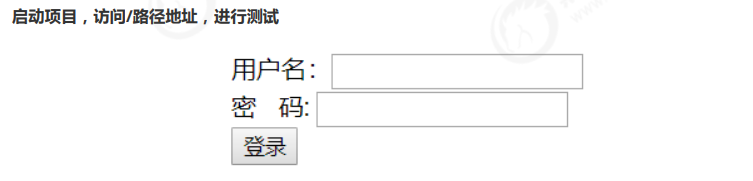

#### 2.3.2 认证接口

用户进入认证页面，输入账号和密码，点击登录，请求/login 进行身份认证。

（1）定义认证接口，此接口用于对传来的用户名、密码校验，若成功则返回该用户的详细信息，否则抛出错误异常：

```java
/**
 * 认证服务
 */
public interface AuthenticationService {
    /**
     * 用户认证
     *
     * @param authenticationRequest 用户认证请求，账号和密码
     * @return 认证成功的用户信息
     */
    UserDto authentication(AuthenticationRequest authenticationRequest);
}
```

认证请求结构：

```java

@Data
public class AuthenticationRequest {
    /**
     * 用户名
     */
    private String username;
    /**
     * 密码
     */
    private String password;
}
```

认证成功后返回的用户详细信息，也就是当前登录用户的信息：

```java
/**
 * 当前登录用户信息
 */
@Data
@AllArgsConstructor
public class UserDto {

    private String id;
    private String username;
    private String password;
    private String fullname;
    private String mobile;

}

```

（2）认证实现类，根据用户名查找用户信息，并校验密码，这里模拟了两个用户：

```java
@Service
public class AuthenticationServiceImpl implements AuthenticationService {
/**
 * 校验用户的身份信息是否合法
 *
 * @param authenticationRequest 用户认证请求，账号和密码
 * @return
 */
@Override
public UserDto authentication(AuthenticationRequest authenticationRequest) {
    // 校验参数是否为空
    if (authenticationRequest == null
            || StringUtils.isEmpty(authenticationRequest.getUsername())
            || StringUtils.isEmpty(authenticationRequest.getPassword())) {
        throw new RuntimeException("账号或密码为空");
    }
    // 根据账号去查询数据库.这里测试程序采用模拟数据
    UserDto userDto = getUserDto(authenticationRequest.getUsername());
    // 判断用户是否为空
    if (userDto == null) {
        throw new RuntimeException("查询不到该用户");
    }
    // 校验密码
    if (!authenticationRequest.getPassword().equals(userDto.getPassword())) {
        throw new RuntimeException("账号或密码错误");
    }
    // 认证通过 返回用户的身份信息
    return userDto;
}

// 根据账号查询用户信息
private UserDto getUserDto(String username) {
    return userMap.get(username);
}

//用户信息
private Map<String, UserDto> userMap = new HashMap<>();

{
    userMap.put("zhangsan", new UserDto("1010", "zhangsan", "123", "张三", "133443"));
    userMap.put("lisi", new UserDto("1011", "lisi", "456", "李四", "144553"));
}

}
```

（3）登录 Controller，对/login 请求处理，它调用 AuthenticationService 完成认证并返回登录结果提示信息：

```java
@RestController
public class LoginController {
    @Autowired
    private AuthenticationService authenticationService;
    /**
     * 用户登录
     * @param authenticationRequest 登录请求
     * @return
     */

    @RequestMapping(value = "/login",produces = {"text/plain;charset=UTF‐8"})// produces：指定响应体返回类型和编码
    public String login(AuthenticationRequest authenticationRequest){
        UserDto authentication = authenticationService.authentication(authenticationRequest);
        return authentication.getFullname() + " 登录成功";
    }

}
```

（4）测试

启动项目，访问/路径地址，进行测试

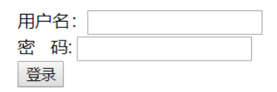

**填入错误的用户信息，页面返回错误信息：**

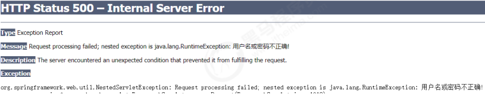

**填入正确的用户信息，页面提示登录成功：**

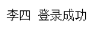

​ 以上的测试全部符合预期，到目前为止最基础的认证功能已经完成，它仅仅实现了对用户身份凭证的校验，若某用 户认证成功，只能说明他是该系统的一个合法用户，仅此而已。

### 2.4.实现会话功能

​ 会话是指用户登入系统后，系统会记住该用户的登录状态，他可以在系统连续操作直到退出系统的过程。

​ 认证的目的是对系统资源的保护，每次对资源的访问，系统必须得知道是谁在访问资源，才能对该请求进行合法性 拦截。因此，在认证成功后，一般会把认证成功的用户信息放入 Session 中，在后续的请求中，系统能够从 Session 中获取到当前用户，用这样的方式来实现会话机制。

（1）增加会话控制

​ 首先在 UserDto 中定义一个 SESSION_USER_KEY，作为 Session 中存放登录用户信息的 key。

```java
public static final String SESSION_USER_KEY = "_user";
```

​ 然后修改 LoginController，认证成功后，将用户信息放入当前会话。并增加用户登出方法，登出时将 session 置为 失效。

```java
/**
 * 用户登录
 *
 * @param authenticationRequest 登录请求
 * @return
 */

@RequestMapping(value = "/login", produces = "text/plain;charset=utf-8")// produces：指定响应体返回类型和编码
public String login(AuthenticationRequest authenticationRequest, HttpSession session) {
    UserDto authentication = authenticationService.authentication(authenticationRequest);
    // 将用户信息存入session
    session.setAttribute(UserDto.SESSION_USER_KEY, authentication);
    return authentication.getFullname() + " 登录成功";
}

/**
 * 退出
 *
 * @param session
 * @return
 */
@GetMapping(value = "/logout", produces = "text/plain;charset=utf‐8")
public String logout(HttpSession session) {
    // session 失效
    session.invalidate();
    return "退出成功";
}

```

（2）增加测试资源

修改 LoginController，增加测试资源 1，它从当前会话 session 中获取当前登录用户，并返回提示信息给前台

```java
/**
 * 测试资源1
 * @param session
 * @return
 */
@GetMapping(value = "/r/r1",produces = "text/plain;charset=UTF‐8")
public String r1(HttpSession session){
    String fullname = null;
    Object object = session.getAttribute(UserDto.SESSION_USER_KEY);
    if(object != null){
        fullname = ((UserDto)object).getFullname();
    }else{
        fullname = "匿名";
    }
    return fullname + " 访问资源1";
}
```

（3）测试

未登录情况下直接访问测试资源/r/r1：


成功登录的情况下访问测试资源/r/r1：

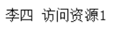

> 测试结果说明，在用户登录成功时，该用户信息已被成功放入 session，并且后续请求可以正常从 session 中获取当 前登录用户信息，符合预期结果。

### 2.5.实现授权功能

​ 现在我们已经完成了用户身份凭证的校验以及登录的状态保持，并且我们也知道了如何获取当前登录用户(从 Session 中获取)的信息，接下来，用户访问系统需要经过授权，即需要完成如下功能：

- 匿名用户（未登录用户）访问拦截：禁止匿名用户访问某些资源。
- 登录用户访问拦截：根据用户的权限决定是否能访问某些资源。

（1）增加权限数据

​ 为了实现这样的功能，我们需要在 UserDto 里增加权限属性，用于表示该登录用户所拥有的权限，同时修改 UserDto 的构造方法。

```java
@Data
@AllArgsConstructor
public class UserDto {
    public static final String SESSION_USER_KEY = "_user";
    //用户身份信息
    private String id;
    private String username;
    private String password;
    private String fullname;
    private String mobile;
    /**
     * 用户权限
     */
    private Set<String> authorities;
}

```

​ 并在 AuthenticationServiceImpl 中为模拟用户初始化权限，其中张三给了 p1 权限，李四给了 p2 权限。

```java
//根据账号查询用户信息
private UserDto getUserDto(String userName){
    return userMap.get(userName);
}
//用户信息
private Map<String,UserDto> userMap = new HashMap<>();
{
    Set<String> authorities1 = new HashSet<>();
    authorities1.add("p1");//这个p1我们人为让它和/r/r1对应
    Set<String> authorities2 = new HashSet<>();
    authorities2.add("p2");//这个p2我们人为让它和/r/r2对应
    userMap.put("zhangsan",new UserDto("1010","zhangsan","123","张三","133443",authorities1));
    userMap.put("lisi",new UserDto("1011","lisi","456","李四","144553",authorities2));
}
```

（2）增加测试资源

​ 我们想实现针对不同的用户能访问不同的资源，前提是得有多个资源，因此在 LoginController 中增加测试资源 2。

```java
@GetMapping(value = "/r/r2",produces = {"text/plain;charset=UTF-8"})
public String r2(HttpSession session){
    String fullname = null;
    Object userObj = session.getAttribute(UserDto.SESSION_USER_KEY);
    if(userObj != null){
        fullname = ((UserDto)userObj).getFullname();
    }else{
        fullname = "匿名";
    }
    return fullname + " 访问资源2";
}
```

（3）实现授权拦截器

​ 在 interceptor 包下定义 SimpleAuthenticationInterceptor 拦截器，实现授权拦截：

​ 1、校验用户是否登录

​ 2、校验用户是否拥有操作权限

```java
@Component
public class SimpleAuthenticationInterceptor implements HandlerInterceptor {

@Override
public boolean preHandle(HttpServletRequest request, HttpServletResponse response, Object handler) throws Exception {
    //在这个方法中校验用户请求的url是否在用户的权限范围内
    //取出用户身份信息
    Object object = request.getSession().getAttribute(UserDto.SESSION_USER_KEY);
    if(object == null){
        //没有认证，提示登录
        writeContent(response,"请登录");
    }
    UserDto userDto = (UserDto) object;
    //请求的url
    String requestURI = request.getRequestURI();
    if( userDto.getAuthorities().contains("p1") && requestURI.contains("/r/r1")){
        return true;
    }
    if( userDto.getAuthorities().contains("p2") && requestURI.contains("/r/r2")){
        return true;
    }
    writeContent(response,"没有权限，拒绝访问");

    return false;
}

//响应信息给客户端
private void writeContent(HttpServletResponse response, String msg) throws IOException {
    response.setContentType("text/html;charset=utf-8");
    PrintWriter writer = response.getWriter();
    writer.print(msg);
    writer.close();
}
}
```

​

​ 在 WebConfig 中配置拦截器，匹配/r/\*\*的资源为受保护的系统资源，访问该资源的请求进入 SimpleAuthenticationInterceptor 拦截器。

```java
@Autowired
SimpleAuthenticationInterceptor simpleAuthenticationInterceptor;

@Override
public void addInterceptors(InterceptorRegistry registry) {
    registry.addInterceptor(simpleAuthenticationInterceptor).addPathPatterns("/r/**");
}
```

（4）测试

未登录情况下，/r/r1 与/r/r2 均提示 “请先登录”。

张三登录情况下，由于张三有 p1 权限，因此可以访问/r/r1，张三没有 p2 权限，访问/r/r2 时提示 “权限不足 “。

李四登录情况下，由于李四有 p2 权限，因此可以访问/r/r2，李四没有 p1 权限，访问/r/r1 时提示 “权限不足 “。 测试结果全部符合预期结果。

### 2.6.小结

基于 Session 的认证方式是一种常见的认证方式，至今还有非常多的系统在使用。我们在此小节使用 Spring mvc 技 术对它进行简单实现，旨在让大家更清晰实在的了解用户认证、授权以及会话的功能意义及实现套路，也就是它们 分别干了哪些事儿？大概需要怎么做？

而在正式生产项目中，我们往往会考虑使用第三方安全框架（如 spring security，shiro 等安全框架）来实现认证 授权功能，因为这样做能一定程度提高生产力，提高软件标准化程度，另外往往这些框架的可扩展性考虑的非常全 面。但是缺点也非常明显，这些通用化组件为了提高支持范围会增加很多可能我们不需要的功能，结构上也会比较 抽象，如果我们不够了解它，一旦出现问题，将会很难定位。
