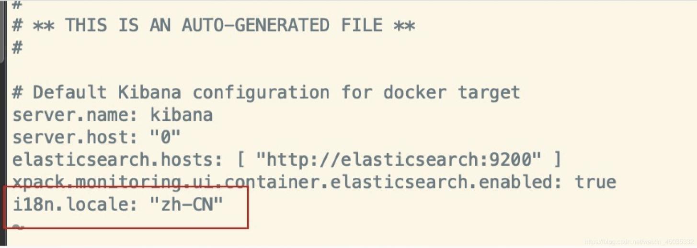
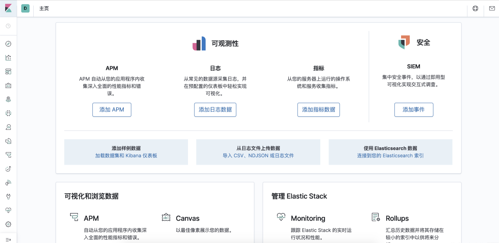

# docker 中设置 Kibana 为中文

<hr/>

[[toc]]

> Kibana 默认安装的是英文版的，6.7 以后系统开始支持中文了，修改语言只需要添加一行配置即可.

## 1.1 查看 Kibana 容器 id

```java
docker ps
```

## 1.2 进入容器

```java
docker exec -it Kibana容器id bash
```

## 1.3 进入 config 目录下

```java
cd config/
```

## 1.4 编辑 kibana.yml 文件

```java
vi kibana.yml
```

## 1.5 添加一行配置即可

```java
i18n.locale: "zh-CN"
```



## 1.6 退出容器

```java
exit
```

## 1.7 重启 Kibana（需要 1 分钟 别着急）

```java
docker restart Kibana容器id
```


ok
