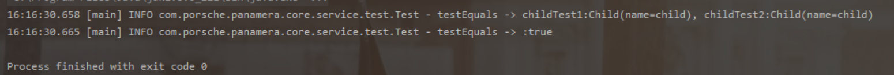
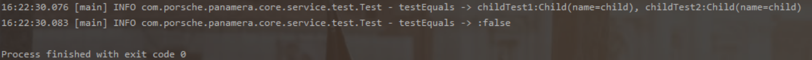

# **🌶️ lombok—@EqualsAndHashCode(callSuper = true)注解的使用**

<hr/>

[[toc]]

> @EqualsAndHashCode(callSuper = true)
>
> 该注解用于子类对象之间进行比较的时候
>
> 不加该注解的影响：子类对象属性值一致，但其继承的父类对象属性值不一致，在比较的时候会出现比较结果不对的情况。

## 举个简单的栗子：

1.这边先定义一个分类对象 Parent，有一个属性：code

```java
@Data
public class Parent {
/**
 * 父类编码
 */
private String code;
}

```

2.再定义一个子类对象 Child，有一个属性：name

```java
@Data
public class Child extends Parent {
/**
 * 子类名称
 */
private String name;
}

```

3.在方法中 new 两个 Child 对象：childTest1、childTest2；

对这两个 Child 对象的自有属性 name 都赋值为：Child；

但是对继承的父类属性 code 进行不同的赋值；

```java
Child childTest1 = new Child();
childTest1.setCode("1");
childTest1.setName("child");

Child childTest2 = new Child();
childTest2.setCode("2");
childTest2.setName("child");

```

4.根据使用过程中，这两个对象肯定是不一样的，但是，在不加 @EqualsAndHashCode(callSuper = true) 注解的情况下对这两个对象进行比较得到的结果却是 true

```java
boolean isSame = Objects.equals(childTest1,childTest2);
log.info("testEquals -> childTest1:{}, childTest2:{}", childTest1, childTest2);
log.info("testEquals -> :{}", isSame);

```



5.@EqualsAndHashCode(callSuper = true) 注解的作用就是将其父类属性也进行比较，下面是 Child 类加了注解后运行的结果：

```java
@EqualsAndHashCode(callSuper = true)
@Data
public class Child extends Parent {
/**
 * 子类名称
 */
private String name;
}

```


