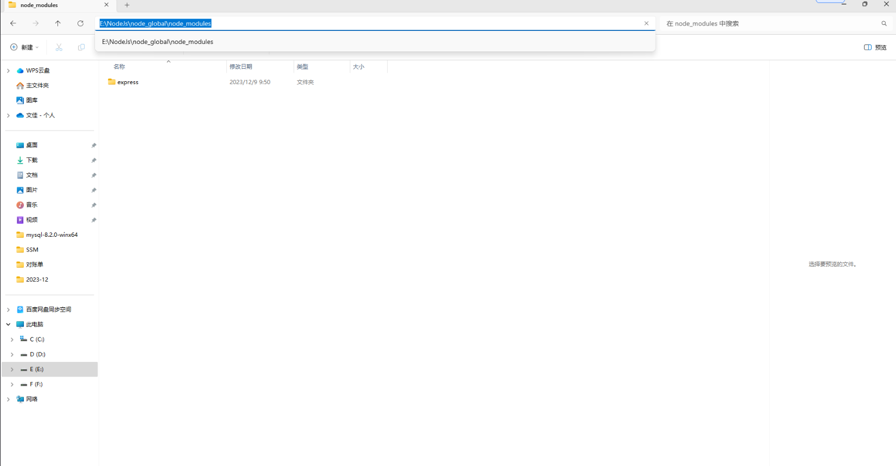

# ✨node.js和npm的安装与环境配置

[[toc]]

## 安装node.js

1、进入官网下载：node.js官网
我选择的是windows64位的，你可以根据自己的实际情况选择对应的版本。

2、下载完成，安装。
打开安装程序

接受协议

选择安装位置，一会儿还要用。我选择的是：E:\NodeJs
选择完之后直接下一步

下一步，next即可

点击install，等待安装完成

### 测试是否安装成功

win+r输入cmd打开**命令行**，输入`node`，如下图显示，表示安装成功，我安装的版本是18.18.0.

### 测试npm

由于node.js默认配置了npm，所以不用单独下载和配置npm了，**node.js安装**只要成功，那么是直接可以使用npm命令来下载moudle的。
win+r输入cmd打开命令行，输入`npm -v`，显示当前npm版本。

### 环境配置

这里主要配置的是改变npm下载的模块包的默认存储地址，如果你的C盘容量非常大，你已经可以直接使用，不用再进行下面的配置。
为什么要改变默认存储地址呢？
因为nodejs默认全局仓库是在c盘下面的，你可以通过`npm list -global`命令查看
(查看不了的话就使用管理员模式打开命令行再使用指令)

可以看到默认路径不仅非常复杂，而且位于c盘下，以后你只要使用npm install XXXX
-g的命令，都会将包存储进去。所以可以将全局仓库重新改变位置，让它和nodejs的安装目录一直，也更加方便管理。
我的nodejs的安装目录是：E:\NodeJs
首先在E:\NodeJs下新建两个文件夹
node_global
node_cache

命令行输入指令
`npm config set prefix "E:\NodeJs\node_global"`
这里需要把""中的地址改为自己的node_global的地址
指令执行结束之后使用`npm list -g`查看是否更改成功

（正常情况下是出现empty的，但是由于我已经全部配置好了就显示这样）

命令行中输入：`npm config set cache "E:\NodeJs\node_cache"`
更改默认缓存位置

更改结束之后，下面我们运行`npm install express -g`来测试一下（如果安装报错，请使用管理员身份打开命令行进行安装）

再次输入`npm list -g`

新目录下也出现了express

#### 更改环境变量

接下来就要更改环境变量了
计算机右键点击属性，找到高级系统设置，点开。

选中path，点击编辑

将原来的C:\Users\用户名\AppData\Roaming\npm更改为新的地址，确认。

#### 新建系统变量

这里修改为自己的modules地址

