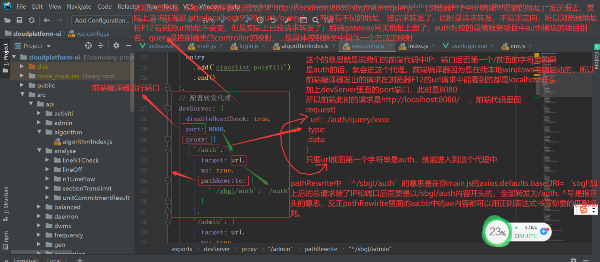
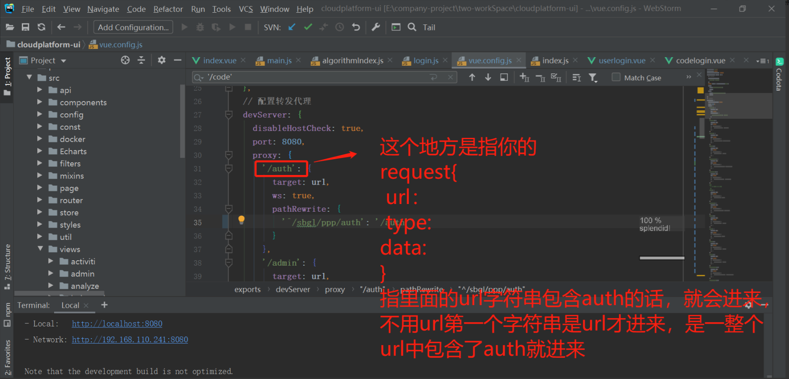
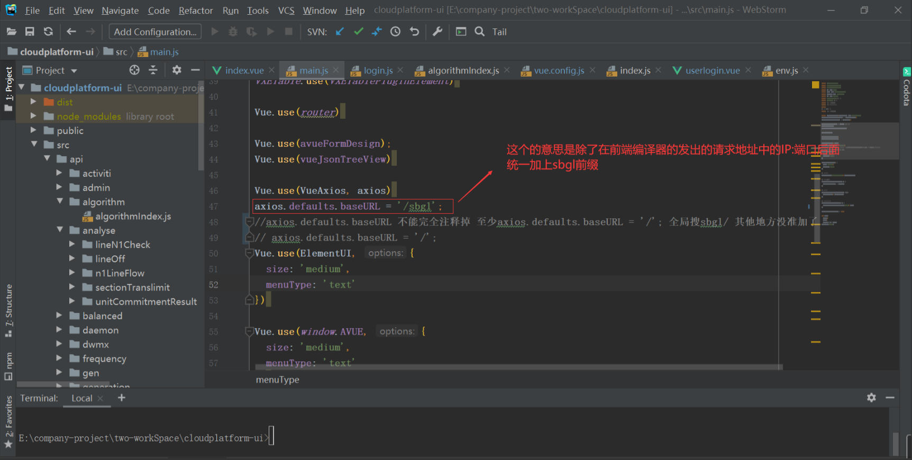
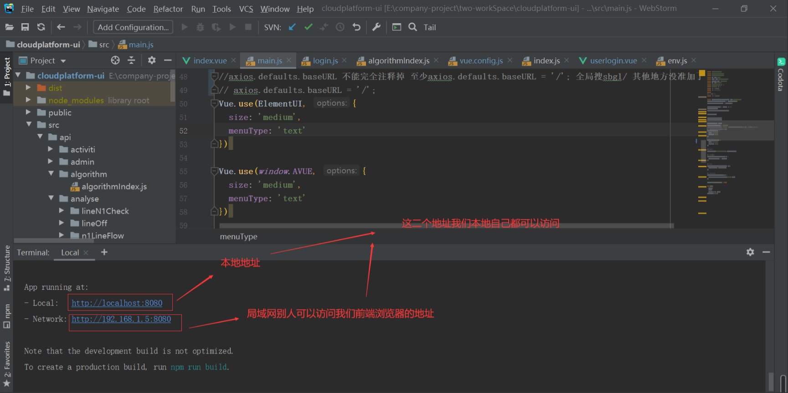
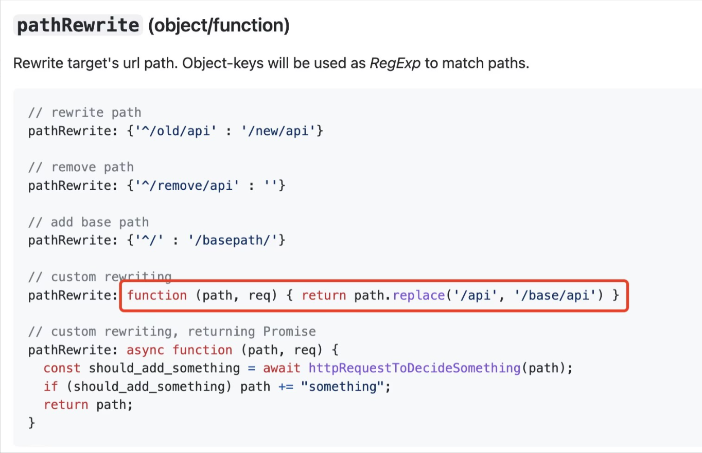
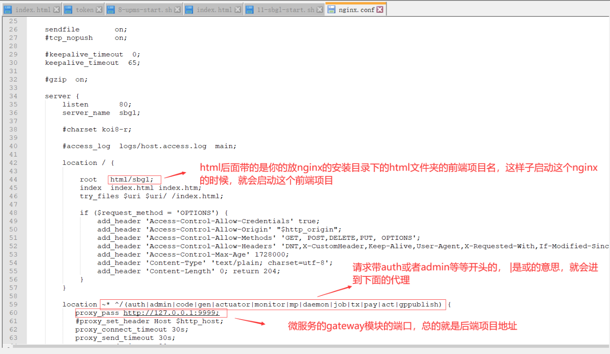
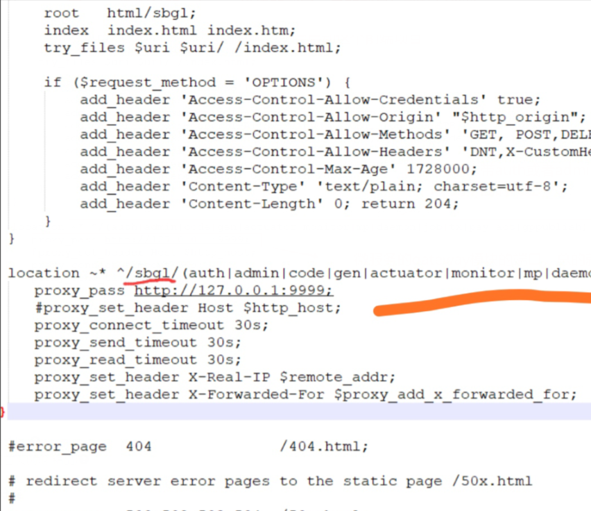
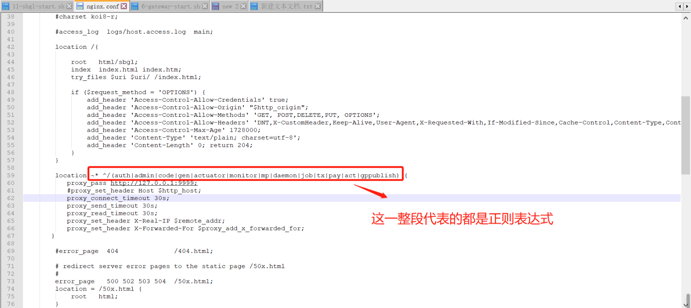
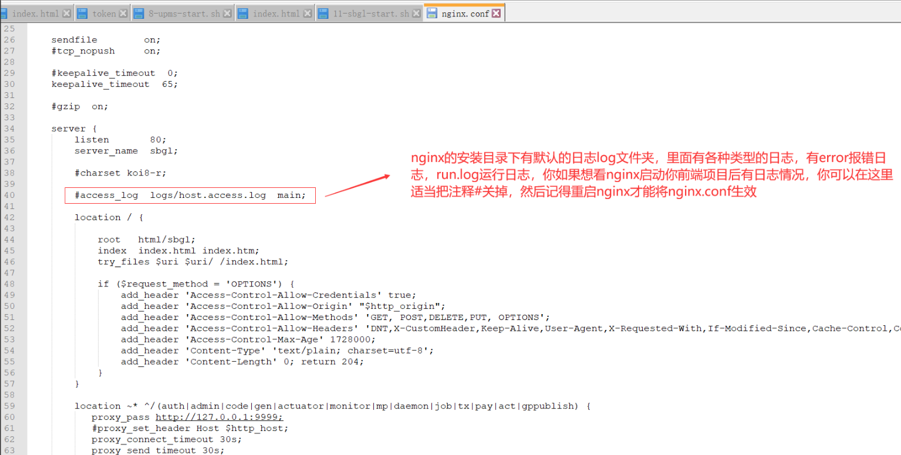

# 🎬︎ 总结 vue 和 nginx 的代理解析

<hr/>

[[toc]]

> vue 编译器和 nginx 都能启动我们前端项目的，二者都能对前端的请求进行转发代理到后端项目中

> 我们本地电脑也可以下载一个 nginx 启动我们的前端项目，而不用通过 vue 编译器启动。

## 1. vue 的 proxy 和 pathRewrite

### 1.1 vue 的代理

比如我现在本地电脑，用 vue 启动一个前端项目，端口是 8080，后端微服务项目的 gateway 模块的端口是 9999，那么此时我的前端项目端口和后端微服务端口是不一样的，虽然彼此都是本地电脑，也就是 127.0.0.1，但是端口不一样，如果前端项目想把请求发送到后端项目，那么此时属于跨域，那应该怎么解决跨域呢，此时就得用到了代理。



补充修改下：







上面的图的 main.js 文件修改后前端 vue 编译器可以直接热部署，不需要重启前端 vue 编译器就能看到最新的修改效果；vue.config.js 里面的内容修改后是无法热部署的，我得重启 vue 编译器项目才能看到最新的修改效果

`( /auth匹配的是axios的path部分，不是baseUrl如果匹配baseUrl的话，应该是Http开头的才对）`

附录：



用这个方法写上去，打印下 path，看看 path 是什么。

```js
'/gppublish': {
    target: url,
    ws: true,
    pathRewrite: function (path, req) {
     console.log('path=', path)
     return path.replace('/sbgl/gppublish', '/gppublish')
    },
   },
```

## 2.nginx 篇章

前端项目要是用 nginx 启动的话，那么在 vue 上面的代理是无法用到 nginx 的，nginx 也得做和 vue 的 vue.config.js 里面一样的代理配置才能请求转发到我的后端项目，不然 nginx 启动的端口和我后端项目启动的端口不一样，如果从 nginx 启动前端项目然后想发送请求到后端项目的话，是存在跨域的，所以 nginx 得配置代理，将请求转发到后端项目。







**问：这些|xx|，auth|gppu|，是什么意思？**

> /sbgl/auth 或者/sbgl/gppu 这样的路径开头的 就进来这里，路径没变，但是换了 ip，可以重写的，有很多功能，^是表示必须开头的意思。可以搜正则表达式就知道了


