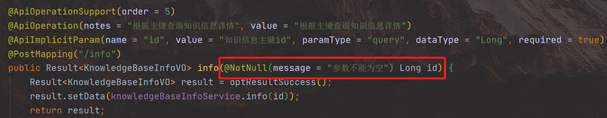
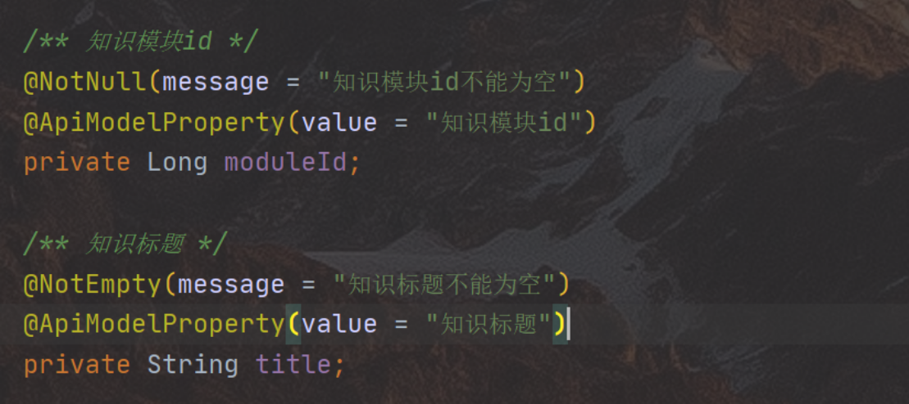
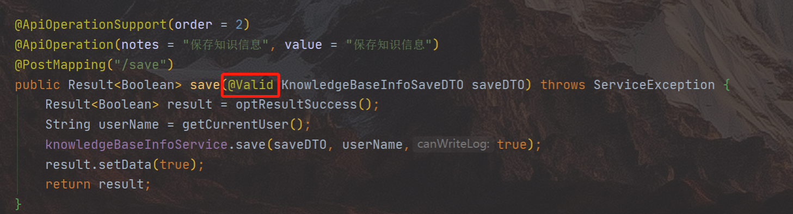
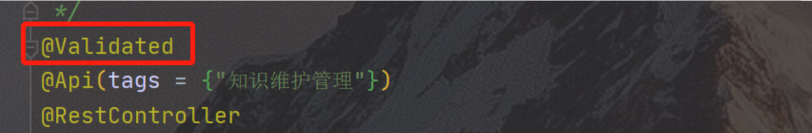

# 👻 参数校验注解不生效解决方案

<hr/>

[[toc]]

> 在日常开发过程中，我们会写一些注解⽤于加在 java 的**实体类**属性字段上，或者放到 controller 层的方法参数中，在进⾏请求或请求的时候会根据字段的注解进⾏对应的校验，简化校验相关的代码。
> 当校验不通过时，会返回对应的 message 描述

### **例 1：注解写在 Controller 层的接口参数中**



### **例 2：注解写在实体中**



> 当这些注解不生效时，解决方案如下：

**1、当@NotNull 等注解写在实体类中时，需要在 Controller 接口的方法参数加入@Valid 注解，如下图所示：**



**2、当@NotNull 等注解写在 Controller 层的接口参数中时，需要在该方法的 Controller 类上添加@Validated，如下图所示：**



### 补充：除@NotNull 之外的其他校验相关的注解

```java
//被注释的元素必须为null
@Null
//被注释的元素不能为null
@NotNull
//被注释的元素必须为true
@AssertTrue
//被注释的元素必须为false
@AssertFalse
//被注释的元素必须是⼀个数字，其值必须⼤于等于指定的最⼩值
@Min(value)
//被注释的元素必须是⼀个数字，其值必须⼩于等于指定的最⼤值
@Max(value)
//被注释的元素必须是⼀个数字，其值必须⼤于等于指定的最⼩值
@DecimalMin(value)
//被注释的元素必须是⼀个数字，其值必须⼩于等于指定的最⼤值
@DecimalMax(value)
//被注释的元素的⼤⼩必须在指定的范围内。
@Size(max,min)
//被注释的元素必须是⼀个数字，其值必须在可接受的范围内
@Digits(integer,fraction)
//被注释的元素必须是⼀个过去的⽇期
@Past
//被注释的元素必须是⼀个将来的⽇期
@Future
//被注释的元素必须符合指定的正则表达式。
@Pattern(value)
//被注释的元素必须是电⼦邮件地址
@Email
//被注释的字符串的⼤⼩必须在指定的范围内
@Length
//被注释的字符串必须⾮空
@NotEmpty
//被注释的元素必须在合适的范围内
@Range
```
