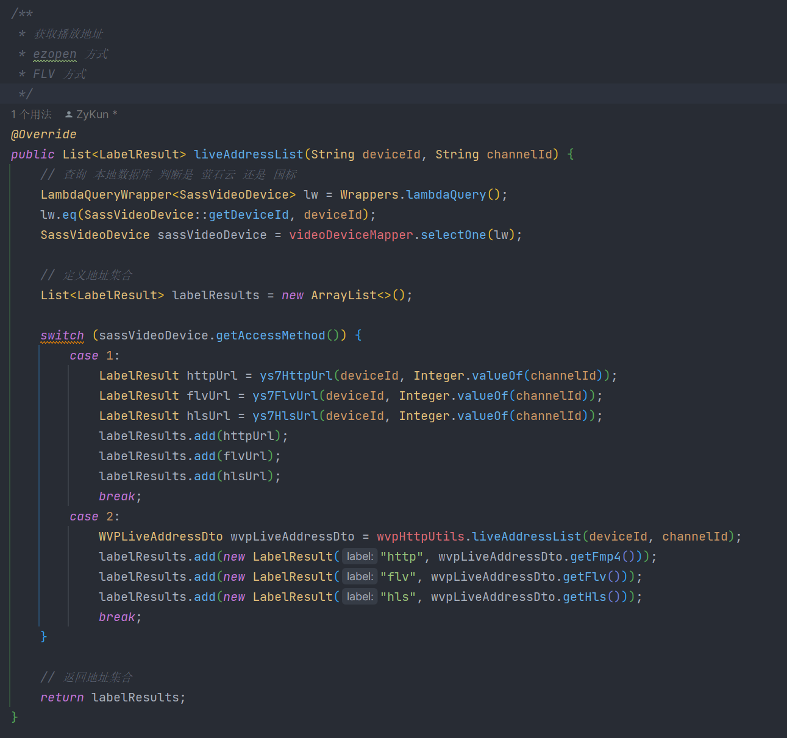
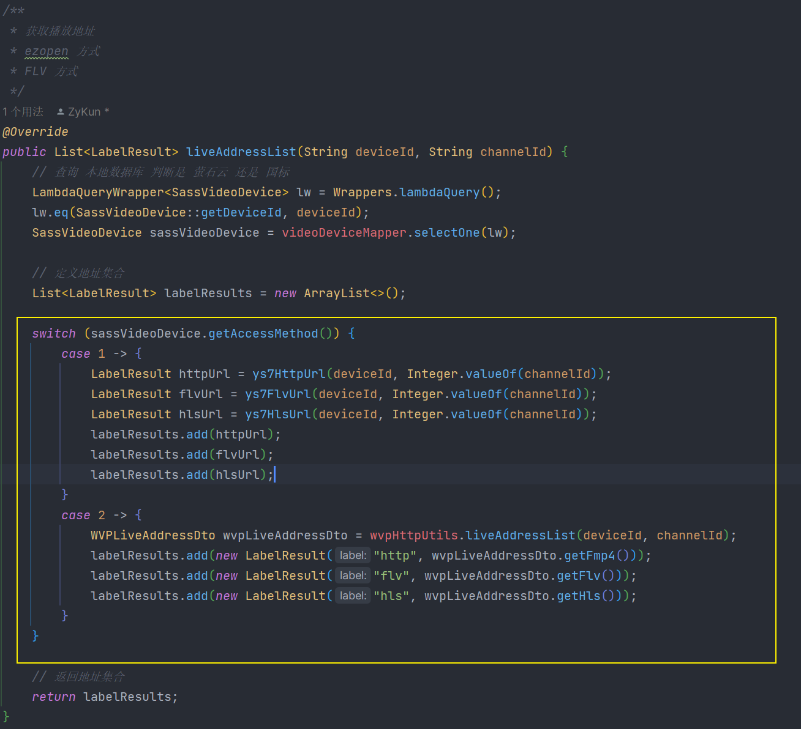

# 🦸‍♂ 增强版 Switch 语句

<hr/>

[[toc]]

> 今天用到 Switch 语句的时候，发现 IDEA 出现了一条标黄警告：`Switch语句可以替换为增强的"switch"`。于是找了一下资料发现在 JAVA12 版本之后，Switch 语句有了新的更为简易的写法，下面对二者的语法进行一个简单的对比：

## 原版

```java
import java.util.Scanner;

public class L4_2_4 {
public static void main(String[] args) {
    Scanner scan = new Scanner(System.in);
    System.out.println("请输入新员工的姓名：");
    String name = scan.nextLine();
    System.out.println("请输入新员工应聘的编程语言：");
    String language = scan.nextLine();

/* 旧版Switch语句只支持Java的基本数据类型，
       字符串只能转换成哈希码（hashCode）后再判断。 */

    switch (language.hashCode()){
        case 3254818: //java的hashCode
        case 2301506: //Java的hashCode
        case 2269730: //JAVA的hashCode
            System.out.println("员工" + name + "被分配到Java程序开发部门。");
            break;
        case 3104: //c#的hashCode
        case 2112: //C#的hashCode
            System.out.println("员工" + name + "被分配到C#项目维护组。");
            break;
        default:
            System.out.println("本公司不需要" + language + "语言的程序开发人员。");

    }
}
}
```

## 增强版

```java
import java.util.Scanner;

public class L4_2_4 {
public static void main(String[] args) {
    Scanner scan = new Scanner(System.in);
    System.out.println("请输入新员工的姓名：");
    String name = scan.nextLine();
    System.out.println("请输入新员工应聘的编程语言：");
    String language = scan.nextLine();

    switch (language){
        case "Java","java","JAVA" ->
        //可以直接对多个字符串进行判断，不需要分行，：改为->
            System.out.println("员工" + name + "被分配到Java程序开发部门。");
            //语句结束后不需要break跳出循环。
        case "C#","c#" ->
            System.out.println("员工" + name + "被分配到C#项目维护组。");
        default ->
            System.out.println("本公司不需要" + language + "语言的程序开发人员。");
    }
}
}
```

> 可见语句的简洁性提升了很多，同时更加直观
>
> case 语句下如果需要使用不止一行的代码时，要在->后面加上{ }，使代码成块。否则会提示错误：
>
> java: case 中存在意外语句，应为表达式、块或抛出语句

## 附上代码截图

### 原版



### 增强版


