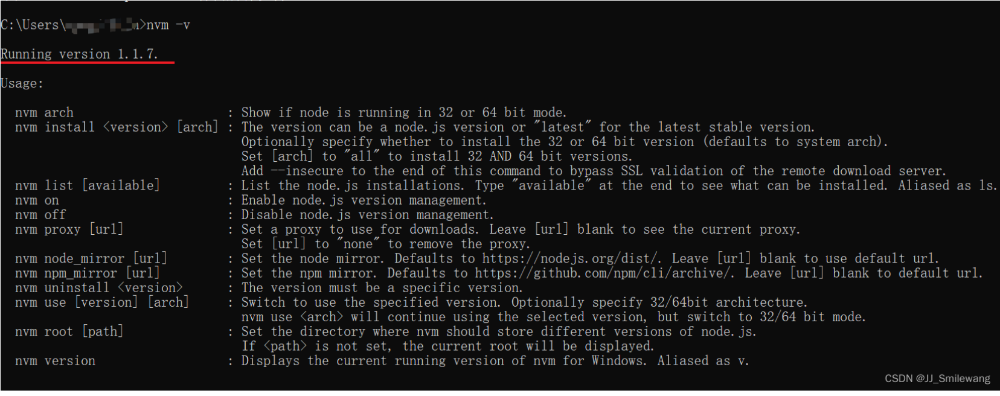
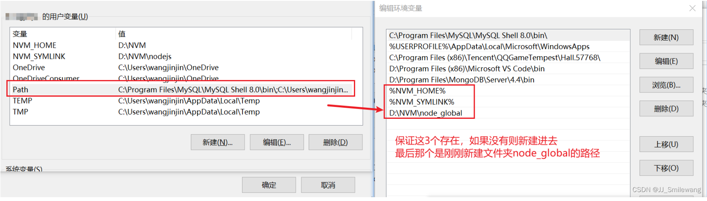

# ✅安装nvm，并使用nvm安装nodejs及配置环境变量

<hr/>

[[toc]]

## 一、安装nvm

1.下载nvm


1、解压后点击exe文件进行安装：


2、点击下一步安装到 D:\NVM 下


3、先在D:\NVM 下创建**nodejs**文件夹，然后将路径设置如下：


4、点击next 一直点击 完成安装；

5、找到指定nvm打开后：


6、给该文件添加这两行命令:

> node_mirror: https://npm.taobao.org/mirrors/node/
>
> npm_mirror: https://npm.taobao.org/mirrors/npm/

### 环境变量配置：

1. 点击计算机
2. 右击点击属性
3. 选择高级系统设置


4.点击环境变量

5.查看环境变量是否配置（默认nvm安装成功后，自动生成）：

与如下配置（保持一致）：


### 验证nvm安装：

打开cmd，输入nvm -v



返回版本号，说明成功。

## 二、安装node

### 1.通过nvm安装node

重新打开cmd，输入：

```swift
nvm install node版本号  // 安装对应版本的node
nvm ls                 // 用于查看已安装的node版本列表
nvm use node版本号     // 切换到对应版本的nodejs
 
 
例如：
nvm install 16.0.0  // 安装16.0.0版本的nodejs
nvm use 16.0.0   // 使用16.0.0版本的nodejs
```

查看node版本号的网址：https://nodejs.org/en/download/releases/


## **2、node环境变量配置**

**1.首先在NVM的安装目录新建两个文件夹node_global和node_cache**


**2.创建完两个文件夹后，在cmd窗口中输入以下命令（两个路径即是两个文件夹的路径）：**

```swift
npm config set prefix "D:\NVM\node_global"

npm config set cache "D:\NVM\node_cache"
```

**3.接下来设置电脑环境变量，右键“我的电脑”=》属性=》高级系统设置=》环境变量 进入以下环境变量对话框**。



**注意：【用户变量】中的path变量，%NVM_HOME% 和 %NVM_SYMLINK% 理论上是nvm安装成功后自动生成的。**

**如果有C:UsershuaAppDataRoaming npm，则将其修改为D:\NVM\node_global，如果没有就自己新建D:\NVM\node_global，总之保证有以上内容。**

（2）再设置系统变量 --- Path变量的设置和用户变量中一致


**4.在【系统变量】新建环境变量 NODE_PATH，值为D:\NVM\node_global\node_modules，其中D:
\NVM\node_global\node_modules是上述创建的全局模块安装路径文件夹**


**5.所有设置完点击确定，即配置完成。**

## 三、安装Vue

1. 切换镜像源

```cobol
npm config set registry=https://registry.npm.taobao.org/
```

2.查看当前镜像下包源 npm config get registry


3.安装vue、vue-cli、webpack

```swift
npm install vue -g

npm install vue-cli -g

npm install webpack -g
```

检查Vue是否安装成功
返回版本号则说明安装成功，注意V是大写，小写不成功


注意：我安装以上包的时候，使用的**nodejs版本是16.0.0**，因为开始使用18.0.0时由于版本过高，无法成功安装vue。

## 四、 本地配置yarn pnpm....

自行查阅资料
