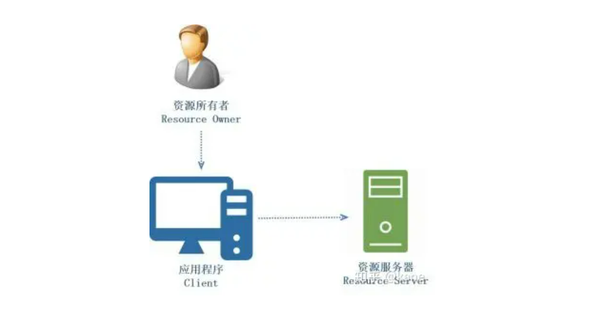
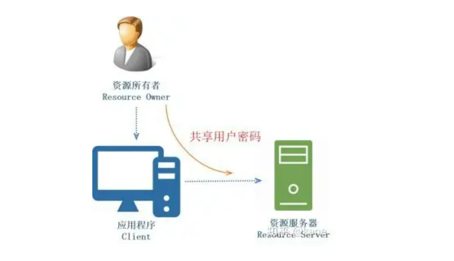
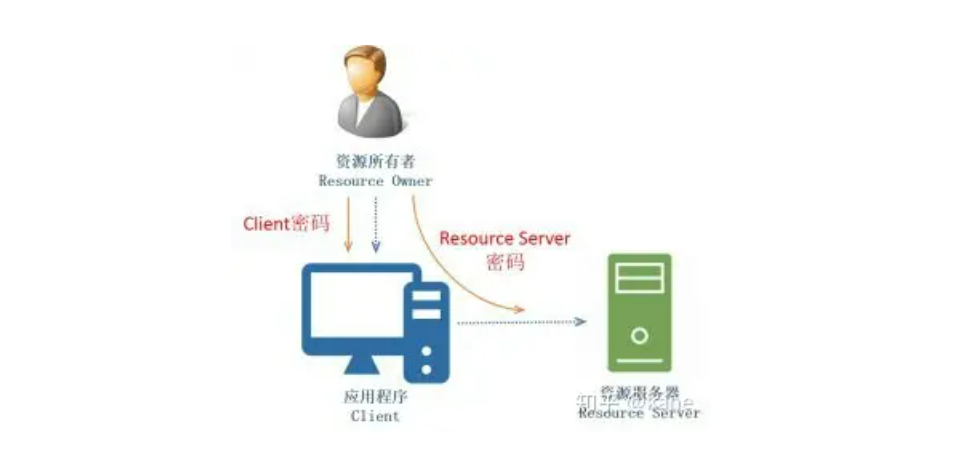
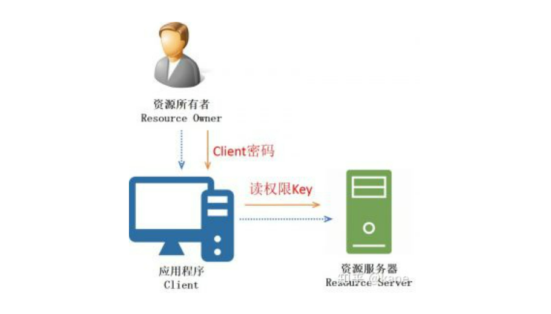
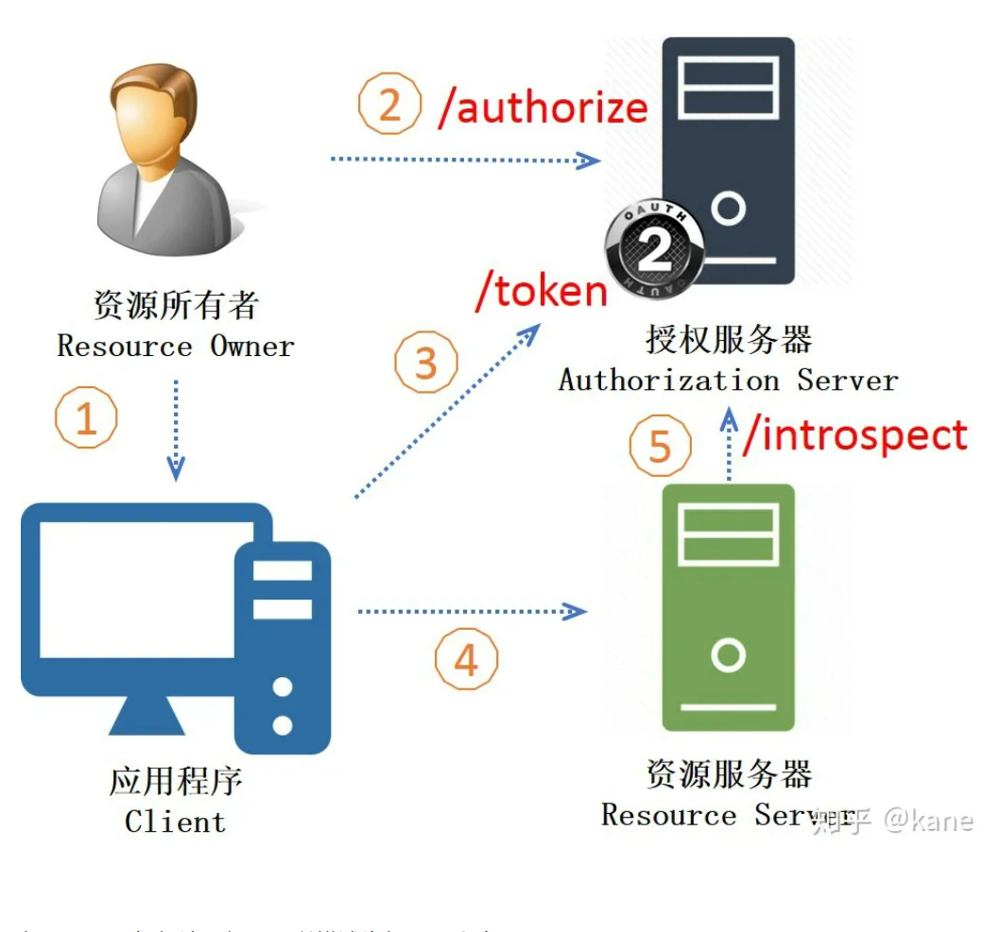
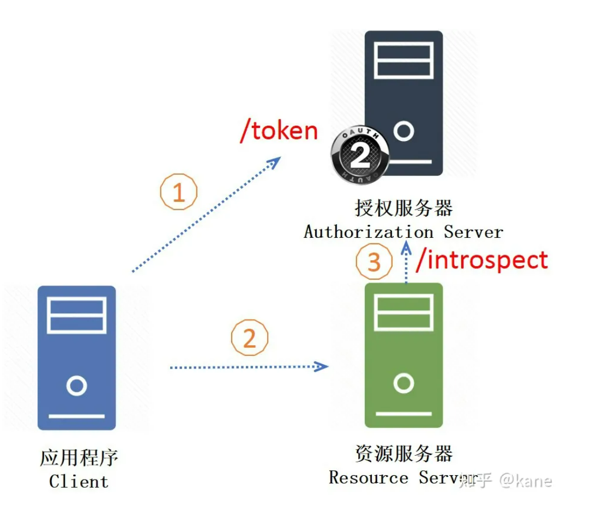
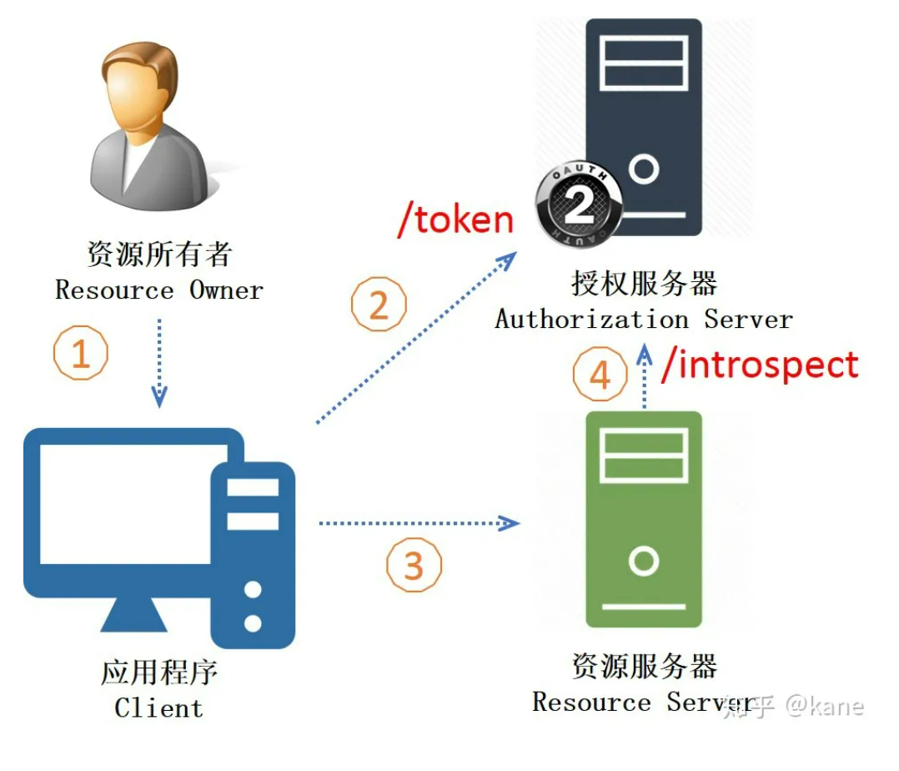
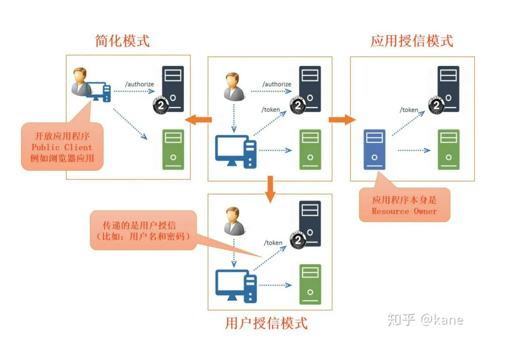
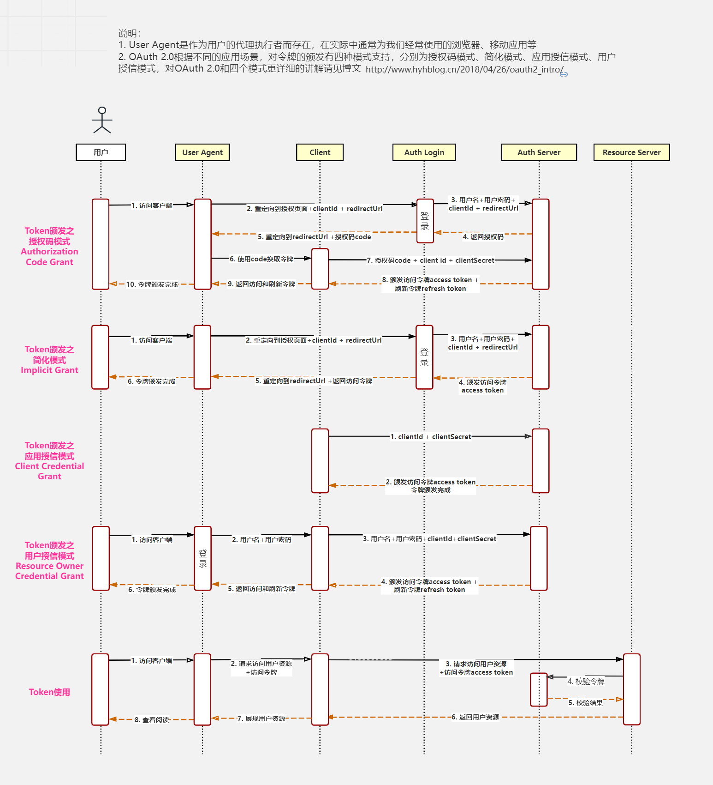

# 📃 理解什么是 oAuth2 协议

[[toc]]

## 1. 认识 OAuth 2.0

[OAuth 2.0](https://link.zhihu.com/?target=https%3A//tools.ietf.org/html/rfc6749)是一个业界标准的授权协议（authorization protocol），这里的授权是以委派代理（delegation）的方式。可以这样理解，OAuth 2.0 提供一种协议交互框架，让某个应用能够以安全地方式获取到用户的委派书，这个委派书在 OAuth 2.0 中就是访问令牌（access token），随后应用便可以使用该委派书，代表用户来访问用户的相关资源。

在 OAuth 2.0 的协议交互中，有四个角色的定义，

- **资源所有者**（Resource Owner）：顾名思义，资源的所有者，很多时候其就是我们普通的自然人（但不限于自然人，如某些应用程序也会创建资源），拥有资源的所有权。
- **资源服务器**（Resource Server）：保存着受保护的用户资源。
- **应用程序**（Client）：准备访问用户资源的应用程序，其可能是一个 web 应用，或是一个后端 web 服务应用，或是一个移动端应用，也或是一个桌面可执行程序。
- **授权服务器**（Authorization Server）：授权服务器，在获取用户的同意授权后，颁发访问令牌给应用程序，以便其获取用户资源。

## 2. 从一个简单的应用场景谈起

为了方便讨论，我们假设有一个用户**Michael**，他在一个资源服务器上保存着他自己的账号信息，例如微信账号的姓名、头像等。某个应用程序在用户登录时，需要获取 Michael 的这些账号信息。

**Michael**在资源服务器上保存的账号信息是受保护的，为了让应用程序能够获取 Michael 的账号信息，需要提供用户的访问密码。有一个简单的方法是，在应用服务器和资源服务器之间共享同一访问密码，当 Michael 登录输入密码后，应用程序复制 Michael 的登录密码并向资源服务器请求访问，获取 Michael 的账号信息。这是早些时候比较常见的跨应用授权访问方法。

这样子做有很大的安全隐患，主要有如下三个方面的问题，

1. **用户在应用程序和资源服务器需要保持一致的密码**
2. **无法控制应用程序的权限，应用程序需要的是读权限，但是拿到用户密码后，获取到的却是用户的所有访问权限**
3. **用户的密码会被应用程序获取到，有用户密码泄露的风险，一旦应用程序多了，安全风险不可控**

在简单的应用场景里，在应用程序和资源服务器之间保持一致的密码是可行的，这也确实能够带来一定的便利，至少用户不用记多套用户名和密码，但账号和密码的独立性无法得到保证，应用程序可以直接接触到用户密码等敏感信息，账号的安全性也无法控制。

为了解决第 1 个问题，用户**Michael**在应用程序和资源服务器可以使用不同的密码登录，有一个可行的方法是，让用户输入两次密码，第一次输入密码为了登录应用程序，第二次让 Michael 输入其在资源服务器的登录密码，以便应用程序获取资源服务器的账号信息。

这样就需要用户输入两次密码，给用户的使用带来很大的不便，而且这个方案依然存在第 2 和第 3 的问题。

为了解决第 2 个问题，限制应用程序访问资源服务器的权限，我们可以让用户在资源服务器申请一个只读的受限密码，该受限密码只用来读取用户信息，无法用来进行编辑和删除操作，用户输入这个只读密码给应用程序，让应用程序读取用户在资源服务器上的信息。

该方法解决第 2 个问题，但再次增加了用户的不便，使得用户不得不面对复杂的密码管理，用户不得不在资源服务器上维护两个密码，一个正常使用的密码和一个只读的受限密码，并且该方法依然没有解决第 3 个问题。

为了解决第 3 个问题，让应用程序不再接触用户在资源服务器的密码，一个可行的办法是，资源服务器直接颁发给应用程序一个读权限的 key，应用程序拿着这个 key 去读取资源服务器的所有用户的信息。

这个方法解决了上述提到的第 3 个问题，但是这个 key 是一个通用的读权限，权限范围很大，其和用户没有任何关联。在很多时候，我们还是需要用户级别上的受限权限控制。

能否有一个方案，在不影响用户的使用便利性，并且颁发一个在用户级别上的可控权限 key？可以考虑的是，用户动态按需地向资源服务器申请读权限 key，然后颁发给应用程序，用于应用程序去申请访问用户的信息，该受限密码在颁发后有一定的时效性，甚至可以指定其只能被使用一次。这样子的话，解决问题 1、2 和 3 的条件都得到满足。

这个方案已经很接近于 OAuth 2.0 在设计之初所提供的授权方案，不一样之处的是，受限密码的颁发交给了独立的安全组件：授权服务器。

这里马上就要介绍 OAuth 2.0 的基本授权方式：**授权码模式**。

## 3. OAuth 2.0 基本授权流程：授权码模式

让我们看看在增加授权服务器之后，OAuth 2.0 的一个基本授权流程，

如图所示，授权流程场景可以描述为如下几个步骤：

1. 用户在应用程序中，应用程序尝试获取用户保存在资源服务器上的信息，比如用户的身份信息和头像，应用程序首先让重定向用户到授权服务器，告知申请资源的读权限，并提供自己的 client id。
2. 到授权服务器，用户输入用户名和密码，服务器对其认证成功后，提示用户即将要颁发一个读权限给应用程序，在用户确认后，授权服务器颁发一个授权码（authorization code）并重定向用户回到应用程序。
3. 应用程序获取到授权码之后，使用这个授权码和自己的 client id/secret 向认证服务器申请访问令牌/刷新令牌（access token/refresh token）。授权服务器对这些信息进行校验，如果一切 OK，则颁发给应用程序访问令牌/刷新令牌。
4. 应用程序在拿到访问令牌之后，向资源服务器申请用户的资源信息
5. 资源服务器在获取到访问令牌后，对令牌进行解析（如果令牌已加密，则需要进行使用相应算法进行解密）并校验，并向授权服务器校验其合法性，如果一起 OK，则返回应用程序所需要的资源信息。

这个授权流程在 OAuth 2 中被称为授权码模式（authorization code grant），其命名的原因是，应用程序使用授权码来向授权服务器申请访问令牌/刷新令牌。

可以看到，在整个过程中应用程序没有接触到用户的密码。

授权码和令牌都是一个唯一标识的值，其各个意义为：

- **授权码：**即用户的委派书，代表着用户的受限权限，有时效性
- **访问令牌：**用于应用程序每次向资源服务器访问时提供，有时效性，如果安全性比较高的话，则每个访问令牌可以被设置为只用一次，或者对令牌设置一个有效期，在有效期可以反复使用。
- **刷新令牌：**用于应用程序向授权服务器申请新的访问令牌，在访问令牌失效或过期的时候，重新获取新的访问令牌。

> 注意的是：
>
> 访问令牌对于应用程序来说是透明的，应用程序无需关注访问令牌所带的任何信息，只需在访问资源服务器时带上它。但是资源服务器需要知道访问令牌的组成和加密方式，资源服务器需要解析或解密这个访问令牌，查看并校验里面的信息。
>
> 授权服务器和访问令牌，前者为授权的颁发，后者为授权的载体，两者实现了动态按需地代理权限分发，这也是 OAuth 2.0 解决方案在授权上所带来的创新变化。

## 4. OAuth 2.0 授权服务的 EndPoint 交互

若要了解 OAuth 2.0 的整个授权交互，则需要对授权服务器所提供的四个重要授权 Endpoint 进行了解

- /authorize：主要用于颁发授权码，在特殊场景下也可直接颁发访问令牌（这里的特殊场景是指简化模式，详情见后面讨论）
- /token：用于颁发访问令牌和刷新令牌
- /introspect：检查令牌的合法性
- /revoke：吊销令牌

授权服务器

EndPoint 授权码模式 请求结果 /authorize GET /authorize?response_type=code&scope=read&client_id=id&redirect_uri&state=xxx HTTP/1.1
Host: localhost 授权码 /token POST /token HTTP/1.1
Host: localhost
Authorization: Basic (client id+secret)
Content-Type: application/x-www-form-urlencoded
grant_type=authorization_code&code=code&redirect_uri=uri 访问令牌/刷新令牌 /introspect POST /introspect HTTP/1.1
Host: localhost
Authorization: Basic (client id+secret)
Content-Type: application/x-www-form-urlencoded
token=123 检查令牌 /revoke POST /revoke HTTP/1.1
Host: localhost
Content-Type: application/x-www-form-urlencoded
Authorization: Basic (client id+secret)
token=123 吊销令牌

## 5. OAuth 2.0 其它授权模式及应用场景

上面讲的 OAuth 2.0 基本授权方式适用于资源所有者和应用程序两个角色都存在的场景下，在现实世界中，往往资源所有者和应用程序两个角色有缺失或者合二为一了，OAuth 2 针对实际的应用场景中提供了不同的授权方式。

### 5.1 Implicit Grant：简化模式

有一种场景需求是这样子的，应用程序运行在用户端，换句话说在网络拓扑上应用程序这个和资源所有者两个角色是合在了一起，比如浏览器 JS 应用程序（In-Browser JavaScript App）就是这样子的应用场景。

如下图所示：

应用程序运行在客户端，一个最大的变化就是其变成了公开应用程序（Public Client），应用程序的运行完全暴露在用户的控制之中。在这种场景下，应用程序是无法隐藏自己的一些敏感数据，比如 client secret 和授权码，在这个方式下，再向授权服务器获取授权码是多此一举。为此**OAuth 2.0 提供简化模式**，授权服务器在校验好用户信息后，直接颁发给应用程序访问资源服务器的访问令牌。换句话说，应用程序在获取访问令牌时无需提供授权码和 client secret。

> 这个授权模式被称为简化模式，其命名的原因主要是由于跳过获取授权码这一中间过程，**无需授权码而可以直接获取访问令牌。**

整个授权流程如下：

1. 用户在应用程序中，应用程序尝试获取用户保存在资源服务器上的信息，比如用户的身份信息和头像，应用程序首先让用户重定向到授权服务器，告知申请资源的读权限，并提供自己的 client id。在重定向的过程中，应用程序指定使用 Implicit Grant 授权方式。
2. 在授权服务器，用户输入用户名和密码，服务器对其认证成功后，提示用户即将要颁发一个读权限给应用程序，在用户确认后，授权服务器直接颁发一个访问令牌并重定向用户回到应用程序。
3. 应用程序在拿到访问令牌之后，向资源服务器申请用户的资源信息
4. 资源服务器在获取到访问令牌后，对令牌进行解析（如果令牌已加密，则需要进行使用相应算法进行解密）并校验，并向授权服务器校验其合法性，如果一起 OK，则返回应用程序所需要的资源信息。

可以看到在简化模式和标准的授权码模式相比，其流程交互简化了很多，**但安全性也是随之降低**，在使用简化模式时，需要考虑安全性降低带来的应用使用问题，**因此，应该尽量在这种模式下提供对安全度要求不高的操作，例如只读操作。**

另外需要注意的是，应用程序从授权服务器获取到了访问令牌，但不需要获取刷新令牌，这是由于在这种使用场景下，用户应该是一直在场，一旦访问令牌过期，只要让用户重新登录一下即可，无需使用刷新令牌来定期更新访问令牌。另外对于浏览器 JS 应用程序，整个会话（session）一般也是短期，不用考虑长时间下使用时令牌刷新机制。

我们看下在简化模式下，授权服务器上 EndPoint 发生的交互流程，

授权服务器
EndPoint 简化模式 请求结果 /authorize GET /authorize?response_type=token&scope=read&client_id=xyz&redirect_uri=uri&state=guid HTTP/1.1
Host: localhost 访问令牌 /token 无 无 /introspect 见授权码模式 检查令牌 /revoke 见授权码模式 吊销令牌

### 5.2 Client Credentials Grant：应用授信模式

应用授信模式主要解决的是在如下两种情况下，

- 资源所有者角色不参与授权交互
- 应用程序角色本身就是资源所有者

如何获取访问令牌的问题。

如下图所示：

整个流程如下：

1. 应用程序尝试获取在资源服务器上的信息，应用程序直接向授权服务器申请访问令牌，告知申请资源的读权限，并提供自己的授信凭证（client id/secret）。在申请请求中，应用程序指定使用 client credentials 授权方式。在授权服务器，服务器对其 client credentials 校验成功后，授权服务器直接颁发一个访问令牌给应用程序。
2. 应用程序在拿到访问令牌之后，向资源服务器申请用户的资源信息
3. 资源服务器在获取到访问令牌后，对令牌进行解析（如果令牌已加密，则需要进行使用相应算法进行解密）并校验，并向授权服务器校验其合法性，如果一起 OK，则返回应用程序所需要的资源信息。

这个授权流程被称为应用授信模式，其命名原因是由于应用程序是通过自己的授信凭证（client id/secret）直接向授权服务器申请访问令牌。这种模式一般用在可信的应用程序。

和简化模式一样，授权服务器无需颁发刷新令牌给应用程序，原因很简单，应用程序想要的话，直接再调用授权服务器一次即可。

我们看下在应用授信模式下，授权服务器上 EndPoint 发生的交互流程，

授权服务器
EndPoint 应用授信模式 请求结果 /authorize 无调用 /token POST /token HTTP/1.1
Host: localhost
Authorization: Basic (client id+secret)
Content-Type: application/x-www-form-urlencoded
grant_type=client_credentials&scope=read 访问令牌 /introspect 见授权码模式 检查令牌 /revoke 见授权码模式 吊销令牌

### 5.3 Resource Owner Credentials Grant：用户授信模式

在基本的授权码模式中，用户需要跳转到授权服务器上，使用用户名和密码登录后拿到授权码，然后把授权码交给应用程序，然后再去申请访问令牌。但有些时候，能否省去这个来回的跳转过程，把用户名和密码直接交给应用程序，让应用程序去申请访问令牌。

这个就是用户授信模式的应用场景，这个场景其实回到了本文中最先提到的授权使用场景，**应用程序有接触到用户的用户名和密码，因此，应用程序必须是完全可信的。**

整个流程如下，

1. 用户在应用程序中，应用程序首先让用户到登录页面输入用户名和密码。
2. 应用程序拿到资源所有者的用户名和密码，加上自己的 client id/secret 一同向认证服务器申请访问令牌/刷新令牌。授权服务器对这些信息进行校验，如果一切 OK，则颁发给应用程序访问令牌/刷新令牌。
3. 应用程序在拿到访问令牌/刷新令牌之后，向资源服务器申请用户的资源信息。
4. 资源服务器在获取到访问令牌后，对令牌进行解析（如果令牌已加密，则需要进行使用相应算法进行解密）并校验，并向授权服务器校验其合法性，如果一起 OK，则返回应用程序所需要的资源信息。

这个授权流程被称为用户授信模式，其命名原因是**由于应用程序是通过用户的授信凭证（比如：用户名和密码）向授权服务器申请访问令牌。**

当应用程序换取到访问令牌之后，从安全的角度考虑，应用程序应该立即删除用户的授信凭证，不再保留。这也是 OAuth 2.0 所建议的安全规范，应用程序不应该通过用户的用户名和密码，而是应该都通过访问令牌去访问资源。

我们看下在用户授信模式下，授权服务器上 EndPoint 发生的交互流程，

授权服务器
EndPoint 用户授信模式 请求结果 /authorize 无调用 /token POST /token HTTP/1.1
Host: localhost
Authorization: Basic (client id+secret)
Content-Type: application/x-www-form-urlencoded
grant_type=password &scope=read&username=Michael&password=secret 获取到访问令牌和刷新令牌 /introspect 见授权码模式 检查令牌 /revoke 见授权码模式 吊销令牌

## 6. 四种授权模式的联系和区别

OAuth 2.0 的四种授权模式，有一定的联系，也有区别。前文也对这些联系和区别做了一些描述，这里做下小结。

无论哪种授权模式，都是以获取访问令牌为目的，访问令牌是各个授权模式交互的最终结果。

我们先比较下各个模式获取访问令牌的手段：

- 授权码模式：授权码+应用的授信凭据
- 简化模式：应用 client id + 用户的授信凭据
- 应用授信模式：应用的授信凭据
- 用户授信模式：应用的授信凭据+用户的授信凭据

> 上面说的，应用的授信凭据是指 client id 和 secret，用户的授信凭据则一般是用户名和密码。

这四种授权模式中，授权码模式是基本的授权模式：

1. 授权码模式：基本授权模式，它需要有四个角色同时在场才能完成授权：资源所有者、应用程序、授权服务器、资源服务器。

其它三种模式可以在其基本的授权码模式上演绎出来：

1. 简化模式：开放应用程序，应用程序运行在公开开放的环境。即：无需应用程序的认证。
2. 应用授信模式：应用程序即为资源所有者，或资源所有者不参与授权交互。即：无资源所有者的认证。
3. 用户授信模式：无授权码的颁发过程，直接通过用户名和密码换取授权。

下图给出了演绎过程：

下表列出四种授权模式在授权服务器上/authorize 和/token 两个 Endpoint 的交互结果，

授权服务器

EndPoint 授权码

模式简化

模式应用授信

模式用户授信

模式/authorize 授权码访问令牌无无/token 访问令牌+刷新令牌无访问令牌访问令牌+刷新令牌最终结果访问令牌+刷新令牌访问令牌访问令牌访问令牌+刷新令牌

表中无的含义是指无交互。各个模式和 Endpoint 的更详细交互信息参见上文。

## 7. 四种授权模式的时序图

下图为四种授权模式在各个角色上的流转时序图，主要包括 token 的颁发和使用流程。

## 8. 如何选择合适 OAuth 2.0 授权方式

面对四种授权方式，在了解 OAuth 2.0 四个角色和流程后，接下来就是为自己的应用场景选择一种授权模式。

简单的话，可以根据下面的流程图来进行参考选择：

图中各个概念的定义说明如下，

1. 资源所有者

- 自然人用户：资源所有者是我们普通的自然人。
- 应用程序：是指当资源的所有者不是我们普通的自然人，而是应用程序，也就是机器。

1. 应用程序类型

- Web 应用：运行在后端 web 服务器上的应用
- 基于 user-agent 的应用：运行在浏览器 JS 应用
- 原生应用：桌面应用，移动应用（安卓和 iOS 应用）

1. 第一方和第三方应用

- 第一方应用：指可信赖的应用，其可以接触用户的密码等敏感信息，应用安全可靠。
- 第三方应用：指由第三方开发的应用，其安全性不受自己控制，需将用户的密码等敏感信息和第三方应用隔离开，颁发令牌给第三方应用，第三方应用凭借令牌访问资源。

## 9. OAuth 2 的安全威胁和考虑

在使用 OAuth 2 之前，有必要了解下 OAuth 在安全性方面的考虑和注意点，比如在授权 endpoints 上需配置 HTTPS，比如为了防止 client 受到 CSRF 攻击，可以在重定向时添加一个 state 标记位，授权服务器在跳转回到 client 时会带回这个 state，由 client 校验该标记位，确认为当前请求为前一个跳转的合法回调，以避免被非法者冒用，等等。

可以通过阅读文档 RFC6749 和 RFC6819 来获取更多详细资料，

1. [RFC6749](https://link.zhihu.com/?target=https%3A//tools.ietf.org/html/rfc6749)：The OAuth 2.0 Authorization Framework 中第 10 章节对 Security Considerations 的描述
2. [RFC6819](https://link.zhihu.com/?target=https%3A//tools.ietf.org/html/rfc6819)：OAuth 2.0 Threat Model and Security Considerations

OAuth 2.0 的更多 RFC 文档列举如下，以便扩展阅读，

1. RFC 6750 - The OAuth 2.0 Authorization Framework: Bearer Token Usage
2. RFC 7009 - OAuth 2.0 Token Revocation
3. RFC 7521 - Assertion Framework for OAuth 2.0 Client Authentication and Authorization Grants
4. RFC 7522 - Security Assertion Markup Language (SAML) 2.0 Profile for OAuth 2.0 Client Authentication and Authorization Grants
5. RFC 7523 - JSON Web Token (JWT) Profile for OAuth 2.0 Client Authentication and Authorization Grants
6. RFC 7591 - OAuth 2.0 Dynamic Client Registration Protocol
7. RFC 7592 - OAuth 2.0 Dynamic Client Registration Management Protocol
8. RFC 7628 - A Set of Simple Authentication and Security Layer (SASL) Mechanisms for OAuth
9. RFC 7636 - Proof Key for Code Exchange by OAuth Public Clients
10. RFC 7662 - OAuth 2.0 Token Introspection

## 10. 文中讨论的术语（中英文对照）

- 授权协议（authorization protocol）
- 委派代理（delegation）
- 资源所有者（resource owner）
- 资源服务器（resource server）
- 应用程序（client）
- 授权服务器（authorization server）
- 访问令牌（access token）
- 刷新令牌（refresh token）
- 授权码（authorization code）
- 开放应用程序（public client）
- 私有应用程序（private client）
- 授权码模式（authorization code grant）
- 简单模式（implicit grant）
- 应用授信模式（client credentials grant）
- 用户授信模式（resource owner credentials grant）
- 浏览器 JS 应用（in-browser JavaScript app）
- 会话（session）
