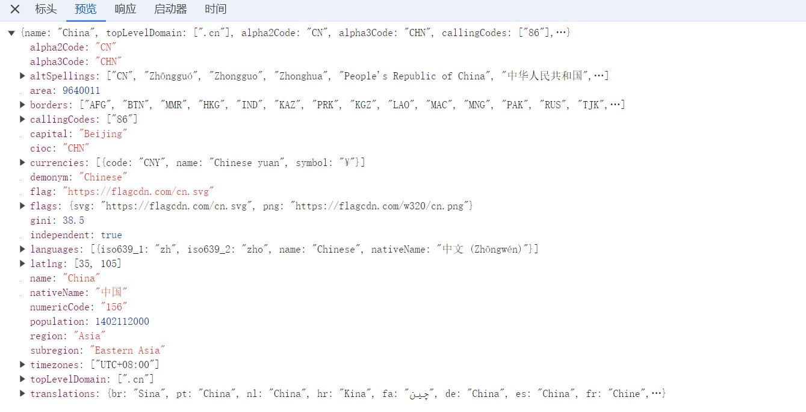
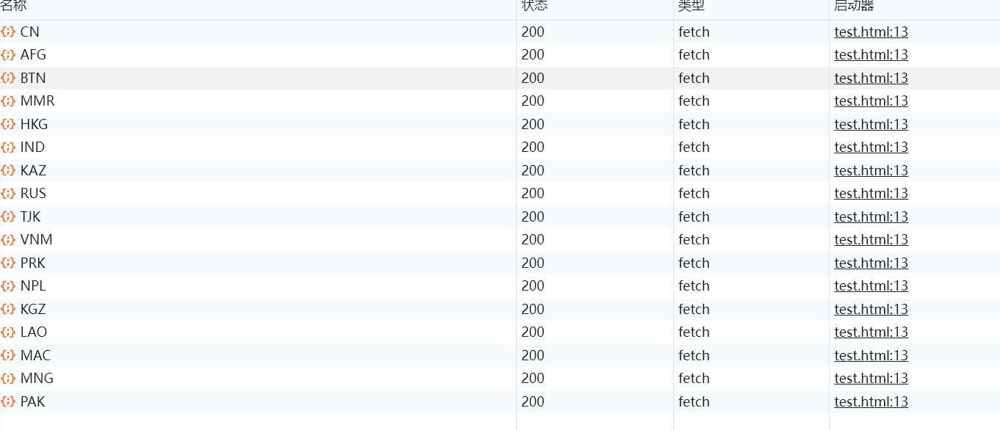

# 🧀详解JS Promise和 Async/Await

<hr/>

[[toc]]

原文：[How to Learn JavaScript Promises and Async/Await in 20 Minutes](https://www.freecodecamp.org/news/learn-promise-async-await-in-20-minutes/)
，作者：[Thu Nghiem](https://www.freecodecamp.org/news/author/thu/)

网络上的很多事情都比较耗时——比如，查询API时，可能需要等一段时间才能获得响应。因此，异步编程对于开发者来说是一项基本技能。

在JavaScript中处理异步操作时，我们经常会听到 "Promise "这个概念。但它的工作原理及使用方法可能会比较抽象和难以理解。

本文与与许多干巴巴的教程不同，将通过实践的方式，帮助你更快速地理解它们的概念和用法。我们将从以下四个示例开始：

- 示例1：用生日解释Promise的基础知识
- 示例2：一个猜数字的游戏
- 示例3：从Web API中获取国家信息
- 示例4：从Web API中获取一个国家的周边国家列表

## 示例1：用生日解释Promise基础知识

首先，我们先来看看Promise的基本形态是什么样的。

Promise执行时分三个状态：pending（执行中）、fulfilled（成功）、rejected（失败）。

```js
new Promise(function (resolve, reject) {
    if (/* 异步操作成功 */) {
        resolve(value); //将Promise的状态由padding改为fulfilled
    } else {
        reject(error); //将Promise的状态由padding改为rejected
    }
})
```

实现时有三个原型方法then、catch、finally

```js
promise
    .then((result) => {
        //promise被接收或拒绝继续执行的情况
    })
    .catch((error) => {
        //promise被拒绝的情况
    })
    .finally(() => {
        //promise完成时，无论如何都会执行的情况
    })
```

基本形态介绍完成了，那么我们下面开始看看下面的示例吧。

用户故事：我的朋友Kayo答应在两周后在我的生日Party上为我做一个蛋糕。

如果一切顺利且Kayo没有生病的话，我们就会获得一定数量的蛋糕，但如果Kayo生病了，我们就没有蛋糕了。但不论有没有蛋糕，我们仍然会开一个生日Party。

所以对于这个示例，我们将如上的背景故事翻译成JS代码，首先让我们先创建一个返回Promise的函数。

```js
const onMyBirthday = (isKayoSick) => {
    return new Promise((resolve, reject) => {
        setTimeout(() => {
            if (!isKayoSick) {
                resolve(2);
            } else {
                reject(new Error("I am sad"));
            }
        }, 2000);
    });
};
```

在JavaScript中，我们可以使用new Promise()创建一个新的Promise，它接受一个参数为：(resolve，reject)=>{} 的函数。

在此函数中，resolve和reject是默认提供的回调函数。让我们仔细看看上面的代码。

当我们运行onMyBirthday函数2000ms后。

- 如果Kayo没有生病，那么我们就以2为参数执行resolve函数
- 如果Kayo生病了，那么我们用new Error("I am sad")作为参数执行reject。尽管您可以将任何要拒绝的内容作为参数传递，但建议将其传递给Error对象。

现在，因为onMyBirthday()返回的是一个Promise，我们可以访问then、catch和finally方法。我们还可以访问早些时候在then和catch中使用传递给resolve和reject的参数。

让我们通过如下代码来理解概念

如果Kayo没有生病

```js
onMyBirthday(false)
    .then((result) => {
        console.log(`I have ${result} cakes`); // 控制台打印“I have 2 cakes”  
    })
    .catch((error) => {
        console.log(error); // 不执行
    })
    .finally(() => {
        console.log("Party"); // 控制台打印“Party”
    });
```

如果Kayo生病

```js
onMyBirthday(true)
    .then((result) => {
        console.log(`I have ${result} cakes`); // 不执行 
    })
    .catch((error) => {
        console.log(error); // 控制台打印“我很难过”
    })
    .finally(() => {
        console.log("Party"); // 控制台打印“Party”
    });
```

相信通过这个例子你能了解Promise的基本概念。

下面我们开始示例2

## 示例2：一个猜数字的游戏

基本需求：

- 用户可以输入任意数字
- 系统从1到6中随机生成一个数字
- 如果用户输入数字等于系统随机数，则给用户2分
- 如果用户输入数字与系统随机数相差1，给用户1分，否则，给用户0分
- 用户想玩多久就玩多久

对于上面的需求，我们首先创建一个enterNumber函数并返回一个Promise：

```js
const enterNumber = () => {
    return new Promise((resolve, reject) => {
        // 从这开始编码
    });
};
```

我们要做的第一件事是向用户索要一个数字，并在1到6之间随机选择一个数字：

```js
const enterNumber = () => {
    return new Promise((resolve, reject) => {
        const userNumber = Number(window.prompt("Enter a number (1 - 6):")); // 向用户索要一个数字
        const randomNumber = Math.floor(Math.random() * 6 + 1); // 选择一个从1到6的随机数
    });
};
```

当用户输入一个不是数字的值。这种情况下，我们调用reject函数，并抛出错误：

```js
const enterNumber = () => {
    return new Promise((resolve, reject) => {
        const userNumber = Number(window.prompt("Enter a number (1 - 6):")); // 向用户索要一个数字
        const randomNumber = Math.floor(Math.random() * 6 + 1); //选择一个从1到6的随机数

        if (isNaN(userNumber)) {
            reject(new Error("Wrong Input Type")); // 当用户输入的值非数字，抛出异常并调用reject函数
        }
    });
};
```

下面，我们需要检查userNumber是否等于RanomNumber，如果相等，我们给用户2分，然后我们可以执行resolve函数来传递一个object {
points: 2, randomNumber } 对象。

如果userNumber与randomNumber相差1，那么我们给用户1分。否则，我们给用户0分。

```js
return new Promise((resolve, reject) => {
    const userNumber = Number(window.prompt("Enter a number (1 - 6):")); // 向用户索要一个数字
    const randomNumber = Math.floor(Math.random() * 6 + 1); // 选择一个从1到6的随机数

    if (isNaN(userNumber)) {
        reject(new Error("Wrong Input Type")); // 当用户输入的值非数字，抛出异常并调用reject函数
    }

    if (userNumber === randomNumber) {
        // 如果相等，我们给用户2分
        resolve({
            points: 2,
            randomNumber,
        });
    } else if (
        userNumber === randomNumber - 1 ||
        userNumber === randomNumber + 1
    ) {
        // 如果userNumber与randomNumber相差1，那么我们给用户1分
        resolve({
            points: 1,
            randomNumber,
        });
    } else {
        // 否则用户得0分
        resolve({
            points: 0,
            randomNumber,
        });
    }
});
```

下面，让我们再创建一个函数来询问用户是否想继续游戏：

```js
const continueGame = () => {
    return new Promise((resolve) => {
        if (window.confirm("Do you want to continue?")) { // 向用户询问是否要继续游戏
            resolve(true);
        } else {
            resolve(false);
        }
    });
};
```

为了不使游戏强制结束，我们创建的Promise没有使用Reject回调。

下面，我们创建一个函数来处理猜数字逻辑：

```js
const handleGuess = () => {
    enterNumber() // 返回一个Promise对象
        .then((result) => {
            alert(`Dice: ${result.randomNumber}: you got ${result.points} points`); // 当resolve运行时，我们得到用户得分和随机数 

            // 向用户询问是否要继续游戏
            continueGame().then((result) => {
                if (result) {
                    handleGuess(); // If yes, 游戏继续
                } else {
                    alert("Game ends"); // If no, 弹出游戏结束框
                }
            });
        })
        .catch((error) => alert(error));
};

handleGuess(); // 执行handleGuess 函数
```

在这当我们调用handleGuess函数时，enterNumber()返回一个Promise对象。

如果Promise状态为resolved，我们就调用then方法，向用户告知竞猜结果与得分，并向用户询问是否要继续游戏。

如果Promise状态为rejected，我们将显示一条用户输入错误的信息。

不过，这样的代码虽然能解决问题，但读起来还是有点困难。让我们后面将使用async/await 对hanldeGuess进行重构。

网上对于 async/await 的解释已经很多了，在这我想用一个简单概括的说法来解释：**async/await就是可以把复杂难懂的异步代码变成类同步语法的语法糖
**。

下面开始看重构后代码吧：

```js
const handleGuess = async () => {
    try {
        const result = await enterNumber(); // 代替then方法，我们只需将await放在promise前，就可以直接获得结果

        alert(`Dice: ${result.randomNumber}: you got ${result.points} points`);

        const isContinuing = await continueGame();

        if (isContinuing) {
            handleGuess();
        } else {
            alert("Game ends");
        }
    } catch (error) { // catch 方法可以由try, catch函数来替代
        alert(error);
    }
};
```

通过在函数前使用async关键字，我们创建了一个异步函数，在函数内的使用方法较之前有如下不同：

- 和then函数不同，我们只需将await关键字放在Promise前，就可以直接获得结果。
- 我们可以使用try, catch语法来代替promise中的catch方法。

下面是我们重构后的完整代码，供参考：

```js
const enterNumber = () => {
    return new Promise((resolve, reject) => {
        const userNumber = Number(window.prompt("Enter a number (1 - 6):")); // 向用户索要一个数字
        const randomNumber = Math.floor(Math.random() * 6 + 1); // 系统随机选取一个1-6的数字

        if (isNaN(userNumber)) {
            reject(new Error("Wrong Input Type")); // 如果用户输入非数字抛出错误
        }

        if (userNumber === randomNumber) { // 如果用户猜数字正确，给用户2分
            resolve({
                points: 2,
                randomNumber,
            });
        } else if (
            userNumber === randomNumber - 1 ||
            userNumber === randomNumber + 1
        ) { // 如果userNumber与randomNumber相差1，那么我们给用户1分
            resolve({
                points: 1,
                randomNumber,
            });
        } else { // 不正确，得0分
            resolve({
                points: 0,
                randomNumber,
            });
        }
    });
};

const continueGame = () => {
    return new Promise((resolve) => {
        if (window.confirm("Do you want to continue?")) { // 向用户询问是否要继续游戏
            resolve(true);
        } else {
            resolve(false);
        }
    });
};

const handleGuess = async () => {
    try {
        const result = await enterNumber(); // await替代了then函数

        alert(`Dice: ${result.randomNumber}: you got ${result.points} points`);

        const isContinuing = await continueGame();

        if (isContinuing) {
            handleGuess();
        } else {
            alert("Game ends");
        }
    } catch (error) { // catch 方法可以由try, catch函数来替代
        alert(error);
    }
};

handleGuess(); // 执行handleGuess 函数
```

我们已经完成了第二个示例，接下来让我们开始看看第三个示例。

## 示例3：从Web API中获取国家信息

一般当从API中获取数据时，开发人员会经常使用Promises。如果在新窗口打开https:
//restcountries.com/v2/alpha/cn，你会看到JSON格式的国家数据。

通过使用[Fetch API](https://developer.mozilla.org/en-US/docs/Web/API/Fetch_API/Using_Fetch)，我们可以很轻松的获得数据，以下是代码：

```js
const fetchData = async () => {
    const res = await fetch("https://restcountries.com/v2/alpha/cn"); // Fetch()返回一个promise，所以我们需要等待它

    const country = await res.json(); // res现在只是一个HTTP响应，所以我们需要调用res.json()

    console.log(country); // 中国的数据将被记录到开发控制台
};

fetchData();
```

现在我们获得了所需的国家/地区数据，让我们转到最后一项任务。

## 示例4：从Web API中获取一个国家的周边国家列表

下面的fetchCountry函数从示例3中的api获得国家信息，其中的参数alpha3Code 是代指该国家的国家代码，以下是代码

```js
// Task 4: 获得中国周边的邻国信息
const fetchCountry = async (alpha3Code) => {
    try {
        const res = await fetch(
            `https://restcountries.com/v2/alpha/${alpha3Code}`
        );

        const data = await res.json();

        return data;
    } catch (error) {
        console.log(error);
    }
};
```

下面让我们创建一个fetchCountryAndNeighbors函数，通过传递cn作为alpha3code来获取中国的信息。

```js
const fetchCountryAndNeighbors = async () => {
    const china = await fetchCountry("cn");

    console.log(china);
};

fetchCountryAndNeighbors();
```

在控制台中，我们看看对象内容：



在对象中，有一个border属性，它是中国周边邻国的alpha3codes列表。

现在，如果我们尝试通过以下方式获取邻国信息。

```js
const neighbors =
    china.borders.map((border) => fetchCountry(border));
```

neighbors是一个Promise对象的数组。

当处理一个数组的Promise时，我们需要使用Promise.all。

```js
const fetchCountryAndNeigbors = async () => {
    const china = await fetchCountry("cn");

    const neighbors = await Promise.all(
        china.borders.map((border) => fetchCountry(border))
    );

    console.log(neighbors);
};

fetchCountryAndNeigbors();
```

在控制台中，我们应该能够看到国家/地区对象列表。



以下是示例4的所有代码，供您参考：

```js
const fetchCountry = async (alpha3Code) => {
    try {
        const res = await fetch(
            `https://restcountries.com/v2/alpha/${alpha3Code}`
        );
        const data = await res.json();
        return data;
    } catch (error) {
        console.log(error);
    }
};

const fetchCountryAndNeigbors = async () => {
    const china = await fetchCountry("cn");
    const neighbors = await Promise.all(
        china.borders.map((border) => fetchCountry(border))
    );
    console.log(neighbors);
};

fetchCountryAndNeigbors();
```

